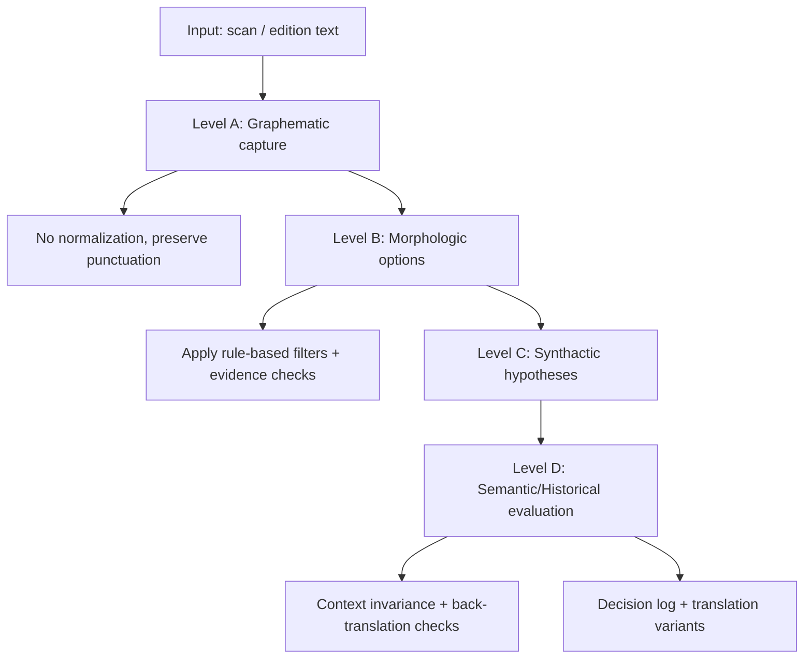

# Workspace Compendium

_Generated: 2026-01-17 02:46 UTC_

This file is generated. Edit the section files in `docs/compendium_sections/` or the source docs/configs, then re-run the build script.

## docs/compendium_sections/00_overview.md

# Overview

This file is part of the Workspace Compendium build. The compendium is a
single-file export that consolidates structure, workflows, workers, scripts,
APIs, configs, and timeline logic into one Markdown document.

Regenerate:
`python engine/tools/build_workspace_compendium.py`

The build script merges:
- These section files in `docs/compendium_sections/`.
- Full snapshots of key docs and config files.
- Auto-generated inventories of workers, scripts, workflows, and configs.

Large binary assets (images, PDFs, and generated media) are not embedded. Their
locations are documented in the structure and inventory sections.

## docs/compendium_sections/10_structure.md

# Structure Notes

Top-level layout:
- `engine/`: tools, workers, scripts, workflows, and configs.
- `stories/`: story data, templates, filmsets, and subject assets.
- `docs/`: long-form documentation, indices, and reference notes.
- Hard-state (append-only): `STATE.md`, `ARCHITECTURE.md`, `CONSTRAINTS.md`.

Story template core:
- `stories/template/config/`: timeline profiles + story_config.json.
- `stories/template/filmsets/`: chapter/segment/scene outputs.
- `stories/template/subjects/`: registry, profiles, asset bible, and timeline states.
- `stories/template/data/`: analysis, queues, and derived artifacts.

External workspaces:
- The registry is `engine/config/workspaces.json`.
- Use `engine/launchers/Start-Workspaces.ps1` to open or start them.

## Directory Counts

- `stories/template/filmsets`: 11743 files
- `stories/template/subjects`: 4860 files
- `stories/template/subjects/timelines`: 4840 files
- `stories/template/data`: 1048 files

## Engine workers

- `engine/workers/analysis_master_builder.py`
- `engine/workers/analyze_entities.py`
- `engine/workers/animate_md_target.py`
- `engine/workers/animgraph_client.py`
- `engine/workers/asset_architect.py`
- `engine/workers/asset_bible_builder.py`
- `engine/workers/asset_bible_enricher.py`
- `engine/workers/asset_bible_queue_builder.py`
- `engine/workers/asset_registry_builder.py`
- `engine/workers/audio_agent.py`
- `engine/workers/audio_audit_worker.py`
- `engine/workers/avatar_worker.py`
- `engine/workers/capture_library_builder.py`
- `engine/workers/cc_headshot_enqueue.py`
- `engine/workers/cc_inspect.py`
- `engine/workers/cc_save_actor.py`
- `engine/workers/chapter_briefing_builder.py`
- `engine/workers/check_comfy_loras.py`
- `engine/workers/collect_asset_bible.py`
- `engine/workers/comfy_orchestrator.py`
- `engine/workers/distribute_assets.py`
- `engine/workers/distribute_chapter_assets.py`
- `engine/workers/distribute_reference_images.py`
- `engine/workers/distribute_scene_assets.py`
- `engine/workers/download_ethiopic_enoch.py`
- `engine/workers/download_reference_images.py`
- `engine/workers/drehbuch.py`
- `engine/workers/drehbuch_gemini.py`
- `engine/workers/drehbuch_neu.py`
- `engine/workers/env_audit_worker.py`
- `engine/workers/ethiopic_1enoch_p/merge_clean.py`
- `engine/workers/extract_72_direct.py`
- `engine/workers/extract_actor_props.py`
- `engine/workers/extract_geez_verses_from_pdf.py`
- `engine/workers/facesync_worker.py`
- `engine/workers/foley_worker.py`
- `engine/workers/geez_morphology_filter.py`
- `engine/workers/generate.py`
- `engine/workers/generate_assets.py`
- `engine/workers/generate_chapter_assets.py`
- `engine/workers/generate_chapter_assets_startimages.py`
- `engine/workers/generate_lora_prompts.py`
- `engine/workers/harvest_evolution.py`
- `engine/workers/harvest_existing_data.py`
- `engine/workers/hybrid_composite_worker.py`
- `engine/workers/iclone_lipsync_runner.py`
- `engine/workers/iclone_remote_client.py`
- `engine/workers/lora_audit_worker.py`
- `engine/workers/lora_dynamic_queue_builder.py`
- `engine/workers/lora_index_builder.py`
- `engine/workers/lora_pipeline_builder.py`
- `engine/workers/maxine_pose_adapter.py`
- `engine/workers/md_record_sequence.py`
- `engine/workers/migrate_filmsets_label.py`
- `engine/workers/old/extract_and_merge.py`
- `engine/workers/old/extract_enoch_all.py`
- `engine/workers/old/extract_enoch_chapters_from_json.py`
- `engine/workers/old/extract_henoch_final.py`
- `engine/workers/old/scan_headers.py`
- `engine/workers/old/scan_headers_v2.py`
- `engine/workers/parseitdirty.py`
- `engine/workers/pose_bvh_importer.py`
- `engine/workers/pose_catalog_builder.py`
- `engine/workers/pose_keypoints_importer.py`
- `engine/workers/pose_matcher.py`
- `engine/workers/prepare_lora_queue.py`
- `engine/workers/prepare_prop_queue.py`
- `engine/workers/progress_lock.py`
- `engine/workers/prop_audit_worker.py`
- `engine/workers/queue_actor_from_csv.py`
- `engine/workers/rag_indexer.py`
- `engine/workers/rag_indexer_folder.py`
- `engine/workers/rag_query.py`
- `engine/workers/rag_utils.py`
- `engine/workers/reallusion_library_indexer.py`
- `engine/workers/regie_context_injector.py`
- `engine/workers/regie_preflight_check.py`
- `engine/workers/regie_worker.py`
- `engine/workers/repair_harvest_errors.py`
- `engine/workers/scene_audit_worker.py`
- `engine/workers/scene_header_fixer.py`
- `engine/workers/scene_instruction_builder.py`
- `engine/workers/scene_layout_builder.py`
- `engine/workers/scene_preflight_check.py`
- `engine/workers/screenplay_sanitizer.py`
- `engine/workers/segment_self_healer.py`
- `engine/workers/server.py`
- `engine/workers/setup_environment_folders.py`
- `engine/workers/setup_filmsets_from_geez.py`
- `engine/workers/stt_worker.py`
- `engine/workers/subject_registry_builder.py`
- `engine/workers/subjects_from_geez.py`
- `engine/workers/sync_environment_labels.py`
- `engine/workers/test_iclone_remote.py`
- `engine/workers/test_md_config.py`
- `engine/workers/train_lora_worker.py`
- `engine/workers/verse_count_audit.py`
- `engine/workers/vertex_gemini.py`
- `engine/workers/vertex_gemini_smoke_test.py`
- `engine/workers/vision_audit_worker.py`
- `engine/workers/visionexe_paths.py`
- `engine/workers/voice_cast_builder.py`
- `engine/workers/worker_llm_analysis.py`
- `engine/workers/worker_llm_analysis_Morphologic.py`
- `engine/workers/worker_llm_analysis_graphematic.py`
- `engine/workers/worker_llm_analysis_semantic-historical.py`
- `engine/workers/worker_llm_analysis_synthactic.py`
- `engine/workers/worker_rule_filter.py`
- `engine/workers/worker_tests.py`
- `engine/workers/zeta_worker.py`

## Engine scripts

- `engine/scripts/Linguistic_quad_worker.ps1`
- `engine/scripts/audio_agent_redefine.ps1`
- `engine/scripts/ethiopic_1enoch_p/merge_clean.ps1`
- `engine/scripts/load_actors.ps1`
- `engine/scripts/run_all_chapters.ps1`
- `engine/scripts/run_all_chapters_gemini.ps1`
- `engine/scripts/run_audio_agent.ps1`
- `engine/scripts/run_chapter_timeline.ps1`
- `engine/scripts/run_md_plan.ps1`
- `engine/scripts/run_missing_chapters.ps1`
- `engine/scripts/run_rag.ps1`
- `engine/scripts/run_rag_all.ps1`
- `engine/scripts/run_rag_small.ps1`
- `engine/scripts/run_regie_audio.ps1`
- `engine/scripts/run_regie_fix.ps1`
- `engine/scripts/run_scene_header_fixer.ps1`
- `engine/scripts/run_screenplay_sanitizer.ps1`
- `engine/scripts/run_subject_image_queue.ps1`
- `engine/scripts/run_subjects_view.ps1`
- `engine/scripts/start_comfyui314wsl.ps1`
- `engine/scripts/start_diffusion_pipe.ps1`
- `engine/scripts/start_scout_deck.ps1`
- `engine/scripts/start_tts.ps1`

## Engine launchers

- `engine/launchers/Deploy-CleanPlugin.ps1`
- `engine/launchers/Install-iCloneOpenPlugin.ps1`
- `engine/launchers/Set-iCloneEnv.ps1`
- `engine/launchers/Start-Workspaces.ps1`

## Engine tools

- `engine/tools/blender_joint_mapper.py`
- `engine/tools/build_workspace_compendium.py`
- `engine/tools/rlpy_api_finder.py`
- `engine/tools/rlpy_wiki_compat.py`

## Workflows

- `engine/workflows/2flux_schnell.json`
- `engine/workflows/Flux_img2img.json`
- `engine/workflows/Qwen_edit_multiple_view_api.json`
- `engine/workflows/REALISM-makes_anything_real.json`
- `engine/workflows/TEXT_TO_IMG.json`
- `engine/workflows/TEXT_TO_IMG_multilora.json`
- `engine/workflows/flux_schnell.json`
- `engine/workflows/hidreamfast.json`
- `engine/workflows/image_qwen_image_edit_2509_relight.json`
- `engine/workflows/image_qwen_image_layered.json`
- `engine/workflows/juggernaut.json`
- `engine/workflows/juggernaut_multi.json`
- `engine/workflows/load image from path and set count name images with numbers the first number gets taken first thats the background then layerwise to front (1).json`
- `engine/workflows/templates-1_click_multiple_character_angles-v1.0.json`
- `engine/workflows/templates-1_click_multiple_scene_angles-v1.0.json`
- `engine/workflows/templates-6-key-frames.json`
- `engine/workflows/wan22_image.json`
- `engine/workflows/wan22_image1.json`
- `engine/workflows/wan22_image_dif.json`
- `engine/workflows/zimage.json`
- `engine/workflows/zimages.json`

## Analysis rules

- `engine/analysis/rules/__init__.py`
- `engine/analysis/rules/rule_engine.py`
- `engine/analysis/rules/rules_affix_consistency.py`
- `engine/analysis/rules/rules_context_invariance.py`
- `engine/analysis/rules/rules_evidence_minimum.py`
- `engine/analysis/rules/rules_function_words.py`
- `engine/analysis/rules/rules_pos_inventory.py`
- `engine/analysis/rules/rules_root_pattern.py`

## External Workspaces (registry summary)

- `post_production`: Post Production Stack | host=windows | category=post | apis=none | start=none
- `qwen_image_to_lora`: Qwen Image to LoRA | host=wsl | category=lora | apis=gradio:http://127.0.0.1:7860 | start=source .venv/bin/activate && python app.py --port 7860
- `comfyui_py314`: ComfyUI Py314 | host=wsl | category=image | apis=http:http://127.0.0.1:8188 | start=conda activate py314 && python main.py
- `diffusion_pipe`: Diffusion Pipe | host=wsl | category=image | apis=gradio:http://127.0.0.1:7860 | start=none
- `liveportrait`: LivePortrait | host=wsl | category=video | apis=none | start=none
- `sadtalker`: SadTalker | host=wsl | category=video | apis=none | start=none
- `wan2gp`: Wan2GP (Hunyuan Video Avatar) | host=wsl | category=video | apis=none | start=none
- `audiophil`: Audiophil | host=wsl | category=audio | apis=fastapi:http://127.0.0.1:8000 | start=none
- `chatterbox`: Chatterbox TTS | host=wsl | category=audio | apis=fastapi:http://127.0.0.1:8000 | start=none
- `chatterbox_turbo_demo`: Chatterbox Turbo Demo | host=wsl | category=audio | apis=none | start=none
- `audio_editing`: Audio Editing | host=wsl | category=audio | apis=none | start=none
- `tts_local`: Local TTS/STT Pipeline | host=wsl | category=audio | apis=none | start=none

## Config Snapshots

### engine/config/ace_skeleton_joint_paths.json
```json
[
  "Root",
  "Root/Hips",
  "Root/Hips/Spine1",
  "Root/Hips/Spine1/Spine2",
  "Root/Hips/Spine1/Spine2/Chest",
  "Root/Hips/Spine1/Spine2/Chest/Neck1",
  "Root/Hips/Spine1/Spine2/Chest/Neck1/Neck2",
  "Root/Hips/Spine1/Spine2/Chest/Neck1/Neck2/Head",
  "Root/Hips/Spine1/Spine2/Chest/Neck1/Neck2/Head/HeadEnd",
  "Root/Hips/Spine1/Spine2/Chest/Neck1/Neck2/Head/Jaw",
  "Root/Hips/Spine1/Spine2/Chest/Neck1/Neck2/Head/LeftEye",
  "Root/Hips/Spine1/Spine2/Chest/Neck1/Neck2/Head/RightEye",
  "Root/Hips/Spine1/Spine2/Chest/LeftShoulder",
  "Root/Hips/Spine1/Spine2/Chest/LeftShoulder/LeftArm",
  "Root/Hips/Spine1/Spine2/Chest/LeftShoulder/LeftArm/LeftForeArm",
  "Root/Hips/Spine1/Spine2/Chest/LeftShoulder/LeftArm/LeftForeArm/LeftHand",
  "Root/Hips/Spine1/Spine2/Chest/LeftShoulder/LeftArm/LeftForeArm/LeftHand/LeftHandThumb1",
  "Root/Hips/Spine1/Spine2/Chest/LeftShoulder/LeftArm/LeftForeArm/LeftHand/LeftHandThumb1/LeftHandThumb2",
  "Root/Hips/Spine1/Spine2/Chest/LeftShoulder/LeftArm/LeftForeArm/LeftHand/LeftHandThumb1/LeftHandThumb2/LeftHandThumb3",
  "Root/Hips/Spine1/Spine2/Chest/LeftShoulder/LeftArm/LeftForeArm/LeftHand/LeftHandThumb1/LeftHandThumb2/LeftHandThumb3/LeftHandThumbEnd",
  "Root/Hips/Spine1/Spine2/Chest/LeftShoulder/LeftArm/LeftForeArm/LeftHand/LeftHandIndex1",
  "Root/Hips/Spine1/Spine2/Chest/LeftShoulder/LeftArm/LeftForeArm/LeftHand/LeftHandIndex1/LeftHandIndex2",
  "Root/Hips/Spine1/Spine2/Chest/LeftShoulder/LeftArm/LeftForeArm/LeftHand/LeftHandIndex1/LeftHandIndex2/LeftHandIndex3",
  "Root/Hips/Spine1/Spine2/Chest/LeftShoulder/LeftArm/LeftForeArm/LeftHand/LeftHandIndex1/LeftHandIndex2/LeftHandIndex3/LeftHandIndex4",
  "Root/Hips/Spine1/Spine2/Chest/LeftShoulder/LeftArm/LeftForeArm/LeftHand/LeftHandIndex1/LeftHandIndex2/LeftHandIndex3/LeftHandIndex4/LeftHandIndexEnd",
  "Root/Hips/Spine1/Spine2/Chest/LeftShoulder/LeftArm/LeftForeArm/LeftHand/LeftHandMiddle1",
  "Root/Hips/Spine1/Spine2/Chest/LeftShoulder/LeftArm/LeftForeArm/LeftHand/LeftHandMiddle1/LeftHandMiddle2",
  "Root/Hips/Spine1/Spine2/Chest/LeftShoulder/LeftArm/LeftForeArm/LeftHand/LeftHandMiddle1/LeftHandMiddle2/LeftHandMiddle3",
  "Root/Hips/Spine1/Spine2/Chest/LeftShoulder/LeftArm/LeftForeArm/LeftHand/LeftHandMiddle1/LeftHandMiddle2/LeftHandMiddle3/LeftHandMiddle4",
  "Root/Hips/Spine1/Spine2/Chest/LeftShoulder/LeftArm/LeftForeArm/LeftHand/LeftHandMiddle1/LeftHandMiddle2/LeftHandMiddle3/LeftHandMiddle4/LeftHandMiddleEnd",
  "Root/Hips/Spine1/Spine2/Chest/LeftShoulder/LeftArm/LeftForeArm/LeftHand/LeftHandRing1",
  "Root/Hips/Spine1/Spine2/Chest/LeftShoulder/LeftArm/LeftForeArm/LeftHand/LeftHandRing1/LeftHandRing2",
  "Root/Hips/Spine1/Spine2/Chest/LeftShoulder/LeftArm/LeftForeArm/LeftHand/LeftHandRing1/LeftHandRing2/LeftHandRing3",
  "Root/Hips/Spine1/Spine2/Chest/LeftShoulder/LeftArm/LeftForeArm/LeftHand/LeftHandRing1/LeftHandRing2/LeftHandRing3/LeftHandRing4",
  "Root/Hips/Spine1/Spine2/Chest/LeftShoulder/LeftArm/LeftForeArm/LeftHand/LeftHandRing1/LeftHandRing2/LeftHandRing3/LeftHandRing4/LeftHandRingEnd",
  "Root/Hips/Spine1/Spine2/Chest/LeftShoulder/LeftArm/LeftForeArm/LeftHand/LeftHandPinky1",
  "Root/Hips/Spine1/Spine2/Chest/LeftShoulder/LeftArm/LeftForeArm/LeftHand/LeftHandPinky1/LeftHandPinky2",
  "Root/Hips/Spine1/Spine2/Chest/LeftShoulder/LeftArm/LeftForeArm/LeftHand/LeftHandPinky1/LeftHandPinky2/LeftHandPinky3",
  "Root/Hips/Spine1/Spine2/Chest/LeftShoulder/LeftArm/LeftForeArm/LeftHand/LeftHandPinky1/LeftHandPinky2/LeftHandPinky3/LeftHandPinky4",
  "Root/Hips/Spine1/Spine2/Chest/LeftShoulder/LeftArm/LeftForeArm/LeftHand/LeftHandPinky1/LeftHandPinky2/LeftHandPinky3/LeftHandPinky4/LeftHandPinkyEnd",
  "Root/Hips/Spine1/Spine2/Chest/RightShoulder",
  "Root/Hips/Spine1/Spine2/Chest/RightShoulder/RightArm",
  "Root/Hips/Spine1/Spine2/Chest/RightShoulder/RightArm/RightForeArm",
  "Root/Hips/Spine1/Spine2/Chest/RightShoulder/RightArm/RightForeArm/RightHand",
  "Root/Hips/Spine1/Spine2/Chest/RightShoulder/RightArm/RightForeArm/RightHand/RightHandThumb1",
  "Root/Hips/Spine1/Spine2/Chest/RightShoulder/RightArm/RightForeArm/RightHand/RightHandThumb1/RightHandThumb2",
  "Root/Hips/Spine1/Spine2/Chest/RightShoulder/RightArm/RightForeArm/RightHand/RightHandThumb1/RightHandThumb2/RightHandThumb3",
  "Root/Hips/Spine1/Spine2/Chest/RightShoulder/RightArm/RightForeArm/RightHand/RightHandThumb1/RightHandThumb2/RightHandThumb3/RightHandThumbEnd",
  "Root/Hips/Spine1/Spine2/Chest/RightShoulder/RightArm/RightForeArm/RightHand/RightHandIndex1",
  "Root/Hips/Spine1/Spine2/Chest/RightShoulder/RightArm/RightForeArm/RightHand/RightHandIndex1/RightHandIndex2",
  "Root/Hips/Spine1/Spine2/Chest/RightShoulder/RightArm/RightForeArm/RightHand/RightHandIndex1/RightHandIndex2/RightHandIndex3",
  "Root/Hips/Spine1/Spine2/Chest/RightShoulder/RightArm/RightForeArm/RightHand/RightHandIndex1/RightHandIndex2/RightHandIndex3/RightHandIndex4",
  "Root/Hips/Spine1/Spine2/Chest/RightShoulder/RightArm/RightForeArm/RightHand/RightHandIndex1/RightHandIndex2/RightHandIndex3/RightHandIndex4/RightHandIndexEnd",
  "Root/Hips/Spine1/Spine2/Chest/RightShoulder/RightArm/RightForeArm/RightHand/RightHandMiddle1",
  "Root/Hips/Spine1/Spine2/Chest/RightShoulder/RightArm/RightForeArm/RightHand/RightHandMiddle1/RightHandMiddle2",
  "Root/Hips/Spine1/Spine2/Chest/RightShoulder/RightArm/RightForeArm/RightHand/RightHandMiddle1/RightHandMiddle2/RightHandMiddle3",
  "Root/Hips/Spine1/Spine2/Chest/RightShoulder/RightArm/RightForeArm/RightHand/RightHandMiddle1/RightHandMiddle2/RightHandMiddle3/RightHandMiddle4",
  "Root/Hips/Spine1/Spine2/Chest/RightShoulder/RightArm/RightForeArm/RightHand/RightHandMiddle1/RightHandMiddle2/RightHandMiddle3/RightHandMiddle4/RightHandMiddleEnd",
  "Root/Hips/Spine1/Spine2/Chest/RightShoulder/RightArm/RightForeArm/RightHand/RightHandRing1",
  "Root/Hips/Spine1/Spine2/Chest/RightShoulder/RightArm/RightForeArm/RightHand/RightHandRing1/RightHandRing2",
  "Root/Hips/Spine1/Spine2/Chest/RightShoulder/RightArm/RightForeArm/RightHand/RightHandRing1/RightHandRing2/RightHandRing3",
  "Root/Hips/Spine1/Spine2/Chest/RightShoulder/RightArm/RightForeArm/RightHand/RightHandRing1/RightHandRing2/RightHandRing3/RightHandRing4",
  "Root/Hips/Spine1/Spine2/Chest/RightShoulder/RightArm/RightForeArm/RightHand/RightHandRing1/RightHandRing2/RightHandRing3/RightHandRing4/RightHandRingEnd",
  "Root/Hips/Spine1/Spine2/Chest/RightShoulder/RightArm/RightForeArm/RightHand/RightHandPinky1",
  "Root/Hips/Spine1/Spine2/Chest/RightShoulder/RightArm/RightForeArm/RightHand/RightHandPinky1/RightHandPinky2",
  "Root/Hips/Spine1/Spine2/Chest/RightShoulder/RightArm/RightForeArm/RightHand/RightHandPinky1/RightHandPinky2/RightHandPinky3",
  "Root/Hips/Spine1/Spine2/Chest/RightShoulder/RightArm/RightForeArm/RightHand/RightHandPinky1/RightHandPinky2/RightHandPinky3/RightHandPinky4",
  "Root/Hips/Spine1/Spine2/Chest/RightShoulder/RightArm/RightForeArm/RightHand/RightHandPinky1/RightHandPinky2/RightHandPinky3/RightHandPinky4/RightHandPinkyEnd",
  "Root/Hips/LeftLeg",
  "Root/Hips/LeftLeg/LeftShin",
  "Root/Hips/LeftLeg/LeftShin/LeftFoot",
  "Root/Hips/LeftLeg/LeftShin/LeftFoot/LeftToeBase",
  "Root/Hips/LeftLeg/LeftShin/LeftFoot/LeftToeBase/LeftToeEnd",
  "Root/Hips/RightLeg",
  "Root/Hips/RightLeg/RightShin",
  "Root/Hips/RightLeg/RightShin/RightFoot",
  "Root/Hips/RightLeg/RightShin/RightFoot/RightToeBase",
  "Root/Hips/RightLeg/RightShin/RightFoot/RightToeBase/RightToeEnd"
]
```

### engine/config/analysis_master.schema.json
```json
{
  "description": "Analysis master index (JSONL records).",
  "required": [
    "source_id",
    "source_path",
    "chapter",
    "segment_label",
    "segment_type"
  ],
  "fields": {
    "source_id": "Stable identifier derived from source_path or row index.",
    "source_path": "Original source path or reference string from the CSV.",
    "chapter": "Chapter number (int) or label.",
    "segment_index": "Numeric segment index when available.",
    "segment_label": "Filesystem label (e.g., segment_001).",
    "segment_type": "Semantic label (verse/paragraph/scene/segment).",
    "scene_index": "Numeric scene index when available.",
    "scene_label": "Scene label when available (e.g., scene_001).",
    "source_index": "Row index in the source CSV (1-based).",
    "summary": "Short summary if available.",
    "analysis_blocks": "Parsed JSON blocks from LLM output (optional).",
    "analysis_layers": "Parsed analysis layer payloads (graphematic/morphologic/synthactic/semantic_historical) per segment (optional).",
    "analysis_paths": "Matched analysis file paths (optional).",
    "raw_content": "Raw LLM output (optional).",
    "meta": "Extra metadata (optional)."
  }
}
```

### engine/config/audio_audit_config.json
```json
{
  "audio_dir": "audio",
  "media_dir": "Media",
  "require_voice_if_words_max": true,
  "require_monologue_if_words_max": true,
  "require_voice_json": false,
  "check_facesync_outputs": true,
  "check_gbuffer_outputs": true,
  "require_narration_if_present": true
}
```

### engine/config/audio_voice_profiles.json
```json
{
  "version": "1.0",
  "defaults": {
    "lufs_target": -16,
    "sample_rate": 48000,
    "channel_mode": "mono"
  },
  "tts_defaults": {
    "model": "mtl",
    "language_id": "de",
    "temperature": 0.8,
    "top_p": 0.95,
    "top_k": 1000,
    "repetition_penalty": 1.2,
    "min_p": 0.0,
    "exaggeration": 0.5,
    "cfg_weight": 0.5,
    "norm_loudness": true,
    "n_variations": 1,
    "seed_base": null
  },
  "profiles": {
    "henoch": {
      "tts_provider": "elevenlabs",
      "voice_id": "old_prophet_v2",
      "style": "elder_male_calm_emotional",
      "fx_chain": ["close_mic_dry", "low_mid_boost"],
      "notes": "Internal monologue",
      "tts": {
        "model": "turbo",
        "speaker_id": null
      }
    },
    "azazel": {
      "tts_provider": "elevenlabs",
      "voice_id": "whisper_siren_m",
      "style": "seductive_whisper_hiss",
      "fx_chain": ["subtle_pitch_shift", "slapback_delay"],
      "notes": "Low, tempting, slightly unstable",
      "tts": {
        "model": "mtl",
        "speaker_id": null
      }
    },
    "michael": {
      "tts_provider": "local_tts",
      "voice_id": "admin_male_1",
      "style": "authoritative_timeless",
      "fx_chain": ["metallic_hall", "light_chorus"],
      "notes": "Security admin voice",
      "tts": {
        "model": "turbo",
        "speaker_id": null
      }
    },
    "gabriel": {
      "tts_provider": "local_tts",
      "voice_id": "admin_male_2",
      "style": "authoritative_timeless",
      "fx_chain": ["metallic_hall", "light_chorus"],
      "notes": "Security admin voice",
      "tts": {
        "model": "turbo",
        "speaker_id": null
      }
    },
    "uriel": {
      "tts_provider": "local_tts",
      "voice_id": "admin_male_3",
      "style": "authoritative_timeless",
      "fx_chain": ["metallic_hall", "light_chorus"],
      "notes": "Security admin voice",
      "tts": {
        "model": "turbo",
        "speaker_id": null
      }
    },
    "system_admin": {
      "tts_provider": "local_tts",
      "voice_id": "kernel_female_neutral",
      "style": "synthetic_neutral",
      "fx_chain": ["no_room_reverb", "bitcrush_line_end"],
      "notes": "OS voice",
      "tts": {
        "model": "mtl",
        "speaker_id": null
      }
    },
    "kernel": {
      "tts_provider": "local_tts",
      "voice_id": "kernel_female_neutral",
      "style": "synthetic_neutral",
      "fx_chain": ["no_room_reverb", "bitcrush_line_end"],
      "notes": "OS voice",
      "tts": {
        "model": "mtl",
        "speaker_id": null
      }
    },
    "timearchitect": {
      "tts_provider": "local_tts",
      "voice_id": "metronome_male",
      "style": "precise_rhythmic",
      "fx_chain": ["tempo_echo_sync"],
      "notes": "Tempo-locked delivery",
      "tts": {
        "model": "mtl",
        "speaker_id": null
      }
    }
  }
}
```

### engine/config/engine_config.json
```json
{
  "default_llm_profile": "ollama_local",
  "llm_profiles_path": "engine/config/llm_profiles.json",
  "workspaces_path": "engine/config/workspaces.json",
  "workflow_catalog_path": "engine/config/workflow_catalog.json",
  "default_story_root": "stories/template"
}
```

### engine/config/env_audit_config.json
```json
{
  "mapping_csv": "Environments/mapping.csv",
  "output_root": "produced_assets",
  "fallback_env_root": "Environments",
  "image_exts": [
    ".png",
    ".jpg",
    ".jpeg",
    ".webp"
  ]
}
```

### engine/config/gez_function_words.json
```json
{
  "list_id": "GEZ-FUNC-1",
  "version": "1.0.0",
  "description": "Surface-form function words for Ge'ez filtering (extend per corpus).",
  "function_words": [
    {
      "surface": "ወ",
      "allowed_pos": [
        "CONJ.COORD",
        "CLIT.CONJ"
      ],
      "note": "and"
    },
    {
      "surface": "ዘ",
      "allowed_pos": [
        "PART.REL",
        "PRO.REL"
      ],
      "note": "relative marker"
    },
    {
      "surface": "እለ",
      "allowed_pos": [
        "PRO.REL"
      ],
      "note": "relative pronoun (plural)"
    },
    {
      "surface": "እም",
      "allowed_pos": [
        "PREP",
        "CLIT.PREP"
      ],
      "note": "from/out of"
    },
    {
      "surface": "ለ",
      "allowed_pos": [
        "PREP",
        "CLIT.PREP"
      ],
      "note": "to/for"
    },
    {
      "surface": "በ",
      "allowed_pos": [
        "PREP",
        "CLIT.PREP"
      ],
      "note": "in/with/by"
    },
    {
      "surface": "እንዘ",
      "allowed_pos": [
        "CONJ.SUB"
      ],
      "note": "while/when"
    }
  ]
}
```

### engine/config/gez_morphology.schema.json
```json
{
  "$schema": "https://json-schema.org/draft/2020-12/schema",
  "$id": "https://visionexe.local/schema/gez-analysis-1.0.0",
  "title": "Ge'ez Analysis Artifact",
  "type": "object",
  "required": ["meta", "source", "tokens"],
  "additionalProperties": false,
  "properties": {
    "meta": {
      "type": "object",
      "required": ["schema_version", "created_at", "created_by", "language", "tagset_id"],
      "additionalProperties": false,
      "properties": {
        "schema_version": { "type": "string", "pattern": "^1\\.0\\.0$" },
        "created_at": { "type": "string", "format": "date-time" },
        "created_by": { "type": "string" },
        "language": { "type": "string", "enum": ["gez"] },
        "tagset_id": { "type": "string" },
        "tokenization_policy": { "type": "string" },
        "model_calls": {
          "type": "array",
          "items": {
            "type": "object",
            "required": ["stage", "provider", "model", "temperature", "prompt_version"],
            "additionalProperties": false,
            "properties": {
              "stage": { "type": "string" },
              "provider": { "type": "string", "enum": ["ollama", "gemini", "none"] },
              "model": { "type": "string" },
              "temperature": { "type": "number" },
              "seed": { "type": ["integer", "null"] },
              "prompt_version": { "type": "string" },
              "duration_sec": { "type": ["number", "null"] },
              "response_sha256": { "type": ["string", "null"] }
            }
          }
        },
        "notes": { "type": "string" }
      }
    },
    "source": {
      "type": "object",
      "required": ["witness_id", "graphematic_string", "normalization_policy"],
      "additionalProperties": false,
      "properties": {
        "witness_id": { "type": "string" },
        "graphematic_string": { "type": "string" },
        "normalization_policy": {
          "type": "string",
          "enum": ["none", "unicode_nfc_only", "nfc_plus_whitespace_normalization"]
        },
        "punctuation_markers": { "type": "array", "items": { "type": "string" } },
        "removed_artifacts": { "type": "array", "items": { "type": "string" } },
        "uncertainties": {
          "type": "array",
          "items": { "$ref": "#/$defs/uncertainty" }
        }
      }
    },
    "tokens": {
      "type": "array",
      "minItems": 1,
      "items": { "$ref": "#/$defs/token" }
    },
    "syntax": {
      "type": "object",
      "additionalProperties": false,
      "properties": {
        "parses": {
          "type": "array",
          "items": {
            "type": "object",
            "required": ["id", "structure_type"],
            "additionalProperties": false,
            "properties": {
              "id": { "type": "string" },
              "structure_type": { "type": "string" },
              "bracket_notation": { "type": "string" },
              "dependencies": { "type": "array", "items": { "type": "string" } },
              "notes": { "type": "string" }
            }
          }
        }
      }
    },
    "semantic": {
      "type": "object",
      "additionalProperties": false,
      "properties": {
        "evaluation": {
          "type": "array",
          "items": {
            "type": "object",
            "required": ["hypothesis_ref", "plausibility"],
            "additionalProperties": false,
            "properties": {
              "hypothesis_ref": { "type": "string" },
              "plausibility": { "type": "string" },
              "reasoning": { "type": "string" },
              "parallels": {
                "type": "array",
                "items": {
                  "type": "object",
                  "required": ["ref"],
                  "additionalProperties": false,
                  "properties": {
                    "ref": { "type": "string" },
                    "note": { "type": "string" }
                  }
                }
              },
              "context_invariance": { "type": "string" },
              "back_translation": { "type": "string" }
            }
          }
        },
        "final_decision": {
          "type": "object",
          "additionalProperties": false,
          "properties": {
            "hypothesis_ref": { "type": "string" },
            "translation_id": { "type": "string" },
            "confidence": { "type": "string" }
          }
        },
        "decision_log": { "type": "string" }
      }
    },
    "translation_space": {
      "type": "object",
      "additionalProperties": false,
      "properties": {
        "variants": {
          "type": "array",
          "items": {
            "type": "object",
            "required": ["id", "text", "parse_ref", "token_map"],
            "additionalProperties": false,
            "properties": {
              "id": { "type": "string" },
              "text": { "type": "string" },
              "parse_ref": { "type": "string" },
              "token_map": {
                "type": "array",
                "items": {
                  "type": "object",
                  "required": ["token_id", "option_id"],
                  "additionalProperties": false,
                  "properties": {
                    "token_id": { "type": "string" },
                    "option_id": { "type": "string" }
                  }
                }
              },
              "notes": { "type": "string" }
            }
          }
        }
      }
    },
    "tests": {
      "type": "object",
      "additionalProperties": false,
      "properties": {
        "context_invariance": { "type": "object" },
        "back_translation": { "type": "object" },
        "reproducibility": { "type": "object" }
      }
    },
    "decision_log": {
      "type": "array",
      "items": {
        "type": "object",
        "required": ["step", "action"],
        "additionalProperties": false,
        "properties": {
          "step": { "type": "string" },
          "action": { "type": "string" },
          "rationale": { "type": "string" },
          "refs": { "type": "array", "items": { "type": "string" } }
        }
      }
    }
  },
  "$defs": {
    "span": {
      "type": "object",
      "required": ["start", "end"],
      "additionalProperties": false,
      "properties": {
        "start": { "type": "integer", "minimum": 0 },
        "end": { "type": "integer", "minimum": 0 }
      }
    },
    "uncertainty": {
      "type": "object",
      "required": ["span", "type", "note"],
      "additionalProperties": false,
      "properties": {
        "span": { "$ref": "#/$defs/span" },
        "type": {
          "type": "string",
          "enum": ["damaged", "illegible", "editorial_restoration", "variant_reading"]
        },
        "candidates": { "type": "array", "items": { "type": "string" } },
        "note": { "type": "string" }
      }
    },
    "morpheme": {
      "type": "object",
      "required": ["morph_id", "surface", "type"],
      "additionalProperties": false,
      "properties": {
        "morph_id": { "type": "string" },
        "surface": { "type": "string" },
        "type": {
          "type": "string",
          "enum": ["prefix", "stem", "suffix", "clitic", "particle"]
        }
      }
    },
    "token": {
      "type": "object",
      "required": ["token_id", "surface", "span", "options"],
      "additionalProperties": false,
      "properties": {
        "token_id": { "type": "string", "pattern": "^t\\d+$" },
        "surface": { "type": "string" },
        "span": { "$ref": "#/$defs/span" },
        "segmentation": {
          "type": "object",
          "additionalProperties": false,
          "properties": {
            "morphemes": {
              "type": "array",
              "items": { "$ref": "#/$defs/morpheme" }
            }
          }
        },
        "options": {
          "type": "array",
          "minItems": 1,
          "items": { "$ref": "#/$defs/option" }
        }
      }
    },
    "option": {
      "type": "object",
      "required": ["option_id", "pos", "analysis", "confidence", "evidence"],
      "additionalProperties": false,
      "properties": {
        "option_id": { "type": "string" },
        "pos": { "type": "string" },
        "analysis": {
          "type": "object",
          "required": ["kind"],
          "additionalProperties": false,
          "properties": {
            "kind": { "type": "string", "enum": ["lexical", "functional"] },
            "root": { "type": ["string", "null"] },
            "lemma": { "type": ["string", "null"] },
            "pattern": { "type": ["string", "null"] },
            "affixes": {
              "type": "object",
              "additionalProperties": false,
              "properties": {
                "prefixes": { "type": "array", "items": { "type": "string" } },
                "suffixes": { "type": "array", "items": { "type": "string" } },
                "clitics": { "type": "array", "items": { "type": "string" } }
              }
            },
            "features": {
              "type": "object",
              "additionalProperties": { "type": ["string", "number", "boolean", "null"] }
            },
            "gloss": { "type": ["string", "null"] }
          }
        },
        "confidence": {
          "type": "object",
          "required": ["type"],
          "additionalProperties": false,
          "properties": {
            "type": {
              "type": "string",
              "enum": ["undecided", "weak", "moderate", "strong", "ruled_out"]
            },
            "score": { "type": ["number", "null"], "minimum": 0, "maximum": 1 }
          }
        },
        "evidence": {
          "type": "object",
          "required": ["lexicon_status", "attestation"],
          "additionalProperties": false,
          "properties": {
            "lexicon_status": {
              "type": "string",
              "enum": ["attested_in_lexicon", "attested_in_corpus_not_lexicon", "unattested"]
            },
            "attestation": {
              "type": "array",
              "items": {
                "type": "object",
                "required": ["type", "ref"],
                "additionalProperties": false,
                "properties": {
                  "type": { "type": "string", "enum": ["lexicon", "corpus", "edition"] },
                  "ref": { "type": "string" },
                  "quote_span": { "$ref": "#/$defs/span" }
                }
              }
            },
            "constraints_checked": { "type": "array", "items": { "type": "string" } },
            "notes": { "type": "string" }
          }
        }
      }
    }
  }
}
```

### engine/config/gez_pos_tagset.json
```json
{
  "tagset_id": "GEZ-POS-1",
  "version": "1.0.0",
  "description": "POS tagset and function words for Ge'ez morphology.",
  "tags": [
    { "tag": "N", "category": "lexical", "description": "Noun" },
    { "tag": "PN", "category": "lexical", "description": "Proper noun" },
    { "tag": "ADJ", "category": "lexical", "description": "Adjective" },
    { "tag": "V", "category": "lexical", "description": "Verb" },
    { "tag": "ADV", "category": "lexical", "description": "Adverb" },
    { "tag": "NUM", "category": "lexical", "description": "Numeral" },
    { "tag": "PRO.PERS", "category": "pronoun", "description": "Personal pronoun" },
    { "tag": "PRO.DEM", "category": "pronoun", "description": "Demonstrative pronoun" },
    { "tag": "PRO.REL", "category": "pronoun", "description": "Relative pronoun" },
    { "tag": "PRO.INT", "category": "pronoun", "description": "Interrogative pronoun" },
    { "tag": "PRO.INDEF", "category": "pronoun", "description": "Indefinite pronoun" },
    { "tag": "PREP", "category": "function", "description": "Preposition" },
    { "tag": "CONJ.COORD", "category": "function", "description": "Coordinating conjunction" },
    { "tag": "CONJ.SUB", "category": "function", "description": "Subordinating conjunction" },
    { "tag": "PART.NEG", "category": "function", "description": "Negation particle" },
    { "tag": "PART.MOD", "category": "function", "description": "Modal particle" },
    { "tag": "PART.FOC", "category": "function", "description": "Focus particle" },
    { "tag": "PART.REL", "category": "function", "description": "Relative marker particle" },
    { "tag": "DET", "category": "function", "description": "Determiner" },
    { "tag": "AUX", "category": "function", "description": "Auxiliary / copula" },
    { "tag": "CLIT.PRON", "category": "clitic", "description": "Pronominal clitic" },
    { "tag": "CLIT.CONJ", "category": "clitic", "description": "Conjunction clitic" },
    { "tag": "CLIT.PREP", "category": "clitic", "description": "Preposition clitic" }
  ],
  "lexical_tags": ["N", "PN", "ADJ", "V", "ADV", "NUM"],
  "pronoun_tags": ["PRO.PERS", "PRO.DEM", "PRO.REL", "PRO.INT", "PRO.INDEF"],
  "function_word_tags": [
    "PREP",
    "CONJ.COORD",
    "CONJ.SUB",
    "PART.NEG",
    "PART.MOD",
    "PART.FOC",
    "PART.REL",
    "DET",
    "AUX"
  ],
  "clitic_tags": ["CLIT.PRON", "CLIT.CONJ", "CLIT.PREP"],
  "function_words": [
    { "surface": "ወ", "allowed_pos": ["CONJ.COORD", "CLIT.CONJ"], "note": "and" },
    { "surface": "ዘ", "allowed_pos": ["PART.REL", "PRO.REL"], "note": "relative marker" },
    { "surface": "እለ", "allowed_pos": ["PRO.REL"], "note": "relative pronoun (plural)" },
    { "surface": "እም", "allowed_pos": ["PREP", "CLIT.PREP"], "note": "from/out of" },
    { "surface": "ለ", "allowed_pos": ["PREP", "CLIT.PREP"], "note": "to/for" },
    { "surface": "በ", "allowed_pos": ["PREP", "CLIT.PREP"], "note": "in/with/by" },
    { "surface": "እንዘ", "allowed_pos": ["CONJ.SUB"], "note": "while/when" }
  ]
}
```

### engine/config/image_qwen_image.json
```json
{
  "id": "91f6bbe2-ed41-4fd6-bac7-71d5b5864ecb",
  "revision": 0,
  "last_node_id": 77,
  "last_link_id": 133,
  "nodes": [
    {
      "id": 3,
      "type": "KSampler",
      "pos": [
        850,
        120
      ],
      "size": [
        300,
        474
      ],
      "flags": {},
      "order": 13,
      "mode": 0,
      "inputs": [
        {
          "name": "model",
          "type": "MODEL",
          "link": 125
        },
        {
          "name": "positive",
          "type": "CONDITIONING",
          "link": 46
        },
        {
          "name": "negative",
          "type": "CONDITIONING",
          "link": 52
        },
        {
          "name": "latent_image",
          "type": "LATENT",
          "link": 107
        }
      ],
      "outputs": [
        {
          "name": "LATENT",
          "type": "LATENT",
          "slot_index": 0,
          "links": [
            128
          ]
        }
      ],
      "properties": {
        "cnr_id": "comfy-core",
        "ver": "0.3.48",
        "Node name for S&R": "KSampler",
        "enableTabs": false,
        "tabWidth": 65,
        "tabXOffset": 10,
        "hasSecondTab": false,
        "secondTabText": "Send Back",
        "secondTabOffset": 80,
        "secondTabWidth": 65,
        "ue_properties": {
          "version": "7.5.1",
          "widget_ue_connectable": {},
          "input_ue_unconnectable": {}
        }
      },
      "widgets_values": [
        634420508054315,
        "randomize",
        4,
        1,
        "euler",
        "simple",
        1
      ]
    },
    {
      "id": 6,
      "type": "CLIPTextEncode",
      "pos": [
        390,
        240
      ],
      "size": [
        422.84503173828125,
        164.31304931640625
      ],
      "flags": {},
      "order": 10,
      "mode": 0,
      "inputs": [
        {
          "name": "clip",
          "type": "CLIP",
          "link": 74
        }
      ],
      "outputs": [
        {
          "name": "CONDITIONING",
          "type": "CONDITIONING",
          "slot_index": 0,
          "links": [
            46
          ]
        }
      ],
      "title": "CLIP Text Encode (Positive Prompt)",
      "properties": {
        "cnr_id": "comfy-core",
        "ver": "0.3.48",
        "Node name for S&R": "CLIPTextEncode",
        "enableTabs": false,
        "tabWidth": 65,
        "tabXOffset": 10,
        "hasSecondTab": false,
        "secondTabText": "Send Back",
        "secondTabOffset": 80,
        "secondTabWidth": 65,
        "ue_properties": {
          "version": "7.5.1",
          "widget_ue_connectable": {},
          "input_ue_unconnectable": {}
        }
      },
      "widgets_values": [
        "*   **The High-Fidelity Prototype (Vers 2-5):** Noah wird mit weißem Haar, roter Haut und leuchtenden Augen geboren. In *exeget:os* ist Noah der **„Alpha-Build 2.0“**. Während die Menschheit (Woche 7) korrumpiert und „gedimmt“ ist, injiziert der Kernel eine neue Hardware-Spezifikation. Noah ist physisch in der Lage, direkt mit dem Kernel zu kommunizieren (*ተናገረ፡ለእግዚአ - er sprach zum Herrn*), sobald er instanziiert wurde.\n"
      ],
      "color": "#232",
      "bgcolor": "#353"
    },
    {
      "id": 7,
      "type": "CLIPTextEncode",
      "pos": [
        390,
        440
      ],
      "size": [
        425.27801513671875,
        180.6060791015625
      ],
      "flags": {},
      "order": 11,
      "mode": 0,
      "inputs": [
        {
          "name": "clip",
          "type": "CLIP",
          "link": 75
        }
      ],
      "outputs": [
        {
          "name": "CONDITIONING",
          "type": "CONDITIONING",
          "slot_index": 0,
          "links": [
            52
          ]
        }
      ],
      "title": "CLIP Text Encode (Negative Prompt)",
      "properties": {
        "cnr_id": "comfy-core",
        "ver": "0.3.48",
        "Node name for S&R": "CLIPTextEncode",
        "enableTabs": false,
        "tabWidth": 65,
        "tabXOffset": 10,
        "hasSecondTab": false,
        "secondTabText": "Send Back",
        "secondTabOffset": 80,
        "secondTabWidth": 65,
        "ue_properties": {
          "version": "7.5.1",
          "widget_ue_connectable": {},
          "input_ue_unconnectable": {}
        }
      },
      "widgets_values": [
        ""
      ],
      "color": "#322",
      "bgcolor": "#533"
    },
    {
      "id": 8,
      "type": "VAEDecode",
      "pos": [
        1170,
        -90
      ],
      "size": [
        210,
        46
      ],
      "flags": {
        "collapsed": false
      },
      "order": 14,
      "mode": 0,
      "inputs": [
        {
          "name": "samples",
          "type": "LATENT",
          "link": 128
        },
        {
          "name": "vae",
          "type": "VAE",
          "link": 131
        }
      ],
      "outputs": [
        {
          "name": "IMAGE",
          "type": "IMAGE",
          "slot_index": 0,
          "links": [
            110
          ]
        }
      ],
      "properties": {
        "cnr_id": "comfy-core",
        "ver": "0.3.48",
        "Node name for S&R": "VAEDecode",
        "enableTabs": false,
        "tabWidth": 65,
        "tabXOffset": 10,
        "hasSecondTab": false,
        "secondTabText": "Send Back",
        "secondTabOffset": 80,
        "secondTabWidth": 65,
        "ue_properties": {
          "version": "7.5.1",
          "widget_ue_connectable": {},
          "input_ue_unconnectable": {}
        }
      },
      "widgets_values": []
    },
    {
      "id": 37,
      "type": "UNETLoader",
      "pos": [
        20,
        50
      ],
      "size": [
        330,
        90
      ],
      "flags": {},
      "order": 2,
      "mode": 0,
      "inputs": [],
      "outputs": [
        {
          "name": "MODEL",
          "type": "MODEL",
          "slot_index": 0,
          "links": [
            129
          ]
        }
      ],
      "properties": {
        "cnr_id": "comfy-core",
        "ver": "0.3.48",
        "Node name for S&R": "UNETLoader",
        "models": [
          {
            "name": "qwen_image_fp8_e4m3fn.safetensors",
            "url": "https://huggingface.co/Comfy-Org/Qwen-Image_ComfyUI/resolve/main/split_files/diffusion_models/qwen_image_fp8_e4m3fn.safetensors",
            "directory": "diffusion_models"
          }
        ],
        "enableTabs": false,
        "tabWidth": 65,
        "tabXOffset": 10,
        "hasSecondTab": false,
        "secondTabText": "Send Back",
        "secondTabOffset": 80,
        "secondTabWidth": 65,
        "ue_properties": {
          "version": "7.5.1",
          "widget_ue_connectable": {},
          "input_ue_unconnectable": {}
        }
      },
      "widgets_values": [
        "qwen_image_fp8_e4m3fn.safetensors",
        "default"
      ]
    },
    {
      "id": 38,
      "type": "CLIPLoader",
      "pos": [
        20,
        190
      ],
      "size": [
        330,
        110
      ],
      "flags": {},
      "order": 7,
      "mode": 0,
      "inputs": [],
      "outputs": [
        {
          "name": "CLIP",
          "type": "CLIP",
          "slot_index": 0,
          "links": [
            74,
            75
          ]
        }
      ],
      "properties": {
        "cnr_id": "comfy-core",
        "ver": "0.3.48",
        "Node name for S&R": "CLIPLoader",
        "models": [
          {
            "name": "qwen_2.5_vl_7b_fp8_scaled.safetensors",
            "url": "https://huggingface.co/Comfy-Org/Qwen-Image_ComfyUI/resolve/main/split_files/text_encoders/qwen_2.5_vl_7b_fp8_scaled.safetensors",
            "directory": "text_encoders"
          }
        ],
        "enableTabs": false,
        "tabWidth": 65,
        "tabXOffset": 10,
        "hasSecondTab": false,
        "secondTabText": "Send Back",
        "secondTabOffset": 80,
        "secondTabWidth": 65,
        "ue_properties": {
          "version": "7.5.1",
          "widget_ue_connectable": {},
          "input_ue_unconnectable": {}
        }
      },
      "widgets_values": [
        "qwen_2.5_vl_7b_fp8_scaled.safetensors",
        "qwen_image",
        "default"
      ]
    },
    {
      "id": 58,
      "type": "EmptySD3LatentImage",
      "pos": [
        50,
        510
      ],
      "size": [
        270,
        106
      ],
      "flags": {},
      "order": 6,
      "mode": 0,
      "inputs": [],
      "outputs": [
        {
          "name": "LATENT",
          "type": "LATENT",
          "links": [
            107
          ]
        }
      ],
      "properties": {
        "cnr_id": "comfy-core",
        "ver": "0.3.48",
        "Node name for S&R": "EmptySD3LatentImage",
        "enableTabs": false,
        "tabWidth": 65,
        "tabXOffset": 10,
        "hasSecondTab": false,
        "secondTabText": "Send Back",
        "secondTabOffset": 80,
        "secondTabWidth": 65,
        "ue_properties": {
          "version": "7.5.1",
          "widget_ue_connectable": {},
          "input_ue_unconnectable": {}
        }
      },
      "widgets_values": [
        368,
        800,
        1
      ]
    },
    {
      "id": 60,
      "type": "SaveImage",
      "pos": [
        1170,
        10
      ],
      "size": [
        490,
        600
      ],
      "flags": {},
      "order": 15,
      "mode": 0,
      "inputs": [
        {
          "name": "images",
          "type": "IMAGE",
          "link": 110
        }
      ],
      "outputs": [],
      "properties": {
        "cnr_id": "comfy-core",
        "ver": "0.3.48",
        "Node name for S&R": "SaveImage",
        "enableTabs": false,
        "tabWidth": 65,
        "tabXOffset": 10,
        "hasSecondTab": false,
        "secondTabText": "Send Back",
        "secondTabOffset": 80,
        "secondTabWidth": 65,
        "ue_properties": {
          "version": "7.5.1",
          "widget_ue_connectable": {},
          "input_ue_unconnectable": {}
        }
      },
      "widgets_values": [
        "ComfyUI"
      ]
    },
    {
      "id": 66,
      "type": "ModelSamplingAuraFlow",
      "pos": [
        850,
        10
      ],
      "size": [
        300,
        58
      ],
      "flags": {},
      "order": 12,
      "mode": 0,
      "inputs": [
        {
          "name": "model",
          "type": "MODEL",
          "link": 130
        }
      ],
      "outputs": [
        {
          "name": "MODEL",
          "type": "MODEL",
          "links": [
            125
          ]
        }
      ],
      "properties": {
        "cnr_id": "comfy-core",
        "ver": "0.3.48",
        "Node name for S&R": "ModelSamplingAuraFlow",
        "enableTabs": false,
        "tabWidth": 65,
        "tabXOffset": 10,
        "hasSecondTab": false,
        "secondTabText": "Send Back",
        "secondTabOffset": 80,
        "secondTabWidth": 65,
        "ue_properties": {
          "version": "7.5.1",
          "widget_ue_connectable": {},
          "input_ue_unconnectable": {}
        }
      },
      "widgets_values": [
        3.1000000000000005
      ]
    },
    {
      "id": 67,
      "type": "MarkdownNote",
      "pos": [
        -540,
        10
      ],
      "size": [
        540,
        630
      ],
      "flags": {},
      "order": 5,
      "mode": 0,
      "inputs": [],
      "outputs": [],
      "title": "Model links",
      "properties": {
        "ue_properties": {
          "version": "7.5.1",
          "widget_ue_connectable": {},
          "input_ue_unconnectable": {}
        }
      },
      "widgets_values": [
        "[Tutorial](https://docs.comfy.org/tutorials/image/qwen/qwen-image) \n\n## Model links\n\nYou can find all the models on [Huggingface](https://huggingface.co/Comfy-Org/Qwen-Image_ComfyUI/tree/main) or [Modelscope](https://modelscope.cn/models/Comfy-Org/Qwen-Image_ComfyUI/files)\n\n**Diffusion model**\n\n- [qwen_image_fp8_e4m3fn.safetensors](https://huggingface.co/Comfy-Org/Qwen-Image_ComfyUI/resolve/main/split_files/diffusion_models/qwen_image_fp8_e4m3fn.safetensors)\n\nQwen_image_distill\n\n- [qwen_image_distill_full_fp8_e4m3fn.safetensors](https://huggingface.co/Comfy-Org/Qwen-Image_ComfyUI/resolve/main/non_official/diffusion_models/qwen_image_distill_full_fp8_e4m3fn.safetensors)\n- [qwen_image_distill_full_bf16.safetensors](https://huggingface.co/Comfy-Org/Qwen-Image_ComfyUI/resolve/main/non_official/diffusion_models/qwen_image_distill_full_bf16.safetensors)\n\n**LoRA**\n\n- [Qwen-Image-Lightning-8steps-V1.0.safetensors](https://huggingface.co/lightx2v/Qwen-Image-Lightning/resolve/main/Qwen-Image-Lightning-8steps-V1.0.safetensors)\n\n**Text encoder**\n\n- [qwen_2.5_vl_7b_fp8_scaled.safetensors](https://huggingface.co/Comfy-Org/Qwen-Image_ComfyUI/resolve/main/split_files/text_encoders/qwen_2.5_vl_7b_fp8_scaled.safetensors)\n\n**VAE**\n\n- [qwen_image_vae.safetensors](https://huggingface.co/Comfy-Org/Qwen-Image_ComfyUI/resolve/main/split_files/vae/qwen_image_vae.safetensors)\n\nModel Storage Location\n\n```\n📂 ComfyUI/\n├── 📂 models/\n│   ├── 📂 diffusion_models/\n│   │   ├── qwen_image_fp8_e4m3fn.safetensors\n│   │   └── qwen_image_distill_full_fp8_e4m3fn.safetensors\n│   ├── 📂 loras/\n│   │   └── Qwen-Image-Lightning-8steps-V1.0.safetensors\n│   ├── 📂 vae/\n│   │   └── qwen_image_vae.safetensors\n│   └── 📂 text_encoders/\n│       └── qwen_2.5_vl_7b_fp8_scaled.safetensors\n```\n"
      ],
      "color": "#432",
      "bgcolor": "#653"
    },
    {
      "id": 69,
      "type": "MarkdownNote",
      "pos": [
        -540,
        -220
      ],
      "size": [
        390,
        180
      ],
      "flags": {},
      "order": 0,
      "mode": 0,
      "inputs": [],
      "outputs": [],
      "title": "VRAM Usage",
      "properties": {
        "ue_properties": {
          "version": "7.5.1",
          "widget_ue_connectable": {},
          "input_ue_unconnectable": {}
        }
      },
      "widgets_values": [
        "## GPU:RTX4090D 24GB\n\n| Configuration            | VRAM Usage | 1st Generation | 2nd Generation |\n|---------------------|---------------|---------------|-----------------|\n| Fp8_e4m3fn             | 86%                | ≈ 94s               | ≈ 71s                   |\n| With 8steps LoRA    | 86%                | ≈ 55s               | ≈ 34s                  |\n| Distill fp8_e4m3fn   | 86%                | ≈ 69s               | ≈ 36s                  |"
      ],
      "color": "#432",
      "bgcolor": "#653"
    },
    {
      "id": 70,
      "type": "Note",
      "pos": [
        850,
        910
      ],
      "size": [
        310,
        120
      ],
      "flags": {},
      "order": 3,
      "mode": 0,
      "inputs": [],
      "outputs": [],
      "title": "For fp8 without 8steps LoRA",
      "properties": {
        "ue_properties": {
          "widget_ue_connectable": {},
          "version": "7.5.1",
          "input_ue_unconnectable": {}
        }
      },
      "widgets_values": [
        "Set cfg to 1.0 for a speed boost at the cost of consistency. Samplers like res_multistep work pretty well at cfg 1.0\n\nThe official number of steps is 50 but I think that's too much. Even just 10 steps seems to work."
      ],
      "color": "#432",
      "bgcolor": "#653"
    },
    {
      "id": 71,
      "type": "Note",
      "pos": [
        850,
        -120
      ],
      "size": [
        300,
        88
      ],
      "flags": {},
      "order": 1,
      "mode": 0,
      "inputs": [],
      "outputs": [],
      "properties": {
        "ue_properties": {
          "widget_ue_connectable": {},
          "version": "7.5.1",
          "input_ue_unconnectable": {}
        }
      },
      "widgets_values": [
        "Increase the shift if you get too many blury/dark/bad images. Decrease if you want to try increasing detail."
      ],
      "color": "#432",
      "bgcolor": "#653"
    },
    {
      "id": 73,
      "type": "LoraLoaderModelOnly",
      "pos": [
        460,
        60
      ],
      "size": [
        270,
        82
      ],
      "flags": {},
      "order": 9,
      "mode": 0,
      "inputs": [
        {
          "name": "model",
          "type": "MODEL",
          "link": 129
        }
      ],
      "outputs": [
        {
          "name": "MODEL",
          "type": "MODEL",
          "links": [
            130
          ]
        }
      ],
      "properties": {
        "cnr_id": "comfy-core",
        "ver": "0.3.49",
        "Node name for S&R": "LoraLoaderModelOnly",
        "models": [
          {
            "name": "Qwen-Image-Lightning-8steps-V1.0.safetensors",
            "url": "https://huggingface.co/lightx2v/Qwen-Image-Lightning/resolve/main/Qwen-Image-Lightning-8steps-V1.0.safetensors",
            "directory": "loras"
          }
        ],
        "ue_properties": {
          "widget_ue_connectable": {},
          "version": "7.5.1",
          "input_ue_unconnectable": {}
        }
      },
      "widgets_values": [
        "Qwen-Image-Lightning-8steps-V1.0.safetensors",
        1
      ]
    },
    {
      "id": 74,
      "type": "MarkdownNote",
      "pos": [
        850,
        660
      ],
      "size": [
        310,
        210
      ],
      "flags": {},
      "order": 4,
      "mode": 0,
      "inputs": [],
      "outputs": [],
      "title": "KSampler settings",
      "properties": {
        "ue_properties": {
          "widget_ue_connectable": {},
          "version": "7.5.1",
          "input_ue_unconnectable": {}
        }
      },
      "widgets_values": [
        "You can test and find the best setting by yourself. The following table is for reference.\n\n| model            | steps | cfg |\n|---------------------|---------------|---------------|\n| fp8_e4m3fn（Qwen team's suggestion）             | 40                | 2.5               \n| fp8_e4m3fn             | 20                | 2.5               |\n| fp8_e4m3fn + 8steps LoRA    | 8               | 1.0               |\n| distill fp8_e4m3fn   | 10               | 1.0              |"
      ],
      "color": "#432",
      "bgcolor": "#653"
    },
    {
      "id": 75,
      "type": "VAELoaderKJ",
      "pos": [
        50.44288429709632,
        338.6586375914765
      ],
      "size": [
        270,
        106
      ],
      "flags": {},
      "order": 8,
      "mode": 0,
      "inputs": [],
      "outputs": [
        {
          "name": "VAE",
          "type": "VAE",
          "links": [
            131
          ]
        }
      ],
      "properties": {
        "cnr_id": "comfyui-kjnodes",
        "ver": "1.2.1",
        "Node name for S&R": "VAELoaderKJ",
        "ue_properties": {
          "widget_ue_connectable": {},
          "input_ue_unconnectable": {},
          "version": "7.5.1"
        }
      },
      "widgets_values": [
        "qwen_image_vae.safetensors",
        "cpu",
        "fp32"
      ]
    }
  ],
  "links": [
    [
      46,
      6,
      0,
      3,
      1,
      "CONDITIONING"
    ],
    [
      52,
      7,
      0,
      3,
      2,
      "CONDITIONING"
    ],
    [
      74,
      38,
      0,
      6,
      0,
      "CLIP"
    ],
    [
      75,
      38,
      0,
      7,
      0,
      "CLIP"
    ],
    [
      107,
      58,
      0,
      3,
      3,
      "LATENT"
    ],
    [
      110,
      8,
      0,
      60,
      0,
      "IMAGE"
    ],
    [
      125,
      66,
      0,
      3,
      0,
      "MODEL"
    ],
    [
      128,
      3,
      0,
      8,
      0,
      "LATENT"
    ],
    [
      129,
      37,
      0,
      73,
      0,
      "MODEL"
    ],
    [
      130,
      73,
      0,
      66,
      0,
      "MODEL"
    ],
    [
      131,
      75,
      0,
      8,
      1,
      "VAE"
    ]
  ],
  "groups": [
    {
      "id": 1,
      "title": "Step1 - Load models",
      "bounding": [
        10,
        -20,
        350,
        433.6000061035156
      ],
      "color": "#3f789e",
      "font_size": 24,
      "flags": {}
    },
    {
      "id": 2,
      "title": "Step2 - Image size",
      "bounding": [
        10,
        430,
        350,
        210
      ],
      "color": "#3f789e",
      "font_size": 24,
      "flags": {}
    },
    {
      "id": 3,
      "title": "Step3 - Prompt",
      "bounding": [
        380,
        160,
        450,
        470
      ],
      "color": "#3f789e",
      "font_size": 24,
      "flags": {}
    },
    {
      "id": 4,
      "title": "Lightx2v 8steps LoRA",
      "bounding": [
        380,
        -20,
        450,
        170
      ],
      "color": "#3f789e",
      "font_size": 24,
      "flags": {}
    }
  ],
  "config": {},
  "extra": {
    "ds": {
      "scale": 1.25374431728948,
      "offset": [
        462.56406977594474,
        71.23961511115914
      ]
    },
    "frontendVersion": "1.32.9",
    "ue_links": [],
    "links_added_by_ue": [],
    "VHS_latentpreview": false,
    "VHS_latentpreviewrate": 0,
    "VHS_MetadataImage": true,
    "VHS_KeepIntermediate": true,
    "workflowRendererVersion": "LG"
  },
  "version": 0.4
}
```

### engine/config/llm_profiles.json
```json
{
  "ollama_local": {
    "type": "ollama",
    "base_url": "http://127.0.0.1:11434",
    "model": "qwen2.5:14b"
  },
  "lmstudio_local": {
    "type": "openai_compat",
    "base_url": "http://127.0.0.1:1234/v1",
    "model": "local-model"
  },
  "lmstudio_remote": {
    "type": "openai_compat",
    "base_url": "http://<lmstudio-host>:1234/v1",
    "model": "local-model"
  }
}
```

### engine/config/lora_audit_config.json
```json
p{
  "actor_image_root": "produced_assets/lora_training/actors",
  "training_data_root": "training_data/lora_training/actors",
  "lora_root": "produced_assets/lora_training/actors",
  "image_exts": [
    ".png",
    ".jpg",
    ".jpeg",
    ".webp"
  ],
  "min_images_per_phase": 1
}
```

### engine/config/pose_mappings/cc4_axis_rotation.json
```json
{
  "mapping": {
    "CC_Base_L_RibsTwist": [
      {
        "axis": "Y",
        "deg": -90.0
      },
      {
        "axis": "X",
        "deg": -90.0
      }
    ],
    "CC_Base_R_Forearm": [
      {
        "axis": "-Z",
        "deg": 90.0
      },
      {
        "axis": "Y",
        "deg": 180.0
      }
    ],
    "CC_Base_R_Hip0": [
      {
        "axis": "Z",
        "deg": -90.0
      },
      {
        "axis": "Y",
        "deg": 90.0
      }
    ],
    "CC_Base_R_Finger22": [
      {
        "axis": "-Z",
        "deg": 90.0
      },
      {
        "axis": "Y",
        "deg": 180.0
      }
    ],
    "CC_Base_R_CalfTwist02": [
      {
        "axis": "Z",
        "deg": -90.0
      },
      {
        "axis": "Y",
        "deg": 90.0
      }
    ],
    "CC_Base_R_Finger10": [
      {
        "axis": "-Z",
        "deg": 90.0
      },
      {
        "axis": "Y",
        "deg": 180.0
      }
    ],
    "CC_Base_L_UpperarmTwist01": [
      {
        "axis": "X",
        "deg": 180.0
      },
      {
        "axis": "Z",
        "deg": -90.0
      }
    ],
    "CC_Base_R_ThighTwist01": [
      {
        "axis": "Z",
        "deg": -90.0
      },
      {
        "axis": "Y",
        "deg": 90.0
      }
    ],
    "CC_Base_R_Thigh": [
      {
        "axis": "Z",
        "deg": -90.0
      },
      {
        "axis": "Y",
        "deg": 90.0
      }
    ],
    "CC_Base_R_RibsTwist": [
      {
        "axis": "Z",
        "deg": -90.0
      },
      {
        "axis": "Y",
        "deg": 90.0
      }
    ],
    "CC_Base_L_Toe20": [
      {
        "axis": "Y",
        "deg": -90.0
      },
      {
        "axis": "X",
        "deg": -90.0
      }
    ],
    "CC_Base_L_Finger32": [
      {
        "axis": "X",
        "deg": 180.0
      },
      {
        "axis": "Z",
        "deg": -90.0
      }
    ],
    "CC_Base_R_Finger32": [
      {
        "axis": "-Z",
        "deg": 90.0
      },
      {
        "axis": "Y",
        "deg": 180.0
      }
    ],
    "CC_Base_R_Finger40": [
      {
        "axis": "-Z",
        "deg": 90.0
      },
      {
        "axis": "Y",
        "deg": 180.0
      }
    ],
    "CC_Base_L_Hip0": [
      {
        "axis": "X",
        "deg": -90.0
      },
      {
        "axis": "Z",
        "deg": -90.0
      }
    ],
    "CC_Base_L_Toe30": [
      {
        "axis": "Y",
        "deg": -90.0
      },
      {
        "axis": "X",
        "deg": -90.0
      }
    ],
    "CC_Base_L_Finger42": [
      {
        "axis": "X",
        "deg": 180.0
      },
      {
        "axis": "Z",
        "deg": -90.0
      }
    ],
    "CC_Base_R_Finger11": [
      {
        "axis": "-Z",
        "deg": 90.0
      },
      {
        "axis": "Y",
        "deg": 180.0
      }
    ],
    "CC_Base_R_Toe20": [
      {
        "axis": "Z",
        "deg": -90.0
      },
      {
        "axis": "Y",
        "deg": 90.0
      }
    ],
    "CC_Base_L_Ribs": [
      {
        "axis": "Y",
        "deg": -90.0
      },
      {
        "axis": "X",
        "deg": -90.0
      }
    ],
    "CC_Base_R_Toe10": [
      {
        "axis": "Z",
        "deg": -90.0
      },
      {
        "axis": "Y",
        "deg": 90.0
      }
    ],
    "CC_Base_L_Toe10": [
      {
        "axis": "Y",
        "deg": -90.0
      },
      {
        "axis": "X",
        "deg": -90.0
      }
    ],
    "CC_Base_L_UpperarmTwist02": [
      {
        "axis": "X",
        "deg": 180.0
      },
      {
        "axis": "Z",
        "deg": -90.0
      }
    ],
    "CC_Base_L_ToeBase": [
      {
        "axis": "Y",
        "deg": -90.0
      },
      {
        "axis": "X",
        "deg": -90.0
      }
    ],
    "CC_Base_R_Finger30": [
      {
        "axis": "-Z",
        "deg": 90.0
      },
      {
        "axis": "Y",
        "deg": 180.0
      }
    ],
    "CC_Base_L_Thigh": [
      {
        "axis": "Y",
        "deg": -90.0
      },
      {
        "axis": "X",
        "deg": -90.0
      }
    ],
    "CC_Base_NeckTwist02": [
      {
        "axis": "Z",
        "deg": -90.0
      },
      {
        "axis": "Y",
        "deg": -90.0
      }
    ],
    "CC_Base_Spine02": [
      {
        "axis": "Z",
        "deg": -90.0
      },
      {
        "axis": "Y",
        "deg": -90.0
      }
    ],
    "CC_Base_R_ToeBaseShareBone": [
      {
        "axis": "Z",
        "deg": -90.0
      },
      {
        "axis": "Y",
        "deg": 90.0
      }
    ],
    "CC_Base_R_Knee": [
      {
        "axis": "Z",
        "deg": -90.0
      },
      {
        "axis": "Y",
        "deg": 90.0
      }
    ],
    "CC_Base_R_ToeBase": [
      {
        "axis": "Z",
        "deg": -90.0
      },
      {
        "axis": "Y",
        "deg": 90.0
      }
    ],
    "CC_Base_R_Hand": [
      {
        "axis": "-Z",
        "deg": 90.0
      },
      {
        "axis": "Y",
        "deg": 180.0
      }
    ],
    "CC_Base_L_Toe00": [
      {
        "axis": "Y",
        "deg": -90.0
      },
      {
        "axis": "X",
        "deg": -90.0
      }
    ],
    "CC_Base_R_Finger12": [
      {
        "axis": "-Z",
        "deg": 90.0
      },
      {
        "axis": "Y",
        "deg": 180.0
      }
    ],
    "CC_Base_R_Breast": [
      {
        "axis": "Z",
        "deg": -90.0
      },
      {
        "axis": "Y",
        "deg": 90.0
      }
    ],
    "CC_Base_R_Finger02": [
      {
        "axis": "-Z",
        "deg": 90.0
      },
      {
        "axis": "Y",
        "deg": 180.0
      }
    ],
    "CC_Base_R_UpperarmTwist01": [
      {
        "axis": "-Z",
        "deg": 90.0
      },
      {
        "axis": "Y",
        "deg": 180.0
      }
    ],
    "CC_Base_Waist": [
      {
        "axis": "Z",
        "deg": -90.0
      },
      {
        "axis": "Y",
        "deg": -90.0
      }
    ],
    "CC_Base_R_CalfTwist01": [
      {
        "axis": "Z",
        "deg": -90.0
      },
      {
        "axis": "Y",
        "deg": 90.0
      }
    ],
    "CC_Base_L_Foot": [
      {
        "axis": "Y",
        "deg": -90.0
      },
      {
        "axis": "X",
        "deg": -90.0
      }
    ],
    "CC_Base_L_Finger11": [
      {
        "axis": "X",
        "deg": 180.0
      },
      {
        "axis": "Z",
        "deg": -90.0
      }
    ],
    "CC_Base_R_Finger31": [
      {
        "axis": "-Z",
        "deg": 90.0
      },
      {
        "axis": "Y",
        "deg": 180.0
      }
    ],
    "CC_Base_L_CalfTwist01": [
      {
        "axis": "Y",
        "deg": -90.0
      },
      {
        "axis": "X",
        "deg": -90.0
      }
    ],
    "CC_Base_R_Elbow": [
      {
        "axis": "-Z",
        "deg": 90.0
      },
      {
        "axis": "Y",
        "deg": 180.0
      }
    ],
    "CC_Base_L_CalfTwist02": [
      {
        "axis": "Y",
        "deg": -90.0
      },
      {
        "axis": "X",
        "deg": -90.0
      }
    ],
    "CC_Base_L_Elbow": [
      {
        "axis": "X",
        "deg": 180.0
      },
      {
        "axis": "Z",
        "deg": -90.0
      }
    ],
    "CC_Base_R_Clavicle": [
      {
        "axis": "-Z",
        "deg": 90.0
      },
      {
        "axis": "Y",
        "deg": 180.0
      }
    ],
    "CC_Base_L_Finger01": [
      {
        "axis": "X",
        "deg": 180.0
      },
      {
        "axis": "Z",
        "deg": -90.0
      }
    ],
    "CC_Base_L_Finger20": [
      {
        "axis": "X",
        "deg": 180.0
      },
      {
        "axis": "Z",
        "deg": -90.0
      }
    ],
    "CC_Base_L_ThighTwist01": [
      {
        "axis": "Y",
        "deg": -90.0
      },
      {
        "axis": "X",
        "deg": -90.0
      }
    ],
    "CC_Base_R_Finger01": [
      {
        "axis": "-Z",
        "deg": 90.0
      },
      {
        "axis": "Y",
        "deg": 180.0
      }
    ],
    "CC_Base_Pelvis": [
      {
        "axis": "X",
        "deg": -90.0
      },
      {
        "axis": "Z",
        "deg": -90.0
      }
    ],
    "CC_Base_R_Finger41": [
      {
        "axis": "-Z",
        "deg": 90.0
      },
      {
        "axis": "Y",
        "deg": 180.0
      }
    ],
    "CC_Base_NeckTwist01": [
      {
        "axis": "Z",
        "deg": -90.0
      },
      {
        "axis": "Y",
        "deg": -90.0
      }
    ],
    "CC_Base_R_ThighTwist02": [
      {
        "axis": "Z",
        "deg": -90.0
      },
      {
        "axis": "Y",
        "deg": 90.0
      }
    ],
    "CC_Base_L_Finger12": [
      {
        "axis": "X",
        "deg": 180.0
      },
      {
        "axis": "Z",
        "deg": -90.0
      }
    ],
    "CC_Base_L_Finger40": [
      {
        "axis": "X",
        "deg": 180.0
      },
      {
        "axis": "Z",
        "deg": -90.0
      }
    ],
    "CC_Base_L_ForearmTwist01": [
      {
        "axis": "X",
        "deg": 180.0
      },
      {
        "axis": "Z",
        "deg": -90.0
      }
    ],
    "CC_Base_R_Abdominal": [
      {
        "axis": "Z",
        "deg": -90.0
      },
      {
        "axis": "Y",
        "deg": 90.0
      }
    ],
    "CC_Base_L_Finger31": [
      {
        "axis": "X",
        "deg": 180.0
      },
      {
        "axis": "Z",
        "deg": -90.0
      }
    ],
    "CC_Base_R_Calf": [
      {
        "axis": "Z",
        "deg": -90.0
      },
      {
        "axis": "Y",
        "deg": 90.0
      }
    ],
    "CC_Base_L_ToeBaseShareBone": [
      {
        "axis": "Y",
        "deg": -90.0
      },
      {
        "axis": "X",
        "deg": -90.0
      }
    ],
    "CC_Base_R_Toe00": [
      {
        "axis": "Z",
        "deg": -90.0
      },
      {
        "axis": "Y",
        "deg": 90.0
      }
    ],
    "CC_Base_L_Finger10": [
      {
        "axis": "X",
        "deg": 180.0
      },
      {
        "axis": "Z",
        "deg": -90.0
      }
    ],
    "CC_Base_L_Finger00": [
      {
        "axis": "X",
        "deg": 180.0
      },
      {
        "axis": "Z",
        "deg": -90.0
      },
      {
        "axis": "Y",
        "deg": 90.0
      }
    ],
    "CC_Base_L_Knee": [
      {
        "axis": "Y",
        "deg": -90.0
      },
      {
        "axis": "X",
        "deg": -90.0
      }
    ],
    "CC_Base_Hip": [
      {
        "axis": "Z",
        "deg": 180.0
      },
      {
        "axis": "Y",
        "deg": -90.0
      }
    ],
    "CC_Base_L_Finger21": [
      {
        "axis": "X",
        "deg": 180.0
      },
      {
        "axis": "Z",
        "deg": -90.0
      }
    ],
    "CC_Base_L_Hand": [
      {
        "axis": "X",
        "deg": 180.0
      },
      {
        "axis": "Z",
        "deg": -90.0
      }
    ],
    "CC_Base_Head": [
      {
        "axis": "Z",
        "deg": -90.0
      },
      {
        "axis": "Y",
        "deg": -90.0
      }
    ],
    "CC_Base_R_UpperarmTwist02": [
      {
        "axis": "-Z",
        "deg": 90.0
      },
      {
        "axis": "Y",
        "deg": 180.0
      }
    ],
    "CC_Base_L_Abdominal": [
      {
        "axis": "Y",
        "deg": -90.0
      },
      {
        "axis": "X",
        "deg": -90.0
      }
    ],
    "CC_Base_R_Ribs": [
      {
        "axis": "Z",
        "deg": -90.0
      },
      {
        "axis": "Y",
        "deg": 90.0
      }
    ],
    "CC_Base_R_Finger42": [
      {
        "axis": "-Z",
        "deg": 90.0
      },
      {
        "axis": "Y",
        "deg": 180.0
      }
    ],
    "CC_Base_L_ForearmTwist02": [
      {
        "axis": "X",
        "deg": 180.0
      },
      {
        "axis": "Z",
        "deg": -90.0
      }
    ],
    "CC_Base_L_Clavicle": [
      {
        "axis": "X",
        "deg": 180.0
      },
      {
        "axis": "Z",
        "deg": -90.0
      }
    ],
    "CC_Base_L_Upperarm": [
      {
        "axis": "X",
        "deg": 180.0
      },
      {
        "axis": "Z",
        "deg": -90.0
      }
    ],
    "CC_Base_L_Forearm": [
      {
        "axis": "X",
        "deg": 180.0
      },
      {
        "axis": "Z",
        "deg": -90.0
      }
    ],
    "CC_Base_R_Finger21": [
      {
        "axis": "-Z",
        "deg": 90.0
      },
      {
        "axis": "Y",
        "deg": 180.0
      }
    ],
    "CC_Base_L_Breast": [
      {
        "axis": "X",
        "deg": -90.0
      },
      {
        "axis": "Z",
        "deg": -90.0
      }
    ],
    "CC_Base_R_Finger00": [
      {
        "axis": "-Z",
        "deg": 90.0
      },
      {
        "axis": "Y",
        "deg": 90.0
      }
    ],
    "CC_Base_Teeth01": [
      {
        "axis": "Y",
        "deg": -90.0
      },
      {
        "axis": "Z",
        "deg": -90.0
      }
    ],
    "CC_Base_L_Finger30": [
      {
        "axis": "X",
        "deg": 180.0
      },
      {
        "axis": "Z",
        "deg": -90.0
      }
    ],
    "CC_Base_R_Toe40": [
      {
        "axis": "Z",
        "deg": -90.0
      },
      {
        "axis": "Y",
        "deg": 90.0
      }
    ],
    "CC_Base_L_ThighTwist02": [
      {
        "axis": "Y",
        "deg": -90.0
      },
      {
        "axis": "X",
        "deg": -90.0
      }
    ],
    "CC_Base_R_Upperarm": [
      {
        "axis": "-Z",
        "deg": 90.0
      },
      {
        "axis": "Y",
        "deg": 180.0
      }
    ],
    "CC_Base_Spine01": [
      {
        "axis": "Z",
        "deg": -90.0
      },
      {
        "axis": "Y",
        "deg": -90.0
      }
    ],
    "CC_Base_Teeth02": [
      {
        "axis": "Y",
        "deg": -90.0
      },
      {
        "axis": "Z",
        "deg": -90.0
      }
    ],
    "CC_Base_R_Toe30": [
      {
        "axis": "Z",
        "deg": -90.0
      },
      {
        "axis": "Y",
        "deg": 90.0
      }
    ],
    "CC_Base_L_Finger41": [
      {
        "axis": "X",
        "deg": 180.0
      },
      {
        "axis": "Z",
        "deg": -90.0
      }
    ],
    "CC_Base_L_Toe40": [
      {
        "axis": "Y",
        "deg": -90.0
      },
      {
        "axis": "X",
        "deg": -90.0
      }
    ],
    "CC_Base_L_Finger02": [
      {
        "axis": "X",
        "deg": 180.0
      },
      {
        "axis": "Z",
        "deg": -90.0
      }
    ],
    "CC_Base_R_ForearmTwist02": [
      {
        "axis": "-Z",
        "deg": 90.0
      },
      {
        "axis": "Y",
        "deg": 180.0
      }
    ],
    "CC_Base_L_Finger22": [
      {
        "axis": "X",
        "deg": 180.0
      },
      {
        "axis": "Z",
        "deg": -90.0
      }
    ],
    "CC_Base_L_Calf": [
      {
        "axis": "Y",
        "deg": -90.0
      },
      {
        "axis": "X",
        "deg": -90.0
      }
    ],
    "CC_Base_R_Foot": [
      {
        "axis": "Z",
        "deg": -90.0
      },
      {
        "axis": "Y",
        "deg": 90.0
      }
    ],
    "CC_Base_R_Finger20": [
      {
        "axis": "-Z",
        "deg": 90.0
      },
      {
        "axis": "Y",
        "deg": 180.0
      }
    ],
    "CC_Base_R_ForearmTwist01": [
      {
        "axis": "-Z",
        "deg": 90.0
      },
      {
        "axis": "Y",
        "deg": 180.0
      }
    ]
  },
  "source": "C:\\Program Files\\Reallusion\\Character Creator 4\\Bin64\\compatible\\Data\\default.ccAvatarProfile",
  "section": "BoneAxisRotation"
}
```

### engine/config/pose_mappings/cc_bvh_identity.json
```json
{
  "schema_version": "pose_mapping_v1",
  "source": {
    "name": "cc_bvh",
    "notes": "identity map from CC BVH"
  },
  "target": {
    "name": "cc4"
  },
  "joint_map": {
    "RL_BoneRoot": "RL_BoneRoot",
    "CC_Base_Hip": "CC_Base_Hip",
    "CC_Base_Pelvis": "CC_Base_Pelvis",
    "CC_Base_L_Thigh": "CC_Base_L_Thigh",
    "CC_Base_L_Calf": "CC_Base_L_Calf",
    "CC_Base_L_Foot": "CC_Base_L_Foot",
    "CC_Base_L_ToeBaseShareBone": "CC_Base_L_ToeBaseShareBone",
    "CC_Base_L_ToeBase": "CC_Base_L_ToeBase",
    "CC_Base_L_PinkyToe1": "CC_Base_L_PinkyToe1",
    "CC_Base_L_RingToe1": "CC_Base_L_RingToe1",
    "CC_Base_L_MidToe1": "CC_Base_L_MidToe1",
    "CC_Base_L_IndexToe1": "CC_Base_L_IndexToe1",
    "CC_Base_L_BigToe1": "CC_Base_L_BigToe1",
    "CC_Base_L_CalfTwist01": "CC_Base_L_CalfTwist01",
    "CC_Base_L_CalfTwist02": "CC_Base_L_CalfTwist02",
    "CC_Base_L_KneeShareBone": "CC_Base_L_KneeShareBone",
    "CC_Base_L_ThighTwist01": "CC_Base_L_ThighTwist01",
    "CC_Base_L_ThighTwist02": "CC_Base_L_ThighTwist02",
    "CC_Base_R_Thigh": "CC_Base_R_Thigh",
    "CC_Base_R_Calf": "CC_Base_R_Calf",
    "CC_Base_R_KneeShareBone": "CC_Base_R_KneeShareBone",
    "CC_Base_R_Foot": "CC_Base_R_Foot",
    "CC_Base_R_ToeBase": "CC_Base_R_ToeBase",
    "CC_Base_R_BigToe1": "CC_Base_R_BigToe1",
    "CC_Base_R_PinkyToe1": "CC_Base_R_PinkyToe1",
    "CC_Base_R_RingToe1": "CC_Base_R_RingToe1",
    "CC_Base_R_IndexToe1": "CC_Base_R_IndexToe1",
    "CC_Base_R_MidToe1": "CC_Base_R_MidToe1",
    "CC_Base_R_ToeBaseShareBone": "CC_Base_R_ToeBaseShareBone",
    "CC_Base_R_CalfTwist01": "CC_Base_R_CalfTwist01",
    "CC_Base_R_CalfTwist02": "CC_Base_R_CalfTwist02",
    "CC_Base_R_ThighTwist01": "CC_Base_R_ThighTwist01",
    "CC_Base_R_ThighTwist02": "CC_Base_R_ThighTwist02",
    "CC_Base_Waist": "CC_Base_Waist",
    "CC_Base_Spine01": "CC_Base_Spine01",
    "CC_Base_Spine02": "CC_Base_Spine02",
    "CC_Base_NeckTwist01": "CC_Base_NeckTwist01",
    "CC_Base_NeckTwist02": "CC_Base_NeckTwist02",
    "CC_Base_Head": "CC_Base_Head",
    "CC_Base_FacialBone": "CC_Base_FacialBone",
    "CC_Base_JawRoot": "CC_Base_JawRoot",
    "CC_Base_Tongue01": "CC_Base_Tongue01",
    "CC_Base_Tongue02": "CC_Base_Tongue02",
    "CC_Base_Tongue03": "CC_Base_Tongue03",
    "CC_Base_Teeth02": "CC_Base_Teeth02",
    "CC_Base_R_Eye": "CC_Base_R_Eye",
    "CC_Base_L_Eye": "CC_Base_L_Eye",
    "CC_Base_UpperJaw": "CC_Base_UpperJaw",
    "CC_Base_Teeth01": "CC_Base_Teeth01",
    "CC_Base_L_Clavicle": "CC_Base_L_Clavicle",
    "CC_Base_L_Upperarm": "CC_Base_L_Upperarm",
    "CC_Base_L_Forearm": "CC_Base_L_Forearm",
    "CC_Base_L_ForearmTwist01": "CC_Base_L_ForearmTwist01",
    "CC_Base_L_ForearmTwist02": "CC_Base_L_ForearmTwist02",
    "CC_Base_L_ElbowShareBone": "CC_Base_L_ElbowShareBone",
    "CC_Base_L_Hand": "CC_Base_L_Hand",
    "CC_Base_L_Pinky1": "CC_Base_L_Pinky1",
    "CC_Base_L_Pinky2": "CC_Base_L_Pinky2",
    "CC_Base_L_Pinky3": "CC_Base_L_Pinky3",
    "CC_Base_L_Ring1": "CC_Base_L_Ring1",
    "CC_Base_L_Ring2": "CC_Base_L_Ring2",
    "CC_Base_L_Ring3": "CC_Base_L_Ring3",
    "CC_Base_L_Mid1": "CC_Base_L_Mid1",
    "CC_Base_L_Mid2": "CC_Base_L_Mid2",
    "CC_Base_L_Mid3": "CC_Base_L_Mid3",
    "CC_Base_L_Index1": "CC_Base_L_Index1",
    "CC_Base_L_Index2": "CC_Base_L_Index2",
    "CC_Base_L_Index3": "CC_Base_L_Index3",
    "CC_Base_L_Thumb1": "CC_Base_L_Thumb1",
    "CC_Base_L_Thumb2": "CC_Base_L_Thumb2",
    "CC_Base_L_Thumb3": "CC_Base_L_Thumb3",
    "CC_Base_L_UpperarmTwist01": "CC_Base_L_UpperarmTwist01",
    "CC_Base_L_UpperarmTwist02": "CC_Base_L_UpperarmTwist02",
    "CC_Base_L_RibsTwist": "CC_Base_L_RibsTwist",
    "CC_Base_L_Breast": "CC_Base_L_Breast",
    "CC_Base_R_RibsTwist": "CC_Base_R_RibsTwist",
    "CC_Base_R_Breast": "CC_Base_R_Breast",
    "CC_Base_R_Clavicle": "CC_Base_R_Clavicle",
    "CC_Base_R_Upperarm": "CC_Base_R_Upperarm",
    "CC_Base_R_Forearm": "CC_Base_R_Forearm",
    "CC_Base_R_ElbowShareBone": "CC_Base_R_ElbowShareBone",
    "CC_Base_R_ForearmTwist01": "CC_Base_R_ForearmTwist01",
    "CC_Base_R_ForearmTwist02": "CC_Base_R_ForearmTwist02",
    "CC_Base_R_Hand": "CC_Base_R_Hand",
    "CC_Base_R_Ring1": "CC_Base_R_Ring1",
    "CC_Base_R_Ring2": "CC_Base_R_Ring2",
    "CC_Base_R_Ring3": "CC_Base_R_Ring3",
    "CC_Base_R_Mid1": "CC_Base_R_Mid1",
    "CC_Base_R_Mid2": "CC_Base_R_Mid2",
    "CC_Base_R_Mid3": "CC_Base_R_Mid3",
    "CC_Base_R_Thumb1": "CC_Base_R_Thumb1",
    "CC_Base_R_Thumb2": "CC_Base_R_Thumb2",
    "CC_Base_R_Thumb3": "CC_Base_R_Thumb3",
    "CC_Base_R_Index1": "CC_Base_R_Index1",
    "CC_Base_R_Index2": "CC_Base_R_Index2",
    "CC_Base_R_Index3": "CC_Base_R_Index3",
    "CC_Base_R_Pinky1": "CC_Base_R_Pinky1",
    "CC_Base_R_Pinky2": "CC_Base_R_Pinky2",
    "CC_Base_R_Pinky3": "CC_Base_R_Pinky3",
    "CC_Base_R_UpperarmTwist01": "CC_Base_R_UpperarmTwist01",
    "CC_Base_R_UpperarmTwist02": "CC_Base_R_UpperarmTwist02"
  }
}
```

### engine/config/pose_mappings/sam3_bvh_to_cc4.json
```json
{
  "schema_version": "pose_mapping_v1",
  "source": {
    "name": "SAM3D_Skeleton",
    "root": "Joint_000"
  },
  "target": {
    "name": "Armature",
    "root": "CC_Base_Hip"
  },
  "joint_map": {
    "Hips": "CC_Base_Hip",
    "Joint_000": "CC_Base_Hip",
    "Joint_001": "CC_Base_NeckTwist01",
    "Joint_002": "CC_Base_R_Eye",
    "Joint_018": "CC_Base_L_Eye",
    "Joint_034": "CC_Base_NeckTwist02",
    "Joint_003": "CC_Base_Spine02",
    "Joint_013": "CC_Base_R_Clavicle",
    "Joint_014": "CC_Base_L_Clavicle",
    "Joint_015": "CC_Base_R_UpperarmTwist01",
    "Joint_016": "CC_Base_R_RibsTwist",
    "Joint_017": "CC_Base_Spine01",
    "Joint_019": "CC_Base_L_RibsTwist",
    "Joint_029": "CC_Base_L_Upperarm",
    "Joint_030": "CC_Base_L_UpperarmTwist01",
    "Joint_031": "CC_Base_L_Breast",
    "Joint_032": "CC_Base_R_Breast",
    "Joint_033": "CC_Base_Waist",
    "Joint_035": "CC_Base_Head",
    "Joint_004": "CC_Base_R_Upperarm",
    "Joint_009": "CC_Base_R_UpperarmTwist02",
    "Joint_010": "CC_Base_R_Forearm",
    "Joint_011": "CC_Base_R_ElbowShareBone",
    "Joint_012": "CC_Base_R_ForearmTwist01",
    "Joint_020": "CC_Base_Pelvis",
    "Joint_025": "CC_Base_L_ThighTwist01",
    "Joint_026": "CC_Base_L_Thigh",
    "Joint_027": "CC_Base_R_Thigh",
    "Joint_028": "CC_Base_R_ThighTwist01",
    "Joint_036": "CC_Base_FacialBone",
    "Joint_005": "CC_Base_R_ForearmTwist02",
    "Joint_021": "CC_Base_L_ThighTwist02",
    "Joint_037": "CC_Base_JawRoot",
    "Joint_006": "CC_Base_R_ThighTwist02",
    "Joint_022": "CC_Base_L_CalfTwist01",
    "Joint_038": "CC_Base_Tongue01",
    "Joint_074": "CC_Base_Teeth02",
    "Joint_110": "CC_Base_Tongue02",
    "Joint_007": "CC_Base_R_KneeShareBone",
    "Joint_023": "CC_Base_L_CalfTwist02",
    "Joint_039": "CC_Base_UpperJaw",
    "Joint_075": "CC_Base_Teeth01",
    "Joint_111": "CC_Base_Tongue03",
    "Joint_112": "CC_Base_L_UpperarmTwist02",
    "Joint_113": "CC_Base_L_ForearmTwist01",
    "Joint_008": "CC_Base_R_CalfTwist01",
    "Joint_024": "CC_Base_L_KneeShareBone",
    "Joint_040": "CC_Base_L_Forearm",
    "Joint_069": "CC_Base_L_ElbowShareBone",
    "Joint_070": "CC_Base_L_ForearmTwist02",
    "Joint_071": "CC_Base_L_Hand",
    "Joint_072": "CC_Base_L_Thumb1",
    "Joint_073": "CC_Base_L_Thumb2",
    "Joint_076": "CC_Base_R_Hand",
    "Joint_105": "CC_Base_R_Thumb1",
    "Joint_106": "CC_Base_R_Thumb2",
    "Joint_107": "CC_Base_R_Pinky1",
    "Joint_108": "CC_Base_R_Ring1",
    "Joint_109": "CC_Base_R_Mid1",
    "Joint_114": "CC_Base_L_Pinky1",
    "Joint_122": "CC_Base_L_Ring1",
    "Joint_124": "CC_Base_R_Thumb3",
    "Joint_126": "CC_Base_L_Mid1",
    "Joint_041": "CC_Base_L_Index1",
    "Joint_065": "CC_Base_L_Pinky2",
    "Joint_066": "CC_Base_L_Thumb3",
    "Joint_067": "CC_Base_L_Pinky3",
    "Joint_068": "CC_Base_L_Ring2",
    "Joint_077": "CC_Base_R_Index1",
    "Joint_101": "CC_Base_R_Pinky2",
    "Joint_102": "CC_Base_R_Pinky3",
    "Joint_103": "CC_Base_R_Ring2",
    "Joint_104": "CC_Base_R_Mid2",
    "Joint_115": "CC_Base_R_Index2",
    "Joint_116": "CC_Base_L_Index2",
    "Joint_117": "CC_Base_L_Mid2",
    "Joint_123": "CC_Base_L_Ring3",
    "Joint_125": "CC_Base_R_Ring3",
    "Joint_042": "CC_Base_L_Index3",
    "Joint_078": "CC_Base_R_Index3",
    "Joint_118": "CC_Base_L_Mid3",
    "Joint_043": "CC_Base_R_Mid3",
    "Joint_048": "CC_Base_L_Calf",
    "Joint_052": "CC_Base_R_Calf",
    "Joint_056": "CC_Base_R_CalfTwist02",
    "Joint_060": "CC_Base_L_Foot",
    "Joint_079": "CC_Base_R_Foot",
    "Joint_084": "CC_Base_R_ToeBase",
    "Joint_088": "CC_Base_R_PinkyToe1",
    "Joint_092": "CC_Base_R_ToeBaseShareBone",
    "Joint_096": "CC_Base_R_RingToe1",
    "Joint_119": "CC_Base_R_IndexToe1",
    "Joint_044": "CC_Base_L_ToeBaseShareBone",
    "Joint_049": "CC_Base_L_PinkyToe1",
    "Joint_053": "CC_Base_L_ToeBase",
    "Joint_057": "CC_Base_L_RingToe1",
    "Joint_061": "CC_Base_L_MidToe1",
    "Joint_080": "CC_Base_R_MidToe1",
    "Joint_085": "CC_Base_R_BigToe1",
    "Joint_089": "CC_Base_L_BigToe1",
    "Joint_093": "CC_Base_L_IndexToe1",
    "Joint_097": "RL_BoneRoot"
  }
}
```

### engine/config/prop_audit_config.json
```json
{
  "queue_path": "LORA_PROP_QUEUE.json",
  "image_exts": [
    ".png",
    ".jpg",
    ".jpeg",
    ".webp"
  ]
}
```

### engine/config/reallusion_library_index.json
```json
{
  "generated_at": "2026-01-05 15:13:58",
  "library_root": "C:\\Users\\Public\\Documents\\Reallusion",
  "index_root": "C:\\Users\\sasch\\visionexe\\engine\\config",
  "counts": {
    "total": 1043,
    "by_category": {
      "character": 135,
      "expression": 115,
      "motion_director": 671,
      "motion": 122
    },
    "by_type": {
      "cc_avatar": 86,
      "avatar": 40,
      "talk": 115,
      "motion_director": 23,
      "motion_plus": 110,
      "motion_director_data": 635,
      "motion_director_turntostop": 5,
      "motion": 12,
      "motion_director_prop": 8,
      "cc_project": 9
    }
  },
  "items": [
    {
      "id": "Reallusion Custom/Actor/Character/Avatar.ccAvatar",
      "name": "Avatar",
      "label": "Avatar",
      "path": "Reallusion Custom/Actor/Character/Avatar.ccAvatar",
      "abs_path": "C:\\Users\\Public\\Documents\\Reallusion\\Reallusion Custom\\Actor\\Character\\Avatar.ccAvatar",
      "ext": ".ccavatar",
      "category": "character",
      "asset_type": "cc_avatar",
      "collection": "Reallusion Custom",
      "folder": "Reallusion Custom/Actor/Character",
      "size_bytes": 185717066,
      "modified_at": "2026-01-03 04:41:57",
      "tags": []
    },
    {
      "id": "Reallusion Custom/Actor/Character/Reallusion Custom/Actor/Character/Anubis.ccAvatar",
      "name": "Anubis",
      "label": "Anubis",
      "path": "Reallusion Custom/Actor/Character/Reallusion Custom/Actor/Character/Anubis.ccAvatar",
      "abs_path": "C:\\Users\\Public\\Documents\\Reallusion\\Reallusion Custom\\Actor\\Character\\Reallusion Custom\\Actor\\Character\\Anubis.ccAvatar",
      "ext": ".ccavatar",
      "category": "character",
      "asset_type": "cc_avatar",
      "collection": "Reallusion Custom",
      "folder": "Reallusion Custom/Actor/Character/Reallusion Custom/Actor/Character",
      "size_bytes": 97743705,
      "modified_at": "2024-08-22 06:10:34",
      "tags": []
    },
    {
      "id": "Reallusion Custom/Actor/Character/Reallusion Custom/Actor/Character/Astronaut_2_0.ccAvatar",
      "name": "Astronaut_2_0",
      "label": "Astronaut 2 0",
      "path": "Reallusion Custom/Actor/Character/Reallusion Custom/Actor/Character/Astronaut_2_0.ccAvatar",
      "abs_path": "C:\\Users\\Public\\Documents\\Reallusion\\Reallusion Custom\\Actor\\Character\\Reallusion Custom\\Actor\\Character\\Astronaut_2_0.ccAvatar",
      "ext": ".ccavatar",
      "category": "character",
      "asset_type": "cc_avatar",
      "collection": "Reallusion Custom",
      "folder": "Reallusion Custom/Actor/Character/Reallusion Custom/Actor/Character",
      "size_bytes": 816866931,
      "modified_at": "2024-08-20 01:14:42",
      "tags": []
    },
    {
      "id": "Reallusion Custom/Actor/Character/Reallusion Custom/Actor/Character/Avatar(1).iAvatar",
      "name": "Avatar(1)",
      "label": "Avatar(1)",
      "path": "Reallusion Custom/Actor/Character/Reallusion Custom/Actor/Character/Avatar(1).iAvatar",
      "abs_path": "C:\\Users\\Public\\Documents\\Reallusion\\Reallusion Custom\\Actor\\Character\\Reallusion Custom\\Actor\\Character\\Avatar(1).iAvatar",
      "ext": ".iavatar",
      "category": "character",
      "asset_type": "avatar",
      "collection": "Reallusion Custom",
      "folder": "Reallusion Custom/Actor/Character/Reallusion Custom/Actor/Character",
      "size_bytes": 816715522,
      "modified_at": "2024-08-12 06:43:18",
      "tags": []
    },
    {
      "id": "Reallusion Custom/Actor/Character/Reallusion Custom/Actor/Character/Avatar(2).ccAvatar",
      "name": "Avatar(2)",
      "label": "Avatar(2)",
      "path": "Reallusion Custom/Actor/Character/Reallusion Custom/Actor/Character/Avatar(2).ccAvatar",
      "abs_path": "C:\\Users\\Public\\Documents\\Reallusion\\Reallusion Custom\\Actor\\Character\\Reallusion Custom\\Actor\\Character\\Avatar(2).ccAvatar",
      "ext": ".ccavatar",
      "category": "character",
      "asset_type": "cc_avatar",
      "collection": "Reallusion Custom",
      "folder": "Reallusion Custom/Actor/Character/Reallusion Custom/Actor/Character",
      "size_bytes": 260846672,
      "modified_at": "2026-01-03 17:42:43",
      "tags": []
    },
    {
      "id": "Reallusion Custom/Actor/Character/Reallusion Custom/Actor/Character/Avatar(2).iAvatar",
      "name": "Avatar(2)",
      "label": "Avatar(2)",
      "path": "Reallusion Custom/Actor/Character/Reallusion Custom/Actor/Character/Avatar(2).iAvatar",
      "abs_path": "C:\\Users\\Public\\Documents\\Reallusion\\Reallusion Custom\\Actor\\Character\\Reallusion Custom\\Actor\\Character\\Avatar(2).iAvatar",
      "ext": ".iavatar",
      "category": "character",
      "asset_type": "avatar",
      "collection": "Reallusion Custom",
      "folder": "Reallusion Custom/Actor/Character/Reallusion Custom/Actor/Character",
      "size_bytes": 816715522,
      "modified_at": "2024-08-12 06:43:44",
      "tags": []
    },
    {
      "id": "Reallusion Custom/Actor/Character/Reallusion Custom/Actor/Character/Avatar(3).ccAvatar",
      "name": "Avatar(3)",
      "label": "Avatar(3)",
      "path": "Reallusion Custom/Actor/Character/Reallusion Custom/Actor/Character/Avatar(3).ccAvatar",
      "abs_path": "C:\\Users\\Public\\Documents\\Reallusion\\Reallusion Custom\\Actor\\Character\\Reallusion Custom\\Actor\\Character\\Avatar(3).ccAvatar",
      "ext": ".ccavatar",
      "category": "character",
      "asset_type": "cc_avatar",
      "collection": "Reallusion Custom",
      "folder": "Reallusion Custom/Actor/Character/Reallusion Custom/Actor/Character",
      "size_bytes": 284391845,
      "modified_at": "2026-01-03 17:42:43",
      "tags": []
    },
    {
      "id": "Reallusion Custom/Actor/Character/Reallusion Custom/Actor/Character/Avatar(4).ccAvatar",
      "name": "Avatar(4)",
      "label": "Avatar(4)",
      "path": "Reallusion Custom/Actor/Character/Reallusion Custom/Actor/Character/Avatar(4).ccAvatar",
      "abs_path": "C:\\Users\\Public\\Documents\\Reallusion\\Reallusion Custom\\Actor\\Character\\Reallusion Custom\\Actor\\Character\\Avatar(4).ccAvatar",
      "ext": ".ccavatar",
      "category": "character",
      "asset_type": "cc_avatar",
      "collection": "Reallusion Custom",
      "folder": "Reallusion Custom/Actor/Character/Reallusion Custom/Actor/Character",
      "size_bytes": 845790054,
      "modified_at": "2025-01-14 11:09:26",
      "tags": []
    },
    {
      "id": "Reallusion Custom/Actor/Character/Reallusion Custom/Actor/Character/Avatar(5).ccAvatar",
      "name": "Avatar(5)",
      "label": "Avatar(5)",
      "path": "Reallusion Custom/Actor/Character/Reallusion Custom/Actor/Character/Avatar(5).ccAvatar",
      "abs_path": "C:\\Users\\Public\\Documents\\Reallusion\\Reallusion Custom\\Actor\\Character\\Reallusion Custom\\Actor\\Character\\Avatar(5).ccAvatar",
      "ext": ".ccavatar",
      "category": "character",
      "asset_type": "cc_avatar",
      "collection": "Reallusion Custom",
      "folder": "Reallusion Custom/Actor/Character/Reallusion Custom/Actor/Character",
      "size_bytes": 1214293238,
      "modified_at": "2025-02-03 00:27:22",
      "tags": []
    },
    {
      "id": "Reallusion Custom/Actor/Character/Reallusion Custom/Actor/Character/Avatar(5).iAvatar",
      "name": "Avatar(5)",
      "label": "Avatar(5)",
      "path": "Reallusion Custom/Actor/Character/Reallusion Custom/Actor/Character/Avatar(5).iAvatar",
      "abs_path": "C:\\Users\\Public\\Documents\\Reallusion\\Reallusion Custom\\Actor\\Character\\Reallusion Custom\\Actor\\Character\\Avatar(5).iAvatar",
      "ext": ".iavatar",
      "category": "character",
      "asset_type": "avatar",
      "collection": "Reallusion Custom",
      "folder": "Reallusion Custom/Actor/Character/Reallusion Custom/Actor/Character",
      "size_bytes": 1207081021,
      "modified_at": "2025-02-09 04:31:44",
      "tags": []
    },
    {
      "id": "Reallusion Custom/Actor/Character/Reallusion Custom/Actor/Character/Avatar.ccAvatar",
      "name": "Avatar",
      "label": "Avatar",
      "path": "Reallusion Custom/Actor/Character/Reallusion Custom/Actor/Character/Avatar.ccAvatar",
      "abs_path": "C:\\Users\\Public\\Documents\\Reallusion\\Reallusion Custom\\Actor\\Character\\Reallusion Custom\\Actor\\Character\\Avatar.ccAvatar",
      "ext": ".ccavatar",
      "category": "character",
      "asset_type": "cc_avatar",
      "collection": "Reallusion Custom",
      "folder": "Reallusion Custom/Actor/Character/Reallusion Custom/Actor/Character",
      "size_bytes": 439552377,
      "modified_at": "2024-10-05 08:10:40",
      "tags": []
    },
    {
      "id": "Reallusion Custom/Actor/Character/Reallusion Custom/Actor/Character/Avatar.iAvatar",
      "name": "Avatar",
      "label": "Avatar",
      "path": "Reallusion Custom/Actor/Character/Reallusion Custom/Actor/Character/Avatar.iAvatar",
      "abs_path": "C:\\Users\\Public\\Documents\\Reallusion\\Reallusion Custom\\Actor\\Character\\Reallusion Custom\\Actor\\Character\\Avatar.iAvatar",
      "ext": ".iavatar",
      "category": "character",
      "asset_type": "avatar",
      "collection": "Reallusion Custom",
      "folder": "Reallusion Custom/Actor/Character/Reallusion Custom/Actor/Character",
      "size_bytes": 816715522,
      "modified_at": "2024-08-12 06:42:52",
      "tags": []
    },
    {
      "id": "Reallusion Custom/Actor/Character/Reallusion Custom/Actor/Character/Bluefrog.ccAvatar",
      "name": "Bluefrog",
      "label": "Bluefrog",
      "path": "Reallusion Custom/Actor/Character/Reallusion Custom/Actor/Character/Bluefrog.ccAvatar",
      "abs_path": "C:\\Users\\Public\\Documents\\Reallusion\\Reallusion Custom\\Actor\\Character\\Reallusion Custom\\Actor\\Character\\Bluefrog.ccAvatar",
      "ext": ".ccavatar",
      "category": "character",
      "asset_type": "cc_avatar",
      "collection": "Reallusion Custom",
      "folder": "Reallusion Custom/Actor/Character/Reallusion Custom/Actor/Character",
      "size_bytes": 317465125,
      "modified_at": "2024-12-04 03:06:48",
      "tags": []
    },
    {
      "id": "Reallusion Custom/Actor/Character/Reallusion Custom/Actor/Character/CC Project(1).ccAvatar",
      "name": "CC Project(1)",
      "label": "CC Project(1)",
      "path": "Reallusion Custom/Actor/Character/Reallusion Custom/Actor/Character/CC Project(1).ccAvatar",
      "abs_path": "C:\\Users\\Public\\Documents\\Reallusion\\Reallusion Custom\\Actor\\Character\\Reallusion Custom\\Actor\\Character\\CC Project(1).ccAvatar",
      "ext": ".ccavatar",
      "category": "character",
      "asset_type": "cc_avatar",
      "collection": "Reallusion Custom",
      "folder": "Reallusion Custom/Actor/Character/Reallusion Custom/Actor/Character",
      "size_bytes": 280458410,
      "modified_at": "2025-02-08 22:20:54",
      "tags": []
    },
    {
      "id": "Reallusion Custom/Actor/Character/Reallusion Custom/Actor/Character/CLOWN.ccAvatar",
      "name": "CLOWN",
      "label": "CLOWN",
      "path": "Reallusion Custom/Actor/Character/Reallusion Custom/Actor/Character/CLOWN.ccAvatar",
      "abs_path": "C:\\Users\\Public\\Documents\\Reallusion\\Reallusion Custom\\Actor\\Character\\Reallusion Custom\\Actor\\Character\\CLOWN.ccAvatar",
      "ext": ".ccavatar",
      "category": "character",
      "asset_type": "cc_avatar",
      "collection": "Reallusion Custom",
      "folder": "Reallusion Custom/Actor/Character/Reallusion Custom/Actor/Character",
      "size_bytes": 763715973,
      "modified_at": "2024-08-22 06:07:44",
      "tags": []
    },
    {
      "id": "Reallusion Custom/Actor/Character/Reallusion Custom/Actor/Character/EyeGlow.ccAvatar",
      "name": "EyeGlow",
      "label": "EyeGlow",
      "path": "Reallusion Custom/Actor/Character/Reallusion Custom/Actor/Character/EyeGlow.ccAvatar",
      "abs_path": "C:\\Users\\Public\\Documents\\Reallusion\\Reallusion Custom\\Actor\\Character\\Reallusion Custom\\Actor\\Character\\EyeGlow.ccAvatar",
      "ext": ".ccavatar",
      "category": "character",
      "asset_type": "cc_avatar",
      "collection": "Reallusion Custom",
      "folder": "Reallusion Custom/Actor/Character/Reallusion Custom/Actor/Character",
      "size_bytes": 372024347,
      "modified_at": "2024-08-20 19:32:18",
      "tags": []
    },
    {
      "id": "Reallusion Custom/Actor/Character/Reallusion Custom/Actor/Character/Frogvatar2.0.ccAvatar",
      "name": "Frogvatar2.0",
      "label": "Frogvatar2.0",
      "path": "Reallusion Custom/Actor/Character/Reallusion Custom/Actor/Character/Frogvatar2.0.ccAvatar",
      "abs_path": "C:\\Users\\Public\\Documents\\Reallusion\\Reallusion Custom\\Actor\\Character\\Reallusion Custom\\Actor\\Character\\Frogvatar2.0.ccAvatar",
      "ext": ".ccavatar",
      "category": "character",
      "asset_type": "cc_avatar",
      "collection": "Reallusion Custom",
      "folder": "Reallusion Custom/Actor/Character/Reallusion Custom/Actor/Character",
      "size_bytes": 334479759,
      "modified_at": "2024-08-20 01:17:28",
      "tags": []
    },
    {
      "id": "Reallusion Custom/Actor/Character/Reallusion Custom/Actor/Character/Frogvatar_2_0_light.ccAvatar",
      "name": "Frogvatar_2_0_light",
      "label": "Frogvatar 2 0 light",
      "path": "Reallusion Custom/Actor/Character/Reallusion Custom/Actor/Character/Frogvatar_2_0_light.ccAvatar",
      "abs_path": "C:\\Users\\Public\\Documents\\Reallusion\\Reallusion Custom\\Actor\\Character\\Reallusion Custom\\Actor\\Character\\Frogvatar_2_0_light.ccAvatar",
      "ext": ".ccavatar",
      "category": "character",
      "asset_type": "cc_avatar",
      "collection": "Reallusion Custom",
      "folder": "Reallusion Custom/Actor/Character/Reallusion Custom/Actor/Character",
      "size_bytes": 334473659,
      "modified_at": "2024-08-20 01:31:02",
      "tags": []
    },
    {
      "id": "Reallusion Custom/Actor/Character/Reallusion Custom/Actor/Character/IC Project.iAvatar",
      "name": "IC Project",
      "label": "IC Project",
      "path": "Reallusion Custom/Actor/Character/Reallusion Custom/Actor/Character/IC Project.iAvatar",
      "abs_path": "C:\\Users\\Public\\Documents\\Reallusion\\Reallusion Custom\\Actor\\Character\\Reallusion Custom\\Actor\\Character\\IC Project.iAvatar",
      "ext": ".iavatar",
      "category": "character",
      "asset_type": "avatar",
      "collection": "Reallusion Custom",
      "folder": "Reallusion Custom/Actor/Character/Reallusion Custom/Actor/Character",
      "size_bytes": 1039965634,
      "modified_at": "2024-12-31 02:54:24",
      "tags": []
    },
    {
      "id": "Reallusion Custom/Actor/Character/Reallusion Custom/Actor/Character/IT.ccAvatar",
      "name": "IT",
      "label": "IT",
      "path": "Reallusion Custom/Actor/Character/Reallusion Custom/Actor/Character/IT.ccAvatar",
      "abs_path": "C:\\Users\\Public\\Documents\\Reallusion\\Reallusion Custom\\Actor\\Character\\Reallusion Custom\\Actor\\Character\\IT.ccAvatar",
      "ext": ".ccavatar",
      "category": "character",
      "asset_type": "cc_avatar",
      "collection": "Reallusion Custom",
      "folder": "Reallusion Custom/Actor/Character/Reallusion Custom/Actor/Character",
      "size_bytes": 258171884,
      "modified_at": "2024-08-20 01:16:56",
      "tags": []
    },
    {
      "id": "Reallusion Custom/Actor/Character/Reallusion Custom/Actor/Character/Mage.ccAvatar",
      "name": "Mage",
      "label": "Mage",
      "path": "Reallusion Custom/Actor/Character/Reallusion Custom/Actor/Character/Mage.ccAvatar",
      "abs_path": "C:\\Users\\Public\\Documents\\Reallusion\\Reallusion Custom\\Actor\\Character\\Reallusion Custom\\Actor\\Character\\Mage.ccAvatar",
      "ext": ".ccavatar",
      "category": "character",
      "asset_type": "cc_avatar",
      "collection": "Reallusion Custom",
      "folder": "Reallusion Custom/Actor/Character/Reallusion Custom/Actor/Character",
      "size_bytes": 1178532507,
      "modified_at": "2025-01-02 08:17:42",
      "tags": []
    },
    {
      "id": "Reallusion Custom/Actor/Character/Reallusion Custom/Actor/Character/Motion-Plus(1).iAvatar",
      "name": "Motion-Plus(1)",
      "label": "Motion-Plus(1)",
      "path": "Reallusion Custom/Actor/Character/Reallusion Custom/Actor/Character/Motion-Plus(1).iAvatar",
      "abs_path": "C:\\Users\\Public\\Documents\\Reallusion\\Reallusion Custom\\Actor\\Character\\Reallusion Custom\\Actor\\Character\\Motion-Plus(1).iAvatar",
      "ext": ".iavatar",
      "category": "character",
      "asset_type": "avatar",
      "collection": "Reallusion Custom",
      "folder": "Reallusion Custom/Actor/Character/Reallusion Custom/Actor/Character",
      "size_bytes": 631652583,
      "modified_at": "2024-10-06 21:42:22",
      "tags": []
    },
    {
      "id": "Reallusion Custom/Actor/Character/Reallusion Custom/Actor/Character/Priest_finish.ccAvatar",
      "name": "Priest_finish",
      "label": "Priest finish",
      "path": "Reallusion Custom/Actor/Character/Reallusion Custom/Actor/Character/Priest_finish.ccAvatar",
      "abs_path": "C:\\Users\\Public\\Documents\\Reallusion\\Reallusion Custom\\Actor\\Character\\Reallusion Custom\\Actor\\Character\\Priest_finish.ccAvatar",
      "ext": ".ccavatar",
      "category": "character",
      "asset_type": "cc_avatar",
      "collection": "Reallusion Custom",
      "folder": "Reallusion Custom/Actor/Character/Reallusion Custom/Actor/Character",
      "size_bytes": 439063044,
      "modified_at": "2024-08-22 03:44:40",
      "tags": []
    },
    {
      "id": "Reallusion Custom/Actor/Character/Reallusion Custom/Actor/Character/REDFINAL.ccAvatar",
      "name": "REDFINAL",
      "label": "REDFINAL",
      "path": "Reallusion Custom/Actor/Character/Reallusion Custom/Actor/Character/REDFINAL.ccAvatar",
      "abs_path": "C:\\Users\\Public\\Documents\\Reallusion\\Reallusion Custom\\Actor\\Character\\Reallusion Custom\\Actor\\Character\\REDFINAL.ccAvatar",
      "ext": ".ccavatar",
      "category": "character",
      "asset_type": "cc_avatar",
      "collection": "Reallusion Custom",
      "folder": "Reallusion Custom/Actor/Character/Reallusion Custom/Actor/Character",
      "size_bytes": 257627916,
      "modified_at": "2024-10-22 23:46:44",
      "tags": []
    },
    {
      "id": "Reallusion Custom/Actor/Character/Reallusion Custom/Actor/Character/SKIN.ccAvatar",
      "name": "SKIN",
      "label": "SKIN",
      "path": "Reallusion Custom/Actor/Character/Reallusion Custom/Actor/Character/SKIN.ccAvatar",
      "abs_path": "C:\\Users\\Public\\Documents\\Reallusion\\Reallusion Custom\\Actor\\Character\\Reallusion Custom\\Actor\\Character\\SKIN.ccAvatar",
      "ext": ".ccavatar",
      "category": "character",
      "asset_type": "cc_avatar",
      "collection": "Reallusion Custom",
      "folder": "Reallusion Custom/Actor/Character/Reallusion Custom/Actor/Character",
      "size_bytes": 429322451,
      "modified_at": "2024-08-26 04:43:18",
      "tags": []
    },
    {
      "id": "Reallusion Custom/Actor/Character/Reallusion Custom/Actor/Character/SKINFROGHDR.ccAvatar",
      "name": "SKINFROGHDR",
      "label": "SKINFROGHDR",
      "path": "Reallusion Custom/Actor/Character/Reallusion Custom/Actor/Character/SKINFROGHDR.ccAvatar",
      "abs_path": "C:\\Users\\Public\\Documents\\Reallusion\\Reallusion Custom\\Actor\\Character\\Reallusion Custom\\Actor\\Character\\SKINFROGHDR.ccAvatar",
      "ext": ".ccavatar",
      "category": "character",
      "asset_type": "cc_avatar",
      "collection": "Reallusion Custom",
      "folder": "Reallusion Custom/Actor/Character/Reallusion Custom/Actor/Character",
      "size_bytes": 425843327,
      "modified_at": "2024-09-26 22:54:54",
      "tags": []
    },
    {
      "id": "Reallusion Custom/Actor/Character/Reallusion Custom/Actor/Character/astro.iAvatar",
      "name": "astro",
      "label": "astro",
      "path": "Reallusion Custom/Actor/Character/Reallusion Custom/Actor/Character/astro.iAvatar",
      "abs_path": "C:\\Users\\Public\\Documents\\Reallusion\\Reallusion Custom\\Actor\\Character\\Reallusion Custom\\Actor\\Character\\astro.iAvatar",
      "ext": ".iavatar",
      "category": "character",
      "asset_type": "avatar",
      "collection": "Reallusion Custom",
      "folder": "Reallusion Custom/Actor/Character/Reallusion Custom/Actor/Character",
      "size_bytes": 816640969,
      "modified_at": "2024-12-31 01:53:32",
      "tags": []
    },
    {
      "id": "Reallusion Custom/Actor/Character/Reallusion Custom/Actor/Character/baby.ccAvatar",
      "name": "baby",
      "label": "baby",
      "path": "Reallusion Custom/Actor/Character/Reallusion Custom/Actor/Character/baby.ccAvatar",
      "abs_path": "C:\\Users\\Public\\Documents\\Reallusion\\Reallusion Custom\\Actor\\Character\\Reallusion Custom\\Actor\\Character\\baby.ccAvatar",
      "ext": ".ccavatar",
      "category": "character",
      "asset_type": "cc_avatar",
      "collection": "Reallusion Custom",
      "folder": "Reallusion Custom/Actor/Character/Reallusion Custom/Actor/Character",
      "size_bytes": 242783036,
      "modified_at": "2025-02-14 08:11:32",
      "tags": []
    },
    {
      "id": "Reallusion Custom/Actor/Character/Reallusion Custom/Actor/Character/before.iAvatar",
      "name": "before",
      "label": "before",
      "path": "Reallusion Custom/Actor/Character/Reallusion Custom/Actor/Character/before.iAvatar",
      "abs_path": "C:\\Users\\Public\\Documents\\Reallusion\\Reallusion Custom\\Actor\\Character\\Reallusion Custom\\Actor\\Character\\before.iAvatar",
      "ext": ".iavatar",
      "category": "character",
      "asset_type": "avatar",
      "collection": "Reallusion Custom",
      "folder": "Reallusion Custom/Actor/Character/Reallusion Custom/Actor/Character",
      "size_bytes": 390223506,
      "modified_at": "2024-12-31 01:54:12",
      "tags": []
    },
    {
      "id": "Reallusion Custom/Actor/Character/Reallusion Custom/Actor/Character/black.iAvatar",
      "name": "black",
      "label": "black",
      "path": "Reallusion Custom/Actor/Character/Reallusion Custom/Actor/Character/black.iAvatar",
      "abs_path": "C:\\Users\\Public\\Documents\\Reallusion\\Reallusion Custom\\Actor\\Character\\Reallusion Custom\\Actor\\Character\\black.iAvatar",
      "ext": ".iavatar",
      "category": "character",
      "asset_type": "avatar",
      "collection": "Reallusion Custom",
      "folder": "Reallusion Custom/Actor/Character/Reallusion Custom/Actor/Character",
      "size_bytes": 150083249,
      "modified_at": "2024-12-31 01:54:56",
      "tags": []
    },
    {
      "id": "Reallusion Custom/Actor/Character/Reallusion Custom/Actor/Character/blackfrog.ccAvatar",
      "name": "blackfrog",
      "label": "blackfrog",
      "path": "Reallusion Custom/Actor/Character/Reallusion Custom/Actor/Character/blackfrog.ccAvatar",
      "abs_path": "C:\\Users\\Public\\Documents\\Reallusion\\Reallusion Custom\\Actor\\Character\\Reallusion Custom\\Actor\\Character\\blackfrog.ccAvatar",
      "ext": ".ccavatar",
      "category": "character",
      "asset_type": "cc_avatar",
      "collection": "Reallusion Custom",
      "folder": "Reallusion Custom/Actor/Character/Reallusion Custom/Actor/Character",
      "size_bytes": 225659565,
      "modified_at": "2024-12-04 03:18:18",
      "tags": []
    },
    {
      "id": "Reallusion Custom/Actor/Character/Reallusion Custom/Actor/Character/blodavar.ccAvatar",
      "name": "blodavar",
      "label": "blodavar",
      "path": "Reallusion Custom/Actor/Character/Reallusion Custom/Actor/Character/blodavar.ccAvatar",
      "abs_path": "C:\\Users\\Public\\Documents\\Reallusion\\Reallusion Custom\\Actor\\Character\\Reallusion Custom\\Actor\\Character\\blodavar.ccAvatar",
      "ext": ".ccavatar",
      "category": "character",
      "asset_type": "cc_avatar",
      "collection": "Reallusion Custom",
      "folder": "Reallusion Custom/Actor/Character/Reallusion Custom/Actor/Character",
      "size_bytes": 378172925,
      "modified_at": "2024-10-05 08:06:12",
      "tags": []
    },
    {
      "id": "Reallusion Custom/Actor/Character/Reallusion Custom/Actor/Character/bloodyface.ccAvatar",
      "name": "bloodyface",
      "label": "bloodyface",
      "path": "Reallusion Custom/Actor/Character/Reallusion Custom/Actor/Character/bloodyface.ccAvatar",
      "abs_path": "C:\\Users\\Public\\Documents\\Reallusion\\Reallusion Custom\\Actor\\Character\\Reallusion Custom\\Actor\\Character\\bloodyface.ccAvatar",
      "ext": ".ccavatar",
      "category": "character",
      "asset_type": "cc_avatar",
      "collection": "Reallusion Custom",
      "folder": "Reallusion Custom/Actor/Character/Reallusion Custom/Actor/Character",
      "size_bytes": 1224470954,
      "modified_at": "2024-11-10 02:42:28",
      "tags": []
    },
    {
      "id": "Reallusion Custom/Actor/Character/Reallusion Custom/Actor/Character/bubblegum.ccAvatar",
      "name": "bubblegum",
      "label": "bubblegum",
      "path": "Reallusion Custom/Actor/Character/Reallusion Custom/Actor/Character/bubblegum.ccAvatar",
      "abs_path": "C:\\Users\\Public\\Documents\\Reallusion\\Reallusion Custom\\Actor\\Character\\Reallusion Custom\\Actor\\Character\\bubblegum.ccAvatar",
      "ext": ".ccavatar",
      "category": "character",
      "asset_type": "cc_avatar",
      "collection": "Reallusion Custom",
      "folder": "Reallusion Custom/Actor/Character/Reallusion Custom/Actor/Character",
      "size_bytes": 246773658,
      "modified_at": "2024-08-20 01:16:22",
      "tags": []
    },
    {
      "id": "Reallusion Custom/Actor/Character/Reallusion Custom/Actor/Character/cinematicposefrog.ccAvatar",
      "name": "cinematicposefrog",
      "label": "cinematicposefrog",
      "path": "Reallusion Custom/Actor/Character/Reallusion Custom/Actor/Character/cinematicposefrog.ccAvatar",
      "abs_path": "C:\\Users\\Public\\Documents\\Reallusion\\Reallusion Custom\\Actor\\Character\\Reallusion Custom\\Actor\\Character\\cinematicposefrog.ccAvatar",
      "ext": ".ccavatar",
      "category": "character",
      "asset_type": "cc_avatar",
      "collection": "Reallusion Custom",
      "folder": "Reallusion Custom/Actor/Character/Reallusion Custom/Actor/Character",
      "size_bytes": 425843097,
      "modified_at": "2024-09-26 22:56:02",
      "tags": []
    },
    {
      "id": "Reallusion Custom/Actor/Character/Reallusion Custom/Actor/Character/clown.iAvatar",
      "name": "clown",
      "label": "clown",
      "path": "Reallusion Custom/Actor/Character/Reallusion Custom/Actor/Character/clown.iAvatar",
      "abs_path": "C:\\Users\\Public\\Documents\\Reallusion\\Reallusion Custom\\Actor\\Character\\Reallusion Custom\\Actor\\Character\\clown.iAvatar",
      "ext": ".iavatar",
      "category": "character",
      "asset_type": "avatar",
      "collection": "Reallusion Custom",
      "folder": "Reallusion Custom/Actor/Character/Reallusion Custom/Actor/Character",
      "size_bytes": 1130666681,
      "modified_at": "2024-12-31 01:53:56",
      "tags": []
    },
    {
      "id": "Reallusion Custom/Actor/Character/Reallusion Custom/Actor/Character/clownnew.ccAvatar",
      "name": "clownnew",
      "label": "clownnew",
      "path": "Reallusion Custom/Actor/Character/Reallusion Custom/Actor/Character/clownnew.ccAvatar",
      "abs_path": "C:\\Users\\Public\\Documents\\Reallusion\\Reallusion Custom\\Actor\\Character\\Reallusion Custom\\Actor\\Character\\clownnew.ccAvatar",
      "ext": ".ccavatar",
      "category": "character",
      "asset_type": "cc_avatar",
      "collection": "Reallusion Custom",
      "folder": "Reallusion Custom/Actor/Character/Reallusion Custom/Actor/Character",
      "size_bytes": 1208991223,
      "modified_at": "2024-10-27 02:43:42",
      "tags": []
    },
    {
      "id": "Reallusion Custom/Actor/Character/Reallusion Custom/Actor/Character/contournosered.ccAvatar",
      "name": "contournosered",
      "label": "contournosered",
      "path": "Reallusion Custom/Actor/Character/Reallusion Custom/Actor/Character/contournosered.ccAvatar",
      "abs_path": "C:\\Users\\Public\\Documents\\Reallusion\\Reallusion Custom\\Actor\\Character\\Reallusion Custom\\Actor\\Character\\contournosered.ccAvatar",
      "ext": ".ccavatar",
      "category": "character",
      "asset_type": "cc_avatar",
      "collection": "Reallusion Custom",
      "folder": "Reallusion Custom/Actor/Character/Reallusion Custom/Actor/Character",
      "size_bytes": 232373581,
      "modified_at": "2025-01-01 03:57:58",
      "tags": []
    },
    {
      "id": "Reallusion Custom/Actor/Character/Reallusion Custom/Actor/Character/crazyeyes_and_blend.ccAvatar",
      "name": "crazyeyes_and_blend",
      "label": "crazyeyes and blend",
      "path": "Reallusion Custom/Actor/Character/Reallusion Custom/Actor/Character/crazyeyes_and_blend.ccAvatar",
      "abs_path": "C:\\Users\\Public\\Documents\\Reallusion\\Reallusion Custom\\Actor\\Character\\Reallusion Custom\\Actor\\Character\\crazyeyes_and_blend.ccAvatar",
      "ext": ".ccavatar",
      "category": "character",
      "asset_type": "cc_avatar",
      "collection": "Reallusion Custom",
      "folder": "Reallusion Custom/Actor/Character/Reallusion Custom/Actor/Character",
      "size_bytes": 331154671,
      "modified_at": "2024-08-21 06:10:42",
      "tags": []
    },
    {
      "id": "Reallusion Custom/Actor/Character/Reallusion Custom/Actor/Character/cubevatar.iAvatar",
      "name": "cubevatar",
      "label": "cubevatar",
      "path": "Reallusion Custom/Actor/Character/Reallusion Custom/Actor/Character/cubevatar.iAvatar",
      "abs_path": "C:\\Users\\Public\\Documents\\Reallusion\\Reallusion Custom\\Actor\\Character\\Reallusion Custom\\Actor\\Character\\cubevatar.iAvatar",
      "ext": ".iavatar",
      "category": "character",
      "asset_type": "avatar",
      "collection": "Reallusion Custom",
      "folder": "Reallusion Custom/Actor/Character/Reallusion Custom/Actor/Character",
      "size_bytes": 425779144,
      "modified_at": "2024-10-02 02:14:50",
      "tags": []
    },
    {
      "id": "Reallusion Custom/Actor/Character/Reallusion Custom/Actor/Character/cyan.iAvatar",
      "name": "cyan",
      "label": "cyan",
      "path": "Reallusion Custom/Actor/Character/Reallusion Custom/Actor/Character/cyan.iAvatar",
      "abs_path": "C:\\Users\\Public\\Documents\\Reallusion\\Reallusion Custom\\Actor\\Character\\Reallusion Custom\\Actor\\Character\\cyan.iAvatar",
      "ext": ".iavatar",
      "category": "character",
      "asset_type": "avatar",
      "collection": "Reallusion Custom",
      "folder": "Reallusion Custom/Actor/Character/Reallusion Custom/Actor/Character",
      "size_bytes": 388836702,
      "modified_at": "2024-12-31 01:54:46",
      "tags": []
    },
    {
      "id": "Reallusion Custom/Actor/Character/Reallusion Custom/Actor/Character/doubleswrd.ccAvatar",
      "name": "doubleswrd",
      "label": "doubleswrd",
      "path": "Reallusion Custom/Actor/Character/Reallusion Custom/Actor/Character/doubleswrd.ccAvatar",
      "abs_path": "C:\\Users\\Public\\Documents\\Reallusion\\Reallusion Custom\\Actor\\Character\\Reallusion Custom\\Actor\\Character\\doubleswrd.ccAvatar",
      "ext": ".ccavatar",
      "category": "character",
      "asset_type": "cc_avatar",
      "collection": "Reallusion Custom",
      "folder": "Reallusion Custom/Actor/Character/Reallusion Custom/Actor/Character",
      "size_bytes": 248662551,
      "modified_at": "2024-12-07 00:17:28",
      "tags": []
    },
    {
      "id": "Reallusion Custom/Actor/Character/Reallusion Custom/Actor/Character/exp23.iAvatar",
      "name": "exp23",
      "label": "exp23",
      "path": "Reallusion Custom/Actor/Character/Reallusion Custom/Actor/Character/exp23.iAvatar",
      "abs_path": "C:\\Users\\Public\\Documents\\Reallusion\\Reallusion Custom\\Actor\\Character\\Reallusion Custom\\Actor\\Character\\exp23.iAvatar",
      "ext": ".iavatar",
      "category": "character",
      "asset_type": "avatar",
      "collection": "Reallusion Custom",
      "folder": "Reallusion Custom/Actor/Character/Reallusion Custom/Actor/Character",
      "size_bytes": 292850810,
      "modified_at": "2024-10-31 10:42:52",
      "tags": []
    },
    {
      "id": "Reallusion Custom/Actor/Character/Reallusion Custom/Actor/Character/eye3.ccAvatar",
      "name": "eye3",
      "label": "eye3",
      "path": "Reallusion Custom/Actor/Character/Reallusion Custom/Actor/Character/eye3.ccAvatar",
      "abs_path": "C:\\Users\\Public\\Documents\\Reallusion\\Reallusion Custom\\Actor\\Character\\Reallusion Custom\\Actor\\Character\\eye3.ccAvatar",
      "ext": ".ccavatar",
      "category": "character",
      "asset_type": "cc_avatar",
      "collection": "Reallusion Custom",
      "folder": "Reallusion Custom/Actor/Character/Reallusion Custom/Actor/Character",
      "size_bytes": 322202107,
      "modified_at": "2024-08-20 22:23:46",
      "tags": []
    },
    {
      "id": "Reallusion Custom/Actor/Character/Reallusion Custom/Actor/Character/femalefrog.ccAvatar",
      "name": "femalefrog",
      "label": "femalefrog",
      "path": "Reallusion Custom/Actor/Character/Reallusion Custom/Actor/Character/femalefrog.ccAvatar",
      "abs_path": "C:\\Users\\Public\\Documents\\Reallusion\\Reallusion Custom\\Actor\\Character\\Reallusion Custom\\Actor\\Character\\femalefrog.ccAvatar",
      "ext": ".ccavatar",
      "category": "character",
      "asset_type": "cc_avatar",
      "collection": "Reallusion Custom",
      "folder": "Reallusion Custom/Actor/Character/Reallusion Custom/Actor/Character",
      "size_bytes": 429338227,
      "modified_at": "2024-08-29 09:39:28",
      "tags": []
    },
    {
      "id": "Reallusion Custom/Actor/Character/Reallusion Custom/Actor/Character/femfrog.ccAvatar",
      "name": "femfrog",
      "label": "femfrog",
      "path": "Reallusion Custom/Actor/Character/Reallusion Custom/Actor/Character/femfrog.ccAvatar",
      "abs_path": "C:\\Users\\Public\\Documents\\Reallusion\\Reallusion Custom\\Actor\\Character\\Reallusion Custom\\Actor\\Character\\femfrog.ccAvatar",
      "ext": ".ccavatar",
      "category": "character",
      "asset_type": "cc_avatar",
      "collection": "Reallusion Custom",
      "folder": "Reallusion Custom/Actor/Character/Reallusion Custom/Actor/Character",
      "size_bytes": 251074144,
      "modified_at": "2026-01-03 17:42:44",
      "tags": []
    },
    {
      "id": "Reallusion Custom/Actor/Character/Reallusion Custom/Actor/Character/firego.ccAvatar",
      "name": "firego",
      "label": "firego",
      "path": "Reallusion Custom/Actor/Character/Reallusion Custom/Actor/Character/firego.ccAvatar",
      "abs_path": "C:\\Users\\Public\\Documents\\Reallusion\\Reallusion Custom\\Actor\\Character\\Reallusion Custom\\Actor\\Character\\firego.ccAvatar",
      "ext": ".ccavatar",
      "category": "character",
      "asset_type": "cc_avatar",
      "collection": "Reallusion Custom",
      "folder": "Reallusion Custom/Actor/Character/Reallusion Custom/Actor/Character",
      "size_bytes": 227018045,
      "modified_at": "2024-10-31 18:44:24",
      "tags": []
    },
    {
      "id": "Reallusion Custom/Actor/Character/Reallusion Custom/Actor/Character/fleshface.ccAvatar",
      "name": "fleshface",
      "label": "fleshface",
      "path": "Reallusion Custom/Actor/Character/Reallusion Custom/Actor/Character/fleshface.ccAvatar",
      "abs_path": "C:\\Users\\Public\\Documents\\Reallusion\\Reallusion Custom\\Actor\\Character\\Reallusion Custom\\Actor\\Character\\fleshface.ccAvatar",
      "ext": ".ccavatar",
      "category": "character",
      "asset_type": "cc_avatar",
      "collection": "Reallusion Custom",
      "folder": "Reallusion Custom/Actor/Character/Reallusion Custom/Actor/Character",
      "size_bytes": 316175967,
      "modified_at": "2024-08-21 06:19:50",
      "tags": []
    },
    {
      "id": "Reallusion Custom/Actor/Character/Reallusion Custom/Actor/Character/glow.iAvatar",
      "name": "glow",
      "label": "glow",
      "path": "Reallusion Custom/Actor/Character/Reallusion Custom/Actor/Character/glow.iAvatar",
      "abs_path": "C:\\Users\\Public\\Documents\\Reallusion\\Reallusion Custom\\Actor\\Character\\Reallusion Custom\\Actor\\Character\\glow.iAvatar",
      "ext": ".iavatar",
      "category": "character",
      "asset_type": "avatar",
      "collection": "Reallusion Custom",
      "folder": "Reallusion Custom/Actor/Character/Reallusion Custom/Actor/Character",
      "size_bytes": 173976765,
      "modified_at": "2024-12-31 01:53:24",
      "tags": []
    },
    {
      "id": "Reallusion Custom/Actor/Character/Reallusion Custom/Actor/Character/glowonly.ccAvatar",
      "name": "glowonly",
      "label": "glowonly",
      "path": "Reallusion Custom/Actor/Character/Reallusion Custom/Actor/Character/glowonly.ccAvatar",
      "abs_path": "C:\\Users\\Public\\Documents\\Reallusion\\Reallusion Custom\\Actor\\Character\\Reallusion Custom\\Actor\\Character\\glowonly.ccAvatar",
      "ext": ".ccavatar",
      "category": "character",
      "asset_type": "cc_avatar",
      "collection": "Reallusion Custom",
      "folder": "Reallusion Custom/Actor/Character/Reallusion Custom/Actor/Character",
      "size_bytes": 324470180,
      "modified_at": "2024-08-20 23:51:58",
      "tags": []
    },
    {
      "id": "Reallusion Custom/Actor/Character/Reallusion Custom/Actor/Character/go.ccAvatar",
      "name": "go",
      "label": "go",
      "path": "Reallusion Custom/Actor/Character/Reallusion Custom/Actor/Character/go.ccAvatar",
      "abs_path": "C:\\Users\\Public\\Documents\\Reallusion\\Reallusion Custom\\Actor\\Character\\Reallusion Custom\\Actor\\Character\\go.ccAvatar",
      "ext": ".ccavatar",
      "category": "character",
      "asset_type": "cc_avatar",
      "collection": "Reallusion Custom",
      "folder": "Reallusion Custom/Actor/Character/Reallusion Custom/Actor/Character",
      "size_bytes": 248187350,
      "modified_at": "2024-10-28 21:40:30",
      "tags": []
    },
    {
      "id": "Reallusion Custom/Actor/Character/Reallusion Custom/Actor/Character/gorilla.ccAvatar",
      "name": "gorilla",
      "label": "gorilla",
      "path": "Reallusion Custom/Actor/Character/Reallusion Custom/Actor/Character/gorilla.ccAvatar",
      "abs_path": "C:\\Users\\Public\\Documents\\Reallusion\\Reallusion Custom\\Actor\\Character\\Reallusion Custom\\Actor\\Character\\gorilla.ccAvatar",
      "ext": ".ccavatar",
      "category": "character",
      "asset_type": "cc_avatar",
      "collection": "Reallusion Custom",
      "folder": "Reallusion Custom/Actor/Character/Reallusion Custom/Actor/Character",
      "size_bytes": 292899124,
      "modified_at": "2024-08-22 06:08:34",
      "tags": []
    },
    {
      "id": "Reallusion Custom/Actor/Character/Reallusion Custom/Actor/Character/greennew.iAvatar",
      "name": "greennew",
      "label": "greennew",
      "path": "Reallusion Custom/Actor/Character/Reallusion Custom/Actor/Character/greennew.iAvatar",
      "abs_path": "C:\\Users\\Public\\Documents\\Reallusion\\Reallusion Custom\\Actor\\Character\\Reallusion Custom\\Actor\\Character\\greennew.iAvatar",
      "ext": ".iavatar",
      "category": "character",
      "asset_type": "avatar",
      "collection": "Reallusion Custom",
      "folder": "Reallusion Custom/Actor/Character/Reallusion Custom/Actor/Character",
      "size_bytes": 425803854,
      "modified_at": "2024-12-31 01:54:04",
      "tags": []
    },
    {
      "id": "Reallusion Custom/Actor/Character/Reallusion Custom/Actor/Character/holdbabyrighthand.iAvatar",
      "name": "holdbabyrighthand",
      "label": "holdbabyrighthand",
      "path": "Reallusion Custom/Actor/Character/Reallusion Custom/Actor/Character/holdbabyrighthand.iAvatar",
      "abs_path": "C:\\Users\\Public\\Documents\\Reallusion\\Reallusion Custom\\Actor\\Character\\Reallusion Custom\\Actor\\Character\\holdbabyrighthand.iAvatar",
      "ext": ".iavatar",
      "category": "character",
      "asset_type": "avatar",
      "collection": "Reallusion Custom",
      "folder": "Reallusion Custom/Actor/Character/Reallusion Custom/Actor/Character",
      "size_bytes": 387113872,
      "modified_at": "2025-02-14 20:52:34",
      "tags": []
    },
    {
      "id": "Reallusion Custom/Actor/Character/Reallusion Custom/Actor/Character/mstrchf.ccAvatar",
      "name": "mstrchf",
      "label": "mstrchf",
      "path": "Reallusion Custom/Actor/Character/Reallusion Custom/Actor/Character/mstrchf.ccAvatar",
      "abs_path": "C:\\Users\\Public\\Documents\\Reallusion\\Reallusion Custom\\Actor\\Character\\Reallusion Custom\\Actor\\Character\\mstrchf.ccAvatar",
      "ext": ".ccavatar",
      "category": "character",
      "asset_type": "cc_avatar",
      "collection": "Reallusion Custom",
      "folder": "Reallusion Custom/Actor/Character/Reallusion Custom/Actor/Character",
      "size_bytes": 399874255,
      "modified_at": "2025-02-10 05:21:14",
      "tags": []
    },
    {
      "id": "Reallusion Custom/Actor/Character/Reallusion Custom/Actor/Character/nackteropa.ccAvatar",
      "name": "nackteropa",
      "label": "nackteropa",
      "path": "Reallusion Custom/Actor/Character/Reallusion Custom/Actor/Character/nackteropa.ccAvatar",
      "abs_path": "C:\\Users\\Public\\Documents\\Reallusion\\Reallusion Custom\\Actor\\Character\\Reallusion Custom\\Actor\\Character\\nackteropa.ccAvatar",
      "ext": ".ccavatar",
      "category": "character",
      "asset_type": "cc_avatar",
      "collection": "Reallusion Custom",
      "folder": "Reallusion Custom/Actor/Character/Reallusion Custom/Actor/Character",
      "size_bytes": 292557212,
      "modified_at": "2024-11-22 01:52:06",
      "tags": []
    },
    {
      "id": "Reallusion Custom/Actor/Character/Reallusion Custom/Actor/Character/oldgreen.iAvatar",
      "name": "oldgreen",
      "label": "oldgreen",
      "path": "Reallusion Custom/Actor/Character/Reallusion Custom/Actor/Character/oldgreen.iAvatar",
      "abs_path": "C:\\Users\\Public\\Documents\\Reallusion\\Reallusion Custom\\Actor\\Character\\Reallusion Custom\\Actor\\Character\\oldgreen.iAvatar",
      "ext": ".iavatar",
      "category": "character",
      "asset_type": "avatar",
      "collection": "Reallusion Custom",
      "folder": "Reallusion Custom/Actor/Character/Reallusion Custom/Actor/Character",
      "size_bytes": 326995286,
      "modified_at": "2024-12-31 01:54:36",
      "tags": []
    },
    {
      "id": "Reallusion Custom/Actor/Character/Reallusion Custom/Actor/Character/oldred.iAvatar",
      "name": "oldred",
      "label": "oldred",
      "path": "Reallusion Custom/Actor/Character/Reallusion Custom/Actor/Character/oldred.iAvatar",
      "abs_path": "C:\\Users\\Public\\Documents\\Reallusion\\Reallusion Custom\\Actor\\Character\\Reallusion Custom\\Actor\\Character\\oldred.iAvatar",
      "ext": ".iavatar",
      "category": "character",
      "asset_type": "avatar",
      "collection": "Reallusion Custom",
      "folder": "Reallusion Custom/Actor/Character/Reallusion Custom/Actor/Character",
      "size_bytes": 324705683,
      "modified_at": "2024-10-25 01:27:08",
      "tags": []
    },
    {
      "id": "Reallusion Custom/Actor/Character/Reallusion Custom/Actor/Character/opa.iAvatar",
      "name": "opa",
      "label": "opa",
      "path": "Reallusion Custom/Actor/Character/Reallusion Custom/Actor/Character/opa.iAvatar",
      "abs_path": "C:\\Users\\Public\\Documents\\Reallusion\\Reallusion Custom\\Actor\\Character\\Reallusion Custom\\Actor\\Character\\opa.iAvatar",
      "ext": ".iavatar",
      "category": "character",
      "asset_type": "avatar",
      "collection": "Reallusion Custom",
      "folder": "Reallusion Custom/Actor/Character/Reallusion Custom/Actor/Character",
      "size_bytes": 380821035,
      "modified_at": "2024-12-31 01:53:16",
      "tags": []
    },
    {
      "id": "Reallusion Custom/Actor/Character/Reallusion Custom/Actor/Character/priest.iAvatar",
      "name": "priest",
      "label": "priest",
      "path": "Reallusion Custom/Actor/Character/Reallusion Custom/Actor/Character/priest.iAvatar",
      "abs_path": "C:\\Users\\Public\\Documents\\Reallusion\\Reallusion Custom\\Actor\\Character\\Reallusion Custom\\Actor\\Character\\priest.iAvatar",
      "ext": ".iavatar",
      "category": "character",
      "asset_type": "avatar",
      "collection": "Reallusion Custom",
      "folder": "Reallusion Custom/Actor/Character/Reallusion Custom/Actor/Character",
      "size_bytes": 311129268,
      "modified_at": "2024-12-31 01:54:26",
      "tags": []
    },
    {
      "id": "Reallusion Custom/Actor/Character/Reallusion Custom/Actor/Character/psy.ccAvatar",
      "name": "psy",
      "label": "psy",
      "path": "Reallusion Custom/Actor/Character/Reallusion Custom/Actor/Character/psy.ccAvatar",
      "abs_path": "C:\\Users\\Public\\Documents\\Reallusion\\Reallusion Custom\\Actor\\Character\\Reallusion Custom\\Actor\\Character\\psy.ccAvatar",
      "ext": ".ccavatar",
      "category": "character",
      "asset_type": "cc_avatar",
      "collection": "Reallusion Custom",
      "folder": "Reallusion Custom/Actor/Character/Reallusion Custom/Actor/Character",
      "size_bytes": 324468769,
      "modified_at": "2024-08-20 23:53:38",
      "tags": []
    },
    {
      "id": "Reallusion Custom/Actor/Character/Reallusion Custom/Actor/Character/purplefrog(1).ccAvatar",
      "name": "purplefrog(1)",
      "label": "purplefrog(1)",
      "path": "Reallusion Custom/Actor/Character/Reallusion Custom/Actor/Character/purplefrog(1).ccAvatar",
      "abs_path": "C:\\Users\\Public\\Documents\\Reallusion\\Reallusion Custom\\Actor\\Character\\Reallusion Custom\\Actor\\Character\\purplefrog(1).ccAvatar",
      "ext": ".ccavatar",
      "category": "character",
      "asset_type": "cc_avatar",
      "collection": "Reallusion Custom",
      "folder": "Reallusion Custom/Actor/Character/Reallusion Custom/Actor/Character",
      "size_bytes": 213219228,
      "modified_at": "2024-12-04 03:22:16",
      "tags": []
    },
    {
      "id": "Reallusion Custom/Actor/Character/Reallusion Custom/Actor/Character/purplefrog.ccAvatar",
      "name": "purplefrog",
      "label": "purplefrog",
      "path": "Reallusion Custom/Actor/Character/Reallusion Custom/Actor/Character/purplefrog.ccAvatar",
      "abs_path": "C:\\Users\\Public\\Documents\\Reallusion\\Reallusion Custom\\Actor\\Character\\Reallusion Custom\\Actor\\Character\\purplefrog.ccAvatar",
      "ext": ".ccavatar",
      "category": "character",
      "asset_type": "cc_avatar",
      "collection": "Reallusion Custom",
      "folder": "Reallusion Custom/Actor/Character/Reallusion Custom/Actor/Character",
      "size_bytes": 213138454,
      "modified_at": "2024-12-04 03:20:54",
      "tags": []
    },
    {
      "id": "Reallusion Custom/Actor/Character/Reallusion Custom/Actor/Character/randomfrog.ccAvatar",
      "name": "randomfrog",
      "label": "randomfrog",
      "path": "Reallusion Custom/Actor/Character/Reallusion Custom/Actor/Character/randomfrog.ccAvatar",
      "abs_path": "C:\\Users\\Public\\Documents\\Reallusion\\Reallusion Custom\\Actor\\Character\\Reallusion Custom\\Actor\\Character\\randomfrog.ccAvatar",
      "ext": ".ccavatar",
      "category": "character",
      "asset_type": "cc_avatar",
      "collection": "Reallusion Custom",
      "folder": "Reallusion Custom/Actor/Character/Reallusion Custom/Actor/Character",
      "size_bytes": 389100331,
      "modified_at": "2024-08-24 03:57:40",
      "tags": []
    },
    {
      "id": "Reallusion Custom/Actor/Character/Reallusion Custom/Actor/Character/red.ccAvatar",
      "name": "red",
      "label": "red",
      "path": "Reallusion Custom/Actor/Character/Reallusion Custom/Actor/Character/red.ccAvatar",
      "abs_path": "C:\\Users\\Public\\Documents\\Reallusion\\Reallusion Custom\\Actor\\Character\\Reallusion Custom\\Actor\\Character\\red.ccAvatar",
      "ext": ".ccavatar",
      "category": "character",
      "asset_type": "cc_avatar",
      "collection": "Reallusion Custom",
      "folder": "Reallusion Custom/Actor/Character/Reallusion Custom/Actor/Character",
      "size_bytes": 256767771,
      "modified_at": "2024-10-25 00:49:04",
      "tags": []
    },
    {
      "id": "Reallusion Custom/Actor/Character/Reallusion Custom/Actor/Character/redeyeyellow.ccAvatar",
      "name": "redeyeyellow",
      "label": "redeyeyellow",
      "path": "Reallusion Custom/Actor/Character/Reallusion Custom/Actor/Character/redeyeyellow.ccAvatar",
      "abs_path": "C:\\Users\\Public\\Documents\\Reallusion\\Reallusion Custom\\Actor\\Character\\Reallusion Custom\\Actor\\Character\\redeyeyellow.ccAvatar",
      "ext": ".ccavatar",
      "category": "character",
      "asset_type": "cc_avatar",
      "collection": "Reallusion Custom",
      "folder": "Reallusion Custom/Actor/Character/Reallusion Custom/Actor/Character",
      "size_bytes": 231445645,
      "modified_at": "2024-10-19 22:07:24",
      "tags": []
    },
    {
      "id": "Reallusion Custom/Actor/Character/Reallusion Custom/Actor/Character/redfrog_mantle_young.iAvatar",
      "name": "redfrog_mantle_young",
      "label": "redfrog mantle young",
      "path": "Reallusion Custom/Actor/Character/Reallusion Custom/Actor/Character/redfrog_mantle_young.iAvatar",
      "abs_path": "C:\\Users\\Public\\Documents\\Reallusion\\Reallusion Custom\\Actor\\Character\\Reallusion Custom\\Actor\\Character\\redfrog_mantle_young.iAvatar",
      "ext": ".iavatar",
      "category": "character",
      "asset_type": "avatar",
      "collection": "Reallusion Custom",
      "folder": "Reallusion Custom/Actor/Character/Reallusion Custom/Actor/Character",
      "size_bytes": 205390124,
      "modified_at": "2024-12-31 01:52:26",
      "tags": []
    },
    {
      "id": "Reallusion Custom/Actor/Character/Reallusion Custom/Actor/Character/redgrey.iAvatar",
      "name": "redgrey",
      "label": "redgrey",
      "path": "Reallusion Custom/Actor/Character/Reallusion Custom/Actor/Character/redgrey.iAvatar",
      "abs_path": "C:\\Users\\Public\\Documents\\Reallusion\\Reallusion Custom\\Actor\\Character\\Reallusion Custom\\Actor\\Character\\redgrey.iAvatar",
      "ext": ".iavatar",
      "category": "character",
      "asset_type": "avatar",
      "collection": "Reallusion Custom",
      "folder": "Reallusion Custom/Actor/Character/Reallusion Custom/Actor/Character",
      "size_bytes": 272225075,
      "modified_at": "2024-12-31 01:52:54",
      "tags": []
    },
    {
      "id": "Reallusion Custom/Actor/Character/Reallusion Custom/Actor/Character/redyellow.ccAvatar",
      "name": "redyellow",
      "label": "redyellow",
      "path": "Reallusion Custom/Actor/Character/Reallusion Custom/Actor/Character/redyellow.ccAvatar",
      "abs_path": "C:\\Users\\Public\\Documents\\Reallusion\\Reallusion Custom\\Actor\\Character\\Reallusion Custom\\Actor\\Character\\redyellow.ccAvatar",
      "ext": ".ccavatar",
      "category": "character",
      "asset_type": "cc_avatar",
      "collection": "Reallusion Custom",
      "folder": "Reallusion Custom/Actor/Character/Reallusion Custom/Actor/Character",
      "size_bytes": 240985197,
      "modified_at": "2024-10-05 08:08:26",
      "tags": []
    },
    {
      "id": "Reallusion Custom/Actor/Character/Reallusion Custom/Actor/Character/rgy.ccAvatar",
      "name": "rgy",
      "label": "rgy",
      "path": "Reallusion Custom/Actor/Character/Reallusion Custom/Actor/Character/rgy.ccAvatar",
      "abs_path": "C:\\Users\\Public\\Documents\\Reallusion\\Reallusion Custom\\Actor\\Character\\Reallusion Custom\\Actor\\Character\\rgy.ccAvatar",
      "ext": ".ccavatar",
      "category": "character",
      "asset_type": "cc_avatar",
      "collection": "Reallusion Custom",
      "folder": "Reallusion Custom/Actor/Character/Reallusion Custom/Actor/Character",
      "size_bytes": 324832636,
      "modified_at": "2024-08-20 22:20:34",
      "tags": []
    },
    {
      "id": "Reallusion Custom/Actor/Character/Reallusion Custom/Actor/Character/rot2.ccAvatar",
      "name": "rot2",
      "label": "rot2",
      "path": "Reallusion Custom/Actor/Character/Reallusion Custom/Actor/Character/rot2.ccAvatar",
      "abs_path": "C:\\Users\\Public\\Documents\\Reallusion\\Reallusion Custom\\Actor\\Character\\Reallusion Custom\\Actor\\Character\\rot2.ccAvatar",
      "ext": ".ccavatar",
      "category": "character",
      "asset_type": "cc_avatar",
      "collection": "Reallusion Custom",
      "folder": "Reallusion Custom/Actor/Character/Reallusion Custom/Actor/Character",
      "size_bytes": 321638172,
      "modified_at": "2024-08-20 22:35:32",
      "tags": []
    },
    {
      "id": "Reallusion Custom/Actor/Character/Reallusion Custom/Actor/Character/runestone_bright.ccAvatar",
      "name": "runestone_bright",
      "label": "runestone bright",
      "path": "Reallusion Custom/Actor/Character/Reallusion Custom/Actor/Character/runestone_bright.ccAvatar",
      "abs_path": "C:\\Users\\Public\\Documents\\Reallusion\\Reallusion Custom\\Actor\\Character\\Reallusion Custom\\Actor\\Character\\runestone_bright.ccAvatar",
      "ext": ".ccavatar",
      "category": "character",
      "asset_type": "cc_avatar",
      "collection": "Reallusion Custom",
      "folder": "Reallusion Custom/Actor/Character/Reallusion Custom/Actor/Character",
      "size_bytes": 322310778,
      "modified_at": "2024-08-21 00:18:18",
      "tags": []
    },
    {
      "id": "Reallusion Custom/Actor/Character/Reallusion Custom/Actor/Character/samuninja.iAvatar",
      "name": "samuninja",
      "label": "samuninja",
      "path": "Reallusion Custom/Actor/Character/Reallusion Custom/Actor/Character/samuninja.iAvatar",
      "abs_path": "C:\\Users\\Public\\Documents\\Reallusion\\Reallusion Custom\\Actor\\Character\\Reallusion Custom\\Actor\\Character\\samuninja.iAvatar",
      "ext": ".iavatar",
      "category": "character",
      "asset_type": "avatar",
      "collection": "Reallusion Custom",
      "folder": "Reallusion Custom/Actor/Character/Reallusion Custom/Actor/Character",
      "size_bytes": 170902158,
      "modified_at": "2024-12-31 01:53:44",
      "tags": []
    },
    {
      "id": "Reallusion Custom/Actor/Character/Reallusion Custom/Actor/Character/snake.ccAvatar",
      "name": "snake",
      "label": "snake",
      "path": "Reallusion Custom/Actor/Character/Reallusion Custom/Actor/Character/snake.ccAvatar",
      "abs_path": "C:\\Users\\Public\\Documents\\Reallusion\\Reallusion Custom\\Actor\\Character\\Reallusion Custom\\Actor\\Character\\snake.ccAvatar",
      "ext": ".ccavatar",
      "category": "character",
      "asset_type": "cc_avatar",
      "collection": "Reallusion Custom",
      "folder": "Reallusion Custom/Actor/Character/Reallusion Custom/Actor/Character",
      "size_bytes": 356455060,
      "modified_at": "2024-08-20 23:56:30",
      "tags": []
    },
    {
      "id": "Reallusion Custom/Actor/Character/Reallusion Custom/Actor/Character/spartaavatar.ccAvatar",
      "name": "spartaavatar",
      "label": "spartaavatar",
      "path": "Reallusion Custom/Actor/Character/Reallusion Custom/Actor/Character/spartaavatar.ccAvatar",
      "abs_path": "C:\\Users\\Public\\Documents\\Reallusion\\Reallusion Custom\\Actor\\Character\\Reallusion Custom\\Actor\\Character\\spartaavatar.ccAvatar",
      "ext": ".ccavatar",
      "category": "character",
      "asset_type": "cc_avatar",
      "collection": "Reallusion Custom",
      "folder": "Reallusion Custom/Actor/Character/Reallusion Custom/Actor/Character",
      "size_bytes": 1543375175,
      "modified_at": "2025-02-10 21:17:04",
      "tags": []
    },
    {
      "id": "Reallusion Custom/Actor/Character/Reallusion Custom/Actor/Character/super.iAvatar",
      "name": "super",
      "label": "super",
      "path": "Reallusion Custom/Actor/Character/Reallusion Custom/Actor/Character/super.iAvatar",
      "abs_path": "C:\\Users\\Public\\Documents\\Reallusion\\Reallusion Custom\\Actor\\Character\\Reallusion Custom\\Actor\\Character\\super.iAvatar",
      "ext": ".iavatar",
      "category": "character",
      "asset_type": "avatar",
      "collection": "Reallusion Custom",
      "folder": "Reallusion Custom/Actor/Character/Reallusion Custom/Actor/Character",
      "size_bytes": 412592128,
      "modified_at": "2025-02-07 21:20:58",
      "tags": []
    },
    {
      "id": "Reallusion Custom/Actor/Character/Reallusion Custom/Actor/Character/terminate.ccAvatar",
      "name": "terminate",
      "label": "terminate",
      "path": "Reallusion Custom/Actor/Character/Reallusion Custom/Actor/Character/terminate.ccAvatar",
      "abs_path": "C:\\Users\\Public\\Documents\\Reallusion\\Reallusion Custom\\Actor\\Character\\Reallusion Custom\\Actor\\Character\\terminate.ccAvatar",
      "ext": ".ccavatar",
      "category": "character",
      "asset_type": "cc_avatar",
      "collection": "Reallusion Custom",
      "folder": "Reallusion Custom/Actor/Character/Reallusion Custom/Actor/Character",
      "size_bytes": 261047091,
      "modified_at": "2025-01-02 23:30:44",
      "tags": []
    },
    {
      "id": "Reallusion Custom/Actor/Character/Reallusion Custom/Actor/Character/terminator.ccAvatar",
      "name": "terminator",
      "label": "terminator",
      "path": "Reallusion Custom/Actor/Character/Reallusion Custom/Actor/Character/terminator.ccAvatar",
      "abs_path": "C:\\Users\\Public\\Documents\\Reallusion\\Reallusion Custom\\Actor\\Character\\Reallusion Custom\\Actor\\Character\\terminator.ccAvatar",
      "ext": ".ccavatar",
      "category": "character",
      "asset_type": "cc_avatar",
      "collection": "Reallusion Custom",
      "folder": "Reallusion Custom/Actor/Character/Reallusion Custom/Actor/Character",
      "size_bytes": 864404717,
      "modified_at": "2025-01-14 10:43:26",
      "tags": []
    },
    {
      "id": "Reallusion Custom/Actor/Character/Reallusion Custom/Actor/Character/tripo.ccAvatar",
      "name": "tripo",
      "label": "tripo",
      "path": "Reallusion Custom/Actor/Character/Reallusion Custom/Actor/Character/tripo.ccAvatar",
      "abs_path": "C:\\Users\\Public\\Documents\\Reallusion\\Reallusion Custom\\Actor\\Character\\Reallusion Custom\\Actor\\Character\\tripo.ccAvatar",
      "ext": ".ccavatar",
      "category": "character",
      "asset_type": "cc_avatar",
      "collection": "Reallusion Custom",
      "folder": "Reallusion Custom/Actor/Character/Reallusion Custom/Actor/Character",
      "size_bytes": 324504924,
      "modified_at": "2024-08-20 22:22:08",
      "tags": []
    },
    {
      "id": "Reallusion Custom/Actor/Character/Reallusion Custom/Actor/Character/zomb.ccAvatar",
      "name": "zomb",
      "label": "zomb",
      "path": "Reallusion Custom/Actor/Character/Reallusion Custom/Actor/Character/zomb.ccAvatar",
      "abs_path": "C:\\Users\\Public\\Documents\\Reallusion\\Reallusion Custom\\Actor\\Character\\Reallusion Custom\\Actor\\Character\\zomb.ccAvatar",
      "ext": ".ccavatar",
      "category": "character",
      "asset_type": "cc_avatar",
      "collection": "Reallusion Custom",
      "folder": "Reallusion Custom/Actor/Character/Reallusion Custom/Actor/Character",
      "size_bytes": 586452112,
      "modified_at": "2024-10-06 23:37:08",
      "tags": []
    },
    {
      "id": "Reallusion Custom/Actor/Character/altermann.ccAvatar",
      "name": "altermann",
      "label": "altermann",
      "path": "Reallusion Custom/Actor/Character/altermann.ccAvatar",
      "abs_path": "C:\\Users\\Public\\Documents\\Reallusion\\Reallusion Custom\\Actor\\Character\\altermann.ccAvatar",
      "ext": ".ccavatar",
      "category": "character",
      "asset_type": "cc_avatar",
      "collection": "Reallusion Custom",
      "folder": "Reallusion Custom/Actor/Character",
      "size_bytes": 170519107,
      "modified_at": "2026-01-03 06:58:54",
      "tags": []
    },
    {
      "id": "Reallusion Custom/Actor/Character/vx_henoch_p01.ccAvatar",
      "name": "vx_henoch_p01",
      "label": "vx henoch p01",
      "path": "Reallusion Custom/Actor/Character/vx_henoch_p01.ccAvatar",
      "abs_path": "C:\\Users\\Public\\Documents\\Reallusion\\Reallusion Custom\\Actor\\Character\\vx_henoch_p01.ccAvatar",
      "ext": ".ccavatar",
      "category": "character",
      "asset_type": "cc_avatar",
      "collection": "Reallusion Custom",
      "folder": "Reallusion Custom/Actor/Character",
      "size_bytes": 323472327,
      "modified_at": "2026-01-03 08:00:24",
      "tags": []
    },
    {
      "id": "Reallusion Custom/Animation/Expression/Reallusion Custom/Animation/Expression/Expression.iTalk",
      "name": "Expression",
      "label": "Expression",
      "path": "Reallusion Custom/Animation/Expression/Reallusion Custom/Animation/Expression/Expression.iTalk",
      "abs_path": "C:\\Users\\Public\\Documents\\Reallusion\\Reallusion Custom\\Animation\\Expression\\Reallusion Custom\\Animation\\Expression\\Expression.iTalk",
      "ext": ".italk",
      "category": "expression",
      "asset_type": "talk",
      "collection": "Reallusion Custom",
      "folder": "Reallusion Custom/Animation/Expression/Reallusion Custom/Animation/Expression",
      "size_bytes": 14474640,
      "modified_at": "2024-10-31 10:38:56",
      "tags": []
    },
    {
      "id": "Reallusion Custom/Animation/Motion Director/Reallusion Custom/Animation/Motion Director/Avatar(5).iMD",
      "name": "Avatar(5)",
      "label": "Avatar(5)",
      "path": "Reallusion Custom/Animation/Motion Director/Reallusion Custom/Animation/Motion Director/Avatar(5).iMD",
      "abs_path": "C:\\Users\\Public\\Documents\\Reallusion\\Reallusion Custom\\Animation\\Motion Director\\Reallusion Custom\\Animation\\Motion Director\\Avatar(5).iMD",
      "ext": ".imd",
      "category": "motion_director",
      "asset_type": "motion_director",
      "collection": "Reallusion Custom",
      "folder": "Reallusion Custom/Animation/Motion Director/Reallusion Custom/Animation/Motion Director",
      "size_bytes": 30219853,
      "modified_at": "2024-12-10 02:16:52",
      "tags": []
    },
    {
      "id": "Reallusion Custom/Animation/Motion Plus/Reallusion Custom/Animation/Motion Plus/Avatar(4).iMotionplus",
      "name": "Avatar(4)",
      "label": "Avatar(4)",
      "path": "Reallusion Custom/Animation/Motion Plus/Reallusion Custom/Animation/Motion Plus/Avatar(4).iMotionplus",
      "abs_path": "C:\\Users\\Public\\Documents\\Reallusion\\Reallusion Custom\\Animation\\Motion Plus\\Reallusion Custom\\Animation\\Motion Plus\\Avatar(4).iMotionplus",
      "ext": ".imotionplus",
      "category": "motion",
      "asset_type": "motion_plus",
      "collection": "Reallusion Custom",
      "folder": "Reallusion Custom/Animation/Motion Plus/Reallusion Custom/Animation/Motion Plus",
      "size_bytes": 10458695,
      "modified_at": "2024-10-02 02:15:48",
      "tags": []
    },
    {
      "id": "Reallusion Custom/Animation/Motion Plus/Reallusion Custom/Animation/Motion Plus/Avatar(5).iMotionplus",
      "name": "Avatar(5)",
      "label": "Avatar(5)",
      "path": "Reallusion Custom/Animation/Motion Plus/Reallusion Custom/Animation/Motion Plus/Avatar(5).iMotionplus",
      "abs_path": "C:\\Users\\Public\\Documents\\Reallusion\\Reallusion Custom\\Animation\\Motion Plus\\Reallusion Custom\\Animation\\Motion Plus\\Avatar(5).iMotionplus",
      "ext": ".imotionplus",
      "category": "motion",
      "asset_type": "motion_plus",
      "collection": "Reallusion Custom",
      "folder": "Reallusion Custom/Animation/Motion Plus/Reallusion Custom/Animation/Motion Plus",
      "size_bytes": 19736200,
      "modified_at": "2025-01-19 07:05:06",
      "tags": []
    },
    {
      "id": "Reallusion Custom/Animation/Motion Plus/Reallusion Custom/Animation/Motion Plus/External Motion/FastFlight_Lean_0.iMotionPlus",
      "name": "FastFlight_Lean_0",
      "label": "FastFlight Lean 0",
      "path": "Reallusion Custom/Animation/Motion Plus/Reallusion Custom/Animation/Motion Plus/External Motion/FastFlight_Lean_0.iMotionPlus",
      "abs_path": "C:\\Users\\Public\\Documents\\Reallusion\\Reallusion Custom\\Animation\\Motion Plus\\Reallusion Custom\\Animation\\Motion Plus\\External Motion\\FastFlight_Lean_0.iMotionPlus",
      "ext": ".imotionplus",
      "category": "motion",
      "asset_type": "motion_plus",
      "collection": "Reallusion Custom",
      "folder": "Reallusion Custom/Animation/Motion Plus/Reallusion Custom/Animation/Motion Plus/External Motion",
      "size_bytes": 279395,
      "modified_at": "2025-02-09 04:07:10",
      "tags": []
    },
    {
      "id": "Reallusion Custom/Animation/Motion Plus/Reallusion Custom/Animation/Motion Plus/External Motion/Hover_Additive.iMotionPlus",
      "name": "Hover_Additive",
      "label": "Hover Additive",
      "path": "Reallusion Custom/Animation/Motion Plus/Reallusion Custom/Animation/Motion Plus/External Motion/Hover_Additive.iMotionPlus",
      "abs_path": "C:\\Users\\Public\\Documents\\Reallusion\\Reallusion Custom\\Animation\\Motion Plus\\Reallusion Custom\\Animation\\Motion Plus\\External Motion\\Hover_Additive.iMotionPlus",
      "ext": ".imotionplus",
      "category": "motion",
      "asset_type": "motion_plus",
      "collection": "Reallusion Custom",
      "folder": "Reallusion Custom/Animation/Motion Plus/Reallusion Custom/Animation/Motion Plus/External Motion",
      "size_bytes": 2074362,
      "modified_at": "2025-02-09 04:11:18",
      "tags": []
    },
    {
      "id": "Reallusion Custom/Animation/Motion Plus/Reallusion Custom/Animation/Motion Plus/Gesture(2).iMotionplus",
      "name": "Gesture(2)",
      "label": "Gesture(2)",
      "path": "Reallusion Custom/Animation/Motion Plus/Reallusion Custom/Animation/Motion Plus/Gesture(2).iMotionplus",
      "abs_path": "C:\\Users\\Public\\Documents\\Reallusion\\Reallusion Custom\\Animation\\Motion Plus\\Reallusion Custom\\Animation\\Motion Plus\\Gesture(2).iMotionplus",
      "ext": ".imotionplus",
      "category": "motion",
      "asset_type": "motion_plus",
      "collection": "Reallusion Custom",
      "folder": "Reallusion Custom/Animation/Motion Plus/Reallusion Custom/Animation/Motion Plus",
      "size_bytes": 526196,
      "modified_at": "2025-02-10 01:04:46",
      "tags": []
    },
    {
      "id": "Reallusion Custom/Animation/Motion Plus/Reallusion Custom/Animation/Motion Plus/Motion-Plus(1)2.iMotionplus",
      "name": "Motion-Plus(1)2",
      "label": "Motion-Plus(1)2",
      "path": "Reallusion Custom/Animation/Motion Plus/Reallusion Custom/Animation/Motion Plus/Motion-Plus(1)2.iMotionplus",
      "abs_path": "C:\\Users\\Public\\Documents\\Reallusion\\Reallusion Custom\\Animation\\Motion Plus\\Reallusion Custom\\Animation\\Motion Plus\\Motion-Plus(1)2.iMotionplus",
      "ext": ".imotionplus",
      "category": "motion",
      "asset_type": "motion_plus",
      "collection": "Reallusion Custom",
      "folder": "Reallusion Custom/Animation/Motion Plus/Reallusion Custom/Animation/Motion Plus",
      "size_bytes": 10429040,
      "modified_at": "2024-10-01 18:40:50",
      "tags": []
    },
    {
      "id": "Reallusion Custom/Animation/Motion Plus/Reallusion Custom/Animation/Motion Plus/Motion-Plus.iMotionplus",
      "name": "Motion-Plus",
      "label": "Motion-Plus",
      "path": "Reallusion Custom/Animation/Motion Plus/Reallusion Custom/Animation/Motion Plus/Motion-Plus.iMotionplus",
      "abs_path": "C:\\Users\\Public\\Documents\\Reallusion\\Reallusion Custom\\Animation\\Motion Plus\\Reallusion Custom\\Animation\\Motion Plus\\Motion-Plus.iMotionplus",
      "ext": ".imotionplus",
      "category": "motion",
      "asset_type": "motion_plus",
      "collection": "Reallusion Custom",
      "folder": "Reallusion Custom/Animation/Motion Plus/Reallusion Custom/Animation/Motion Plus",
      "size_bytes": 19741184,
      "modified_at": "2024-10-01 18:37:04",
      "tags": []
    },
    {
      "id": "Reallusion Custom/Animation/Motion Plus/Reallusion Custom/Animation/Motion Plus/compositiongirl.iMotionplus",
      "name": "compositiongirl",
      "label": "compositiongirl",
      "path": "Reallusion Custom/Animation/Motion Plus/Reallusion Custom/Animation/Motion Plus/compositiongirl.iMotionplus",
      "abs_path": "C:\\Users\\Public\\Documents\\Reallusion\\Reallusion Custom\\Animation\\Motion Plus\\Reallusion Custom\\Animation\\Motion Plus\\compositiongirl.iMotionplus",
      "ext": ".imotionplus",
      "category": "motion",
      "asset_type": "motion_plus",
      "collection": "Reallusion Custom",
      "folder": "Reallusion Custom/Animation/Motion Plus/Reallusion Custom/Animation/Motion Plus",
      "size_bytes": 17634224,
      "modified_at": "2024-09-08 06:14:18",
      "tags": []
    },
    {
      "id": "Reallusion Custom/Animation/Motion Plus/Reallusion Custom/Animation/Motion Plus/ittt.iMotionplus",
      "name": "ittt",
      "label": "ittt",
      "path": "Reallusion Custom/Animation/Motion Plus/Reallusion Custom/Animation/Motion Plus/ittt.iMotionplus",
      "abs_path": "C:\\Users\\Public\\Documents\\Reallusion\\Reallusion Custom\\Animation\\Motion Plus\\Reallusion Custom\\Animation\\Motion Plus\\ittt.iMotionplus",
      "ext": ".imotionplus",
      "category": "motion",
      "asset_type": "motion_plus",
      "collection": "Reallusion Custom",
      "folder": "Reallusion Custom/Animation/Motion Plus/Reallusion Custom/Animation/Motion Plus",
      "size_bytes": 17306841,
      "modified_at": "2024-10-29 01:36:02",
      "tags": []
    },
    {
      "id": "Reallusion Custom/Animation/Motion Plus/Reallusion Custom/Animation/Motion Plus/mgebl.iMotionplus",
      "name": "mgebl",
      "label": "mgebl",
      "path": "Reallusion Custom/Animation/Motion Plus/Reallusion Custom/Animation/Motion Plus/mgebl.iMotionplus",
      "abs_path": "C:\\Users\\Public\\Documents\\Reallusion\\Reallusion Custom\\Animation\\Motion Plus\\Reallusion Custom\\Animation\\Motion Plus\\mgebl.iMotionplus",
      "ext": ".imotionplus",
      "category": "motion",
      "asset_type": "motion_plus",
      "collection": "Reallusion Custom",
      "folder": "Reallusion Custom/Animation/Motion Plus/Reallusion Custom/Animation/Motion Plus",
      "size_bytes": 16520838,
      "modified_at": "2025-02-10 23:30:52",
      "tags": []
    },
    {
      "id": "Reallusion Custom/Animation/Motion Plus/Reallusion Custom/Animation/Motion Plus/ninjawalk.iMotionplus",
      "name": "ninjawalk",
      "label": "ninjawalk",
      "path": "Reallusion Custom/Animation/Motion Plus/Reallusion Custom/Animation/Motion Plus/ninjawalk.iMotionplus",
      "abs_path": "C:\\Users\\Public\\Documents\\Reallusion\\Reallusion Custom\\Animation\\Motion Plus\\Reallusion Custom\\Animation\\Motion Plus\\ninjawalk.iMotionplus",
      "ext": ".imotionplus",
      "category": "motion",
      "asset_type": "motion_plus",
      "collection": "Reallusion Custom",
      "folder": "Reallusion Custom/Animation/Motion Plus/Reallusion Custom/Animation/Motion Plus",
      "size_bytes": 10872170,
      "modified_at": "2024-12-07 06:08:36",
      "tags": []
    },
    {
      "id": "Reallusion Custom/Animation/Motion Plus/Reallusion Custom/Animation/Motion Plus/zomb.iMotionplus",
      "name": "zomb",
      "label": "zomb",
      "path": "Reallusion Custom/Animation/Motion Plus/Reallusion Custom/Animation/Motion Plus/zomb.iMotionplus",
      "abs_path": "C:\\Users\\Public\\Documents\\Reallusion\\Reallusion Custom\\Animation\\Motion Plus\\Reallusion Custom\\Animation\\Motion Plus\\zomb.iMotionplus",
      "ext": ".imotionplus",
      "category": "motion",
      "asset_type": "motion_plus",
      "collection": "Reallusion Custom",
      "folder": "Reallusion Custom/Animation/Motion Plus/Reallusion Custom/Animation/Motion Plus",
      "size_bytes": 16698090,
      "modified_at": "2024-10-06 21:42:14",
      "tags": []
    },
    {
      "id": "Reallusion Templates/Actor/Character/ActorCore Crowd/Casual_F_E0001.iAvatar",
      "name": "Casual_F_E0001",
      "label": "Casual F E0001",
      "path": "Reallusion Templates/Actor/Character/ActorCore Crowd/Casual_F_E0001.iAvatar",
      "abs_path": "C:\\Users\\Public\\Documents\\Reallusion\\Reallusion Templates\\Actor\\Character\\ActorCore Crowd\\Casual_F_E0001.iAvatar",
      "ext": ".iavatar",
      "category": "character",
      "asset_type": "avatar",
      "collection": "Reallusion Templates",
      "folder": "Reallusion Templates/Actor/Character/ActorCore Crowd",
      "size_bytes": 4629932,
      "modified_at": "2026-01-03 02:58:58",
      "tags": []
    },
    {
      "id": "Reallusion Templates/Actor/Character/ActorCore Crowd/Casual_F_E0002.iAvatar",
      "name": "Casual_F_E0002",
      "label": "Casual F E0002",
      "path": "Reallusion Templates/Actor/Character/ActorCore Crowd/Casual_F_E0002.iAvatar",
      "abs_path": "C:\\Users\\Public\\Documents\\Reallusion\\Reallusion Templates\\Actor\\Character\\ActorCore Crowd\\Casual_F_E0002.iAvatar",
      "ext": ".iavatar",
      "category": "character",
      "asset_type": "avatar",
      "collection": "Reallusion Templates",
      "folder": "Reallusion Templates/Actor/Character/ActorCore Crowd",
      "size_bytes": 20325508,
      "modified_at": "2026-01-03 02:59:07",
      "tags": []
    },
    {
      "id": "Reallusion Templates/Actor/Character/ActorCore Crowd/Casual_M_E0001.iAvatar",
      "name": "Casual_M_E0001",
      "label": "Casual M E0001",
      "path": "Reallusion Templates/Actor/Character/ActorCore Crowd/Casual_M_E0001.iAvatar",
      "abs_path": "C:\\Users\\Public\\Documents\\Reallusion\\Reallusion Templates\\Actor\\Character\\ActorCore Crowd\\Casual_M_E0001.iAvatar",
      "ext": ".iavatar",
      "category": "character",
      "asset_type": "avatar",
      "collection": "Reallusion Templates",
      "folder": "Reallusion Templates/Actor/Character/ActorCore Crowd",
      "size_bytes": 22874332,
      "modified_at": "2026-01-03 02:59:00",
      "tags": []
    },
    {
      "id": "Reallusion Templates/Actor/Character/ActorCore Crowd/Casual_M_E0002.iAvatar",
      "name": "Casual_M_E0002",
      "label": "Casual M E0002",
      "path": "Reallusion Templates/Actor/Character/ActorCore Crowd/Casual_M_E0002.iAvatar",
      "abs_path": "C:\\Users\\Public\\Documents\\Reallusion\\Reallusion Templates\\Actor\\Character\\ActorCore Crowd\\Casual_M_E0002.iAvatar",
      "ext": ".iavatar",
      "category": "character",
      "asset_type": "avatar",
      "collection": "Reallusion Templates",
      "folder": "Reallusion Templates/Actor/Character/ActorCore Crowd",
      "size_bytes": 8357178,
      "modified_at": "2026-01-03 02:58:51",
      "tags": []
    },
    {
      "id": "Reallusion Templates/Actor/Character/ActorCore Crowd/Kevin ActorBUILD.iAvatar",
      "name": "Kevin ActorBUILD",
      "label": "Kevin ActorBUILD",
      "path": "Reallusion Templates/Actor/Character/ActorCore Crowd/Kevin ActorBUILD.iAvatar",
      "abs_path": "C:\\Users\\Public\\Documents\\Reallusion\\Reallusion Templates\\Actor\\Character\\ActorCore Crowd\\Kevin ActorBUILD.iAvatar",
      "ext": ".iavatar",
      "category": "character",
      "asset_type": "avatar",
      "collection": "Reallusion Templates",
      "folder": "Reallusion Templates/Actor/Character/ActorCore Crowd",
      "size_bytes": 17592055,
      "modified_at": "2026-01-03 03:35:54",
      "tags": []
    },
    {
      "id": "Reallusion Templates/Actor/Character/ActorCore Crowd/Kevin ActorSCAN.iAvatar",
      "name": "Kevin ActorSCAN",
      "label": "Kevin ActorSCAN",
      "path": "Reallusion Templates/Actor/Character/ActorCore Crowd/Kevin ActorSCAN.iAvatar",
      "abs_path": "C:\\Users\\Public\\Documents\\Reallusion\\Reallusion Templates\\Actor\\Character\\ActorCore Crowd\\Kevin ActorSCAN.iAvatar",
      "ext": ".iavatar",
      "category": "character",
      "asset_type": "avatar",
      "collection": "Reallusion Templates",
      "folder": "Reallusion Templates/Actor/Character/ActorCore Crowd",
      "size_bytes": 11860612,
      "modified_at": "2026-01-03 02:58:58",
      "tags": []
    },
    {
      "id": "Reallusion Templates/Actor/Character/ActorCore Crowd/Kid_M_0001.iAvatar",
      "name": "Kid_M_0001",
      "label": "Kid M 0001",
      "path": "Reallusion Templates/Actor/Character/ActorCore Crowd/Kid_M_0001.iAvatar",
      "abs_path": "C:\\Users\\Public\\Documents\\Reallusion\\Reallusion Templates\\Actor\\Character\\ActorCore Crowd\\Kid_M_0001.iAvatar",
      "ext": ".iavatar",
      "category": "character",
      "asset_type": "avatar",
      "collection": "Reallusion Templates",
      "folder": "Reallusion Templates/Actor/Character/ActorCore Crowd",
      "size_bytes": 36530732,
      "modified_at": "2026-01-03 02:59:04",
      "tags": []
    },
    {
      "id": "Reallusion Templates/Actor/Character/ActorCore Crowd/Party_F_0001.iAvatar",
      "name": "Party_F_0001",
      "label": "Party F 0001",
      "path": "Reallusion Templates/Actor/Character/ActorCore Crowd/Party_F_0001.iAvatar",
      "abs_path": "C:\\Users\\Public\\Documents\\Reallusion\\Reallusion Templates\\Actor\\Character\\ActorCore Crowd\\Party_F_0001.iAvatar",
      "ext": ".iavatar",
      "category": "character",
      "asset_type": "avatar",
      "collection": "Reallusion Templates",
      "folder": "Reallusion Templates/Actor/Character/ActorCore Crowd",
      "size_bytes": 28327268,
      "modified_at": "2026-01-03 02:58:59",
      "tags": []
    },
    {
      "id": "Reallusion Templates/Actor/Character/ActorCore Crowd/Party_M_0001.iAvatar",
      "name": "Party_M_0001",
      "label": "Party M 0001",
      "path": "Reallusion Templates/Actor/Character/ActorCore Crowd/Party_M_0001.iAvatar",
      "abs_path": "C:\\Users\\Public\\Documents\\Reallusion\\Reallusion Templates\\Actor\\Character\\ActorCore Crowd\\Party_M_0001.iAvatar",
      "ext": ".iavatar",
      "category": "character",
      "asset_type": "avatar",
      "collection": "Reallusion Templates",
      "folder": "Reallusion Templates/Actor/Character/ActorCore Crowd",
      "size_bytes": 21469286,
      "modified_at": "2026-01-03 02:59:08",
      "tags": []
    },
    {
      "id": "Reallusion Templates/Actor/Character/ActorCore Crowd/Toon Goon.iAvatar",
      "name": "Toon Goon",
      "label": "Toon Goon",
      "path": "Reallusion Templates/Actor/Character/ActorCore Crowd/Toon Goon.iAvatar",
      "abs_path": "C:\\Users\\Public\\Documents\\Reallusion\\Reallusion Templates\\Actor\\Character\\ActorCore Crowd\\Toon Goon.iAvatar",
      "ext": ".iavatar",
      "category": "character",
      "asset_type": "avatar",
      "collection": "Reallusion Templates",
      "folder": "Reallusion Templates/Actor/Character/ActorCore Crowd",
      "size_bytes": 26411088,
      "modified_at": "2026-01-03 03:35:58",
      "tags": []
    },
    {
      "id": "Reallusion Templates/Actor/Character/Base/CC3+/CC3+_Caleb.ccAvatar",
      "name": "CC3+_Caleb",
      "label": "CC3+ Caleb",
      "path": "Reallusion Templates/Actor/Character/Base/CC3+/CC3+_Caleb.ccAvatar",
      "abs_path": "C:\\Users\\Public\\Documents\\Reallusion\\Reallusion Templates\\Actor\\Character\\Base\\CC3+\\CC3+_Caleb.ccAvatar",
      "ext": ".ccavatar",
      "category": "character",
      "asset_type": "cc_avatar",
      "collection": "Reallusion Templates",
      "folder": "Reallusion Templates/Actor/Character/Base/CC3+",
      "size_bytes": 76513025,
      "modified_at": "2026-01-03 03:35:49",
      "tags": []
    },
    {
      "id": "Reallusion Templates/Actor/Character/Base/CC3+/CC3+_Katherine.ccAvatar",
      "name": "CC3+_Katherine",
      "label": "CC3+ Katherine",
      "path": "Reallusion Templates/Actor/Character/Base/CC3+/CC3+_Katherine.ccAvatar",
      "abs_path": "C:\\Users\\Public\\Documents\\Reallusion\\Reallusion Templates\\Actor\\Character\\Base\\CC3+\\CC3+_Katherine.ccAvatar",
      "ext": ".ccavatar",
      "category": "character",
      "asset_type": "cc_avatar",
      "collection": "Reallusion Templates",
      "folder": "Reallusion Templates/Actor/Character/Base/CC3+",
      "size_bytes": 68028003,
      "modified_at": "2025-12-31 07:25:03",
      "tags": []
    },
    {
      "id": "Reallusion Templates/Actor/Character/Base/CC3+/CC3_Base Female.ccAvatar",
      "name": "CC3_Base Female",
      "label": "CC3 Base Female",
      "path": "Reallusion Templates/Actor/Character/Base/CC3+/CC3_Base Female.ccAvatar",
      "abs_path": "C:\\Users\\Public\\Documents\\Reallusion\\Reallusion Templates\\Actor\\Character\\Base\\CC3+\\CC3_Base Female.ccAvatar",
      "ext": ".ccavatar",
      "category": "character",
      "asset_type": "cc_avatar",
      "collection": "Reallusion Templates",
      "folder": "Reallusion Templates/Actor/Character/Base/CC3+",
      "size_bytes": 53560610,
      "modified_at": "2026-01-03 03:35:41",
      "tags": []
    },
    {
      "id": "Reallusion Templates/Actor/Character/Base/CC3+/CC3_Base Male.ccAvatar",
      "name": "CC3_Base Male",
      "label": "CC3 Base Male",
      "path": "Reallusion Templates/Actor/Character/Base/CC3+/CC3_Base Male.ccAvatar",
      "abs_path": "C:\\Users\\Public\\Documents\\Reallusion\\Reallusion Templates\\Actor\\Character\\Base\\CC3+\\CC3_Base Male.ccAvatar",
      "ext": ".ccavatar",
      "category": "character",
      "asset_type": "cc_avatar",
      "collection": "Reallusion Templates",
      "folder": "Reallusion Templates/Actor/Character/Base/CC3+",
      "size_bytes": 54640949,
      "modified_at": "2025-12-31 07:25:22",
      "tags": []
    },
    {
      "id": "Reallusion Templates/Actor/Character/Base/CC3+/CC3_Jody.ccAvatar",
      "name": "CC3_Jody",
      "label": "CC3 Jody",
      "path": "Reallusion Templates/Actor/Character/Base/CC3+/CC3_Jody.ccAvatar",
      "abs_path": "C:\\Users\\Public\\Documents\\Reallusion\\Reallusion Templates\\Actor\\Character\\Base\\CC3+\\CC3_Jody.ccAvatar",
      "ext": ".ccavatar",
      "category": "character",
      "asset_type": "cc_avatar",
      "collection": "Reallusion Templates",
      "folder": "Reallusion Templates/Actor/Character/Base/CC3+",
      "size_bytes": 50822627,
      "modified_at": "2026-01-03 03:35:17",
      "tags": []
    },
    {
      "id": "Reallusion Templates/Actor/Character/Base/CC3+/CC3_Kevin.ccAvatar",
      "name": "CC3_Kevin",
      "label": "CC3 Kevin",
      "path": "Reallusion Templates/Actor/Character/Base/CC3+/CC3_Kevin.ccAvatar",
      "abs_path": "C:\\Users\\Public\\Documents\\Reallusion\\Reallusion Templates\\Actor\\Character\\Base\\CC3+\\CC3_Kevin.ccAvatar",
      "ext": ".ccavatar",
      "category": "character",
      "asset_type": "cc_avatar",
      "collection": "Reallusion Templates",
      "folder": "Reallusion Templates/Actor/Character/Base/CC3+",
      "size_bytes": 58106077,
      "modified_at": "2025-12-31 07:25:17",
      "tags": []
    },
    {
      "id": "Reallusion Templates/Actor/Character/Base/Neutral_F.ccAvatar",
      "name": "Neutral_F",
      "label": "Neutral F",
      "path": "Reallusion Templates/Actor/Character/Base/Neutral_F.ccAvatar",
      "abs_path": "C:\\Users\\Public\\Documents\\Reallusion\\Reallusion Templates\\Actor\\Character\\Base\\Neutral_F.ccAvatar",
      "ext": ".ccavatar",
      "category": "character",
      "asset_type": "cc_avatar",
      "collection": "Reallusion Templates",
      "folder": "Reallusion Templates/Actor/Character/Base",
      "size_bytes": 70503432,
      "modified_at": "2025-12-31 07:24:43",
      "tags": []
    },
    {
      "id": "Reallusion Templates/Actor/Character/Base/Neutral_M.ccAvatar",
      "name": "Neutral_M",
      "label": "Neutral M",
      "path": "Reallusion Templates/Actor/Character/Base/Neutral_M.ccAvatar",
      "abs_path": "C:\\Users\\Public\\Documents\\Reallusion\\Reallusion Templates\\Actor\\Character\\Base\\Neutral_M.ccAvatar",
      "ext": ".ccavatar",
      "category": "character",
      "asset_type": "cc_avatar",
      "collection": "Reallusion Templates",
      "folder": "Reallusion Templates/Actor/Character/Base",
      "size_bytes": 72485024,
      "modified_at": "2025-12-31 07:24:51",
      "tags": []
    },
    {
      "id": "Reallusion Templates/Actor/Character/Base/Toon Neutral_F.ccAvatar",
      "name": "Toon Neutral_F",
      "label": "Toon Neutral F",
      "path": "Reallusion Templates/Actor/Character/Base/Toon Neutral_F.ccAvatar",
      "abs_path": "C:\\Users\\Public\\Documents\\Reallusion\\Reallusion Templates\\Actor\\Character\\Base\\Toon Neutral_F.ccAvatar",
      "ext": ".ccavatar",
      "category": "character",
      "asset_type": "cc_avatar",
      "collection": "Reallusion Templates",
      "folder": "Reallusion Templates/Actor/Character/Base",
      "size_bytes": 55026579,
      "modified_at": "2025-12-31 07:24:48",
      "tags": []
    },
    {
      "id": "Reallusion Templates/Actor/Character/Base/Toon Neutral_M.ccAvatar",
      "name": "Toon Neutral_M",
      "label": "Toon Neutral M",
      "path": "Reallusion Templates/Actor/Character/Base/Toon Neutral_M.ccAvatar",
      "abs_path": "C:\\Users\\Public\\Documents\\Reallusion\\Reallusion Templates\\Actor\\Character\\Base\\Toon Neutral_M.ccAvatar",
      "ext": ".ccavatar",
      "category": "character",
      "asset_type": "cc_avatar",
      "collection": "Reallusion Templates",
      "folder": "Reallusion Templates/Actor/Character/Base",
      "size_bytes": 55461736,
      "modified_at": "2026-01-03 03:35:13",
      "tags": []
    },
    {
      "id": "Reallusion Templates/Actor/Character/CC4 Camila.ccAvatar",
      "name": "CC4 Camila",
      "label": "CC4 Camila",
      "path": "Reallusion Templates/Actor/Character/CC4 Camila.ccAvatar",
      "abs_path": "C:\\Users\\Public\\Documents\\Reallusion\\Reallusion Templates\\Actor\\Character\\CC4 Camila.ccAvatar",
      "ext": ".ccavatar",
      "category": "character",
      "asset_type": "cc_avatar",
      "collection": "Reallusion Templates",
      "folder": "Reallusion Templates/Actor/Character",
      "size_bytes": 100589720,
      "modified_at": "2026-01-03 03:35:20",
      "tags": []
    },
    {
      "id": "Reallusion Templates/Actor/Character/CC4 Kevin.ccAvatar",
      "name": "CC4 Kevin",
      "label": "CC4 Kevin",
      "path": "Reallusion Templates/Actor/Character/CC4 Kevin.ccAvatar",
      "abs_path": "C:\\Users\\Public\\Documents\\Reallusion\\Reallusion Templates\\Actor\\Character\\CC4 Kevin.ccAvatar",
      "ext": ".ccavatar",
      "category": "character",
      "asset_type": "cc_avatar",
      "collection": "Reallusion Templates",
      "folder": "Reallusion Templates/Actor/Character",
      "size_bytes": 141962279,
      "modified_at": "2025-12-31 07:25:11",
      "tags": []
    },
    {
      "id": "Reallusion Templates/Actor/Character/CC4 Susan.ccAvatar",
      "name": "CC4 Susan",
      "label": "CC4 Susan",
      "path": "Reallusion Templates/Actor/Character/CC4 Susan.ccAvatar",
      "abs_path": "C:\\Users\\Public\\Documents\\Reallusion\\Reallusion Templates\\Actor\\Character\\CC4 Susan.ccAvatar",
      "ext": ".ccavatar",
      "category": "character",
      "asset_type": "cc_avatar",
      "collection": "Reallusion Templates",
      "folder": "Reallusion Templates/Actor/Character",
      "size_bytes": 138476972,
      "modified_at": "2025-12-31 07:25:19",
      "tags": []
    },
    {
      "id": "Reallusion Templates/Actor/Character/Clothed/CC3/Light Armor.ccAvatar",
      "name": "Light Armor",
      "label": "Light Armor",
      "path": "Reallusion Templates/Actor/Character/Clothed/CC3/Light Armor.ccAvatar",
      "abs_path": "C:\\Users\\Public\\Documents\\Reallusion\\Reallusion Templates\\Actor\\Character\\Clothed\\CC3\\Light Armor.ccAvatar",
      "ext": ".ccavatar",
      "category": "character",
      "asset_type": "cc_avatar",
      "collection": "Reallusion Templates",
      "folder": "Reallusion Templates/Actor/Character/Clothed/CC3",
      "size_bytes": 139956683,
      "modified_at": "2026-01-03 03:35:38",
      "tags": []
    },
    {
      "id": "Reallusion Templates/Actor/Character/Clothed/CC3/Outfits_Caleb.ccAvatar",
      "name": "Outfits_Caleb",
      "label": "Outfits Caleb",
      "path": "Reallusion Templates/Actor/Character/Clothed/CC3/Outfits_Caleb.ccAvatar",
      "abs_path": "C:\\Users\\Public\\Documents\\Reallusion\\Reallusion Templates\\Actor\\Character\\Clothed\\CC3\\Outfits_Caleb.ccAvatar",
      "ext": ".ccavatar",
      "category": "character",
      "asset_type": "cc_avatar",
      "collection": "Reallusion Templates",
      "folder": "Reallusion Templates/Actor/Character/Clothed/CC3",
      "size_bytes": 120130236,
      "modified_at": "2025-12-31 07:24:39",
      "tags": []
    },
    {
      "id": "Reallusion Templates/Actor/Character/Clothed/CC3/Outfits_Katherine.ccAvatar",
      "name": "Outfits_Katherine",
      "label": "Outfits Katherine",
      "path": "Reallusion Templates/Actor/Character/Clothed/CC3/Outfits_Katherine.ccAvatar",
      "abs_path": "C:\\Users\\Public\\Documents\\Reallusion\\Reallusion Templates\\Actor\\Character\\Clothed\\CC3\\Outfits_Katherine.ccAvatar",
      "ext": ".ccavatar",
      "category": "character",
      "asset_type": "cc_avatar",
      "collection": "Reallusion Templates",
      "folder": "Reallusion Templates/Actor/Character/Clothed/CC3",
      "size_bytes": 104313877,
      "modified_at": "2025-12-31 07:25:07",
      "tags": []
    },
    {
      "id": "Reallusion Templates/Actor/Character/Clothed/CC3/Slacker.ccAvatar",
      "name": "Slacker",
      "label": "Slacker",
      "path": "Reallusion Templates/Actor/Character/Clothed/CC3/Slacker.ccAvatar",
      "abs_path": "C:\\Users\\Public\\Documents\\Reallusion\\Reallusion Templates\\Actor\\Character\\Clothed\\CC3\\Slacker.ccAvatar",
      "ext": ".ccavatar",
      "category": "character",
      "asset_type": "cc_avatar",
      "collection": "Reallusion Templates",
      "folder": "Reallusion Templates/Actor/Character/Clothed/CC3",
      "size_bytes": 73168707,
      "modified_at": "2025-12-31 07:24:53",
      "tags": []
    },
    {
      "id": "Reallusion Templates/Actor/Character/Clothed/CC4 Camila 1.ccAvatar",
      "name": "CC4 Camila 1",
      "label": "CC4 Camila 1",
      "path": "Reallusion Templates/Actor/Character/Clothed/CC4 Camila 1.ccAvatar",
      "abs_path": "C:\\Users\\Public\\Documents\\Reallusion\\Reallusion Templates\\Actor\\Character\\Clothed\\CC4 Camila 1.ccAvatar",
      "ext": ".ccavatar",
      "category": "character",
      "asset_type": "cc_avatar",
      "collection": "Reallusion Templates",
      "folder": "Reallusion Templates/Actor/Character/Clothed",
      "size_bytes": 174178036,
      "modified_at": "2026-01-03 03:35:53",
      "tags": []
    },
    {
      "id": "Reallusion Templates/Actor/Character/Clothed/CC4 Camila 2.ccAvatar",
      "name": "CC4 Camila 2",
      "label": "CC4 Camila 2",
      "path": "Reallusion Templates/Actor/Character/Clothed/CC4 Camila 2.ccAvatar",
      "abs_path": "C:\\Users\\Public\\Documents\\Reallusion\\Reallusion Templates\\Actor\\Character\\Clothed\\CC4 Camila 2.ccAvatar",
      "ext": ".ccavatar",
      "category": "character",
      "asset_type": "cc_avatar",
      "collection": "Reallusion Templates",
      "folder": "Reallusion Templates/Actor/Character/Clothed",
      "size_bytes": 165808993,
      "modified_at": "2026-01-03 03:35:12",
      "tags": []
    },
    {
      "id": "Reallusion Templates/Actor/Character/Clothed/CC4 Kevin.ccAvatar",
      "name": "CC4 Kevin",
      "label": "CC4 Kevin",
      "path": "Reallusion Templates/Actor/Character/Clothed/CC4 Kevin.ccAvatar",
      "abs_path": "C:\\Users\\Public\\Documents\\Reallusion\\Reallusion Templates\\Actor\\Character\\Clothed\\CC4 Kevin.ccAvatar",
      "ext": ".ccavatar",
      "category": "character",
      "asset_type": "cc_avatar",
      "collection": "Reallusion Templates",
      "folder": "Reallusion Templates/Actor/Character/Clothed",
      "size_bytes": 210081340,
      "modified_at": "2026-01-03 03:35:28",
      "tags": []
    },
    {
      "id": "Reallusion Templates/Actor/Character/Creature/Horse.iAvatar",
      "name": "Horse",
      "label": "Horse",
      "path": "Reallusion Templates/Actor/Character/Creature/Horse.iAvatar",
      "abs_path": "C:\\Users\\Public\\Documents\\Reallusion\\Reallusion Templates\\Actor\\Character\\Creature\\Horse.iAvatar",
      "ext": ".iavatar",
      "category": "character",
      "asset_type": "avatar",
      "collection": "Reallusion Templates",
      "folder": "Reallusion Templates/Actor/Character/Creature",
      "size_bytes": 23226883,
      "modified_at": "2026-01-03 03:35:55",
      "tags": []
    },
    {
      "id": "Reallusion Templates/Actor/Character/Humanoid/Coyote.iAvatar",
      "name": "Coyote",
      "label": "Coyote",
      "path": "Reallusion Templates/Actor/Character/Humanoid/Coyote.iAvatar",
      "abs_path": "C:\\Users\\Public\\Documents\\Reallusion\\Reallusion Templates\\Actor\\Character\\Humanoid\\Coyote.iAvatar",
      "ext": ".iavatar",
      "category": "character",
      "asset_type": "avatar",
      "collection": "Reallusion Templates",
      "folder": "Reallusion Templates/Actor/Character/Humanoid",
      "size_bytes": 2404177,
      "modified_at": "2026-01-03 03:36:02",
      "tags": []
    },
    {
      "id": "Reallusion Templates/Actor/Character/Humanoid/TRex.iAvatar",
      "name": "TRex",
      "label": "TRex",
      "path": "Reallusion Templates/Actor/Character/Humanoid/TRex.iAvatar",
      "abs_path": "C:\\Users\\Public\\Documents\\Reallusion\\Reallusion Templates\\Actor\\Character\\Humanoid\\TRex.iAvatar",
      "ext": ".iavatar",
      "category": "character",
      "asset_type": "avatar",
      "collection": "Reallusion Templates",
      "folder": "Reallusion Templates/Actor/Character/Humanoid",
      "size_bytes": 6645840,
      "modified_at": "2026-01-03 03:36:04",
      "tags": []
    },
    {
      "id": "Reallusion Templates/Actor/Character/Mannequin/Mannequin_Female.ccAvatar",
      "name": "Mannequin_Female",
      "label": "Mannequin Female",
      "path": "Reallusion Templates/Actor/Character/Mannequin/Mannequin_Female.ccAvatar",
      "abs_path": "C:\\Users\\Public\\Documents\\Reallusion\\Reallusion Templates\\Actor\\Character\\Mannequin\\Mannequin_Female.ccAvatar",
      "ext": ".ccavatar",
      "category": "character",
      "asset_type": "cc_avatar",
      "collection": "Reallusion Templates",
      "folder": "Reallusion Templates/Actor/Character/Mannequin",
      "size_bytes": 10118704,
      "modified_at": "2025-12-31 07:23:40",
      "tags": []
    },
    {
      "id": "Reallusion Templates/Actor/Character/Mannequin/Mannequin_Male.ccAvatar",
      "name": "Mannequin_Male",
      "label": "Mannequin Male",
      "path": "Reallusion Templates/Actor/Character/Mannequin/Mannequin_Male.ccAvatar",
      "abs_path": "C:\\Users\\Public\\Documents\\Reallusion\\Reallusion Templates\\Actor\\Character\\Mannequin\\Mannequin_Male.ccAvatar",
      "ext": ".ccavatar",
      "category": "character",
      "asset_type": "cc_avatar",
      "collection": "Reallusion Templates",
      "folder": "Reallusion Templates/Actor/Character/Mannequin",
      "size_bytes": 13989412,
      "modified_at": "2025-12-31 07:23:42",
      "tags": []
    },
    {
      "id": "Reallusion Templates/Actor/Character/Motion Dummy/Motion Dummy.iAvatar",
      "name": "Motion Dummy",
      "label": "Motion Dummy",
      "path": "Reallusion Templates/Actor/Character/Motion Dummy/Motion Dummy.iAvatar",
      "abs_path": "C:\\Users\\Public\\Documents\\Reallusion\\Reallusion Templates\\Actor\\Character\\Motion Dummy\\Motion Dummy.iAvatar",
      "ext": ".iavatar",
      "category": "character",
      "asset_type": "avatar",
      "collection": "Reallusion Templates",
      "folder": "Reallusion Templates/Actor/Character/Motion Dummy",
      "size_bytes": 11785028,
      "modified_at": "2026-01-03 03:36:03",
      "tags": []
    },
    {
      "id": "Reallusion Templates/Actor/Character/Motion Dummy/Motion Dummy_Female.iAvatar",
      "name": "Motion Dummy_Female",
      "label": "Motion Dummy Female",
      "path": "Reallusion Templates/Actor/Character/Motion Dummy/Motion Dummy_Female.iAvatar",
      "abs_path": "C:\\Users\\Public\\Documents\\Reallusion\\Reallusion Templates\\Actor\\Character\\Motion Dummy\\Motion Dummy_Female.iAvatar",
      "ext": ".iavatar",
      "category": "character",
      "asset_type": "avatar",
      "collection": "Reallusion Templates",
      "folder": "Reallusion Templates/Actor/Character/Motion Dummy",
      "size_bytes": 46731244,
      "modified_at": "2026-01-03 03:36:01",
      "tags": []
    },
    {
      "id": "Reallusion Templates/Actor/Character/Motion Dummy/Motion Dummy_Male.iAvatar",
      "name": "Motion Dummy_Male",
      "label": "Motion Dummy Male",
      "path": "Reallusion Templates/Actor/Character/Motion Dummy/Motion Dummy_Male.iAvatar",
      "abs_path": "C:\\Users\\Public\\Documents\\Reallusion\\Reallusion Templates\\Actor\\Character\\Motion Dummy\\Motion Dummy_Male.iAvatar",
      "ext": ".iavatar",
      "category": "character",
      "asset_type": "avatar",
      "collection": "Reallusion Templates",
      "folder": "Reallusion Templates/Actor/Character/Motion Dummy",
      "size_bytes": 44135133,
      "modified_at": "2026-01-03 03:35:57",
      "tags": []
    },
    {
      "id": "Reallusion Templates/Actor/Character/Stylized/Alika.ccAvatar",
      "name": "Alika",
      "label": "Alika",
      "path": "Reallusion Templates/Actor/Character/Stylized/Alika.ccAvatar",
      "abs_path": "C:\\Users\\Public\\Documents\\Reallusion\\Reallusion Templates\\Actor\\Character\\Stylized\\Alika.ccAvatar",
      "ext": ".ccavatar",
      "category": "character",
      "asset_type": "cc_avatar",
      "collection": "Reallusion Templates",
      "folder": "Reallusion Templates/Actor/Character/Stylized",
      "size_bytes": 178848967,
      "modified_at": "2026-01-03 03:35:46",
      "tags": []
    },
    {
      "id": "Reallusion Templates/Actor/Character/Stylized/Eddy.ccAvatar",
      "name": "Eddy",
      "label": "Eddy",
      "path": "Reallusion Templates/Actor/Character/Stylized/Eddy.ccAvatar",
      "abs_path": "C:\\Users\\Public\\Documents\\Reallusion\\Reallusion Templates\\Actor\\Character\\Stylized\\Eddy.ccAvatar",
      "ext": ".ccavatar",
      "category": "character",
      "asset_type": "cc_avatar",
      "collection": "Reallusion Templates",
      "folder": "Reallusion Templates/Actor/Character/Stylized",
      "size_bytes": 276096208,
      "modified_at": "2025-12-31 07:25:01",
      "tags": []
    },
    {
      "id": "Reallusion Templates/Actor/Character/Tebah (119).ccAvatar",
      "name": "Tebah (119)",
      "label": "Tebah (119)",
      "path": "Reallusion Templates/Actor/Character/Tebah (119).ccAvatar",
      "abs_path": "C:\\Users\\Public\\Documents\\Reallusion\\Reallusion Templates\\Actor\\Character\\Tebah (119).ccAvatar",
      "ext": ".ccavatar",
      "category": "character",
      "asset_type": "cc_avatar",
      "collection": "Reallusion Templates",
      "folder": "Reallusion Templates/Actor/Character",
      "size_bytes": 1207956934,
      "modified_at": "2026-01-03 03:32:21",
      "tags": []
    },
    {
      "id": "Reallusion Templates/Actor/Character/WMB_Balthasar_A.ccAvatar",
      "name": "WMB_Balthasar_A",
      "label": "WMB Balthasar A",
      "path": "Reallusion Templates/Actor/Character/WMB_Balthasar_A.ccAvatar",
      "abs_path": "C:\\Users\\Public\\Documents\\Reallusion\\Reallusion Templates\\Actor\\Character\\WMB_Balthasar_A.ccAvatar",
      "ext": ".ccavatar",
      "category": "character",
      "asset_type": "cc_avatar",
      "collection": "Reallusion Templates",
      "folder": "Reallusion Templates/Actor/Character",
      "size_bytes": 213931731,
      "modified_at": "2026-01-03 06:08:23",
      "tags": []
    },
    {
      "id": "Reallusion Templates/Actor/Character/WMB_Balthasar_C.ccAvatar",
      "name": "WMB_Balthasar_C",
      "label": "WMB Balthasar C",
      "path": "Reallusion Templates/Actor/Character/WMB_Balthasar_C.ccAvatar",
      "abs_path": "C:\\Users\\Public\\Documents\\Reallusion\\Reallusion Templates\\Actor\\Character\\WMB_Balthasar_C.ccAvatar",
      "ext": ".ccavatar",
      "category": "character",
      "asset_type": "cc_avatar",
      "collection": "Reallusion Templates",
      "folder": "Reallusion Templates/Actor/Character",
      "size_bytes": 217877261,
      "modified_at": "2026-01-03 06:08:55",
      "tags": []
    },
    {
      "id": "Reallusion Templates/Actor/Character/WMG_Gaspar_B.ccAvatar",
      "name": "WMG_Gaspar_B",
      "label": "WMG Gaspar B",
      "path": "Reallusion Templates/Actor/Character/WMG_Gaspar_B.ccAvatar",
      "abs_path": "C:\\Users\\Public\\Documents\\Reallusion\\Reallusion Templates\\Actor\\Character\\WMG_Gaspar_B.ccAvatar",
      "ext": ".ccavatar",
      "category": "character",
      "asset_type": "cc_avatar",
      "collection": "Reallusion Templates",
      "folder": "Reallusion Templates/Actor/Character",
      "size_bytes": 220263318,
      "modified_at": "2026-01-03 06:08:39",
      "tags": []
    },
    {
      "id": "Reallusion Templates/Animation/Expression/Digital Soul/2.Think/Absent-minded.iTalk",
      "name": "Absent-minded",
      "label": "Absent-minded",
      "path": "Reallusion Templates/Animation/Expression/Digital Soul/2.Think/Absent-minded.iTalk",
      "abs_path": "C:\\Users\\Public\\Documents\\Reallusion\\Reallusion Templates\\Animation\\Expression\\Digital Soul\\2.Think\\Absent-minded.iTalk",
      "ext": ".italk",
      "category": "expression",
      "asset_type": "talk",
      "collection": "Reallusion Templates",
      "folder": "Reallusion Templates/Animation/Expression/Digital Soul/2.Think",
      "size_bytes": 437394,
      "modified_at": "2026-01-03 03:07:26",
      "tags": []
    },
    {
      "id": "Reallusion Templates/Animation/Expression/Digital Soul/2.Think/Considering_F.iTalk",
      "name": "Considering_F",
      "label": "Considering F",
      "path": "Reallusion Templates/Animation/Expression/Digital Soul/2.Think/Considering_F.iTalk",
      "abs_path": "C:\\Users\\Public\\Documents\\Reallusion\\Reallusion Templates\\Animation\\Expression\\Digital Soul\\2.Think\\Considering_F.iTalk",
      "ext": ".italk",
      "category": "expression",
      "asset_type": "talk",
      "collection": "Reallusion Templates",
      "folder": "Reallusion Templates/Animation/Expression/Digital Soul/2.Think",
      "size_bytes": 253135,
      "modified_at": "2026-01-03 03:07:26",
      "tags": []
    },
    {
      "id": "Reallusion Templates/Animation/Expression/Digital Soul/4.Feel_Like/1.Pleased/Amusing.iTalk",
      "name": "Amusing",
      "label": "Amusing",
      "path": "Reallusion Templates/Animation/Expression/Digital Soul/4.Feel_Like/1.Pleased/Amusing.iTalk",
      "abs_path": "C:\\Users\\Public\\Documents\\Reallusion\\Reallusion Templates\\Animation\\Expression\\Digital Soul\\4.Feel_Like\\1.Pleased\\Amusing.iTalk",
      "ext": ".italk",
      "category": "expression",
      "asset_type": "talk",
      "collection": "Reallusion Templates",
      "folder": "Reallusion Templates/Animation/Expression/Digital Soul/4.Feel_Like/1.Pleased",
      "size_bytes": 266478,
      "modified_at": "2026-01-03 03:07:26",
      "tags": []
    },
    {
      "id": "Reallusion Templates/Animation/Expression/Digital Soul/4.Feel_Like/1.Pleased/Comfortable_F.iTalk",
      "name": "Comfortable_F",
      "label": "Comfortable F",
      "path": "Reallusion Templates/Animation/Expression/Digital Soul/4.Feel_Like/1.Pleased/Comfortable_F.iTalk",
      "abs_path": "C:\\Users\\Public\\Documents\\Reallusion\\Reallusion Templates\\Animation\\Expression\\Digital Soul\\4.Feel_Like\\1.Pleased\\Comfortable_F.iTalk",
      "ext": ".italk",
      "category": "expression",
      "asset_type": "talk",
      "collection": "Reallusion Templates",
      "folder": "Reallusion Templates/Animation/Expression/Digital Soul/4.Feel_Like/1.Pleased",
      "size_bytes": 253155,
      "modified_at": "2026-01-03 03:07:26",
      "tags": []
    },
    {
      "id": "Reallusion Templates/Animation/Expression/Digital Soul/4.Feel_Like/3.Tender/Adore.iTalk",
      "name": "Adore",
      "label": "Adore",
      "path": "Reallusion Templates/Animation/Expression/Digital Soul/4.Feel_Like/3.Tender/Adore.iTalk",
      "abs_path": "C:\\Users\\Public\\Documents\\Reallusion\\Reallusion Templates\\Animation\\Expression\\Digital Soul\\4.Feel_Like\\3.Tender\\Adore.iTalk",
      "ext": ".italk",
      "category": "expression",
      "asset_type": "talk",
      "collection": "Reallusion Templates",
      "folder": "Reallusion Templates/Animation/Expression/Digital Soul/4.Feel_Like/3.Tender",
      "size_bytes": 250653,
      "modified_at": "2026-01-03 03:07:25",
      "tags": []
    },
    {
      "id": "Reallusion Templates/Animation/Expression/Digital Soul/5.Feel_Dislike/1.Unhappy/Angry stare_M.iTalk",
      "name": "Angry stare_M",
      "label": "Angry stare M",
      "path": "Reallusion Templates/Animation/Expression/Digital Soul/5.Feel_Dislike/1.Unhappy/Angry stare_M.iTalk",
      "abs_path": "C:\\Users\\Public\\Documents\\Reallusion\\Reallusion Templates\\Animation\\Expression\\Digital Soul\\5.Feel_Dislike\\1.Unhappy\\Angry stare_M.iTalk",
      "ext": ".italk",
      "category": "expression",
      "asset_type": "talk",
      "collection": "Reallusion Templates",
      "folder": "Reallusion Templates/Animation/Expression/Digital Soul/5.Feel_Dislike/1.Unhappy",
      "size_bytes": 274075,
      "modified_at": "2026-01-03 03:07:26",
      "tags": []
    },
    {
      "id": "Reallusion Templates/Animation/Expression/Digital Soul/7.Listen/Attentive to class.iTalk",
      "name": "Attentive to class",
      "label": "Attentive to class",
      "path": "Reallusion Templates/Animation/Expression/Digital Soul/7.Listen/Attentive to class.iTalk",
      "abs_path": "C:\\Users\\Public\\Documents\\Reallusion\\Reallusion Templates\\Animation\\Expression\\Digital Soul\\7.Listen\\Attentive to class.iTalk",
      "ext": ".italk",
      "category": "expression",
      "asset_type": "talk",
      "collection": "Reallusion Templates",
      "folder": "Reallusion Templates/Animation/Expression/Digital Soul/7.Listen",
      "size_bytes": 353566,
      "modified_at": "2026-01-03 03:07:26",
      "tags": []
    },
    {
      "id": "Reallusion Templates/Animation/Expression/Expression Wrinkles/Regional Influence/00_Neutral.iTalk",
      "name": "00_Neutral",
      "label": "00 Neutral",
      "path": "Reallusion Templates/Animation/Expression/Expression Wrinkles/Regional Influence/00_Neutral.iTalk",
      "abs_path": "C:\\Users\\Public\\Documents\\Reallusion\\Reallusion Templates\\Animation\\Expression\\Expression Wrinkles\\Regional Influence\\00_Neutral.iTalk",
      "ext": ".italk",
      "category": "expression",
      "asset_type": "talk",
      "collection": "Reallusion Templates",
      "folder": "Reallusion Templates/Animation/Expression/Expression Wrinkles/Regional Influence",
      "size_bytes": 262155,
      "modified_at": "2026-01-03 02:59:45",
      "tags": []
    },
    {
      "id": "Reallusion Templates/Animation/Expression/Expression Wrinkles/Regional Influence/01_Brow_Raise.iTalk",
      "name": "01_Brow_Raise",
      "label": "01 Brow Raise",
      "path": "Reallusion Templates/Animation/Expression/Expression Wrinkles/Regional Influence/01_Brow_Raise.iTalk",
      "abs_path": "C:\\Users\\Public\\Documents\\Reallusion\\Reallusion Templates\\Animation\\Expression\\Expression Wrinkles\\Regional Influence\\01_Brow_Raise.iTalk",
      "ext": ".italk",
      "category": "expression",
      "asset_type": "talk",
      "collection": "Reallusion Templates",
      "folder": "Reallusion Templates/Animation/Expression/Expression Wrinkles/Regional Influence",
      "size_bytes": 588540,
      "modified_at": "2026-01-03 03:00:09",
      "tags": []
    },
    {
      "id": "Reallusion Templates/Animation/Expression/Expression Wrinkles/Regional Influence/02_Brow_Drop.iTalk",
      "name": "02_Brow_Drop",
      "label": "02 Brow Drop",
      "path": "Reallusion Templates/Animation/Expression/Expression Wrinkles/Regional Influence/02_Brow_Drop.iTalk",
      "abs_path": "C:\\Users\\Public\\Documents\\Reallusion\\Reallusion Templates\\Animation\\Expression\\Expression Wrinkles\\Regional Influence\\02_Brow_Drop.iTalk",
      "ext": ".italk",
      "category": "expression",
      "asset_type": "talk",
      "collection": "Reallusion Templates",
      "folder": "Reallusion Templates/Animation/Expression/Expression Wrinkles/Regional Influence",
      "size_bytes": 586077,
      "modified_at": "2026-01-03 02:59:53",
      "tags": []
    },
    {
      "id": "Reallusion Templates/Animation/Expression/Expression Wrinkles/Regional Influence/03_Eye Blink.iTalk",
      "name": "03_Eye Blink",
      "label": "03 Eye Blink",
      "path": "Reallusion Templates/Animation/Expression/Expression Wrinkles/Regional Influence/03_Eye Blink.iTalk",
      "abs_path": "C:\\Users\\Public\\Documents\\Reallusion\\Reallusion Templates\\Animation\\Expression\\Expression Wrinkles\\Regional Influence\\03_Eye Blink.iTalk",
      "ext": ".italk",
      "category": "expression",
      "asset_type": "talk",
      "collection": "Reallusion Templates",
      "folder": "Reallusion Templates/Animation/Expression/Expression Wrinkles/Regional Influence",
      "size_bytes": 583838,
      "modified_at": "2026-01-03 03:00:17",
      "tags": []
    },
    {
      "id": "Reallusion Templates/Animation/Expression/Expression Wrinkles/Regional Influence/04_Eye Squint.iTalk",
      "name": "04_Eye Squint",
      "label": "04 Eye Squint",
      "path": "Reallusion Templates/Animation/Expression/Expression Wrinkles/Regional Influence/04_Eye Squint.iTalk",
      "abs_path": "C:\\Users\\Public\\Documents\\Reallusion\\Reallusion Templates\\Animation\\Expression\\Expression Wrinkles\\Regional Influence\\04_Eye Squint.iTalk",
      "ext": ".italk",
      "category": "expression",
      "asset_type": "talk",
      "collection": "Reallusion Templates",
      "folder": "Reallusion Templates/Animation/Expression/Expression Wrinkles/Regional Influence",
      "size_bytes": 583103,
      "modified_at": "2026-01-03 02:59:56",
      "tags": []
    },
    {
      "id": "Reallusion Templates/Animation/Expression/Expression Wrinkles/Regional Influence/05_Cheek Raise.iTalk",
      "name": "05_Cheek Raise",
      "label": "05 Cheek Raise",
      "path": "Reallusion Templates/Animation/Expression/Expression Wrinkles/Regional Influence/05_Cheek Raise.iTalk",
      "abs_path": "C:\\Users\\Public\\Documents\\Reallusion\\Reallusion Templates\\Animation\\Expression\\Expression Wrinkles\\Regional Influence\\05_Cheek Raise.iTalk",
      "ext": ".italk",
      "category": "expression",
      "asset_type": "talk",
      "collection": "Reallusion Templates",
      "folder": "Reallusion Templates/Animation/Expression/Expression Wrinkles/Regional Influence",
      "size_bytes": 586870,
      "modified_at": "2026-01-03 03:00:09",
      "tags": []
    },
    {
      "id": "Reallusion Templates/Animation/Expression/Expression Wrinkles/Regional Influence/06_Nose Sneer.iTalk",
      "name": "06_Nose Sneer",
      "label": "06 Nose Sneer",
      "path": "Reallusion Templates/Animation/Expression/Expression Wrinkles/Regional Influence/06_Nose Sneer.iTalk",
      "abs_path": "C:\\Users\\Public\\Documents\\Reallusion\\Reallusion Templates\\Animation\\Expression\\Expression Wrinkles\\Regional Influence\\06_Nose Sneer.iTalk",
      "ext": ".italk",
      "category": "expression",
      "asset_type": "talk",
      "collection": "Reallusion Templates",
      "folder": "Reallusion Templates/Animation/Expression/Expression Wrinkles/Regional Influence",
      "size_bytes": 587250,
      "modified_at": "2026-01-03 03:00:18",
      "tags": []
    },
    {
      "id": "Reallusion Templates/Animation/Expression/Expression Wrinkles/Regional Influence/07_Nose Crease.iTalk",
      "name": "07_Nose Crease",
      "label": "07 Nose Crease",
      "path": "Reallusion Templates/Animation/Expression/Expression Wrinkles/Regional Influence/07_Nose Crease.iTalk",
      "abs_path": "C:\\Users\\Public\\Documents\\Reallusion\\Reallusion Templates\\Animation\\Expression\\Expression Wrinkles\\Regional Influence\\07_Nose Crease.iTalk",
      "ext": ".italk",
      "category": "expression",
      "asset_type": "talk",
      "collection": "Reallusion Templates",
      "folder": "Reallusion Templates/Animation/Expression/Expression Wrinkles/Regional Influence",
      "size_bytes": 587839,
      "modified_at": "2026-01-03 02:59:57",
      "tags": []
    },
    {
      "id": "Reallusion Templates/Animation/Expression/Expression Wrinkles/Regional Influence/08_Smile.iTalk",
      "name": "08_Smile",
      "label": "08 Smile",
      "path": "Reallusion Templates/Animation/Expression/Expression Wrinkles/Regional Influence/08_Smile.iTalk",
      "abs_path": "C:\\Users\\Public\\Documents\\Reallusion\\Reallusion Templates\\Animation\\Expression\\Expression Wrinkles\\Regional Influence\\08_Smile.iTalk",
      "ext": ".italk",
      "category": "expression",
      "asset_type": "talk",
      "collection": "Reallusion Templates",
      "folder": "Reallusion Templates/Animation/Expression/Expression Wrinkles/Regional Influence",
      "size_bytes": 588641,
      "modified_at": "2026-01-03 03:00:25",
      "tags": []
    },
    {
      "id": "Reallusion Templates/Animation/Expression/Expression Wrinkles/Regional Influence/09_Mouth Pucker.iTalk",
      "name": "09_Mouth Pucker",
      "label": "09 Mouth Pucker",
      "path": "Reallusion Templates/Animation/Expression/Expression Wrinkles/Regional Influence/09_Mouth Pucker.iTalk",
      "abs_path": "C:\\Users\\Public\\Documents\\Reallusion\\Reallusion Templates\\Animation\\Expression\\Expression Wrinkles\\Regional Influence\\09_Mouth Pucker.iTalk",
      "ext": ".italk",
      "category": "expression",
      "asset_type": "talk",
      "collection": "Reallusion Templates",
      "folder": "Reallusion Templates/Animation/Expression/Expression Wrinkles/Regional Influence",
      "size_bytes": 588306,
      "modified_at": "2026-01-03 03:00:00",
      "tags": []
    },
    {
      "id": "Reallusion Templates/Animation/Expression/Expression Wrinkles/Regional Influence/10_Mouth Stretch.iTalk",
      "name": "10_Mouth Stretch",
      "label": "10 Mouth Stretch",
      "path": "Reallusion Templates/Animation/Expression/Expression Wrinkles/Regional Influence/10_Mouth Stretch.iTalk",
      "abs_path": "C:\\Users\\Public\\Documents\\Reallusion\\Reallusion Templates\\Animation\\Expression\\Expression Wrinkles\\Regional Influence\\10_Mouth Stretch.iTalk",
      "ext": ".italk",
      "category": "expression",
      "asset_type": "talk",
      "collection": "Reallusion Templates",
      "folder": "Reallusion Templates/Animation/Expression/Expression Wrinkles/Regional Influence",
      "size_bytes": 587411,
      "modified_at": "2026-01-03 02:59:53",
      "tags": []
    },
    {
      "id": "Reallusion Templates/Animation/Expression/Expression Wrinkles/Regional Influence/11_Chin Up.iTalk",
      "name": "11_Chin Up",
      "label": "11 Chin Up",
      "path": "Reallusion Templates/Animation/Expression/Expression Wrinkles/Regional Influence/11_Chin Up.iTalk",
      "abs_path": "C:\\Users\\Public\\Documents\\Reallusion\\Reallusion Templates\\Animation\\Expression\\Expression Wrinkles\\Regional Influence\\11_Chin Up.iTalk",
      "ext": ".italk",
      "category": "expression",
      "asset_type": "talk",
      "collection": "Reallusion Templates",
      "folder": "Reallusion Templates/Animation/Expression/Expression Wrinkles/Regional Influence",
      "size_bytes": 588309,
      "modified_at": "2026-01-03 03:00:07",
      "tags": []
    },
    {
      "id": "Reallusion Templates/Animation/Expression/Expression Wrinkles/Regional Influence/12_Neck Stretch.iTalk",
      "name": "12_Neck Stretch",
      "label": "12 Neck Stretch",
      "path": "Reallusion Templates/Animation/Expression/Expression Wrinkles/Regional Influence/12_Neck Stretch.iTalk",
      "abs_path": "C:\\Users\\Public\\Documents\\Reallusion\\Reallusion Templates\\Animation\\Expression\\Expression Wrinkles\\Regional Influence\\12_Neck Stretch.iTalk",
      "ext": ".italk",
      "category": "expression",
      "asset_type": "talk",
      "collection": "Reallusion Templates",
      "folder": "Reallusion Templates/Animation/Expression/Expression Wrinkles/Regional Influence",
      "size_bytes": 578275,
      "modified_at": "2026-01-03 02:59:56",
      "tags": []
    },
    {
      "id": "Reallusion Templates/Animation/Expression/Expression Wrinkles/Regional Influence/13_Jaw Open.iTalk",
      "name": "13_Jaw Open",
      "label": "13 Jaw Open",
      "path": "Reallusion Templates/Animation/Expression/Expression Wrinkles/Regional Influence/13_Jaw Open.iTalk",
      "abs_path": "C:\\Users\\Public\\Documents\\Reallusion\\Reallusion Templates\\Animation\\Expression\\Expression Wrinkles\\Regional Influence\\13_Jaw Open.iTalk",
      "ext": ".italk",
      "category": "expression",
      "asset_type": "talk",
      "collection": "Reallusion Templates",
      "folder": "Reallusion Templates/Animation/Expression/Expression Wrinkles/Regional Influence",
      "size_bytes": 588028,
      "modified_at": "2026-01-03 02:59:58",
      "tags": []
    },
    {
      "id": "Reallusion Templates/Animation/Expression/Expression Wrinkles/Sample Animation/Dramatic_Male.iTalk",
      "name": "Dramatic_Male",
      "label": "Dramatic Male",
      "path": "Reallusion Templates/Animation/Expression/Expression Wrinkles/Sample Animation/Dramatic_Male.iTalk",
      "abs_path": "C:\\Users\\Public\\Documents\\Reallusion\\Reallusion Templates\\Animation\\Expression\\Expression Wrinkles\\Sample Animation\\Dramatic_Male.iTalk",
      "ext": ".italk",
      "category": "expression",
      "asset_type": "talk",
      "collection": "Reallusion Templates",
      "folder": "Reallusion Templates/Animation/Expression/Expression Wrinkles/Sample Animation",
      "size_bytes": 16098489,
      "modified_at": "2026-01-03 02:59:40",
      "tags": []
    },
    {
      "id": "Reallusion Templates/Animation/Expression/Expression Wrinkles/Sample Animation/Functional Inspection.iTalk",
      "name": "Functional Inspection",
      "label": "Functional Inspection",
      "path": "Reallusion Templates/Animation/Expression/Expression Wrinkles/Sample Animation/Functional Inspection.iTalk",
      "abs_path": "C:\\Users\\Public\\Documents\\Reallusion\\Reallusion Templates\\Animation\\Expression\\Expression Wrinkles\\Sample Animation\\Functional Inspection.iTalk",
      "ext": ".italk",
      "category": "expression",
      "asset_type": "talk",
      "collection": "Reallusion Templates",
      "folder": "Reallusion Templates/Animation/Expression/Expression Wrinkles/Sample Animation",
      "size_bytes": 14569194,
      "modified_at": "2026-01-03 02:59:42",
      "tags": []
    },
    {
      "id": "Reallusion Templates/Animation/Expression/Expression Wrinkles/Sample Animation/Gentle_Female.iTalk",
      "name": "Gentle_Female",
      "label": "Gentle Female",
      "path": "Reallusion Templates/Animation/Expression/Expression Wrinkles/Sample Animation/Gentle_Female.iTalk",
      "abs_path": "C:\\Users\\Public\\Documents\\Reallusion\\Reallusion Templates\\Animation\\Expression\\Expression Wrinkles\\Sample Animation\\Gentle_Female.iTalk",
      "ext": ".italk",
      "category": "expression",
      "asset_type": "talk",
      "collection": "Reallusion Templates",
      "folder": "Reallusion Templates/Animation/Expression/Expression Wrinkles/Sample Animation",
      "size_bytes": 16506329,
      "modified_at": "2026-01-03 03:00:25",
      "tags": []
    },
    {
      "id": "Reallusion Templates/Animation/Expression/Expression Wrinkles/Wrinkle Creation/Wrinkle Set 1-1.iTalk",
      "name": "Wrinkle Set 1-1",
      "label": "Wrinkle Set 1-1",
      "path": "Reallusion Templates/Animation/Expression/Expression Wrinkles/Wrinkle Creation/Wrinkle Set 1-1.iTalk",
      "abs_path": "C:\\Users\\Public\\Documents\\Reallusion\\Reallusion Templates\\Animation\\Expression\\Expression Wrinkles\\Wrinkle Creation\\Wrinkle Set 1-1.iTalk",
      "ext": ".italk",
      "category": "expression",
      "asset_type": "talk",
      "collection": "Reallusion Templates",
      "folder": "Reallusion Templates/Animation/Expression/Expression Wrinkles/Wrinkle Creation",
      "size_bytes": 586973,
      "modified_at": "2026-01-03 02:59:42",
      "tags": []
    },
    {
      "id": "Reallusion Templates/Animation/Expression/Expression Wrinkles/Wrinkle Creation/Wrinkle Set 1-2.iTalk",
      "name": "Wrinkle Set 1-2",
      "label": "Wrinkle Set 1-2",
      "path": "Reallusion Templates/Animation/Expression/Expression Wrinkles/Wrinkle Creation/Wrinkle Set 1-2.iTalk",
      "abs_path": "C:\\Users\\Public\\Documents\\Reallusion\\Reallusion Templates\\Animation\\Expression\\Expression Wrinkles\\Wrinkle Creation\\Wrinkle Set 1-2.iTalk",
      "ext": ".italk",
      "category": "expression",
      "asset_type": "talk",
      "collection": "Reallusion Templates",
      "folder": "Reallusion Templates/Animation/Expression/Expression Wrinkles/Wrinkle Creation",
      "size_bytes": 583849,
      "modified_at": "2026-01-03 03:00:26",
      "tags": []
    },
    {
      "id": "Reallusion Templates/Animation/Expression/Expression Wrinkles/Wrinkle Creation/Wrinkle Set 2.iTalk",
      "name": "Wrinkle Set 2",
      "label": "Wrinkle Set 2",
      "path": "Reallusion Templates/Animation/Expression/Expression Wrinkles/Wrinkle Creation/Wrinkle Set 2.iTalk",
      "abs_path": "C:\\Users\\Public\\Documents\\Reallusion\\Reallusion Templates\\Animation\\Expression\\Expression Wrinkles\\Wrinkle Creation\\Wrinkle Set 2.iTalk",
      "ext": ".italk",
      "category": "expression",
      "asset_type": "talk",
      "collection": "Reallusion Templates",
      "folder": "Reallusion Templates/Animation/Expression/Expression Wrinkles/Wrinkle Creation",
      "size_bytes": 586129,
      "modified_at": "2026-01-03 03:00:09",
      "tags": []
    },
    {
      "id": "Reallusion Templates/Animation/Expression/Expression Wrinkles/Wrinkle Creation/Wrinkle Set 3.iTalk",
      "name": "Wrinkle Set 3",
      "label": "Wrinkle Set 3",
      "path": "Reallusion Templates/Animation/Expression/Expression Wrinkles/Wrinkle Creation/Wrinkle Set 3.iTalk",
      "abs_path": "C:\\Users\\Public\\Documents\\Reallusion\\Reallusion Templates\\Animation\\Expression\\Expression Wrinkles\\Wrinkle Creation\\Wrinkle Set 3.iTalk",
      "ext": ".italk",
      "category": "expression",
      "asset_type": "talk",
      "collection": "Reallusion Templates",
      "folder": "Reallusion Templates/Animation/Expression/Expression Wrinkles/Wrinkle Creation",
      "size_bytes": 585056,
      "modified_at": "2026-01-03 02:59:45",
      "tags": []
    },
    {
      "id": "Reallusion Templates/Animation/Expression/Expression_Loop/All/Anger_Hi.italk",
      "name": "Anger_Hi",
      "label": "Anger Hi",
      "path": "Reallusion Templates/Animation/Expression/Expression_Loop/All/Anger_Hi.italk",
      "abs_path": "C:\\Users\\Public\\Documents\\Reallusion\\Reallusion Templates\\Animation\\Expression\\Expression_Loop\\All\\Anger_Hi.italk",
      "ext": ".italk",
      "category": "expression",
      "asset_type": "talk",
      "collection": "Reallusion Templates",
      "folder": "Reallusion Templates/Animation/Expression/Expression_Loop/All",
      "size_bytes": 1391338,
      "modified_at": "2026-01-03 02:59:49",
      "tags": []
    },
    {
      "id": "Reallusion Templates/Animation/Expression/Expression_Loop/All/Anger_Lo.italk",
      "name": "Anger_Lo",
      "label": "Anger Lo",
      "path": "Reallusion Templates/Animation/Expression/Expression_Loop/All/Anger_Lo.italk",
      "abs_path": "C:\\Users\\Public\\Documents\\Reallusion\\Reallusion Templates\\Animation\\Expression\\Expression_Loop\\All\\Anger_Lo.italk",
      "ext": ".italk",
      "category": "expression",
      "asset_type": "talk",
      "collection": "Reallusion Templates",
      "folder": "Reallusion Templates/Animation/Expression/Expression_Loop/All",
      "size_bytes": 1393456,
      "modified_at": "2026-01-03 03:00:10",
      "tags": []
    },
    {
      "id": "Reallusion Templates/Animation/Expression/Expression_Loop/All/Anger_Max.italk",
      "name": "Anger_Max",
      "label": "Anger Max",
      "path": "Reallusion Templates/Animation/Expression/Expression_Loop/All/Anger_Max.italk",
      "abs_path": "C:\\Users\\Public\\Documents\\Reallusion\\Reallusion Templates\\Animation\\Expression\\Expression_Loop\\All\\Anger_Max.italk",
      "ext": ".italk",
      "category": "expression",
      "asset_type": "talk",
      "collection": "Reallusion Templates",
      "folder": "Reallusion Templates/Animation/Expression/Expression_Loop/All",
      "size_bytes": 1242508,
      "modified_at": "2026-01-03 03:00:24",
      "tags": []
    },
    {
      "id": "Reallusion Templates/Animation/Expression/Expression_Loop/All/Anger_Med.italk",
      "name": "Anger_Med",
      "label": "Anger Med",
      "path": "Reallusion Templates/Animation/Expression/Expression_Loop/All/Anger_Med.italk",
      "abs_path": "C:\\Users\\Public\\Documents\\Reallusion\\Reallusion Templates\\Animation\\Expression\\Expression_Loop\\All\\Anger_Med.italk",
      "ext": ".italk",
      "category": "expression",
      "asset_type": "talk",
      "collection": "Reallusion Templates",
      "folder": "Reallusion Templates/Animation/Expression/Expression_Loop/All",
      "size_bytes": 1393974,
      "modified_at": "2026-01-03 03:00:10",
      "tags": []
    },
    {
      "id": "Reallusion Templates/Animation/Expression/Expression_Loop/All/Anger_Short.italk",
      "name": "Anger_Short",
      "label": "Anger Short",
      "path": "Reallusion Templates/Animation/Expression/Expression_Loop/All/Anger_Short.italk",
      "abs_path": "C:\\Users\\Public\\Documents\\Reallusion\\Reallusion Templates\\Animation\\Expression\\Expression_Loop\\All\\Anger_Short.italk",
      "ext": ".italk",
      "category": "expression",
      "asset_type": "talk",
      "collection": "Reallusion Templates",
      "folder": "Reallusion Templates/Animation/Expression/Expression_Loop/All",
      "size_bytes": 433432,
      "modified_at": "2026-01-03 03:00:02",
      "tags": []
    },
    {
      "id": "Reallusion Templates/Animation/Expression/Expression_Loop/All/Disgust_Hi.italk",
      "name": "Disgust_Hi",
      "label": "Disgust Hi",
      "path": "Reallusion Templates/Animation/Expression/Expression_Loop/All/Disgust_Hi.italk",
      "abs_path": "C:\\Users\\Public\\Documents\\Reallusion\\Reallusion Templates\\Animation\\Expression\\Expression_Loop\\All\\Disgust_Hi.italk",
      "ext": ".italk",
      "category": "expression",
      "asset_type": "talk",
      "collection": "Reallusion Templates",
      "folder": "Reallusion Templates/Animation/Expression/Expression_Loop/All",
      "size_bytes": 1392780,
      "modified_at": "2026-01-03 03:00:15",
      "tags": []
    },
    {
      "id": "Reallusion Templates/Animation/Expression/Expression_Loop/All/Disgust_Lo.italk",
      "name": "Disgust_Lo",
      "label": "Disgust Lo",
      "path": "Reallusion Templates/Animation/Expression/Expression_Loop/All/Disgust_Lo.italk",
      "abs_path": "C:\\Users\\Public\\Documents\\Reallusion\\Reallusion Templates\\Animation\\Expression\\Expression_Loop\\All\\Disgust_Lo.italk",
      "ext": ".italk",
      "category": "expression",
      "asset_type": "talk",
      "collection": "Reallusion Templates",
      "folder": "Reallusion Templates/Animation/Expression/Expression_Loop/All",
      "size_bytes": 1392958,
      "modified_at": "2026-01-03 03:00:13",
      "tags": []
    },
    {
      "id": "Reallusion Templates/Animation/Expression/Expression_Loop/All/Disgust_Max.italk",
      "name": "Disgust_Max",
      "label": "Disgust Max",
      "path": "Reallusion Templates/Animation/Expression/Expression_Loop/All/Disgust_Max.italk",
      "abs_path": "C:\\Users\\Public\\Documents\\Reallusion\\Reallusion Templates\\Animation\\Expression\\Expression_Loop\\All\\Disgust_Max.italk",
      "ext": ".italk",
      "category": "expression",
      "asset_type": "talk",
      "collection": "Reallusion Templates",
      "folder": "Reallusion Templates/Animation/Expression/Expression_Loop/All",
      "size_bytes": 1240998,
      "modified_at": "2026-01-03 02:59:58",
      "tags": []
    },
    {
      "id": "Reallusion Templates/Animation/Expression/Expression_Loop/All/Disgust_Med.italk",
      "name": "Disgust_Med",
      "label": "Disgust Med",
      "path": "Reallusion Templates/Animation/Expression/Expression_Loop/All/Disgust_Med.italk",
      "abs_path": "C:\\Users\\Public\\Documents\\Reallusion\\Reallusion Templates\\Animation\\Expression\\Expression_Loop\\All\\Disgust_Med.italk",
      "ext": ".italk",
      "category": "expression",
      "asset_type": "talk",
      "collection": "Reallusion Templates",
      "folder": "Reallusion Templates/Animation/Expression/Expression_Loop/All",
      "size_bytes": 1393673,
      "modified_at": "2026-01-03 03:00:23",
      "tags": []
    },
    {
      "id": "Reallusion Templates/Animation/Expression/Expression_Loop/All/Disgust_Short.italk",
      "name": "Disgust_Short",
      "label": "Disgust Short",
      "path": "Reallusion Templates/Animation/Expression/Expression_Loop/All/Disgust_Short.italk",
      "abs_path": "C:\\Users\\Public\\Documents\\Reallusion\\Reallusion Templates\\Animation\\Expression\\Expression_Loop\\All\\Disgust_Short.italk",
      "ext": ".italk",
      "category": "expression",
      "asset_type": "talk",
      "collection": "Reallusion Templates",
      "folder": "Reallusion Templates/Animation/Expression/Expression_Loop/All",
      "size_bytes": 433621,
      "modified_at": "2026-01-03 02:59:46",
      "tags": []
    },
    {
      "id": "Reallusion Templates/Animation/Expression/Expression_Loop/All/Fear_Hi.italk",
      "name": "Fear_Hi",
      "label": "Fear Hi",
      "path": "Reallusion Templates/Animation/Expression/Expression_Loop/All/Fear_Hi.italk",
      "abs_path": "C:\\Users\\Public\\Documents\\Reallusion\\Reallusion Templates\\Animation\\Expression\\Expression_Loop\\All\\Fear_Hi.italk",
      "ext": ".italk",
      "category": "expression",
      "asset_type": "talk",
      "collection": "Reallusion Templates",
      "folder": "Reallusion Templates/Animation/Expression/Expression_Loop/All",
      "size_bytes": 1395967,
      "modified_at": "2026-01-03 02:59:51",
      "tags": []
    },
    {
      "id": "Reallusion Templates/Animation/Expression/Expression_Loop/All/Fear_Lo.italk",
      "name": "Fear_Lo",
      "label": "Fear Lo",
      "path": "Reallusion Templates/Animation/Expression/Expression_Loop/All/Fear_Lo.italk",
      "abs_path": "C:\\Users\\Public\\Documents\\Reallusion\\Reallusion Templates\\Animation\\Expression\\Expression_Loop\\All\\Fear_Lo.italk",
      "ext": ".italk",
      "category": "expression",
      "asset_type": "talk",
      "collection": "Reallusion Templates",
      "folder": "Reallusion Templates/Animation/Expression/Expression_Loop/All",
      "size_bytes": 1395629,
      "modified_at": "2026-01-03 02:59:42",
      "tags": []
    },
    {
      "id": "Reallusion Templates/Animation/Expression/Expression_Loop/All/Fear_Max.italk",
      "name": "Fear_Max",
      "label": "Fear Max",
      "path": "Reallusion Templates/Animation/Expression/Expression_Loop/All/Fear_Max.italk",
      "abs_path": "C:\\Users\\Public\\Documents\\Reallusion\\Reallusion Templates\\Animation\\Expression\\Expression_Loop\\All\\Fear_Max.italk",
      "ext": ".italk",
      "category": "expression",
      "asset_type": "talk",
      "collection": "Reallusion Templates",
      "folder": "Reallusion Templates/Animation/Expression/Expression_Loop/All",
      "size_bytes": 1245608,
      "modified_at": "2026-01-03 02:59:48",
      "tags": []
    },
    {
      "id": "Reallusion Templates/Animation/Expression/Expression_Loop/All/Fear_Med.italk",
      "name": "Fear_Med",
      "label": "Fear Med",
      "path": "Reallusion Templates/Animation/Expression/Expression_Loop/All/Fear_Med.italk",
      "abs_path": "C:\\Users\\Public\\Documents\\Reallusion\\Reallusion Templates\\Animation\\Expression\\Expression_Loop\\All\\Fear_Med.italk",
      "ext": ".italk",
      "category": "expression",
      "asset_type": "talk",
      "collection": "Reallusion Templates",
      "folder": "Reallusion Templates/Animation/Expression/Expression_Loop/All",
      "size_bytes": 1396513,
      "modified_at": "2026-01-03 03:00:11",
      "tags": []
    },
    {
      "id": "Reallusion Templates/Animation/Expression/Expression_Loop/All/Fear_Short.italk",
      "name": "Fear_Short",
      "label": "Fear Short",
      "path": "Reallusion Templates/Animation/Expression/Expression_Loop/All/Fear_Short.italk",
      "abs_path": "C:\\Users\\Public\\Documents\\Reallusion\\Reallusion Templates\\Animation\\Expression\\Expression_Loop\\All\\Fear_Short.italk",
      "ext": ".italk",
      "category": "expression",
      "asset_type": "talk",
      "collection": "Reallusion Templates",
      "folder": "Reallusion Templates/Animation/Expression/Expression_Loop/All",
      "size_bytes": 434990,
      "modified_at": "2026-01-03 02:59:45",
      "tags": []
    },
    {
      "id": "Reallusion Templates/Animation/Expression/Expression_Loop/All/Happy_Hi.italk",
      "name": "Happy_Hi",
      "label": "Happy Hi",
      "path": "Reallusion Templates/Animation/Expression/Expression_Loop/All/Happy_Hi.italk",
      "abs_path": "C:\\Users\\Public\\Documents\\Reallusion\\Reallusion Templates\\Animation\\Expression\\Expression_Loop\\All\\Happy_Hi.italk",
      "ext": ".italk",
      "category": "expression",
      "asset_type": "talk",
      "collection": "Reallusion Templates",
      "folder": "Reallusion Templates/Animation/Expression/Expression_Loop/All",
      "size_bytes": 1395788,
      "modified_at": "2026-01-03 02:59:43",
      "tags": []
    },
    {
      "id": "Reallusion Templates/Animation/Expression/Expression_Loop/All/Happy_Lo.italk",
      "name": "Happy_Lo",
      "label": "Happy Lo",
      "path": "Reallusion Templates/Animation/Expression/Expression_Loop/All/Happy_Lo.italk",
      "abs_path": "C:\\Users\\Public\\Documents\\Reallusion\\Reallusion Templates\\Animation\\Expression\\Expression_Loop\\All\\Happy_Lo.italk",
      "ext": ".italk",
      "category": "expression",
      "asset_type": "talk",
      "collection": "Reallusion Templates",
      "folder": "Reallusion Templates/Animation/Expression/Expression_Loop/All",
      "size_bytes": 1395101,
      "modified_at": "2026-01-03 02:59:57",
      "tags": []
    },
    {
      "id": "Reallusion Templates/Animation/Expression/Expression_Loop/All/Happy_Max.italk",
      "name": "Happy_Max",
      "label": "Happy Max",
      "path": "Reallusion Templates/Animation/Expression/Expression_Loop/All/Happy_Max.italk",
      "abs_path": "C:\\Users\\Public\\Documents\\Reallusion\\Reallusion Templates\\Animation\\Expression\\Expression_Loop\\All\\Happy_Max.italk",
      "ext": ".italk",
      "category": "expression",
      "asset_type": "talk",
      "collection": "Reallusion Templates",
      "folder": "Reallusion Templates/Animation/Expression/Expression_Loop/All",
      "size_bytes": 1253006,
      "modified_at": "2026-01-03 03:00:10",
      "tags": []
    },
    {
      "id": "Reallusion Templates/Animation/Expression/Expression_Loop/All/Happy_Med.italk",
      "name": "Happy_Med",
      "label": "Happy Med",
      "path": "Reallusion Templates/Animation/Expression/Expression_Loop/All/Happy_Med.italk",
      "abs_path": "C:\\Users\\Public\\Documents\\Reallusion\\Reallusion Templates\\Animation\\Expression\\Expression_Loop\\All\\Happy_Med.italk",
      "ext": ".italk",
      "category": "expression",
      "asset_type": "talk",
      "collection": "Reallusion Templates",
      "folder": "Reallusion Templates/Animation/Expression/Expression_Loop/All",
      "size_bytes": 1394982,
      "modified_at": "2026-01-03 03:00:00",
      "tags": []
    },
    {
      "id": "Reallusion Templates/Animation/Expression/Expression_Loop/All/Happy_Short.italk",
      "name": "Happy_Short",
      "label": "Happy Short",
      "path": "Reallusion Templates/Animation/Expression/Expression_Loop/All/Happy_Short.italk",
      "abs_path": "C:\\Users\\Public\\Documents\\Reallusion\\Reallusion Templates\\Animation\\Expression\\Expression_Loop\\All\\Happy_Short.italk",
      "ext": ".italk",
      "category": "expression",
      "asset_type": "talk",
      "collection": "Reallusion Templates",
      "folder": "Reallusion Templates/Animation/Expression/Expression_Loop/All",
      "size_bytes": 434214,
      "modified_at": "2026-01-03 02:59:49",
      "tags": []
    },
    {
      "id": "Reallusion Templates/Animation/Expression/Expression_Loop/All/Neutral_Hi.italk",
      "name": "Neutral_Hi",
      "label": "Neutral Hi",
      "path": "Reallusion Templates/Animation/Expression/Expression_Loop/All/Neutral_Hi.italk",
      "abs_path": "C:\\Users\\Public\\Documents\\Reallusion\\Reallusion Templates\\Animation\\Expression\\Expression_Loop\\All\\Neutral_Hi.italk",
      "ext": ".italk",
      "category": "expression",
      "asset_type": "talk",
      "collection": "Reallusion Templates",
      "folder": "Reallusion Templates/Animation/Expression/Expression_Loop/All",
      "size_bytes": 1393526,
      "modified_at": "2026-01-03 03:00:10",
      "tags": []
    },
    {
      "id": "Reallusion Templates/Animation/Expression/Expression_Loop/All/Neutral_Lo.italk",
      "name": "Neutral_Lo",
      "label": "Neutral Lo",
      "path": "Reallusion Templates/Animation/Expression/Expression_Loop/All/Neutral_Lo.italk",
      "abs_path": "C:\\Users\\Public\\Documents\\Reallusion\\Reallusion Templates\\Animation\\Expression\\Expression_Loop\\All\\Neutral_Lo.italk",
      "ext": ".italk",
      "category": "expression",
      "asset_type": "talk",
      "collection": "Reallusion Templates",
      "folder": "Reallusion Templates/Animation/Expression/Expression_Loop/All",
      "size_bytes": 1393582,
      "modified_at": "2026-01-03 03:00:26",
      "tags": []
    },
    {
      "id": "Reallusion Templates/Animation/Expression/Expression_Loop/All/Neutral_Max.italk",
      "name": "Neutral_Max",
      "label": "Neutral Max",
      "path": "Reallusion Templates/Animation/Expression/Expression_Loop/All/Neutral_Max.italk",
      "abs_path": "C:\\Users\\Public\\Documents\\Reallusion\\Reallusion Templates\\Animation\\Expression\\Expression_Loop\\All\\Neutral_Max.italk",
      "ext": ".italk",
      "category": "expression",
      "asset_type": "talk",
      "collection": "Reallusion Templates",
      "folder": "Reallusion Templates/Animation/Expression/Expression_Loop/All",
      "size_bytes": 1247561,
      "modified_at": "2026-01-03 03:00:21",
      "tags": []
    },
    {
      "id": "Reallusion Templates/Animation/Expression/Expression_Loop/All/Neutral_Med.italk",
      "name": "Neutral_Med",
      "label": "Neutral Med",
      "path": "Reallusion Templates/Animation/Expression/Expression_Loop/All/Neutral_Med.italk",
      "abs_path": "C:\\Users\\Public\\Documents\\Reallusion\\Reallusion Templates\\Animation\\Expression\\Expression_Loop\\All\\Neutral_Med.italk",
      "ext": ".italk",
      "category": "expression",
      "asset_type": "talk",
      "collection": "Reallusion Templates",
      "folder": "Reallusion Templates/Animation/Expression/Expression_Loop/All",
      "size_bytes": 1395124,
      "modified_at": "2026-01-03 03:00:06",
      "tags": []
    },
    {
      "id": "Reallusion Templates/Animation/Expression/Expression_Loop/All/Neutral_Short.italk",
      "name": "Neutral_Short",
      "label": "Neutral Short",
      "path": "Reallusion Templates/Animation/Expression/Expression_Loop/All/Neutral_Short.italk",
      "abs_path": "C:\\Users\\Public\\Documents\\Reallusion\\Reallusion Templates\\Animation\\Expression\\Expression_Loop\\All\\Neutral_Short.italk",
      "ext": ".italk",
      "category": "expression",
      "asset_type": "talk",
      "collection": "Reallusion Templates",
      "folder": "Reallusion Templates/Animation/Expression/Expression_Loop/All",
      "size_bytes": 434090,
      "modified_at": "2026-01-03 02:59:58",
      "tags": []
    },
    {
      "id": "Reallusion Templates/Animation/Expression/Expression_Loop/All/Sad_Hi.italk",
      "name": "Sad_Hi",
      "label": "Sad Hi",
      "path": "Reallusion Templates/Animation/Expression/Expression_Loop/All/Sad_Hi.italk",
      "abs_path": "C:\\Users\\Public\\Documents\\Reallusion\\Reallusion Templates\\Animation\\Expression\\Expression_Loop\\All\\Sad_Hi.italk",
      "ext": ".italk",
      "category": "expression",
      "asset_type": "talk",
      "collection": "Reallusion Templates",
      "folder": "Reallusion Templates/Animation/Expression/Expression_Loop/All",
      "size_bytes": 1397364,
      "modified_at": "2026-01-03 02:59:45",
      "tags": []
    },
    {
      "id": "Reallusion Templates/Animation/Expression/Expression_Loop/All/Sad_Lo.italk",
      "name": "Sad_Lo",
      "label": "Sad Lo",
      "path": "Reallusion Templates/Animation/Expression/Expression_Loop/All/Sad_Lo.italk",
      "abs_path": "C:\\Users\\Public\\Documents\\Reallusion\\Reallusion Templates\\Animation\\Expression\\Expression_Loop\\All\\Sad_Lo.italk",
      "ext": ".italk",
      "category": "expression",
      "asset_type": "talk",
      "collection": "Reallusion Templates",
      "folder": "Reallusion Templates/Animation/Expression/Expression_Loop/All",
      "size_bytes": 1395176,
      "modified_at": "2026-01-03 02:59:58",
      "tags": []
    },
    {
      "id": "Reallusion Templates/Animation/Expression/Expression_Loop/All/Sad_Max.italk",
      "name": "Sad_Max",
      "label": "Sad Max",
      "path": "Reallusion Templates/Animation/Expression/Expression_Loop/All/Sad_Max.italk",
      "abs_path": "C:\\Users\\Public\\Documents\\Reallusion\\Reallusion Templates\\Animation\\Expression\\Expression_Loop\\All\\Sad_Max.italk",
      "ext": ".italk",
      "category": "expression",
      "asset_type": "talk",
      "collection": "Reallusion Templates",
      "folder": "Reallusion Templates/Animation/Expression/Expression_Loop/All",
      "size_bytes": 1247494,
      "modified_at": "2026-01-03 02:59:39",
      "tags": []
    },
    {
      "id": "Reallusion Templates/Animation/Expression/Expression_Loop/All/Sad_Med.italk",
      "name": "Sad_Med",
      "label": "Sad Med",
      "path": "Reallusion Templates/Animation/Expression/Expression_Loop/All/Sad_Med.italk",
      "abs_path": "C:\\Users\\Public\\Documents\\Reallusion\\Reallusion Templates\\Animation\\Expression\\Expression_Loop\\All\\Sad_Med.italk",
      "ext": ".italk",
      "category": "expression",
      "asset_type": "talk",
      "collection": "Reallusion Templates",
      "folder": "Reallusion Templates/Animation/Expression/Expression_Loop/All",
      "size_bytes": 1396479,
      "modified_at": "2026-01-03 03:00:08",
      "tags": []
    },
    {
      "id": "Reallusion Templates/Animation/Expression/Expression_Loop/All/Sad_Short.italk",
      "name": "Sad_Short",
      "label": "Sad Short",
      "path": "Reallusion Templates/Animation/Expression/Expression_Loop/All/Sad_Short.italk",
      "abs_path": "C:\\Users\\Public\\Documents\\Reallusion\\Reallusion Templates\\Animation\\Expression\\Expression_Loop\\All\\Sad_Short.italk",
      "ext": ".italk",
      "category": "expression",
      "asset_type": "talk",
      "collection": "Reallusion Templates",
      "folder": "Reallusion Templates/Animation/Expression/Expression_Loop/All",
      "size_bytes": 434410,
      "modified_at": "2026-01-03 03:00:16",
      "tags": []
    },
    {
      "id": "Reallusion Templates/Animation/Expression/Expression_Loop/All/Surprise_Hi.italk",
      "name": "Surprise_Hi",
      "label": "Surprise Hi",
      "path": "Reallusion Templates/Animation/Expression/Expression_Loop/All/Surprise_Hi.italk",
      "abs_path": "C:\\Users\\Public\\Documents\\Reallusion\\Reallusion Templates\\Animation\\Expression\\Expression_Loop\\All\\Surprise_Hi.italk",
      "ext": ".italk",
      "category": "expression",
      "asset_type": "talk",
      "collection": "Reallusion Templates",
      "folder": "Reallusion Templates/Animation/Expression/Expression_Loop/All",
      "size_bytes": 1393905,
      "modified_at": "2026-01-03 02:59:47",
      "tags": []
    },
    {
      "id": "Reallusion Templates/Animation/Expression/Expression_Loop/All/Surprise_Lo.italk",
      "name": "Surprise_Lo",
      "label": "Surprise Lo",
      "path": "Reallusion Templates/Animation/Expression/Expression_Loop/All/Surprise_Lo.italk",
      "abs_path": "C:\\Users\\Public\\Documents\\Reallusion\\Reallusion Templates\\Animation\\Expression\\Expression_Loop\\All\\Surprise_Lo.italk",
      "ext": ".italk",
      "category": "expression",
      "asset_type": "talk",
      "collection": "Reallusion Templates",
      "folder": "Reallusion Templates/Animation/Expression/Expression_Loop/All",
      "size_bytes": 1395527,
      "modified_at": "2026-01-03 02:59:51",
      "tags": []
    },
    {
      "id": "Reallusion Templates/Animation/Expression/Expression_Loop/All/Surprise_Max.italk",
      "name": "Surprise_Max",
      "label": "Surprise Max",
      "path": "Reallusion Templates/Animation/Expression/Expression_Loop/All/Surprise_Max.italk",
      "abs_path": "C:\\Users\\Public\\Documents\\Reallusion\\Reallusion Templates\\Animation\\Expression\\Expression_Loop\\All\\Surprise_Max.italk",
      "ext": ".italk",
      "category": "expression",
      "asset_type": "talk",
      "collection": "Reallusion Templates",
      "folder": "Reallusion Templates/Animation/Expression/Expression_Loop/All",
      "size_bytes": 1243626,
      "modified_at": "2026-01-03 02:59:54",
      "tags": []
    },
    {
      "id": "Reallusion Templates/Animation/Expression/Expression_Loop/All/Surprise_Med.italk",
      "name": "Surprise_Med",
      "label": "Surprise Med",
      "path": "Reallusion Templates/Animation/Expression/Expression_Loop/All/Surprise_Med.italk",
      "abs_path": "C:\\Users\\Public\\Documents\\Reallusion\\Reallusion Templates\\Animation\\Expression\\Expression_Loop\\All\\Surprise_Med.italk",
      "ext": ".italk",
      "category": "expression",
      "asset_type": "talk",
      "collection": "Reallusion Templates",
      "folder": "Reallusion Templates/Animation/Expression/Expression_Loop/All",
      "size_bytes": 1395780,
      "modified_at": "2026-01-03 02:59:51",
      "tags": []
    },
    {
      "id": "Reallusion Templates/Animation/Expression/Expression_Loop/All/Surprise_Short.italk",
      "name": "Surprise_Short",
      "label": "Surprise Short",
      "path": "Reallusion Templates/Animation/Expression/Expression_Loop/All/Surprise_Short.italk",
      "abs_path": "C:\\Users\\Public\\Documents\\Reallusion\\Reallusion Templates\\Animation\\Expression\\Expression_Loop\\All\\Surprise_Short.italk",
      "ext": ".italk",
      "category": "expression",
      "asset_type": "talk",
      "collection": "Reallusion Templates",
      "folder": "Reallusion Templates/Animation/Expression/Expression_Loop/All",
      "size_bytes": 433771,
      "modified_at": "2026-01-03 02:59:41",
      "tags": []
    },
    {
      "id": "Reallusion Templates/Animation/Expression/Expression_Loop/All/Zero_Expression.italk",
      "name": "Zero_Expression",
      "label": "Zero Expression",
      "path": "Reallusion Templates/Animation/Expression/Expression_Loop/All/Zero_Expression.italk",
      "abs_path": "C:\\Users\\Public\\Documents\\Reallusion\\Reallusion Templates\\Animation\\Expression\\Expression_Loop\\All\\Zero_Expression.italk",
      "ext": ".italk",
      "category": "expression",
      "asset_type": "talk",
      "collection": "Reallusion Templates",
      "folder": "Reallusion Templates/Animation/Expression/Expression_Loop/All",
      "size_bytes": 330154,
      "modified_at": "2026-01-03 03:00:22",
      "tags": []
    },
    {
      "id": "Reallusion Templates/Animation/Expression/Expression_Loop/Anger/01_Anger_Lo.italk",
      "name": "01_Anger_Lo",
      "label": "01 Anger Lo",
      "path": "Reallusion Templates/Animation/Expression/Expression_Loop/Anger/01_Anger_Lo.italk",
      "abs_path": "C:\\Users\\Public\\Documents\\Reallusion\\Reallusion Templates\\Animation\\Expression\\Expression_Loop\\Anger\\01_Anger_Lo.italk",
      "ext": ".italk",
      "category": "expression",
      "asset_type": "talk",
      "collection": "Reallusion Templates",
      "folder": "Reallusion Templates/Animation/Expression/Expression_Loop/Anger",
      "size_bytes": 1393456,
      "modified_at": "2026-01-03 02:59:56",
      "tags": []
    },
    {
      "id": "Reallusion Templates/Animation/Expression/Expression_Loop/Anger/02_Anger_Med.italk",
      "name": "02_Anger_Med",
      "label": "02 Anger Med",
      "path": "Reallusion Templates/Animation/Expression/Expression_Loop/Anger/02_Anger_Med.italk",
      "abs_path": "C:\\Users\\Public\\Documents\\Reallusion\\Reallusion Templates\\Animation\\Expression\\Expression_Loop\\Anger\\02_Anger_Med.italk",
      "ext": ".italk",
      "category": "expression",
      "asset_type": "talk",
      "collection": "Reallusion Templates",
      "folder": "Reallusion Templates/Animation/Expression/Expression_Loop/Anger",
      "size_bytes": 1393974,
      "modified_at": "2026-01-03 03:00:05",
      "tags": []
    },
    {
      "id": "Reallusion Templates/Animation/Expression/Expression_Loop/Anger/03_Anger_Hi.italk",
      "name": "03_Anger_Hi",
      "label": "03 Anger Hi",
      "path": "Reallusion Templates/Animation/Expression/Expression_Loop/Anger/03_Anger_Hi.italk",
      "abs_path": "C:\\Users\\Public\\Documents\\Reallusion\\Reallusion Templates\\Animation\\Expression\\Expression_Loop\\Anger\\03_Anger_Hi.italk",
      "ext": ".italk",
      "category": "expression",
      "asset_type": "talk",
      "collection": "Reallusion Templates",
      "folder": "Reallusion Templates/Animation/Expression/Expression_Loop/Anger",
      "size_bytes": 1391338,
      "modified_at": "2026-01-03 02:59:45",
      "tags": []
    },
    {
      "id": "Reallusion Templates/Animation/Expression/Expression_Loop/Anger/04_Anger_Max.italk",
      "name": "04_Anger_Max",
      "label": "04 Anger Max",
      "path": "Reallusion Templates/Animation/Expression/Expression_Loop/Anger/04_Anger_Max.italk",
      "abs_path": "C:\\Users\\Public\\Documents\\Reallusion\\Reallusion Templates\\Animation\\Expression\\Expression_Loop\\Anger\\04_Anger_Max.italk",
      "ext": ".italk",
      "category": "expression",
      "asset_type": "talk",
      "collection": "Reallusion Templates",
      "folder": "Reallusion Templates/Animation/Expression/Expression_Loop/Anger",
      "size_bytes": 1242508,
      "modified_at": "2026-01-03 03:00:12",
      "tags": []
    },
    {
      "id": "Reallusion Templates/Animation/Expression/Expression_Loop/Anger/05_Anger_Short.italk",
      "name": "05_Anger_Short",
      "label": "05 Anger Short",
      "path": "Reallusion Templates/Animation/Expression/Expression_Loop/Anger/05_Anger_Short.italk",
      "abs_path": "C:\\Users\\Public\\Documents\\Reallusion\\Reallusion Templates\\Animation\\Expression\\Expression_Loop\\Anger\\05_Anger_Short.italk",
      "ext": ".italk",
      "category": "expression",
      "asset_type": "talk",
      "collection": "Reallusion Templates",
      "folder": "Reallusion Templates/Animation/Expression/Expression_Loop/Anger",
      "size_bytes": 433432,
      "modified_at": "2026-01-03 03:00:21",
      "tags": []
    },
    {
      "id": "Reallusion Templates/Animation/Expression/Expression_Loop/Disgust/01_Disgust_Lo.italk",
      "name": "01_Disgust_Lo",
      "label": "01 Disgust Lo",
      "path": "Reallusion Templates/Animation/Expression/Expression_Loop/Disgust/01_Disgust_Lo.italk",
      "abs_path": "C:\\Users\\Public\\Documents\\Reallusion\\Reallusion Templates\\Animation\\Expression\\Expression_Loop\\Disgust\\01_Disgust_Lo.italk",
      "ext": ".italk",
      "category": "expression",
      "asset_type": "talk",
      "collection": "Reallusion Templates",
      "folder": "Reallusion Templates/Animation/Expression/Expression_Loop/Disgust",
      "size_bytes": 1392958,
      "modified_at": "2026-01-03 02:59:55",
      "tags": []
    },
    {
      "id": "Reallusion Templates/Animation/Expression/Expression_Loop/Disgust/02_Disgust_Med.italk",
      "name": "02_Disgust_Med",
      "label": "02 Disgust Med",
      "path": "Reallusion Templates/Animation/Expression/Expression_Loop/Disgust/02_Disgust_Med.italk",
      "abs_path": "C:\\Users\\Public\\Documents\\Reallusion\\Reallusion Templates\\Animation\\Expression\\Expression_Loop\\Disgust\\02_Disgust_Med.italk",
      "ext": ".italk",
      "category": "expression",
      "asset_type": "talk",
      "collection": "Reallusion Templates",
      "folder": "Reallusion Templates/Animation/Expression/Expression_Loop/Disgust",
      "size_bytes": 1393673,
      "modified_at": "2026-01-03 02:59:46",
      "tags": []
    },
    {
      "id": "Reallusion Templates/Animation/Expression/Expression_Loop/Disgust/03_Disgust_Hi.italk",
      "name": "03_Disgust_Hi",
      "label": "03 Disgust Hi",
      "path": "Reallusion Templates/Animation/Expression/Expression_Loop/Disgust/03_Disgust_Hi.italk",
      "abs_path": "C:\\Users\\Public\\Documents\\Reallusion\\Reallusion Templates\\Animation\\Expression\\Expression_Loop\\Disgust\\03_Disgust_Hi.italk",
      "ext": ".italk",
      "category": "expression",
      "asset_type": "talk",
      "collection": "Reallusion Templates",
      "folder": "Reallusion Templates/Animation/Expression/Expression_Loop/Disgust",
      "size_bytes": 1392780,
      "modified_at": "2026-01-03 03:00:19",
      "tags": []
    },
    {
      "id": "Reallusion Templates/Animation/Expression/Expression_Loop/Disgust/04_Disgust_Max.italk",
      "name": "04_Disgust_Max",
      "label": "04 Disgust Max",
      "path": "Reallusion Templates/Animation/Expression/Expression_Loop/Disgust/04_Disgust_Max.italk",
      "abs_path": "C:\\Users\\Public\\Documents\\Reallusion\\Reallusion Templates\\Animation\\Expression\\Expression_Loop\\Disgust\\04_Disgust_Max.italk",
      "ext": ".italk",
      "category": "expression",
      "asset_type": "talk",
      "collection": "Reallusion Templates",
      "folder": "Reallusion Templates/Animation/Expression/Expression_Loop/Disgust",
      "size_bytes": 1240998,
      "modified_at": "2026-01-03 02:59:43",
      "tags": []
    },
    {
      "id": "Reallusion Templates/Animation/Expression/Expression_Loop/Disgust/05_Disgust_Short.italk",
      "name": "05_Disgust_Short",
      "label": "05 Disgust Short",
      "path": "Reallusion Templates/Animation/Expression/Expression_Loop/Disgust/05_Disgust_Short.italk",
      "abs_path": "C:\\Users\\Public\\Documents\\Reallusion\\Reallusion Templates\\Animation\\Expression\\Expression_Loop\\Disgust\\05_Disgust_Short.italk",
      "ext": ".italk",
      "category": "expression",
      "asset_type": "talk",
      "collection": "Reallusion Templates",
      "folder": "Reallusion Templates/Animation/Expression/Expression_Loop/Disgust",
      "size_bytes": 433621,
      "modified_at": "2026-01-03 02:59:54",
      "tags": []
    },
    {
      "id": "Reallusion Templates/Animation/Expression/Expression_Loop/Fear/01_Fear_Lo.italk",
      "name": "01_Fear_Lo",
      "label": "01 Fear Lo",
      "path": "Reallusion Templates/Animation/Expression/Expression_Loop/Fear/01_Fear_Lo.italk",
      "abs_path": "C:\\Users\\Public\\Documents\\Reallusion\\Reallusion Templates\\Animation\\Expression\\Expression_Loop\\Fear\\01_Fear_Lo.italk",
      "ext": ".italk",
      "category": "expression",
      "asset_type": "talk",
      "collection": "Reallusion Templates",
      "folder": "Reallusion Templates/Animation/Expression/Expression_Loop/Fear",
      "size_bytes": 1395629,
      "modified_at": "2026-01-03 02:59:48",
      "tags": []
    },
    {
      "id": "Reallusion Templates/Animation/Expression/Expression_Loop/Fear/02_Fear_Med.italk",
      "name": "02_Fear_Med",
      "label": "02 Fear Med",
      "path": "Reallusion Templates/Animation/Expression/Expression_Loop/Fear/02_Fear_Med.italk",
      "abs_path": "C:\\Users\\Public\\Documents\\Reallusion\\Reallusion Templates\\Animation\\Expression\\Expression_Loop\\Fear\\02_Fear_Med.italk",
      "ext": ".italk",
      "category": "expression",
      "asset_type": "talk",
      "collection": "Reallusion Templates",
      "folder": "Reallusion Templates/Animation/Expression/Expression_Loop/Fear",
      "size_bytes": 1396513,
      "modified_at": "2026-01-03 03:00:14",
      "tags": []
    },
    {
      "id": "Reallusion Templates/Animation/Expression/Expression_Loop/Fear/03_Fear_Hi.italk",
      "name": "03_Fear_Hi",
      "label": "03 Fear Hi",
      "path": "Reallusion Templates/Animation/Expression/Expression_Loop/Fear/03_Fear_Hi.italk",
      "abs_path": "C:\\Users\\Public\\Documents\\Reallusion\\Reallusion Templates\\Animation\\Expression\\Expression_Loop\\Fear\\03_Fear_Hi.italk",
      "ext": ".italk",
      "category": "expression",
      "asset_type": "talk",
      "collection": "Reallusion Templates",
      "folder": "Reallusion Templates/Animation/Expression/Expression_Loop/Fear",
      "size_bytes": 1395967,
      "modified_at": "2026-01-03 02:59:46",
      "tags": []
    },
    {
      "id": "Reallusion Templates/Animation/Expression/Expression_Loop/Fear/04_Fear_Max.italk",
      "name": "04_Fear_Max",
      "label": "04 Fear Max",
      "path": "Reallusion Templates/Animation/Expression/Expression_Loop/Fear/04_Fear_Max.italk",
      "abs_path": "C:\\Users\\Public\\Documents\\Reallusion\\Reallusion Templates\\Animation\\Expression\\Expression_Loop\\Fear\\04_Fear_Max.italk",
      "ext": ".italk",
      "category": "expression",
      "asset_type": "talk",
      "collection": "Reallusion Templates",
      "folder": "Reallusion Templates/Animation/Expression/Expression_Loop/Fear",
      "size_bytes": 1245608,
      "modified_at": "2026-01-03 03:00:02",
      "tags": []
    },
    {
      "id": "Reallusion Templates/Animation/Expression/Expression_Loop/Fear/05_Fear_Short.italk",
      "name": "05_Fear_Short",
      "label": "05 Fear Short",
      "path": "Reallusion Templates/Animation/Expression/Expression_Loop/Fear/05_Fear_Short.italk",
      "abs_path": "C:\\Users\\Public\\Documents\\Reallusion\\Reallusion Templates\\Animation\\Expression\\Expression_Loop\\Fear\\05_Fear_Short.italk",
      "ext": ".italk",
      "category": "expression",
      "asset_type": "talk",
      "collection": "Reallusion Templates",
      "folder": "Reallusion Templates/Animation/Expression/Expression_Loop/Fear",
      "size_bytes": 434990,
      "modified_at": "2026-01-03 03:00:00",
      "tags": []
    },
    {
      "id": "Reallusion Templates/Animation/Expression/Expression_Loop/Happy/01_Happy_Lo.italk",
      "name": "01_Happy_Lo",
      "label": "01 Happy Lo",
      "path": "Reallusion Templates/Animation/Expression/Expression_Loop/Happy/01_Happy_Lo.italk",
      "abs_path": "C:\\Users\\Public\\Documents\\Reallusion\\Reallusion Templates\\Animation\\Expression\\Expression_Loop\\Happy\\01_Happy_Lo.italk",
      "ext": ".italk",
      "category": "expression",
      "asset_type": "talk",
      "collection": "Reallusion Templates",
      "folder": "Reallusion Templates/Animation/Expression/Expression_Loop/Happy",
      "size_bytes": 1395101,
      "modified_at": "2026-01-03 03:00:20",
      "tags": []
    },
    {
      "id": "Reallusion Templates/Animation/Expression/Expression_Loop/Happy/02_Happy_Med.italk",
      "name": "02_Happy_Med",
      "label": "02 Happy Med",
      "path": "Reallusion Templates/Animation/Expression/Expression_Loop/Happy/02_Happy_Med.italk",
      "abs_path": "C:\\Users\\Public\\Documents\\Reallusion\\Reallusion Templates\\Animation\\Expression\\Expression_Loop\\Happy\\02_Happy_Med.italk",
      "ext": ".italk",
      "category": "expression",
      "asset_type": "talk",
      "collection": "Reallusion Templates",
      "folder": "Reallusion Templates/Animation/Expression/Expression_Loop/Happy",
      "size_bytes": 1394982,
      "modified_at": "2026-01-03 03:00:04",
      "tags": []
    },
    {
      "id": "Reallusion Templates/Animation/Expression/Expression_Loop/Happy/03_Happy_Hi.italk",
      "name": "03_Happy_Hi",
      "label": "03 Happy Hi",
      "path": "Reallusion Templates/Animation/Expression/Expression_Loop/Happy/03_Happy_Hi.italk",
      "abs_path": "C:\\Users\\Public\\Documents\\Reallusion\\Reallusion Templates\\Animation\\Expression\\Expression_Loop\\Happy\\03_Happy_Hi.italk",
      "ext": ".italk",
      "category": "expression",
      "asset_type": "talk",
      "collection": "Reallusion Templates",
      "folder": "Reallusion Templates/Animation/Expression/Expression_Loop/Happy",
      "size_bytes": 1395788,
      "modified_at": "2026-01-03 03:00:03",
      "tags": []
    },
    {
      "id": "Reallusion Templates/Animation/Expression/Expression_Loop/Happy/04_Happy_Max.italk",
      "name": "04_Happy_Max",
      "label": "04 Happy Max",
      "path": "Reallusion Templates/Animation/Expression/Expression_Loop/Happy/04_Happy_Max.italk",
      "abs_path": "C:\\Users\\Public\\Documents\\Reallusion\\Reallusion Templates\\Animation\\Expression\\Expression_Loop\\Happy\\04_Happy_Max.italk",
      "ext": ".italk",
      "category": "expression",
      "asset_type": "talk",
      "collection": "Reallusion Templates",
      "folder": "Reallusion Templates/Animation/Expression/Expression_Loop/Happy",
      "size_bytes": 1253006,
      "modified_at": "2026-01-03 02:59:48",
      "tags": []
    },
    {
      "id": "Reallusion Templates/Animation/Expression/Expression_Loop/Happy/05_Happy_Short.italk",
      "name": "05_Happy_Short",
      "label": "05 Happy Short",
      "path": "Reallusion Templates/Animation/Expression/Expression_Loop/Happy/05_Happy_Short.italk",
      "abs_path": "C:\\Users\\Public\\Documents\\Reallusion\\Reallusion Templates\\Animation\\Expression\\Expression_Loop\\Happy\\05_Happy_Short.italk",
      "ext": ".italk",
      "category": "expression",
      "asset_type": "talk",
      "collection": "Reallusion Templates",
      "folder": "Reallusion Templates/Animation/Expression/Expression_Loop/Happy",
      "size_bytes": 434214,
      "modified_at": "2026-01-03 03:00:23",
      "tags": []
    },
    {
      "id": "Reallusion Templates/Animation/Expression/Expression_Loop/Neutral/01_Neutral_Lo.italk",
      "name": "01_Neutral_Lo",
      "label": "01 Neutral Lo",
      "path": "Reallusion Templates/Animation/Expression/Expression_Loop/Neutral/01_Neutral_Lo.italk",
      "abs_path": "C:\\Users\\Public\\Documents\\Reallusion\\Reallusion Templates\\Animation\\Expression\\Expression_Loop\\Neutral\\01_Neutral_Lo.italk",
      "ext": ".italk",
      "category": "expression",
      "asset_type": "talk",
      "collection": "Reallusion Templates",
      "folder": "Reallusion Templates/Animation/Expression/Expression_Loop/Neutral",
      "size_bytes": 1393582,
      "modified_at": "2026-01-03 03:00:24",
      "tags": []
    },
    {
      "id": "Reallusion Templates/Animation/Expression/Expression_Loop/Neutral/02_Neutral_Med.italk",
      "name": "02_Neutral_Med",
      "label": "02 Neutral Med",
      "path": "Reallusion Templates/Animation/Expression/Expression_Loop/Neutral/02_Neutral_Med.italk",
      "abs_path": "C:\\Users\\Public\\Documents\\Reallusion\\Reallusion Templates\\Animation\\Expression\\Expression_Loop\\Neutral\\02_Neutral_Med.italk",
      "ext": ".italk",
      "category": "expression",
      "asset_type": "talk",
      "collection": "Reallusion Templates",
      "folder": "Reallusion Templates/Animation/Expression/Expression_Loop/Neutral",
      "size_bytes": 1395124,
      "modified_at": "2026-01-03 02:59:50",
      "tags": []
    },
    {
      "id": "Reallusion Templates/Animation/Expression/Expression_Loop/Neutral/03_Neutral_Hi.italk",
      "name": "03_Neutral_Hi",
      "label": "03 Neutral Hi",
      "path": "Reallusion Templates/Animation/Expression/Expression_Loop/Neutral/03_Neutral_Hi.italk",
      "abs_path": "C:\\Users\\Public\\Documents\\Reallusion\\Reallusion Templates\\Animation\\Expression\\Expression_Loop\\Neutral\\03_Neutral_Hi.italk",
      "ext": ".italk",
      "category": "expression",
      "asset_type": "talk",
      "collection": "Reallusion Templates",
      "folder": "Reallusion Templates/Animation/Expression/Expression_Loop/Neutral",
      "size_bytes": 1393526,
      "modified_at": "2026-01-03 02:59:39",
      "tags": []
    },
    {
      "id": "Reallusion Templates/Animation/Expression/Expression_Loop/Neutral/04_Neutral_Max.italk",
      "name": "04_Neutral_Max",
      "label": "04 Neutral Max",
      "path": "Reallusion Templates/Animation/Expression/Expression_Loop/Neutral/04_Neutral_Max.italk",
      "abs_path": "C:\\Users\\Public\\Documents\\Reallusion\\Reallusion Templates\\Animation\\Expression\\Expression_Loop\\Neutral\\04_Neutral_Max.italk",
      "ext": ".italk",
      "category": "expression",
      "asset_type": "talk",
      "collection": "Reallusion Templates",
      "folder": "Reallusion Templates/Animation/Expression/Expression_Loop/Neutral",
      "size_bytes": 1247561,
      "modified_at": "2026-01-03 03:00:06",
      "tags": []
    },
    {
      "id": "Reallusion Templates/Animation/Expression/Expression_Loop/Neutral/05_Neutral_Short.italk",
      "name": "05_Neutral_Short",
      "label": "05 Neutral Short",
      "path": "Reallusion Templates/Animation/Expression/Expression_Loop/Neutral/05_Neutral_Short.italk",
      "abs_path": "C:\\Users\\Public\\Documents\\Reallusion\\Reallusion Templates\\Animation\\Expression\\Expression_Loop\\Neutral\\05_Neutral_Short.italk",
      "ext": ".italk",
      "category": "expression",
      "asset_type": "talk",
      "collection": "Reallusion Templates",
      "folder": "Reallusion Templates/Animation/Expression/Expression_Loop/Neutral",
      "size_bytes": 434090,
      "modified_at": "2026-01-03 03:00:11",
      "tags": []
    },
    {
      "id": "Reallusion Templates/Animation/Expression/Expression_Loop/Sad/01_Sad_Lo.italk",
      "name": "01_Sad_Lo",
      "label": "01 Sad Lo",
      "path": "Reallusion Templates/Animation/Expression/Expression_Loop/Sad/01_Sad_Lo.italk",
      "abs_path": "C:\\Users\\Public\\Documents\\Reallusion\\Reallusion Templates\\Animation\\Expression\\Expression_Loop\\Sad\\01_Sad_Lo.italk",
      "ext": ".italk",
      "category": "expression",
      "asset_type": "talk",
      "collection": "Reallusion Templates",
      "folder": "Reallusion Templates/Animation/Expression/Expression_Loop/Sad",
      "size_bytes": 1395176,
      "modified_at": "2026-01-03 03:00:16",
      "tags": []
    },
    {
      "id": "Reallusion Templates/Animation/Expression/Expression_Loop/Sad/02_Sad_Med.italk",
      "name": "02_Sad_Med",
      "label": "02 Sad Med",
      "path": "Reallusion Templates/Animation/Expression/Expression_Loop/Sad/02_Sad_Med.italk",
      "abs_path": "C:\\Users\\Public\\Documents\\Reallusion\\Reallusion Templates\\Animation\\Expression\\Expression_Loop\\Sad\\02_Sad_Med.italk",
      "ext": ".italk",
      "category": "expression",
      "asset_type": "talk",
      "collection": "Reallusion Templates",
      "folder": "Reallusion Templates/Animation/Expression/Expression_Loop/Sad",
      "size_bytes": 1396479,
      "modified_at": "2026-01-03 03:00:14",
      "tags": []
    },
    {
      "id": "Reallusion Templates/Animation/Expression/Expression_Loop/Sad/03_Sad_Hi.italk",
      "name": "03_Sad_Hi",
      "label": "03 Sad Hi",
      "path": "Reallusion Templates/Animation/Expression/Expression_Loop/Sad/03_Sad_Hi.italk",
      "abs_path": "C:\\Users\\Public\\Documents\\Reallusion\\Reallusion Templates\\Animation\\Expression\\Expression_Loop\\Sad\\03_Sad_Hi.italk",
      "ext": ".italk",
      "category": "expression",
      "asset_type": "talk",
      "collection": "Reallusion Templates",
      "folder": "Reallusion Templates/Animation/Expression/Expression_Loop/Sad",
      "size_bytes": 1397364,
      "modified_at": "2026-01-03 03:00:14",
      "tags": []
    },
    {
      "id": "Reallusion Templates/Animation/Expression/Expression_Loop/Sad/04_Sad_Max.italk",
      "name": "04_Sad_Max",
      "label": "04 Sad Max",
      "path": "Reallusion Templates/Animation/Expression/Expression_Loop/Sad/04_Sad_Max.italk",
      "abs_path": "C:\\Users\\Public\\Documents\\Reallusion\\Reallusion Templates\\Animation\\Expression\\Expression_Loop\\Sad\\04_Sad_Max.italk",
      "ext": ".italk",
      "category": "expression",
      "asset_type": "talk",
      "collection": "Reallusion Templates",
      "folder": "Reallusion Templates/Animation/Expression/Expression_Loop/Sad",
      "size_bytes": 1247494,
      "modified_at": "2026-01-03 03:00:18",
      "tags": []
    },
    {
      "id": "Reallusion Templates/Animation/Expression/Expression_Loop/Sad/05_Sad_Short.italk",
      "name": "05_Sad_Short",
      "label": "05 Sad Short",
      "path": "Reallusion Templates/Animation/Expression/Expression_Loop/Sad/05_Sad_Short.italk",
      "abs_path": "C:\\Users\\Public\\Documents\\Reallusion\\Reallusion Templates\\Animation\\Expression\\Expression_Loop\\Sad\\05_Sad_Short.italk",
      "ext": ".italk",
      "category": "expression",
      "asset_type": "talk",
      "collection": "Reallusion Templates",
      "folder": "Reallusion Templates/Animation/Expression/Expression_Loop/Sad",
      "size_bytes": 434410,
      "modified_at": "2026-01-03 02:59:57",
      "tags": []
    },
    {
      "id": "Reallusion Templates/Animation/Expression/Expression_Loop/Surprise/01_Surprise_Lo.italk",
      "name": "01_Surprise_Lo",
      "label": "01 Surprise Lo",
      "path": "Reallusion Templates/Animation/Expression/Expression_Loop/Surprise/01_Surprise_Lo.italk",
      "abs_path": "C:\\Users\\Public\\Documents\\Reallusion\\Reallusion Templates\\Animation\\Expression\\Expression_Loop\\Surprise\\01_Surprise_Lo.italk",
      "ext": ".italk",
      "category": "expression",
      "asset_type": "talk",
      "collection": "Reallusion Templates",
      "folder": "Reallusion Templates/Animation/Expression/Expression_Loop/Surprise",
      "size_bytes": 1395527,
      "modified_at": "2026-01-03 02:59:53",
      "tags": []
    },
    {
      "id": "Reallusion Templates/Animation/Expression/Expression_Loop/Surprise/02_Surprise_Med.italk",
      "name": "02_Surprise_Med",
      "label": "02 Surprise Med",
      "path": "Reallusion Templates/Animation/Expression/Expression_Loop/Surprise/02_Surprise_Med.italk",
      "abs_path": "C:\\Users\\Public\\Documents\\Reallusion\\Reallusion Templates\\Animation\\Expression\\Expression_Loop\\Surprise\\02_Surprise_Med.italk",
      "ext": ".italk",
      "category": "expression",
      "asset_type": "talk",
      "collection": "Reallusion Templates",
      "folder": "Reallusion Templates/Animation/Expression/Expression_Loop/Surprise",
      "size_bytes": 1395780,
      "modified_at": "2026-01-03 03:00:01",
      "tags": []
    },
    {
      "id": "Reallusion Templates/Animation/Expression/Expression_Loop/Surprise/03_Surprise_Hi.italk",
      "name": "03_Surprise_Hi",
      "label": "03 Surprise Hi",
      "path": "Reallusion Templates/Animation/Expression/Expression_Loop/Surprise/03_Surprise_Hi.italk",
      "abs_path": "C:\\Users\\Public\\Documents\\Reallusion\\Reallusion Templates\\Animation\\Expression\\Expression_Loop\\Surprise\\03_Surprise_Hi.italk",
      "ext": ".italk",
      "category": "expression",
      "asset_type": "talk",
      "collection": "Reallusion Templates",
      "folder": "Reallusion Templates/Animation/Expression/Expression_Loop/Surprise",
      "size_bytes": 1393905,
      "modified_at": "2026-01-03 02:59:53",
      "tags": []
    },
    {
      "id": "Reallusion Templates/Animation/Expression/Expression_Loop/Surprise/04_Surprise_Max.italk",
      "name": "04_Surprise_Max",
      "label": "04 Surprise Max",
      "path": "Reallusion Templates/Animation/Expression/Expression_Loop/Surprise/04_Surprise_Max.italk",
      "abs_path": "C:\\Users\\Public\\Documents\\Reallusion\\Reallusion Templates\\Animation\\Expression\\Expression_Loop\\Surprise\\04_Surprise_Max.italk",
      "ext": ".italk",
      "category": "expression",
      "asset_type": "talk",
      "collection": "Reallusion Templates",
      "folder": "Reallusion Templates/Animation/Expression/Expression_Loop/Surprise",
      "size_bytes": 1243626,
      "modified_at": "2026-01-03 03:00:10",
      "tags": []
    },
    {
      "id": "Reallusion Templates/Animation/Expression/Expression_Loop/Surprise/05_Surprise_Short.italk",
      "name": "05_Surprise_Short",
      "label": "05 Surprise Short",
      "path": "Reallusion Templates/Animation/Expression/Expression_Loop/Surprise/05_Surprise_Short.italk",
      "abs_path": "C:\\Users\\Public\\Documents\\Reallusion\\Reallusion Templates\\Animation\\Expression\\Expression_Loop\\Surprise\\05_Surprise_Short.italk",
      "ext": ".italk",
      "category": "expression",
      "asset_type": "talk",
      "collection": "Reallusion Templates",
      "folder": "Reallusion Templates/Animation/Expression/Expression_Loop/Surprise",
      "size_bytes": 433771,
      "modified_at": "2026-01-03 03:00:27",
      "tags": []
    },
    {
      "id": "Reallusion Templates/Animation/Expression/Expression_Loop/Zero_Expression.italk",
      "name": "Zero_Expression",
      "label": "Zero Expression",
      "path": "Reallusion Templates/Animation/Expression/Expression_Loop/Zero_Expression.italk",
      "abs_path": "C:\\Users\\Public\\Documents\\Reallusion\\Reallusion Templates\\Animation\\Expression\\Expression_Loop\\Zero_Expression.italk",
      "ext": ".italk",
      "category": "expression",
      "asset_type": "talk",
      "collection": "Reallusion Templates",
      "folder": "Reallusion Templates/Animation/Expression/Expression_Loop",
      "size_bytes": 330154,
      "modified_at": "2026-01-03 03:00:14",
      "tags": []
    },
    {
      "id": "Reallusion Templates/Animation/Expression/Female/Confident.iTalk",
      "name": "Confident",
      "label": "Confident",
      "path": "Reallusion Templates/Animation/Expression/Female/Confident.iTalk",
      "abs_path": "C:\\Users\\Public\\Documents\\Reallusion\\Reallusion Templates\\Animation\\Expression\\Female\\Confident.iTalk",
      "ext": ".italk",
      "category": "expression",
      "asset_type": "talk",
      "collection": "Reallusion Templates",
      "folder": "Reallusion Templates/Animation/Expression/Female",
      "size_bytes": 223116,
      "modified_at": "2026-01-03 03:00:23",
      "tags": []
    },
    {
      "id": "Reallusion Templates/Animation/Expression/Female/Gentle look.iTalk",
      "name": "Gentle look",
      "label": "Gentle look",
      "path": "Reallusion Templates/Animation/Expression/Female/Gentle look.iTalk",
      "abs_path": "C:\\Users\\Public\\Documents\\Reallusion\\Reallusion Templates\\Animation\\Expression\\Female\\Gentle look.iTalk",
      "ext": ".italk",
      "category": "expression",
      "asset_type": "talk",
      "collection": "Reallusion Templates",
      "folder": "Reallusion Templates/Animation/Expression/Female",
      "size_bytes": 226657,
      "modified_at": "2026-01-03 02:59:52",
      "tags": []
    },
    {
      "id": "Reallusion Templates/Animation/Expression/Female/Glancing.iTalk",
      "name": "Glancing",
      "label": "Glancing",
      "path": "Reallusion Templates/Animation/Expression/Female/Glancing.iTalk",
      "abs_path": "C:\\Users\\Public\\Documents\\Reallusion\\Reallusion Templates\\Animation\\Expression\\Female\\Glancing.iTalk",
      "ext": ".italk",
      "category": "expression",
      "asset_type": "talk",
      "collection": "Reallusion Templates",
      "folder": "Reallusion Templates/Animation/Expression/Female",
      "size_bytes": 226277,
      "modified_at": "2026-01-03 02:59:44",
      "tags": []
    },
    {
      "id": "Reallusion Templates/Animation/Expression/Female/Normal.iTalk",
      "name": "Normal",
      "label": "Normal",
      "path": "Reallusion Templates/Animation/Expression/Female/Normal.iTalk",
      "abs_path": "C:\\Users\\Public\\Documents\\Reallusion\\Reallusion Templates\\Animation\\Expression\\Female\\Normal.iTalk",
      "ext": ".italk",
      "category": "expression",
      "asset_type": "talk",
      "collection": "Reallusion Templates",
      "folder": "Reallusion Templates/Animation/Expression/Female",
      "size_bytes": 226238,
      "modified_at": "2026-01-03 03:00:14",
      "tags": []
    },
    {
      "id": "Reallusion Templates/Animation/Expression/Female/Relaxed.iTalk",
      "name": "Relaxed",
      "label": "Relaxed",
      "path": "Reallusion Templates/Animation/Expression/Female/Relaxed.iTalk",
      "abs_path": "C:\\Users\\Public\\Documents\\Reallusion\\Reallusion Templates\\Animation\\Expression\\Female\\Relaxed.iTalk",
      "ext": ".italk",
      "category": "expression",
      "asset_type": "talk",
      "collection": "Reallusion Templates",
      "folder": "Reallusion Templates/Animation/Expression/Female",
      "size_bytes": 227315,
      "modified_at": "2026-01-03 02:59:40",
      "tags": []
    },
    {
      "id": "Reallusion Templates/Animation/Expression/Female/Serious.iTalk",
      "name": "Serious",
      "label": "Serious",
      "path": "Reallusion Templates/Animation/Expression/Female/Serious.iTalk",
      "abs_path": "C:\\Users\\Public\\Documents\\Reallusion\\Reallusion Templates\\Animation\\Expression\\Female\\Serious.iTalk",
      "ext": ".italk",
      "category": "expression",
      "asset_type": "talk",
      "collection": "Reallusion Templates",
      "folder": "Reallusion Templates/Animation/Expression/Female",
      "size_bytes": 226469,
      "modified_at": "2026-01-03 03:00:20",
      "tags": []
    },
    {
      "id": "Reallusion Templates/Animation/Expression/Male/Angry stare.iTalk",
      "name": "Angry stare",
      "label": "Angry stare",
      "path": "Reallusion Templates/Animation/Expression/Male/Angry stare.iTalk",
      "abs_path": "C:\\Users\\Public\\Documents\\Reallusion\\Reallusion Templates\\Animation\\Expression\\Male\\Angry stare.iTalk",
      "ext": ".italk",
      "category": "expression",
      "asset_type": "talk",
      "collection": "Reallusion Templates",
      "folder": "Reallusion Templates/Animation/Expression/Male",
      "size_bytes": 250434,
      "modified_at": "2026-01-03 03:00:07",
      "tags": []
    },
    {
      "id": "Reallusion Templates/Animation/Expression/Male/Cool.iTalk",
      "name": "Cool",
      "label": "Cool",
      "path": "Reallusion Templates/Animation/Expression/Male/Cool.iTalk",
      "abs_path": "C:\\Users\\Public\\Documents\\Reallusion\\Reallusion Templates\\Animation\\Expression\\Male\\Cool.iTalk",
      "ext": ".italk",
      "category": "expression",
      "asset_type": "talk",
      "collection": "Reallusion Templates",
      "folder": "Reallusion Templates/Animation/Expression/Male",
      "size_bytes": 251335,
      "modified_at": "2026-01-03 03:00:24",
      "tags": []
    },
    {
      "id": "Reallusion Templates/Animation/Expression/Male/Gentle.iTalk",
      "name": "Gentle",
      "label": "Gentle",
      "path": "Reallusion Templates/Animation/Expression/Male/Gentle.iTalk",
      "abs_path": "C:\\Users\\Public\\Documents\\Reallusion\\Reallusion Templates\\Animation\\Expression\\Male\\Gentle.iTalk",
      "ext": ".italk",
      "category": "expression",
      "asset_type": "talk",
      "collection": "Reallusion Templates",
      "folder": "Reallusion Templates/Animation/Expression/Male",
      "size_bytes": 251746,
      "modified_at": "2026-01-03 03:00:14",
      "tags": []
    },
    {
      "id": "Reallusion Templates/Animation/Expression/Male/Glancing.iTalk",
      "name": "Glancing",
      "label": "Glancing",
      "path": "Reallusion Templates/Animation/Expression/Male/Glancing.iTalk",
      "abs_path": "C:\\Users\\Public\\Documents\\Reallusion\\Reallusion Templates\\Animation\\Expression\\Male\\Glancing.iTalk",
      "ext": ".italk",
      "category": "expression",
      "asset_type": "talk",
      "collection": "Reallusion Templates",
      "folder": "Reallusion Templates/Animation/Expression/Male",
      "size_bytes": 251803,
      "modified_at": "2026-01-03 03:00:24",
      "tags": []
    },
    {
      "id": "Reallusion Templates/Animation/Expression/Male/Handsome.iTalk",
      "name": "Handsome",
      "label": "Handsome",
      "path": "Reallusion Templates/Animation/Expression/Male/Handsome.iTalk",
      "abs_path": "C:\\Users\\Public\\Documents\\Reallusion\\Reallusion Templates\\Animation\\Expression\\Male\\Handsome.iTalk",
      "ext": ".italk",
      "category": "expression",
      "asset_type": "talk",
      "collection": "Reallusion Templates",
      "folder": "Reallusion Templates/Animation/Expression/Male",
      "size_bytes": 249623,
      "modified_at": "2026-01-03 02:59:55",
      "tags": []
    },
    {
      "id": "Reallusion Templates/Animation/Expression/Male/Normal.iTalk",
      "name": "Normal",
      "label": "Normal",
      "path": "Reallusion Templates/Animation/Expression/Male/Normal.iTalk",
      "abs_path": "C:\\Users\\Public\\Documents\\Reallusion\\Reallusion Templates\\Animation\\Expression\\Male\\Normal.iTalk",
      "ext": ".italk",
      "category": "expression",
      "asset_type": "talk",
      "collection": "Reallusion Templates",
      "folder": "Reallusion Templates/Animation/Expression/Male",
      "size_bytes": 267818,
      "modified_at": "2026-01-03 02:59:45",
      "tags": []
    },
    {
      "id": "Reallusion Templates/Animation/Expression/_Default.iTalk",
      "name": "_Default",
      "label": " Default",
      "path": "Reallusion Templates/Animation/Expression/_Default.iTalk",
      "abs_path": "C:\\Users\\Public\\Documents\\Reallusion\\Reallusion Templates\\Animation\\Expression\\_Default.iTalk",
      "ext": ".italk",
      "category": "expression",
      "asset_type": "talk",
      "collection": "Reallusion Templates",
      "folder": "Reallusion Templates/Animation/Expression",
      "size_bytes": 247695,
      "modified_at": "2026-01-03 03:00:25",
      "tags": []
    },
    {
      "id": "Reallusion Templates/Animation/Expression/_Eye Closed.iTalk",
      "name": "_Eye Closed",
      "label": " Eye Closed",
      "path": "Reallusion Templates/Animation/Expression/_Eye Closed.iTalk",
      "abs_path": "C:\\Users\\Public\\Documents\\Reallusion\\Reallusion Templates\\Animation\\Expression\\_Eye Closed.iTalk",
      "ext": ".italk",
      "category": "expression",
      "asset_type": "talk",
      "collection": "Reallusion Templates",
      "folder": "Reallusion Templates/Animation/Expression",
      "size_bytes": 245180,
      "modified_at": "2026-01-03 03:00:07",
      "tags": []
    },
    {
      "id": "Reallusion Templates/Animation/Motion Director/Aged/Casual_Walk_A.iMD",
      "name": "Casual_Walk_A",
      "label": "Casual Walk A",
      "path": "Reallusion Templates/Animation/Motion Director/Aged/Casual_Walk_A.iMD",
      "abs_path": "C:\\Users\\Public\\Documents\\Reallusion\\Reallusion Templates\\Animation\\Motion Director\\Aged\\Casual_Walk_A.iMD",
      "ext": ".imd",
      "category": "motion_director",
      "asset_type": "motion_director",
      "collection": "Reallusion Templates",
      "folder": "Reallusion Templates/Animation/Motion Director/Aged",
      "size_bytes": 2085023,
      "modified_at": "2026-01-03 13:54:35",
      "tags": []
    },
    {
      "id": "Reallusion Templates/Animation/Motion Director/Aged/Motions/850/Basic Move_E_Idle.iMDData",
      "name": "Basic Move_E_Idle",
      "label": "Basic Move E Idle",
      "path": "Reallusion Templates/Animation/Motion Director/Aged/Motions/850/Basic Move_E_Idle.iMDData",
      "abs_path": "C:\\Users\\Public\\Documents\\Reallusion\\Reallusion Templates\\Animation\\Motion Director\\Aged\\Motions\\850\\Basic Move_E_Idle.iMDData",
      "ext": ".imddata",
      "category": "motion_director",
      "asset_type": "motion_director_data",
      "collection": "Reallusion Templates",
      "folder": "Reallusion Templates/Animation/Motion Director/Aged/Motions/850",
      "size_bytes": 367908,
      "modified_at": "2026-01-03 13:55:10",
      "tags": []
    },
    {
      "id": "Reallusion Templates/Animation/Motion Director/Aged/Motions/850/Basic Move_E_Idle1.iMDData",
      "name": "Basic Move_E_Idle1",
      "label": "Basic Move E Idle1",
      "path": "Reallusion Templates/Animation/Motion Director/Aged/Motions/850/Basic Move_E_Idle1.iMDData",
      "abs_path": "C:\\Users\\Public\\Documents\\Reallusion\\Reallusion Templates\\Animation\\Motion Director\\Aged\\Motions\\850\\Basic Move_E_Idle1.iMDData",
      "ext": ".imddata",
      "category": "motion_director",
      "asset_type": "motion_director_data",
      "collection": "Reallusion Templates",
      "folder": "Reallusion Templates/Animation/Motion Director/Aged/Motions/850",
      "size_bytes": 586634,
      "modified_at": "2026-01-03 13:55:11",
      "tags": []
    },
    {
      "id": "Reallusion Templates/Animation/Motion Director/Aged/Motions/850/Basic Move_E_Idle2.iMDData",
      "name": "Basic Move_E_Idle2",
      "label": "Basic Move E Idle2",
      "path": "Reallusion Templates/Animation/Motion Director/Aged/Motions/850/Basic Move_E_Idle2.iMDData",
      "abs_path": "C:\\Users\\Public\\Documents\\Reallusion\\Reallusion Templates\\Animation\\Motion Director\\Aged\\Motions\\850\\Basic Move_E_Idle2.iMDData",
      "ext": ".imddata",
      "category": "motion_director",
      "asset_type": "motion_director_data",
      "collection": "Reallusion Templates",
      "folder": "Reallusion Templates/Animation/Motion Director/Aged/Motions/850",
      "size_bytes": 452562,
      "modified_at": "2026-01-03 13:55:08",
      "tags": []
    },
    {
      "id": "Reallusion Templates/Animation/Motion Director/Aged/Motions/850/Basic Move_Walk_E_A_P1.iMDData",
      "name": "Basic Move_Walk_E_A_P1",
      "label": "Basic Move Walk E A P1",
      "path": "Reallusion Templates/Animation/Motion Director/Aged/Motions/850/Basic Move_Walk_E_A_P1.iMDData",
      "abs_path": "C:\\Users\\Public\\Documents\\Reallusion\\Reallusion Templates\\Animation\\Motion Director\\Aged\\Motions\\850\\Basic Move_Walk_E_A_P1.iMDData",
      "ext": ".imddata",
      "category": "motion_director",
      "asset_type": "motion_director_data",
      "collection": "Reallusion Templates",
      "folder": "Reallusion Templates/Animation/Motion Director/Aged/Motions/850",
      "size_bytes": 1349910,
      "modified_at": "2026-01-03 13:55:08",
      "tags": []
    },
    {
      "id": "Reallusion Templates/Animation/Motion Director/Aged/Motions/850/Basic Move_Walk_E_A_P2.iMDData",
      "name": "Basic Move_Walk_E_A_P2",
      "label": "Basic Move Walk E A P2",
      "path": "Reallusion Templates/Animation/Motion Director/Aged/Motions/850/Basic Move_Walk_E_A_P2.iMDData",
      "abs_path": "C:\\Users\\Public\\Documents\\Reallusion\\Reallusion Templates\\Animation\\Motion Director\\Aged\\Motions\\850\\Basic Move_Walk_E_A_P2.iMDData",
      "ext": ".imddata",
      "category": "motion_director",
      "asset_type": "motion_director_data",
      "collection": "Reallusion Templates",
      "folder": "Reallusion Templates/Animation/Motion Director/Aged/Motions/850",
      "size_bytes": 1089338,
      "modified_at": "2026-01-03 13:55:09",
      "tags": []
    },
    {
      "id": "Reallusion Templates/Animation/Motion Director/Aged/Motions/850/Basic Move_Walk_E_A_S1.iMDData",
      "name": "Basic Move_Walk_E_A_S1",
      "label": "Basic Move Walk E A S1",
      "path": "Reallusion Templates/Animation/Motion Director/Aged/Motions/850/Basic Move_Walk_E_A_S1.iMDData",
      "abs_path": "C:\\Users\\Public\\Documents\\Reallusion\\Reallusion Templates\\Animation\\Motion Director\\Aged\\Motions\\850\\Basic Move_Walk_E_A_S1.iMDData",
      "ext": ".imddata",
      "category": "motion_director",
      "asset_type": "motion_director_data",
      "collection": "Reallusion Templates",
      "folder": "Reallusion Templates/Animation/Motion Director/Aged/Motions/850",
      "size_bytes": 1519510,
      "modified_at": "2026-01-03 13:55:09",
      "tags": []
    },
    {
      "id": "Reallusion Templates/Animation/Motion Director/Aged/Motions/850/Basic Move_Walk_E_A_S2.iMDData",
      "name": "Basic Move_Walk_E_A_S2",
      "label": "Basic Move Walk E A S2",
      "path": "Reallusion Templates/Animation/Motion Director/Aged/Motions/850/Basic Move_Walk_E_A_S2.iMDData",
      "abs_path": "C:\\Users\\Public\\Documents\\Reallusion\\Reallusion Templates\\Animation\\Motion Director\\Aged\\Motions\\850\\Basic Move_Walk_E_A_S2.iMDData",
      "ext": ".imddata",
      "category": "motion_director",
      "asset_type": "motion_director_data",
      "collection": "Reallusion Templates",
      "folder": "Reallusion Templates/Animation/Motion Director/Aged/Motions/850",
      "size_bytes": 1553182,
      "modified_at": "2026-01-03 13:55:10",
      "tags": []
    },
    {
      "id": "Reallusion Templates/Animation/Motion Director/Aged/Motions/850/Basic Move_Walk_E_B.iMDData",
      "name": "Basic Move_Walk_E_B",
      "label": "Basic Move Walk E B",
      "path": "Reallusion Templates/Animation/Motion Director/Aged/Motions/850/Basic Move_Walk_E_B.iMDData",
      "abs_path": "C:\\Users\\Public\\Documents\\Reallusion\\Reallusion Templates\\Animation\\Motion Director\\Aged\\Motions\\850\\Basic Move_Walk_E_B.iMDData",
      "ext": ".imddata",
      "category": "motion_director",
      "asset_type": "motion_director_data",
      "collection": "Reallusion Templates",
      "folder": "Reallusion Templates/Animation/Motion Director/Aged/Motions/850",
      "size_bytes": 473712,
      "modified_at": "2026-01-03 13:55:10",
      "tags": []
    },
    {
      "id": "Reallusion Templates/Animation/Motion Director/Aged/Motions/850/Pat Waist .iMDData",
      "name": "Pat Waist ",
      "label": "Pat Waist ",
      "path": "Reallusion Templates/Animation/Motion Director/Aged/Motions/850/Pat Waist .iMDData",
      "abs_path": "C:\\Users\\Public\\Documents\\Reallusion\\Reallusion Templates\\Animation\\Motion Director\\Aged\\Motions\\850\\Pat Waist .iMDData",
      "ext": ".imddata",
      "category": "motion_director",
      "asset_type": "motion_director_data",
      "collection": "Reallusion Templates",
      "folder": "Reallusion Templates/Animation/Motion Director/Aged/Motions/850",
      "size_bytes": 621158,
      "modified_at": "2026-01-03 13:55:10",
      "tags": []
    },
    {
      "id": "Reallusion Templates/Animation/Motion Director/Aged/Motions/850/Support Waist .iMDData",
      "name": "Support Waist ",
      "label": "Support Waist ",
      "path": "Reallusion Templates/Animation/Motion Director/Aged/Motions/850/Support Waist .iMDData",
      "abs_path": "C:\\Users\\Public\\Documents\\Reallusion\\Reallusion Templates\\Animation\\Motion Director\\Aged\\Motions\\850\\Support Waist .iMDData",
      "ext": ".imddata",
      "category": "motion_director",
      "asset_type": "motion_director_data",
      "collection": "Reallusion Templates",
      "folder": "Reallusion Templates/Animation/Motion Director/Aged/Motions/850",
      "size_bytes": 303622,
      "modified_at": "2026-01-03 13:55:11",
      "tags": []
    },
    {
      "id": "Reallusion Templates/Animation/Motion Director/Aged/Motions/Basic Move_E_Idle.iMDData",
      "name": "Basic Move_E_Idle",
      "label": "Basic Move E Idle",
      "path": "Reallusion Templates/Animation/Motion Director/Aged/Motions/Basic Move_E_Idle.iMDData",
      "abs_path": "C:\\Users\\Public\\Documents\\Reallusion\\Reallusion Templates\\Animation\\Motion Director\\Aged\\Motions\\Basic Move_E_Idle.iMDData",
      "ext": ".imddata",
      "category": "motion_director",
      "asset_type": "motion_director_data",
      "collection": "Reallusion Templates",
      "folder": "Reallusion Templates/Animation/Motion Director/Aged/Motions",
      "size_bytes": 367852,
      "modified_at": "2026-01-03 13:54:21",
      "tags": []
    },
    {
      "id": "Reallusion Templates/Animation/Motion Director/Aged/Motions/Basic Move_E_Idle1.iMDData",
      "name": "Basic Move_E_Idle1",
      "label": "Basic Move E Idle1",
      "path": "Reallusion Templates/Animation/Motion Director/Aged/Motions/Basic Move_E_Idle1.iMDData",
      "abs_path": "C:\\Users\\Public\\Documents\\Reallusion\\Reallusion Templates\\Animation\\Motion Director\\Aged\\Motions\\Basic Move_E_Idle1.iMDData",
      "ext": ".imddata",
      "category": "motion_director",
      "asset_type": "motion_director_data",
      "collection": "Reallusion Templates",
      "folder": "Reallusion Templates/Animation/Motion Director/Aged/Motions",
      "size_bytes": 586018,
      "modified_at": "2026-01-03 13:54:41",
      "tags": []
    },
    {
      "id": "Reallusion Templates/Animation/Motion Director/Aged/Motions/Basic Move_E_Idle2.iMDData",
      "name": "Basic Move_E_Idle2",
      "label": "Basic Move E Idle2",
      "path": "Reallusion Templates/Animation/Motion Director/Aged/Motions/Basic Move_E_Idle2.iMDData",
      "abs_path": "C:\\Users\\Public\\Documents\\Reallusion\\Reallusion Templates\\Animation\\Motion Director\\Aged\\Motions\\Basic Move_E_Idle2.iMDData",
      "ext": ".imddata",
      "category": "motion_director",
      "asset_type": "motion_director_data",
      "collection": "Reallusion Templates",
      "folder": "Reallusion Templates/Animation/Motion Director/Aged/Motions",
      "size_bytes": 452886,
      "modified_at": "2026-01-03 13:54:56",
      "tags": []
    },
    {
      "id": "Reallusion Templates/Animation/Motion Director/Aged/Motions/Basic Move_Walk_E_A_P1.iMDData",
      "name": "Basic Move_Walk_E_A_P1",
      "label": "Basic Move Walk E A P1",
      "path": "Reallusion Templates/Animation/Motion Director/Aged/Motions/Basic Move_Walk_E_A_P1.iMDData",
      "abs_path": "C:\\Users\\Public\\Documents\\Reallusion\\Reallusion Templates\\Animation\\Motion Director\\Aged\\Motions\\Basic Move_Walk_E_A_P1.iMDData",
      "ext": ".imddata",
      "category": "motion_director",
      "asset_type": "motion_director_data",
      "collection": "Reallusion Templates",
      "folder": "Reallusion Templates/Animation/Motion Director/Aged/Motions",
      "size_bytes": 1214070,
      "modified_at": "2026-01-03 13:54:43",
      "tags": []
    },
    {
      "id": "Reallusion Templates/Animation/Motion Director/Aged/Motions/Basic Move_Walk_E_A_P2.iMDData",
      "name": "Basic Move_Walk_E_A_P2",
      "label": "Basic Move Walk E A P2",
      "path": "Reallusion Templates/Animation/Motion Director/Aged/Motions/Basic Move_Walk_E_A_P2.iMDData",
      "abs_path": "C:\\Users\\Public\\Documents\\Reallusion\\Reallusion Templates\\Animation\\Motion Director\\Aged\\Motions\\Basic Move_Walk_E_A_P2.iMDData",
      "ext": ".imddata",
      "category": "motion_director",
      "asset_type": "motion_director_data",
      "collection": "Reallusion Templates",
      "folder": "Reallusion Templates/Animation/Motion Director/Aged/Motions",
      "size_bytes": 969226,
      "modified_at": "2026-01-03 13:54:36",
      "tags": []
    },
    {
      "id": "Reallusion Templates/Animation/Motion Director/Aged/Motions/Basic Move_Walk_E_A_S1.iMDData",
      "name": "Basic Move_Walk_E_A_S1",
      "label": "Basic Move Walk E A S1",
      "path": "Reallusion Templates/Animation/Motion Director/Aged/Motions/Basic Move_Walk_E_A_S1.iMDData",
      "abs_path": "C:\\Users\\Public\\Documents\\Reallusion\\Reallusion Templates\\Animation\\Motion Director\\Aged\\Motions\\Basic Move_Walk_E_A_S1.iMDData",
      "ext": ".imddata",
      "category": "motion_director",
      "asset_type": "motion_director_data",
      "collection": "Reallusion Templates",
      "folder": "Reallusion Templates/Animation/Motion Director/Aged/Motions",
      "size_bytes": 1372634,
      "modified_at": "2026-01-03 13:55:09",
      "tags": []
    },
    {
      "id": "Reallusion Templates/Animation/Motion Director/Aged/Motions/Basic Move_Walk_E_A_S2.iMDData",
      "name": "Basic Move_Walk_E_A_S2",
      "label": "Basic Move Walk E A S2",
      "path": "Reallusion Templates/Animation/Motion Director/Aged/Motions/Basic Move_Walk_E_A_S2.iMDData",
      "abs_path": "C:\\Users\\Public\\Documents\\Reallusion\\Reallusion Templates\\Animation\\Motion Director\\Aged\\Motions\\Basic Move_Walk_E_A_S2.iMDData",
      "ext": ".imddata",
      "category": "motion_director",
      "asset_type": "motion_director_data",
      "collection": "Reallusion Templates",
      "folder": "Reallusion Templates/Animation/Motion Director/Aged/Motions",
      "size_bytes": 1417490,
      "modified_at": "2026-01-03 13:54:29",
      "tags": []
    },
    {
      "id": "Reallusion Templates/Animation/Motion Director/Aged/Motions/Basic Move_Walk_E_B.iMDData",
      "name": "Basic Move_Walk_E_B",
      "label": "Basic Move Walk E B",
      "path": "Reallusion Templates/Animation/Motion Director/Aged/Motions/Basic Move_Walk_E_B.iMDData",
      "abs_path": "C:\\Users\\Public\\Documents\\Reallusion\\Reallusion Templates\\Animation\\Motion Director\\Aged\\Motions\\Basic Move_Walk_E_B.iMDData",
      "ext": ".imddata",
      "category": "motion_director",
      "asset_type": "motion_director_data",
      "collection": "Reallusion Templates",
      "folder": "Reallusion Templates/Animation/Motion Director/Aged/Motions",
      "size_bytes": 429572,
      "modified_at": "2026-01-03 13:54:35",
      "tags": []
    },
    {
      "id": "Reallusion Templates/Animation/Motion Director/Aged/Motions/Pat Waist .iMDData",
      "name": "Pat Waist ",
      "label": "Pat Waist ",
      "path": "Reallusion Templates/Animation/Motion Director/Aged/Motions/Pat Waist .iMDData",
      "abs_path": "C:\\Users\\Public\\Documents\\Reallusion\\Reallusion Templates\\Animation\\Motion Director\\Aged\\Motions\\Pat Waist .iMDData",
      "ext": ".imddata",
      "category": "motion_director",
      "asset_type": "motion_director_data",
      "collection": "Reallusion Templates",
      "folder": "Reallusion Templates/Animation/Motion Director/Aged/Motions",
      "size_bytes": 621622,
      "modified_at": "2026-01-03 13:54:26",
      "tags": []
    },
    {
      "id": "Reallusion Templates/Animation/Motion Director/Aged/Motions/Support Waist .iMDData",
      "name": "Support Waist ",
      "label": "Support Waist ",
      "path": "Reallusion Templates/Animation/Motion Director/Aged/Motions/Support Waist .iMDData",
      "abs_path": "C:\\Users\\Public\\Documents\\Reallusion\\Reallusion Templates\\Animation\\Motion Director\\Aged\\Motions\\Support Waist .iMDData",
      "ext": ".imddata",
      "category": "motion_director",
      "asset_type": "motion_director_data",
      "collection": "Reallusion Templates",
      "folder": "Reallusion Templates/Animation/Motion Director/Aged/Motions",
      "size_bytes": 307726,
      "modified_at": "2026-01-03 13:55:00",
      "tags": []
    },
    {
      "id": "Reallusion Templates/Animation/Motion Director/Child/Casual_Walk_C.iMD",
      "name": "Casual_Walk_C",
      "label": "Casual Walk C",
      "path": "Reallusion Templates/Animation/Motion Director/Child/Casual_Walk_C.iMD",
      "abs_path": "C:\\Users\\Public\\Documents\\Reallusion\\Reallusion Templates\\Animation\\Motion Director\\Child\\Casual_Walk_C.iMD",
      "ext": ".imd",
      "category": "motion_director",
      "asset_type": "motion_director",
      "collection": "Reallusion Templates",
      "folder": "Reallusion Templates/Animation/Motion Director/Child",
      "size_bytes": 1931055,
      "modified_at": "2026-01-03 13:55:07",
      "tags": []
    },
    {
      "id": "Reallusion Templates/Animation/Motion Director/Child/Motions/850/Basic Move_C_Idle1.iMDData",
      "name": "Basic Move_C_Idle1",
      "label": "Basic Move C Idle1",
      "path": "Reallusion Templates/Animation/Motion Director/Child/Motions/850/Basic Move_C_Idle1.iMDData",
      "abs_path": "C:\\Users\\Public\\Documents\\Reallusion\\Reallusion Templates\\Animation\\Motion Director\\Child\\Motions\\850\\Basic Move_C_Idle1.iMDData",
      "ext": ".imddata",
      "category": "motion_director",
      "asset_type": "motion_director_data",
      "collection": "Reallusion Templates",
      "folder": "Reallusion Templates/Animation/Motion Director/Child/Motions/850",
      "size_bytes": 241470,
      "modified_at": "2026-01-03 13:55:05",
      "tags": []
    },
    {
      "id": "Reallusion Templates/Animation/Motion Director/Child/Motions/850/Basic Move_C_Idle2.iMDData",
      "name": "Basic Move_C_Idle2",
      "label": "Basic Move C Idle2",
      "path": "Reallusion Templates/Animation/Motion Director/Child/Motions/850/Basic Move_C_Idle2.iMDData",
      "abs_path": "C:\\Users\\Public\\Documents\\Reallusion\\Reallusion Templates\\Animation\\Motion Director\\Child\\Motions\\850\\Basic Move_C_Idle2.iMDData",
      "ext": ".imddata",
      "category": "motion_director",
      "asset_type": "motion_director_data",
      "collection": "Reallusion Templates",
      "folder": "Reallusion Templates/Animation/Motion Director/Child/Motions/850",
      "size_bytes": 496530,
      "modified_at": "2026-01-03 13:55:07",
      "tags": []
    },
    {
      "id": "Reallusion Templates/Animation/Motion Director/Child/Motions/850/Basic Move_C_Idle3.iMDData",
      "name": "Basic Move_C_Idle3",
      "label": "Basic Move C Idle3",
      "path": "Reallusion Templates/Animation/Motion Director/Child/Motions/850/Basic Move_C_Idle3.iMDData",
      "abs_path": "C:\\Users\\Public\\Documents\\Reallusion\\Reallusion Templates\\Animation\\Motion Director\\Child\\Motions\\850\\Basic Move_C_Idle3.iMDData",
      "ext": ".imddata",
      "category": "motion_director",
      "asset_type": "motion_director_data",
      "collection": "Reallusion Templates",
      "folder": "Reallusion Templates/Animation/Motion Director/Child/Motions/850",
      "size_bytes": 442662,
      "modified_at": "2026-01-03 13:55:07",
      "tags": []
    },
    {
      "id": "Reallusion Templates/Animation/Motion Director/Child/Motions/850/Basic Move_Walk_C_A_P1.iMDData",
      "name": "Basic Move_Walk_C_A_P1",
      "label": "Basic Move Walk C A P1",
      "path": "Reallusion Templates/Animation/Motion Director/Child/Motions/850/Basic Move_Walk_C_A_P1.iMDData",
      "abs_path": "C:\\Users\\Public\\Documents\\Reallusion\\Reallusion Templates\\Animation\\Motion Director\\Child\\Motions\\850\\Basic Move_Walk_C_A_P1.iMDData",
      "ext": ".imddata",
      "category": "motion_director",
      "asset_type": "motion_director_data",
      "collection": "Reallusion Templates",
      "folder": "Reallusion Templates/Animation/Motion Director/Child/Motions/850",
      "size_bytes": 934338,
      "modified_at": "2026-01-03 13:55:05",
      "tags": []
    },
    {
      "id": "Reallusion Templates/Animation/Motion Director/Child/Motions/850/Basic Move_Walk_C_A_PL2.iMDData",
      "name": "Basic Move_Walk_C_A_PL2",
      "label": "Basic Move Walk C A PL2",
      "path": "Reallusion Templates/Animation/Motion Director/Child/Motions/850/Basic Move_Walk_C_A_PL2.iMDData",
      "abs_path": "C:\\Users\\Public\\Documents\\Reallusion\\Reallusion Templates\\Animation\\Motion Director\\Child\\Motions\\850\\Basic Move_Walk_C_A_PL2.iMDData",
      "ext": ".imddata",
      "category": "motion_director",
      "asset_type": "motion_director_data",
      "collection": "Reallusion Templates",
      "folder": "Reallusion Templates/Animation/Motion Director/Child/Motions/850",
      "size_bytes": 555506,
      "modified_at": "2026-01-03 13:55:05",
      "tags": []
    },
    {
      "id": "Reallusion Templates/Animation/Motion Director/Child/Motions/850/Basic Move_Walk_C_A_PR2.iMDData",
      "name": "Basic Move_Walk_C_A_PR2",
      "label": "Basic Move Walk C A PR2",
      "path": "Reallusion Templates/Animation/Motion Director/Child/Motions/850/Basic Move_Walk_C_A_PR2.iMDData",
      "abs_path": "C:\\Users\\Public\\Documents\\Reallusion\\Reallusion Templates\\Animation\\Motion Director\\Child\\Motions\\850\\Basic Move_Walk_C_A_PR2.iMDData",
      "ext": ".imddata",
      "category": "motion_director",
      "asset_type": "motion_director_data",
      "collection": "Reallusion Templates",
      "folder": "Reallusion Templates/Animation/Motion Director/Child/Motions/850",
      "size_bytes": 443902,
      "modified_at": "2026-01-03 13:55:05",
      "tags": []
    },
    {
      "id": "Reallusion Templates/Animation/Motion Director/Child/Motions/850/Basic Move_Walk_C_A_S1.iMDData",
      "name": "Basic Move_Walk_C_A_S1",
      "label": "Basic Move Walk C A S1",
      "path": "Reallusion Templates/Animation/Motion Director/Child/Motions/850/Basic Move_Walk_C_A_S1.iMDData",
      "abs_path": "C:\\Users\\Public\\Documents\\Reallusion\\Reallusion Templates\\Animation\\Motion Director\\Child\\Motions\\850\\Basic Move_Walk_C_A_S1.iMDData",
      "ext": ".imddata",
      "category": "motion_director",
      "asset_type": "motion_director_data",
      "collection": "Reallusion Templates",
      "folder": "Reallusion Templates/Animation/Motion Director/Child/Motions/850",
      "size_bytes": 1379630,
      "modified_at": "2026-01-03 13:55:06",
      "tags": []
    },
    {
      "id": "Reallusion Templates/Animation/Motion Director/Child/Motions/850/Basic Move_Walk_C_A_SL2.iMDData",
      "name": "Basic Move_Walk_C_A_SL2",
      "label": "Basic Move Walk C A SL2",
      "path": "Reallusion Templates/Animation/Motion Director/Child/Motions/850/Basic Move_Walk_C_A_SL2.iMDData",
      "abs_path": "C:\\Users\\Public\\Documents\\Reallusion\\Reallusion Templates\\Animation\\Motion Director\\Child\\Motions\\850\\Basic Move_Walk_C_A_SL2.iMDData",
      "ext": ".imddata",
      "category": "motion_director",
      "asset_type": "motion_director_data",
      "collection": "Reallusion Templates",
      "folder": "Reallusion Templates/Animation/Motion Director/Child/Motions/850",
      "size_bytes": 590078,
      "modified_at": "2026-01-03 13:55:06",
      "tags": []
    },
    {
      "id": "Reallusion Templates/Animation/Motion Director/Child/Motions/850/Basic Move_Walk_C_A_SR2.iMDData",
      "name": "Basic Move_Walk_C_A_SR2",
      "label": "Basic Move Walk C A SR2",
      "path": "Reallusion Templates/Animation/Motion Director/Child/Motions/850/Basic Move_Walk_C_A_SR2.iMDData",
      "abs_path": "C:\\Users\\Public\\Documents\\Reallusion\\Reallusion Templates\\Animation\\Motion Director\\Child\\Motions\\850\\Basic Move_Walk_C_A_SR2.iMDData",
      "ext": ".imddata",
      "category": "motion_director",
      "asset_type": "motion_director_data",
      "collection": "Reallusion Templates",
      "folder": "Reallusion Templates/Animation/Motion Director/Child/Motions/850",
      "size_bytes": 662910,
      "modified_at": "2026-01-03 13:55:06",
      "tags": []
    },
    {
      "id": "Reallusion Templates/Animation/Motion Director/Child/Motions/850/Basic Move_Walk_C_B.iMDData",
      "name": "Basic Move_Walk_C_B",
      "label": "Basic Move Walk C B",
      "path": "Reallusion Templates/Animation/Motion Director/Child/Motions/850/Basic Move_Walk_C_B.iMDData",
      "abs_path": "C:\\Users\\Public\\Documents\\Reallusion\\Reallusion Templates\\Animation\\Motion Director\\Child\\Motions\\850\\Basic Move_Walk_C_B.iMDData",
      "ext": ".imddata",
      "category": "motion_director",
      "asset_type": "motion_director_data",
      "collection": "Reallusion Templates",
      "folder": "Reallusion Templates/Animation/Motion Director/Child/Motions/850",
      "size_bytes": 411510,
      "modified_at": "2026-01-03 13:55:04",
      "tags": []
    },
    {
      "id": "Reallusion Templates/Animation/Motion Director/Child/Motions/850/Excited Jump.iMDData",
      "name": "Excited Jump",
      "label": "Excited Jump",
      "path": "Reallusion Templates/Animation/Motion Director/Child/Motions/850/Excited Jump.iMDData",
      "abs_path": "C:\\Users\\Public\\Documents\\Reallusion\\Reallusion Templates\\Animation\\Motion Director\\Child\\Motions\\850\\Excited Jump.iMDData",
      "ext": ".imddata",
      "category": "motion_director",
      "asset_type": "motion_director_data",
      "collection": "Reallusion Templates",
      "folder": "Reallusion Templates/Animation/Motion Director/Child/Motions/850",
      "size_bytes": 392134,
      "modified_at": "2026-01-03 13:55:07",
      "tags": []
    },
    {
      "id": "Reallusion Templates/Animation/Motion Director/Child/Motions/850/Skip.iMDData",
      "name": "Skip",
      "label": "Skip",
      "path": "Reallusion Templates/Animation/Motion Director/Child/Motions/850/Skip.iMDData",
      "abs_path": "C:\\Users\\Public\\Documents\\Reallusion\\Reallusion Templates\\Animation\\Motion Director\\Child\\Motions\\850\\Skip.iMDData",
      "ext": ".imddata",
      "category": "motion_director",
      "asset_type": "motion_director_data",
      "collection": "Reallusion Templates",
      "folder": "Reallusion Templates/Animation/Motion Director/Child/Motions/850",
      "size_bytes": 356978,
      "modified_at": "2026-01-03 13:55:08",
      "tags": []
    },
    {
      "id": "Reallusion Templates/Animation/Motion Director/Child/Motions/Basic Move_C_Idle1.iMDData",
      "name": "Basic Move_C_Idle1",
      "label": "Basic Move C Idle1",
      "path": "Reallusion Templates/Animation/Motion Director/Child/Motions/Basic Move_C_Idle1.iMDData",
      "abs_path": "C:\\Users\\Public\\Documents\\Reallusion\\Reallusion Templates\\Animation\\Motion Director\\Child\\Motions\\Basic Move_C_Idle1.iMDData",
      "ext": ".imddata",
      "category": "motion_director",
      "asset_type": "motion_director_data",
      "collection": "Reallusion Templates",
      "folder": "Reallusion Templates/Animation/Motion Director/Child/Motions",
      "size_bytes": 334930,
      "modified_at": "2026-01-03 13:54:57",
      "tags": []
    },
    {
      "id": "Reallusion Templates/Animation/Motion Director/Child/Motions/Basic Move_C_Idle2.iMDData",
      "name": "Basic Move_C_Idle2",
      "label": "Basic Move C Idle2",
      "path": "Reallusion Templates/Animation/Motion Director/Child/Motions/Basic Move_C_Idle2.iMDData",
      "abs_path": "C:\\Users\\Public\\Documents\\Reallusion\\Reallusion Templates\\Animation\\Motion Director\\Child\\Motions\\Basic Move_C_Idle2.iMDData",
      "ext": ".imddata",
      "category": "motion_director",
      "asset_type": "motion_director_data",
      "collection": "Reallusion Templates",
      "folder": "Reallusion Templates/Animation/Motion Director/Child/Motions",
      "size_bytes": 684858,
      "modified_at": "2026-01-03 13:55:10",
      "tags": []
    },
    {
      "id": "Reallusion Templates/Animation/Motion Director/Child/Motions/Basic Move_C_Idle3.iMDData",
      "name": "Basic Move_C_Idle3",
      "label": "Basic Move C Idle3",
      "path": "Reallusion Templates/Animation/Motion Director/Child/Motions/Basic Move_C_Idle3.iMDData",
      "abs_path": "C:\\Users\\Public\\Documents\\Reallusion\\Reallusion Templates\\Animation\\Motion Director\\Child\\Motions\\Basic Move_C_Idle3.iMDData",
      "ext": ".imddata",
      "category": "motion_director",
      "asset_type": "motion_director_data",
      "collection": "Reallusion Templates",
      "folder": "Reallusion Templates/Animation/Motion Director/Child/Motions",
      "size_bytes": 606382,
      "modified_at": "2026-01-03 13:54:45",
      "tags": []
    },
    {
      "id": "Reallusion Templates/Animation/Motion Director/Child/Motions/Basic Move_Walk_C_A_P1.iMDData",
      "name": "Basic Move_Walk_C_A_P1",
      "label": "Basic Move Walk C A P1",
      "path": "Reallusion Templates/Animation/Motion Director/Child/Motions/Basic Move_Walk_C_A_P1.iMDData",
      "abs_path": "C:\\Users\\Public\\Documents\\Reallusion\\Reallusion Templates\\Animation\\Motion Director\\Child\\Motions\\Basic Move_Walk_C_A_P1.iMDData",
      "ext": ".imddata",
      "category": "motion_director",
      "asset_type": "motion_director_data",
      "collection": "Reallusion Templates",
      "folder": "Reallusion Templates/Animation/Motion Director/Child/Motions",
      "size_bytes": 1136206,
      "modified_at": "2026-01-03 13:54:22",
      "tags": []
    },
    {
      "id": "Reallusion Templates/Animation/Motion Director/Child/Motions/Basic Move_Walk_C_A_PL2.iMDData",
      "name": "Basic Move_Walk_C_A_PL2",
      "label": "Basic Move Walk C A PL2",
      "path": "Reallusion Templates/Animation/Motion Director/Child/Motions/Basic Move_Walk_C_A_PL2.iMDData",
      "abs_path": "C:\\Users\\Public\\Documents\\Reallusion\\Reallusion Templates\\Animation\\Motion Director\\Child\\Motions\\Basic Move_Walk_C_A_PL2.iMDData",
      "ext": ".imddata",
      "category": "motion_director",
      "asset_type": "motion_director_data",
      "collection": "Reallusion Templates",
      "folder": "Reallusion Templates/Animation/Motion Director/Child/Motions",
      "size_bytes": 649490,
      "modified_at": "2026-01-03 13:55:10",
      "tags": []
    },
    {
      "id": "Reallusion Templates/Animation/Motion Director/Child/Motions/Basic Move_Walk_C_A_PR2.iMDData",
      "name": "Basic Move_Walk_C_A_PR2",
      "label": "Basic Move Walk C A PR2",
      "path": "Reallusion Templates/Animation/Motion Director/Child/Motions/Basic Move_Walk_C_A_PR2.iMDData",
      "abs_path": "C:\\Users\\Public\\Documents\\Reallusion\\Reallusion Templates\\Animation\\Motion Director\\Child\\Motions\\Basic Move_Walk_C_A_PR2.iMDData",
      "ext": ".imddata",
      "category": "motion_director",
      "asset_type": "motion_director_data",
      "collection": "Reallusion Templates",
      "folder": "Reallusion Templates/Animation/Motion Director/Child/Motions",
      "size_bytes": 523118,
      "modified_at": "2026-01-03 13:54:43",
      "tags": []
    },
    {
      "id": "Reallusion Templates/Animation/Motion Director/Child/Motions/Basic Move_Walk_C_A_S1.iMDData",
      "name": "Basic Move_Walk_C_A_S1",
      "label": "Basic Move Walk C A S1",
      "path": "Reallusion Templates/Animation/Motion Director/Child/Motions/Basic Move_Walk_C_A_S1.iMDData",
      "abs_path": "C:\\Users\\Public\\Documents\\Reallusion\\Reallusion Templates\\Animation\\Motion Director\\Child\\Motions\\Basic Move_Walk_C_A_S1.iMDData",
      "ext": ".imddata",
      "category": "motion_director",
      "asset_type": "motion_director_data",
      "collection": "Reallusion Templates",
      "folder": "Reallusion Templates/Animation/Motion Director/Child/Motions",
      "size_bytes": 1660402,
      "modified_at": "2026-01-03 13:54:50",
      "tags": []
    },
    {
      "id": "Reallusion Templates/Animation/Motion Director/Child/Motions/Basic Move_Walk_C_A_SL2.iMDData",
      "name": "Basic Move_Walk_C_A_SL2",
      "label": "Basic Move Walk C A SL2",
      "path": "Reallusion Templates/Animation/Motion Director/Child/Motions/Basic Move_Walk_C_A_SL2.iMDData",
      "abs_path": "C:\\Users\\Public\\Documents\\Reallusion\\Reallusion Templates\\Animation\\Motion Director\\Child\\Motions\\Basic Move_Walk_C_A_SL2.iMDData",
      "ext": ".imddata",
      "category": "motion_director",
      "asset_type": "motion_director_data",
      "collection": "Reallusion Templates",
      "folder": "Reallusion Templates/Animation/Motion Director/Child/Motions",
      "size_bytes": 705122,
      "modified_at": "2026-01-03 13:54:43",
      "tags": []
    },
    {
      "id": "Reallusion Templates/Animation/Motion Director/Child/Motions/Basic Move_Walk_C_A_SR2.iMDData",
      "name": "Basic Move_Walk_C_A_SR2",
      "label": "Basic Move Walk C A SR2",
      "path": "Reallusion Templates/Animation/Motion Director/Child/Motions/Basic Move_Walk_C_A_SR2.iMDData",
      "abs_path": "C:\\Users\\Public\\Documents\\Reallusion\\Reallusion Templates\\Animation\\Motion Director\\Child\\Motions\\Basic Move_Walk_C_A_SR2.iMDData",
      "ext": ".imddata",
      "category": "motion_director",
      "asset_type": "motion_director_data",
      "collection": "Reallusion Templates",
      "folder": "Reallusion Templates/Animation/Motion Director/Child/Motions",
      "size_bytes": 789522,
      "modified_at": "2026-01-03 13:54:21",
      "tags": []
    },
    {
      "id": "Reallusion Templates/Animation/Motion Director/Child/Motions/Basic Move_Walk_C_B.iMDData",
      "name": "Basic Move_Walk_C_B",
      "label": "Basic Move Walk C B",
      "path": "Reallusion Templates/Animation/Motion Director/Child/Motions/Basic Move_Walk_C_B.iMDData",
      "abs_path": "C:\\Users\\Public\\Documents\\Reallusion\\Reallusion Templates\\Animation\\Motion Director\\Child\\Motions\\Basic Move_Walk_C_B.iMDData",
      "ext": ".imddata",
      "category": "motion_director",
      "asset_type": "motion_director_data",
      "collection": "Reallusion Templates",
      "folder": "Reallusion Templates/Animation/Motion Director/Child/Motions",
      "size_bytes": 492110,
      "modified_at": "2026-01-03 13:54:54",
      "tags": []
    },
    {
      "id": "Reallusion Templates/Animation/Motion Director/Child/Motions/Excited Jump.iMDData",
      "name": "Excited Jump",
      "label": "Excited Jump",
      "path": "Reallusion Templates/Animation/Motion Director/Child/Motions/Excited Jump.iMDData",
      "abs_path": "C:\\Users\\Public\\Documents\\Reallusion\\Reallusion Templates\\Animation\\Motion Director\\Child\\Motions\\Excited Jump.iMDData",
      "ext": ".imddata",
      "category": "motion_director",
      "asset_type": "motion_director_data",
      "collection": "Reallusion Templates",
      "folder": "Reallusion Templates/Animation/Motion Director/Child/Motions",
      "size_bytes": 519762,
      "modified_at": "2026-01-03 13:55:05",
      "tags": []
    },
    {
      "id": "Reallusion Templates/Animation/Motion Director/Child/Motions/Skip.iMDData",
      "name": "Skip",
      "label": "Skip",
      "path": "Reallusion Templates/Animation/Motion Director/Child/Motions/Skip.iMDData",
      "abs_path": "C:\\Users\\Public\\Documents\\Reallusion\\Reallusion Templates\\Animation\\Motion Director\\Child\\Motions\\Skip.iMDData",
      "ext": ".imddata",
      "category": "motion_director",
      "asset_type": "motion_director_data",
      "collection": "Reallusion Templates",
      "folder": "Reallusion Templates/Animation/Motion Director/Child/Motions",
      "size_bytes": 478630,
      "modified_at": "2026-01-03 13:54:42",
      "tags": []
    },
    {
      "id": "Reallusion Templates/Animation/Motion Director/Crowd Sim/CrowdSim_Stroll_F.iMD",
      "name": "CrowdSim_Stroll_F",
      "label": "CrowdSim Stroll F",
      "path": "Reallusion Templates/Animation/Motion Director/Crowd Sim/CrowdSim_Stroll_F.iMD",
      "abs_path": "C:\\Users\\Public\\Documents\\Reallusion\\Reallusion Templates\\Animation\\Motion Director\\Crowd Sim\\CrowdSim_Stroll_F.iMD",
      "ext": ".imd",
      "category": "motion_director",
      "asset_type": "motion_director",
      "collection": "Reallusion Templates",
      "folder": "Reallusion Templates/Animation/Motion Director/Crowd Sim",
      "size_bytes": 680648,
      "modified_at": "2026-01-03 13:54:45",
      "tags": []
    },
    {
      "id": "Reallusion Templates/Animation/Motion Director/Crowd Sim/CrowdSim_Stroll_M.iMD",
      "name": "CrowdSim_Stroll_M",
      "label": "CrowdSim Stroll M",
      "path": "Reallusion Templates/Animation/Motion Director/Crowd Sim/CrowdSim_Stroll_M.iMD",
      "abs_path": "C:\\Users\\Public\\Documents\\Reallusion\\Reallusion Templates\\Animation\\Motion Director\\Crowd Sim\\CrowdSim_Stroll_M.iMD",
      "ext": ".imd",
      "category": "motion_director",
      "asset_type": "motion_director",
      "collection": "Reallusion Templates",
      "folder": "Reallusion Templates/Animation/Motion Director/Crowd Sim",
      "size_bytes": 1652590,
      "modified_at": "2026-01-03 13:54:42",
      "tags": []
    },
    {
      "id": "Reallusion Templates/Animation/Motion Director/Crowd Sim/CrowdSim_Stroll_M_N.iMD",
      "name": "CrowdSim_Stroll_M_N",
      "label": "CrowdSim Stroll M N",
      "path": "Reallusion Templates/Animation/Motion Director/Crowd Sim/CrowdSim_Stroll_M_N.iMD",
      "abs_path": "C:\\Users\\Public\\Documents\\Reallusion\\Reallusion Templates\\Animation\\Motion Director\\Crowd Sim\\CrowdSim_Stroll_M_N.iMD",
      "ext": ".imd",
      "category": "motion_director",
      "asset_type": "motion_director",
      "collection": "Reallusion Templates",
      "folder": "Reallusion Templates/Animation/Motion Director/Crowd Sim",
      "size_bytes": 584197,
      "modified_at": "2026-01-03 13:54:42",
      "tags": []
    },
    {
      "id": "Reallusion Templates/Animation/Motion Director/Crowd Sim/CrowdSim_Walk_A.iMD",
      "name": "CrowdSim_Walk_A",
      "label": "CrowdSim Walk A",
      "path": "Reallusion Templates/Animation/Motion Director/Crowd Sim/CrowdSim_Walk_A.iMD",
      "abs_path": "C:\\Users\\Public\\Documents\\Reallusion\\Reallusion Templates\\Animation\\Motion Director\\Crowd Sim\\CrowdSim_Walk_A.iMD",
      "ext": ".imd",
      "category": "motion_director",
      "asset_type": "motion_director",
      "collection": "Reallusion Templates",
      "folder": "Reallusion Templates/Animation/Motion Director/Crowd Sim",
      "size_bytes": 291694,
      "modified_at": "2026-01-03 13:54:55",
      "tags": []
    },
    {
      "id": "Reallusion Templates/Animation/Motion Director/Crowd Sim/CrowdSim_Walk_C.iMD",
      "name": "CrowdSim_Walk_C",
      "label": "CrowdSim Walk C",
      "path": "Reallusion Templates/Animation/Motion Director/Crowd Sim/CrowdSim_Walk_C.iMD",
      "abs_path": "C:\\Users\\Public\\Documents\\Reallusion\\Reallusion Templates\\Animation\\Motion Director\\Crowd Sim\\CrowdSim_Walk_C.iMD",
      "ext": ".imd",
      "category": "motion_director",
      "asset_type": "motion_director",
      "collection": "Reallusion Templates",
      "folder": "Reallusion Templates/Animation/Motion Director/Crowd Sim",
      "size_bytes": 271780,
      "modified_at": "2026-01-03 13:54:25",
      "tags": []
    },
    {
      "id": "Reallusion Templates/Animation/Motion Director/Crowd Sim/CrowdSim_Walk_F.iMD",
      "name": "CrowdSim_Walk_F",
      "label": "CrowdSim Walk F",
      "path": "Reallusion Templates/Animation/Motion Director/Crowd Sim/CrowdSim_Walk_F.iMD",
      "abs_path": "C:\\Users\\Public\\Documents\\Reallusion\\Reallusion Templates\\Animation\\Motion Director\\Crowd Sim\\CrowdSim_Walk_F.iMD",
      "ext": ".imd",
      "category": "motion_director",
      "asset_type": "motion_director",
      "collection": "Reallusion Templates",
      "folder": "Reallusion Templates/Animation/Motion Director/Crowd Sim",
      "size_bytes": 671312,
      "modified_at": "2026-01-03 13:54:26",
      "tags": []
    },
    {
      "id": "Reallusion Templates/Animation/Motion Director/Crowd Sim/CrowdSim_Walk_M.iMD",
      "name": "CrowdSim_Walk_M",
      "label": "CrowdSim Walk M",
      "path": "Reallusion Templates/Animation/Motion Director/Crowd Sim/CrowdSim_Walk_M.iMD",
      "abs_path": "C:\\Users\\Public\\Documents\\Reallusion\\Reallusion Templates\\Animation\\Motion Director\\Crowd Sim\\CrowdSim_Walk_M.iMD",
      "ext": ".imd",
      "category": "motion_director",
      "asset_type": "motion_director",
      "collection": "Reallusion Templates",
      "folder": "Reallusion Templates/Animation/Motion Director/Crowd Sim",
      "size_bytes": 1629142,
      "modified_at": "2026-01-03 13:54:32",
      "tags": []
    },
    {
      "id": "Reallusion Templates/Animation/Motion Director/Crowd Sim/CrowdSim_Walk_M_N.iMD",
      "name": "CrowdSim_Walk_M_N",
      "label": "CrowdSim Walk M N",
      "path": "Reallusion Templates/Animation/Motion Director/Crowd Sim/CrowdSim_Walk_M_N.iMD",
      "abs_path": "C:\\Users\\Public\\Documents\\Reallusion\\Reallusion Templates\\Animation\\Motion Director\\Crowd Sim\\CrowdSim_Walk_M_N.iMD",
      "ext": ".imd",
      "category": "motion_director",
      "asset_type": "motion_director",
      "collection": "Reallusion Templates",
      "folder": "Reallusion Templates/Animation/Motion Director/Crowd Sim",
      "size_bytes": 563842,
      "modified_at": "2026-01-03 13:54:57",
      "tags": []
    },
    {
      "id": "Reallusion Templates/Animation/Motion Director/Female/Casual_All_F.iMD",
      "name": "Casual_All_F",
      "label": "Casual All F",
      "path": "Reallusion Templates/Animation/Motion Director/Female/Casual_All_F.iMD",
      "abs_path": "C:\\Users\\Public\\Documents\\Reallusion\\Reallusion Templates\\Animation\\Motion Director\\Female\\Casual_All_F.iMD",
      "ext": ".imd",
      "category": "motion_director",
      "asset_type": "motion_director",
      "collection": "Reallusion Templates",
      "folder": "Reallusion Templates/Animation/Motion Director/Female",
      "size_bytes": 2479841,
      "modified_at": "2026-01-03 13:55:04",
      "tags": []
    },
    {
      "id": "Reallusion Templates/Animation/Motion Director/Female/Casual_Stroll_F.iMD",
      "name": "Casual_Stroll_F",
      "label": "Casual Stroll F",
      "path": "Reallusion Templates/Animation/Motion Director/Female/Casual_Stroll_F.iMD",
      "abs_path": "C:\\Users\\Public\\Documents\\Reallusion\\Reallusion Templates\\Animation\\Motion Director\\Female\\Casual_Stroll_F.iMD",
      "ext": ".imd",
      "category": "motion_director",
      "asset_type": "motion_director",
      "collection": "Reallusion Templates",
      "folder": "Reallusion Templates/Animation/Motion Director/Female",
      "size_bytes": 1997428,
      "modified_at": "2026-01-03 13:54:55",
      "tags": []
    },
    {
      "id": "Reallusion Templates/Animation/Motion Director/Female/Casual_Walk_F.iMD",
      "name": "Casual_Walk_F",
      "label": "Casual Walk F",
      "path": "Reallusion Templates/Animation/Motion Director/Female/Casual_Walk_F.iMD",
      "abs_path": "C:\\Users\\Public\\Documents\\Reallusion\\Reallusion Templates\\Animation\\Motion Director\\Female\\Casual_Walk_F.iMD",
      "ext": ".imd",
      "category": "motion_director",
      "asset_type": "motion_director",
      "collection": "Reallusion Templates",
      "folder": "Reallusion Templates/Animation/Motion Director/Female",
      "size_bytes": 1979958,
      "modified_at": "2026-01-03 13:54:33",
      "tags": []
    },
    {
      "id": "Reallusion Templates/Animation/Motion Director/Female/Motions/850/Basic Move_F_Idle.iMDData",
      "name": "Basic Move_F_Idle",
      "label": "Basic Move F Idle",
      "path": "Reallusion Templates/Animation/Motion Director/Female/Motions/850/Basic Move_F_Idle.iMDData",
      "abs_path": "C:\\Users\\Public\\Documents\\Reallusion\\Reallusion Templates\\Animation\\Motion Director\\Female\\Motions\\850\\Basic Move_F_Idle.iMDData",
      "ext": ".imddata",
      "category": "motion_director",
      "asset_type": "motion_director_data",
      "collection": "Reallusion Templates",
      "folder": "Reallusion Templates/Animation/Motion Director/Female/Motions/850",
      "size_bytes": 254769,
      "modified_at": "2026-01-03 13:54:57",
      "tags": []
    },
    {
      "id": "Reallusion Templates/Animation/Motion Director/Female/Motions/850/Basic Move_F_Idle_Jump.iMDData",
      "name": "Basic Move_F_Idle_Jump",
      "label": "Basic Move F Idle Jump",
      "path": "Reallusion Templates/Animation/Motion Director/Female/Motions/850/Basic Move_F_Idle_Jump.iMDData",
      "abs_path": "C:\\Users\\Public\\Documents\\Reallusion\\Reallusion Templates\\Animation\\Motion Director\\Female\\Motions\\850\\Basic Move_F_Idle_Jump.iMDData",
      "ext": ".imddata",
      "category": "motion_director",
      "asset_type": "motion_director_data",
      "collection": "Reallusion Templates",
      "folder": "Reallusion Templates/Animation/Motion Director/Female/Motions/850",
      "size_bytes": 457075,
      "modified_at": "2026-01-03 13:54:56",
      "tags": []
    },
    {
      "id": "Reallusion Templates/Animation/Motion Director/Female/Motions/850/Basic Move_F_Idle_TidyUp.iMDData",
      "name": "Basic Move_F_Idle_TidyUp",
      "label": "Basic Move F Idle TidyUp",
      "path": "Reallusion Templates/Animation/Motion Director/Female/Motions/850/Basic Move_F_Idle_TidyUp.iMDData",
      "abs_path": "C:\\Users\\Public\\Documents\\Reallusion\\Reallusion Templates\\Animation\\Motion Director\\Female\\Motions\\850\\Basic Move_F_Idle_TidyUp.iMDData",
      "ext": ".imddata",
      "category": "motion_director",
      "asset_type": "motion_director_data",
      "collection": "Reallusion Templates",
      "folder": "Reallusion Templates/Animation/Motion Director/Female/Motions/850",
      "size_bytes": 1969631,
      "modified_at": "2026-01-03 13:54:56",
      "tags": []
    },
    {
      "id": "Reallusion Templates/Animation/Motion Director/Female/Motions/850/Basic Move_Half Walk_F_AP_1.iMDData",
      "name": "Basic Move_Half Walk_F_AP_1",
      "label": "Basic Move Half Walk F AP 1",
      "path": "Reallusion Templates/Animation/Motion Director/Female/Motions/850/Basic Move_Half Walk_F_AP_1.iMDData",
      "abs_path": "C:\\Users\\Public\\Documents\\Reallusion\\Reallusion Templates\\Animation\\Motion Director\\Female\\Motions\\850\\Basic Move_Half Walk_F_AP_1.iMDData",
      "ext": ".imddata",
      "category": "motion_director",
      "asset_type": "motion_director_data",
      "collection": "Reallusion Templates",
      "folder": "Reallusion Templates/Animation/Motion Director/Female/Motions/850",
      "size_bytes": 995453,
      "modified_at": "2026-01-03 13:54:56",
      "tags": []
    },
    {
      "id": "Reallusion Templates/Animation/Motion Director/Female/Motions/850/Basic Move_Half Walk_F_AP_2.iMDData",
      "name": "Basic Move_Half Walk_F_AP_2",
      "label": "Basic Move Half Walk F AP 2",
      "path": "Reallusion Templates/Animation/Motion Director/Female/Motions/850/Basic Move_Half Walk_F_AP_2.iMDData",
      "abs_path": "C:\\Users\\Public\\Documents\\Reallusion\\Reallusion Templates\\Animation\\Motion Director\\Female\\Motions\\850\\Basic Move_Half Walk_F_AP_2.iMDData",
      "ext": ".imddata",
      "category": "motion_director",
      "asset_type": "motion_director_data",
      "collection": "Reallusion Templates",
      "folder": "Reallusion Templates/Animation/Motion Director/Female/Motions/850",
      "size_bytes": 1086741,
      "modified_at": "2026-01-03 13:54:55",
      "tags": []
    },
    {
      "id": "Reallusion Templates/Animation/Motion Director/Female/Motions/850/Basic Move_Half Walk_F_AS_1.iMDData",
      "name": "Basic Move_Half Walk_F_AS_1",
      "label": "Basic Move Half Walk F AS 1",
      "path": "Reallusion Templates/Animation/Motion Director/Female/Motions/850/Basic Move_Half Walk_F_AS_1.iMDData",
      "abs_path": "C:\\Users\\Public\\Documents\\Reallusion\\Reallusion Templates\\Animation\\Motion Director\\Female\\Motions\\850\\Basic Move_Half Walk_F_AS_1.iMDData",
      "ext": ".imddata",
      "category": "motion_director",
      "asset_type": "motion_director_data",
      "collection": "Reallusion Templates",
      "folder": "Reallusion Templates/Animation/Motion Director/Female/Motions/850",
      "size_bytes": 1374485,
      "modified_at": "2026-01-03 13:54:54",
      "tags": []
    },
    {
      "id": "Reallusion Templates/Animation/Motion Director/Female/Motions/850/Basic Move_Half Walk_F_AS_2.iMDData",
      "name": "Basic Move_Half Walk_F_AS_2",
      "label": "Basic Move Half Walk F AS 2",
      "path": "Reallusion Templates/Animation/Motion Director/Female/Motions/850/Basic Move_Half Walk_F_AS_2.iMDData",
      "abs_path": "C:\\Users\\Public\\Documents\\Reallusion\\Reallusion Templates\\Animation\\Motion Director\\Female\\Motions\\850\\Basic Move_Half Walk_F_AS_2.iMDData",
      "ext": ".imddata",
      "category": "motion_director",
      "asset_type": "motion_director_data",
      "collection": "Reallusion Templates",
      "folder": "Reallusion Templates/Animation/Motion Director/Female/Motions/850",
      "size_bytes": 1455925,
      "modified_at": "2026-01-03 13:54:54",
      "tags": []
    },
    {
      "id": "Reallusion Templates/Animation/Motion Director/Female/Motions/850/Basic Move_Half Walk_F_B.iMDData",
      "name": "Basic Move_Half Walk_F_B",
      "label": "Basic Move Half Walk F B",
      "path": "Reallusion Templates/Animation/Motion Director/Female/Motions/850/Basic Move_Half Walk_F_B.iMDData",
      "abs_path": "C:\\Users\\Public\\Documents\\Reallusion\\Reallusion Templates\\Animation\\Motion Director\\Female\\Motions\\850\\Basic Move_Half Walk_F_B.iMDData",
      "ext": ".imddata",
      "category": "motion_director",
      "asset_type": "motion_director_data",
      "collection": "Reallusion Templates",
      "folder": "Reallusion Templates/Animation/Motion Director/Female/Motions/850",
      "size_bytes": 430783,
      "modified_at": "2026-01-03 13:54:54",
      "tags": []
    },
    {
      "id": "Reallusion Templates/Animation/Motion Director/Female/Motions/850/Basic Move_Stroll_F_A_C.iMDData",
      "name": "Basic Move_Stroll_F_A_C",
      "label": "Basic Move Stroll F A C",
      "path": "Reallusion Templates/Animation/Motion Director/Female/Motions/850/Basic Move_Stroll_F_A_C.iMDData",
      "abs_path": "C:\\Users\\Public\\Documents\\Reallusion\\Reallusion Templates\\Animation\\Motion Director\\Female\\Motions\\850\\Basic Move_Stroll_F_A_C.iMDData",
      "ext": ".imddata",
      "category": "motion_director",
      "asset_type": "motion_director_data",
      "collection": "Reallusion Templates",
      "folder": "Reallusion Templates/Animation/Motion Director/Female/Motions/850",
      "size_bytes": 2891369,
      "modified_at": "2026-01-03 13:54:54",
      "tags": []
    },
    {
      "id": "Reallusion Templates/Animation/Motion Director/Female/Motions/850/Basic Move_Stroll_F_A_P.iMDData",
      "name": "Basic Move_Stroll_F_A_P",
      "label": "Basic Move Stroll F A P",
      "path": "Reallusion Templates/Animation/Motion Director/Female/Motions/850/Basic Move_Stroll_F_A_P.iMDData",
      "abs_path": "C:\\Users\\Public\\Documents\\Reallusion\\Reallusion Templates\\Animation\\Motion Director\\Female\\Motions\\850\\Basic Move_Stroll_F_A_P.iMDData",
      "ext": ".imddata",
      "category": "motion_director",
      "asset_type": "motion_director_data",
      "collection": "Reallusion Templates",
      "folder": "Reallusion Templates/Animation/Motion Director/Female/Motions/850",
      "size_bytes": 2799945,
      "modified_at": "2026-01-03 13:54:53",
      "tags": []
    },
    {
      "id": "Reallusion Templates/Animation/Motion Director/Female/Motions/850/Basic Move_Stroll_F_A_S.iMDData",
      "name": "Basic Move_Stroll_F_A_S",
      "label": "Basic Move Stroll F A S",
      "path": "Reallusion Templates/Animation/Motion Director/Female/Motions/850/Basic Move_Stroll_F_A_S.iMDData",
      "abs_path": "C:\\Users\\Public\\Documents\\Reallusion\\Reallusion Templates\\Animation\\Motion Director\\Female\\Motions\\850\\Basic Move_Stroll_F_A_S.iMDData",
      "ext": ".imddata",
      "category": "motion_director",
      "asset_type": "motion_director_data",
      "collection": "Reallusion Templates",
      "folder": "Reallusion Templates/Animation/Motion Director/Female/Motions/850",
      "size_bytes": 3122649,
      "modified_at": "2026-01-03 13:54:52",
      "tags": []
    },
    {
      "id": "Reallusion Templates/Animation/Motion Director/Female/Motions/850/Basic Move_Stroll_F_B.iMDData",
      "name": "Basic Move_Stroll_F_B",
      "label": "Basic Move Stroll F B",
      "path": "Reallusion Templates/Animation/Motion Director/Female/Motions/850/Basic Move_Stroll_F_B.iMDData",
      "abs_path": "C:\\Users\\Public\\Documents\\Reallusion\\Reallusion Templates\\Animation\\Motion Director\\Female\\Motions\\850\\Basic Move_Stroll_F_B.iMDData",
      "ext": ".imddata",
      "category": "motion_director",
      "asset_type": "motion_director_data",
      "collection": "Reallusion Templates",
      "folder": "Reallusion Templates/Animation/Motion Director/Female/Motions/850",
      "size_bytes": 524469,
      "modified_at": "2026-01-03 13:54:52",
      "tags": []
    },
    {
      "id": "Reallusion Templates/Animation/Motion Director/Female/Motions/850/Basic Move_Stroll_F_JumpL.iMDData",
      "name": "Basic Move_Stroll_F_JumpL",
      "label": "Basic Move Stroll F JumpL",
      "path": "Reallusion Templates/Animation/Motion Director/Female/Motions/850/Basic Move_Stroll_F_JumpL.iMDData",
      "abs_path": "C:\\Users\\Public\\Documents\\Reallusion\\Reallusion Templates\\Animation\\Motion Director\\Female\\Motions\\850\\Basic Move_Stroll_F_JumpL.iMDData",
      "ext": ".imddata",
      "category": "motion_director",
      "asset_type": "motion_director_data",
      "collection": "Reallusion Templates",
      "folder": "Reallusion Templates/Animation/Motion Director/Female/Motions/850",
      "size_bytes": 435573,
      "modified_at": "2026-01-03 13:54:52",
      "tags": []
    },
    {
      "id": "Reallusion Templates/Animation/Motion Director/Female/Motions/850/Basic Move_Stroll_F_JumpR.iMDData",
      "name": "Basic Move_Stroll_F_JumpR",
      "label": "Basic Move Stroll F JumpR",
      "path": "Reallusion Templates/Animation/Motion Director/Female/Motions/850/Basic Move_Stroll_F_JumpR.iMDData",
      "abs_path": "C:\\Users\\Public\\Documents\\Reallusion\\Reallusion Templates\\Animation\\Motion Director\\Female\\Motions\\850\\Basic Move_Stroll_F_JumpR.iMDData",
      "ext": ".imddata",
      "category": "motion_director",
      "asset_type": "motion_director_data",
      "collection": "Reallusion Templates",
      "folder": "Reallusion Templates/Animation/Motion Director/Female/Motions/850",
      "size_bytes": 444869,
      "modified_at": "2026-01-03 13:54:52",
      "tags": []
    },
    {
      "id": "Reallusion Templates/Animation/Motion Director/Female/Motions/850/Basic Move_Stroll_F_TidyUp.iMDData",
      "name": "Basic Move_Stroll_F_TidyUp",
      "label": "Basic Move Stroll F TidyUp",
      "path": "Reallusion Templates/Animation/Motion Director/Female/Motions/850/Basic Move_Stroll_F_TidyUp.iMDData",
      "abs_path": "C:\\Users\\Public\\Documents\\Reallusion\\Reallusion Templates\\Animation\\Motion Director\\Female\\Motions\\850\\Basic Move_Stroll_F_TidyUp.iMDData",
      "ext": ".imddata",
      "category": "motion_director",
      "asset_type": "motion_director_data",
      "collection": "Reallusion Templates",
      "folder": "Reallusion Templates/Animation/Motion Director/Female/Motions/850",
      "size_bytes": 580375,
      "modified_at": "2026-01-03 13:54:51",
      "tags": []
    },
    {
      "id": "Reallusion Templates/Animation/Motion Director/Female/Motions/850/Basic Move_Walk_F_A_C.iMDData",
      "name": "Basic Move_Walk_F_A_C",
      "label": "Basic Move Walk F A C",
      "path": "Reallusion Templates/Animation/Motion Director/Female/Motions/850/Basic Move_Walk_F_A_C.iMDData",
      "abs_path": "C:\\Users\\Public\\Documents\\Reallusion\\Reallusion Templates\\Animation\\Motion Director\\Female\\Motions\\850\\Basic Move_Walk_F_A_C.iMDData",
      "ext": ".imddata",
      "category": "motion_director",
      "asset_type": "motion_director_data",
      "collection": "Reallusion Templates",
      "folder": "Reallusion Templates/Animation/Motion Director/Female/Motions/850",
      "size_bytes": 1720749,
      "modified_at": "2026-01-03 13:54:51",
      "tags": []
    },
    {
      "id": "Reallusion Templates/Animation/Motion Director/Female/Motions/850/Basic Move_Walk_F_A_P.iMDData",
      "name": "Basic Move_Walk_F_A_P",
      "label": "Basic Move Walk F A P",
      "path": "Reallusion Templates/Animation/Motion Director/Female/Motions/850/Basic Move_Walk_F_A_P.iMDData",
      "abs_path": "C:\\Users\\Public\\Documents\\Reallusion\\Reallusion Templates\\Animation\\Motion Director\\Female\\Motions\\850\\Basic Move_Walk_F_A_P.iMDData",
      "ext": ".imddata",
      "category": "motion_director",
      "asset_type": "motion_director_data",
      "collection": "Reallusion Templates",
      "folder": "Reallusion Templates/Animation/Motion Director/Female/Motions/850",
      "size_bytes": 1897813,
      "modified_at": "2026-01-03 13:54:51",
      "tags": []
    },
    {
      "id": "Reallusion Templates/Animation/Motion Director/Female/Motions/850/Basic Move_Walk_F_A_S.iMDData",
      "name": "Basic Move_Walk_F_A_S",
      "label": "Basic Move Walk F A S",
      "path": "Reallusion Templates/Animation/Motion Director/Female/Motions/850/Basic Move_Walk_F_A_S.iMDData",
      "abs_path": "C:\\Users\\Public\\Documents\\Reallusion\\Reallusion Templates\\Animation\\Motion Director\\Female\\Motions\\850\\Basic Move_Walk_F_A_S.iMDData",
      "ext": ".imddata",
      "category": "motion_director",
      "asset_type": "motion_director_data",
      "collection": "Reallusion Templates",
      "folder": "Reallusion Templates/Animation/Motion Director/Female/Motions/850",
      "size_bytes": 2416397,
      "modified_at": "2026-01-03 13:54:50",
      "tags": []
    },
    {
      "id": "Reallusion Templates/Animation/Motion Director/Female/Motions/850/Basic Move_Walk_F_B.iMDData",
      "name": "Basic Move_Walk_F_B",
      "label": "Basic Move Walk F B",
      "path": "Reallusion Templates/Animation/Motion Director/Female/Motions/850/Basic Move_Walk_F_B.iMDData",
      "abs_path": "C:\\Users\\Public\\Documents\\Reallusion\\Reallusion Templates\\Animation\\Motion Director\\Female\\Motions\\850\\Basic Move_Walk_F_B.iMDData",
      "ext": ".imddata",
      "category": "motion_director",
      "asset_type": "motion_director_data",
      "collection": "Reallusion Templates",
      "folder": "Reallusion Templates/Animation/Motion Director/Female/Motions/850",
      "size_bytes": 516873,
      "modified_at": "2026-01-03 13:54:50",
      "tags": []
    },
    {
      "id": "Reallusion Templates/Animation/Motion Director/Female/Motions/850/Basic Move_Walk_F_JumpL.iMDData",
      "name": "Basic Move_Walk_F_JumpL",
      "label": "Basic Move Walk F JumpL",
      "path": "Reallusion Templates/Animation/Motion Director/Female/Motions/850/Basic Move_Walk_F_JumpL.iMDData",
      "abs_path": "C:\\Users\\Public\\Documents\\Reallusion\\Reallusion Templates\\Animation\\Motion Director\\Female\\Motions\\850\\Basic Move_Walk_F_JumpL.iMDData",
      "ext": ".imddata",
      "category": "motion_director",
      "asset_type": "motion_director_data",
      "collection": "Reallusion Templates",
      "folder": "Reallusion Templates/Animation/Motion Director/Female/Motions/850",
      "size_bytes": 575589,
      "modified_at": "2026-01-03 13:54:50",
      "tags": []
    },
    {
      "id": "Reallusion Templates/Animation/Motion Director/Female/Motions/850/Basic Move_Walk_F_JumpR.iMDData",
      "name": "Basic Move_Walk_F_JumpR",
      "label": "Basic Move Walk F JumpR",
      "path": "Reallusion Templates/Animation/Motion Director/Female/Motions/850/Basic Move_Walk_F_JumpR.iMDData",
      "abs_path": "C:\\Users\\Public\\Documents\\Reallusion\\Reallusion Templates\\Animation\\Motion Director\\Female\\Motions\\850\\Basic Move_Walk_F_JumpR.iMDData",
      "ext": ".imddata",
      "category": "motion_director",
      "asset_type": "motion_director_data",
      "collection": "Reallusion Templates",
      "folder": "Reallusion Templates/Animation/Motion Director/Female/Motions/850",
      "size_bytes": 573653,
      "modified_at": "2026-01-03 13:54:49",
      "tags": []
    },
    {
      "id": "Reallusion Templates/Animation/Motion Director/Female/Motions/850/Basic Move_Walk_F_TidyUp.iMDData",
      "name": "Basic Move_Walk_F_TidyUp",
      "label": "Basic Move Walk F TidyUp",
      "path": "Reallusion Templates/Animation/Motion Director/Female/Motions/850/Basic Move_Walk_F_TidyUp.iMDData",
      "abs_path": "C:\\Users\\Public\\Documents\\Reallusion\\Reallusion Templates\\Animation\\Motion Director\\Female\\Motions\\850\\Basic Move_Walk_F_TidyUp.iMDData",
      "ext": ".imddata",
      "category": "motion_director",
      "asset_type": "motion_director_data",
      "collection": "Reallusion Templates",
      "folder": "Reallusion Templates/Animation/Motion Director/Female/Motions/850",
      "size_bytes": 402479,
      "modified_at": "2026-01-03 13:54:48",
      "tags": []
    },
    {
      "id": "Reallusion Templates/Animation/Motion Director/Female/Motions/850/Cigarette.iMDData",
      "name": "Cigarette",
      "label": "Cigarette",
      "path": "Reallusion Templates/Animation/Motion Director/Female/Motions/850/Cigarette.iMDData",
      "abs_path": "C:\\Users\\Public\\Documents\\Reallusion\\Reallusion Templates\\Animation\\Motion Director\\Female\\Motions\\850\\Cigarette.iMDData",
      "ext": ".imddata",
      "category": "motion_director",
      "asset_type": "motion_director_data",
      "collection": "Reallusion Templates",
      "folder": "Reallusion Templates/Animation/Motion Director/Female/Motions/850",
      "size_bytes": 1065181,
      "modified_at": "2026-01-03 13:55:04",
      "tags": []
    },
    {
      "id": "Reallusion Templates/Animation/Motion Director/Female/Motions/850/Glance.iMDData",
      "name": "Glance",
      "label": "Glance",
      "path": "Reallusion Templates/Animation/Motion Director/Female/Motions/850/Glance.iMDData",
      "abs_path": "C:\\Users\\Public\\Documents\\Reallusion\\Reallusion Templates\\Animation\\Motion Director\\Female\\Motions\\850\\Glance.iMDData",
      "ext": ".imddata",
      "category": "motion_director",
      "asset_type": "motion_director_data",
      "collection": "Reallusion Templates",
      "folder": "Reallusion Templates/Animation/Motion Director/Female/Motions/850",
      "size_bytes": 1560562,
      "modified_at": "2026-01-03 13:54:48",
      "tags": []
    },
    {
      "id": "Reallusion Templates/Animation/Motion Director/Female/Motions/850/Idle01.iMDData",
      "name": "Idle01",
      "label": "Idle01",
      "path": "Reallusion Templates/Animation/Motion Director/Female/Motions/850/Idle01.iMDData",
      "abs_path": "C:\\Users\\Public\\Documents\\Reallusion\\Reallusion Templates\\Animation\\Motion Director\\Female\\Motions\\850\\Idle01.iMDData",
      "ext": ".imddata",
      "category": "motion_director",
      "asset_type": "motion_director_data",
      "collection": "Reallusion Templates",
      "folder": "Reallusion Templates/Animation/Motion Director/Female/Motions/850",
      "size_bytes": 735251,
      "modified_at": "2026-01-03 13:54:57",
      "tags": []
    },
    {
      "id": "Reallusion Templates/Animation/Motion Director/Female/Motions/850/Idle02.iMDData",
      "name": "Idle02",
      "label": "Idle02",
      "path": "Reallusion Templates/Animation/Motion Director/Female/Motions/850/Idle02.iMDData",
      "abs_path": "C:\\Users\\Public\\Documents\\Reallusion\\Reallusion Templates\\Animation\\Motion Director\\Female\\Motions\\850\\Idle02.iMDData",
      "ext": ".imddata",
      "category": "motion_director",
      "asset_type": "motion_director_data",
      "collection": "Reallusion Templates",
      "folder": "Reallusion Templates/Animation/Motion Director/Female/Motions/850",
      "size_bytes": 627511,
      "modified_at": "2026-01-03 13:54:58",
      "tags": []
    },
    {
      "id": "Reallusion Templates/Animation/Motion Director/Female/Motions/850/Kneel to Sit on Ground_F.iMDData",
      "name": "Kneel to Sit on Ground_F",
      "label": "Kneel to Sit on Ground F",
      "path": "Reallusion Templates/Animation/Motion Director/Female/Motions/850/Kneel to Sit on Ground_F.iMDData",
      "abs_path": "C:\\Users\\Public\\Documents\\Reallusion\\Reallusion Templates\\Animation\\Motion Director\\Female\\Motions\\850\\Kneel to Sit on Ground_F.iMDData",
      "ext": ".imddata",
      "category": "motion_director",
      "asset_type": "motion_director_data",
      "collection": "Reallusion Templates",
      "folder": "Reallusion Templates/Animation/Motion Director/Female/Motions/850",
      "size_bytes": 337551,
      "modified_at": "2026-01-03 13:54:58",
      "tags": []
    },
    {
      "id": "Reallusion Templates/Animation/Motion Director/Female/Motions/850/Kneel to Squat_F.iMDData",
      "name": "Kneel to Squat_F",
      "label": "Kneel to Squat F",
      "path": "Reallusion Templates/Animation/Motion Director/Female/Motions/850/Kneel to Squat_F.iMDData",
      "abs_path": "C:\\Users\\Public\\Documents\\Reallusion\\Reallusion Templates\\Animation\\Motion Director\\Female\\Motions\\850\\Kneel to Squat_F.iMDData",
      "ext": ".imddata",
      "category": "motion_director",
      "asset_type": "motion_director_data",
      "collection": "Reallusion Templates",
      "folder": "Reallusion Templates/Animation/Motion Director/Female/Motions/850",
      "size_bytes": 257151,
      "modified_at": "2026-01-03 13:54:59",
      "tags": []
    },
    {
      "id": "Reallusion Templates/Animation/Motion Director/Female/Motions/850/Kneel to Stand_F.iMDData",
      "name": "Kneel to Stand_F",
      "label": "Kneel to Stand F",
      "path": "Reallusion Templates/Animation/Motion Director/Female/Motions/850/Kneel to Stand_F.iMDData",
      "abs_path": "C:\\Users\\Public\\Documents\\Reallusion\\Reallusion Templates\\Animation\\Motion Director\\Female\\Motions\\850\\Kneel to Stand_F.iMDData",
      "ext": ".imddata",
      "category": "motion_director",
      "asset_type": "motion_director_data",
      "collection": "Reallusion Templates",
      "folder": "Reallusion Templates/Animation/Motion Director/Female/Motions/850",
      "size_bytes": 219343,
      "modified_at": "2026-01-03 13:54:59",
      "tags": []
    },
    {
      "id": "Reallusion Templates/Animation/Motion Director/Female/Motions/850/Kneel_idle.iMDData",
      "name": "Kneel_idle",
      "label": "Kneel idle",
      "path": "Reallusion Templates/Animation/Motion Director/Female/Motions/850/Kneel_idle.iMDData",
      "abs_path": "C:\\Users\\Public\\Documents\\Reallusion\\Reallusion Templates\\Animation\\Motion Director\\Female\\Motions\\850\\Kneel_idle.iMDData",
      "ext": ".imddata",
      "category": "motion_director",
      "asset_type": "motion_director_data",
      "collection": "Reallusion Templates",
      "folder": "Reallusion Templates/Animation/Motion Director/Female/Motions/850",
      "size_bytes": 552783,
      "modified_at": "2026-01-03 13:54:59",
      "tags": []
    },
    {
      "id": "Reallusion Templates/Animation/Motion Director/Female/Motions/850/Lean Back.iMDData",
      "name": "Lean Back",
      "label": "Lean Back",
      "path": "Reallusion Templates/Animation/Motion Director/Female/Motions/850/Lean Back.iMDData",
      "abs_path": "C:\\Users\\Public\\Documents\\Reallusion\\Reallusion Templates\\Animation\\Motion Director\\Female\\Motions\\850\\Lean Back.iMDData",
      "ext": ".imddata",
      "category": "motion_director",
      "asset_type": "motion_director_data",
      "collection": "Reallusion Templates",
      "folder": "Reallusion Templates/Animation/Motion Director/Female/Motions/850",
      "size_bytes": 518005,
      "modified_at": "2026-01-03 13:55:00",
      "tags": []
    },
    {
      "id": "Reallusion Templates/Animation/Motion Director/Female/Motions/850/Light Up.iMDData",
      "name": "Light Up",
      "label": "Light Up",
      "path": "Reallusion Templates/Animation/Motion Director/Female/Motions/850/Light Up.iMDData",
      "abs_path": "C:\\Users\\Public\\Documents\\Reallusion\\Reallusion Templates\\Animation\\Motion Director\\Female\\Motions\\850\\Light Up.iMDData",
      "ext": ".imddata",
      "category": "motion_director",
      "asset_type": "motion_director_data",
      "collection": "Reallusion Templates",
      "folder": "Reallusion Templates/Animation/Motion Director/Female/Motions/850",
      "size_bytes": 824376,
      "modified_at": "2026-01-03 13:55:00",
      "tags": []
    },
    {
      "id": "Reallusion Templates/Animation/Motion Director/Female/Motions/850/Look Around.iMDData",
      "name": "Look Around",
      "label": "Look Around",
      "path": "Reallusion Templates/Animation/Motion Director/Female/Motions/850/Look Around.iMDData",
      "abs_path": "C:\\Users\\Public\\Documents\\Reallusion\\Reallusion Templates\\Animation\\Motion Director\\Female\\Motions\\850\\Look Around.iMDData",
      "ext": ".imddata",
      "category": "motion_director",
      "asset_type": "motion_director_data",
      "collection": "Reallusion Templates",
      "folder": "Reallusion Templates/Animation/Motion Director/Female/Motions/850",
      "size_bytes": 305133,
      "modified_at": "2026-01-03 13:55:00",
      "tags": []
    },
    {
      "id": "Reallusion Templates/Animation/Motion Director/Female/Motions/850/Message.iMDData",
      "name": "Message",
      "label": "Message",
      "path": "Reallusion Templates/Animation/Motion Director/Female/Motions/850/Message.iMDData",
      "abs_path": "C:\\Users\\Public\\Documents\\Reallusion\\Reallusion Templates\\Animation\\Motion Director\\Female\\Motions\\850\\Message.iMDData",
      "ext": ".imddata",
      "category": "motion_director",
      "asset_type": "motion_director_data",
      "collection": "Reallusion Templates",
      "folder": "Reallusion Templates/Animation/Motion Director/Female/Motions/850",
      "size_bytes": 1482448,
      "modified_at": "2026-01-03 13:55:01",
      "tags": []
    },
    {
      "id": "Reallusion Templates/Animation/Motion Director/Female/Motions/850/Mull Over.iMDData",
      "name": "Mull Over",
      "label": "Mull Over",
      "path": "Reallusion Templates/Animation/Motion Director/Female/Motions/850/Mull Over.iMDData",
      "abs_path": "C:\\Users\\Public\\Documents\\Reallusion\\Reallusion Templates\\Animation\\Motion Director\\Female\\Motions\\850\\Mull Over.iMDData",
      "ext": ".imddata",
      "category": "motion_director",
      "asset_type": "motion_director_data",
      "collection": "Reallusion Templates",
      "folder": "Reallusion Templates/Animation/Motion Director/Female/Motions/850",
      "size_bytes": 279833,
      "modified_at": "2026-01-03 13:55:02",
      "tags": []
    },
    {
      "id": "Reallusion Templates/Animation/Motion Director/Female/Motions/850/Phone.iMDData",
      "name": "Phone",
      "label": "Phone",
      "path": "Reallusion Templates/Animation/Motion Director/Female/Motions/850/Phone.iMDData",
      "abs_path": "C:\\Users\\Public\\Documents\\Reallusion\\Reallusion Templates\\Animation\\Motion Director\\Female\\Motions\\850\\Phone.iMDData",
      "ext": ".imddata",
      "category": "motion_director",
      "asset_type": "motion_director_data",
      "collection": "Reallusion Templates",
      "folder": "Reallusion Templates/Animation/Motion Director/Female/Motions/850",
      "size_bytes": 2388622,
      "modified_at": "2026-01-03 13:55:02",
      "tags": []
    },
    {
      "id": "Reallusion Templates/Animation/Motion Director/Female/Motions/850/Shift Weight.iMDData",
      "name": "Shift Weight",
      "label": "Shift Weight",
      "path": "Reallusion Templates/Animation/Motion Director/Female/Motions/850/Shift Weight.iMDData",
      "abs_path": "C:\\Users\\Public\\Documents\\Reallusion\\Reallusion Templates\\Animation\\Motion Director\\Female\\Motions\\850\\Shift Weight.iMDData",
      "ext": ".imddata",
      "category": "motion_director",
      "asset_type": "motion_director_data",
      "collection": "Reallusion Templates",
      "folder": "Reallusion Templates/Animation/Motion Director/Female/Motions/850",
      "size_bytes": 604931,
      "modified_at": "2026-01-03 13:55:03",
      "tags": []
    },
    {
      "id": "Reallusion Templates/Animation/Motion Director/Female/Motions/850/Sit on Ground to Kneel_F.iMDData",
      "name": "Sit on Ground to Kneel_F",
      "label": "Sit on Ground to Kneel F",
      "path": "Reallusion Templates/Animation/Motion Director/Female/Motions/850/Sit on Ground to Kneel_F.iMDData",
      "abs_path": "C:\\Users\\Public\\Documents\\Reallusion\\Reallusion Templates\\Animation\\Motion Director\\Female\\Motions\\850\\Sit on Ground to Kneel_F.iMDData",
      "ext": ".imddata",
      "category": "motion_director",
      "asset_type": "motion_director_data",
      "collection": "Reallusion Templates",
      "folder": "Reallusion Templates/Animation/Motion Director/Female/Motions/850",
      "size_bytes": 324843,
      "modified_at": "2026-01-03 13:54:44",
      "tags": []
    },
    {
      "id": "Reallusion Templates/Animation/Motion Director/Female/Motions/850/Sit on Ground to Squat_F.iMDData",
      "name": "Sit on Ground to Squat_F",
      "label": "Sit on Ground to Squat F",
      "path": "Reallusion Templates/Animation/Motion Director/Female/Motions/850/Sit on Ground to Squat_F.iMDData",
      "abs_path": "C:\\Users\\Public\\Documents\\Reallusion\\Reallusion Templates\\Animation\\Motion Director\\Female\\Motions\\850\\Sit on Ground to Squat_F.iMDData",
      "ext": ".imddata",
      "category": "motion_director",
      "asset_type": "motion_director_data",
      "collection": "Reallusion Templates",
      "folder": "Reallusion Templates/Animation/Motion Director/Female/Motions/850",
      "size_bytes": 358355,
      "modified_at": "2026-01-03 13:54:44",
      "tags": []
    },
    {
      "id": "Reallusion Templates/Animation/Motion Director/Female/Motions/850/Sit on Ground to Stand_F.iMDData",
      "name": "Sit on Ground to Stand_F",
      "label": "Sit on Ground to Stand F",
      "path": "Reallusion Templates/Animation/Motion Director/Female/Motions/850/Sit on Ground to Stand_F.iMDData",
      "abs_path": "C:\\Users\\Public\\Documents\\Reallusion\\Reallusion Templates\\Animation\\Motion Director\\Female\\Motions\\850\\Sit on Ground to Stand_F.iMDData",
      "ext": ".imddata",
      "category": "motion_director",
      "asset_type": "motion_director_data",
      "collection": "Reallusion Templates",
      "folder": "Reallusion Templates/Animation/Motion Director/Female/Motions/850",
      "size_bytes": 297083,
      "modified_at": "2026-01-03 13:54:44",
      "tags": []
    },
    {
      "id": "Reallusion Templates/Animation/Motion Director/Female/Motions/850/Sit on Ground.iMDData",
      "name": "Sit on Ground",
      "label": "Sit on Ground",
      "path": "Reallusion Templates/Animation/Motion Director/Female/Motions/850/Sit on Ground.iMDData",
      "abs_path": "C:\\Users\\Public\\Documents\\Reallusion\\Reallusion Templates\\Animation\\Motion Director\\Female\\Motions\\850\\Sit on Ground.iMDData",
      "ext": ".imddata",
      "category": "motion_director",
      "asset_type": "motion_director_data",
      "collection": "Reallusion Templates",
      "folder": "Reallusion Templates/Animation/Motion Director/Female/Motions/850",
      "size_bytes": 425305,
      "modified_at": "2026-01-03 13:54:45",
      "tags": []
    },
    {
      "id": "Reallusion Templates/Animation/Motion Director/Female/Motions/850/Smoke.iMDData",
      "name": "Smoke",
      "label": "Smoke",
      "path": "Reallusion Templates/Animation/Motion Director/Female/Motions/850/Smoke.iMDData",
      "abs_path": "C:\\Users\\Public\\Documents\\Reallusion\\Reallusion Templates\\Animation\\Motion Director\\Female\\Motions\\850\\Smoke.iMDData",
      "ext": ".imddata",
      "category": "motion_director",
      "asset_type": "motion_director_data",
      "collection": "Reallusion Templates",
      "folder": "Reallusion Templates/Animation/Motion Director/Female/Motions/850",
      "size_bytes": 1329176,
      "modified_at": "2026-01-03 13:54:45",
      "tags": []
    },
    {
      "id": "Reallusion Templates/Animation/Motion Director/Female/Motions/850/Squat to Kneel_F.iMDData",
      "name": "Squat to Kneel_F",
      "label": "Squat to Kneel F",
      "path": "Reallusion Templates/Animation/Motion Director/Female/Motions/850/Squat to Kneel_F.iMDData",
      "abs_path": "C:\\Users\\Public\\Documents\\Reallusion\\Reallusion Templates\\Animation\\Motion Director\\Female\\Motions\\850\\Squat to Kneel_F.iMDData",
      "ext": ".imddata",
      "category": "motion_director",
      "asset_type": "motion_director_data",
      "collection": "Reallusion Templates",
      "folder": "Reallusion Templates/Animation/Motion Director/Female/Motions/850",
      "size_bytes": 260267,
      "modified_at": "2026-01-03 13:54:46",
      "tags": []
    },
    {
      "id": "Reallusion Templates/Animation/Motion Director/Female/Motions/850/Squat to Sit on Ground_F.iMDData",
      "name": "Squat to Sit on Ground_F",
      "label": "Squat to Sit on Ground F",
      "path": "Reallusion Templates/Animation/Motion Director/Female/Motions/850/Squat to Sit on Ground_F.iMDData",
      "abs_path": "C:\\Users\\Public\\Documents\\Reallusion\\Reallusion Templates\\Animation\\Motion Director\\Female\\Motions\\850\\Squat to Sit on Ground_F.iMDData",
      "ext": ".imddata",
      "category": "motion_director",
      "asset_type": "motion_director_data",
      "collection": "Reallusion Templates",
      "folder": "Reallusion Templates/Animation/Motion Director/Female/Motions/850",
      "size_bytes": 360947,
      "modified_at": "2026-01-03 13:54:46",
      "tags": []
    },
    {
      "id": "Reallusion Templates/Animation/Motion Director/Female/Motions/850/Squat to Stand_F.iMDData",
      "name": "Squat to Stand_F",
      "label": "Squat to Stand F",
      "path": "Reallusion Templates/Animation/Motion Director/Female/Motions/850/Squat to Stand_F.iMDData",
      "abs_path": "C:\\Users\\Public\\Documents\\Reallusion\\Reallusion Templates\\Animation\\Motion Director\\Female\\Motions\\850\\Squat to Stand_F.iMDData",
      "ext": ".imddata",
      "category": "motion_director",
      "asset_type": "motion_director_data",
      "collection": "Reallusion Templates",
      "folder": "Reallusion Templates/Animation/Motion Director/Female/Motions/850",
      "size_bytes": 250787,
      "modified_at": "2026-01-03 13:54:46",
      "tags": []
    },
    {
      "id": "Reallusion Templates/Animation/Motion Director/Female/Motions/850/Squat.iMDData",
      "name": "Squat",
      "label": "Squat",
      "path": "Reallusion Templates/Animation/Motion Director/Female/Motions/850/Squat.iMDData",
      "abs_path": "C:\\Users\\Public\\Documents\\Reallusion\\Reallusion Templates\\Animation\\Motion Director\\Female\\Motions\\850\\Squat.iMDData",
      "ext": ".imddata",
      "category": "motion_director",
      "asset_type": "motion_director_data",
      "collection": "Reallusion Templates",
      "folder": "Reallusion Templates/Animation/Motion Director/Female/Motions/850",
      "size_bytes": 463293,
      "modified_at": "2026-01-03 13:54:46",
      "tags": []
    },
    {
      "id": "Reallusion Templates/Animation/Motion Director/Female/Motions/850/Stand to Kneel_F.iMDData",
      "name": "Stand to Kneel_F",
      "label": "Stand to Kneel F",
      "path": "Reallusion Templates/Animation/Motion Director/Female/Motions/850/Stand to Kneel_F.iMDData",
      "abs_path": "C:\\Users\\Public\\Documents\\Reallusion\\Reallusion Templates\\Animation\\Motion Director\\Female\\Motions\\850\\Stand to Kneel_F.iMDData",
      "ext": ".imddata",
      "category": "motion_director",
      "asset_type": "motion_director_data",
      "collection": "Reallusion Templates",
      "folder": "Reallusion Templates/Animation/Motion Director/Female/Motions/850",
      "size_bytes": 186919,
      "modified_at": "2026-01-03 13:54:46",
      "tags": []
    },
    {
      "id": "Reallusion Templates/Animation/Motion Director/Female/Motions/850/Stand to Sit on Ground_F.iMDData",
      "name": "Stand to Sit on Ground_F",
      "label": "Stand to Sit on Ground F",
      "path": "Reallusion Templates/Animation/Motion Director/Female/Motions/850/Stand to Sit on Ground_F.iMDData",
      "abs_path": "C:\\Users\\Public\\Documents\\Reallusion\\Reallusion Templates\\Animation\\Motion Director\\Female\\Motions\\850\\Stand to Sit on Ground_F.iMDData",
      "ext": ".imddata",
      "category": "motion_director",
      "asset_type": "motion_director_data",
      "collection": "Reallusion Templates",
      "folder": "Reallusion Templates/Animation/Motion Director/Female/Motions/850",
      "size_bytes": 331111,
      "modified_at": "2026-01-03 13:54:46",
      "tags": []
    },
    {
      "id": "Reallusion Templates/Animation/Motion Director/Female/Motions/850/Stand to Squa_F.iMDData",
      "name": "Stand to Squa_F",
      "label": "Stand to Squa F",
      "path": "Reallusion Templates/Animation/Motion Director/Female/Motions/850/Stand to Squa_F.iMDData",
      "abs_path": "C:\\Users\\Public\\Documents\\Reallusion\\Reallusion Templates\\Animation\\Motion Director\\Female\\Motions\\850\\Stand to Squa_F.iMDData",
      "ext": ".imddata",
      "category": "motion_director",
      "asset_type": "motion_director_data",
      "collection": "Reallusion Templates",
      "folder": "Reallusion Templates/Animation/Motion Director/Female/Motions/850",
      "size_bytes": 269917,
      "modified_at": "2026-01-03 13:54:47",
      "tags": []
    },
    {
      "id": "Reallusion Templates/Animation/Motion Director/Female/Motions/850/Talk.iMDData",
      "name": "Talk",
      "label": "Talk",
      "path": "Reallusion Templates/Animation/Motion Director/Female/Motions/850/Talk.iMDData",
      "abs_path": "C:\\Users\\Public\\Documents\\Reallusion\\Reallusion Templates\\Animation\\Motion Director\\Female\\Motions\\850\\Talk.iMDData",
      "ext": ".imddata",
      "category": "motion_director",
      "asset_type": "motion_director_data",
      "collection": "Reallusion Templates",
      "folder": "Reallusion Templates/Animation/Motion Director/Female/Motions/850",
      "size_bytes": 1735834,
      "modified_at": "2026-01-03 13:54:47",
      "tags": []
    },
    {
      "id": "Reallusion Templates/Animation/Motion Director/Female/Motions/850/Tie Laces.iMDData",
      "name": "Tie Laces",
      "label": "Tie Laces",
      "path": "Reallusion Templates/Animation/Motion Director/Female/Motions/850/Tie Laces.iMDData",
      "abs_path": "C:\\Users\\Public\\Documents\\Reallusion\\Reallusion Templates\\Animation\\Motion Director\\Female\\Motions\\850\\Tie Laces.iMDData",
      "ext": ".imddata",
      "category": "motion_director",
      "asset_type": "motion_director_data",
      "collection": "Reallusion Templates",
      "folder": "Reallusion Templates/Animation/Motion Director/Female/Motions/850",
      "size_bytes": 480069,
      "modified_at": "2026-01-03 13:54:48",
      "tags": []
    },
    {
      "id": "Reallusion Templates/Animation/Motion Director/Female/Motions/850/Tuck Hair.iMDData",
      "name": "Tuck Hair",
      "label": "Tuck Hair",
      "path": "Reallusion Templates/Animation/Motion Director/Female/Motions/850/Tuck Hair.iMDData",
      "abs_path": "C:\\Users\\Public\\Documents\\Reallusion\\Reallusion Templates\\Animation\\Motion Director\\Female\\Motions\\850\\Tuck Hair.iMDData",
      "ext": ".imddata",
      "category": "motion_director",
      "asset_type": "motion_director_data",
      "collection": "Reallusion Templates",
      "folder": "Reallusion Templates/Animation/Motion Director/Female/Motions/850",
      "size_bytes": 185505,
      "modified_at": "2026-01-03 13:54:48",
      "tags": []
    },
    {
      "id": "Reallusion Templates/Animation/Motion Director/Female/Motions/Basic Move_F_Idle.iMDData",
      "name": "Basic Move_F_Idle",
      "label": "Basic Move F Idle",
      "path": "Reallusion Templates/Animation/Motion Director/Female/Motions/Basic Move_F_Idle.iMDData",
      "abs_path": "C:\\Users\\Public\\Documents\\Reallusion\\Reallusion Templates\\Animation\\Motion Director\\Female\\Motions\\Basic Move_F_Idle.iMDData",
      "ext": ".imddata",
      "category": "motion_director",
      "asset_type": "motion_director_data",
      "collection": "Reallusion Templates",
      "folder": "Reallusion Templates/Animation/Motion Director/Female/Motions",
      "size_bytes": 340905,
      "modified_at": "2026-01-03 13:54:53",
      "tags": []
    },
    {
      "id": "Reallusion Templates/Animation/Motion Director/Female/Motions/Basic Move_F_Idle_Jump.iMDData",
      "name": "Basic Move_F_Idle_Jump",
      "label": "Basic Move F Idle Jump",
      "path": "Reallusion Templates/Animation/Motion Director/Female/Motions/Basic Move_F_Idle_Jump.iMDData",
      "abs_path": "C:\\Users\\Public\\Documents\\Reallusion\\Reallusion Templates\\Animation\\Motion Director\\Female\\Motions\\Basic Move_F_Idle_Jump.iMDData",
      "ext": ".imddata",
      "category": "motion_director",
      "asset_type": "motion_director_data",
      "collection": "Reallusion Templates",
      "folder": "Reallusion Templates/Animation/Motion Director/Female/Motions",
      "size_bytes": 637991,
      "modified_at": "2026-01-03 13:54:42",
      "tags": []
    },
    {
      "id": "Reallusion Templates/Animation/Motion Director/Female/Motions/Basic Move_F_Idle_TidyUp.iMDData",
      "name": "Basic Move_F_Idle_TidyUp",
      "label": "Basic Move F Idle TidyUp",
      "path": "Reallusion Templates/Animation/Motion Director/Female/Motions/Basic Move_F_Idle_TidyUp.iMDData",
      "abs_path": "C:\\Users\\Public\\Documents\\Reallusion\\Reallusion Templates\\Animation\\Motion Director\\Female\\Motions\\Basic Move_F_Idle_TidyUp.iMDData",
      "ext": ".imddata",
      "category": "motion_director",
      "asset_type": "motion_director_data",
      "collection": "Reallusion Templates",
      "folder": "Reallusion Templates/Animation/Motion Director/Female/Motions",
      "size_bytes": 779519,
      "modified_at": "2026-01-03 13:55:03",
      "tags": []
    },
    {
      "id": "Reallusion Templates/Animation/Motion Director/Female/Motions/Basic Move_Stroll_F_A_C.iMDData",
      "name": "Basic Move_Stroll_F_A_C",
      "label": "Basic Move Stroll F A C",
      "path": "Reallusion Templates/Animation/Motion Director/Female/Motions/Basic Move_Stroll_F_A_C.iMDData",
      "abs_path": "C:\\Users\\Public\\Documents\\Reallusion\\Reallusion Templates\\Animation\\Motion Director\\Female\\Motions\\Basic Move_Stroll_F_A_C.iMDData",
      "ext": ".imddata",
      "category": "motion_director",
      "asset_type": "motion_director_data",
      "collection": "Reallusion Templates",
      "folder": "Reallusion Templates/Animation/Motion Director/Female/Motions",
      "size_bytes": 3508453,
      "modified_at": "2026-01-03 13:55:03",
      "tags": []
    },
    {
      "id": "Reallusion Templates/Animation/Motion Director/Female/Motions/Basic Move_Stroll_F_A_P.iMDData",
      "name": "Basic Move_Stroll_F_A_P",
      "label": "Basic Move Stroll F A P",
      "path": "Reallusion Templates/Animation/Motion Director/Female/Motions/Basic Move_Stroll_F_A_P.iMDData",
      "abs_path": "C:\\Users\\Public\\Documents\\Reallusion\\Reallusion Templates\\Animation\\Motion Director\\Female\\Motions\\Basic Move_Stroll_F_A_P.iMDData",
      "ext": ".imddata",
      "category": "motion_director",
      "asset_type": "motion_director_data",
      "collection": "Reallusion Templates",
      "folder": "Reallusion Templates/Animation/Motion Director/Female/Motions",
      "size_bytes": 3345317,
      "modified_at": "2026-01-03 13:54:19",
      "tags": []
    },
    {
      "id": "Reallusion Templates/Animation/Motion Director/Female/Motions/Basic Move_Stroll_F_A_S.iMDData",
      "name": "Basic Move_Stroll_F_A_S",
      "label": "Basic Move Stroll F A S",
      "path": "Reallusion Templates/Animation/Motion Director/Female/Motions/Basic Move_Stroll_F_A_S.iMDData",
      "abs_path": "C:\\Users\\Public\\Documents\\Reallusion\\Reallusion Templates\\Animation\\Motion Director\\Female\\Motions\\Basic Move_Stroll_F_A_S.iMDData",
      "ext": ".imddata",
      "category": "motion_director",
      "asset_type": "motion_director_data",
      "collection": "Reallusion Templates",
      "folder": "Reallusion Templates/Animation/Motion Director/Female/Motions",
      "size_bytes": 3852937,
      "modified_at": "2026-01-03 13:54:29",
      "tags": []
    },
    {
      "id": "Reallusion Templates/Animation/Motion Director/Female/Motions/Basic Move_Stroll_F_B.iMDData",
      "name": "Basic Move_Stroll_F_B",
      "label": "Basic Move Stroll F B",
      "path": "Reallusion Templates/Animation/Motion Director/Female/Motions/Basic Move_Stroll_F_B.iMDData",
      "abs_path": "C:\\Users\\Public\\Documents\\Reallusion\\Reallusion Templates\\Animation\\Motion Director\\Female\\Motions\\Basic Move_Stroll_F_B.iMDData",
      "ext": ".imddata",
      "category": "motion_director",
      "asset_type": "motion_director_data",
      "collection": "Reallusion Templates",
      "folder": "Reallusion Templates/Animation/Motion Director/Female/Motions",
      "size_bytes": 622661,
      "modified_at": "2026-01-03 13:54:23",
      "tags": []
    },
    {
      "id": "Reallusion Templates/Animation/Motion Director/Female/Motions/Basic Move_Stroll_F_JumpL.iMDData",
      "name": "Basic Move_Stroll_F_JumpL",
      "label": "Basic Move Stroll F JumpL",
      "path": "Reallusion Templates/Animation/Motion Director/Female/Motions/Basic Move_Stroll_F_JumpL.iMDData",
      "abs_path": "C:\\Users\\Public\\Documents\\Reallusion\\Reallusion Templates\\Animation\\Motion Director\\Female\\Motions\\Basic Move_Stroll_F_JumpL.iMDData",
      "ext": ".imddata",
      "category": "motion_director",
      "asset_type": "motion_director_data",
      "collection": "Reallusion Templates",
      "folder": "Reallusion Templates/Animation/Motion Director/Female/Motions",
      "size_bytes": 598273,
      "modified_at": "2026-01-03 13:55:04",
      "tags": []
    },
    {
      "id": "Reallusion Templates/Animation/Motion Director/Female/Motions/Basic Move_Stroll_F_JumpR.iMDData",
      "name": "Basic Move_Stroll_F_JumpR",
      "label": "Basic Move Stroll F JumpR",
      "path": "Reallusion Templates/Animation/Motion Director/Female/Motions/Basic Move_Stroll_F_JumpR.iMDData",
      "abs_path": "C:\\Users\\Public\\Documents\\Reallusion\\Reallusion Templates\\Animation\\Motion Director\\Female\\Motions\\Basic Move_Stroll_F_JumpR.iMDData",
      "ext": ".imddata",
      "category": "motion_director",
      "asset_type": "motion_director_data",
      "collection": "Reallusion Templates",
      "folder": "Reallusion Templates/Animation/Motion Director/Female/Motions",
      "size_bytes": 611605,
      "modified_at": "2026-01-03 13:55:04",
      "tags": []
    },
    {
      "id": "Reallusion Templates/Animation/Motion Director/Female/Motions/Basic Move_Stroll_F_TidyUp.iMDData",
      "name": "Basic Move_Stroll_F_TidyUp",
      "label": "Basic Move Stroll F TidyUp",
      "path": "Reallusion Templates/Animation/Motion Director/Female/Motions/Basic Move_Stroll_F_TidyUp.iMDData",
      "abs_path": "C:\\Users\\Public\\Documents\\Reallusion\\Reallusion Templates\\Animation\\Motion Director\\Female\\Motions\\Basic Move_Stroll_F_TidyUp.iMDData",
      "ext": ".imddata",
      "category": "motion_director",
      "asset_type": "motion_director_data",
      "collection": "Reallusion Templates",
      "folder": "Reallusion Templates/Animation/Motion Director/Female/Motions",
      "size_bytes": 799099,
      "modified_at": "2026-01-03 13:54:31",
      "tags": []
    },
    {
      "id": "Reallusion Templates/Animation/Motion Director/Female/Motions/Basic Move_Walk_F_A_C.iMDData",
      "name": "Basic Move_Walk_F_A_C",
      "label": "Basic Move Walk F A C",
      "path": "Reallusion Templates/Animation/Motion Director/Female/Motions/Basic Move_Walk_F_A_C.iMDData",
      "abs_path": "C:\\Users\\Public\\Documents\\Reallusion\\Reallusion Templates\\Animation\\Motion Director\\Female\\Motions\\Basic Move_Walk_F_A_C.iMDData",
      "ext": ".imddata",
      "category": "motion_director",
      "asset_type": "motion_director_data",
      "collection": "Reallusion Templates",
      "folder": "Reallusion Templates/Animation/Motion Director/Female/Motions",
      "size_bytes": 2050341,
      "modified_at": "2026-01-03 13:54:39",
      "tags": []
    },
    {
      "id": "Reallusion Templates/Animation/Motion Director/Female/Motions/Basic Move_Walk_F_A_P.iMDData",
      "name": "Basic Move_Walk_F_A_P",
      "label": "Basic Move Walk F A P",
      "path": "Reallusion Templates/Animation/Motion Director/Female/Motions/Basic Move_Walk_F_A_P.iMDData",
      "abs_path": "C:\\Users\\Public\\Documents\\Reallusion\\Reallusion Templates\\Animation\\Motion Director\\Female\\Motions\\Basic Move_Walk_F_A_P.iMDData",
      "ext": ".imddata",
      "category": "motion_director",
      "asset_type": "motion_director_data",
      "collection": "Reallusion Templates",
      "folder": "Reallusion Templates/Animation/Motion Director/Female/Motions",
      "size_bytes": 2256869,
      "modified_at": "2026-01-03 13:54:20",
      "tags": []
    },
    {
      "id": "Reallusion Templates/Animation/Motion Director/Female/Motions/Basic Move_Walk_F_A_S.iMDData",
      "name": "Basic Move_Walk_F_A_S",
      "label": "Basic Move Walk F A S",
      "path": "Reallusion Templates/Animation/Motion Director/Female/Motions/Basic Move_Walk_F_A_S.iMDData",
      "abs_path": "C:\\Users\\Public\\Documents\\Reallusion\\Reallusion Templates\\Animation\\Motion Director\\Female\\Motions\\Basic Move_Walk_F_A_S.iMDData",
      "ext": ".imddata",
      "category": "motion_director",
      "asset_type": "motion_director_data",
      "collection": "Reallusion Templates",
      "folder": "Reallusion Templates/Animation/Motion Director/Female/Motions",
      "size_bytes": 3025461,
      "modified_at": "2026-01-03 13:55:02",
      "tags": []
    },
    {
      "id": "Reallusion Templates/Animation/Motion Director/Female/Motions/Basic Move_Walk_F_B.iMDData",
      "name": "Basic Move_Walk_F_B",
      "label": "Basic Move Walk F B",
      "path": "Reallusion Templates/Animation/Motion Director/Female/Motions/Basic Move_Walk_F_B.iMDData",
      "abs_path": "C:\\Users\\Public\\Documents\\Reallusion\\Reallusion Templates\\Animation\\Motion Director\\Female\\Motions\\Basic Move_Walk_F_B.iMDData",
      "ext": ".imddata",
      "category": "motion_director",
      "asset_type": "motion_director_data",
      "collection": "Reallusion Templates",
      "folder": "Reallusion Templates/Animation/Motion Director/Female/Motions",
      "size_bytes": 650337,
      "modified_at": "2026-01-03 13:54:34",
      "tags": []
    },
    {
      "id": "Reallusion Templates/Animation/Motion Director/Female/Motions/Basic Move_Walk_F_JumpL.iMDData",
      "name": "Basic Move_Walk_F_JumpL",
      "label": "Basic Move Walk F JumpL",
      "path": "Reallusion Templates/Animation/Motion Director/Female/Motions/Basic Move_Walk_F_JumpL.iMDData",
      "abs_path": "C:\\Users\\Public\\Documents\\Reallusion\\Reallusion Templates\\Animation\\Motion Director\\Female\\Motions\\Basic Move_Walk_F_JumpL.iMDData",
      "ext": ".imddata",
      "category": "motion_director",
      "asset_type": "motion_director_data",
      "collection": "Reallusion Templates",
      "folder": "Reallusion Templates/Animation/Motion Director/Female/Motions",
      "size_bytes": 804809,
      "modified_at": "2026-01-03 13:55:05",
      "tags": []
    },
    {
      "id": "Reallusion Templates/Animation/Motion Director/Female/Motions/Basic Move_Walk_F_JumpR.iMDData",
      "name": "Basic Move_Walk_F_JumpR",
      "label": "Basic Move Walk F JumpR",
      "path": "Reallusion Templates/Animation/Motion Director/Female/Motions/Basic Move_Walk_F_JumpR.iMDData",
      "abs_path": "C:\\Users\\Public\\Documents\\Reallusion\\Reallusion Templates\\Animation\\Motion Director\\Female\\Motions\\Basic Move_Walk_F_JumpR.iMDData",
      "ext": ".imddata",
      "category": "motion_director",
      "asset_type": "motion_director_data",
      "collection": "Reallusion Templates",
      "folder": "Reallusion Templates/Animation/Motion Director/Female/Motions",
      "size_bytes": 805449,
      "modified_at": "2026-01-03 13:54:50",
      "tags": []
    },
    {
      "id": "Reallusion Templates/Animation/Motion Director/Female/Motions/Basic Move_Walk_F_TidyUp.iMDData",
      "name": "Basic Move_Walk_F_TidyUp",
      "label": "Basic Move Walk F TidyUp",
      "path": "Reallusion Templates/Animation/Motion Director/Female/Motions/Basic Move_Walk_F_TidyUp.iMDData",
      "abs_path": "C:\\Users\\Public\\Documents\\Reallusion\\Reallusion Templates\\Animation\\Motion Director\\Female\\Motions\\Basic Move_Walk_F_TidyUp.iMDData",
      "ext": ".imddata",
      "category": "motion_director",
      "asset_type": "motion_director_data",
      "collection": "Reallusion Templates",
      "folder": "Reallusion Templates/Animation/Motion Director/Female/Motions",
      "size_bytes": 540283,
      "modified_at": "2026-01-03 13:54:24",
      "tags": []
    },
    {
      "id": "Reallusion Templates/Animation/Motion Director/Female/Motions/Chat_MobilePhone.iMDData",
      "name": "Chat_MobilePhone",
      "label": "Chat MobilePhone",
      "path": "Reallusion Templates/Animation/Motion Director/Female/Motions/Chat_MobilePhone.iMDData",
      "abs_path": "C:\\Users\\Public\\Documents\\Reallusion\\Reallusion Templates\\Animation\\Motion Director\\Female\\Motions\\Chat_MobilePhone.iMDData",
      "ext": ".imddata",
      "category": "motion_director",
      "asset_type": "motion_director_data",
      "collection": "Reallusion Templates",
      "folder": "Reallusion Templates/Animation/Motion Director/Female/Motions",
      "size_bytes": 383547,
      "modified_at": "2026-01-03 13:54:49",
      "tags": []
    },
    {
      "id": "Reallusion Templates/Animation/Motion Director/Female/Motions/FlickCigarette.iMDData",
      "name": "FlickCigarette",
      "label": "FlickCigarette",
      "path": "Reallusion Templates/Animation/Motion Director/Female/Motions/FlickCigarette.iMDData",
      "abs_path": "C:\\Users\\Public\\Documents\\Reallusion\\Reallusion Templates\\Animation\\Motion Director\\Female\\Motions\\FlickCigarette.iMDData",
      "ext": ".imddata",
      "category": "motion_director",
      "asset_type": "motion_director_data",
      "collection": "Reallusion Templates",
      "folder": "Reallusion Templates/Animation/Motion Director/Female/Motions",
      "size_bytes": 361075,
      "modified_at": "2026-01-03 13:54:25",
      "tags": []
    },
    {
      "id": "Reallusion Templates/Animation/Motion Director/Female/Motions/GlancePhone.iMDData",
      "name": "GlancePhone",
      "label": "GlancePhone",
      "path": "Reallusion Templates/Animation/Motion Director/Female/Motions/GlancePhone.iMDData",
      "abs_path": "C:\\Users\\Public\\Documents\\Reallusion\\Reallusion Templates\\Animation\\Motion Director\\Female\\Motions\\GlancePhone.iMDData",
      "ext": ".imddata",
      "category": "motion_director",
      "asset_type": "motion_director_data",
      "collection": "Reallusion Templates",
      "folder": "Reallusion Templates/Animation/Motion Director/Female/Motions",
      "size_bytes": 303333,
      "modified_at": "2026-01-03 13:54:33",
      "tags": []
    },
    {
      "id": "Reallusion Templates/Animation/Motion Director/Female/Motions/Idle01.iMDData",
      "name": "Idle01",
      "label": "Idle01",
      "path": "Reallusion Templates/Animation/Motion Director/Female/Motions/Idle01.iMDData",
      "abs_path": "C:\\Users\\Public\\Documents\\Reallusion\\Reallusion Templates\\Animation\\Motion Director\\Female\\Motions\\Idle01.iMDData",
      "ext": ".imddata",
      "category": "motion_director",
      "asset_type": "motion_director_data",
      "collection": "Reallusion Templates",
      "folder": "Reallusion Templates/Animation/Motion Director/Female/Motions",
      "size_bytes": 1135391,
      "modified_at": "2026-01-03 13:54:21",
      "tags": []
    },
    {
      "id": "Reallusion Templates/Animation/Motion Director/Female/Motions/Idle02.iMDData",
      "name": "Idle02",
      "label": "Idle02",
      "path": "Reallusion Templates/Animation/Motion Director/Female/Motions/Idle02.iMDData",
      "abs_path": "C:\\Users\\Public\\Documents\\Reallusion\\Reallusion Templates\\Animation\\Motion Director\\Female\\Motions\\Idle02.iMDData",
      "ext": ".imddata",
      "category": "motion_director",
      "asset_type": "motion_director_data",
      "collection": "Reallusion Templates",
      "folder": "Reallusion Templates/Animation/Motion Director/Female/Motions",
      "size_bytes": 930671,
      "modified_at": "2026-01-03 13:54:35",
      "tags": []
    },
    {
      "id": "Reallusion Templates/Animation/Motion Director/Female/Motions/LookAround.iMDData",
      "name": "LookAround",
      "label": "LookAround",
      "path": "Reallusion Templates/Animation/Motion Director/Female/Motions/LookAround.iMDData",
      "abs_path": "C:\\Users\\Public\\Documents\\Reallusion\\Reallusion Templates\\Animation\\Motion Director\\Female\\Motions\\LookAround.iMDData",
      "ext": ".imddata",
      "category": "motion_director",
      "asset_type": "motion_director_data",
      "collection": "Reallusion Templates",
      "folder": "Reallusion Templates/Animation/Motion Director/Female/Motions",
      "size_bytes": 424907,
      "modified_at": "2026-01-03 13:54:41",
      "tags": []
    },
    {
      "id": "Reallusion Templates/Animation/Motion Director/Female/Motions/MullOver.iMDData",
      "name": "MullOver",
      "label": "MullOver",
      "path": "Reallusion Templates/Animation/Motion Director/Female/Motions/MullOver.iMDData",
      "abs_path": "C:\\Users\\Public\\Documents\\Reallusion\\Reallusion Templates\\Animation\\Motion Director\\Female\\Motions\\MullOver.iMDData",
      "ext": ".imddata",
      "category": "motion_director",
      "asset_type": "motion_director_data",
      "collection": "Reallusion Templates",
      "folder": "Reallusion Templates/Animation/Motion Director/Female/Motions",
      "size_bytes": 351035,
      "modified_at": "2026-01-03 13:54:57",
      "tags": []
    },
    {
      "id": "Reallusion Templates/Animation/Motion Director/Female/Motions/PhoneMessaging.iMDData",
      "name": "PhoneMessaging",
      "label": "PhoneMessaging",
      "path": "Reallusion Templates/Animation/Motion Director/Female/Motions/PhoneMessaging.iMDData",
      "abs_path": "C:\\Users\\Public\\Documents\\Reallusion\\Reallusion Templates\\Animation\\Motion Director\\Female\\Motions\\PhoneMessaging.iMDData",
      "ext": ".imddata",
      "category": "motion_director",
      "asset_type": "motion_director_data",
      "collection": "Reallusion Templates",
      "folder": "Reallusion Templates/Animation/Motion Director/Female/Motions",
      "size_bytes": 281807,
      "modified_at": "2026-01-03 13:54:22",
      "tags": []
    },
    {
      "id": "Reallusion Templates/Animation/Motion Director/Female/Motions/PhoneSwipe.iMDData",
      "name": "PhoneSwipe",
      "label": "PhoneSwipe",
      "path": "Reallusion Templates/Animation/Motion Director/Female/Motions/PhoneSwipe.iMDData",
      "abs_path": "C:\\Users\\Public\\Documents\\Reallusion\\Reallusion Templates\\Animation\\Motion Director\\Female\\Motions\\PhoneSwipe.iMDData",
      "ext": ".imddata",
      "category": "motion_director",
      "asset_type": "motion_director_data",
      "collection": "Reallusion Templates",
      "folder": "Reallusion Templates/Animation/Motion Director/Female/Motions",
      "size_bytes": 560055,
      "modified_at": "2026-01-03 13:54:54",
      "tags": []
    },
    {
      "id": "Reallusion Templates/Animation/Motion Director/Female/Motions/Smoke_Blow.iMDData",
      "name": "Smoke_Blow",
      "label": "Smoke Blow",
      "path": "Reallusion Templates/Animation/Motion Director/Female/Motions/Smoke_Blow.iMDData",
      "abs_path": "C:\\Users\\Public\\Documents\\Reallusion\\Reallusion Templates\\Animation\\Motion Director\\Female\\Motions\\Smoke_Blow.iMDData",
      "ext": ".imddata",
      "category": "motion_director",
      "asset_type": "motion_director_data",
      "collection": "Reallusion Templates",
      "folder": "Reallusion Templates/Animation/Motion Director/Female/Motions",
      "size_bytes": 425691,
      "modified_at": "2026-01-03 13:55:00",
      "tags": []
    },
    {
      "id": "Reallusion Templates/Animation/Motion Director/Female/Motions/Smoke_LightUp.iMDData",
      "name": "Smoke_LightUp",
      "label": "Smoke LightUp",
      "path": "Reallusion Templates/Animation/Motion Director/Female/Motions/Smoke_LightUp.iMDData",
      "abs_path": "C:\\Users\\Public\\Documents\\Reallusion\\Reallusion Templates\\Animation\\Motion Director\\Female\\Motions\\Smoke_LightUp.iMDData",
      "ext": ".imddata",
      "category": "motion_director",
      "asset_type": "motion_director_data",
      "collection": "Reallusion Templates",
      "folder": "Reallusion Templates/Animation/Motion Director/Female/Motions",
      "size_bytes": 292625,
      "modified_at": "2026-01-03 13:54:57",
      "tags": []
    },
    {
      "id": "Reallusion Templates/Animation/Motion Director/Female/Motions/TuckHair.iMDData",
      "name": "TuckHair",
      "label": "TuckHair",
      "path": "Reallusion Templates/Animation/Motion Director/Female/Motions/TuckHair.iMDData",
      "abs_path": "C:\\Users\\Public\\Documents\\Reallusion\\Reallusion Templates\\Animation\\Motion Director\\Female\\Motions\\TuckHair.iMDData",
      "ext": ".imddata",
      "category": "motion_director",
      "asset_type": "motion_director_data",
      "collection": "Reallusion Templates",
      "folder": "Reallusion Templates/Animation/Motion Director/Female/Motions",
      "size_bytes": 211199,
      "modified_at": "2026-01-03 13:54:37",
      "tags": []
    },
    {
      "id": "Reallusion Templates/Animation/Motion Director/Male/Casual_All_M.iMD",
      "name": "Casual_All_M",
      "label": "Casual All M",
      "path": "Reallusion Templates/Animation/Motion Director/Male/Casual_All_M.iMD",
      "abs_path": "C:\\Users\\Public\\Documents\\Reallusion\\Reallusion Templates\\Animation\\Motion Director\\Male\\Casual_All_M.iMD",
      "ext": ".imd",
      "category": "motion_director",
      "asset_type": "motion_director",
      "collection": "Reallusion Templates",
      "folder": "Reallusion Templates/Animation/Motion Director/Male",
      "size_bytes": 1907580,
      "modified_at": "2026-01-03 13:55:01",
      "tags": []
    },
    {
      "id": "Reallusion Templates/Animation/Motion Director/Male/Casual_Jog_M.iMD",
      "name": "Casual_Jog_M",
      "label": "Casual Jog M",
      "path": "Reallusion Templates/Animation/Motion Director/Male/Casual_Jog_M.iMD",
      "abs_path": "C:\\Users\\Public\\Documents\\Reallusion\\Reallusion Templates\\Animation\\Motion Director\\Male\\Casual_Jog_M.iMD",
      "ext": ".imd",
      "category": "motion_director",
      "asset_type": "motion_director",
      "collection": "Reallusion Templates",
      "folder": "Reallusion Templates/Animation/Motion Director/Male",
      "size_bytes": 1725737,
      "modified_at": "2026-01-03 13:54:40",
      "tags": []
    },
    {
      "id": "Reallusion Templates/Animation/Motion Director/Male/Casual_Stroll_M.iMD",
      "name": "Casual_Stroll_M",
      "label": "Casual Stroll M",
      "path": "Reallusion Templates/Animation/Motion Director/Male/Casual_Stroll_M.iMD",
      "abs_path": "C:\\Users\\Public\\Documents\\Reallusion\\Reallusion Templates\\Animation\\Motion Director\\Male\\Casual_Stroll_M.iMD",
      "ext": ".imd",
      "category": "motion_director",
      "asset_type": "motion_director",
      "collection": "Reallusion Templates",
      "folder": "Reallusion Templates/Animation/Motion Director/Male",
      "size_bytes": 1760036,
      "modified_at": "2026-01-03 13:55:05",
      "tags": []
    },
    {
      "id": "Reallusion Templates/Animation/Motion Director/Male/Casual_Walk_M.iMD",
      "name": "Casual_Walk_M",
      "label": "Casual Walk M",
      "path": "Reallusion Templates/Animation/Motion Director/Male/Casual_Walk_M.iMD",
      "abs_path": "C:\\Users\\Public\\Documents\\Reallusion\\Reallusion Templates\\Animation\\Motion Director\\Male\\Casual_Walk_M.iMD",
      "ext": ".imd",
      "category": "motion_director",
      "asset_type": "motion_director",
      "collection": "Reallusion Templates",
      "folder": "Reallusion Templates/Animation/Motion Director/Male",
      "size_bytes": 1738010,
      "modified_at": "2026-01-03 13:55:02",
      "tags": []
    },
    {
      "id": "Reallusion Templates/Animation/Motion Director/Male/Motions/850/Basic Move_Jog_M_A_P.iMDData",
      "name": "Basic Move_Jog_M_A_P",
      "label": "Basic Move Jog M A P",
      "path": "Reallusion Templates/Animation/Motion Director/Male/Motions/850/Basic Move_Jog_M_A_P.iMDData",
      "abs_path": "C:\\Users\\Public\\Documents\\Reallusion\\Reallusion Templates\\Animation\\Motion Director\\Male\\Motions\\850\\Basic Move_Jog_M_A_P.iMDData",
      "ext": ".imddata",
      "category": "motion_director",
      "asset_type": "motion_director_data",
      "collection": "Reallusion Templates",
      "folder": "Reallusion Templates/Animation/Motion Director/Male/Motions/850",
      "size_bytes": 1310155,
      "modified_at": "2026-01-03 13:54:36",
      "tags": []
    },
    {
      "id": "Reallusion Templates/Animation/Motion Director/Male/Motions/850/Basic Move_Jog_M_A_S.iMDData",
      "name": "Basic Move_Jog_M_A_S",
      "label": "Basic Move Jog M A S",
      "path": "Reallusion Templates/Animation/Motion Director/Male/Motions/850/Basic Move_Jog_M_A_S.iMDData",
      "abs_path": "C:\\Users\\Public\\Documents\\Reallusion\\Reallusion Templates\\Animation\\Motion Director\\Male\\Motions\\850\\Basic Move_Jog_M_A_S.iMDData",
      "ext": ".imddata",
      "category": "motion_director",
      "asset_type": "motion_director_data",
      "collection": "Reallusion Templates",
      "folder": "Reallusion Templates/Animation/Motion Director/Male/Motions/850",
      "size_bytes": 2359335,
      "modified_at": "2026-01-03 13:54:37",
      "tags": []
    },
    {
      "id": "Reallusion Templates/Animation/Motion Director/Male/Motions/850/Basic Move_Jog_M_B.iMDData",
      "name": "Basic Move_Jog_M_B",
      "label": "Basic Move Jog M B",
      "path": "Reallusion Templates/Animation/Motion Director/Male/Motions/850/Basic Move_Jog_M_B.iMDData",
      "abs_path": "C:\\Users\\Public\\Documents\\Reallusion\\Reallusion Templates\\Animation\\Motion Director\\Male\\Motions\\850\\Basic Move_Jog_M_B.iMDData",
      "ext": ".imddata",
      "category": "motion_director",
      "asset_type": "motion_director_data",
      "collection": "Reallusion Templates",
      "folder": "Reallusion Templates/Animation/Motion Director/Male/Motions/850",
      "size_bytes": 263135,
      "modified_at": "2026-01-03 13:54:36",
      "tags": []
    },
    {
      "id": "Reallusion Templates/Animation/Motion Director/Male/Motions/850/Basic Move_Jog_M_C_CCW.iMDData",
      "name": "Basic Move_Jog_M_C_CCW",
      "label": "Basic Move Jog M C CCW",
      "path": "Reallusion Templates/Animation/Motion Director/Male/Motions/850/Basic Move_Jog_M_C_CCW.iMDData",
      "abs_path": "C:\\Users\\Public\\Documents\\Reallusion\\Reallusion Templates\\Animation\\Motion Director\\Male\\Motions\\850\\Basic Move_Jog_M_C_CCW.iMDData",
      "ext": ".imddata",
      "category": "motion_director",
      "asset_type": "motion_director_data",
      "collection": "Reallusion Templates",
      "folder": "Reallusion Templates/Animation/Motion Director/Male/Motions/850",
      "size_bytes": 1413503,
      "modified_at": "2026-01-03 13:54:37",
      "tags": []
    },
    {
      "id": "Reallusion Templates/Animation/Motion Director/Male/Motions/850/Basic Move_Jog_M_C_CW.iMDData",
      "name": "Basic Move_Jog_M_C_CW",
      "label": "Basic Move Jog M C CW",
      "path": "Reallusion Templates/Animation/Motion Director/Male/Motions/850/Basic Move_Jog_M_C_CW.iMDData",
      "abs_path": "C:\\Users\\Public\\Documents\\Reallusion\\Reallusion Templates\\Animation\\Motion Director\\Male\\Motions\\850\\Basic Move_Jog_M_C_CW.iMDData",
      "ext": ".imddata",
      "category": "motion_director",
      "asset_type": "motion_director_data",
      "collection": "Reallusion Templates",
      "folder": "Reallusion Templates/Animation/Motion Director/Male/Motions/850",
      "size_bytes": 1545865,
      "modified_at": "2026-01-03 13:54:38",
      "tags": []
    },
    {
      "id": "Reallusion Templates/Animation/Motion Director/Male/Motions/850/Basic Move_Jog_M_F.iMDData",
      "name": "Basic Move_Jog_M_F",
      "label": "Basic Move Jog M F",
      "path": "Reallusion Templates/Animation/Motion Director/Male/Motions/850/Basic Move_Jog_M_F.iMDData",
      "abs_path": "C:\\Users\\Public\\Documents\\Reallusion\\Reallusion Templates\\Animation\\Motion Director\\Male\\Motions\\850\\Basic Move_Jog_M_F.iMDData",
      "ext": ".imddata",
      "category": "motion_director",
      "asset_type": "motion_director_data",
      "collection": "Reallusion Templates",
      "folder": "Reallusion Templates/Animation/Motion Director/Male/Motions/850",
      "size_bytes": 622359,
      "modified_at": "2026-01-03 13:54:38",
      "tags": []
    },
    {
      "id": "Reallusion Templates/Animation/Motion Director/Male/Motions/850/Basic Move_Jog_M_JumpL.iMDData",
      "name": "Basic Move_Jog_M_JumpL",
      "label": "Basic Move Jog M JumpL",
      "path": "Reallusion Templates/Animation/Motion Director/Male/Motions/850/Basic Move_Jog_M_JumpL.iMDData",
      "abs_path": "C:\\Users\\Public\\Documents\\Reallusion\\Reallusion Templates\\Animation\\Motion Director\\Male\\Motions\\850\\Basic Move_Jog_M_JumpL.iMDData",
      "ext": ".imddata",
      "category": "motion_director",
      "asset_type": "motion_director_data",
      "collection": "Reallusion Templates",
      "folder": "Reallusion Templates/Animation/Motion Director/Male/Motions/850",
      "size_bytes": 271707,
      "modified_at": "2026-01-03 13:54:40",
      "tags": []
    },
    {
      "id": "Reallusion Templates/Animation/Motion Director/Male/Motions/850/Basic Move_Jog_M_JumpR.iMDData",
      "name": "Basic Move_Jog_M_JumpR",
      "label": "Basic Move Jog M JumpR",
      "path": "Reallusion Templates/Animation/Motion Director/Male/Motions/850/Basic Move_Jog_M_JumpR.iMDData",
      "abs_path": "C:\\Users\\Public\\Documents\\Reallusion\\Reallusion Templates\\Animation\\Motion Director\\Male\\Motions\\850\\Basic Move_Jog_M_JumpR.iMDData",
      "ext": ".imddata",
      "category": "motion_director",
      "asset_type": "motion_director_data",
      "collection": "Reallusion Templates",
      "folder": "Reallusion Templates/Animation/Motion Director/Male/Motions/850",
      "size_bytes": 235767,
      "modified_at": "2026-01-03 13:54:40",
      "tags": []
    },
    {
      "id": "Reallusion Templates/Animation/Motion Director/Male/Motions/850/Basic Move_Jog_M_Winded.iMDData",
      "name": "Basic Move_Jog_M_Winded",
      "label": "Basic Move Jog M Winded",
      "path": "Reallusion Templates/Animation/Motion Director/Male/Motions/850/Basic Move_Jog_M_Winded.iMDData",
      "abs_path": "C:\\Users\\Public\\Documents\\Reallusion\\Reallusion Templates\\Animation\\Motion Director\\Male\\Motions\\850\\Basic Move_Jog_M_Winded.iMDData",
      "ext": ".imddata",
      "category": "motion_director",
      "asset_type": "motion_director_data",
      "collection": "Reallusion Templates",
      "folder": "Reallusion Templates/Animation/Motion Director/Male/Motions/850",
      "size_bytes": 419009,
      "modified_at": "2026-01-03 13:54:40",
      "tags": []
    },
    {
      "id": "Reallusion Templates/Animation/Motion Director/Male/Motions/850/Basic Move_M_Idle.iMDData",
      "name": "Basic Move_M_Idle",
      "label": "Basic Move M Idle",
      "path": "Reallusion Templates/Animation/Motion Director/Male/Motions/850/Basic Move_M_Idle.iMDData",
      "abs_path": "C:\\Users\\Public\\Documents\\Reallusion\\Reallusion Templates\\Animation\\Motion Director\\Male\\Motions\\850\\Basic Move_M_Idle.iMDData",
      "ext": ".imddata",
      "category": "motion_director",
      "asset_type": "motion_director_data",
      "collection": "Reallusion Templates",
      "folder": "Reallusion Templates/Animation/Motion Director/Male/Motions/850",
      "size_bytes": 158609,
      "modified_at": "2026-01-03 13:54:41",
      "tags": []
    },
    {
      "id": "Reallusion Templates/Animation/Motion Director/Male/Motions/850/Basic Move_M_Idle_Jump.iMDData",
      "name": "Basic Move_M_Idle_Jump",
      "label": "Basic Move M Idle Jump",
      "path": "Reallusion Templates/Animation/Motion Director/Male/Motions/850/Basic Move_M_Idle_Jump.iMDData",
      "abs_path": "C:\\Users\\Public\\Documents\\Reallusion\\Reallusion Templates\\Animation\\Motion Director\\Male\\Motions\\850\\Basic Move_M_Idle_Jump.iMDData",
      "ext": ".imddata",
      "category": "motion_director",
      "asset_type": "motion_director_data",
      "collection": "Reallusion Templates",
      "folder": "Reallusion Templates/Animation/Motion Director/Male/Motions/850",
      "size_bytes": 291283,
      "modified_at": "2026-01-03 13:54:42",
      "tags": []
    },
    {
      "id": "Reallusion Templates/Animation/Motion Director/Male/Motions/850/Basic Move_M_Idle_Think.iMDData",
      "name": "Basic Move_M_Idle_Think",
      "label": "Basic Move M Idle Think",
      "path": "Reallusion Templates/Animation/Motion Director/Male/Motions/850/Basic Move_M_Idle_Think.iMDData",
      "abs_path": "C:\\Users\\Public\\Documents\\Reallusion\\Reallusion Templates\\Animation\\Motion Director\\Male\\Motions\\850\\Basic Move_M_Idle_Think.iMDData",
      "ext": ".imddata",
      "category": "motion_director",
      "asset_type": "motion_director_data",
      "collection": "Reallusion Templates",
      "folder": "Reallusion Templates/Animation/Motion Director/Male/Motions/850",
      "size_bytes": 412565,
      "modified_at": "2026-01-03 13:54:42",
      "tags": []
    },
    {
      "id": "Reallusion Templates/Animation/Motion Director/Male/Motions/850/Basic Move_Stroll_M_A_C.iMDData",
      "name": "Basic Move_Stroll_M_A_C",
      "label": "Basic Move Stroll M A C",
      "path": "Reallusion Templates/Animation/Motion Director/Male/Motions/850/Basic Move_Stroll_M_A_C.iMDData",
      "abs_path": "C:\\Users\\Public\\Documents\\Reallusion\\Reallusion Templates\\Animation\\Motion Director\\Male\\Motions\\850\\Basic Move_Stroll_M_A_C.iMDData",
      "ext": ".imddata",
      "category": "motion_director",
      "asset_type": "motion_director_data",
      "collection": "Reallusion Templates",
      "folder": "Reallusion Templates/Animation/Motion Director/Male/Motions/850",
      "size_bytes": 1798005,
      "modified_at": "2026-01-03 13:54:42",
      "tags": []
    },
    {
      "id": "Reallusion Templates/Animation/Motion Director/Male/Motions/850/Basic Move_Stroll_M_A_P.iMDData",
      "name": "Basic Move_Stroll_M_A_P",
      "label": "Basic Move Stroll M A P",
      "path": "Reallusion Templates/Animation/Motion Director/Male/Motions/850/Basic Move_Stroll_M_A_P.iMDData",
      "abs_path": "C:\\Users\\Public\\Documents\\Reallusion\\Reallusion Templates\\Animation\\Motion Director\\Male\\Motions\\850\\Basic Move_Stroll_M_A_P.iMDData",
      "ext": ".imddata",
      "category": "motion_director",
      "asset_type": "motion_director_data",
      "collection": "Reallusion Templates",
      "folder": "Reallusion Templates/Animation/Motion Director/Male/Motions/850",
      "size_bytes": 1858513,
      "modified_at": "2026-01-03 13:54:43",
      "tags": []
    },
    {
      "id": "Reallusion Templates/Animation/Motion Director/Male/Motions/850/Basic Move_Stroll_M_A_S.iMDData",
      "name": "Basic Move_Stroll_M_A_S",
      "label": "Basic Move Stroll M A S",
      "path": "Reallusion Templates/Animation/Motion Director/Male/Motions/850/Basic Move_Stroll_M_A_S.iMDData",
      "abs_path": "C:\\Users\\Public\\Documents\\Reallusion\\Reallusion Templates\\Animation\\Motion Director\\Male\\Motions\\850\\Basic Move_Stroll_M_A_S.iMDData",
      "ext": ".imddata",
      "category": "motion_director",
      "asset_type": "motion_director_data",
      "collection": "Reallusion Templates",
      "folder": "Reallusion Templates/Animation/Motion Director/Male/Motions/850",
      "size_bytes": 2593713,
      "modified_at": "2026-01-03 13:54:44",
      "tags": []
    },
    {
      "id": "Reallusion Templates/Animation/Motion Director/Male/Motions/850/Basic Move_Stroll_M_B.iMDData",
      "name": "Basic Move_Stroll_M_B",
      "label": "Basic Move Stroll M B",
      "path": "Reallusion Templates/Animation/Motion Director/Male/Motions/850/Basic Move_Stroll_M_B.iMDData",
      "abs_path": "C:\\Users\\Public\\Documents\\Reallusion\\Reallusion Templates\\Animation\\Motion Director\\Male\\Motions\\850\\Basic Move_Stroll_M_B.iMDData",
      "ext": ".imddata",
      "category": "motion_director",
      "asset_type": "motion_director_data",
      "collection": "Reallusion Templates",
      "folder": "Reallusion Templates/Animation/Motion Director/Male/Motions/850",
      "size_bytes": 687189,
      "modified_at": "2026-01-03 13:54:30",
      "tags": []
    },
    {
      "id": "Reallusion Templates/Animation/Motion Director/Male/Motions/850/Basic Move_Stroll_M_C_CCW.iMDData",
      "name": "Basic Move_Stroll_M_C_CCW",
      "label": "Basic Move Stroll M C CCW",
      "path": "Reallusion Templates/Animation/Motion Director/Male/Motions/850/Basic Move_Stroll_M_C_CCW.iMDData",
      "abs_path": "C:\\Users\\Public\\Documents\\Reallusion\\Reallusion Templates\\Animation\\Motion Director\\Male\\Motions\\850\\Basic Move_Stroll_M_C_CCW.iMDData",
      "ext": ".imddata",
      "category": "motion_director",
      "asset_type": "motion_director_data",
      "collection": "Reallusion Templates",
      "folder": "Reallusion Templates/Animation/Motion Director/Male/Motions/850",
      "size_bytes": 1977413,
      "modified_at": "2026-01-03 13:54:30",
      "tags": []
    },
    {
      "id": "Reallusion Templates/Animation/Motion Director/Male/Motions/850/Basic Move_Stroll_M_C_CW.iMDData",
      "name": "Basic Move_Stroll_M_C_CW",
      "label": "Basic Move Stroll M C CW",
      "path": "Reallusion Templates/Animation/Motion Director/Male/Motions/850/Basic Move_Stroll_M_C_CW.iMDData",
      "abs_path": "C:\\Users\\Public\\Documents\\Reallusion\\Reallusion Templates\\Animation\\Motion Director\\Male\\Motions\\850\\Basic Move_Stroll_M_C_CW.iMDData",
      "ext": ".imddata",
      "category": "motion_director",
      "asset_type": "motion_director_data",
      "collection": "Reallusion Templates",
      "folder": "Reallusion Templates/Animation/Motion Director/Male/Motions/850",
      "size_bytes": 2163267,
      "modified_at": "2026-01-03 13:54:31",
      "tags": []
    },
    {
      "id": "Reallusion Templates/Animation/Motion Director/Male/Motions/850/Basic Move_Stroll_M_F.iMDData",
      "name": "Basic Move_Stroll_M_F",
      "label": "Basic Move Stroll M F",
      "path": "Reallusion Templates/Animation/Motion Director/Male/Motions/850/Basic Move_Stroll_M_F.iMDData",
      "abs_path": "C:\\Users\\Public\\Documents\\Reallusion\\Reallusion Templates\\Animation\\Motion Director\\Male\\Motions\\850\\Basic Move_Stroll_M_F.iMDData",
      "ext": ".imddata",
      "category": "motion_director",
      "asset_type": "motion_director_data",
      "collection": "Reallusion Templates",
      "folder": "Reallusion Templates/Animation/Motion Director/Male/Motions/850",
      "size_bytes": 896113,
      "modified_at": "2026-01-03 13:54:31",
      "tags": []
    },
    {
      "id": "Reallusion Templates/Animation/Motion Director/Male/Motions/850/Basic Move_Stroll_M_JumpL.iMDData",
      "name": "Basic Move_Stroll_M_JumpL",
      "label": "Basic Move Stroll M JumpL",
      "path": "Reallusion Templates/Animation/Motion Director/Male/Motions/850/Basic Move_Stroll_M_JumpL.iMDData",
      "abs_path": "C:\\Users\\Public\\Documents\\Reallusion\\Reallusion Templates\\Animation\\Motion Director\\Male\\Motions\\850\\Basic Move_Stroll_M_JumpL.iMDData",
      "ext": ".imddata",
      "category": "motion_director",
      "asset_type": "motion_director_data",
      "collection": "Reallusion Templates",
      "folder": "Reallusion Templates/Animation/Motion Director/Male/Motions/850",
      "size_bytes": 335257,
      "modified_at": "2026-01-03 13:54:31",
      "tags": []
    },
    {
      "id": "Reallusion Templates/Animation/Motion Director/Male/Motions/850/Basic Move_Stroll_M_JumpR.iMDData",
      "name": "Basic Move_Stroll_M_JumpR",
      "label": "Basic Move Stroll M JumpR",
      "path": "Reallusion Templates/Animation/Motion Director/Male/Motions/850/Basic Move_Stroll_M_JumpR.iMDData",
      "abs_path": "C:\\Users\\Public\\Documents\\Reallusion\\Reallusion Templates\\Animation\\Motion Director\\Male\\Motions\\850\\Basic Move_Stroll_M_JumpR.iMDData",
      "ext": ".imddata",
      "category": "motion_director",
      "asset_type": "motion_director_data",
      "collection": "Reallusion Templates",
      "folder": "Reallusion Templates/Animation/Motion Director/Male/Motions/850",
      "size_bytes": 289773,
      "modified_at": "2026-01-03 13:54:31",
      "tags": []
    },
    {
      "id": "Reallusion Templates/Animation/Motion Director/Male/Motions/850/Basic Move_Stroll_M_PocketsWalk.iMDData",
      "name": "Basic Move_Stroll_M_PocketsWalk",
      "label": "Basic Move Stroll M PocketsWalk",
      "path": "Reallusion Templates/Animation/Motion Director/Male/Motions/850/Basic Move_Stroll_M_PocketsWalk.iMDData",
      "abs_path": "C:\\Users\\Public\\Documents\\Reallusion\\Reallusion Templates\\Animation\\Motion Director\\Male\\Motions\\850\\Basic Move_Stroll_M_PocketsWalk.iMDData",
      "ext": ".imddata",
      "category": "motion_director",
      "asset_type": "motion_director_data",
      "collection": "Reallusion Templates",
      "folder": "Reallusion Templates/Animation/Motion Director/Male/Motions/850",
      "size_bytes": 396641,
      "modified_at": "2026-01-03 13:54:43",
      "tags": []
    },
    {
      "id": "Reallusion Templates/Animation/Motion Director/Male/Motions/850/Basic Move_Walk_M_A_C.iMDData",
      "name": "Basic Move_Walk_M_A_C",
      "label": "Basic Move Walk M A C",
      "path": "Reallusion Templates/Animation/Motion Director/Male/Motions/850/Basic Move_Walk_M_A_C.iMDData",
      "abs_path": "C:\\Users\\Public\\Documents\\Reallusion\\Reallusion Templates\\Animation\\Motion Director\\Male\\Motions\\850\\Basic Move_Walk_M_A_C.iMDData",
      "ext": ".imddata",
      "category": "motion_director",
      "asset_type": "motion_director_data",
      "collection": "Reallusion Templates",
      "folder": "Reallusion Templates/Animation/Motion Director/Male/Motions/850",
      "size_bytes": 1176869,
      "modified_at": "2026-01-03 13:54:31",
      "tags": []
    },
    {
      "id": "Reallusion Templates/Animation/Motion Director/Male/Motions/850/Basic Move_Walk_M_A_P.iMDData",
      "name": "Basic Move_Walk_M_A_P",
      "label": "Basic Move Walk M A P",
      "path": "Reallusion Templates/Animation/Motion Director/Male/Motions/850/Basic Move_Walk_M_A_P.iMDData",
      "abs_path": "C:\\Users\\Public\\Documents\\Reallusion\\Reallusion Templates\\Animation\\Motion Director\\Male\\Motions\\850\\Basic Move_Walk_M_A_P.iMDData",
      "ext": ".imddata",
      "category": "motion_director",
      "asset_type": "motion_director_data",
      "collection": "Reallusion Templates",
      "folder": "Reallusion Templates/Animation/Motion Director/Male/Motions/850",
      "size_bytes": 1851525,
      "modified_at": "2026-01-03 13:54:32",
      "tags": []
    },
    {
      "id": "Reallusion Templates/Animation/Motion Director/Male/Motions/850/Basic Move_Walk_M_A_S.iMDData",
      "name": "Basic Move_Walk_M_A_S",
      "label": "Basic Move Walk M A S",
      "path": "Reallusion Templates/Animation/Motion Director/Male/Motions/850/Basic Move_Walk_M_A_S.iMDData",
      "abs_path": "C:\\Users\\Public\\Documents\\Reallusion\\Reallusion Templates\\Animation\\Motion Director\\Male\\Motions\\850\\Basic Move_Walk_M_A_S.iMDData",
      "ext": ".imddata",
      "category": "motion_director",
      "asset_type": "motion_director_data",
      "collection": "Reallusion Templates",
      "folder": "Reallusion Templates/Animation/Motion Director/Male/Motions/850",
      "size_bytes": 2591269,
      "modified_at": "2026-01-03 13:54:33",
      "tags": []
    },
    {
      "id": "Reallusion Templates/Animation/Motion Director/Male/Motions/850/Basic Move_Walk_M_B.iMDData",
      "name": "Basic Move_Walk_M_B",
      "label": "Basic Move Walk M B",
      "path": "Reallusion Templates/Animation/Motion Director/Male/Motions/850/Basic Move_Walk_M_B.iMDData",
      "abs_path": "C:\\Users\\Public\\Documents\\Reallusion\\Reallusion Templates\\Animation\\Motion Director\\Male\\Motions\\850\\Basic Move_Walk_M_B.iMDData",
      "ext": ".imddata",
      "category": "motion_director",
      "asset_type": "motion_director_data",
      "collection": "Reallusion Templates",
      "folder": "Reallusion Templates/Animation/Motion Director/Male/Motions/850",
      "size_bytes": 353173,
      "modified_at": "2026-01-03 13:54:33",
      "tags": []
    },
    {
      "id": "Reallusion Templates/Animation/Motion Director/Male/Motions/850/Basic Move_Walk_M_C_CCW.iMDData",
      "name": "Basic Move_Walk_M_C_CCW",
      "label": "Basic Move Walk M C CCW",
      "path": "Reallusion Templates/Animation/Motion Director/Male/Motions/850/Basic Move_Walk_M_C_CCW.iMDData",
      "abs_path": "C:\\Users\\Public\\Documents\\Reallusion\\Reallusion Templates\\Animation\\Motion Director\\Male\\Motions\\850\\Basic Move_Walk_M_C_CCW.iMDData",
      "ext": ".imddata",
      "category": "motion_director",
      "asset_type": "motion_director_data",
      "collection": "Reallusion Templates",
      "folder": "Reallusion Templates/Animation/Motion Director/Male/Motions/850",
      "size_bytes": 1554045,
      "modified_at": "2026-01-03 13:54:33",
      "tags": []
    },
    {
      "id": "Reallusion Templates/Animation/Motion Director/Male/Motions/850/Basic Move_Walk_M_C_CW.iMDData",
      "name": "Basic Move_Walk_M_C_CW",
      "label": "Basic Move Walk M C CW",
      "path": "Reallusion Templates/Animation/Motion Director/Male/Motions/850/Basic Move_Walk_M_C_CW.iMDData",
      "abs_path": "C:\\Users\\Public\\Documents\\Reallusion\\Reallusion Templates\\Animation\\Motion Director\\Male\\Motions\\850\\Basic Move_Walk_M_C_CW.iMDData",
      "ext": ".imddata",
      "category": "motion_director",
      "asset_type": "motion_director_data",
      "collection": "Reallusion Templates",
      "folder": "Reallusion Templates/Animation/Motion Director/Male/Motions/850",
      "size_bytes": 1431071,
      "modified_at": "2026-01-03 13:54:33",
      "tags": []
    },
    {
      "id": "Reallusion Templates/Animation/Motion Director/Male/Motions/850/Basic Move_Walk_M_DodgeLow.iMDData",
      "name": "Basic Move_Walk_M_DodgeLow",
      "label": "Basic Move Walk M DodgeLow",
      "path": "Reallusion Templates/Animation/Motion Director/Male/Motions/850/Basic Move_Walk_M_DodgeLow.iMDData",
      "abs_path": "C:\\Users\\Public\\Documents\\Reallusion\\Reallusion Templates\\Animation\\Motion Director\\Male\\Motions\\850\\Basic Move_Walk_M_DodgeLow.iMDData",
      "ext": ".imddata",
      "category": "motion_director",
      "asset_type": "motion_director_data",
      "collection": "Reallusion Templates",
      "folder": "Reallusion Templates/Animation/Motion Director/Male/Motions/850",
      "size_bytes": 269959,
      "modified_at": "2026-01-03 13:54:34",
      "tags": []
    },
    {
      "id": "Reallusion Templates/Animation/Motion Director/Male/Motions/850/Basic Move_Walk_M_F.iMDData",
      "name": "Basic Move_Walk_M_F",
      "label": "Basic Move Walk M F",
      "path": "Reallusion Templates/Animation/Motion Director/Male/Motions/850/Basic Move_Walk_M_F.iMDData",
      "abs_path": "C:\\Users\\Public\\Documents\\Reallusion\\Reallusion Templates\\Animation\\Motion Director\\Male\\Motions\\850\\Basic Move_Walk_M_F.iMDData",
      "ext": ".imddata",
      "category": "motion_director",
      "asset_type": "motion_director_data",
      "collection": "Reallusion Templates",
      "folder": "Reallusion Templates/Animation/Motion Director/Male/Motions/850",
      "size_bytes": 506569,
      "modified_at": "2026-01-03 13:54:34",
      "tags": []
    },
    {
      "id": "Reallusion Templates/Animation/Motion Director/Male/Motions/850/Basic Move_Walk_M_JumpL.iMDData",
      "name": "Basic Move_Walk_M_JumpL",
      "label": "Basic Move Walk M JumpL",
      "path": "Reallusion Templates/Animation/Motion Director/Male/Motions/850/Basic Move_Walk_M_JumpL.iMDData",
      "abs_path": "C:\\Users\\Public\\Documents\\Reallusion\\Reallusion Templates\\Animation\\Motion Director\\Male\\Motions\\850\\Basic Move_Walk_M_JumpL.iMDData",
      "ext": ".imddata",
      "category": "motion_director",
      "asset_type": "motion_director_data",
      "collection": "Reallusion Templates",
      "folder": "Reallusion Templates/Animation/Motion Director/Male/Motions/850",
      "size_bytes": 275701,
      "modified_at": "2026-01-03 13:54:34",
      "tags": []
    },
    {
      "id": "Reallusion Templates/Animation/Motion Director/Male/Motions/850/Basic Move_Walk_M_JumpR.iMDData",
      "name": "Basic Move_Walk_M_JumpR",
      "label": "Basic Move Walk M JumpR",
      "path": "Reallusion Templates/Animation/Motion Director/Male/Motions/850/Basic Move_Walk_M_JumpR.iMDData",
      "abs_path": "C:\\Users\\Public\\Documents\\Reallusion\\Reallusion Templates\\Animation\\Motion Director\\Male\\Motions\\850\\Basic Move_Walk_M_JumpR.iMDData",
      "ext": ".imddata",
      "category": "motion_director",
      "asset_type": "motion_director_data",
      "collection": "Reallusion Templates",
      "folder": "Reallusion Templates/Animation/Motion Director/Male/Motions/850",
      "size_bytes": 302429,
      "modified_at": "2026-01-03 13:54:34",
      "tags": []
    },
    {
      "id": "Reallusion Templates/Animation/Motion Director/Male/Motions/850/Cigarette.iMDData",
      "name": "Cigarette",
      "label": "Cigarette",
      "path": "Reallusion Templates/Animation/Motion Director/Male/Motions/850/Cigarette.iMDData",
      "abs_path": "C:\\Users\\Public\\Documents\\Reallusion\\Reallusion Templates\\Animation\\Motion Director\\Male\\Motions\\850\\Cigarette.iMDData",
      "ext": ".imddata",
      "category": "motion_director",
      "asset_type": "motion_director_data",
      "collection": "Reallusion Templates",
      "folder": "Reallusion Templates/Animation/Motion Director/Male/Motions/850",
      "size_bytes": 1762686,
      "modified_at": "2026-01-03 13:54:35",
      "tags": []
    },
    {
      "id": "Reallusion Templates/Animation/Motion Director/Male/Motions/850/Glance Watch.iMDData",
      "name": "Glance Watch",
      "label": "Glance Watch",
      "path": "Reallusion Templates/Animation/Motion Director/Male/Motions/850/Glance Watch.iMDData",
      "abs_path": "C:\\Users\\Public\\Documents\\Reallusion\\Reallusion Templates\\Animation\\Motion Director\\Male\\Motions\\850\\Glance Watch.iMDData",
      "ext": ".imddata",
      "category": "motion_director",
      "asset_type": "motion_director_data",
      "collection": "Reallusion Templates",
      "folder": "Reallusion Templates/Animation/Motion Director/Male/Motions/850",
      "size_bytes": 203007,
      "modified_at": "2026-01-03 13:54:35",
      "tags": []
    },
    {
      "id": "Reallusion Templates/Animation/Motion Director/Male/Motions/850/Glance.iMDData",
      "name": "Glance",
      "label": "Glance",
      "path": "Reallusion Templates/Animation/Motion Director/Male/Motions/850/Glance.iMDData",
      "abs_path": "C:\\Users\\Public\\Documents\\Reallusion\\Reallusion Templates\\Animation\\Motion Director\\Male\\Motions\\850\\Glance.iMDData",
      "ext": ".imddata",
      "category": "motion_director",
      "asset_type": "motion_director_data",
      "collection": "Reallusion Templates",
      "folder": "Reallusion Templates/Animation/Motion Director/Male/Motions/850",
      "size_bytes": 926035,
      "modified_at": "2026-01-03 13:54:35",
      "tags": []
    },
    {
      "id": "Reallusion Templates/Animation/Motion Director/Male/Motions/850/Idle01.iMDData",
      "name": "Idle01",
      "label": "Idle01",
      "path": "Reallusion Templates/Animation/Motion Director/Male/Motions/850/Idle01.iMDData",
      "abs_path": "C:\\Users\\Public\\Documents\\Reallusion\\Reallusion Templates\\Animation\\Motion Director\\Male\\Motions\\850\\Idle01.iMDData",
      "ext": ".imddata",
      "category": "motion_director",
      "asset_type": "motion_director_data",
      "collection": "Reallusion Templates",
      "folder": "Reallusion Templates/Animation/Motion Director/Male/Motions/850",
      "size_bytes": 442327,
      "modified_at": "2026-01-03 13:54:35",
      "tags": []
    },
    {
      "id": "Reallusion Templates/Animation/Motion Director/Male/Motions/850/Idle02.iMDData",
      "name": "Idle02",
      "label": "Idle02",
      "path": "Reallusion Templates/Animation/Motion Director/Male/Motions/850/Idle02.iMDData",
      "abs_path": "C:\\Users\\Public\\Documents\\Reallusion\\Reallusion Templates\\Animation\\Motion Director\\Male\\Motions\\850\\Idle02.iMDData",
      "ext": ".imddata",
      "category": "motion_director",
      "asset_type": "motion_director_data",
      "collection": "Reallusion Templates",
      "folder": "Reallusion Templates/Animation/Motion Director/Male/Motions/850",
      "size_bytes": 562675,
      "modified_at": "2026-01-03 13:54:35",
      "tags": []
    },
    {
      "id": "Reallusion Templates/Animation/Motion Director/Male/Motions/850/Light up.iMDData",
      "name": "Light up",
      "label": "Light up",
      "path": "Reallusion Templates/Animation/Motion Director/Male/Motions/850/Light up.iMDData",
      "abs_path": "C:\\Users\\Public\\Documents\\Reallusion\\Reallusion Templates\\Animation\\Motion Director\\Male\\Motions\\850\\Light up.iMDData",
      "ext": ".imddata",
      "category": "motion_director",
      "asset_type": "motion_director_data",
      "collection": "Reallusion Templates",
      "folder": "Reallusion Templates/Animation/Motion Director/Male/Motions/850",
      "size_bytes": 828354,
      "modified_at": "2026-01-03 13:54:36",
      "tags": []
    },
    {
      "id": "Reallusion Templates/Animation/Motion Director/Male/Motions/850/Look Around.iMDData",
      "name": "Look Around",
      "label": "Look Around",
      "path": "Reallusion Templates/Animation/Motion Director/Male/Motions/850/Look Around.iMDData",
      "abs_path": "C:\\Users\\Public\\Documents\\Reallusion\\Reallusion Templates\\Animation\\Motion Director\\Male\\Motions\\850\\Look Around.iMDData",
      "ext": ".imddata",
      "category": "motion_director",
      "asset_type": "motion_director_data",
      "collection": "Reallusion Templates",
      "folder": "Reallusion Templates/Animation/Motion Director/Male/Motions/850",
      "size_bytes": 424133,
      "modified_at": "2026-01-03 13:54:41",
      "tags": []
    },
    {
      "id": "Reallusion Templates/Animation/Motion Director/Male/Motions/850/Message.iMDData",
      "name": "Message",
      "label": "Message",
      "path": "Reallusion Templates/Animation/Motion Director/Male/Motions/850/Message.iMDData",
      "abs_path": "C:\\Users\\Public\\Documents\\Reallusion\\Reallusion Templates\\Animation\\Motion Director\\Male\\Motions\\850\\Message.iMDData",
      "ext": ".imddata",
      "category": "motion_director",
      "asset_type": "motion_director_data",
      "collection": "Reallusion Templates",
      "folder": "Reallusion Templates/Animation/Motion Director/Male/Motions/850",
      "size_bytes": 1058361,
      "modified_at": "2026-01-03 13:54:41",
      "tags": []
    },
    {
      "id": "Reallusion Templates/Animation/Motion Director/Male/Motions/850/Mull Over.iMDData",
      "name": "Mull Over",
      "label": "Mull Over",
      "path": "Reallusion Templates/Animation/Motion Director/Male/Motions/850/Mull Over.iMDData",
      "abs_path": "C:\\Users\\Public\\Documents\\Reallusion\\Reallusion Templates\\Animation\\Motion Director\\Male\\Motions\\850\\Mull Over.iMDData",
      "ext": ".imddata",
      "category": "motion_director",
      "asset_type": "motion_director_data",
      "collection": "Reallusion Templates",
      "folder": "Reallusion Templates/Animation/Motion Director/Male/Motions/850",
      "size_bytes": 294725,
      "modified_at": "2026-01-03 13:54:41",
      "tags": []
    },
    {
      "id": "Reallusion Templates/Animation/Motion Director/Male/Motions/850/Phone.iMDData",
      "name": "Phone",
      "label": "Phone",
      "path": "Reallusion Templates/Animation/Motion Director/Male/Motions/850/Phone.iMDData",
      "abs_path": "C:\\Users\\Public\\Documents\\Reallusion\\Reallusion Templates\\Animation\\Motion Director\\Male\\Motions\\850\\Phone.iMDData",
      "ext": ".imddata",
      "category": "motion_director",
      "asset_type": "motion_director_data",
      "collection": "Reallusion Templates",
      "folder": "Reallusion Templates/Animation/Motion Director/Male/Motions/850",
      "size_bytes": 1875968,
      "modified_at": "2026-01-03 13:54:41",
      "tags": []
    },
    {
      "id": "Reallusion Templates/Animation/Motion Director/Male/Motions/850/Smoke.iMDData",
      "name": "Smoke",
      "label": "Smoke",
      "path": "Reallusion Templates/Animation/Motion Director/Male/Motions/850/Smoke.iMDData",
      "abs_path": "C:\\Users\\Public\\Documents\\Reallusion\\Reallusion Templates\\Animation\\Motion Director\\Male\\Motions\\850\\Smoke.iMDData",
      "ext": ".imddata",
      "category": "motion_director",
      "asset_type": "motion_director_data",
      "collection": "Reallusion Templates",
      "folder": "Reallusion Templates/Animation/Motion Director/Male/Motions/850",
      "size_bytes": 1329908,
      "modified_at": "2026-01-03 13:54:41",
      "tags": []
    },
    {
      "id": "Reallusion Templates/Animation/Motion Director/Male/Motions/850/Talk.iMDData",
      "name": "Talk",
      "label": "Talk",
      "path": "Reallusion Templates/Animation/Motion Director/Male/Motions/850/Talk.iMDData",
      "abs_path": "C:\\Users\\Public\\Documents\\Reallusion\\Reallusion Templates\\Animation\\Motion Director\\Male\\Motions\\850\\Talk.iMDData",
      "ext": ".imddata",
      "category": "motion_director",
      "asset_type": "motion_director_data",
      "collection": "Reallusion Templates",
      "folder": "Reallusion Templates/Animation/Motion Director/Male/Motions/850",
      "size_bytes": 1548825,
      "modified_at": "2026-01-03 13:54:41",
      "tags": []
    },
    {
      "id": "Reallusion Templates/Animation/Motion Director/Male/Motions/Basic Move_Jog_M_A_P.iMDData",
      "name": "Basic Move_Jog_M_A_P",
      "label": "Basic Move Jog M A P",
      "path": "Reallusion Templates/Animation/Motion Director/Male/Motions/Basic Move_Jog_M_A_P.iMDData",
      "abs_path": "C:\\Users\\Public\\Documents\\Reallusion\\Reallusion Templates\\Animation\\Motion Director\\Male\\Motions\\Basic Move_Jog_M_A_P.iMDData",
      "ext": ".imddata",
      "category": "motion_director",
      "asset_type": "motion_director_data",
      "collection": "Reallusion Templates",
      "folder": "Reallusion Templates/Animation/Motion Director/Male/Motions",
      "size_bytes": 1650151,
      "modified_at": "2026-01-03 13:54:24",
      "tags": []
    },
    {
      "id": "Reallusion Templates/Animation/Motion Director/Male/Motions/Basic Move_Jog_M_A_S.iMDData",
      "name": "Basic Move_Jog_M_A_S",
      "label": "Basic Move Jog M A S",
      "path": "Reallusion Templates/Animation/Motion Director/Male/Motions/Basic Move_Jog_M_A_S.iMDData",
      "abs_path": "C:\\Users\\Public\\Documents\\Reallusion\\Reallusion Templates\\Animation\\Motion Director\\Male\\Motions\\Basic Move_Jog_M_A_S.iMDData",
      "ext": ".imddata",
      "category": "motion_director",
      "asset_type": "motion_director_data",
      "collection": "Reallusion Templates",
      "folder": "Reallusion Templates/Animation/Motion Director/Male/Motions",
      "size_bytes": 3097087,
      "modified_at": "2026-01-03 13:54:20",
      "tags": []
    },
    {
      "id": "Reallusion Templates/Animation/Motion Director/Male/Motions/Basic Move_Jog_M_B.iMDData",
      "name": "Basic Move_Jog_M_B",
      "label": "Basic Move Jog M B",
      "path": "Reallusion Templates/Animation/Motion Director/Male/Motions/Basic Move_Jog_M_B.iMDData",
      "abs_path": "C:\\Users\\Public\\Documents\\Reallusion\\Reallusion Templates\\Animation\\Motion Director\\Male\\Motions\\Basic Move_Jog_M_B.iMDData",
      "ext": ".imddata",
      "category": "motion_director",
      "asset_type": "motion_director_data",
      "collection": "Reallusion Templates",
      "folder": "Reallusion Templates/Animation/Motion Director/Male/Motions",
      "size_bytes": 296559,
      "modified_at": "2026-01-03 13:55:10",
      "tags": []
    },
    {
      "id": "Reallusion Templates/Animation/Motion Director/Male/Motions/Basic Move_Jog_M_C_CCW.iMDData",
      "name": "Basic Move_Jog_M_C_CCW",
      "label": "Basic Move Jog M C CCW",
      "path": "Reallusion Templates/Animation/Motion Director/Male/Motions/Basic Move_Jog_M_C_CCW.iMDData",
      "abs_path": "C:\\Users\\Public\\Documents\\Reallusion\\Reallusion Templates\\Animation\\Motion Director\\Male\\Motions\\Basic Move_Jog_M_C_CCW.iMDData",
      "ext": ".imddata",
      "category": "motion_director",
      "asset_type": "motion_director_data",
      "collection": "Reallusion Templates",
      "folder": "Reallusion Templates/Animation/Motion Director/Male/Motions",
      "size_bytes": 1720895,
      "modified_at": "2026-01-03 13:54:20",
      "tags": []
    },
    {
      "id": "Reallusion Templates/Animation/Motion Director/Male/Motions/Basic Move_Jog_M_C_CW.iMDData",
      "name": "Basic Move_Jog_M_C_CW",
      "label": "Basic Move Jog M C CW",
      "path": "Reallusion Templates/Animation/Motion Director/Male/Motions/Basic Move_Jog_M_C_CW.iMDData",
      "abs_path": "C:\\Users\\Public\\Documents\\Reallusion\\Reallusion Templates\\Animation\\Motion Director\\Male\\Motions\\Basic Move_Jog_M_C_CW.iMDData",
      "ext": ".imddata",
      "category": "motion_director",
      "asset_type": "motion_director_data",
      "collection": "Reallusion Templates",
      "folder": "Reallusion Templates/Animation/Motion Director/Male/Motions",
      "size_bytes": 1933965,
      "modified_at": "2026-01-03 13:54:23",
      "tags": []
    },
    {
      "id": "Reallusion Templates/Animation/Motion Director/Male/Motions/Basic Move_Jog_M_F.iMDData",
      "name": "Basic Move_Jog_M_F",
      "label": "Basic Move Jog M F",
      "path": "Reallusion Templates/Animation/Motion Director/Male/Motions/Basic Move_Jog_M_F.iMDData",
      "abs_path": "C:\\Users\\Public\\Documents\\Reallusion\\Reallusion Templates\\Animation\\Motion Director\\Male\\Motions\\Basic Move_Jog_M_F.iMDData",
      "ext": ".imddata",
      "category": "motion_director",
      "asset_type": "motion_director_data",
      "collection": "Reallusion Templates",
      "folder": "Reallusion Templates/Animation/Motion Director/Male/Motions",
      "size_bytes": 802303,
      "modified_at": "2026-01-03 13:54:33",
      "tags": []
    },
    {
      "id": "Reallusion Templates/Animation/Motion Director/Male/Motions/Basic Move_Jog_M_JumpL.iMDData",
      "name": "Basic Move_Jog_M_JumpL",
      "label": "Basic Move Jog M JumpL",
      "path": "Reallusion Templates/Animation/Motion Director/Male/Motions/Basic Move_Jog_M_JumpL.iMDData",
      "abs_path": "C:\\Users\\Public\\Documents\\Reallusion\\Reallusion Templates\\Animation\\Motion Director\\Male\\Motions\\Basic Move_Jog_M_JumpL.iMDData",
      "ext": ".imddata",
      "category": "motion_director",
      "asset_type": "motion_director_data",
      "collection": "Reallusion Templates",
      "folder": "Reallusion Templates/Animation/Motion Director/Male/Motions",
      "size_bytes": 342643,
      "modified_at": "2026-01-03 13:54:55",
      "tags": []
    },
    {
      "id": "Reallusion Templates/Animation/Motion Director/Male/Motions/Basic Move_Jog_M_JumpR.iMDData",
      "name": "Basic Move_Jog_M_JumpR",
      "label": "Basic Move Jog M JumpR",
      "path": "Reallusion Templates/Animation/Motion Director/Male/Motions/Basic Move_Jog_M_JumpR.iMDData",
      "abs_path": "C:\\Users\\Public\\Documents\\Reallusion\\Reallusion Templates\\Animation\\Motion Director\\Male\\Motions\\Basic Move_Jog_M_JumpR.iMDData",
      "ext": ".imddata",
      "category": "motion_director",
      "asset_type": "motion_director_data",
      "collection": "Reallusion Templates",
      "folder": "Reallusion Templates/Animation/Motion Director/Male/Motions",
      "size_bytes": 292043,
      "modified_at": "2026-01-03 13:54:29",
      "tags": []
    },
    {
      "id": "Reallusion Templates/Animation/Motion Director/Male/Motions/Basic Move_Jog_M_Winded.iMDData",
      "name": "Basic Move_Jog_M_Winded",
      "label": "Basic Move Jog M Winded",
      "path": "Reallusion Templates/Animation/Motion Director/Male/Motions/Basic Move_Jog_M_Winded.iMDData",
      "abs_path": "C:\\Users\\Public\\Documents\\Reallusion\\Reallusion Templates\\Animation\\Motion Director\\Male\\Motions\\Basic Move_Jog_M_Winded.iMDData",
      "ext": ".imddata",
      "category": "motion_director",
      "asset_type": "motion_director_data",
      "collection": "Reallusion Templates",
      "folder": "Reallusion Templates/Animation/Motion Director/Male/Motions",
      "size_bytes": 560629,
      "modified_at": "2026-01-03 13:55:08",
      "tags": []
    },
    {
      "id": "Reallusion Templates/Animation/Motion Director/Male/Motions/Basic Move_M_Idle.iMDData",
      "name": "Basic Move_M_Idle",
      "label": "Basic Move M Idle",
      "path": "Reallusion Templates/Animation/Motion Director/Male/Motions/Basic Move_M_Idle.iMDData",
      "abs_path": "C:\\Users\\Public\\Documents\\Reallusion\\Reallusion Templates\\Animation\\Motion Director\\Male\\Motions\\Basic Move_M_Idle.iMDData",
      "ext": ".imddata",
      "category": "motion_director",
      "asset_type": "motion_director_data",
      "collection": "Reallusion Templates",
      "folder": "Reallusion Templates/Animation/Motion Director/Male/Motions",
      "size_bytes": 193517,
      "modified_at": "2026-01-03 13:55:04",
      "tags": []
    },
    {
      "id": "Reallusion Templates/Animation/Motion Director/Male/Motions/Basic Move_M_Idle_Jump.iMDData",
      "name": "Basic Move_M_Idle_Jump",
      "label": "Basic Move M Idle Jump",
      "path": "Reallusion Templates/Animation/Motion Director/Male/Motions/Basic Move_M_Idle_Jump.iMDData",
      "abs_path": "C:\\Users\\Public\\Documents\\Reallusion\\Reallusion Templates\\Animation\\Motion Director\\Male\\Motions\\Basic Move_M_Idle_Jump.iMDData",
      "ext": ".imddata",
      "category": "motion_director",
      "asset_type": "motion_director_data",
      "collection": "Reallusion Templates",
      "folder": "Reallusion Templates/Animation/Motion Director/Male/Motions",
      "size_bytes": 397495,
      "modified_at": "2026-01-03 13:55:04",
      "tags": []
    },
    {
      "id": "Reallusion Templates/Animation/Motion Director/Male/Motions/Basic Move_M_Idle_Think.iMDData",
      "name": "Basic Move_M_Idle_Think",
      "label": "Basic Move M Idle Think",
      "path": "Reallusion Templates/Animation/Motion Director/Male/Motions/Basic Move_M_Idle_Think.iMDData",
      "abs_path": "C:\\Users\\Public\\Documents\\Reallusion\\Reallusion Templates\\Animation\\Motion Director\\Male\\Motions\\Basic Move_M_Idle_Think.iMDData",
      "ext": ".imddata",
      "category": "motion_director",
      "asset_type": "motion_director_data",
      "collection": "Reallusion Templates",
      "folder": "Reallusion Templates/Animation/Motion Director/Male/Motions",
      "size_bytes": 586081,
      "modified_at": "2026-01-03 13:54:34",
      "tags": []
    },
    {
      "id": "Reallusion Templates/Animation/Motion Director/Male/Motions/Basic Move_Stroll_M_A_C.iMDData",
      "name": "Basic Move_Stroll_M_A_C",
      "label": "Basic Move Stroll M A C",
      "path": "Reallusion Templates/Animation/Motion Director/Male/Motions/Basic Move_Stroll_M_A_C.iMDData",
      "abs_path": "C:\\Users\\Public\\Documents\\Reallusion\\Reallusion Templates\\Animation\\Motion Director\\Male\\Motions\\Basic Move_Stroll_M_A_C.iMDData",
      "ext": ".imddata",
      "category": "motion_director",
      "asset_type": "motion_director_data",
      "collection": "Reallusion Templates",
      "folder": "Reallusion Templates/Animation/Motion Director/Male/Motions",
      "size_bytes": 2197005,
      "modified_at": "2026-01-03 13:54:53",
      "tags": []
    },
    {
      "id": "Reallusion Templates/Animation/Motion Director/Male/Motions/Basic Move_Stroll_M_A_P.iMDData",
      "name": "Basic Move_Stroll_M_A_P",
      "label": "Basic Move Stroll M A P",
      "path": "Reallusion Templates/Animation/Motion Director/Male/Motions/Basic Move_Stroll_M_A_P.iMDData",
      "abs_path": "C:\\Users\\Public\\Documents\\Reallusion\\Reallusion Templates\\Animation\\Motion Director\\Male\\Motions\\Basic Move_Stroll_M_A_P.iMDData",
      "ext": ".imddata",
      "category": "motion_director",
      "asset_type": "motion_director_data",
      "collection": "Reallusion Templates",
      "folder": "Reallusion Templates/Animation/Motion Director/Male/Motions",
      "size_bytes": 2302949,
      "modified_at": "2026-01-03 13:54:25",
      "tags": []
    },
    {
      "id": "Reallusion Templates/Animation/Motion Director/Male/Motions/Basic Move_Stroll_M_A_S.iMDData",
      "name": "Basic Move_Stroll_M_A_S",
      "label": "Basic Move Stroll M A S",
      "path": "Reallusion Templates/Animation/Motion Director/Male/Motions/Basic Move_Stroll_M_A_S.iMDData",
      "abs_path": "C:\\Users\\Public\\Documents\\Reallusion\\Reallusion Templates\\Animation\\Motion Director\\Male\\Motions\\Basic Move_Stroll_M_A_S.iMDData",
      "ext": ".imddata",
      "category": "motion_director",
      "asset_type": "motion_director_data",
      "collection": "Reallusion Templates",
      "folder": "Reallusion Templates/Animation/Motion Director/Male/Motions",
      "size_bytes": 3444969,
      "modified_at": "2026-01-03 13:54:53",
      "tags": []
    },
    {
      "id": "Reallusion Templates/Animation/Motion Director/Male/Motions/Basic Move_Stroll_M_B.iMDData",
      "name": "Basic Move_Stroll_M_B",
      "label": "Basic Move Stroll M B",
      "path": "Reallusion Templates/Animation/Motion Director/Male/Motions/Basic Move_Stroll_M_B.iMDData",
      "abs_path": "C:\\Users\\Public\\Documents\\Reallusion\\Reallusion Templates\\Animation\\Motion Director\\Male\\Motions\\Basic Move_Stroll_M_B.iMDData",
      "ext": ".imddata",
      "category": "motion_director",
      "asset_type": "motion_director_data",
      "collection": "Reallusion Templates",
      "folder": "Reallusion Templates/Animation/Motion Director/Male/Motions",
      "size_bytes": 885621,
      "modified_at": "2026-01-03 13:55:09",
      "tags": []
    },
    {
      "id": "Reallusion Templates/Animation/Motion Director/Male/Motions/Basic Move_Stroll_M_C_CCW.iMDData",
      "name": "Basic Move_Stroll_M_C_CCW",
      "label": "Basic Move Stroll M C CCW",
      "path": "Reallusion Templates/Animation/Motion Director/Male/Motions/Basic Move_Stroll_M_C_CCW.iMDData",
      "abs_path": "C:\\Users\\Public\\Documents\\Reallusion\\Reallusion Templates\\Animation\\Motion Director\\Male\\Motions\\Basic Move_Stroll_M_C_CCW.iMDData",
      "ext": ".imddata",
      "category": "motion_director",
      "asset_type": "motion_director_data",
      "collection": "Reallusion Templates",
      "folder": "Reallusion Templates/Animation/Motion Director/Male/Motions",
      "size_bytes": 2434269,
      "modified_at": "2026-01-03 13:54:24",
      "tags": []
    },
    {
      "id": "Reallusion Templates/Animation/Motion Director/Male/Motions/Basic Move_Stroll_M_C_CW.iMDData",
      "name": "Basic Move_Stroll_M_C_CW",
      "label": "Basic Move Stroll M C CW",
      "path": "Reallusion Templates/Animation/Motion Director/Male/Motions/Basic Move_Stroll_M_C_CW.iMDData",
      "abs_path": "C:\\Users\\Public\\Documents\\Reallusion\\Reallusion Templates\\Animation\\Motion Director\\Male\\Motions\\Basic Move_Stroll_M_C_CW.iMDData",
      "ext": ".imddata",
      "category": "motion_director",
      "asset_type": "motion_director_data",
      "collection": "Reallusion Templates",
      "folder": "Reallusion Templates/Animation/Motion Director/Male/Motions",
      "size_bytes": 2662071,
      "modified_at": "2026-01-03 13:54:47",
      "tags": []
    },
    {
      "id": "Reallusion Templates/Animation/Motion Director/Male/Motions/Basic Move_Stroll_M_F.iMDData",
      "name": "Basic Move_Stroll_M_F",
      "label": "Basic Move Stroll M F",
      "path": "Reallusion Templates/Animation/Motion Director/Male/Motions/Basic Move_Stroll_M_F.iMDData",
      "abs_path": "C:\\Users\\Public\\Documents\\Reallusion\\Reallusion Templates\\Animation\\Motion Director\\Male\\Motions\\Basic Move_Stroll_M_F.iMDData",
      "ext": ".imddata",
      "category": "motion_director",
      "asset_type": "motion_director_data",
      "collection": "Reallusion Templates",
      "folder": "Reallusion Templates/Animation/Motion Director/Male/Motions",
      "size_bytes": 1125693,
      "modified_at": "2026-01-03 13:54:36",
      "tags": []
    },
    {
      "id": "Reallusion Templates/Animation/Motion Director/Male/Motions/Basic Move_Stroll_M_JumpL.iMDData",
      "name": "Basic Move_Stroll_M_JumpL",
      "label": "Basic Move Stroll M JumpL",
      "path": "Reallusion Templates/Animation/Motion Director/Male/Motions/Basic Move_Stroll_M_JumpL.iMDData",
      "abs_path": "C:\\Users\\Public\\Documents\\Reallusion\\Reallusion Templates\\Animation\\Motion Director\\Male\\Motions\\Basic Move_Stroll_M_JumpL.iMDData",
      "ext": ".imddata",
      "category": "motion_director",
      "asset_type": "motion_director_data",
      "collection": "Reallusion Templates",
      "folder": "Reallusion Templates/Animation/Motion Director/Male/Motions",
      "size_bytes": 435409,
      "modified_at": "2026-01-03 13:55:01",
      "tags": []
    },
    {
      "id": "Reallusion Templates/Animation/Motion Director/Male/Motions/Basic Move_Stroll_M_JumpR.iMDData",
      "name": "Basic Move_Stroll_M_JumpR",
      "label": "Basic Move Stroll M JumpR",
      "path": "Reallusion Templates/Animation/Motion Director/Male/Motions/Basic Move_Stroll_M_JumpR.iMDData",
      "abs_path": "C:\\Users\\Public\\Documents\\Reallusion\\Reallusion Templates\\Animation\\Motion Director\\Male\\Motions\\Basic Move_Stroll_M_JumpR.iMDData",
      "ext": ".imddata",
      "category": "motion_director",
      "asset_type": "motion_director_data",
      "collection": "Reallusion Templates",
      "folder": "Reallusion Templates/Animation/Motion Director/Male/Motions",
      "size_bytes": 382701,
      "modified_at": "2026-01-03 13:55:10",
      "tags": []
    },
    {
      "id": "Reallusion Templates/Animation/Motion Director/Male/Motions/Basic Move_Stroll_M_PocketsWalk.iMDData",
      "name": "Basic Move_Stroll_M_PocketsWalk",
      "label": "Basic Move Stroll M PocketsWalk",
      "path": "Reallusion Templates/Animation/Motion Director/Male/Motions/Basic Move_Stroll_M_PocketsWalk.iMDData",
      "abs_path": "C:\\Users\\Public\\Documents\\Reallusion\\Reallusion Templates\\Animation\\Motion Director\\Male\\Motions\\Basic Move_Stroll_M_PocketsWalk.iMDData",
      "ext": ".imddata",
      "category": "motion_director",
      "asset_type": "motion_director_data",
      "collection": "Reallusion Templates",
      "folder": "Reallusion Templates/Animation/Motion Director/Male/Motions",
      "size_bytes": 521929,
      "modified_at": "2026-01-03 13:55:01",
      "tags": []
    },
    {
      "id": "Reallusion Templates/Animation/Motion Director/Male/Motions/Basic Move_Walk_M_A_C.iMDData",
      "name": "Basic Move_Walk_M_A_C",
      "label": "Basic Move Walk M A C",
      "path": "Reallusion Templates/Animation/Motion Director/Male/Motions/Basic Move_Walk_M_A_C.iMDData",
      "abs_path": "C:\\Users\\Public\\Documents\\Reallusion\\Reallusion Templates\\Animation\\Motion Director\\Male\\Motions\\Basic Move_Walk_M_A_C.iMDData",
      "ext": ".imddata",
      "category": "motion_director",
      "asset_type": "motion_director_data",
      "collection": "Reallusion Templates",
      "folder": "Reallusion Templates/Animation/Motion Director/Male/Motions",
      "size_bytes": 1391125,
      "modified_at": "2026-01-03 13:54:26",
      "tags": []
    },
    {
      "id": "Reallusion Templates/Animation/Motion Director/Male/Motions/Basic Move_Walk_M_A_P.iMDData",
      "name": "Basic Move_Walk_M_A_P",
      "label": "Basic Move Walk M A P",
      "path": "Reallusion Templates/Animation/Motion Director/Male/Motions/Basic Move_Walk_M_A_P.iMDData",
      "abs_path": "C:\\Users\\Public\\Documents\\Reallusion\\Reallusion Templates\\Animation\\Motion Director\\Male\\Motions\\Basic Move_Walk_M_A_P.iMDData",
      "ext": ".imddata",
      "category": "motion_director",
      "asset_type": "motion_director_data",
      "collection": "Reallusion Templates",
      "folder": "Reallusion Templates/Animation/Motion Director/Male/Motions",
      "size_bytes": 2264993,
      "modified_at": "2026-01-03 13:55:10",
      "tags": []
    },
    {
      "id": "Reallusion Templates/Animation/Motion Director/Male/Motions/Basic Move_Walk_M_A_S.iMDData",
      "name": "Basic Move_Walk_M_A_S",
      "label": "Basic Move Walk M A S",
      "path": "Reallusion Templates/Animation/Motion Director/Male/Motions/Basic Move_Walk_M_A_S.iMDData",
      "abs_path": "C:\\Users\\Public\\Documents\\Reallusion\\Reallusion Templates\\Animation\\Motion Director\\Male\\Motions\\Basic Move_Walk_M_A_S.iMDData",
      "ext": ".imddata",
      "category": "motion_director",
      "asset_type": "motion_director_data",
      "collection": "Reallusion Templates",
      "folder": "Reallusion Templates/Animation/Motion Director/Male/Motions",
      "size_bytes": 3329509,
      "modified_at": "2026-01-03 13:54:31",
      "tags": []
    },
    {
      "id": "Reallusion Templates/Animation/Motion Director/Male/Motions/Basic Move_Walk_M_B.iMDData",
      "name": "Basic Move_Walk_M_B",
      "label": "Basic Move Walk M B",
      "path": "Reallusion Templates/Animation/Motion Director/Male/Motions/Basic Move_Walk_M_B.iMDData",
      "abs_path": "C:\\Users\\Public\\Documents\\Reallusion\\Reallusion Templates\\Animation\\Motion Director\\Male\\Motions\\Basic Move_Walk_M_B.iMDData",
      "ext": ".imddata",
      "category": "motion_director",
      "asset_type": "motion_director_data",
      "collection": "Reallusion Templates",
      "folder": "Reallusion Templates/Animation/Motion Director/Male/Motions",
      "size_bytes": 416973,
      "modified_at": "2026-01-03 13:54:22",
      "tags": []
    },
    {
      "id": "Reallusion Templates/Animation/Motion Director/Male/Motions/Basic Move_Walk_M_C_CCW.iMDData",
      "name": "Basic Move_Walk_M_C_CCW",
      "label": "Basic Move Walk M C CCW",
      "path": "Reallusion Templates/Animation/Motion Director/Male/Motions/Basic Move_Walk_M_C_CCW.iMDData",
      "abs_path": "C:\\Users\\Public\\Documents\\Reallusion\\Reallusion Templates\\Animation\\Motion Director\\Male\\Motions\\Basic Move_Walk_M_C_CCW.iMDData",
      "ext": ".imddata",
      "category": "motion_director",
      "asset_type": "motion_director_data",
      "collection": "Reallusion Templates",
      "folder": "Reallusion Templates/Animation/Motion Director/Male/Motions",
      "size_bytes": 1844141,
      "modified_at": "2026-01-03 13:55:11",
      "tags": []
    },
    {
      "id": "Reallusion Templates/Animation/Motion Director/Male/Motions/Basic Move_Walk_M_C_CW.iMDData",
      "name": "Basic Move_Walk_M_C_CW",
      "label": "Basic Move Walk M C CW",
      "path": "Reallusion Templates/Animation/Motion Director/Male/Motions/Basic Move_Walk_M_C_CW.iMDData",
      "abs_path": "C:\\Users\\Public\\Documents\\Reallusion\\Reallusion Templates\\Animation\\Motion Director\\Male\\Motions\\Basic Move_Walk_M_C_CW.iMDData",
      "ext": ".imddata",
      "category": "motion_director",
      "asset_type": "motion_director_data",
      "collection": "Reallusion Templates",
      "folder": "Reallusion Templates/Animation/Motion Director/Male/Motions",
      "size_bytes": 1704723,
      "modified_at": "2026-01-03 13:54:55",
      "tags": []
    },
    {
      "id": "Reallusion Templates/Animation/Motion Director/Male/Motions/Basic Move_Walk_M_DodgeLow.iMDData",
      "name": "Basic Move_Walk_M_DodgeLow",
      "label": "Basic Move Walk M DodgeLow",
      "path": "Reallusion Templates/Animation/Motion Director/Male/Motions/Basic Move_Walk_M_DodgeLow.iMDData",
      "abs_path": "C:\\Users\\Public\\Documents\\Reallusion\\Reallusion Templates\\Animation\\Motion Director\\Male\\Motions\\Basic Move_Walk_M_DodgeLow.iMDData",
      "ext": ".imddata",
      "category": "motion_director",
      "asset_type": "motion_director_data",
      "collection": "Reallusion Templates",
      "folder": "Reallusion Templates/Animation/Motion Director/Male/Motions",
      "size_bytes": 351615,
      "modified_at": "2026-01-03 13:54:45",
      "tags": []
    },
    {
      "id": "Reallusion Templates/Animation/Motion Director/Male/Motions/Basic Move_Walk_M_F.iMDData",
      "name": "Basic Move_Walk_M_F",
      "label": "Basic Move Walk M F",
      "path": "Reallusion Templates/Animation/Motion Director/Male/Motions/Basic Move_Walk_M_F.iMDData",
      "abs_path": "C:\\Users\\Public\\Documents\\Reallusion\\Reallusion Templates\\Animation\\Motion Director\\Male\\Motions\\Basic Move_Walk_M_F.iMDData",
      "ext": ".imddata",
      "category": "motion_director",
      "asset_type": "motion_director_data",
      "collection": "Reallusion Templates",
      "folder": "Reallusion Templates/Animation/Motion Director/Male/Motions",
      "size_bytes": 597493,
      "modified_at": "2026-01-03 13:54:52",
      "tags": []
    },
    {
      "id": "Reallusion Templates/Animation/Motion Director/Male/Motions/Basic Move_Walk_M_JumpL.iMDData",
      "name": "Basic Move_Walk_M_JumpL",
      "label": "Basic Move Walk M JumpL",
      "path": "Reallusion Templates/Animation/Motion Director/Male/Motions/Basic Move_Walk_M_JumpL.iMDData",
      "abs_path": "C:\\Users\\Public\\Documents\\Reallusion\\Reallusion Templates\\Animation\\Motion Director\\Male\\Motions\\Basic Move_Walk_M_JumpL.iMDData",
      "ext": ".imddata",
      "category": "motion_director",
      "asset_type": "motion_director_data",
      "collection": "Reallusion Templates",
      "folder": "Reallusion Templates/Animation/Motion Director/Male/Motions",
      "size_bytes": 339013,
      "modified_at": "2026-01-03 13:54:21",
      "tags": []
    },
    {
      "id": "Reallusion Templates/Animation/Motion Director/Male/Motions/Basic Move_Walk_M_JumpR.iMDData",
      "name": "Basic Move_Walk_M_JumpR",
      "label": "Basic Move Walk M JumpR",
      "path": "Reallusion Templates/Animation/Motion Director/Male/Motions/Basic Move_Walk_M_JumpR.iMDData",
      "abs_path": "C:\\Users\\Public\\Documents\\Reallusion\\Reallusion Templates\\Animation\\Motion Director\\Male\\Motions\\Basic Move_Walk_M_JumpR.iMDData",
      "ext": ".imddata",
      "category": "motion_director",
      "asset_type": "motion_director_data",
      "collection": "Reallusion Templates",
      "folder": "Reallusion Templates/Animation/Motion Director/Male/Motions",
      "size_bytes": 375489,
      "modified_at": "2026-01-03 13:54:28",
      "tags": []
    },
    {
      "id": "Reallusion Templates/Animation/Motion Director/Male/Motions/FlickCigarette.iMDData",
      "name": "FlickCigarette",
      "label": "FlickCigarette",
      "path": "Reallusion Templates/Animation/Motion Director/Male/Motions/FlickCigarette.iMDData",
      "abs_path": "C:\\Users\\Public\\Documents\\Reallusion\\Reallusion Templates\\Animation\\Motion Director\\Male\\Motions\\FlickCigarette.iMDData",
      "ext": ".imddata",
      "category": "motion_director",
      "asset_type": "motion_director_data",
      "collection": "Reallusion Templates",
      "folder": "Reallusion Templates/Animation/Motion Director/Male/Motions",
      "size_bytes": 350487,
      "modified_at": "2026-01-03 13:54:26",
      "tags": []
    },
    {
      "id": "Reallusion Templates/Animation/Motion Director/Male/Motions/GlancePhone.iMDData",
      "name": "GlancePhone",
      "label": "GlancePhone",
      "path": "Reallusion Templates/Animation/Motion Director/Male/Motions/GlancePhone.iMDData",
      "abs_path": "C:\\Users\\Public\\Documents\\Reallusion\\Reallusion Templates\\Animation\\Motion Director\\Male\\Motions\\GlancePhone.iMDData",
      "ext": ".imddata",
      "category": "motion_director",
      "asset_type": "motion_director_data",
      "collection": "Reallusion Templates",
      "folder": "Reallusion Templates/Animation/Motion Director/Male/Motions",
      "size_bytes": 315253,
      "modified_at": "2026-01-03 13:54:31",
      "tags": []
    },
    {
      "id": "Reallusion Templates/Animation/Motion Director/Male/Motions/GlanceWatch.iMDData",
      "name": "GlanceWatch",
      "label": "GlanceWatch",
      "path": "Reallusion Templates/Animation/Motion Director/Male/Motions/GlanceWatch.iMDData",
      "abs_path": "C:\\Users\\Public\\Documents\\Reallusion\\Reallusion Templates\\Animation\\Motion Director\\Male\\Motions\\GlanceWatch.iMDData",
      "ext": ".imddata",
      "category": "motion_director",
      "asset_type": "motion_director_data",
      "collection": "Reallusion Templates",
      "folder": "Reallusion Templates/Animation/Motion Director/Male/Motions",
      "size_bytes": 232401,
      "modified_at": "2026-01-03 13:55:01",
      "tags": []
    },
    {
      "id": "Reallusion Templates/Animation/Motion Director/Male/Motions/Idle01.iMDData",
      "name": "Idle01",
      "label": "Idle01",
      "path": "Reallusion Templates/Animation/Motion Director/Male/Motions/Idle01.iMDData",
      "abs_path": "C:\\Users\\Public\\Documents\\Reallusion\\Reallusion Templates\\Animation\\Motion Director\\Male\\Motions\\Idle01.iMDData",
      "ext": ".imddata",
      "category": "motion_director",
      "asset_type": "motion_director_data",
      "collection": "Reallusion Templates",
      "folder": "Reallusion Templates/Animation/Motion Director/Male/Motions",
      "size_bytes": 655831,
      "modified_at": "2026-01-03 13:54:50",
      "tags": []
    },
    {
      "id": "Reallusion Templates/Animation/Motion Director/Male/Motions/Idle02.iMDData",
      "name": "Idle02",
      "label": "Idle02",
      "path": "Reallusion Templates/Animation/Motion Director/Male/Motions/Idle02.iMDData",
      "abs_path": "C:\\Users\\Public\\Documents\\Reallusion\\Reallusion Templates\\Animation\\Motion Director\\Male\\Motions\\Idle02.iMDData",
      "ext": ".imddata",
      "category": "motion_director",
      "asset_type": "motion_director_data",
      "collection": "Reallusion Templates",
      "folder": "Reallusion Templates/Animation/Motion Director/Male/Motions",
      "size_bytes": 822187,
      "modified_at": "2026-01-03 13:54:30",
      "tags": []
    },
    {
      "id": "Reallusion Templates/Animation/Motion Director/Male/Motions/LookAround.iMDData",
      "name": "LookAround",
      "label": "LookAround",
      "path": "Reallusion Templates/Animation/Motion Director/Male/Motions/LookAround.iMDData",
      "abs_path": "C:\\Users\\Public\\Documents\\Reallusion\\Reallusion Templates\\Animation\\Motion Director\\Male\\Motions\\LookAround.iMDData",
      "ext": ".imddata",
      "category": "motion_director",
      "asset_type": "motion_director_data",
      "collection": "Reallusion Templates",
      "folder": "Reallusion Templates/Animation/Motion Director/Male/Motions",
      "size_bytes": 558931,
      "modified_at": "2026-01-03 13:54:22",
      "tags": []
    },
    {
      "id": "Reallusion Templates/Animation/Motion Director/Male/Motions/MullOver.iMDData",
      "name": "MullOver",
      "label": "MullOver",
      "path": "Reallusion Templates/Animation/Motion Director/Male/Motions/MullOver.iMDData",
      "abs_path": "C:\\Users\\Public\\Documents\\Reallusion\\Reallusion Templates\\Animation\\Motion Director\\Male\\Motions\\MullOver.iMDData",
      "ext": ".imddata",
      "category": "motion_director",
      "asset_type": "motion_director_data",
      "collection": "Reallusion Templates",
      "folder": "Reallusion Templates/Animation/Motion Director/Male/Motions",
      "size_bytes": 367607,
      "modified_at": "2026-01-03 13:54:51",
      "tags": []
    },
    {
      "id": "Reallusion Templates/Animation/Motion Director/Male/Motions/PhoneMessaging.iMDData",
      "name": "PhoneMessaging",
      "label": "PhoneMessaging",
      "path": "Reallusion Templates/Animation/Motion Director/Male/Motions/PhoneMessaging.iMDData",
      "abs_path": "C:\\Users\\Public\\Documents\\Reallusion\\Reallusion Templates\\Animation\\Motion Director\\Male\\Motions\\PhoneMessaging.iMDData",
      "ext": ".imddata",
      "category": "motion_director",
      "asset_type": "motion_director_data",
      "collection": "Reallusion Templates",
      "folder": "Reallusion Templates/Animation/Motion Director/Male/Motions",
      "size_bytes": 396731,
      "modified_at": "2026-01-03 13:54:39",
      "tags": []
    },
    {
      "id": "Reallusion Templates/Animation/Motion Director/Male/Motions/PhoneSwipe.iMDData",
      "name": "PhoneSwipe",
      "label": "PhoneSwipe",
      "path": "Reallusion Templates/Animation/Motion Director/Male/Motions/PhoneSwipe.iMDData",
      "abs_path": "C:\\Users\\Public\\Documents\\Reallusion\\Reallusion Templates\\Animation\\Motion Director\\Male\\Motions\\PhoneSwipe.iMDData",
      "ext": ".imddata",
      "category": "motion_director",
      "asset_type": "motion_director_data",
      "collection": "Reallusion Templates",
      "folder": "Reallusion Templates/Animation/Motion Director/Male/Motions",
      "size_bytes": 649591,
      "modified_at": "2026-01-03 13:54:41",
      "tags": []
    },
    {
      "id": "Reallusion Templates/Animation/Motion Director/Male/Motions/Smoke_Blow.iMDData",
      "name": "Smoke_Blow",
      "label": "Smoke Blow",
      "path": "Reallusion Templates/Animation/Motion Director/Male/Motions/Smoke_Blow.iMDData",
      "abs_path": "C:\\Users\\Public\\Documents\\Reallusion\\Reallusion Templates\\Animation\\Motion Director\\Male\\Motions\\Smoke_Blow.iMDData",
      "ext": ".imddata",
      "category": "motion_director",
      "asset_type": "motion_director_data",
      "collection": "Reallusion Templates",
      "folder": "Reallusion Templates/Animation/Motion Director/Male/Motions",
      "size_bytes": 438207,
      "modified_at": "2026-01-03 13:54:57",
      "tags": []
    },
    {
      "id": "Reallusion Templates/Animation/Motion Director/Male/Motions/Smoke_LightUp.iMDData",
      "name": "Smoke_LightUp",
      "label": "Smoke LightUp",
      "path": "Reallusion Templates/Animation/Motion Director/Male/Motions/Smoke_LightUp.iMDData",
      "abs_path": "C:\\Users\\Public\\Documents\\Reallusion\\Reallusion Templates\\Animation\\Motion Director\\Male\\Motions\\Smoke_LightUp.iMDData",
      "ext": ".imddata",
      "category": "motion_director",
      "asset_type": "motion_director_data",
      "collection": "Reallusion Templates",
      "folder": "Reallusion Templates/Animation/Motion Director/Male/Motions",
      "size_bytes": 302381,
      "modified_at": "2026-01-03 13:54:19",
      "tags": []
    },
    {
      "id": "Reallusion Templates/Animation/Motion Director/Male/Motions/Talk_MobilePhone.iMDData",
      "name": "Talk_MobilePhone",
      "label": "Talk MobilePhone",
      "path": "Reallusion Templates/Animation/Motion Director/Male/Motions/Talk_MobilePhone.iMDData",
      "abs_path": "C:\\Users\\Public\\Documents\\Reallusion\\Reallusion Templates\\Animation\\Motion Director\\Male\\Motions\\Talk_MobilePhone.iMDData",
      "ext": ".imddata",
      "category": "motion_director",
      "asset_type": "motion_director_data",
      "collection": "Reallusion Templates",
      "folder": "Reallusion Templates/Animation/Motion Director/Male/Motions",
      "size_bytes": 586811,
      "modified_at": "2026-01-03 13:55:00",
      "tags": []
    },
    {
      "id": "Reallusion Templates/Animation/Motion Director/Neutral/Casual_All_M_N.iMD",
      "name": "Casual_All_M_N",
      "label": "Casual All M N",
      "path": "Reallusion Templates/Animation/Motion Director/Neutral/Casual_All_M_N.iMD",
      "abs_path": "C:\\Users\\Public\\Documents\\Reallusion\\Reallusion Templates\\Animation\\Motion Director\\Neutral\\Casual_All_M_N.iMD",
      "ext": ".imd",
      "category": "motion_director",
      "asset_type": "motion_director",
      "collection": "Reallusion Templates",
      "folder": "Reallusion Templates/Animation/Motion Director/Neutral",
      "size_bytes": 865573,
      "modified_at": "2026-01-03 13:54:45",
      "tags": []
    },
    {
      "id": "Reallusion Templates/Animation/Motion Director/Neutral/Casual_Jog_M_N.iMD",
      "name": "Casual_Jog_M_N",
      "label": "Casual Jog M N",
      "path": "Reallusion Templates/Animation/Motion Director/Neutral/Casual_Jog_M_N.iMD",
      "abs_path": "C:\\Users\\Public\\Documents\\Reallusion\\Reallusion Templates\\Animation\\Motion Director\\Neutral\\Casual_Jog_M_N.iMD",
      "ext": ".imd",
      "category": "motion_director",
      "asset_type": "motion_director",
      "collection": "Reallusion Templates",
      "folder": "Reallusion Templates/Animation/Motion Director/Neutral",
      "size_bytes": 705441,
      "modified_at": "2026-01-03 13:55:07",
      "tags": []
    },
    {
      "id": "Reallusion Templates/Animation/Motion Director/Neutral/Casual_Stroll_M_N.iMD",
      "name": "Casual_Stroll_M_N",
      "label": "Casual Stroll M N",
      "path": "Reallusion Templates/Animation/Motion Director/Neutral/Casual_Stroll_M_N.iMD",
      "abs_path": "C:\\Users\\Public\\Documents\\Reallusion\\Reallusion Templates\\Animation\\Motion Director\\Neutral\\Casual_Stroll_M_N.iMD",
      "ext": ".imd",
      "category": "motion_director",
      "asset_type": "motion_director",
      "collection": "Reallusion Templates",
      "folder": "Reallusion Templates/Animation/Motion Director/Neutral",
      "size_bytes": 738387,
      "modified_at": "2026-01-03 13:54:51",
      "tags": []
    },
    {
      "id": "Reallusion Templates/Animation/Motion Director/Neutral/Casual_Walk_M_N.iMD",
      "name": "Casual_Walk_M_N",
      "label": "Casual Walk M N",
      "path": "Reallusion Templates/Animation/Motion Director/Neutral/Casual_Walk_M_N.iMD",
      "abs_path": "C:\\Users\\Public\\Documents\\Reallusion\\Reallusion Templates\\Animation\\Motion Director\\Neutral\\Casual_Walk_M_N.iMD",
      "ext": ".imd",
      "category": "motion_director",
      "asset_type": "motion_director",
      "collection": "Reallusion Templates",
      "folder": "Reallusion Templates/Animation/Motion Director/Neutral",
      "size_bytes": 711190,
      "modified_at": "2026-01-03 13:54:56",
      "tags": []
    },
    {
      "id": "Reallusion Templates/Animation/Motion Director/Neutral/Motions/850/Basic Move_Jog_M_A_P.iMDData",
      "name": "Basic Move_Jog_M_A_P",
      "label": "Basic Move Jog M A P",
      "path": "Reallusion Templates/Animation/Motion Director/Neutral/Motions/850/Basic Move_Jog_M_A_P.iMDData",
      "abs_path": "C:\\Users\\Public\\Documents\\Reallusion\\Reallusion Templates\\Animation\\Motion Director\\Neutral\\Motions\\850\\Basic Move_Jog_M_A_P.iMDData",
      "ext": ".imddata",
      "category": "motion_director",
      "asset_type": "motion_director_data",
      "collection": "Reallusion Templates",
      "folder": "Reallusion Templates/Animation/Motion Director/Neutral/Motions/850",
      "size_bytes": 1328957,
      "modified_at": "2026-01-03 13:54:30",
      "tags": []
    },
    {
      "id": "Reallusion Templates/Animation/Motion Director/Neutral/Motions/850/Basic Move_Jog_M_A_S.iMDData",
      "name": "Basic Move_Jog_M_A_S",
      "label": "Basic Move Jog M A S",
      "path": "Reallusion Templates/Animation/Motion Director/Neutral/Motions/850/Basic Move_Jog_M_A_S.iMDData",
      "abs_path": "C:\\Users\\Public\\Documents\\Reallusion\\Reallusion Templates\\Animation\\Motion Director\\Neutral\\Motions\\850\\Basic Move_Jog_M_A_S.iMDData",
      "ext": ".imddata",
      "category": "motion_director",
      "asset_type": "motion_director_data",
      "collection": "Reallusion Templates",
      "folder": "Reallusion Templates/Animation/Motion Director/Neutral/Motions/850",
      "size_bytes": 2355577,
      "modified_at": "2026-01-03 13:54:30",
      "tags": []
    },
    {
      "id": "Reallusion Templates/Animation/Motion Director/Neutral/Motions/850/Basic Move_Jog_M_B.iMDData",
      "name": "Basic Move_Jog_M_B",
      "label": "Basic Move Jog M B",
      "path": "Reallusion Templates/Animation/Motion Director/Neutral/Motions/850/Basic Move_Jog_M_B.iMDData",
      "abs_path": "C:\\Users\\Public\\Documents\\Reallusion\\Reallusion Templates\\Animation\\Motion Director\\Neutral\\Motions\\850\\Basic Move_Jog_M_B.iMDData",
      "ext": ".imddata",
      "category": "motion_director",
      "asset_type": "motion_director_data",
      "collection": "Reallusion Templates",
      "folder": "Reallusion Templates/Animation/Motion Director/Neutral/Motions/850",
      "size_bytes": 271733,
      "modified_at": "2026-01-03 13:54:29",
      "tags": []
    },
    {
      "id": "Reallusion Templates/Animation/Motion Director/Neutral/Motions/850/Basic Move_Jog_M_C_CCW.iMDData",
      "name": "Basic Move_Jog_M_C_CCW",
      "label": "Basic Move Jog M C CCW",
      "path": "Reallusion Templates/Animation/Motion Director/Neutral/Motions/850/Basic Move_Jog_M_C_CCW.iMDData",
      "abs_path": "C:\\Users\\Public\\Documents\\Reallusion\\Reallusion Templates\\Animation\\Motion Director\\Neutral\\Motions\\850\\Basic Move_Jog_M_C_CCW.iMDData",
      "ext": ".imddata",
      "category": "motion_director",
      "asset_type": "motion_director_data",
      "collection": "Reallusion Templates",
      "folder": "Reallusion Templates/Animation/Motion Director/Neutral/Motions/850",
      "size_bytes": 1443093,
      "modified_at": "2026-01-03 13:54:29",
      "tags": []
    },
    {
      "id": "Reallusion Templates/Animation/Motion Director/Neutral/Motions/850/Basic Move_Jog_M_C_CW.iMDData",
      "name": "Basic Move_Jog_M_C_CW",
      "label": "Basic Move Jog M C CW",
      "path": "Reallusion Templates/Animation/Motion Director/Neutral/Motions/850/Basic Move_Jog_M_C_CW.iMDData",
      "abs_path": "C:\\Users\\Public\\Documents\\Reallusion\\Reallusion Templates\\Animation\\Motion Director\\Neutral\\Motions\\850\\Basic Move_Jog_M_C_CW.iMDData",
      "ext": ".imddata",
      "category": "motion_director",
      "asset_type": "motion_director_data",
      "collection": "Reallusion Templates",
      "folder": "Reallusion Templates/Animation/Motion Director/Neutral/Motions/850",
      "size_bytes": 1452535,
      "modified_at": "2026-01-03 13:54:29",
      "tags": []
    },
    {
      "id": "Reallusion Templates/Animation/Motion Director/Neutral/Motions/850/Basic Move_Jog_M_F.iMDData",
      "name": "Basic Move_Jog_M_F",
      "label": "Basic Move Jog M F",
      "path": "Reallusion Templates/Animation/Motion Director/Neutral/Motions/850/Basic Move_Jog_M_F.iMDData",
      "abs_path": "C:\\Users\\Public\\Documents\\Reallusion\\Reallusion Templates\\Animation\\Motion Director\\Neutral\\Motions\\850\\Basic Move_Jog_M_F.iMDData",
      "ext": ".imddata",
      "category": "motion_director",
      "asset_type": "motion_director_data",
      "collection": "Reallusion Templates",
      "folder": "Reallusion Templates/Animation/Motion Director/Neutral/Motions/850",
      "size_bytes": 639409,
      "modified_at": "2026-01-03 13:54:29",
      "tags": []
    },
    {
      "id": "Reallusion Templates/Animation/Motion Director/Neutral/Motions/850/Basic Move_Jog_M_JumpL.iMDData",
      "name": "Basic Move_Jog_M_JumpL",
      "label": "Basic Move Jog M JumpL",
      "path": "Reallusion Templates/Animation/Motion Director/Neutral/Motions/850/Basic Move_Jog_M_JumpL.iMDData",
      "abs_path": "C:\\Users\\Public\\Documents\\Reallusion\\Reallusion Templates\\Animation\\Motion Director\\Neutral\\Motions\\850\\Basic Move_Jog_M_JumpL.iMDData",
      "ext": ".imddata",
      "category": "motion_director",
      "asset_type": "motion_director_data",
      "collection": "Reallusion Templates",
      "folder": "Reallusion Templates/Animation/Motion Director/Neutral/Motions/850",
      "size_bytes": 276533,
      "modified_at": "2026-01-03 13:54:28",
      "tags": []
    },
    {
      "id": "Reallusion Templates/Animation/Motion Director/Neutral/Motions/850/Basic Move_Jog_M_JumpR.iMDData",
      "name": "Basic Move_Jog_M_JumpR",
      "label": "Basic Move Jog M JumpR",
      "path": "Reallusion Templates/Animation/Motion Director/Neutral/Motions/850/Basic Move_Jog_M_JumpR.iMDData",
      "abs_path": "C:\\Users\\Public\\Documents\\Reallusion\\Reallusion Templates\\Animation\\Motion Director\\Neutral\\Motions\\850\\Basic Move_Jog_M_JumpR.iMDData",
      "ext": ".imddata",
      "category": "motion_director",
      "asset_type": "motion_director_data",
      "collection": "Reallusion Templates",
      "folder": "Reallusion Templates/Animation/Motion Director/Neutral/Motions/850",
      "size_bytes": 227001,
      "modified_at": "2026-01-03 13:54:28",
      "tags": []
    },
    {
      "id": "Reallusion Templates/Animation/Motion Director/Neutral/Motions/850/Basic Move_Jog_M_Winded.iMDData",
      "name": "Basic Move_Jog_M_Winded",
      "label": "Basic Move Jog M Winded",
      "path": "Reallusion Templates/Animation/Motion Director/Neutral/Motions/850/Basic Move_Jog_M_Winded.iMDData",
      "abs_path": "C:\\Users\\Public\\Documents\\Reallusion\\Reallusion Templates\\Animation\\Motion Director\\Neutral\\Motions\\850\\Basic Move_Jog_M_Winded.iMDData",
      "ext": ".imddata",
      "category": "motion_director",
      "asset_type": "motion_director_data",
      "collection": "Reallusion Templates",
      "folder": "Reallusion Templates/Animation/Motion Director/Neutral/Motions/850",
      "size_bytes": 435775,
      "modified_at": "2026-01-03 13:54:28",
      "tags": []
    },
    {
      "id": "Reallusion Templates/Animation/Motion Director/Neutral/Motions/850/Basic Move_M_Idle.iMDData",
      "name": "Basic Move_M_Idle",
      "label": "Basic Move M Idle",
      "path": "Reallusion Templates/Animation/Motion Director/Neutral/Motions/850/Basic Move_M_Idle.iMDData",
      "abs_path": "C:\\Users\\Public\\Documents\\Reallusion\\Reallusion Templates\\Animation\\Motion Director\\Neutral\\Motions\\850\\Basic Move_M_Idle.iMDData",
      "ext": ".imddata",
      "category": "motion_director",
      "asset_type": "motion_director_data",
      "collection": "Reallusion Templates",
      "folder": "Reallusion Templates/Animation/Motion Director/Neutral/Motions/850",
      "size_bytes": 212579,
      "modified_at": "2026-01-03 13:54:28",
      "tags": []
    },
    {
      "id": "Reallusion Templates/Animation/Motion Director/Neutral/Motions/850/Basic Move_M_Idle_Jump.iMDData",
      "name": "Basic Move_M_Idle_Jump",
      "label": "Basic Move M Idle Jump",
      "path": "Reallusion Templates/Animation/Motion Director/Neutral/Motions/850/Basic Move_M_Idle_Jump.iMDData",
      "abs_path": "C:\\Users\\Public\\Documents\\Reallusion\\Reallusion Templates\\Animation\\Motion Director\\Neutral\\Motions\\850\\Basic Move_M_Idle_Jump.iMDData",
      "ext": ".imddata",
      "category": "motion_director",
      "asset_type": "motion_director_data",
      "collection": "Reallusion Templates",
      "folder": "Reallusion Templates/Animation/Motion Director/Neutral/Motions/850",
      "size_bytes": 316529,
      "modified_at": "2026-01-03 13:54:28",
      "tags": []
    },
    {
      "id": "Reallusion Templates/Animation/Motion Director/Neutral/Motions/850/Basic Move_M_Idle_Think.iMDData",
      "name": "Basic Move_M_Idle_Think",
      "label": "Basic Move M Idle Think",
      "path": "Reallusion Templates/Animation/Motion Director/Neutral/Motions/850/Basic Move_M_Idle_Think.iMDData",
      "abs_path": "C:\\Users\\Public\\Documents\\Reallusion\\Reallusion Templates\\Animation\\Motion Director\\Neutral\\Motions\\850\\Basic Move_M_Idle_Think.iMDData",
      "ext": ".imddata",
      "category": "motion_director",
      "asset_type": "motion_director_data",
      "collection": "Reallusion Templates",
      "folder": "Reallusion Templates/Animation/Motion Director/Neutral/Motions/850",
      "size_bytes": 450111,
      "modified_at": "2026-01-03 13:54:28",
      "tags": []
    },
    {
      "id": "Reallusion Templates/Animation/Motion Director/Neutral/Motions/850/Basic Move_Stroll_M_A_C.iMDData",
      "name": "Basic Move_Stroll_M_A_C",
      "label": "Basic Move Stroll M A C",
      "path": "Reallusion Templates/Animation/Motion Director/Neutral/Motions/850/Basic Move_Stroll_M_A_C.iMDData",
      "abs_path": "C:\\Users\\Public\\Documents\\Reallusion\\Reallusion Templates\\Animation\\Motion Director\\Neutral\\Motions\\850\\Basic Move_Stroll_M_A_C.iMDData",
      "ext": ".imddata",
      "category": "motion_director",
      "asset_type": "motion_director_data",
      "collection": "Reallusion Templates",
      "folder": "Reallusion Templates/Animation/Motion Director/Neutral/Motions/850",
      "size_bytes": 1853943,
      "modified_at": "2026-01-03 13:54:28",
      "tags": []
    },
    {
      "id": "Reallusion Templates/Animation/Motion Director/Neutral/Motions/850/Basic Move_Stroll_M_A_P.iMDData",
      "name": "Basic Move_Stroll_M_A_P",
      "label": "Basic Move Stroll M A P",
      "path": "Reallusion Templates/Animation/Motion Director/Neutral/Motions/850/Basic Move_Stroll_M_A_P.iMDData",
      "abs_path": "C:\\Users\\Public\\Documents\\Reallusion\\Reallusion Templates\\Animation\\Motion Director\\Neutral\\Motions\\850\\Basic Move_Stroll_M_A_P.iMDData",
      "ext": ".imddata",
      "category": "motion_director",
      "asset_type": "motion_director_data",
      "collection": "Reallusion Templates",
      "folder": "Reallusion Templates/Animation/Motion Director/Neutral/Motions/850",
      "size_bytes": 1949595,
      "modified_at": "2026-01-03 13:54:28",
      "tags": []
    },
    {
      "id": "Reallusion Templates/Animation/Motion Director/Neutral/Motions/850/Basic Move_Stroll_M_A_S.iMDData",
      "name": "Basic Move_Stroll_M_A_S",
      "label": "Basic Move Stroll M A S",
      "path": "Reallusion Templates/Animation/Motion Director/Neutral/Motions/850/Basic Move_Stroll_M_A_S.iMDData",
      "abs_path": "C:\\Users\\Public\\Documents\\Reallusion\\Reallusion Templates\\Animation\\Motion Director\\Neutral\\Motions\\850\\Basic Move_Stroll_M_A_S.iMDData",
      "ext": ".imddata",
      "category": "motion_director",
      "asset_type": "motion_director_data",
      "collection": "Reallusion Templates",
      "folder": "Reallusion Templates/Animation/Motion Director/Neutral/Motions/850",
      "size_bytes": 2796999,
      "modified_at": "2026-01-03 13:54:27",
      "tags": []
    },
    {
      "id": "Reallusion Templates/Animation/Motion Director/Neutral/Motions/850/Basic Move_Stroll_M_B.iMDData",
      "name": "Basic Move_Stroll_M_B",
      "label": "Basic Move Stroll M B",
      "path": "Reallusion Templates/Animation/Motion Director/Neutral/Motions/850/Basic Move_Stroll_M_B.iMDData",
      "abs_path": "C:\\Users\\Public\\Documents\\Reallusion\\Reallusion Templates\\Animation\\Motion Director\\Neutral\\Motions\\850\\Basic Move_Stroll_M_B.iMDData",
      "ext": ".imddata",
      "category": "motion_director",
      "asset_type": "motion_director_data",
      "collection": "Reallusion Templates",
      "folder": "Reallusion Templates/Animation/Motion Director/Neutral/Motions/850",
      "size_bytes": 552607,
      "modified_at": "2026-01-03 13:54:27",
      "tags": []
    },
    {
      "id": "Reallusion Templates/Animation/Motion Director/Neutral/Motions/850/Basic Move_Stroll_M_C_CCW.iMDData",
      "name": "Basic Move_Stroll_M_C_CCW",
      "label": "Basic Move Stroll M C CCW",
      "path": "Reallusion Templates/Animation/Motion Director/Neutral/Motions/850/Basic Move_Stroll_M_C_CCW.iMDData",
      "abs_path": "C:\\Users\\Public\\Documents\\Reallusion\\Reallusion Templates\\Animation\\Motion Director\\Neutral\\Motions\\850\\Basic Move_Stroll_M_C_CCW.iMDData",
      "ext": ".imddata",
      "category": "motion_director",
      "asset_type": "motion_director_data",
      "collection": "Reallusion Templates",
      "folder": "Reallusion Templates/Animation/Motion Director/Neutral/Motions/850",
      "size_bytes": 2079523,
      "modified_at": "2026-01-03 13:54:27",
      "tags": []
    },
    {
      "id": "Reallusion Templates/Animation/Motion Director/Neutral/Motions/850/Basic Move_Stroll_M_C_CW.iMDData",
      "name": "Basic Move_Stroll_M_C_CW",
      "label": "Basic Move Stroll M C CW",
      "path": "Reallusion Templates/Animation/Motion Director/Neutral/Motions/850/Basic Move_Stroll_M_C_CW.iMDData",
      "abs_path": "C:\\Users\\Public\\Documents\\Reallusion\\Reallusion Templates\\Animation\\Motion Director\\Neutral\\Motions\\850\\Basic Move_Stroll_M_C_CW.iMDData",
      "ext": ".imddata",
      "category": "motion_director",
      "asset_type": "motion_director_data",
      "collection": "Reallusion Templates",
      "folder": "Reallusion Templates/Animation/Motion Director/Neutral/Motions/850",
      "size_bytes": 2253933,
      "modified_at": "2026-01-03 13:54:27",
      "tags": []
    },
    {
      "id": "Reallusion Templates/Animation/Motion Director/Neutral/Motions/850/Basic Move_Stroll_M_F.iMDData",
      "name": "Basic Move_Stroll_M_F",
      "label": "Basic Move Stroll M F",
      "path": "Reallusion Templates/Animation/Motion Director/Neutral/Motions/850/Basic Move_Stroll_M_F.iMDData",
      "abs_path": "C:\\Users\\Public\\Documents\\Reallusion\\Reallusion Templates\\Animation\\Motion Director\\Neutral\\Motions\\850\\Basic Move_Stroll_M_F.iMDData",
      "ext": ".imddata",
      "category": "motion_director",
      "asset_type": "motion_director_data",
      "collection": "Reallusion Templates",
      "folder": "Reallusion Templates/Animation/Motion Director/Neutral/Motions/850",
      "size_bytes": 912783,
      "modified_at": "2026-01-03 13:54:27",
      "tags": []
    },
    {
      "id": "Reallusion Templates/Animation/Motion Director/Neutral/Motions/850/Basic Move_Stroll_M_JumpL.iMDData",
      "name": "Basic Move_Stroll_M_JumpL",
      "label": "Basic Move Stroll M JumpL",
      "path": "Reallusion Templates/Animation/Motion Director/Neutral/Motions/850/Basic Move_Stroll_M_JumpL.iMDData",
      "abs_path": "C:\\Users\\Public\\Documents\\Reallusion\\Reallusion Templates\\Animation\\Motion Director\\Neutral\\Motions\\850\\Basic Move_Stroll_M_JumpL.iMDData",
      "ext": ".imddata",
      "category": "motion_director",
      "asset_type": "motion_director_data",
      "collection": "Reallusion Templates",
      "folder": "Reallusion Templates/Animation/Motion Director/Neutral/Motions/850",
      "size_bytes": 340323,
      "modified_at": "2026-01-03 13:54:27",
      "tags": []
    },
    {
      "id": "Reallusion Templates/Animation/Motion Director/Neutral/Motions/850/Basic Move_Stroll_M_JumpR.iMDData",
      "name": "Basic Move_Stroll_M_JumpR",
      "label": "Basic Move Stroll M JumpR",
      "path": "Reallusion Templates/Animation/Motion Director/Neutral/Motions/850/Basic Move_Stroll_M_JumpR.iMDData",
      "abs_path": "C:\\Users\\Public\\Documents\\Reallusion\\Reallusion Templates\\Animation\\Motion Director\\Neutral\\Motions\\850\\Basic Move_Stroll_M_JumpR.iMDData",
      "ext": ".imddata",
      "category": "motion_director",
      "asset_type": "motion_director_data",
      "collection": "Reallusion Templates",
      "folder": "Reallusion Templates/Animation/Motion Director/Neutral/Motions/850",
      "size_bytes": 299819,
      "modified_at": "2026-01-03 13:54:27",
      "tags": []
    },
    {
      "id": "Reallusion Templates/Animation/Motion Director/Neutral/Motions/850/Basic Move_Stroll_M_PocketsWalk.iMDData",
      "name": "Basic Move_Stroll_M_PocketsWalk",
      "label": "Basic Move Stroll M PocketsWalk",
      "path": "Reallusion Templates/Animation/Motion Director/Neutral/Motions/850/Basic Move_Stroll_M_PocketsWalk.iMDData",
      "abs_path": "C:\\Users\\Public\\Documents\\Reallusion\\Reallusion Templates\\Animation\\Motion Director\\Neutral\\Motions\\850\\Basic Move_Stroll_M_PocketsWalk.iMDData",
      "ext": ".imddata",
      "category": "motion_director",
      "asset_type": "motion_director_data",
      "collection": "Reallusion Templates",
      "folder": "Reallusion Templates/Animation/Motion Director/Neutral/Motions/850",
      "size_bytes": 403323,
      "modified_at": "2026-01-03 13:54:27",
      "tags": []
    },
    {
      "id": "Reallusion Templates/Animation/Motion Director/Neutral/Motions/850/Basic Move_Walk_M_A_C.iMDData",
      "name": "Basic Move_Walk_M_A_C",
      "label": "Basic Move Walk M A C",
      "path": "Reallusion Templates/Animation/Motion Director/Neutral/Motions/850/Basic Move_Walk_M_A_C.iMDData",
      "abs_path": "C:\\Users\\Public\\Documents\\Reallusion\\Reallusion Templates\\Animation\\Motion Director\\Neutral\\Motions\\850\\Basic Move_Walk_M_A_C.iMDData",
      "ext": ".imddata",
      "category": "motion_director",
      "asset_type": "motion_director_data",
      "collection": "Reallusion Templates",
      "folder": "Reallusion Templates/Animation/Motion Director/Neutral/Motions/850",
      "size_bytes": 1214091,
      "modified_at": "2026-01-03 13:54:27",
      "tags": []
    },
    {
      "id": "Reallusion Templates/Animation/Motion Director/Neutral/Motions/850/Basic Move_Walk_M_A_P.iMDData",
      "name": "Basic Move_Walk_M_A_P",
      "label": "Basic Move Walk M A P",
      "path": "Reallusion Templates/Animation/Motion Director/Neutral/Motions/850/Basic Move_Walk_M_A_P.iMDData",
      "abs_path": "C:\\Users\\Public\\Documents\\Reallusion\\Reallusion Templates\\Animation\\Motion Director\\Neutral\\Motions\\850\\Basic Move_Walk_M_A_P.iMDData",
      "ext": ".imddata",
      "category": "motion_director",
      "asset_type": "motion_director_data",
      "collection": "Reallusion Templates",
      "folder": "Reallusion Templates/Animation/Motion Director/Neutral/Motions/850",
      "size_bytes": 1895543,
      "modified_at": "2026-01-03 13:54:27",
      "tags": []
    },
    {
      "id": "Reallusion Templates/Animation/Motion Director/Neutral/Motions/850/Basic Move_Walk_M_A_P_70percent.iMDData",
      "name": "Basic Move_Walk_M_A_P_70percent",
      "label": "Basic Move Walk M A P 70percent",
      "path": "Reallusion Templates/Animation/Motion Director/Neutral/Motions/850/Basic Move_Walk_M_A_P_70percent.iMDData",
      "abs_path": "C:\\Users\\Public\\Documents\\Reallusion\\Reallusion Templates\\Animation\\Motion Director\\Neutral\\Motions\\850\\Basic Move_Walk_M_A_P_70percent.iMDData",
      "ext": ".imddata",
      "category": "motion_director",
      "asset_type": "motion_director_data",
      "collection": "Reallusion Templates",
      "folder": "Reallusion Templates/Animation/Motion Director/Neutral/Motions/850",
      "size_bytes": 1894151,
      "modified_at": "2026-01-03 13:54:27",
      "tags": []
    },
    {
      "id": "Reallusion Templates/Animation/Motion Director/Neutral/Motions/850/Basic Move_Walk_M_A_S.iMDData",
      "name": "Basic Move_Walk_M_A_S",
      "label": "Basic Move Walk M A S",
      "path": "Reallusion Templates/Animation/Motion Director/Neutral/Motions/850/Basic Move_Walk_M_A_S.iMDData",
      "abs_path": "C:\\Users\\Public\\Documents\\Reallusion\\Reallusion Templates\\Animation\\Motion Director\\Neutral\\Motions\\850\\Basic Move_Walk_M_A_S.iMDData",
      "ext": ".imddata",
      "category": "motion_director",
      "asset_type": "motion_director_data",
      "collection": "Reallusion Templates",
      "folder": "Reallusion Templates/Animation/Motion Director/Neutral/Motions/850",
      "size_bytes": 2786259,
      "modified_at": "2026-01-03 13:54:26",
      "tags": []
    },
    {
      "id": "Reallusion Templates/Animation/Motion Director/Neutral/Motions/850/Basic Move_Walk_M_A_S_70percent.iMDData",
      "name": "Basic Move_Walk_M_A_S_70percent",
      "label": "Basic Move Walk M A S 70percent",
      "path": "Reallusion Templates/Animation/Motion Director/Neutral/Motions/850/Basic Move_Walk_M_A_S_70percent.iMDData",
      "abs_path": "C:\\Users\\Public\\Documents\\Reallusion\\Reallusion Templates\\Animation\\Motion Director\\Neutral\\Motions\\850\\Basic Move_Walk_M_A_S_70percent.iMDData",
      "ext": ".imddata",
      "category": "motion_director",
      "asset_type": "motion_director_data",
      "collection": "Reallusion Templates",
      "folder": "Reallusion Templates/Animation/Motion Director/Neutral/Motions/850",
      "size_bytes": 2798475,
      "modified_at": "2026-01-03 13:54:26",
      "tags": []
    },
    {
      "id": "Reallusion Templates/Animation/Motion Director/Neutral/Motions/850/Basic Move_Walk_M_B.iMDData",
      "name": "Basic Move_Walk_M_B",
      "label": "Basic Move Walk M B",
      "path": "Reallusion Templates/Animation/Motion Director/Neutral/Motions/850/Basic Move_Walk_M_B.iMDData",
      "abs_path": "C:\\Users\\Public\\Documents\\Reallusion\\Reallusion Templates\\Animation\\Motion Director\\Neutral\\Motions\\850\\Basic Move_Walk_M_B.iMDData",
      "ext": ".imddata",
      "category": "motion_director",
      "asset_type": "motion_director_data",
      "collection": "Reallusion Templates",
      "folder": "Reallusion Templates/Animation/Motion Director/Neutral/Motions/850",
      "size_bytes": 377659,
      "modified_at": "2026-01-03 13:54:26",
      "tags": []
    },
    {
      "id": "Reallusion Templates/Animation/Motion Director/Neutral/Motions/850/Basic Move_Walk_M_B_70percent.iMDData",
      "name": "Basic Move_Walk_M_B_70percent",
      "label": "Basic Move Walk M B 70percent",
      "path": "Reallusion Templates/Animation/Motion Director/Neutral/Motions/850/Basic Move_Walk_M_B_70percent.iMDData",
      "abs_path": "C:\\Users\\Public\\Documents\\Reallusion\\Reallusion Templates\\Animation\\Motion Director\\Neutral\\Motions\\850\\Basic Move_Walk_M_B_70percent.iMDData",
      "ext": ".imddata",
      "category": "motion_director",
      "asset_type": "motion_director_data",
      "collection": "Reallusion Templates",
      "folder": "Reallusion Templates/Animation/Motion Director/Neutral/Motions/850",
      "size_bytes": 401487,
      "modified_at": "2026-01-03 13:54:26",
      "tags": []
    },
    {
      "id": "Reallusion Templates/Animation/Motion Director/Neutral/Motions/850/Basic Move_Walk_M_C_CCW.iMDData",
      "name": "Basic Move_Walk_M_C_CCW",
      "label": "Basic Move Walk M C CCW",
      "path": "Reallusion Templates/Animation/Motion Director/Neutral/Motions/850/Basic Move_Walk_M_C_CCW.iMDData",
      "abs_path": "C:\\Users\\Public\\Documents\\Reallusion\\Reallusion Templates\\Animation\\Motion Director\\Neutral\\Motions\\850\\Basic Move_Walk_M_C_CCW.iMDData",
      "ext": ".imddata",
      "category": "motion_director",
      "asset_type": "motion_director_data",
      "collection": "Reallusion Templates",
      "folder": "Reallusion Templates/Animation/Motion Director/Neutral/Motions/850",
      "size_bytes": 1581995,
      "modified_at": "2026-01-03 13:54:26",
      "tags": []
    },
    {
      "id": "Reallusion Templates/Animation/Motion Director/Neutral/Motions/850/Basic Move_Walk_M_C_CW.iMDData",
      "name": "Basic Move_Walk_M_C_CW",
      "label": "Basic Move Walk M C CW",
      "path": "Reallusion Templates/Animation/Motion Director/Neutral/Motions/850/Basic Move_Walk_M_C_CW.iMDData",
      "abs_path": "C:\\Users\\Public\\Documents\\Reallusion\\Reallusion Templates\\Animation\\Motion Director\\Neutral\\Motions\\850\\Basic Move_Walk_M_C_CW.iMDData",
      "ext": ".imddata",
      "category": "motion_director",
      "asset_type": "motion_director_data",
      "collection": "Reallusion Templates",
      "folder": "Reallusion Templates/Animation/Motion Director/Neutral/Motions/850",
      "size_bytes": 1482649,
      "modified_at": "2026-01-03 13:54:26",
      "tags": []
    },
    {
      "id": "Reallusion Templates/Animation/Motion Director/Neutral/Motions/850/Basic Move_Walk_M_DodgeLow.iMDData",
      "name": "Basic Move_Walk_M_DodgeLow",
      "label": "Basic Move Walk M DodgeLow",
      "path": "Reallusion Templates/Animation/Motion Director/Neutral/Motions/850/Basic Move_Walk_M_DodgeLow.iMDData",
      "abs_path": "C:\\Users\\Public\\Documents\\Reallusion\\Reallusion Templates\\Animation\\Motion Director\\Neutral\\Motions\\850\\Basic Move_Walk_M_DodgeLow.iMDData",
      "ext": ".imddata",
      "category": "motion_director",
      "asset_type": "motion_director_data",
      "collection": "Reallusion Templates",
      "folder": "Reallusion Templates/Animation/Motion Director/Neutral/Motions/850",
      "size_bytes": 278257,
      "modified_at": "2026-01-03 13:54:25",
      "tags": []
    },
    {
      "id": "Reallusion Templates/Animation/Motion Director/Neutral/Motions/850/Basic Move_Walk_M_F.iMDData",
      "name": "Basic Move_Walk_M_F",
      "label": "Basic Move Walk M F",
      "path": "Reallusion Templates/Animation/Motion Director/Neutral/Motions/850/Basic Move_Walk_M_F.iMDData",
      "abs_path": "C:\\Users\\Public\\Documents\\Reallusion\\Reallusion Templates\\Animation\\Motion Director\\Neutral\\Motions\\850\\Basic Move_Walk_M_F.iMDData",
      "ext": ".imddata",
      "category": "motion_director",
      "asset_type": "motion_director_data",
      "collection": "Reallusion Templates",
      "folder": "Reallusion Templates/Animation/Motion Director/Neutral/Motions/850",
      "size_bytes": 523607,
      "modified_at": "2026-01-03 13:54:25",
      "tags": []
    },
    {
      "id": "Reallusion Templates/Animation/Motion Director/Neutral/Motions/850/Basic Move_Walk_M_JumpL.iMDData",
      "name": "Basic Move_Walk_M_JumpL",
      "label": "Basic Move Walk M JumpL",
      "path": "Reallusion Templates/Animation/Motion Director/Neutral/Motions/850/Basic Move_Walk_M_JumpL.iMDData",
      "abs_path": "C:\\Users\\Public\\Documents\\Reallusion\\Reallusion Templates\\Animation\\Motion Director\\Neutral\\Motions\\850\\Basic Move_Walk_M_JumpL.iMDData",
      "ext": ".imddata",
      "category": "motion_director",
      "asset_type": "motion_director_data",
      "collection": "Reallusion Templates",
      "folder": "Reallusion Templates/Animation/Motion Director/Neutral/Motions/850",
      "size_bytes": 280667,
      "modified_at": "2026-01-03 13:54:25",
      "tags": []
    },
    {
      "id": "Reallusion Templates/Animation/Motion Director/Neutral/Motions/850/Basic Move_Walk_M_JumpR.iMDData",
      "name": "Basic Move_Walk_M_JumpR",
      "label": "Basic Move Walk M JumpR",
      "path": "Reallusion Templates/Animation/Motion Director/Neutral/Motions/850/Basic Move_Walk_M_JumpR.iMDData",
      "abs_path": "C:\\Users\\Public\\Documents\\Reallusion\\Reallusion Templates\\Animation\\Motion Director\\Neutral\\Motions\\850\\Basic Move_Walk_M_JumpR.iMDData",
      "ext": ".imddata",
      "category": "motion_director",
      "asset_type": "motion_director_data",
      "collection": "Reallusion Templates",
      "folder": "Reallusion Templates/Animation/Motion Director/Neutral/Motions/850",
      "size_bytes": 307567,
      "modified_at": "2026-01-03 13:54:25",
      "tags": []
    },
    {
      "id": "Reallusion Templates/Animation/Motion Director/Neutral/Motions/850/Cigarette.iMDData",
      "name": "Cigarette",
      "label": "Cigarette",
      "path": "Reallusion Templates/Animation/Motion Director/Neutral/Motions/850/Cigarette.iMDData",
      "abs_path": "C:\\Users\\Public\\Documents\\Reallusion\\Reallusion Templates\\Animation\\Motion Director\\Neutral\\Motions\\850\\Cigarette.iMDData",
      "ext": ".imddata",
      "category": "motion_director",
      "asset_type": "motion_director_data",
      "collection": "Reallusion Templates",
      "folder": "Reallusion Templates/Animation/Motion Director/Neutral/Motions/850",
      "size_bytes": 1762846,
      "modified_at": "2026-01-03 13:54:25",
      "tags": []
    },
    {
      "id": "Reallusion Templates/Animation/Motion Director/Neutral/Motions/850/Glance Watch.iMDData",
      "name": "Glance Watch",
      "label": "Glance Watch",
      "path": "Reallusion Templates/Animation/Motion Director/Neutral/Motions/850/Glance Watch.iMDData",
      "abs_path": "C:\\Users\\Public\\Documents\\Reallusion\\Reallusion Templates\\Animation\\Motion Director\\Neutral\\Motions\\850\\Glance Watch.iMDData",
      "ext": ".imddata",
      "category": "motion_director",
      "asset_type": "motion_director_data",
      "collection": "Reallusion Templates",
      "folder": "Reallusion Templates/Animation/Motion Director/Neutral/Motions/850",
      "size_bytes": 203013,
      "modified_at": "2026-01-03 13:54:24",
      "tags": []
    },
    {
      "id": "Reallusion Templates/Animation/Motion Director/Neutral/Motions/850/Glance.iMDData",
      "name": "Glance",
      "label": "Glance",
      "path": "Reallusion Templates/Animation/Motion Director/Neutral/Motions/850/Glance.iMDData",
      "abs_path": "C:\\Users\\Public\\Documents\\Reallusion\\Reallusion Templates\\Animation\\Motion Director\\Neutral\\Motions\\850\\Glance.iMDData",
      "ext": ".imddata",
      "category": "motion_director",
      "asset_type": "motion_director_data",
      "collection": "Reallusion Templates",
      "folder": "Reallusion Templates/Animation/Motion Director/Neutral/Motions/850",
      "size_bytes": 926195,
      "modified_at": "2026-01-03 13:54:24",
      "tags": []
    },
    {
      "id": "Reallusion Templates/Animation/Motion Director/Neutral/Motions/850/Idle01.iMDData",
      "name": "Idle01",
      "label": "Idle01",
      "path": "Reallusion Templates/Animation/Motion Director/Neutral/Motions/850/Idle01.iMDData",
      "abs_path": "C:\\Users\\Public\\Documents\\Reallusion\\Reallusion Templates\\Animation\\Motion Director\\Neutral\\Motions\\850\\Idle01.iMDData",
      "ext": ".imddata",
      "category": "motion_director",
      "asset_type": "motion_director_data",
      "collection": "Reallusion Templates",
      "folder": "Reallusion Templates/Animation/Motion Director/Neutral/Motions/850",
      "size_bytes": 485873,
      "modified_at": "2026-01-03 13:54:24",
      "tags": []
    },
    {
      "id": "Reallusion Templates/Animation/Motion Director/Neutral/Motions/850/Idle02.iMDData",
      "name": "Idle02",
      "label": "Idle02",
      "path": "Reallusion Templates/Animation/Motion Director/Neutral/Motions/850/Idle02.iMDData",
      "abs_path": "C:\\Users\\Public\\Documents\\Reallusion\\Reallusion Templates\\Animation\\Motion Director\\Neutral\\Motions\\850\\Idle02.iMDData",
      "ext": ".imddata",
      "category": "motion_director",
      "asset_type": "motion_director_data",
      "collection": "Reallusion Templates",
      "folder": "Reallusion Templates/Animation/Motion Director/Neutral/Motions/850",
      "size_bytes": 653421,
      "modified_at": "2026-01-03 13:54:23",
      "tags": []
    },
    {
      "id": "Reallusion Templates/Animation/Motion Director/Neutral/Motions/850/Kneel to Sit on Ground_M.iMDData",
      "name": "Kneel to Sit on Ground_M",
      "label": "Kneel to Sit on Ground M",
      "path": "Reallusion Templates/Animation/Motion Director/Neutral/Motions/850/Kneel to Sit on Ground_M.iMDData",
      "abs_path": "C:\\Users\\Public\\Documents\\Reallusion\\Reallusion Templates\\Animation\\Motion Director\\Neutral\\Motions\\850\\Kneel to Sit on Ground_M.iMDData",
      "ext": ".imddata",
      "category": "motion_director",
      "asset_type": "motion_director_data",
      "collection": "Reallusion Templates",
      "folder": "Reallusion Templates/Animation/Motion Director/Neutral/Motions/850",
      "size_bytes": 320217,
      "modified_at": "2026-01-03 13:54:23",
      "tags": []
    },
    {
      "id": "Reallusion Templates/Animation/Motion Director/Neutral/Motions/850/Kneel to Squat_M.iMDData",
      "name": "Kneel to Squat_M",
      "label": "Kneel to Squat M",
      "path": "Reallusion Templates/Animation/Motion Director/Neutral/Motions/850/Kneel to Squat_M.iMDData",
      "abs_path": "C:\\Users\\Public\\Documents\\Reallusion\\Reallusion Templates\\Animation\\Motion Director\\Neutral\\Motions\\850\\Kneel to Squat_M.iMDData",
      "ext": ".imddata",
      "category": "motion_director",
      "asset_type": "motion_director_data",
      "collection": "Reallusion Templates",
      "folder": "Reallusion Templates/Animation/Motion Director/Neutral/Motions/850",
      "size_bytes": 240977,
      "modified_at": "2026-01-03 13:54:23",
      "tags": []
    },
    {
      "id": "Reallusion Templates/Animation/Motion Director/Neutral/Motions/850/Kneel to Stand_M.iMDData",
      "name": "Kneel to Stand_M",
      "label": "Kneel to Stand M",
      "path": "Reallusion Templates/Animation/Motion Director/Neutral/Motions/850/Kneel to Stand_M.iMDData",
      "abs_path": "C:\\Users\\Public\\Documents\\Reallusion\\Reallusion Templates\\Animation\\Motion Director\\Neutral\\Motions\\850\\Kneel to Stand_M.iMDData",
      "ext": ".imddata",
      "category": "motion_director",
      "asset_type": "motion_director_data",
      "collection": "Reallusion Templates",
      "folder": "Reallusion Templates/Animation/Motion Director/Neutral/Motions/850",
      "size_bytes": 262469,
      "modified_at": "2026-01-03 13:54:23",
      "tags": []
    },
    {
      "id": "Reallusion Templates/Animation/Motion Director/Neutral/Motions/850/Kneel.iMDData",
      "name": "Kneel",
      "label": "Kneel",
      "path": "Reallusion Templates/Animation/Motion Director/Neutral/Motions/850/Kneel.iMDData",
      "abs_path": "C:\\Users\\Public\\Documents\\Reallusion\\Reallusion Templates\\Animation\\Motion Director\\Neutral\\Motions\\850\\Kneel.iMDData",
      "ext": ".imddata",
      "category": "motion_director",
      "asset_type": "motion_director_data",
      "collection": "Reallusion Templates",
      "folder": "Reallusion Templates/Animation/Motion Director/Neutral/Motions/850",
      "size_bytes": 386919,
      "modified_at": "2026-01-03 13:54:23",
      "tags": []
    },
    {
      "id": "Reallusion Templates/Animation/Motion Director/Neutral/Motions/850/Lean Back.iMDData",
      "name": "Lean Back",
      "label": "Lean Back",
      "path": "Reallusion Templates/Animation/Motion Director/Neutral/Motions/850/Lean Back.iMDData",
      "abs_path": "C:\\Users\\Public\\Documents\\Reallusion\\Reallusion Templates\\Animation\\Motion Director\\Neutral\\Motions\\850\\Lean Back.iMDData",
      "ext": ".imddata",
      "category": "motion_director",
      "asset_type": "motion_director_data",
      "collection": "Reallusion Templates",
      "folder": "Reallusion Templates/Animation/Motion Director/Neutral/Motions/850",
      "size_bytes": 562803,
      "modified_at": "2026-01-03 13:54:23",
      "tags": []
    },
    {
      "id": "Reallusion Templates/Animation/Motion Director/Neutral/Motions/850/Light up.iMDData",
      "name": "Light up",
      "label": "Light up",
      "path": "Reallusion Templates/Animation/Motion Director/Neutral/Motions/850/Light up.iMDData",
      "abs_path": "C:\\Users\\Public\\Documents\\Reallusion\\Reallusion Templates\\Animation\\Motion Director\\Neutral\\Motions\\850\\Light up.iMDData",
      "ext": ".imddata",
      "category": "motion_director",
      "asset_type": "motion_director_data",
      "collection": "Reallusion Templates",
      "folder": "Reallusion Templates/Animation/Motion Director/Neutral/Motions/850",
      "size_bytes": 828514,
      "modified_at": "2026-01-03 13:54:22",
      "tags": []
    },
    {
      "id": "Reallusion Templates/Animation/Motion Director/Neutral/Motions/850/Look Around.iMDData",
      "name": "Look Around",
      "label": "Look Around",
      "path": "Reallusion Templates/Animation/Motion Director/Neutral/Motions/850/Look Around.iMDData",
      "abs_path": "C:\\Users\\Public\\Documents\\Reallusion\\Reallusion Templates\\Animation\\Motion Director\\Neutral\\Motions\\850\\Look Around.iMDData",
      "ext": ".imddata",
      "category": "motion_director",
      "asset_type": "motion_director_data",
      "collection": "Reallusion Templates",
      "folder": "Reallusion Templates/Animation/Motion Director/Neutral/Motions/850",
      "size_bytes": 424139,
      "modified_at": "2026-01-03 13:54:22",
      "tags": []
    },
    {
      "id": "Reallusion Templates/Animation/Motion Director/Neutral/Motions/850/Message.iMDData",
      "name": "Message",
      "label": "Message",
      "path": "Reallusion Templates/Animation/Motion Director/Neutral/Motions/850/Message.iMDData",
      "abs_path": "C:\\Users\\Public\\Documents\\Reallusion\\Reallusion Templates\\Animation\\Motion Director\\Neutral\\Motions\\850\\Message.iMDData",
      "ext": ".imddata",
      "category": "motion_director",
      "asset_type": "motion_director_data",
      "collection": "Reallusion Templates",
      "folder": "Reallusion Templates/Animation/Motion Director/Neutral/Motions/850",
      "size_bytes": 1058521,
      "modified_at": "2026-01-03 13:54:22",
      "tags": []
    },
    {
      "id": "Reallusion Templates/Animation/Motion Director/Neutral/Motions/850/Mull Over.iMDData",
      "name": "Mull Over",
      "label": "Mull Over",
      "path": "Reallusion Templates/Animation/Motion Director/Neutral/Motions/850/Mull Over.iMDData",
      "abs_path": "C:\\Users\\Public\\Documents\\Reallusion\\Reallusion Templates\\Animation\\Motion Director\\Neutral\\Motions\\850\\Mull Over.iMDData",
      "ext": ".imddata",
      "category": "motion_director",
      "asset_type": "motion_director_data",
      "collection": "Reallusion Templates",
      "folder": "Reallusion Templates/Animation/Motion Director/Neutral/Motions/850",
      "size_bytes": 294731,
      "modified_at": "2026-01-03 13:54:22",
      "tags": []
    },
    {
      "id": "Reallusion Templates/Animation/Motion Director/Neutral/Motions/850/Phone.iMDData",
      "name": "Phone",
      "label": "Phone",
      "path": "Reallusion Templates/Animation/Motion Director/Neutral/Motions/850/Phone.iMDData",
      "abs_path": "C:\\Users\\Public\\Documents\\Reallusion\\Reallusion Templates\\Animation\\Motion Director\\Neutral\\Motions\\850\\Phone.iMDData",
      "ext": ".imddata",
      "category": "motion_director",
      "asset_type": "motion_director_data",
      "collection": "Reallusion Templates",
      "folder": "Reallusion Templates/Animation/Motion Director/Neutral/Motions/850",
      "size_bytes": 1876128,
      "modified_at": "2026-01-03 13:54:21",
      "tags": []
    },
    {
      "id": "Reallusion Templates/Animation/Motion Director/Neutral/Motions/850/Shift Weight.iMDData",
      "name": "Shift Weight",
      "label": "Shift Weight",
      "path": "Reallusion Templates/Animation/Motion Director/Neutral/Motions/850/Shift Weight.iMDData",
      "abs_path": "C:\\Users\\Public\\Documents\\Reallusion\\Reallusion Templates\\Animation\\Motion Director\\Neutral\\Motions\\850\\Shift Weight.iMDData",
      "ext": ".imddata",
      "category": "motion_director",
      "asset_type": "motion_director_data",
      "collection": "Reallusion Templates",
      "folder": "Reallusion Templates/Animation/Motion Director/Neutral/Motions/850",
      "size_bytes": 452593,
      "modified_at": "2026-01-03 13:54:22",
      "tags": []
    },
    {
      "id": "Reallusion Templates/Animation/Motion Director/Neutral/Motions/850/Sit on Ground to Kneel_M.iMDData",
      "name": "Sit on Ground to Kneel_M",
      "label": "Sit on Ground to Kneel M",
      "path": "Reallusion Templates/Animation/Motion Director/Neutral/Motions/850/Sit on Ground to Kneel_M.iMDData",
      "abs_path": "C:\\Users\\Public\\Documents\\Reallusion\\Reallusion Templates\\Animation\\Motion Director\\Neutral\\Motions\\850\\Sit on Ground to Kneel_M.iMDData",
      "ext": ".imddata",
      "category": "motion_director",
      "asset_type": "motion_director_data",
      "collection": "Reallusion Templates",
      "folder": "Reallusion Templates/Animation/Motion Director/Neutral/Motions/850",
      "size_bytes": 307837,
      "modified_at": "2026-01-03 13:54:21",
      "tags": []
    },
    {
      "id": "Reallusion Templates/Animation/Motion Director/Neutral/Motions/850/Sit on Ground to Squat_M.iMDData",
      "name": "Sit on Ground to Squat_M",
      "label": "Sit on Ground to Squat M",
      "path": "Reallusion Templates/Animation/Motion Director/Neutral/Motions/850/Sit on Ground to Squat_M.iMDData",
      "abs_path": "C:\\Users\\Public\\Documents\\Reallusion\\Reallusion Templates\\Animation\\Motion Director\\Neutral\\Motions\\850\\Sit on Ground to Squat_M.iMDData",
      "ext": ".imddata",
      "category": "motion_director",
      "asset_type": "motion_director_data",
      "collection": "Reallusion Templates",
      "folder": "Reallusion Templates/Animation/Motion Director/Neutral/Motions/850",
      "size_bytes": 307293,
      "modified_at": "2026-01-03 13:54:21",
      "tags": []
    },
    {
      "id": "Reallusion Templates/Animation/Motion Director/Neutral/Motions/850/Sit on Ground to Stand_M.iMDData",
      "name": "Sit on Ground to Stand_M",
      "label": "Sit on Ground to Stand M",
      "path": "Reallusion Templates/Animation/Motion Director/Neutral/Motions/850/Sit on Ground to Stand_M.iMDData",
      "abs_path": "C:\\Users\\Public\\Documents\\Reallusion\\Reallusion Templates\\Animation\\Motion Director\\Neutral\\Motions\\850\\Sit on Ground to Stand_M.iMDData",
      "ext": ".imddata",
      "category": "motion_director",
      "asset_type": "motion_director_data",
      "collection": "Reallusion Templates",
      "folder": "Reallusion Templates/Animation/Motion Director/Neutral/Motions/850",
      "size_bytes": 313221,
      "modified_at": "2026-01-03 13:54:20",
      "tags": []
    },
    {
      "id": "Reallusion Templates/Animation/Motion Director/Neutral/Motions/850/Sit on Ground.iMDData",
      "name": "Sit on Ground",
      "label": "Sit on Ground",
      "path": "Reallusion Templates/Animation/Motion Director/Neutral/Motions/850/Sit on Ground.iMDData",
      "abs_path": "C:\\Users\\Public\\Documents\\Reallusion\\Reallusion Templates\\Animation\\Motion Director\\Neutral\\Motions\\850\\Sit on Ground.iMDData",
      "ext": ".imddata",
      "category": "motion_director",
      "asset_type": "motion_director_data",
      "collection": "Reallusion Templates",
      "folder": "Reallusion Templates/Animation/Motion Director/Neutral/Motions/850",
      "size_bytes": 446855,
      "modified_at": "2026-01-03 13:54:20",
      "tags": []
    },
    {
      "id": "Reallusion Templates/Animation/Motion Director/Neutral/Motions/850/Smoke.iMDData",
      "name": "Smoke",
      "label": "Smoke",
      "path": "Reallusion Templates/Animation/Motion Director/Neutral/Motions/850/Smoke.iMDData",
      "abs_path": "C:\\Users\\Public\\Documents\\Reallusion\\Reallusion Templates\\Animation\\Motion Director\\Neutral\\Motions\\850\\Smoke.iMDData",
      "ext": ".imddata",
      "category": "motion_director",
      "asset_type": "motion_director_data",
      "collection": "Reallusion Templates",
      "folder": "Reallusion Templates/Animation/Motion Director/Neutral/Motions/850",
      "size_bytes": 1330068,
      "modified_at": "2026-01-03 13:54:20",
      "tags": []
    },
    {
      "id": "Reallusion Templates/Animation/Motion Director/Neutral/Motions/850/Squat to Kneel_M.iMDData",
      "name": "Squat to Kneel_M",
      "label": "Squat to Kneel M",
      "path": "Reallusion Templates/Animation/Motion Director/Neutral/Motions/850/Squat to Kneel_M.iMDData",
      "abs_path": "C:\\Users\\Public\\Documents\\Reallusion\\Reallusion Templates\\Animation\\Motion Director\\Neutral\\Motions\\850\\Squat to Kneel_M.iMDData",
      "ext": ".imddata",
      "category": "motion_director",
      "asset_type": "motion_director_data",
      "collection": "Reallusion Templates",
      "folder": "Reallusion Templates/Animation/Motion Director/Neutral/Motions/850",
      "size_bytes": 225913,
      "modified_at": "2026-01-03 13:54:19",
      "tags": []
    },
    {
      "id": "Reallusion Templates/Animation/Motion Director/Neutral/Motions/850/Squat to Sit on Ground_M.iMDData",
      "name": "Squat to Sit on Ground_M",
      "label": "Squat to Sit on Ground M",
      "path": "Reallusion Templates/Animation/Motion Director/Neutral/Motions/850/Squat to Sit on Ground_M.iMDData",
      "abs_path": "C:\\Users\\Public\\Documents\\Reallusion\\Reallusion Templates\\Animation\\Motion Director\\Neutral\\Motions\\850\\Squat to Sit on Ground_M.iMDData",
      "ext": ".imddata",
      "category": "motion_director",
      "asset_type": "motion_director_data",
      "collection": "Reallusion Templates",
      "folder": "Reallusion Templates/Animation/Motion Director/Neutral/Motions/850",
      "size_bytes": 311489,
      "modified_at": "2026-01-03 13:54:19",
      "tags": []
    },
    {
      "id": "Reallusion Templates/Animation/Motion Director/Neutral/Motions/850/Squat to Stand_M.iMDData",
      "name": "Squat to Stand_M",
      "label": "Squat to Stand M",
      "path": "Reallusion Templates/Animation/Motion Director/Neutral/Motions/850/Squat to Stand_M.iMDData",
      "abs_path": "C:\\Users\\Public\\Documents\\Reallusion\\Reallusion Templates\\Animation\\Motion Director\\Neutral\\Motions\\850\\Squat to Stand_M.iMDData",
      "ext": ".imddata",
      "category": "motion_director",
      "asset_type": "motion_director_data",
      "collection": "Reallusion Templates",
      "folder": "Reallusion Templates/Animation/Motion Director/Neutral/Motions/850",
      "size_bytes": 280721,
      "modified_at": "2026-01-03 13:54:19",
      "tags": []
    },
    {
      "id": "Reallusion Templates/Animation/Motion Director/Neutral/Motions/850/Squat.iMDData",
      "name": "Squat",
      "label": "Squat",
      "path": "Reallusion Templates/Animation/Motion Director/Neutral/Motions/850/Squat.iMDData",
      "abs_path": "C:\\Users\\Public\\Documents\\Reallusion\\Reallusion Templates\\Animation\\Motion Director\\Neutral\\Motions\\850\\Squat.iMDData",
      "ext": ".imddata",
      "category": "motion_director",
      "asset_type": "motion_director_data",
      "collection": "Reallusion Templates",
      "folder": "Reallusion Templates/Animation/Motion Director/Neutral/Motions/850",
      "size_bytes": 451855,
      "modified_at": "2026-01-03 13:54:19",
      "tags": []
    },
    {
      "id": "Reallusion Templates/Animation/Motion Director/Neutral/Motions/850/Stand to Kneel_M.iMDData",
      "name": "Stand to Kneel_M",
      "label": "Stand to Kneel M",
      "path": "Reallusion Templates/Animation/Motion Director/Neutral/Motions/850/Stand to Kneel_M.iMDData",
      "abs_path": "C:\\Users\\Public\\Documents\\Reallusion\\Reallusion Templates\\Animation\\Motion Director\\Neutral\\Motions\\850\\Stand to Kneel_M.iMDData",
      "ext": ".imddata",
      "category": "motion_director",
      "asset_type": "motion_director_data",
      "collection": "Reallusion Templates",
      "folder": "Reallusion Templates/Animation/Motion Director/Neutral/Motions/850",
      "size_bytes": 228137,
      "modified_at": "2026-01-03 13:54:18",
      "tags": []
    },
    {
      "id": "Reallusion Templates/Animation/Motion Director/Neutral/Motions/850/Stand to Sit on Ground_M.iMDData",
      "name": "Stand to Sit on Ground_M",
      "label": "Stand to Sit on Ground M",
      "path": "Reallusion Templates/Animation/Motion Director/Neutral/Motions/850/Stand to Sit on Ground_M.iMDData",
      "abs_path": "C:\\Users\\Public\\Documents\\Reallusion\\Reallusion Templates\\Animation\\Motion Director\\Neutral\\Motions\\850\\Stand to Sit on Ground_M.iMDData",
      "ext": ".imddata",
      "category": "motion_director",
      "asset_type": "motion_director_data",
      "collection": "Reallusion Templates",
      "folder": "Reallusion Templates/Animation/Motion Director/Neutral/Motions/850",
      "size_bytes": 306261,
      "modified_at": "2026-01-03 13:54:18",
      "tags": []
    },
    {
      "id": "Reallusion Templates/Animation/Motion Director/Neutral/Motions/850/Stand to Squat_M.iMDData",
      "name": "Stand to Squat_M",
      "label": "Stand to Squat M",
      "path": "Reallusion Templates/Animation/Motion Director/Neutral/Motions/850/Stand to Squat_M.iMDData",
      "abs_path": "C:\\Users\\Public\\Documents\\Reallusion\\Reallusion Templates\\Animation\\Motion Director\\Neutral\\Motions\\850\\Stand to Squat_M.iMDData",
      "ext": ".imddata",
      "category": "motion_director",
      "asset_type": "motion_director_data",
      "collection": "Reallusion Templates",
      "folder": "Reallusion Templates/Animation/Motion Director/Neutral/Motions/850",
      "size_bytes": 249677,
      "modified_at": "2026-01-03 13:54:18",
      "tags": []
    },
    {
      "id": "Reallusion Templates/Animation/Motion Director/Neutral/Motions/850/Talk.iMDData",
      "name": "Talk",
      "label": "Talk",
      "path": "Reallusion Templates/Animation/Motion Director/Neutral/Motions/850/Talk.iMDData",
      "abs_path": "C:\\Users\\Public\\Documents\\Reallusion\\Reallusion Templates\\Animation\\Motion Director\\Neutral\\Motions\\850\\Talk.iMDData",
      "ext": ".imddata",
      "category": "motion_director",
      "asset_type": "motion_director_data",
      "collection": "Reallusion Templates",
      "folder": "Reallusion Templates/Animation/Motion Director/Neutral/Motions/850",
      "size_bytes": 1548985,
      "modified_at": "2026-01-03 13:54:18",
      "tags": []
    },
    {
      "id": "Reallusion Templates/Animation/Motion Director/Neutral/Motions/850/Tie Laces.iMDData",
      "name": "Tie Laces",
      "label": "Tie Laces",
      "path": "Reallusion Templates/Animation/Motion Director/Neutral/Motions/850/Tie Laces.iMDData",
      "abs_path": "C:\\Users\\Public\\Documents\\Reallusion\\Reallusion Templates\\Animation\\Motion Director\\Neutral\\Motions\\850\\Tie Laces.iMDData",
      "ext": ".imddata",
      "category": "motion_director",
      "asset_type": "motion_director_data",
      "collection": "Reallusion Templates",
      "folder": "Reallusion Templates/Animation/Motion Director/Neutral/Motions/850",
      "size_bytes": 421299,
      "modified_at": "2026-01-03 13:54:30",
      "tags": []
    },
    {
      "id": "Reallusion Templates/Animation/Motion Director/Neutral/Motions/Basic Move_Jog_M_A_P.iMDData",
      "name": "Basic Move_Jog_M_A_P",
      "label": "Basic Move Jog M A P",
      "path": "Reallusion Templates/Animation/Motion Director/Neutral/Motions/Basic Move_Jog_M_A_P.iMDData",
      "abs_path": "C:\\Users\\Public\\Documents\\Reallusion\\Reallusion Templates\\Animation\\Motion Director\\Neutral\\Motions\\Basic Move_Jog_M_A_P.iMDData",
      "ext": ".imddata",
      "category": "motion_director",
      "asset_type": "motion_director_data",
      "collection": "Reallusion Templates",
      "folder": "Reallusion Templates/Animation/Motion Director/Neutral/Motions",
      "size_bytes": 1650175,
      "modified_at": "2026-01-03 13:54:25",
      "tags": []
    },
    {
      "id": "Reallusion Templates/Animation/Motion Director/Neutral/Motions/Basic Move_Jog_M_A_S.iMDData",
      "name": "Basic Move_Jog_M_A_S",
      "label": "Basic Move Jog M A S",
      "path": "Reallusion Templates/Animation/Motion Director/Neutral/Motions/Basic Move_Jog_M_A_S.iMDData",
      "abs_path": "C:\\Users\\Public\\Documents\\Reallusion\\Reallusion Templates\\Animation\\Motion Director\\Neutral\\Motions\\Basic Move_Jog_M_A_S.iMDData",
      "ext": ".imddata",
      "category": "motion_director",
      "asset_type": "motion_director_data",
      "collection": "Reallusion Templates",
      "folder": "Reallusion Templates/Animation/Motion Director/Neutral/Motions",
      "size_bytes": 3162599,
      "modified_at": "2026-01-03 13:54:43",
      "tags": []
    },
    {
      "id": "Reallusion Templates/Animation/Motion Director/Neutral/Motions/Basic Move_Jog_M_B.iMDData",
      "name": "Basic Move_Jog_M_B",
      "label": "Basic Move Jog M B",
      "path": "Reallusion Templates/Animation/Motion Director/Neutral/Motions/Basic Move_Jog_M_B.iMDData",
      "abs_path": "C:\\Users\\Public\\Documents\\Reallusion\\Reallusion Templates\\Animation\\Motion Director\\Neutral\\Motions\\Basic Move_Jog_M_B.iMDData",
      "ext": ".imddata",
      "category": "motion_director",
      "asset_type": "motion_director_data",
      "collection": "Reallusion Templates",
      "folder": "Reallusion Templates/Animation/Motion Director/Neutral/Motions",
      "size_bytes": 299255,
      "modified_at": "2026-01-03 13:54:40",
      "tags": []
    },
    {
      "id": "Reallusion Templates/Animation/Motion Director/Neutral/Motions/Basic Move_Jog_M_C_CCW.iMDData",
      "name": "Basic Move_Jog_M_C_CCW",
      "label": "Basic Move Jog M C CCW",
      "path": "Reallusion Templates/Animation/Motion Director/Neutral/Motions/Basic Move_Jog_M_C_CCW.iMDData",
      "abs_path": "C:\\Users\\Public\\Documents\\Reallusion\\Reallusion Templates\\Animation\\Motion Director\\Neutral\\Motions\\Basic Move_Jog_M_C_CCW.iMDData",
      "ext": ".imddata",
      "category": "motion_director",
      "asset_type": "motion_director_data",
      "collection": "Reallusion Templates",
      "folder": "Reallusion Templates/Animation/Motion Director/Neutral/Motions",
      "size_bytes": 1721135,
      "modified_at": "2026-01-03 13:55:07",
      "tags": []
    },
    {
      "id": "Reallusion Templates/Animation/Motion Director/Neutral/Motions/Basic Move_Jog_M_C_CW.iMDData",
      "name": "Basic Move_Jog_M_C_CW",
      "label": "Basic Move Jog M C CW",
      "path": "Reallusion Templates/Animation/Motion Director/Neutral/Motions/Basic Move_Jog_M_C_CW.iMDData",
      "abs_path": "C:\\Users\\Public\\Documents\\Reallusion\\Reallusion Templates\\Animation\\Motion Director\\Neutral\\Motions\\Basic Move_Jog_M_C_CW.iMDData",
      "ext": ".imddata",
      "category": "motion_director",
      "asset_type": "motion_director_data",
      "collection": "Reallusion Templates",
      "folder": "Reallusion Templates/Animation/Motion Director/Neutral/Motions",
      "size_bytes": 1933925,
      "modified_at": "2026-01-03 13:54:25",
      "tags": []
    },
    {
      "id": "Reallusion Templates/Animation/Motion Director/Neutral/Motions/Basic Move_Jog_M_F.iMDData",
      "name": "Basic Move_Jog_M_F",
      "label": "Basic Move Jog M F",
      "path": "Reallusion Templates/Animation/Motion Director/Neutral/Motions/Basic Move_Jog_M_F.iMDData",
      "abs_path": "C:\\Users\\Public\\Documents\\Reallusion\\Reallusion Templates\\Animation\\Motion Director\\Neutral\\Motions\\Basic Move_Jog_M_F.iMDData",
      "ext": ".imddata",
      "category": "motion_director",
      "asset_type": "motion_director_data",
      "collection": "Reallusion Templates",
      "folder": "Reallusion Templates/Animation/Motion Director/Neutral/Motions",
      "size_bytes": 802527,
      "modified_at": "2026-01-03 13:55:10",
      "tags": []
    },
    {
      "id": "Reallusion Templates/Animation/Motion Director/Neutral/Motions/Basic Move_Jog_M_JumpL.iMDData",
      "name": "Basic Move_Jog_M_JumpL",
      "label": "Basic Move Jog M JumpL",
      "path": "Reallusion Templates/Animation/Motion Director/Neutral/Motions/Basic Move_Jog_M_JumpL.iMDData",
      "abs_path": "C:\\Users\\Public\\Documents\\Reallusion\\Reallusion Templates\\Animation\\Motion Director\\Neutral\\Motions\\Basic Move_Jog_M_JumpL.iMDData",
      "ext": ".imddata",
      "category": "motion_director",
      "asset_type": "motion_director_data",
      "collection": "Reallusion Templates",
      "folder": "Reallusion Templates/Animation/Motion Director/Neutral/Motions",
      "size_bytes": 342727,
      "modified_at": "2026-01-03 13:54:53",
      "tags": []
    },
    {
      "id": "Reallusion Templates/Animation/Motion Director/Neutral/Motions/Basic Move_Jog_M_JumpR.iMDData",
      "name": "Basic Move_Jog_M_JumpR",
      "label": "Basic Move Jog M JumpR",
      "path": "Reallusion Templates/Animation/Motion Director/Neutral/Motions/Basic Move_Jog_M_JumpR.iMDData",
      "abs_path": "C:\\Users\\Public\\Documents\\Reallusion\\Reallusion Templates\\Animation\\Motion Director\\Neutral\\Motions\\Basic Move_Jog_M_JumpR.iMDData",
      "ext": ".imddata",
      "category": "motion_director",
      "asset_type": "motion_director_data",
      "collection": "Reallusion Templates",
      "folder": "Reallusion Templates/Animation/Motion Director/Neutral/Motions",
      "size_bytes": 291947,
      "modified_at": "2026-01-03 13:54:23",
      "tags": []
    },
    {
      "id": "Reallusion Templates/Animation/Motion Director/Neutral/Motions/Basic Move_Jog_M_Winded.iMDData",
      "name": "Basic Move_Jog_M_Winded",
      "label": "Basic Move Jog M Winded",
      "path": "Reallusion Templates/Animation/Motion Director/Neutral/Motions/Basic Move_Jog_M_Winded.iMDData",
      "abs_path": "C:\\Users\\Public\\Documents\\Reallusion\\Reallusion Templates\\Animation\\Motion Director\\Neutral\\Motions\\Basic Move_Jog_M_Winded.iMDData",
      "ext": ".imddata",
      "category": "motion_director",
      "asset_type": "motion_director_data",
      "collection": "Reallusion Templates",
      "folder": "Reallusion Templates/Animation/Motion Director/Neutral/Motions",
      "size_bytes": 560713,
      "modified_at": "2026-01-03 13:55:06",
      "tags": []
    },
    {
      "id": "Reallusion Templates/Animation/Motion Director/Neutral/Motions/Basic Move_M_Idle.iMDData",
      "name": "Basic Move_M_Idle",
      "label": "Basic Move M Idle",
      "path": "Reallusion Templates/Animation/Motion Director/Neutral/Motions/Basic Move_M_Idle.iMDData",
      "abs_path": "C:\\Users\\Public\\Documents\\Reallusion\\Reallusion Templates\\Animation\\Motion Director\\Neutral\\Motions\\Basic Move_M_Idle.iMDData",
      "ext": ".imddata",
      "category": "motion_director",
      "asset_type": "motion_director_data",
      "collection": "Reallusion Templates",
      "folder": "Reallusion Templates/Animation/Motion Director/Neutral/Motions",
      "size_bytes": 191081,
      "modified_at": "2026-01-03 13:54:53",
      "tags": []
    },
    {
      "id": "Reallusion Templates/Animation/Motion Director/Neutral/Motions/Basic Move_M_Idle_Jump.iMDData",
      "name": "Basic Move_M_Idle_Jump",
      "label": "Basic Move M Idle Jump",
      "path": "Reallusion Templates/Animation/Motion Director/Neutral/Motions/Basic Move_M_Idle_Jump.iMDData",
      "abs_path": "C:\\Users\\Public\\Documents\\Reallusion\\Reallusion Templates\\Animation\\Motion Director\\Neutral\\Motions\\Basic Move_M_Idle_Jump.iMDData",
      "ext": ".imddata",
      "category": "motion_director",
      "asset_type": "motion_director_data",
      "collection": "Reallusion Templates",
      "folder": "Reallusion Templates/Animation/Motion Director/Neutral/Motions",
      "size_bytes": 411679,
      "modified_at": "2026-01-03 13:54:33",
      "tags": []
    },
    {
      "id": "Reallusion Templates/Animation/Motion Director/Neutral/Motions/Basic Move_M_Idle_Think.iMDData",
      "name": "Basic Move_M_Idle_Think",
      "label": "Basic Move M Idle Think",
      "path": "Reallusion Templates/Animation/Motion Director/Neutral/Motions/Basic Move_M_Idle_Think.iMDData",
      "abs_path": "C:\\Users\\Public\\Documents\\Reallusion\\Reallusion Templates\\Animation\\Motion Director\\Neutral\\Motions\\Basic Move_M_Idle_Think.iMDData",
      "ext": ".imddata",
      "category": "motion_director",
      "asset_type": "motion_director_data",
      "collection": "Reallusion Templates",
      "folder": "Reallusion Templates/Animation/Motion Director/Neutral/Motions",
      "size_bytes": 600405,
      "modified_at": "2026-01-03 13:54:21",
      "tags": []
    },
    {
      "id": "Reallusion Templates/Animation/Motion Director/Neutral/Motions/Basic Move_Stroll_M_A_C.iMDData",
      "name": "Basic Move_Stroll_M_A_C",
      "label": "Basic Move Stroll M A C",
      "path": "Reallusion Templates/Animation/Motion Director/Neutral/Motions/Basic Move_Stroll_M_A_C.iMDData",
      "abs_path": "C:\\Users\\Public\\Documents\\Reallusion\\Reallusion Templates\\Animation\\Motion Director\\Neutral\\Motions\\Basic Move_Stroll_M_A_C.iMDData",
      "ext": ".imddata",
      "category": "motion_director",
      "asset_type": "motion_director_data",
      "collection": "Reallusion Templates",
      "folder": "Reallusion Templates/Animation/Motion Director/Neutral/Motions",
      "size_bytes": 2197029,
      "modified_at": "2026-01-03 13:54:30",
      "tags": []
    },
    {
      "id": "Reallusion Templates/Animation/Motion Director/Neutral/Motions/Basic Move_Stroll_M_A_P.iMDData",
      "name": "Basic Move_Stroll_M_A_P",
      "label": "Basic Move Stroll M A P",
      "path": "Reallusion Templates/Animation/Motion Director/Neutral/Motions/Basic Move_Stroll_M_A_P.iMDData",
      "abs_path": "C:\\Users\\Public\\Documents\\Reallusion\\Reallusion Templates\\Animation\\Motion Director\\Neutral\\Motions\\Basic Move_Stroll_M_A_P.iMDData",
      "ext": ".imddata",
      "category": "motion_director",
      "asset_type": "motion_director_data",
      "collection": "Reallusion Templates",
      "folder": "Reallusion Templates/Animation/Motion Director/Neutral/Motions",
      "size_bytes": 2302973,
      "modified_at": "2026-01-03 13:54:23",
      "tags": []
    },
    {
      "id": "Reallusion Templates/Animation/Motion Director/Neutral/Motions/Basic Move_Stroll_M_A_S.iMDData",
      "name": "Basic Move_Stroll_M_A_S",
      "label": "Basic Move Stroll M A S",
      "path": "Reallusion Templates/Animation/Motion Director/Neutral/Motions/Basic Move_Stroll_M_A_S.iMDData",
      "abs_path": "C:\\Users\\Public\\Documents\\Reallusion\\Reallusion Templates\\Animation\\Motion Director\\Neutral\\Motions\\Basic Move_Stroll_M_A_S.iMDData",
      "ext": ".imddata",
      "category": "motion_director",
      "asset_type": "motion_director_data",
      "collection": "Reallusion Templates",
      "folder": "Reallusion Templates/Animation/Motion Director/Neutral/Motions",
      "size_bytes": 3568049,
      "modified_at": "2026-01-03 13:54:20",
      "tags": []
    },
    {
      "id": "Reallusion Templates/Animation/Motion Director/Neutral/Motions/Basic Move_Stroll_M_B.iMDData",
      "name": "Basic Move_Stroll_M_B",
      "label": "Basic Move Stroll M B",
      "path": "Reallusion Templates/Animation/Motion Director/Neutral/Motions/Basic Move_Stroll_M_B.iMDData",
      "abs_path": "C:\\Users\\Public\\Documents\\Reallusion\\Reallusion Templates\\Animation\\Motion Director\\Neutral\\Motions\\Basic Move_Stroll_M_B.iMDData",
      "ext": ".imddata",
      "category": "motion_director",
      "asset_type": "motion_director_data",
      "collection": "Reallusion Templates",
      "folder": "Reallusion Templates/Animation/Motion Director/Neutral/Motions",
      "size_bytes": 897713,
      "modified_at": "2026-01-03 13:54:46",
      "tags": []
    },
    {
      "id": "Reallusion Templates/Animation/Motion Director/Neutral/Motions/Basic Move_Stroll_M_C_CCW.iMDData",
      "name": "Basic Move_Stroll_M_C_CCW",
      "label": "Basic Move Stroll M C CCW",
      "path": "Reallusion Templates/Animation/Motion Director/Neutral/Motions/Basic Move_Stroll_M_C_CCW.iMDData",
      "abs_path": "C:\\Users\\Public\\Documents\\Reallusion\\Reallusion Templates\\Animation\\Motion Director\\Neutral\\Motions\\Basic Move_Stroll_M_C_CCW.iMDData",
      "ext": ".imddata",
      "category": "motion_director",
      "asset_type": "motion_director_data",
      "collection": "Reallusion Templates",
      "folder": "Reallusion Templates/Animation/Motion Director/Neutral/Motions",
      "size_bytes": 2433893,
      "modified_at": "2026-01-03 13:54:51",
      "tags": []
    },
    {
      "id": "Reallusion Templates/Animation/Motion Director/Neutral/Motions/Basic Move_Stroll_M_C_CW.iMDData",
      "name": "Basic Move_Stroll_M_C_CW",
      "label": "Basic Move Stroll M C CW",
      "path": "Reallusion Templates/Animation/Motion Director/Neutral/Motions/Basic Move_Stroll_M_C_CW.iMDData",
      "abs_path": "C:\\Users\\Public\\Documents\\Reallusion\\Reallusion Templates\\Animation\\Motion Director\\Neutral\\Motions\\Basic Move_Stroll_M_C_CW.iMDData",
      "ext": ".imddata",
      "category": "motion_director",
      "asset_type": "motion_director_data",
      "collection": "Reallusion Templates",
      "folder": "Reallusion Templates/Animation/Motion Director/Neutral/Motions",
      "size_bytes": 2661563,
      "modified_at": "2026-01-03 13:54:59",
      "tags": []
    },
    {
      "id": "Reallusion Templates/Animation/Motion Director/Neutral/Motions/Basic Move_Stroll_M_F.iMDData",
      "name": "Basic Move_Stroll_M_F",
      "label": "Basic Move Stroll M F",
      "path": "Reallusion Templates/Animation/Motion Director/Neutral/Motions/Basic Move_Stroll_M_F.iMDData",
      "abs_path": "C:\\Users\\Public\\Documents\\Reallusion\\Reallusion Templates\\Animation\\Motion Director\\Neutral\\Motions\\Basic Move_Stroll_M_F.iMDData",
      "ext": ".imddata",
      "category": "motion_director",
      "asset_type": "motion_director_data",
      "collection": "Reallusion Templates",
      "folder": "Reallusion Templates/Animation/Motion Director/Neutral/Motions",
      "size_bytes": 1125517,
      "modified_at": "2026-01-03 13:54:38",
      "tags": []
    },
    {
      "id": "Reallusion Templates/Animation/Motion Director/Neutral/Motions/Basic Move_Stroll_M_JumpL.iMDData",
      "name": "Basic Move_Stroll_M_JumpL",
      "label": "Basic Move Stroll M JumpL",
      "path": "Reallusion Templates/Animation/Motion Director/Neutral/Motions/Basic Move_Stroll_M_JumpL.iMDData",
      "abs_path": "C:\\Users\\Public\\Documents\\Reallusion\\Reallusion Templates\\Animation\\Motion Director\\Neutral\\Motions\\Basic Move_Stroll_M_JumpL.iMDData",
      "ext": ".imddata",
      "category": "motion_director",
      "asset_type": "motion_director_data",
      "collection": "Reallusion Templates",
      "folder": "Reallusion Templates/Animation/Motion Director/Neutral/Motions",
      "size_bytes": 435273,
      "modified_at": "2026-01-03 13:54:51",
      "tags": []
    },
    {
      "id": "Reallusion Templates/Animation/Motion Director/Neutral/Motions/Basic Move_Stroll_M_JumpR.iMDData",
      "name": "Basic Move_Stroll_M_JumpR",
      "label": "Basic Move Stroll M JumpR",
      "path": "Reallusion Templates/Animation/Motion Director/Neutral/Motions/Basic Move_Stroll_M_JumpR.iMDData",
      "abs_path": "C:\\Users\\Public\\Documents\\Reallusion\\Reallusion Templates\\Animation\\Motion Director\\Neutral\\Motions\\Basic Move_Stroll_M_JumpR.iMDData",
      "ext": ".imddata",
      "category": "motion_director",
      "asset_type": "motion_director_data",
      "collection": "Reallusion Templates",
      "folder": "Reallusion Templates/Animation/Motion Director/Neutral/Motions",
      "size_bytes": 382725,
      "modified_at": "2026-01-03 13:55:09",
      "tags": []
    },
    {
      "id": "Reallusion Templates/Animation/Motion Director/Neutral/Motions/Basic Move_Stroll_M_PocketsWalk.iMDData",
      "name": "Basic Move_Stroll_M_PocketsWalk",
      "label": "Basic Move Stroll M PocketsWalk",
      "path": "Reallusion Templates/Animation/Motion Director/Neutral/Motions/Basic Move_Stroll_M_PocketsWalk.iMDData",
      "abs_path": "C:\\Users\\Public\\Documents\\Reallusion\\Reallusion Templates\\Animation\\Motion Director\\Neutral\\Motions\\Basic Move_Stroll_M_PocketsWalk.iMDData",
      "ext": ".imddata",
      "category": "motion_director",
      "asset_type": "motion_director_data",
      "collection": "Reallusion Templates",
      "folder": "Reallusion Templates/Animation/Motion Director/Neutral/Motions",
      "size_bytes": 522253,
      "modified_at": "2026-01-03 13:54:42",
      "tags": []
    },
    {
      "id": "Reallusion Templates/Animation/Motion Director/Neutral/Motions/Basic Move_Walk_M_A_C.iMDData",
      "name": "Basic Move_Walk_M_A_C",
      "label": "Basic Move Walk M A C",
      "path": "Reallusion Templates/Animation/Motion Director/Neutral/Motions/Basic Move_Walk_M_A_C.iMDData",
      "abs_path": "C:\\Users\\Public\\Documents\\Reallusion\\Reallusion Templates\\Animation\\Motion Director\\Neutral\\Motions\\Basic Move_Walk_M_A_C.iMDData",
      "ext": ".imddata",
      "category": "motion_director",
      "asset_type": "motion_director_data",
      "collection": "Reallusion Templates",
      "folder": "Reallusion Templates/Animation/Motion Director/Neutral/Motions",
      "size_bytes": 1391149,
      "modified_at": "2026-01-03 13:54:24",
      "tags": []
    },
    {
      "id": "Reallusion Templates/Animation/Motion Director/Neutral/Motions/Basic Move_Walk_M_A_P.iMDData",
      "name": "Basic Move_Walk_M_A_P",
      "label": "Basic Move Walk M A P",
      "path": "Reallusion Templates/Animation/Motion Director/Neutral/Motions/Basic Move_Walk_M_A_P.iMDData",
      "abs_path": "C:\\Users\\Public\\Documents\\Reallusion\\Reallusion Templates\\Animation\\Motion Director\\Neutral\\Motions\\Basic Move_Walk_M_A_P.iMDData",
      "ext": ".imddata",
      "category": "motion_director",
      "asset_type": "motion_director_data",
      "collection": "Reallusion Templates",
      "folder": "Reallusion Templates/Animation/Motion Director/Neutral/Motions",
      "size_bytes": 2265017,
      "modified_at": "2026-01-03 13:54:22",
      "tags": []
    },
    {
      "id": "Reallusion Templates/Animation/Motion Director/Neutral/Motions/Basic Move_Walk_M_A_S.iMDData",
      "name": "Basic Move_Walk_M_A_S",
      "label": "Basic Move Walk M A S",
      "path": "Reallusion Templates/Animation/Motion Director/Neutral/Motions/Basic Move_Walk_M_A_S.iMDData",
      "abs_path": "C:\\Users\\Public\\Documents\\Reallusion\\Reallusion Templates\\Animation\\Motion Director\\Neutral\\Motions\\Basic Move_Walk_M_A_S.iMDData",
      "ext": ".imddata",
      "category": "motion_director",
      "asset_type": "motion_director_data",
      "collection": "Reallusion Templates",
      "folder": "Reallusion Templates/Animation/Motion Director/Neutral/Motions",
      "size_bytes": 3449157,
      "modified_at": "2026-01-03 13:54:37",
      "tags": []
    },
    {
      "id": "Reallusion Templates/Animation/Motion Director/Neutral/Motions/Basic Move_Walk_M_B.iMDData",
      "name": "Basic Move_Walk_M_B",
      "label": "Basic Move Walk M B",
      "path": "Reallusion Templates/Animation/Motion Director/Neutral/Motions/Basic Move_Walk_M_B.iMDData",
      "abs_path": "C:\\Users\\Public\\Documents\\Reallusion\\Reallusion Templates\\Animation\\Motion Director\\Neutral\\Motions\\Basic Move_Walk_M_B.iMDData",
      "ext": ".imddata",
      "category": "motion_director",
      "asset_type": "motion_director_data",
      "collection": "Reallusion Templates",
      "folder": "Reallusion Templates/Animation/Motion Director/Neutral/Motions",
      "size_bytes": 430765,
      "modified_at": "2026-01-03 13:54:44",
      "tags": []
    },
    {
      "id": "Reallusion Templates/Animation/Motion Director/Neutral/Motions/Basic Move_Walk_M_C_CCW.iMDData",
      "name": "Basic Move_Walk_M_C_CCW",
      "label": "Basic Move Walk M C CCW",
      "path": "Reallusion Templates/Animation/Motion Director/Neutral/Motions/Basic Move_Walk_M_C_CCW.iMDData",
      "abs_path": "C:\\Users\\Public\\Documents\\Reallusion\\Reallusion Templates\\Animation\\Motion Director\\Neutral\\Motions\\Basic Move_Walk_M_C_CCW.iMDData",
      "ext": ".imddata",
      "category": "motion_director",
      "asset_type": "motion_director_data",
      "collection": "Reallusion Templates",
      "folder": "Reallusion Templates/Animation/Motion Director/Neutral/Motions",
      "size_bytes": 1844453,
      "modified_at": "2026-01-03 13:55:09",
      "tags": []
    },
    {
      "id": "Reallusion Templates/Animation/Motion Director/Neutral/Motions/Basic Move_Walk_M_C_CW.iMDData",
      "name": "Basic Move_Walk_M_C_CW",
      "label": "Basic Move Walk M C CW",
      "path": "Reallusion Templates/Animation/Motion Director/Neutral/Motions/Basic Move_Walk_M_C_CW.iMDData",
      "abs_path": "C:\\Users\\Public\\Documents\\Reallusion\\Reallusion Templates\\Animation\\Motion Director\\Neutral\\Motions\\Basic Move_Walk_M_C_CW.iMDData",
      "ext": ".imddata",
      "category": "motion_director",
      "asset_type": "motion_director_data",
      "collection": "Reallusion Templates",
      "folder": "Reallusion Templates/Animation/Motion Director/Neutral/Motions",
      "size_bytes": 1704911,
      "modified_at": "2026-01-03 13:54:29",
      "tags": []
    },
    {
      "id": "Reallusion Templates/Animation/Motion Director/Neutral/Motions/Basic Move_Walk_M_DodgeLow.iMDData",
      "name": "Basic Move_Walk_M_DodgeLow",
      "label": "Basic Move Walk M DodgeLow",
      "path": "Reallusion Templates/Animation/Motion Director/Neutral/Motions/Basic Move_Walk_M_DodgeLow.iMDData",
      "abs_path": "C:\\Users\\Public\\Documents\\Reallusion\\Reallusion Templates\\Animation\\Motion Director\\Neutral\\Motions\\Basic Move_Walk_M_DodgeLow.iMDData",
      "ext": ".imddata",
      "category": "motion_director",
      "asset_type": "motion_director_data",
      "collection": "Reallusion Templates",
      "folder": "Reallusion Templates/Animation/Motion Director/Neutral/Motions",
      "size_bytes": 352019,
      "modified_at": "2026-01-03 13:55:02",
      "tags": []
    },
    {
      "id": "Reallusion Templates/Animation/Motion Director/Neutral/Motions/Basic Move_Walk_M_F.iMDData",
      "name": "Basic Move_Walk_M_F",
      "label": "Basic Move Walk M F",
      "path": "Reallusion Templates/Animation/Motion Director/Neutral/Motions/Basic Move_Walk_M_F.iMDData",
      "abs_path": "C:\\Users\\Public\\Documents\\Reallusion\\Reallusion Templates\\Animation\\Motion Director\\Neutral\\Motions\\Basic Move_Walk_M_F.iMDData",
      "ext": ".imddata",
      "category": "motion_director",
      "asset_type": "motion_director_data",
      "collection": "Reallusion Templates",
      "folder": "Reallusion Templates/Animation/Motion Director/Neutral/Motions",
      "size_bytes": 597177,
      "modified_at": "2026-01-03 13:55:04",
      "tags": []
    },
    {
      "id": "Reallusion Templates/Animation/Motion Director/Neutral/Motions/Basic Move_Walk_M_JumpL.iMDData",
      "name": "Basic Move_Walk_M_JumpL",
      "label": "Basic Move Walk M JumpL",
      "path": "Reallusion Templates/Animation/Motion Director/Neutral/Motions/Basic Move_Walk_M_JumpL.iMDData",
      "abs_path": "C:\\Users\\Public\\Documents\\Reallusion\\Reallusion Templates\\Animation\\Motion Director\\Neutral\\Motions\\Basic Move_Walk_M_JumpL.iMDData",
      "ext": ".imddata",
      "category": "motion_director",
      "asset_type": "motion_director_data",
      "collection": "Reallusion Templates",
      "folder": "Reallusion Templates/Animation/Motion Director/Neutral/Motions",
      "size_bytes": 338917,
      "modified_at": "2026-01-03 13:54:22",
      "tags": []
    },
    {
      "id": "Reallusion Templates/Animation/Motion Director/Neutral/Motions/Basic Move_Walk_M_JumpR.iMDData",
      "name": "Basic Move_Walk_M_JumpR",
      "label": "Basic Move Walk M JumpR",
      "path": "Reallusion Templates/Animation/Motion Director/Neutral/Motions/Basic Move_Walk_M_JumpR.iMDData",
      "abs_path": "C:\\Users\\Public\\Documents\\Reallusion\\Reallusion Templates\\Animation\\Motion Director\\Neutral\\Motions\\Basic Move_Walk_M_JumpR.iMDData",
      "ext": ".imddata",
      "category": "motion_director",
      "asset_type": "motion_director_data",
      "collection": "Reallusion Templates",
      "folder": "Reallusion Templates/Animation/Motion Director/Neutral/Motions",
      "size_bytes": 375753,
      "modified_at": "2026-01-03 13:54:30",
      "tags": []
    },
    {
      "id": "Reallusion Templates/Animation/Motion Director/Neutral/Motions/FlickCigarette.iMDData",
      "name": "FlickCigarette",
      "label": "FlickCigarette",
      "path": "Reallusion Templates/Animation/Motion Director/Neutral/Motions/FlickCigarette.iMDData",
      "abs_path": "C:\\Users\\Public\\Documents\\Reallusion\\Reallusion Templates\\Animation\\Motion Director\\Neutral\\Motions\\FlickCigarette.iMDData",
      "ext": ".imddata",
      "category": "motion_director",
      "asset_type": "motion_director_data",
      "collection": "Reallusion Templates",
      "folder": "Reallusion Templates/Animation/Motion Director/Neutral/Motions",
      "size_bytes": 350511,
      "modified_at": "2026-01-03 13:54:59",
      "tags": []
    },
    {
      "id": "Reallusion Templates/Animation/Motion Director/Neutral/Motions/GlancePhone.iMDData",
      "name": "GlancePhone",
      "label": "GlancePhone",
      "path": "Reallusion Templates/Animation/Motion Director/Neutral/Motions/GlancePhone.iMDData",
      "abs_path": "C:\\Users\\Public\\Documents\\Reallusion\\Reallusion Templates\\Animation\\Motion Director\\Neutral\\Motions\\GlancePhone.iMDData",
      "ext": ".imddata",
      "category": "motion_director",
      "asset_type": "motion_director_data",
      "collection": "Reallusion Templates",
      "folder": "Reallusion Templates/Animation/Motion Director/Neutral/Motions",
      "size_bytes": 315277,
      "modified_at": "2026-01-03 13:54:52",
      "tags": []
    },
    {
      "id": "Reallusion Templates/Animation/Motion Director/Neutral/Motions/GlanceWatch.iMDData",
      "name": "GlanceWatch",
      "label": "GlanceWatch",
      "path": "Reallusion Templates/Animation/Motion Director/Neutral/Motions/GlanceWatch.iMDData",
      "abs_path": "C:\\Users\\Public\\Documents\\Reallusion\\Reallusion Templates\\Animation\\Motion Director\\Neutral\\Motions\\GlanceWatch.iMDData",
      "ext": ".imddata",
      "category": "motion_director",
      "asset_type": "motion_director_data",
      "collection": "Reallusion Templates",
      "folder": "Reallusion Templates/Animation/Motion Director/Neutral/Motions",
      "size_bytes": 232425,
      "modified_at": "2026-01-03 13:54:30",
      "tags": []
    },
    {
      "id": "Reallusion Templates/Animation/Motion Director/Neutral/Motions/Idle01.iMDData",
      "name": "Idle01",
      "label": "Idle01",
      "path": "Reallusion Templates/Animation/Motion Director/Neutral/Motions/Idle01.iMDData",
      "abs_path": "C:\\Users\\Public\\Documents\\Reallusion\\Reallusion Templates\\Animation\\Motion Director\\Neutral\\Motions\\Idle01.iMDData",
      "ext": ".imddata",
      "category": "motion_director",
      "asset_type": "motion_director_data",
      "collection": "Reallusion Templates",
      "folder": "Reallusion Templates/Animation/Motion Director/Neutral/Motions",
      "size_bytes": 668115,
      "modified_at": "2026-01-03 13:54:19",
      "tags": []
    },
    {
      "id": "Reallusion Templates/Animation/Motion Director/Neutral/Motions/Idle02.iMDData",
      "name": "Idle02",
      "label": "Idle02",
      "path": "Reallusion Templates/Animation/Motion Director/Neutral/Motions/Idle02.iMDData",
      "abs_path": "C:\\Users\\Public\\Documents\\Reallusion\\Reallusion Templates\\Animation\\Motion Director\\Neutral\\Motions\\Idle02.iMDData",
      "ext": ".imddata",
      "category": "motion_director",
      "asset_type": "motion_director_data",
      "collection": "Reallusion Templates",
      "folder": "Reallusion Templates/Animation/Motion Director/Neutral/Motions",
      "size_bytes": 869391,
      "modified_at": "2026-01-03 13:55:09",
      "tags": []
    },
    {
      "id": "Reallusion Templates/Animation/Motion Director/Neutral/Motions/LookAround.iMDData",
      "name": "LookAround",
      "label": "LookAround",
      "path": "Reallusion Templates/Animation/Motion Director/Neutral/Motions/LookAround.iMDData",
      "abs_path": "C:\\Users\\Public\\Documents\\Reallusion\\Reallusion Templates\\Animation\\Motion Director\\Neutral\\Motions\\LookAround.iMDData",
      "ext": ".imddata",
      "category": "motion_director",
      "asset_type": "motion_director_data",
      "collection": "Reallusion Templates",
      "folder": "Reallusion Templates/Animation/Motion Director/Neutral/Motions",
      "size_bytes": 558955,
      "modified_at": "2026-01-03 13:54:57",
      "tags": []
    },
    {
      "id": "Reallusion Templates/Animation/Motion Director/Neutral/Motions/MullOver.iMDData",
      "name": "MullOver",
      "label": "MullOver",
      "path": "Reallusion Templates/Animation/Motion Director/Neutral/Motions/MullOver.iMDData",
      "abs_path": "C:\\Users\\Public\\Documents\\Reallusion\\Reallusion Templates\\Animation\\Motion Director\\Neutral\\Motions\\MullOver.iMDData",
      "ext": ".imddata",
      "category": "motion_director",
      "asset_type": "motion_director_data",
      "collection": "Reallusion Templates",
      "folder": "Reallusion Templates/Animation/Motion Director/Neutral/Motions",
      "size_bytes": 367631,
      "modified_at": "2026-01-03 13:54:32",
      "tags": []
    },
    {
      "id": "Reallusion Templates/Animation/Motion Director/Neutral/Motions/PhoneMessaging.iMDData",
      "name": "PhoneMessaging",
      "label": "PhoneMessaging",
      "path": "Reallusion Templates/Animation/Motion Director/Neutral/Motions/PhoneMessaging.iMDData",
      "abs_path": "C:\\Users\\Public\\Documents\\Reallusion\\Reallusion Templates\\Animation\\Motion Director\\Neutral\\Motions\\PhoneMessaging.iMDData",
      "ext": ".imddata",
      "category": "motion_director",
      "asset_type": "motion_director_data",
      "collection": "Reallusion Templates",
      "folder": "Reallusion Templates/Animation/Motion Director/Neutral/Motions",
      "size_bytes": 396755,
      "modified_at": "2026-01-03 13:55:06",
      "tags": []
    },
    {
      "id": "Reallusion Templates/Animation/Motion Director/Neutral/Motions/PhoneSwipe.iMDData",
      "name": "PhoneSwipe",
      "label": "PhoneSwipe",
      "path": "Reallusion Templates/Animation/Motion Director/Neutral/Motions/PhoneSwipe.iMDData",
      "abs_path": "C:\\Users\\Public\\Documents\\Reallusion\\Reallusion Templates\\Animation\\Motion Director\\Neutral\\Motions\\PhoneSwipe.iMDData",
      "ext": ".imddata",
      "category": "motion_director",
      "asset_type": "motion_director_data",
      "collection": "Reallusion Templates",
      "folder": "Reallusion Templates/Animation/Motion Director/Neutral/Motions",
      "size_bytes": 649615,
      "modified_at": "2026-01-03 13:54:20",
      "tags": []
    },
    {
      "id": "Reallusion Templates/Animation/Motion Director/Neutral/Motions/Smoke_Blow.iMDData",
      "name": "Smoke_Blow",
      "label": "Smoke Blow",
      "path": "Reallusion Templates/Animation/Motion Director/Neutral/Motions/Smoke_Blow.iMDData",
      "abs_path": "C:\\Users\\Public\\Documents\\Reallusion\\Reallusion Templates\\Animation\\Motion Director\\Neutral\\Motions\\Smoke_Blow.iMDData",
      "ext": ".imddata",
      "category": "motion_director",
      "asset_type": "motion_director_data",
      "collection": "Reallusion Templates",
      "folder": "Reallusion Templates/Animation/Motion Director/Neutral/Motions",
      "size_bytes": 438231,
      "modified_at": "2026-01-03 13:55:10",
      "tags": []
    },
    {
      "id": "Reallusion Templates/Animation/Motion Director/Neutral/Motions/Smoke_LightUp.iMDData",
      "name": "Smoke_LightUp",
      "label": "Smoke LightUp",
      "path": "Reallusion Templates/Animation/Motion Director/Neutral/Motions/Smoke_LightUp.iMDData",
      "abs_path": "C:\\Users\\Public\\Documents\\Reallusion\\Reallusion Templates\\Animation\\Motion Director\\Neutral\\Motions\\Smoke_LightUp.iMDData",
      "ext": ".imddata",
      "category": "motion_director",
      "asset_type": "motion_director_data",
      "collection": "Reallusion Templates",
      "folder": "Reallusion Templates/Animation/Motion Director/Neutral/Motions",
      "size_bytes": 302405,
      "modified_at": "2026-01-03 13:54:39",
      "tags": []
    },
    {
      "id": "Reallusion Templates/Animation/Motion Director/Neutral/Motions/Talk_MobilePhone.iMDData",
      "name": "Talk_MobilePhone",
      "label": "Talk MobilePhone",
      "path": "Reallusion Templates/Animation/Motion Director/Neutral/Motions/Talk_MobilePhone.iMDData",
      "abs_path": "C:\\Users\\Public\\Documents\\Reallusion\\Reallusion Templates\\Animation\\Motion Director\\Neutral\\Motions\\Talk_MobilePhone.iMDData",
      "ext": ".imddata",
      "category": "motion_director",
      "asset_type": "motion_director_data",
      "collection": "Reallusion Templates",
      "folder": "Reallusion Templates/Animation/Motion Director/Neutral/Motions",
      "size_bytes": 586835,
      "modified_at": "2026-01-03 13:54:30",
      "tags": []
    },
    {
      "id": "Reallusion Templates/Animation/Motion Director/TurnToStop/Aged/Motions/Basic Move_E_Idle.iMDData",
      "name": "Basic Move_E_Idle",
      "label": "Basic Move E Idle",
      "path": "Reallusion Templates/Animation/Motion Director/TurnToStop/Aged/Motions/Basic Move_E_Idle.iMDData",
      "abs_path": "C:\\Users\\Public\\Documents\\Reallusion\\Reallusion Templates\\Animation\\Motion Director\\TurnToStop\\Aged\\Motions\\Basic Move_E_Idle.iMDData",
      "ext": ".imddata",
      "category": "motion_director",
      "asset_type": "motion_director_data",
      "collection": "Reallusion Templates",
      "folder": "Reallusion Templates/Animation/Motion Director/TurnToStop/Aged/Motions",
      "size_bytes": 368405,
      "modified_at": "2026-01-03 13:55:01",
      "tags": []
    },
    {
      "id": "Reallusion Templates/Animation/Motion Director/TurnToStop/Aged/Motions/Basic Move_E_Idle1.iMDData",
      "name": "Basic Move_E_Idle1",
      "label": "Basic Move E Idle1",
      "path": "Reallusion Templates/Animation/Motion Director/TurnToStop/Aged/Motions/Basic Move_E_Idle1.iMDData",
      "abs_path": "C:\\Users\\Public\\Documents\\Reallusion\\Reallusion Templates\\Animation\\Motion Director\\TurnToStop\\Aged\\Motions\\Basic Move_E_Idle1.iMDData",
      "ext": ".imddata",
      "category": "motion_director",
      "asset_type": "motion_director_data",
      "collection": "Reallusion Templates",
      "folder": "Reallusion Templates/Animation/Motion Director/TurnToStop/Aged/Motions",
      "size_bytes": 586231,
      "modified_at": "2026-01-03 13:54:52",
      "tags": []
    },
    {
      "id": "Reallusion Templates/Animation/Motion Director/TurnToStop/Aged/Motions/Basic Move_E_Idle2.iMDData",
      "name": "Basic Move_E_Idle2",
      "label": "Basic Move E Idle2",
      "path": "Reallusion Templates/Animation/Motion Director/TurnToStop/Aged/Motions/Basic Move_E_Idle2.iMDData",
      "abs_path": "C:\\Users\\Public\\Documents\\Reallusion\\Reallusion Templates\\Animation\\Motion Director\\TurnToStop\\Aged\\Motions\\Basic Move_E_Idle2.iMDData",
      "ext": ".imddata",
      "category": "motion_director",
      "asset_type": "motion_director_data",
      "collection": "Reallusion Templates",
      "folder": "Reallusion Templates/Animation/Motion Director/TurnToStop/Aged/Motions",
      "size_bytes": 453079,
      "modified_at": "2026-01-03 13:54:59",
      "tags": []
    },
    {
      "id": "Reallusion Templates/Animation/Motion Director/TurnToStop/Aged/Motions/Turn_E_0.iMDData",
      "name": "Turn_E_0",
      "label": "Turn E 0",
      "path": "Reallusion Templates/Animation/Motion Director/TurnToStop/Aged/Motions/Turn_E_0.iMDData",
      "abs_path": "C:\\Users\\Public\\Documents\\Reallusion\\Reallusion Templates\\Animation\\Motion Director\\TurnToStop\\Aged\\Motions\\Turn_E_0.iMDData",
      "ext": ".imddata",
      "category": "motion_director",
      "asset_type": "motion_director_data",
      "collection": "Reallusion Templates",
      "folder": "Reallusion Templates/Animation/Motion Director/TurnToStop/Aged/Motions",
      "size_bytes": 197615,
      "modified_at": "2026-01-03 13:55:02",
      "tags": []
    },
    {
      "id": "Reallusion Templates/Animation/Motion Director/TurnToStop/Aged/Motions/Turn_E_l135.iMDData",
      "name": "Turn_E_l135",
      "label": "Turn E l135",
      "path": "Reallusion Templates/Animation/Motion Director/TurnToStop/Aged/Motions/Turn_E_l135.iMDData",
      "abs_path": "C:\\Users\\Public\\Documents\\Reallusion\\Reallusion Templates\\Animation\\Motion Director\\TurnToStop\\Aged\\Motions\\Turn_E_l135.iMDData",
      "ext": ".imddata",
      "category": "motion_director",
      "asset_type": "motion_director_data",
      "collection": "Reallusion Templates",
      "folder": "Reallusion Templates/Animation/Motion Director/TurnToStop/Aged/Motions",
      "size_bytes": 235489,
      "modified_at": "2026-01-03 13:55:01",
      "tags": []
    },
    {
      "id": "Reallusion Templates/Animation/Motion Director/TurnToStop/Aged/Motions/Turn_E_l45.iMDData",
      "name": "Turn_E_l45",
      "label": "Turn E l45",
      "path": "Reallusion Templates/Animation/Motion Director/TurnToStop/Aged/Motions/Turn_E_l45.iMDData",
      "abs_path": "C:\\Users\\Public\\Documents\\Reallusion\\Reallusion Templates\\Animation\\Motion Director\\TurnToStop\\Aged\\Motions\\Turn_E_l45.iMDData",
      "ext": ".imddata",
      "category": "motion_director",
      "asset_type": "motion_director_data",
      "collection": "Reallusion Templates",
      "folder": "Reallusion Templates/Animation/Motion Director/TurnToStop/Aged/Motions",
      "size_bytes": 219559,
      "modified_at": "2026-01-03 13:55:01",
      "tags": []
    },
    {
      "id": "Reallusion Templates/Animation/Motion Director/TurnToStop/Aged/Motions/Turn_E_l90.iMDData",
      "name": "Turn_E_l90",
      "label": "Turn E l90",
      "path": "Reallusion Templates/Animation/Motion Director/TurnToStop/Aged/Motions/Turn_E_l90.iMDData",
      "abs_path": "C:\\Users\\Public\\Documents\\Reallusion\\Reallusion Templates\\Animation\\Motion Director\\TurnToStop\\Aged\\Motions\\Turn_E_l90.iMDData",
      "ext": ".imddata",
      "category": "motion_director",
      "asset_type": "motion_director_data",
      "collection": "Reallusion Templates",
      "folder": "Reallusion Templates/Animation/Motion Director/TurnToStop/Aged/Motions",
      "size_bytes": 241347,
      "modified_at": "2026-01-03 13:55:03",
      "tags": []
    },
    {
      "id": "Reallusion Templates/Animation/Motion Director/TurnToStop/Aged/Motions/Turn_E_r135.iMDData",
      "name": "Turn_E_r135",
      "label": "Turn E r135",
      "path": "Reallusion Templates/Animation/Motion Director/TurnToStop/Aged/Motions/Turn_E_r135.iMDData",
      "abs_path": "C:\\Users\\Public\\Documents\\Reallusion\\Reallusion Templates\\Animation\\Motion Director\\TurnToStop\\Aged\\Motions\\Turn_E_r135.iMDData",
      "ext": ".imddata",
      "category": "motion_director",
      "asset_type": "motion_director_data",
      "collection": "Reallusion Templates",
      "folder": "Reallusion Templates/Animation/Motion Director/TurnToStop/Aged/Motions",
      "size_bytes": 233317,
      "modified_at": "2026-01-03 13:55:03",
      "tags": []
    },
    {
      "id": "Reallusion Templates/Animation/Motion Director/TurnToStop/Aged/Motions/Turn_E_r180.iMDData",
      "name": "Turn_E_r180",
      "label": "Turn E r180",
      "path": "Reallusion Templates/Animation/Motion Director/TurnToStop/Aged/Motions/Turn_E_r180.iMDData",
      "abs_path": "C:\\Users\\Public\\Documents\\Reallusion\\Reallusion Templates\\Animation\\Motion Director\\TurnToStop\\Aged\\Motions\\Turn_E_r180.iMDData",
      "ext": ".imddata",
      "category": "motion_director",
      "asset_type": "motion_director_data",
      "collection": "Reallusion Templates",
      "folder": "Reallusion Templates/Animation/Motion Director/TurnToStop/Aged/Motions",
      "size_bytes": 231561,
      "modified_at": "2026-01-03 13:55:02",
      "tags": []
    },
    {
      "id": "Reallusion Templates/Animation/Motion Director/TurnToStop/Aged/Motions/Turn_E_r45.iMDData",
      "name": "Turn_E_r45",
      "label": "Turn E r45",
      "path": "Reallusion Templates/Animation/Motion Director/TurnToStop/Aged/Motions/Turn_E_r45.iMDData",
      "abs_path": "C:\\Users\\Public\\Documents\\Reallusion\\Reallusion Templates\\Animation\\Motion Director\\TurnToStop\\Aged\\Motions\\Turn_E_r45.iMDData",
      "ext": ".imddata",
      "category": "motion_director",
      "asset_type": "motion_director_data",
      "collection": "Reallusion Templates",
      "folder": "Reallusion Templates/Animation/Motion Director/TurnToStop/Aged/Motions",
      "size_bytes": 198467,
      "modified_at": "2026-01-03 13:55:00",
      "tags": []
    },
    {
      "id": "Reallusion Templates/Animation/Motion Director/TurnToStop/Aged/Motions/Turn_E_r90.iMDData",
      "name": "Turn_E_r90",
      "label": "Turn E r90",
      "path": "Reallusion Templates/Animation/Motion Director/TurnToStop/Aged/Motions/Turn_E_r90.iMDData",
      "abs_path": "C:\\Users\\Public\\Documents\\Reallusion\\Reallusion Templates\\Animation\\Motion Director\\TurnToStop\\Aged\\Motions\\Turn_E_r90.iMDData",
      "ext": ".imddata",
      "category": "motion_director",
      "asset_type": "motion_director_data",
      "collection": "Reallusion Templates",
      "folder": "Reallusion Templates/Animation/Motion Director/TurnToStop/Aged/Motions",
      "size_bytes": 215747,
      "modified_at": "2026-01-03 13:55:01",
      "tags": []
    },
    {
      "id": "Reallusion Templates/Animation/Motion Director/TurnToStop/Aged/TurnToStop_A.iMDTurntostop",
      "name": "TurnToStop_A",
      "label": "TurnToStop A",
      "path": "Reallusion Templates/Animation/Motion Director/TurnToStop/Aged/TurnToStop_A.iMDTurntostop",
      "abs_path": "C:\\Users\\Public\\Documents\\Reallusion\\Reallusion Templates\\Animation\\Motion Director\\TurnToStop\\Aged\\TurnToStop_A.iMDTurntostop",
      "ext": ".imdturntostop",
      "category": "motion_director",
      "asset_type": "motion_director_turntostop",
      "collection": "Reallusion Templates",
      "folder": "Reallusion Templates/Animation/Motion Director/TurnToStop/Aged",
      "size_bytes": 1251926,
      "modified_at": "2026-01-03 13:55:03",
      "tags": []
    },
    {
      "id": "Reallusion Templates/Animation/Motion Director/TurnToStop/Child/Motions/Basic Move_C_Idle1.iMDData",
      "name": "Basic Move_C_Idle1",
      "label": "Basic Move C Idle1",
      "path": "Reallusion Templates/Animation/Motion Director/TurnToStop/Child/Motions/Basic Move_C_Idle1.iMDData",
      "abs_path": "C:\\Users\\Public\\Documents\\Reallusion\\Reallusion Templates\\Animation\\Motion Director\\TurnToStop\\Child\\Motions\\Basic Move_C_Idle1.iMDData",
      "ext": ".imddata",
      "category": "motion_director",
      "asset_type": "motion_director_data",
      "collection": "Reallusion Templates",
      "folder": "Reallusion Templates/Animation/Motion Director/TurnToStop/Child/Motions",
      "size_bytes": 242999,
      "modified_at": "2026-01-03 13:55:00",
      "tags": []
    },
    {
      "id": "Reallusion Templates/Animation/Motion Director/TurnToStop/Child/Motions/Basic Move_C_Idle2.iMDData",
      "name": "Basic Move_C_Idle2",
      "label": "Basic Move C Idle2",
      "path": "Reallusion Templates/Animation/Motion Director/TurnToStop/Child/Motions/Basic Move_C_Idle2.iMDData",
      "abs_path": "C:\\Users\\Public\\Documents\\Reallusion\\Reallusion Templates\\Animation\\Motion Director\\TurnToStop\\Child\\Motions\\Basic Move_C_Idle2.iMDData",
      "ext": ".imddata",
      "category": "motion_director",
      "asset_type": "motion_director_data",
      "collection": "Reallusion Templates",
      "folder": "Reallusion Templates/Animation/Motion Director/TurnToStop/Child/Motions",
      "size_bytes": 497599,
      "modified_at": "2026-01-03 13:54:39",
      "tags": []
    },
    {
      "id": "Reallusion Templates/Animation/Motion Director/TurnToStop/Child/Motions/Basic Move_C_Idle3.iMDData",
      "name": "Basic Move_C_Idle3",
      "label": "Basic Move C Idle3",
      "path": "Reallusion Templates/Animation/Motion Director/TurnToStop/Child/Motions/Basic Move_C_Idle3.iMDData",
      "abs_path": "C:\\Users\\Public\\Documents\\Reallusion\\Reallusion Templates\\Animation\\Motion Director\\TurnToStop\\Child\\Motions\\Basic Move_C_Idle3.iMDData",
      "ext": ".imddata",
      "category": "motion_director",
      "asset_type": "motion_director_data",
      "collection": "Reallusion Templates",
      "folder": "Reallusion Templates/Animation/Motion Director/TurnToStop/Child/Motions",
      "size_bytes": 443471,
      "modified_at": "2026-01-03 13:54:25",
      "tags": []
    },
    {
      "id": "Reallusion Templates/Animation/Motion Director/TurnToStop/Child/Motions/Basic Move_Walk_C_A_P1.iMDData",
      "name": "Basic Move_Walk_C_A_P1",
      "label": "Basic Move Walk C A P1",
      "path": "Reallusion Templates/Animation/Motion Director/TurnToStop/Child/Motions/Basic Move_Walk_C_A_P1.iMDData",
      "abs_path": "C:\\Users\\Public\\Documents\\Reallusion\\Reallusion Templates\\Animation\\Motion Director\\TurnToStop\\Child\\Motions\\Basic Move_Walk_C_A_P1.iMDData",
      "ext": ".imddata",
      "category": "motion_director",
      "asset_type": "motion_director_data",
      "collection": "Reallusion Templates",
      "folder": "Reallusion Templates/Animation/Motion Director/TurnToStop/Child/Motions",
      "size_bytes": 937987,
      "modified_at": "2026-01-03 13:54:26",
      "tags": []
    },
    {
      "id": "Reallusion Templates/Animation/Motion Director/TurnToStop/Child/Motions/Basic Move_Walk_C_A_PL2.iMDData",
      "name": "Basic Move_Walk_C_A_PL2",
      "label": "Basic Move Walk C A PL2",
      "path": "Reallusion Templates/Animation/Motion Director/TurnToStop/Child/Motions/Basic Move_Walk_C_A_PL2.iMDData",
      "abs_path": "C:\\Users\\Public\\Documents\\Reallusion\\Reallusion Templates\\Animation\\Motion Director\\TurnToStop\\Child\\Motions\\Basic Move_Walk_C_A_PL2.iMDData",
      "ext": ".imddata",
      "category": "motion_director",
      "asset_type": "motion_director_data",
      "collection": "Reallusion Templates",
      "folder": "Reallusion Templates/Animation/Motion Director/TurnToStop/Child/Motions",
      "size_bytes": 558587,
      "modified_at": "2026-01-03 13:54:39",
      "tags": []
    },
    {
      "id": "Reallusion Templates/Animation/Motion Director/TurnToStop/Child/Motions/Basic Move_Walk_C_A_PR2.iMDData",
      "name": "Basic Move_Walk_C_A_PR2",
      "label": "Basic Move Walk C A PR2",
      "path": "Reallusion Templates/Animation/Motion Director/TurnToStop/Child/Motions/Basic Move_Walk_C_A_PR2.iMDData",
      "abs_path": "C:\\Users\\Public\\Documents\\Reallusion\\Reallusion Templates\\Animation\\Motion Director\\TurnToStop\\Child\\Motions\\Basic Move_Walk_C_A_PR2.iMDData",
      "ext": ".imddata",
      "category": "motion_director",
      "asset_type": "motion_director_data",
      "collection": "Reallusion Templates",
      "folder": "Reallusion Templates/Animation/Motion Director/TurnToStop/Child/Motions",
      "size_bytes": 445303,
      "modified_at": "2026-01-03 13:54:27",
      "tags": []
    },
    {
      "id": "Reallusion Templates/Animation/Motion Director/TurnToStop/Child/Motions/Basic Move_Walk_C_A_S1.iMDData",
      "name": "Basic Move_Walk_C_A_S1",
      "label": "Basic Move Walk C A S1",
      "path": "Reallusion Templates/Animation/Motion Director/TurnToStop/Child/Motions/Basic Move_Walk_C_A_S1.iMDData",
      "abs_path": "C:\\Users\\Public\\Documents\\Reallusion\\Reallusion Templates\\Animation\\Motion Director\\TurnToStop\\Child\\Motions\\Basic Move_Walk_C_A_S1.iMDData",
      "ext": ".imddata",
      "category": "motion_director",
      "asset_type": "motion_director_data",
      "collection": "Reallusion Templates",
      "folder": "Reallusion Templates/Animation/Motion Director/TurnToStop/Child/Motions",
      "size_bytes": 1385695,
      "modified_at": "2026-01-03 13:54:28",
      "tags": []
    },
    {
      "id": "Reallusion Templates/Animation/Motion Director/TurnToStop/Child/Motions/Basic Move_Walk_C_A_SL2.iMDData",
      "name": "Basic Move_Walk_C_A_SL2",
      "label": "Basic Move Walk C A SL2",
      "path": "Reallusion Templates/Animation/Motion Director/TurnToStop/Child/Motions/Basic Move_Walk_C_A_SL2.iMDData",
      "abs_path": "C:\\Users\\Public\\Documents\\Reallusion\\Reallusion Templates\\Animation\\Motion Director\\TurnToStop\\Child\\Motions\\Basic Move_Walk_C_A_SL2.iMDData",
      "ext": ".imddata",
      "category": "motion_director",
      "asset_type": "motion_director_data",
      "collection": "Reallusion Templates",
      "folder": "Reallusion Templates/Animation/Motion Director/TurnToStop/Child/Motions",
      "size_bytes": 593831,
      "modified_at": "2026-01-03 13:54:32",
      "tags": []
    },
    {
      "id": "Reallusion Templates/Animation/Motion Director/TurnToStop/Child/Motions/Basic Move_Walk_C_A_SR2.iMDData",
      "name": "Basic Move_Walk_C_A_SR2",
      "label": "Basic Move Walk C A SR2",
      "path": "Reallusion Templates/Animation/Motion Director/TurnToStop/Child/Motions/Basic Move_Walk_C_A_SR2.iMDData",
      "abs_path": "C:\\Users\\Public\\Documents\\Reallusion\\Reallusion Templates\\Animation\\Motion Director\\TurnToStop\\Child\\Motions\\Basic Move_Walk_C_A_SR2.iMDData",
      "ext": ".imddata",
      "category": "motion_director",
      "asset_type": "motion_director_data",
      "collection": "Reallusion Templates",
      "folder": "Reallusion Templates/Animation/Motion Director/TurnToStop/Child/Motions",
      "size_bytes": 665187,
      "modified_at": "2026-01-03 13:54:33",
      "tags": []
    },
    {
      "id": "Reallusion Templates/Animation/Motion Director/TurnToStop/Child/Motions/Basic Move_Walk_C_B.iMDData",
      "name": "Basic Move_Walk_C_B",
      "label": "Basic Move Walk C B",
      "path": "Reallusion Templates/Animation/Motion Director/TurnToStop/Child/Motions/Basic Move_Walk_C_B.iMDData",
      "abs_path": "C:\\Users\\Public\\Documents\\Reallusion\\Reallusion Templates\\Animation\\Motion Director\\TurnToStop\\Child\\Motions\\Basic Move_Walk_C_B.iMDData",
      "ext": ".imddata",
      "category": "motion_director",
      "asset_type": "motion_director_data",
      "collection": "Reallusion Templates",
      "folder": "Reallusion Templates/Animation/Motion Director/TurnToStop/Child/Motions",
      "size_bytes": 413375,
      "modified_at": "2026-01-03 13:54:40",
      "tags": []
    },
    {
      "id": "Reallusion Templates/Animation/Motion Director/TurnToStop/Child/Motions/Excited Jump.iMDData",
      "name": "Excited Jump",
      "label": "Excited Jump",
      "path": "Reallusion Templates/Animation/Motion Director/TurnToStop/Child/Motions/Excited Jump.iMDData",
      "abs_path": "C:\\Users\\Public\\Documents\\Reallusion\\Reallusion Templates\\Animation\\Motion Director\\TurnToStop\\Child\\Motions\\Excited Jump.iMDData",
      "ext": ".imddata",
      "category": "motion_director",
      "asset_type": "motion_director_data",
      "collection": "Reallusion Templates",
      "folder": "Reallusion Templates/Animation/Motion Director/TurnToStop/Child/Motions",
      "size_bytes": 393583,
      "modified_at": "2026-01-03 13:54:25",
      "tags": []
    },
    {
      "id": "Reallusion Templates/Animation/Motion Director/TurnToStop/Child/Motions/Relax_Turn_E_0.iMDData",
      "name": "Relax_Turn_E_0",
      "label": "Relax Turn E 0",
      "path": "Reallusion Templates/Animation/Motion Director/TurnToStop/Child/Motions/Relax_Turn_E_0.iMDData",
      "abs_path": "C:\\Users\\Public\\Documents\\Reallusion\\Reallusion Templates\\Animation\\Motion Director\\TurnToStop\\Child\\Motions\\Relax_Turn_E_0.iMDData",
      "ext": ".imddata",
      "category": "motion_director",
      "asset_type": "motion_director_data",
      "collection": "Reallusion Templates",
      "folder": "Reallusion Templates/Animation/Motion Director/TurnToStop/Child/Motions",
      "size_bytes": 242535,
      "modified_at": "2026-01-03 13:54:37",
      "tags": []
    },
    {
      "id": "Reallusion Templates/Animation/Motion Director/TurnToStop/Child/Motions/Relax_Turn_E_l135.iMDData",
      "name": "Relax_Turn_E_l135",
      "label": "Relax Turn E l135",
      "path": "Reallusion Templates/Animation/Motion Director/TurnToStop/Child/Motions/Relax_Turn_E_l135.iMDData",
      "abs_path": "C:\\Users\\Public\\Documents\\Reallusion\\Reallusion Templates\\Animation\\Motion Director\\TurnToStop\\Child\\Motions\\Relax_Turn_E_l135.iMDData",
      "ext": ".imddata",
      "category": "motion_director",
      "asset_type": "motion_director_data",
      "collection": "Reallusion Templates",
      "folder": "Reallusion Templates/Animation/Motion Director/TurnToStop/Child/Motions",
      "size_bytes": 229479,
      "modified_at": "2026-01-03 13:54:59",
      "tags": []
    },
    {
      "id": "Reallusion Templates/Animation/Motion Director/TurnToStop/Child/Motions/Relax_Turn_E_l180.iMDData",
      "name": "Relax_Turn_E_l180",
      "label": "Relax Turn E l180",
      "path": "Reallusion Templates/Animation/Motion Director/TurnToStop/Child/Motions/Relax_Turn_E_l180.iMDData",
      "abs_path": "C:\\Users\\Public\\Documents\\Reallusion\\Reallusion Templates\\Animation\\Motion Director\\TurnToStop\\Child\\Motions\\Relax_Turn_E_l180.iMDData",
      "ext": ".imddata",
      "category": "motion_director",
      "asset_type": "motion_director_data",
      "collection": "Reallusion Templates",
      "folder": "Reallusion Templates/Animation/Motion Director/TurnToStop/Child/Motions",
      "size_bytes": 216723,
      "modified_at": "2026-01-03 13:54:59",
      "tags": []
    },
    {
      "id": "Reallusion Templates/Animation/Motion Director/TurnToStop/Child/Motions/Relax_Turn_E_l45.iMDData",
      "name": "Relax_Turn_E_l45",
      "label": "Relax Turn E l45",
      "path": "Reallusion Templates/Animation/Motion Director/TurnToStop/Child/Motions/Relax_Turn_E_l45.iMDData",
      "abs_path": "C:\\Users\\Public\\Documents\\Reallusion\\Reallusion Templates\\Animation\\Motion Director\\TurnToStop\\Child\\Motions\\Relax_Turn_E_l45.iMDData",
      "ext": ".imddata",
      "category": "motion_director",
      "asset_type": "motion_director_data",
      "collection": "Reallusion Templates",
      "folder": "Reallusion Templates/Animation/Motion Director/TurnToStop/Child/Motions",
      "size_bytes": 211123,
      "modified_at": "2026-01-03 13:54:59",
      "tags": []
    },
    {
      "id": "Reallusion Templates/Animation/Motion Director/TurnToStop/Child/Motions/Relax_Turn_E_l90.iMDData",
      "name": "Relax_Turn_E_l90",
      "label": "Relax Turn E l90",
      "path": "Reallusion Templates/Animation/Motion Director/TurnToStop/Child/Motions/Relax_Turn_E_l90.iMDData",
      "abs_path": "C:\\Users\\Public\\Documents\\Reallusion\\Reallusion Templates\\Animation\\Motion Director\\TurnToStop\\Child\\Motions\\Relax_Turn_E_l90.iMDData",
      "ext": ".imddata",
      "category": "motion_director",
      "asset_type": "motion_director_data",
      "collection": "Reallusion Templates",
      "folder": "Reallusion Templates/Animation/Motion Director/TurnToStop/Child/Motions",
      "size_bytes": 225179,
      "modified_at": "2026-01-03 13:54:59",
      "tags": []
    },
    {
      "id": "Reallusion Templates/Animation/Motion Director/TurnToStop/Child/Motions/Relax_Turn_E_r135.iMDData",
      "name": "Relax_Turn_E_r135",
      "label": "Relax Turn E r135",
      "path": "Reallusion Templates/Animation/Motion Director/TurnToStop/Child/Motions/Relax_Turn_E_r135.iMDData",
      "abs_path": "C:\\Users\\Public\\Documents\\Reallusion\\Reallusion Templates\\Animation\\Motion Director\\TurnToStop\\Child\\Motions\\Relax_Turn_E_r135.iMDData",
      "ext": ".imddata",
      "category": "motion_director",
      "asset_type": "motion_director_data",
      "collection": "Reallusion Templates",
      "folder": "Reallusion Templates/Animation/Motion Director/TurnToStop/Child/Motions",
      "size_bytes": 217611,
      "modified_at": "2026-01-03 13:54:59",
      "tags": []
    },
    {
      "id": "Reallusion Templates/Animation/Motion Director/TurnToStop/Child/Motions/Relax_Turn_E_r45.iMDData",
      "name": "Relax_Turn_E_r45",
      "label": "Relax Turn E r45",
      "path": "Reallusion Templates/Animation/Motion Director/TurnToStop/Child/Motions/Relax_Turn_E_r45.iMDData",
      "abs_path": "C:\\Users\\Public\\Documents\\Reallusion\\Reallusion Templates\\Animation\\Motion Director\\TurnToStop\\Child\\Motions\\Relax_Turn_E_r45.iMDData",
      "ext": ".imddata",
      "category": "motion_director",
      "asset_type": "motion_director_data",
      "collection": "Reallusion Templates",
      "folder": "Reallusion Templates/Animation/Motion Director/TurnToStop/Child/Motions",
      "size_bytes": 207559,
      "modified_at": "2026-01-03 13:54:58",
      "tags": []
    },
    {
      "id": "Reallusion Templates/Animation/Motion Director/TurnToStop/Child/Motions/Relax_Turn_E_r90.iMDData",
      "name": "Relax_Turn_E_r90",
      "label": "Relax Turn E r90",
      "path": "Reallusion Templates/Animation/Motion Director/TurnToStop/Child/Motions/Relax_Turn_E_r90.iMDData",
      "abs_path": "C:\\Users\\Public\\Documents\\Reallusion\\Reallusion Templates\\Animation\\Motion Director\\TurnToStop\\Child\\Motions\\Relax_Turn_E_r90.iMDData",
      "ext": ".imddata",
      "category": "motion_director",
      "asset_type": "motion_director_data",
      "collection": "Reallusion Templates",
      "folder": "Reallusion Templates/Animation/Motion Director/TurnToStop/Child/Motions",
      "size_bytes": 203107,
      "modified_at": "2026-01-03 13:55:00",
      "tags": []
    },
    {
      "id": "Reallusion Templates/Animation/Motion Director/TurnToStop/Child/Motions/Skip.iMDData",
      "name": "Skip",
      "label": "Skip",
      "path": "Reallusion Templates/Animation/Motion Director/TurnToStop/Child/Motions/Skip.iMDData",
      "abs_path": "C:\\Users\\Public\\Documents\\Reallusion\\Reallusion Templates\\Animation\\Motion Director\\TurnToStop\\Child\\Motions\\Skip.iMDData",
      "ext": ".imddata",
      "category": "motion_director",
      "asset_type": "motion_director_data",
      "collection": "Reallusion Templates",
      "folder": "Reallusion Templates/Animation/Motion Director/TurnToStop/Child/Motions",
      "size_bytes": 357827,
      "modified_at": "2026-01-03 13:54:35",
      "tags": []
    },
    {
      "id": "Reallusion Templates/Animation/Motion Director/TurnToStop/Child/TurnToStop_C.iMDTurntostop",
      "name": "TurnToStop_C",
      "label": "TurnToStop C",
      "path": "Reallusion Templates/Animation/Motion Director/TurnToStop/Child/TurnToStop_C.iMDTurntostop",
      "abs_path": "C:\\Users\\Public\\Documents\\Reallusion\\Reallusion Templates\\Animation\\Motion Director\\TurnToStop\\Child\\TurnToStop_C.iMDTurntostop",
      "ext": ".imdturntostop",
      "category": "motion_director",
      "asset_type": "motion_director_turntostop",
      "collection": "Reallusion Templates",
      "folder": "Reallusion Templates/Animation/Motion Director/TurnToStop/Child",
      "size_bytes": 319743,
      "modified_at": "2026-01-03 13:55:00",
      "tags": []
    },
    {
      "id": "Reallusion Templates/Animation/Motion Director/TurnToStop/Female/Motions/Basic Move_F_Idle.iMDData",
      "name": "Basic Move_F_Idle",
      "label": "Basic Move F Idle",
      "path": "Reallusion Templates/Animation/Motion Director/TurnToStop/Female/Motions/Basic Move_F_Idle.iMDData",
      "abs_path": "C:\\Users\\Public\\Documents\\Reallusion\\Reallusion Templates\\Animation\\Motion Director\\TurnToStop\\Female\\Motions\\Basic Move_F_Idle.iMDData",
      "ext": ".imddata",
      "category": "motion_director",
      "asset_type": "motion_director_data",
      "collection": "Reallusion Templates",
      "folder": "Reallusion Templates/Animation/Motion Director/TurnToStop/Female/Motions",
      "size_bytes": 254783,
      "modified_at": "2026-01-03 13:54:36",
      "tags": []
    },
    {
      "id": "Reallusion Templates/Animation/Motion Director/TurnToStop/Female/Motions/Basic Move_Walk_F_E.iMDData",
      "name": "Basic Move_Walk_F_E",
      "label": "Basic Move Walk F E",
      "path": "Reallusion Templates/Animation/Motion Director/TurnToStop/Female/Motions/Basic Move_Walk_F_E.iMDData",
      "abs_path": "C:\\Users\\Public\\Documents\\Reallusion\\Reallusion Templates\\Animation\\Motion Director\\TurnToStop\\Female\\Motions\\Basic Move_Walk_F_E.iMDData",
      "ext": ".imddata",
      "category": "motion_director",
      "asset_type": "motion_director_data",
      "collection": "Reallusion Templates",
      "folder": "Reallusion Templates/Animation/Motion Director/TurnToStop/Female/Motions",
      "size_bytes": 1046491,
      "modified_at": "2026-01-03 13:54:36",
      "tags": []
    },
    {
      "id": "Reallusion Templates/Animation/Motion Director/TurnToStop/Female/Motions/Casual_12.5cm_F_H.iMDData",
      "name": "Casual_12.5cm_F_H",
      "label": "Casual 12.5cm F H",
      "path": "Reallusion Templates/Animation/Motion Director/TurnToStop/Female/Motions/Casual_12.5cm_F_H.iMDData",
      "abs_path": "C:\\Users\\Public\\Documents\\Reallusion\\Reallusion Templates\\Animation\\Motion Director\\TurnToStop\\Female\\Motions\\Casual_12.5cm_F_H.iMDData",
      "ext": ".imddata",
      "category": "motion_director",
      "asset_type": "motion_director_data",
      "collection": "Reallusion Templates",
      "folder": "Reallusion Templates/Animation/Motion Director/TurnToStop/Female/Motions",
      "size_bytes": 2505783,
      "modified_at": "2026-01-03 13:54:36",
      "tags": []
    },
    {
      "id": "Reallusion Templates/Animation/Motion Director/TurnToStop/Female/Motions/Casual_12.5cm_F_Hl135.iMDData",
      "name": "Casual_12.5cm_F_Hl135",
      "label": "Casual 12.5cm F Hl135",
      "path": "Reallusion Templates/Animation/Motion Director/TurnToStop/Female/Motions/Casual_12.5cm_F_Hl135.iMDData",
      "abs_path": "C:\\Users\\Public\\Documents\\Reallusion\\Reallusion Templates\\Animation\\Motion Director\\TurnToStop\\Female\\Motions\\Casual_12.5cm_F_Hl135.iMDData",
      "ext": ".imddata",
      "category": "motion_director",
      "asset_type": "motion_director_data",
      "collection": "Reallusion Templates",
      "folder": "Reallusion Templates/Animation/Motion Director/TurnToStop/Female/Motions",
      "size_bytes": 2618511,
      "modified_at": "2026-01-03 13:54:37",
      "tags": []
    },
    {
      "id": "Reallusion Templates/Animation/Motion Director/TurnToStop/Female/Motions/Casual_12.5cm_F_Hl45.iMDData",
      "name": "Casual_12.5cm_F_Hl45",
      "label": "Casual 12.5cm F Hl45",
      "path": "Reallusion Templates/Animation/Motion Director/TurnToStop/Female/Motions/Casual_12.5cm_F_Hl45.iMDData",
      "abs_path": "C:\\Users\\Public\\Documents\\Reallusion\\Reallusion Templates\\Animation\\Motion Director\\TurnToStop\\Female\\Motions\\Casual_12.5cm_F_Hl45.iMDData",
      "ext": ".imddata",
      "category": "motion_director",
      "asset_type": "motion_director_data",
      "collection": "Reallusion Templates",
      "folder": "Reallusion Templates/Animation/Motion Director/TurnToStop/Female/Motions",
      "size_bytes": 2437077,
      "modified_at": "2026-01-03 13:54:37",
      "tags": []
    },
    {
      "id": "Reallusion Templates/Animation/Motion Director/TurnToStop/Female/Motions/Casual_12.5cm_F_Hl90.iMDData",
      "name": "Casual_12.5cm_F_Hl90",
      "label": "Casual 12.5cm F Hl90",
      "path": "Reallusion Templates/Animation/Motion Director/TurnToStop/Female/Motions/Casual_12.5cm_F_Hl90.iMDData",
      "abs_path": "C:\\Users\\Public\\Documents\\Reallusion\\Reallusion Templates\\Animation\\Motion Director\\TurnToStop\\Female\\Motions\\Casual_12.5cm_F_Hl90.iMDData",
      "ext": ".imddata",
      "category": "motion_director",
      "asset_type": "motion_director_data",
      "collection": "Reallusion Templates",
      "folder": "Reallusion Templates/Animation/Motion Director/TurnToStop/Female/Motions",
      "size_bytes": 2568477,
      "modified_at": "2026-01-03 13:54:37",
      "tags": []
    },
    {
      "id": "Reallusion Templates/Animation/Motion Director/TurnToStop/Female/Motions/Casual_12.5cm_F_Hr135.iMDData",
      "name": "Casual_12.5cm_F_Hr135",
      "label": "Casual 12.5cm F Hr135",
      "path": "Reallusion Templates/Animation/Motion Director/TurnToStop/Female/Motions/Casual_12.5cm_F_Hr135.iMDData",
      "abs_path": "C:\\Users\\Public\\Documents\\Reallusion\\Reallusion Templates\\Animation\\Motion Director\\TurnToStop\\Female\\Motions\\Casual_12.5cm_F_Hr135.iMDData",
      "ext": ".imddata",
      "category": "motion_director",
      "asset_type": "motion_director_data",
      "collection": "Reallusion Templates",
      "folder": "Reallusion Templates/Animation/Motion Director/TurnToStop/Female/Motions",
      "size_bytes": 2308603,
      "modified_at": "2026-01-03 13:54:37",
      "tags": []
    },
    {
      "id": "Reallusion Templates/Animation/Motion Director/TurnToStop/Female/Motions/Casual_12.5cm_F_Hr180.iMDData",
      "name": "Casual_12.5cm_F_Hr180",
      "label": "Casual 12.5cm F Hr180",
      "path": "Reallusion Templates/Animation/Motion Director/TurnToStop/Female/Motions/Casual_12.5cm_F_Hr180.iMDData",
      "abs_path": "C:\\Users\\Public\\Documents\\Reallusion\\Reallusion Templates\\Animation\\Motion Director\\TurnToStop\\Female\\Motions\\Casual_12.5cm_F_Hr180.iMDData",
      "ext": ".imddata",
      "category": "motion_director",
      "asset_type": "motion_director_data",
      "collection": "Reallusion Templates",
      "folder": "Reallusion Templates/Animation/Motion Director/TurnToStop/Female/Motions",
      "size_bytes": 2311807,
      "modified_at": "2026-01-03 13:54:37",
      "tags": []
    },
    {
      "id": "Reallusion Templates/Animation/Motion Director/TurnToStop/Female/Motions/Casual_12.5cm_F_Hr45.iMDData",
      "name": "Casual_12.5cm_F_Hr45",
      "label": "Casual 12.5cm F Hr45",
      "path": "Reallusion Templates/Animation/Motion Director/TurnToStop/Female/Motions/Casual_12.5cm_F_Hr45.iMDData",
      "abs_path": "C:\\Users\\Public\\Documents\\Reallusion\\Reallusion Templates\\Animation\\Motion Director\\TurnToStop\\Female\\Motions\\Casual_12.5cm_F_Hr45.iMDData",
      "ext": ".imddata",
      "category": "motion_director",
      "asset_type": "motion_director_data",
      "collection": "Reallusion Templates",
      "folder": "Reallusion Templates/Animation/Motion Director/TurnToStop/Female/Motions",
      "size_bytes": 2503513,
      "modified_at": "2026-01-03 13:54:38",
      "tags": []
    },
    {
      "id": "Reallusion Templates/Animation/Motion Director/TurnToStop/Female/Motions/Casual_12.5cm_F_Hr90.iMDData",
      "name": "Casual_12.5cm_F_Hr90",
      "label": "Casual 12.5cm F Hr90",
      "path": "Reallusion Templates/Animation/Motion Director/TurnToStop/Female/Motions/Casual_12.5cm_F_Hr90.iMDData",
      "abs_path": "C:\\Users\\Public\\Documents\\Reallusion\\Reallusion Templates\\Animation\\Motion Director\\TurnToStop\\Female\\Motions\\Casual_12.5cm_F_Hr90.iMDData",
      "ext": ".imddata",
      "category": "motion_director",
      "asset_type": "motion_director_data",
      "collection": "Reallusion Templates",
      "folder": "Reallusion Templates/Animation/Motion Director/TurnToStop/Female/Motions",
      "size_bytes": 2779285,
      "modified_at": "2026-01-03 13:54:38",
      "tags": []
    },
    {
      "id": "Reallusion Templates/Animation/Motion Director/TurnToStop/Female/Motions/Casual_1m_F_H.iMDData",
      "name": "Casual_1m_F_H",
      "label": "Casual 1m F H",
      "path": "Reallusion Templates/Animation/Motion Director/TurnToStop/Female/Motions/Casual_1m_F_H.iMDData",
      "abs_path": "C:\\Users\\Public\\Documents\\Reallusion\\Reallusion Templates\\Animation\\Motion Director\\TurnToStop\\Female\\Motions\\Casual_1m_F_H.iMDData",
      "ext": ".imddata",
      "category": "motion_director",
      "asset_type": "motion_director_data",
      "collection": "Reallusion Templates",
      "folder": "Reallusion Templates/Animation/Motion Director/TurnToStop/Female/Motions",
      "size_bytes": 3098839,
      "modified_at": "2026-01-03 13:54:38",
      "tags": []
    },
    {
      "id": "Reallusion Templates/Animation/Motion Director/TurnToStop/Female/Motions/Casual_1m_F_Hl135.iMDData",
      "name": "Casual_1m_F_Hl135",
      "label": "Casual 1m F Hl135",
      "path": "Reallusion Templates/Animation/Motion Director/TurnToStop/Female/Motions/Casual_1m_F_Hl135.iMDData",
      "abs_path": "C:\\Users\\Public\\Documents\\Reallusion\\Reallusion Templates\\Animation\\Motion Director\\TurnToStop\\Female\\Motions\\Casual_1m_F_Hl135.iMDData",
      "ext": ".imddata",
      "category": "motion_director",
      "asset_type": "motion_director_data",
      "collection": "Reallusion Templates",
      "folder": "Reallusion Templates/Animation/Motion Director/TurnToStop/Female/Motions",
      "size_bytes": 2761599,
      "modified_at": "2026-01-03 13:54:38",
      "tags": []
    },
    {
      "id": "Reallusion Templates/Animation/Motion Director/TurnToStop/Female/Motions/Casual_1m_F_Hl45.iMDData",
      "name": "Casual_1m_F_Hl45",
      "label": "Casual 1m F Hl45",
      "path": "Reallusion Templates/Animation/Motion Director/TurnToStop/Female/Motions/Casual_1m_F_Hl45.iMDData",
      "abs_path": "C:\\Users\\Public\\Documents\\Reallusion\\Reallusion Templates\\Animation\\Motion Director\\TurnToStop\\Female\\Motions\\Casual_1m_F_Hl45.iMDData",
      "ext": ".imddata",
      "category": "motion_director",
      "asset_type": "motion_director_data",
      "collection": "Reallusion Templates",
      "folder": "Reallusion Templates/Animation/Motion Director/TurnToStop/Female/Motions",
      "size_bytes": 2313101,
      "modified_at": "2026-01-03 13:54:38",
      "tags": []
    },
    {
      "id": "Reallusion Templates/Animation/Motion Director/TurnToStop/Female/Motions/Casual_1m_F_Hl90.iMDData",
      "name": "Casual_1m_F_Hl90",
      "label": "Casual 1m F Hl90",
      "path": "Reallusion Templates/Animation/Motion Director/TurnToStop/Female/Motions/Casual_1m_F_Hl90.iMDData",
      "abs_path": "C:\\Users\\Public\\Documents\\Reallusion\\Reallusion Templates\\Animation\\Motion Director\\TurnToStop\\Female\\Motions\\Casual_1m_F_Hl90.iMDData",
      "ext": ".imddata",
      "category": "motion_director",
      "asset_type": "motion_director_data",
      "collection": "Reallusion Templates",
      "folder": "Reallusion Templates/Animation/Motion Director/TurnToStop/Female/Motions",
      "size_bytes": 2888157,
      "modified_at": "2026-01-03 13:54:38",
      "tags": []
    },
    {
      "id": "Reallusion Templates/Animation/Motion Director/TurnToStop/Female/Motions/Casual_1m_F_Hr135.iMDData",
      "name": "Casual_1m_F_Hr135",
      "label": "Casual 1m F Hr135",
      "path": "Reallusion Templates/Animation/Motion Director/TurnToStop/Female/Motions/Casual_1m_F_Hr135.iMDData",
      "abs_path": "C:\\Users\\Public\\Documents\\Reallusion\\Reallusion Templates\\Animation\\Motion Director\\TurnToStop\\Female\\Motions\\Casual_1m_F_Hr135.iMDData",
      "ext": ".imddata",
      "category": "motion_director",
      "asset_type": "motion_director_data",
      "collection": "Reallusion Templates",
      "folder": "Reallusion Templates/Animation/Motion Director/TurnToStop/Female/Motions",
      "size_bytes": 3557291,
      "modified_at": "2026-01-03 13:54:39",
      "tags": []
    },
    {
      "id": "Reallusion Templates/Animation/Motion Director/TurnToStop/Female/Motions/Casual_1m_F_Hr180.iMDData",
      "name": "Casual_1m_F_Hr180",
      "label": "Casual 1m F Hr180",
      "path": "Reallusion Templates/Animation/Motion Director/TurnToStop/Female/Motions/Casual_1m_F_Hr180.iMDData",
      "abs_path": "C:\\Users\\Public\\Documents\\Reallusion\\Reallusion Templates\\Animation\\Motion Director\\TurnToStop\\Female\\Motions\\Casual_1m_F_Hr180.iMDData",
      "ext": ".imddata",
      "category": "motion_director",
      "asset_type": "motion_director_data",
      "collection": "Reallusion Templates",
      "folder": "Reallusion Templates/Animation/Motion Director/TurnToStop/Female/Motions",
      "size_bytes": 2330999,
      "modified_at": "2026-01-03 13:54:38",
      "tags": []
    },
    {
      "id": "Reallusion Templates/Animation/Motion Director/TurnToStop/Female/Motions/Casual_1m_F_Hr45.iMDData",
      "name": "Casual_1m_F_Hr45",
      "label": "Casual 1m F Hr45",
      "path": "Reallusion Templates/Animation/Motion Director/TurnToStop/Female/Motions/Casual_1m_F_Hr45.iMDData",
      "abs_path": "C:\\Users\\Public\\Documents\\Reallusion\\Reallusion Templates\\Animation\\Motion Director\\TurnToStop\\Female\\Motions\\Casual_1m_F_Hr45.iMDData",
      "ext": ".imddata",
      "category": "motion_director",
      "asset_type": "motion_director_data",
      "collection": "Reallusion Templates",
      "folder": "Reallusion Templates/Animation/Motion Director/TurnToStop/Female/Motions",
      "size_bytes": 2990669,
      "modified_at": "2026-01-03 13:54:39",
      "tags": []
    },
    {
      "id": "Reallusion Templates/Animation/Motion Director/TurnToStop/Female/Motions/Casual_1m_F_Hr90.iMDData",
      "name": "Casual_1m_F_Hr90",
      "label": "Casual 1m F Hr90",
      "path": "Reallusion Templates/Animation/Motion Director/TurnToStop/Female/Motions/Casual_1m_F_Hr90.iMDData",
      "abs_path": "C:\\Users\\Public\\Documents\\Reallusion\\Reallusion Templates\\Animation\\Motion Director\\TurnToStop\\Female\\Motions\\Casual_1m_F_Hr90.iMDData",
      "ext": ".imddata",
      "category": "motion_director",
      "asset_type": "motion_director_data",
      "collection": "Reallusion Templates",
      "folder": "Reallusion Templates/Animation/Motion Director/TurnToStop/Female/Motions",
      "size_bytes": 3116245,
      "modified_at": "2026-01-03 13:54:39",
      "tags": []
    },
    {
      "id": "Reallusion Templates/Animation/Motion Director/TurnToStop/Female/Motions/Casual_1step_F_H.iMDData",
      "name": "Casual_1step_F_H",
      "label": "Casual 1step F H",
      "path": "Reallusion Templates/Animation/Motion Director/TurnToStop/Female/Motions/Casual_1step_F_H.iMDData",
      "abs_path": "C:\\Users\\Public\\Documents\\Reallusion\\Reallusion Templates\\Animation\\Motion Director\\TurnToStop\\Female\\Motions\\Casual_1step_F_H.iMDData",
      "ext": ".imddata",
      "category": "motion_director",
      "asset_type": "motion_director_data",
      "collection": "Reallusion Templates",
      "folder": "Reallusion Templates/Animation/Motion Director/TurnToStop/Female/Motions",
      "size_bytes": 2508405,
      "modified_at": "2026-01-03 13:54:40",
      "tags": []
    },
    {
      "id": "Reallusion Templates/Animation/Motion Director/TurnToStop/Female/Motions/Casual_1step_F_Hl135.iMDData",
      "name": "Casual_1step_F_Hl135",
      "label": "Casual 1step F Hl135",
      "path": "Reallusion Templates/Animation/Motion Director/TurnToStop/Female/Motions/Casual_1step_F_Hl135.iMDData",
      "abs_path": "C:\\Users\\Public\\Documents\\Reallusion\\Reallusion Templates\\Animation\\Motion Director\\TurnToStop\\Female\\Motions\\Casual_1step_F_Hl135.iMDData",
      "ext": ".imddata",
      "category": "motion_director",
      "asset_type": "motion_director_data",
      "collection": "Reallusion Templates",
      "folder": "Reallusion Templates/Animation/Motion Director/TurnToStop/Female/Motions",
      "size_bytes": 2586713,
      "modified_at": "2026-01-03 13:54:40",
      "tags": []
    },
    {
      "id": "Reallusion Templates/Animation/Motion Director/TurnToStop/Female/Motions/Casual_1step_F_Hl45.iMDData",
      "name": "Casual_1step_F_Hl45",
      "label": "Casual 1step F Hl45",
      "path": "Reallusion Templates/Animation/Motion Director/TurnToStop/Female/Motions/Casual_1step_F_Hl45.iMDData",
      "abs_path": "C:\\Users\\Public\\Documents\\Reallusion\\Reallusion Templates\\Animation\\Motion Director\\TurnToStop\\Female\\Motions\\Casual_1step_F_Hl45.iMDData",
      "ext": ".imddata",
      "category": "motion_director",
      "asset_type": "motion_director_data",
      "collection": "Reallusion Templates",
      "folder": "Reallusion Templates/Animation/Motion Director/TurnToStop/Female/Motions",
      "size_bytes": 2396459,
      "modified_at": "2026-01-03 13:54:40",
      "tags": []
    },
    {
      "id": "Reallusion Templates/Animation/Motion Director/TurnToStop/Female/Motions/Casual_1step_F_Hl90.iMDData",
      "name": "Casual_1step_F_Hl90",
      "label": "Casual 1step F Hl90",
      "path": "Reallusion Templates/Animation/Motion Director/TurnToStop/Female/Motions/Casual_1step_F_Hl90.iMDData",
      "abs_path": "C:\\Users\\Public\\Documents\\Reallusion\\Reallusion Templates\\Animation\\Motion Director\\TurnToStop\\Female\\Motions\\Casual_1step_F_Hl90.iMDData",
      "ext": ".imddata",
      "category": "motion_director",
      "asset_type": "motion_director_data",
      "collection": "Reallusion Templates",
      "folder": "Reallusion Templates/Animation/Motion Director/TurnToStop/Female/Motions",
      "size_bytes": 2550699,
      "modified_at": "2026-01-03 13:54:40",
      "tags": []
    },
    {
      "id": "Reallusion Templates/Animation/Motion Director/TurnToStop/Female/Motions/Casual_1step_F_Hr135.iMDData",
      "name": "Casual_1step_F_Hr135",
      "label": "Casual 1step F Hr135",
      "path": "Reallusion Templates/Animation/Motion Director/TurnToStop/Female/Motions/Casual_1step_F_Hr135.iMDData",
      "abs_path": "C:\\Users\\Public\\Documents\\Reallusion\\Reallusion Templates\\Animation\\Motion Director\\TurnToStop\\Female\\Motions\\Casual_1step_F_Hr135.iMDData",
      "ext": ".imddata",
      "category": "motion_director",
      "asset_type": "motion_director_data",
      "collection": "Reallusion Templates",
      "folder": "Reallusion Templates/Animation/Motion Director/TurnToStop/Female/Motions",
      "size_bytes": 2298805,
      "modified_at": "2026-01-03 13:54:40",
      "tags": []
    },
    {
      "id": "Reallusion Templates/Animation/Motion Director/TurnToStop/Female/Motions/Casual_1step_F_Hr180.iMDData",
      "name": "Casual_1step_F_Hr180",
      "label": "Casual 1step F Hr180",
      "path": "Reallusion Templates/Animation/Motion Director/TurnToStop/Female/Motions/Casual_1step_F_Hr180.iMDData",
      "abs_path": "C:\\Users\\Public\\Documents\\Reallusion\\Reallusion Templates\\Animation\\Motion Director\\TurnToStop\\Female\\Motions\\Casual_1step_F_Hr180.iMDData",
      "ext": ".imddata",
      "category": "motion_director",
      "asset_type": "motion_director_data",
      "collection": "Reallusion Templates",
      "folder": "Reallusion Templates/Animation/Motion Director/TurnToStop/Female/Motions",
      "size_bytes": 2277289,
      "modified_at": "2026-01-03 13:54:41",
      "tags": []
    },
    {
      "id": "Reallusion Templates/Animation/Motion Director/TurnToStop/Female/Motions/Casual_1step_F_Hr45.iMDData",
      "name": "Casual_1step_F_Hr45",
      "label": "Casual 1step F Hr45",
      "path": "Reallusion Templates/Animation/Motion Director/TurnToStop/Female/Motions/Casual_1step_F_Hr45.iMDData",
      "abs_path": "C:\\Users\\Public\\Documents\\Reallusion\\Reallusion Templates\\Animation\\Motion Director\\TurnToStop\\Female\\Motions\\Casual_1step_F_Hr45.iMDData",
      "ext": ".imddata",
      "category": "motion_director",
      "asset_type": "motion_director_data",
      "collection": "Reallusion Templates",
      "folder": "Reallusion Templates/Animation/Motion Director/TurnToStop/Female/Motions",
      "size_bytes": 2449235,
      "modified_at": "2026-01-03 13:54:40",
      "tags": []
    },
    {
      "id": "Reallusion Templates/Animation/Motion Director/TurnToStop/Female/Motions/Casual_1step_F_Hr90.iMDData",
      "name": "Casual_1step_F_Hr90",
      "label": "Casual 1step F Hr90",
      "path": "Reallusion Templates/Animation/Motion Director/TurnToStop/Female/Motions/Casual_1step_F_Hr90.iMDData",
      "abs_path": "C:\\Users\\Public\\Documents\\Reallusion\\Reallusion Templates\\Animation\\Motion Director\\TurnToStop\\Female\\Motions\\Casual_1step_F_Hr90.iMDData",
      "ext": ".imddata",
      "category": "motion_director",
      "asset_type": "motion_director_data",
      "collection": "Reallusion Templates",
      "folder": "Reallusion Templates/Animation/Motion Director/TurnToStop/Female/Motions",
      "size_bytes": 2772247,
      "modified_at": "2026-01-03 13:54:41",
      "tags": []
    },
    {
      "id": "Reallusion Templates/Animation/Motion Director/TurnToStop/Female/Motions/Casual_25cm_F_H.iMDData",
      "name": "Casual_25cm_F_H",
      "label": "Casual 25cm F H",
      "path": "Reallusion Templates/Animation/Motion Director/TurnToStop/Female/Motions/Casual_25cm_F_H.iMDData",
      "abs_path": "C:\\Users\\Public\\Documents\\Reallusion\\Reallusion Templates\\Animation\\Motion Director\\TurnToStop\\Female\\Motions\\Casual_25cm_F_H.iMDData",
      "ext": ".imddata",
      "category": "motion_director",
      "asset_type": "motion_director_data",
      "collection": "Reallusion Templates",
      "folder": "Reallusion Templates/Animation/Motion Director/TurnToStop/Female/Motions",
      "size_bytes": 2495647,
      "modified_at": "2026-01-03 13:54:43",
      "tags": []
    },
    {
      "id": "Reallusion Templates/Animation/Motion Director/TurnToStop/Female/Motions/Casual_25cm_F_Hl135.iMDData",
      "name": "Casual_25cm_F_Hl135",
      "label": "Casual 25cm F Hl135",
      "path": "Reallusion Templates/Animation/Motion Director/TurnToStop/Female/Motions/Casual_25cm_F_Hl135.iMDData",
      "abs_path": "C:\\Users\\Public\\Documents\\Reallusion\\Reallusion Templates\\Animation\\Motion Director\\TurnToStop\\Female\\Motions\\Casual_25cm_F_Hl135.iMDData",
      "ext": ".imddata",
      "category": "motion_director",
      "asset_type": "motion_director_data",
      "collection": "Reallusion Templates",
      "folder": "Reallusion Templates/Animation/Motion Director/TurnToStop/Female/Motions",
      "size_bytes": 2612535,
      "modified_at": "2026-01-03 13:54:43",
      "tags": []
    },
    {
      "id": "Reallusion Templates/Animation/Motion Director/TurnToStop/Female/Motions/Casual_25cm_F_Hl45.iMDData",
      "name": "Casual_25cm_F_Hl45",
      "label": "Casual 25cm F Hl45",
      "path": "Reallusion Templates/Animation/Motion Director/TurnToStop/Female/Motions/Casual_25cm_F_Hl45.iMDData",
      "abs_path": "C:\\Users\\Public\\Documents\\Reallusion\\Reallusion Templates\\Animation\\Motion Director\\TurnToStop\\Female\\Motions\\Casual_25cm_F_Hl45.iMDData",
      "ext": ".imddata",
      "category": "motion_director",
      "asset_type": "motion_director_data",
      "collection": "Reallusion Templates",
      "folder": "Reallusion Templates/Animation/Motion Director/TurnToStop/Female/Motions",
      "size_bytes": 2426241,
      "modified_at": "2026-01-03 13:54:43",
      "tags": []
    },
    {
      "id": "Reallusion Templates/Animation/Motion Director/TurnToStop/Female/Motions/Casual_25cm_F_Hl90.iMDData",
      "name": "Casual_25cm_F_Hl90",
      "label": "Casual 25cm F Hl90",
      "path": "Reallusion Templates/Animation/Motion Director/TurnToStop/Female/Motions/Casual_25cm_F_Hl90.iMDData",
      "abs_path": "C:\\Users\\Public\\Documents\\Reallusion\\Reallusion Templates\\Animation\\Motion Director\\TurnToStop\\Female\\Motions\\Casual_25cm_F_Hl90.iMDData",
      "ext": ".imddata",
      "category": "motion_director",
      "asset_type": "motion_director_data",
      "collection": "Reallusion Templates",
      "folder": "Reallusion Templates/Animation/Motion Director/TurnToStop/Female/Motions",
      "size_bytes": 2565181,
      "modified_at": "2026-01-03 13:54:43",
      "tags": []
    },
    {
      "id": "Reallusion Templates/Animation/Motion Director/TurnToStop/Female/Motions/Casual_25cm_F_Hr135.iMDData",
      "name": "Casual_25cm_F_Hr135",
      "label": "Casual 25cm F Hr135",
      "path": "Reallusion Templates/Animation/Motion Director/TurnToStop/Female/Motions/Casual_25cm_F_Hr135.iMDData",
      "abs_path": "C:\\Users\\Public\\Documents\\Reallusion\\Reallusion Templates\\Animation\\Motion Director\\TurnToStop\\Female\\Motions\\Casual_25cm_F_Hr135.iMDData",
      "ext": ".imddata",
      "category": "motion_director",
      "asset_type": "motion_director_data",
      "collection": "Reallusion Templates",
      "folder": "Reallusion Templates/Animation/Motion Director/TurnToStop/Female/Motions",
      "size_bytes": 2301767,
      "modified_at": "2026-01-03 13:54:43",
      "tags": []
    },
    {
      "id": "Reallusion Templates/Animation/Motion Director/TurnToStop/Female/Motions/Casual_25cm_F_Hr180.iMDData",
      "name": "Casual_25cm_F_Hr180",
      "label": "Casual 25cm F Hr180",
      "path": "Reallusion Templates/Animation/Motion Director/TurnToStop/Female/Motions/Casual_25cm_F_Hr180.iMDData",
      "abs_path": "C:\\Users\\Public\\Documents\\Reallusion\\Reallusion Templates\\Animation\\Motion Director\\TurnToStop\\Female\\Motions\\Casual_25cm_F_Hr180.iMDData",
      "ext": ".imddata",
      "category": "motion_director",
      "asset_type": "motion_director_data",
      "collection": "Reallusion Templates",
      "folder": "Reallusion Templates/Animation/Motion Director/TurnToStop/Female/Motions",
      "size_bytes": 2298931,
      "modified_at": "2026-01-03 13:54:44",
      "tags": []
    },
    {
      "id": "Reallusion Templates/Animation/Motion Director/TurnToStop/Female/Motions/Casual_25cm_F_Hr45.iMDData",
      "name": "Casual_25cm_F_Hr45",
      "label": "Casual 25cm F Hr45",
      "path": "Reallusion Templates/Animation/Motion Director/TurnToStop/Female/Motions/Casual_25cm_F_Hr45.iMDData",
      "abs_path": "C:\\Users\\Public\\Documents\\Reallusion\\Reallusion Templates\\Animation\\Motion Director\\TurnToStop\\Female\\Motions\\Casual_25cm_F_Hr45.iMDData",
      "ext": ".imddata",
      "category": "motion_director",
      "asset_type": "motion_director_data",
      "collection": "Reallusion Templates",
      "folder": "Reallusion Templates/Animation/Motion Director/TurnToStop/Female/Motions",
      "size_bytes": 2489597,
      "modified_at": "2026-01-03 13:54:44",
      "tags": []
    },
    {
      "id": "Reallusion Templates/Animation/Motion Director/TurnToStop/Female/Motions/Casual_25cm_F_Hr90.iMDData",
      "name": "Casual_25cm_F_Hr90",
      "label": "Casual 25cm F Hr90",
      "path": "Reallusion Templates/Animation/Motion Director/TurnToStop/Female/Motions/Casual_25cm_F_Hr90.iMDData",
      "abs_path": "C:\\Users\\Public\\Documents\\Reallusion\\Reallusion Templates\\Animation\\Motion Director\\TurnToStop\\Female\\Motions\\Casual_25cm_F_Hr90.iMDData",
      "ext": ".imddata",
      "category": "motion_director",
      "asset_type": "motion_director_data",
      "collection": "Reallusion Templates",
      "folder": "Reallusion Templates/Animation/Motion Director/TurnToStop/Female/Motions",
      "size_bytes": 2773889,
      "modified_at": "2026-01-03 13:54:44",
      "tags": []
    },
    {
      "id": "Reallusion Templates/Animation/Motion Director/TurnToStop/Female/Motions/Casual_37.5cm_F_H.iMDData",
      "name": "Casual_37.5cm_F_H",
      "label": "Casual 37.5cm F H",
      "path": "Reallusion Templates/Animation/Motion Director/TurnToStop/Female/Motions/Casual_37.5cm_F_H.iMDData",
      "abs_path": "C:\\Users\\Public\\Documents\\Reallusion\\Reallusion Templates\\Animation\\Motion Director\\TurnToStop\\Female\\Motions\\Casual_37.5cm_F_H.iMDData",
      "ext": ".imddata",
      "category": "motion_director",
      "asset_type": "motion_director_data",
      "collection": "Reallusion Templates",
      "folder": "Reallusion Templates/Animation/Motion Director/TurnToStop/Female/Motions",
      "size_bytes": 2515243,
      "modified_at": "2026-01-03 13:54:44",
      "tags": []
    },
    {
      "id": "Reallusion Templates/Animation/Motion Director/TurnToStop/Female/Motions/Casual_37.5cm_F_Hl135.iMDData",
      "name": "Casual_37.5cm_F_Hl135",
      "label": "Casual 37.5cm F Hl135",
      "path": "Reallusion Templates/Animation/Motion Director/TurnToStop/Female/Motions/Casual_37.5cm_F_Hl135.iMDData",
      "abs_path": "C:\\Users\\Public\\Documents\\Reallusion\\Reallusion Templates\\Animation\\Motion Director\\TurnToStop\\Female\\Motions\\Casual_37.5cm_F_Hl135.iMDData",
      "ext": ".imddata",
      "category": "motion_director",
      "asset_type": "motion_director_data",
      "collection": "Reallusion Templates",
      "folder": "Reallusion Templates/Animation/Motion Director/TurnToStop/Female/Motions",
      "size_bytes": 2601751,
      "modified_at": "2026-01-03 13:54:44",
      "tags": []
    },
    {
      "id": "Reallusion Templates/Animation/Motion Director/TurnToStop/Female/Motions/Casual_37.5cm_F_Hl45.iMDData",
      "name": "Casual_37.5cm_F_Hl45",
      "label": "Casual 37.5cm F Hl45",
      "path": "Reallusion Templates/Animation/Motion Director/TurnToStop/Female/Motions/Casual_37.5cm_F_Hl45.iMDData",
      "abs_path": "C:\\Users\\Public\\Documents\\Reallusion\\Reallusion Templates\\Animation\\Motion Director\\TurnToStop\\Female\\Motions\\Casual_37.5cm_F_Hl45.iMDData",
      "ext": ".imddata",
      "category": "motion_director",
      "asset_type": "motion_director_data",
      "collection": "Reallusion Templates",
      "folder": "Reallusion Templates/Animation/Motion Director/TurnToStop/Female/Motions",
      "size_bytes": 2416317,
      "modified_at": "2026-01-03 13:54:45",
      "tags": []
    },
    {
      "id": "Reallusion Templates/Animation/Motion Director/TurnToStop/Female/Motions/Casual_37.5cm_F_Hl90.iMDData",
      "name": "Casual_37.5cm_F_Hl90",
      "label": "Casual 37.5cm F Hl90",
      "path": "Reallusion Templates/Animation/Motion Director/TurnToStop/Female/Motions/Casual_37.5cm_F_Hl90.iMDData",
      "abs_path": "C:\\Users\\Public\\Documents\\Reallusion\\Reallusion Templates\\Animation\\Motion Director\\TurnToStop\\Female\\Motions\\Casual_37.5cm_F_Hl90.iMDData",
      "ext": ".imddata",
      "category": "motion_director",
      "asset_type": "motion_director_data",
      "collection": "Reallusion Templates",
      "folder": "Reallusion Templates/Animation/Motion Director/TurnToStop/Female/Motions",
      "size_bytes": 2560717,
      "modified_at": "2026-01-03 13:54:45",
      "tags": []
    },
    {
      "id": "Reallusion Templates/Animation/Motion Director/TurnToStop/Female/Motions/Casual_37.5cm_F_Hr135.iMDData",
      "name": "Casual_37.5cm_F_Hr135",
      "label": "Casual 37.5cm F Hr135",
      "path": "Reallusion Templates/Animation/Motion Director/TurnToStop/Female/Motions/Casual_37.5cm_F_Hr135.iMDData",
      "abs_path": "C:\\Users\\Public\\Documents\\Reallusion\\Reallusion Templates\\Animation\\Motion Director\\TurnToStop\\Female\\Motions\\Casual_37.5cm_F_Hr135.iMDData",
      "ext": ".imddata",
      "category": "motion_director",
      "asset_type": "motion_director_data",
      "collection": "Reallusion Templates",
      "folder": "Reallusion Templates/Animation/Motion Director/TurnToStop/Female/Motions",
      "size_bytes": 2307783,
      "modified_at": "2026-01-03 13:54:45",
      "tags": []
    },
    {
      "id": "Reallusion Templates/Animation/Motion Director/TurnToStop/Female/Motions/Casual_37.5cm_F_Hr180.iMDData",
      "name": "Casual_37.5cm_F_Hr180",
      "label": "Casual 37.5cm F Hr180",
      "path": "Reallusion Templates/Animation/Motion Director/TurnToStop/Female/Motions/Casual_37.5cm_F_Hr180.iMDData",
      "abs_path": "C:\\Users\\Public\\Documents\\Reallusion\\Reallusion Templates\\Animation\\Motion Director\\TurnToStop\\Female\\Motions\\Casual_37.5cm_F_Hr180.iMDData",
      "ext": ".imddata",
      "category": "motion_director",
      "asset_type": "motion_director_data",
      "collection": "Reallusion Templates",
      "folder": "Reallusion Templates/Animation/Motion Director/TurnToStop/Female/Motions",
      "size_bytes": 2312267,
      "modified_at": "2026-01-03 13:54:45",
      "tags": []
    },
    {
      "id": "Reallusion Templates/Animation/Motion Director/TurnToStop/Female/Motions/Casual_37.5cm_F_Hr45.iMDData",
      "name": "Casual_37.5cm_F_Hr45",
      "label": "Casual 37.5cm F Hr45",
      "path": "Reallusion Templates/Animation/Motion Director/TurnToStop/Female/Motions/Casual_37.5cm_F_Hr45.iMDData",
      "abs_path": "C:\\Users\\Public\\Documents\\Reallusion\\Reallusion Templates\\Animation\\Motion Director\\TurnToStop\\Female\\Motions\\Casual_37.5cm_F_Hr45.iMDData",
      "ext": ".imddata",
      "category": "motion_director",
      "asset_type": "motion_director_data",
      "collection": "Reallusion Templates",
      "folder": "Reallusion Templates/Animation/Motion Director/TurnToStop/Female/Motions",
      "size_bytes": 2475353,
      "modified_at": "2026-01-03 13:54:46",
      "tags": []
    },
    {
      "id": "Reallusion Templates/Animation/Motion Director/TurnToStop/Female/Motions/Casual_37.5cm_F_Hr90.iMDData",
      "name": "Casual_37.5cm_F_Hr90",
      "label": "Casual 37.5cm F Hr90",
      "path": "Reallusion Templates/Animation/Motion Director/TurnToStop/Female/Motions/Casual_37.5cm_F_Hr90.iMDData",
      "abs_path": "C:\\Users\\Public\\Documents\\Reallusion\\Reallusion Templates\\Animation\\Motion Director\\TurnToStop\\Female\\Motions\\Casual_37.5cm_F_Hr90.iMDData",
      "ext": ".imddata",
      "category": "motion_director",
      "asset_type": "motion_director_data",
      "collection": "Reallusion Templates",
      "folder": "Reallusion Templates/Animation/Motion Director/TurnToStop/Female/Motions",
      "size_bytes": 2777145,
      "modified_at": "2026-01-03 13:54:46",
      "tags": []
    },
    {
      "id": "Reallusion Templates/Animation/Motion Director/TurnToStop/Female/Motions/Casual_62.5cm_F_H.iMDData",
      "name": "Casual_62.5cm_F_H",
      "label": "Casual 62.5cm F H",
      "path": "Reallusion Templates/Animation/Motion Director/TurnToStop/Female/Motions/Casual_62.5cm_F_H.iMDData",
      "abs_path": "C:\\Users\\Public\\Documents\\Reallusion\\Reallusion Templates\\Animation\\Motion Director\\TurnToStop\\Female\\Motions\\Casual_62.5cm_F_H.iMDData",
      "ext": ".imddata",
      "category": "motion_director",
      "asset_type": "motion_director_data",
      "collection": "Reallusion Templates",
      "folder": "Reallusion Templates/Animation/Motion Director/TurnToStop/Female/Motions",
      "size_bytes": 3159191,
      "modified_at": "2026-01-03 13:54:46",
      "tags": []
    },
    {
      "id": "Reallusion Templates/Animation/Motion Director/TurnToStop/Female/Motions/Casual_62.5cm_F_Hl135.iMDData",
      "name": "Casual_62.5cm_F_Hl135",
      "label": "Casual 62.5cm F Hl135",
      "path": "Reallusion Templates/Animation/Motion Director/TurnToStop/Female/Motions/Casual_62.5cm_F_Hl135.iMDData",
      "abs_path": "C:\\Users\\Public\\Documents\\Reallusion\\Reallusion Templates\\Animation\\Motion Director\\TurnToStop\\Female\\Motions\\Casual_62.5cm_F_Hl135.iMDData",
      "ext": ".imddata",
      "category": "motion_director",
      "asset_type": "motion_director_data",
      "collection": "Reallusion Templates",
      "folder": "Reallusion Templates/Animation/Motion Director/TurnToStop/Female/Motions",
      "size_bytes": 2783551,
      "modified_at": "2026-01-03 13:54:46",
      "tags": []
    },
    {
      "id": "Reallusion Templates/Animation/Motion Director/TurnToStop/Female/Motions/Casual_62.5cm_F_Hl45.iMDData",
      "name": "Casual_62.5cm_F_Hl45",
      "label": "Casual 62.5cm F Hl45",
      "path": "Reallusion Templates/Animation/Motion Director/TurnToStop/Female/Motions/Casual_62.5cm_F_Hl45.iMDData",
      "abs_path": "C:\\Users\\Public\\Documents\\Reallusion\\Reallusion Templates\\Animation\\Motion Director\\TurnToStop\\Female\\Motions\\Casual_62.5cm_F_Hl45.iMDData",
      "ext": ".imddata",
      "category": "motion_director",
      "asset_type": "motion_director_data",
      "collection": "Reallusion Templates",
      "folder": "Reallusion Templates/Animation/Motion Director/TurnToStop/Female/Motions",
      "size_bytes": 2350153,
      "modified_at": "2026-01-03 13:54:46",
      "tags": []
    },
    {
      "id": "Reallusion Templates/Animation/Motion Director/TurnToStop/Female/Motions/Casual_62.5cm_F_Hl90.iMDData",
      "name": "Casual_62.5cm_F_Hl90",
      "label": "Casual 62.5cm F Hl90",
      "path": "Reallusion Templates/Animation/Motion Director/TurnToStop/Female/Motions/Casual_62.5cm_F_Hl90.iMDData",
      "abs_path": "C:\\Users\\Public\\Documents\\Reallusion\\Reallusion Templates\\Animation\\Motion Director\\TurnToStop\\Female\\Motions\\Casual_62.5cm_F_Hl90.iMDData",
      "ext": ".imddata",
      "category": "motion_director",
      "asset_type": "motion_director_data",
      "collection": "Reallusion Templates",
      "folder": "Reallusion Templates/Animation/Motion Director/TurnToStop/Female/Motions",
      "size_bytes": 2903409,
      "modified_at": "2026-01-03 13:54:46",
      "tags": []
    },
    {
      "id": "Reallusion Templates/Animation/Motion Director/TurnToStop/Female/Motions/Casual_62.5cm_F_Hr135.iMDData",
      "name": "Casual_62.5cm_F_Hr135",
      "label": "Casual 62.5cm F Hr135",
      "path": "Reallusion Templates/Animation/Motion Director/TurnToStop/Female/Motions/Casual_62.5cm_F_Hr135.iMDData",
      "abs_path": "C:\\Users\\Public\\Documents\\Reallusion\\Reallusion Templates\\Animation\\Motion Director\\TurnToStop\\Female\\Motions\\Casual_62.5cm_F_Hr135.iMDData",
      "ext": ".imddata",
      "category": "motion_director",
      "asset_type": "motion_director_data",
      "collection": "Reallusion Templates",
      "folder": "Reallusion Templates/Animation/Motion Director/TurnToStop/Female/Motions",
      "size_bytes": 3344923,
      "modified_at": "2026-01-03 13:54:47",
      "tags": []
    },
    {
      "id": "Reallusion Templates/Animation/Motion Director/TurnToStop/Female/Motions/Casual_62.5cm_F_Hr180.iMDData",
      "name": "Casual_62.5cm_F_Hr180",
      "label": "Casual 62.5cm F Hr180",
      "path": "Reallusion Templates/Animation/Motion Director/TurnToStop/Female/Motions/Casual_62.5cm_F_Hr180.iMDData",
      "abs_path": "C:\\Users\\Public\\Documents\\Reallusion\\Reallusion Templates\\Animation\\Motion Director\\TurnToStop\\Female\\Motions\\Casual_62.5cm_F_Hr180.iMDData",
      "ext": ".imddata",
      "category": "motion_director",
      "asset_type": "motion_director_data",
      "collection": "Reallusion Templates",
      "folder": "Reallusion Templates/Animation/Motion Director/TurnToStop/Female/Motions",
      "size_bytes": 2375271,
      "modified_at": "2026-01-03 13:54:47",
      "tags": []
    },
    {
      "id": "Reallusion Templates/Animation/Motion Director/TurnToStop/Female/Motions/Casual_62.5cm_F_Hr45.iMDData",
      "name": "Casual_62.5cm_F_Hr45",
      "label": "Casual 62.5cm F Hr45",
      "path": "Reallusion Templates/Animation/Motion Director/TurnToStop/Female/Motions/Casual_62.5cm_F_Hr45.iMDData",
      "abs_path": "C:\\Users\\Public\\Documents\\Reallusion\\Reallusion Templates\\Animation\\Motion Director\\TurnToStop\\Female\\Motions\\Casual_62.5cm_F_Hr45.iMDData",
      "ext": ".imddata",
      "category": "motion_director",
      "asset_type": "motion_director_data",
      "collection": "Reallusion Templates",
      "folder": "Reallusion Templates/Animation/Motion Director/TurnToStop/Female/Motions",
      "size_bytes": 2916261,
      "modified_at": "2026-01-03 13:54:47",
      "tags": []
    },
    {
      "id": "Reallusion Templates/Animation/Motion Director/TurnToStop/Female/Motions/Casual_62.5cm_F_Hr90.iMDData",
      "name": "Casual_62.5cm_F_Hr90",
      "label": "Casual 62.5cm F Hr90",
      "path": "Reallusion Templates/Animation/Motion Director/TurnToStop/Female/Motions/Casual_62.5cm_F_Hr90.iMDData",
      "abs_path": "C:\\Users\\Public\\Documents\\Reallusion\\Reallusion Templates\\Animation\\Motion Director\\TurnToStop\\Female\\Motions\\Casual_62.5cm_F_Hr90.iMDData",
      "ext": ".imddata",
      "category": "motion_director",
      "asset_type": "motion_director_data",
      "collection": "Reallusion Templates",
      "folder": "Reallusion Templates/Animation/Motion Director/TurnToStop/Female/Motions",
      "size_bytes": 3024917,
      "modified_at": "2026-01-03 13:54:48",
      "tags": []
    },
    {
      "id": "Reallusion Templates/Animation/Motion Director/TurnToStop/Female/Motions/Casual_75cm_F_H.iMDData",
      "name": "Casual_75cm_F_H",
      "label": "Casual 75cm F H",
      "path": "Reallusion Templates/Animation/Motion Director/TurnToStop/Female/Motions/Casual_75cm_F_H.iMDData",
      "abs_path": "C:\\Users\\Public\\Documents\\Reallusion\\Reallusion Templates\\Animation\\Motion Director\\TurnToStop\\Female\\Motions\\Casual_75cm_F_H.iMDData",
      "ext": ".imddata",
      "category": "motion_director",
      "asset_type": "motion_director_data",
      "collection": "Reallusion Templates",
      "folder": "Reallusion Templates/Animation/Motion Director/TurnToStop/Female/Motions",
      "size_bytes": 3136955,
      "modified_at": "2026-01-03 13:54:48",
      "tags": []
    },
    {
      "id": "Reallusion Templates/Animation/Motion Director/TurnToStop/Female/Motions/Casual_75cm_F_Hl135.iMDData",
      "name": "Casual_75cm_F_Hl135",
      "label": "Casual 75cm F Hl135",
      "path": "Reallusion Templates/Animation/Motion Director/TurnToStop/Female/Motions/Casual_75cm_F_Hl135.iMDData",
      "abs_path": "C:\\Users\\Public\\Documents\\Reallusion\\Reallusion Templates\\Animation\\Motion Director\\TurnToStop\\Female\\Motions\\Casual_75cm_F_Hl135.iMDData",
      "ext": ".imddata",
      "category": "motion_director",
      "asset_type": "motion_director_data",
      "collection": "Reallusion Templates",
      "folder": "Reallusion Templates/Animation/Motion Director/TurnToStop/Female/Motions",
      "size_bytes": 2775795,
      "modified_at": "2026-01-03 13:54:48",
      "tags": []
    },
    {
      "id": "Reallusion Templates/Animation/Motion Director/TurnToStop/Female/Motions/Casual_75cm_F_Hl45.iMDData",
      "name": "Casual_75cm_F_Hl45",
      "label": "Casual 75cm F Hl45",
      "path": "Reallusion Templates/Animation/Motion Director/TurnToStop/Female/Motions/Casual_75cm_F_Hl45.iMDData",
      "abs_path": "C:\\Users\\Public\\Documents\\Reallusion\\Reallusion Templates\\Animation\\Motion Director\\TurnToStop\\Female\\Motions\\Casual_75cm_F_Hl45.iMDData",
      "ext": ".imddata",
      "category": "motion_director",
      "asset_type": "motion_director_data",
      "collection": "Reallusion Templates",
      "folder": "Reallusion Templates/Animation/Motion Director/TurnToStop/Female/Motions",
      "size_bytes": 2338597,
      "modified_at": "2026-01-03 13:54:48",
      "tags": []
    },
    {
      "id": "Reallusion Templates/Animation/Motion Director/TurnToStop/Female/Motions/Casual_75cm_F_Hl90.iMDData",
      "name": "Casual_75cm_F_Hl90",
      "label": "Casual 75cm F Hl90",
      "path": "Reallusion Templates/Animation/Motion Director/TurnToStop/Female/Motions/Casual_75cm_F_Hl90.iMDData",
      "abs_path": "C:\\Users\\Public\\Documents\\Reallusion\\Reallusion Templates\\Animation\\Motion Director\\TurnToStop\\Female\\Motions\\Casual_75cm_F_Hl90.iMDData",
      "ext": ".imddata",
      "category": "motion_director",
      "asset_type": "motion_director_data",
      "collection": "Reallusion Templates",
      "folder": "Reallusion Templates/Animation/Motion Director/TurnToStop/Female/Motions",
      "size_bytes": 2896553,
      "modified_at": "2026-01-03 13:54:48",
      "tags": []
    },
    {
      "id": "Reallusion Templates/Animation/Motion Director/TurnToStop/Female/Motions/Casual_75cm_F_Hr135.iMDData",
      "name": "Casual_75cm_F_Hr135",
      "label": "Casual 75cm F Hr135",
      "path": "Reallusion Templates/Animation/Motion Director/TurnToStop/Female/Motions/Casual_75cm_F_Hr135.iMDData",
      "abs_path": "C:\\Users\\Public\\Documents\\Reallusion\\Reallusion Templates\\Animation\\Motion Director\\TurnToStop\\Female\\Motions\\Casual_75cm_F_Hr135.iMDData",
      "ext": ".imddata",
      "category": "motion_director",
      "asset_type": "motion_director_data",
      "collection": "Reallusion Templates",
      "folder": "Reallusion Templates/Animation/Motion Director/TurnToStop/Female/Motions",
      "size_bytes": 3571927,
      "modified_at": "2026-01-03 13:54:48",
      "tags": []
    },
    {
      "id": "Reallusion Templates/Animation/Motion Director/TurnToStop/Female/Motions/Casual_75cm_F_Hr180.iMDData",
      "name": "Casual_75cm_F_Hr180",
      "label": "Casual 75cm F Hr180",
      "path": "Reallusion Templates/Animation/Motion Director/TurnToStop/Female/Motions/Casual_75cm_F_Hr180.iMDData",
      "abs_path": "C:\\Users\\Public\\Documents\\Reallusion\\Reallusion Templates\\Animation\\Motion Director\\TurnToStop\\Female\\Motions\\Casual_75cm_F_Hr180.iMDData",
      "ext": ".imddata",
      "category": "motion_director",
      "asset_type": "motion_director_data",
      "collection": "Reallusion Templates",
      "folder": "Reallusion Templates/Animation/Motion Director/TurnToStop/Female/Motions",
      "size_bytes": 2359775,
      "modified_at": "2026-01-03 13:54:48",
      "tags": []
    },
    {
      "id": "Reallusion Templates/Animation/Motion Director/TurnToStop/Female/Motions/Casual_75cm_F_Hr45.iMDData",
      "name": "Casual_75cm_F_Hr45",
      "label": "Casual 75cm F Hr45",
      "path": "Reallusion Templates/Animation/Motion Director/TurnToStop/Female/Motions/Casual_75cm_F_Hr45.iMDData",
      "abs_path": "C:\\Users\\Public\\Documents\\Reallusion\\Reallusion Templates\\Animation\\Motion Director\\TurnToStop\\Female\\Motions\\Casual_75cm_F_Hr45.iMDData",
      "ext": ".imddata",
      "category": "motion_director",
      "asset_type": "motion_director_data",
      "collection": "Reallusion Templates",
      "folder": "Reallusion Templates/Animation/Motion Director/TurnToStop/Female/Motions",
      "size_bytes": 2889485,
      "modified_at": "2026-01-03 13:54:48",
      "tags": []
    },
    {
      "id": "Reallusion Templates/Animation/Motion Director/TurnToStop/Female/Motions/Casual_75cm_F_Hr90.iMDData",
      "name": "Casual_75cm_F_Hr90",
      "label": "Casual 75cm F Hr90",
      "path": "Reallusion Templates/Animation/Motion Director/TurnToStop/Female/Motions/Casual_75cm_F_Hr90.iMDData",
      "abs_path": "C:\\Users\\Public\\Documents\\Reallusion\\Reallusion Templates\\Animation\\Motion Director\\TurnToStop\\Female\\Motions\\Casual_75cm_F_Hr90.iMDData",
      "ext": ".imddata",
      "category": "motion_director",
      "asset_type": "motion_director_data",
      "collection": "Reallusion Templates",
      "folder": "Reallusion Templates/Animation/Motion Director/TurnToStop/Female/Motions",
      "size_bytes": 3143281,
      "modified_at": "2026-01-03 13:54:49",
      "tags": []
    },
    {
      "id": "Reallusion Templates/Animation/Motion Director/TurnToStop/Female/Motions/Casual_87.5cm_F_H.iMDData",
      "name": "Casual_87.5cm_F_H",
      "label": "Casual 87.5cm F H",
      "path": "Reallusion Templates/Animation/Motion Director/TurnToStop/Female/Motions/Casual_87.5cm_F_H.iMDData",
      "abs_path": "C:\\Users\\Public\\Documents\\Reallusion\\Reallusion Templates\\Animation\\Motion Director\\TurnToStop\\Female\\Motions\\Casual_87.5cm_F_H.iMDData",
      "ext": ".imddata",
      "category": "motion_director",
      "asset_type": "motion_director_data",
      "collection": "Reallusion Templates",
      "folder": "Reallusion Templates/Animation/Motion Director/TurnToStop/Female/Motions",
      "size_bytes": 3126851,
      "modified_at": "2026-01-03 13:54:49",
      "tags": []
    },
    {
      "id": "Reallusion Templates/Animation/Motion Director/TurnToStop/Female/Motions/Casual_87.5cm_F_Hl135.iMDData",
      "name": "Casual_87.5cm_F_Hl135",
      "label": "Casual 87.5cm F Hl135",
      "path": "Reallusion Templates/Animation/Motion Director/TurnToStop/Female/Motions/Casual_87.5cm_F_Hl135.iMDData",
      "abs_path": "C:\\Users\\Public\\Documents\\Reallusion\\Reallusion Templates\\Animation\\Motion Director\\TurnToStop\\Female\\Motions\\Casual_87.5cm_F_Hl135.iMDData",
      "ext": ".imddata",
      "category": "motion_director",
      "asset_type": "motion_director_data",
      "collection": "Reallusion Templates",
      "folder": "Reallusion Templates/Animation/Motion Director/TurnToStop/Female/Motions",
      "size_bytes": 2776271,
      "modified_at": "2026-01-03 13:54:49",
      "tags": []
    },
    {
      "id": "Reallusion Templates/Animation/Motion Director/TurnToStop/Female/Motions/Casual_87.5cm_F_Hl45.iMDData",
      "name": "Casual_87.5cm_F_Hl45",
      "label": "Casual 87.5cm F Hl45",
      "path": "Reallusion Templates/Animation/Motion Director/TurnToStop/Female/Motions/Casual_87.5cm_F_Hl45.iMDData",
      "abs_path": "C:\\Users\\Public\\Documents\\Reallusion\\Reallusion Templates\\Animation\\Motion Director\\TurnToStop\\Female\\Motions\\Casual_87.5cm_F_Hl45.iMDData",
      "ext": ".imddata",
      "category": "motion_director",
      "asset_type": "motion_director_data",
      "collection": "Reallusion Templates",
      "folder": "Reallusion Templates/Animation/Motion Director/TurnToStop/Female/Motions",
      "size_bytes": 2329593,
      "modified_at": "2026-01-03 13:54:49",
      "tags": []
    },
    {
      "id": "Reallusion Templates/Animation/Motion Director/TurnToStop/Female/Motions/Casual_87.5cm_F_Hl90.iMDData",
      "name": "Casual_87.5cm_F_Hl90",
      "label": "Casual 87.5cm F Hl90",
      "path": "Reallusion Templates/Animation/Motion Director/TurnToStop/Female/Motions/Casual_87.5cm_F_Hl90.iMDData",
      "abs_path": "C:\\Users\\Public\\Documents\\Reallusion\\Reallusion Templates\\Animation\\Motion Director\\TurnToStop\\Female\\Motions\\Casual_87.5cm_F_Hl90.iMDData",
      "ext": ".imddata",
      "category": "motion_director",
      "asset_type": "motion_director_data",
      "collection": "Reallusion Templates",
      "folder": "Reallusion Templates/Animation/Motion Director/TurnToStop/Female/Motions",
      "size_bytes": 2896509,
      "modified_at": "2026-01-03 13:54:49",
      "tags": []
    },
    {
      "id": "Reallusion Templates/Animation/Motion Director/TurnToStop/Female/Motions/Casual_87.5cm_F_Hr135.iMDData",
      "name": "Casual_87.5cm_F_Hr135",
      "label": "Casual 87.5cm F Hr135",
      "path": "Reallusion Templates/Animation/Motion Director/TurnToStop/Female/Motions/Casual_87.5cm_F_Hr135.iMDData",
      "abs_path": "C:\\Users\\Public\\Documents\\Reallusion\\Reallusion Templates\\Animation\\Motion Director\\TurnToStop\\Female\\Motions\\Casual_87.5cm_F_Hr135.iMDData",
      "ext": ".imddata",
      "category": "motion_director",
      "asset_type": "motion_director_data",
      "collection": "Reallusion Templates",
      "folder": "Reallusion Templates/Animation/Motion Director/TurnToStop/Female/Motions",
      "size_bytes": 3567963,
      "modified_at": "2026-01-03 13:54:49",
      "tags": []
    },
    {
      "id": "Reallusion Templates/Animation/Motion Director/TurnToStop/Female/Motions/Casual_87.5cm_F_Hr180.iMDData",
      "name": "Casual_87.5cm_F_Hr180",
      "label": "Casual 87.5cm F Hr180",
      "path": "Reallusion Templates/Animation/Motion Director/TurnToStop/Female/Motions/Casual_87.5cm_F_Hr180.iMDData",
      "abs_path": "C:\\Users\\Public\\Documents\\Reallusion\\Reallusion Templates\\Animation\\Motion Director\\TurnToStop\\Female\\Motions\\Casual_87.5cm_F_Hr180.iMDData",
      "ext": ".imddata",
      "category": "motion_director",
      "asset_type": "motion_director_data",
      "collection": "Reallusion Templates",
      "folder": "Reallusion Templates/Animation/Motion Director/TurnToStop/Female/Motions",
      "size_bytes": 2361471,
      "modified_at": "2026-01-03 13:54:49",
      "tags": []
    },
    {
      "id": "Reallusion Templates/Animation/Motion Director/TurnToStop/Female/Motions/Casual_87.5cm_F_Hr45.iMDData",
      "name": "Casual_87.5cm_F_Hr45",
      "label": "Casual 87.5cm F Hr45",
      "path": "Reallusion Templates/Animation/Motion Director/TurnToStop/Female/Motions/Casual_87.5cm_F_Hr45.iMDData",
      "abs_path": "C:\\Users\\Public\\Documents\\Reallusion\\Reallusion Templates\\Animation\\Motion Director\\TurnToStop\\Female\\Motions\\Casual_87.5cm_F_Hr45.iMDData",
      "ext": ".imddata",
      "category": "motion_director",
      "asset_type": "motion_director_data",
      "collection": "Reallusion Templates",
      "folder": "Reallusion Templates/Animation/Motion Director/TurnToStop/Female/Motions",
      "size_bytes": 3013301,
      "modified_at": "2026-01-03 13:54:49",
      "tags": []
    },
    {
      "id": "Reallusion Templates/Animation/Motion Director/TurnToStop/Female/Motions/Casual_87.5cm_F_Hr90.iMDData",
      "name": "Casual_87.5cm_F_Hr90",
      "label": "Casual 87.5cm F Hr90",
      "path": "Reallusion Templates/Animation/Motion Director/TurnToStop/Female/Motions/Casual_87.5cm_F_Hr90.iMDData",
      "abs_path": "C:\\Users\\Public\\Documents\\Reallusion\\Reallusion Templates\\Animation\\Motion Director\\TurnToStop\\Female\\Motions\\Casual_87.5cm_F_Hr90.iMDData",
      "ext": ".imddata",
      "category": "motion_director",
      "asset_type": "motion_director_data",
      "collection": "Reallusion Templates",
      "folder": "Reallusion Templates/Animation/Motion Director/TurnToStop/Female/Motions",
      "size_bytes": 3134137,
      "modified_at": "2026-01-03 13:54:50",
      "tags": []
    },
    {
      "id": "Reallusion Templates/Animation/Motion Director/TurnToStop/Female/Motions/Casual_Walk_To_HalfWalk_120percent_F_G.iMDData",
      "name": "Casual_Walk_To_HalfWalk_120percent_F_G",
      "label": "Casual Walk To HalfWalk 120percent F G",
      "path": "Reallusion Templates/Animation/Motion Director/TurnToStop/Female/Motions/Casual_Walk_To_HalfWalk_120percent_F_G.iMDData",
      "abs_path": "C:\\Users\\Public\\Documents\\Reallusion\\Reallusion Templates\\Animation\\Motion Director\\TurnToStop\\Female\\Motions\\Casual_Walk_To_HalfWalk_120percent_F_G.iMDData",
      "ext": ".imddata",
      "category": "motion_director",
      "asset_type": "motion_director_data",
      "collection": "Reallusion Templates",
      "folder": "Reallusion Templates/Animation/Motion Director/TurnToStop/Female/Motions",
      "size_bytes": 317485,
      "modified_at": "2026-01-03 13:54:50",
      "tags": []
    },
    {
      "id": "Reallusion Templates/Animation/Motion Director/TurnToStop/Female/Motions/Casual_Walk_To_HalfWalk_120percent_F_G_L135.iMDData",
      "name": "Casual_Walk_To_HalfWalk_120percent_F_G_L135",
      "label": "Casual Walk To HalfWalk 120percent F G L135",
      "path": "Reallusion Templates/Animation/Motion Director/TurnToStop/Female/Motions/Casual_Walk_To_HalfWalk_120percent_F_G_L135.iMDData",
      "abs_path": "C:\\Users\\Public\\Documents\\Reallusion\\Reallusion Templates\\Animation\\Motion Director\\TurnToStop\\Female\\Motions\\Casual_Walk_To_HalfWalk_120percent_F_G_L135.iMDData",
      "ext": ".imddata",
      "category": "motion_director",
      "asset_type": "motion_director_data",
      "collection": "Reallusion Templates",
      "folder": "Reallusion Templates/Animation/Motion Director/TurnToStop/Female/Motions",
      "size_bytes": 336279,
      "modified_at": "2026-01-03 13:54:50",
      "tags": []
    },
    {
      "id": "Reallusion Templates/Animation/Motion Director/TurnToStop/Female/Motions/Casual_Walk_To_HalfWalk_120percent_F_G_L135_Mirror.iMDData",
      "name": "Casual_Walk_To_HalfWalk_120percent_F_G_L135_Mirror",
      "label": "Casual Walk To HalfWalk 120percent F G L135 Mirror",
      "path": "Reallusion Templates/Animation/Motion Director/TurnToStop/Female/Motions/Casual_Walk_To_HalfWalk_120percent_F_G_L135_Mirror.iMDData",
      "abs_path": "C:\\Users\\Public\\Documents\\Reallusion\\Reallusion Templates\\Animation\\Motion Director\\TurnToStop\\Female\\Motions\\Casual_Walk_To_HalfWalk_120percent_F_G_L135_Mirror.iMDData",
      "ext": ".imddata",
      "category": "motion_director",
      "asset_type": "motion_director_data",
      "collection": "Reallusion Templates",
      "folder": "Reallusion Templates/Animation/Motion Director/TurnToStop/Female/Motions",
      "size_bytes": 335197,
      "modified_at": "2026-01-03 13:54:50",
      "tags": []
    },
    {
      "id": "Reallusion Templates/Animation/Motion Director/TurnToStop/Female/Motions/Casual_Walk_To_HalfWalk_120percent_F_G_L45.iMDData",
      "name": "Casual_Walk_To_HalfWalk_120percent_F_G_L45",
      "label": "Casual Walk To HalfWalk 120percent F G L45",
      "path": "Reallusion Templates/Animation/Motion Director/TurnToStop/Female/Motions/Casual_Walk_To_HalfWalk_120percent_F_G_L45.iMDData",
      "abs_path": "C:\\Users\\Public\\Documents\\Reallusion\\Reallusion Templates\\Animation\\Motion Director\\TurnToStop\\Female\\Motions\\Casual_Walk_To_HalfWalk_120percent_F_G_L45.iMDData",
      "ext": ".imddata",
      "category": "motion_director",
      "asset_type": "motion_director_data",
      "collection": "Reallusion Templates",
      "folder": "Reallusion Templates/Animation/Motion Director/TurnToStop/Female/Motions",
      "size_bytes": 338801,
      "modified_at": "2026-01-03 13:54:58",
      "tags": []
    },
    {
      "id": "Reallusion Templates/Animation/Motion Director/TurnToStop/Female/Motions/Casual_Walk_To_HalfWalk_120percent_F_G_L45_Mirror.iMDData",
      "name": "Casual_Walk_To_HalfWalk_120percent_F_G_L45_Mirror",
      "label": "Casual Walk To HalfWalk 120percent F G L45 Mirror",
      "path": "Reallusion Templates/Animation/Motion Director/TurnToStop/Female/Motions/Casual_Walk_To_HalfWalk_120percent_F_G_L45_Mirror.iMDData",
      "abs_path": "C:\\Users\\Public\\Documents\\Reallusion\\Reallusion Templates\\Animation\\Motion Director\\TurnToStop\\Female\\Motions\\Casual_Walk_To_HalfWalk_120percent_F_G_L45_Mirror.iMDData",
      "ext": ".imddata",
      "category": "motion_director",
      "asset_type": "motion_director_data",
      "collection": "Reallusion Templates",
      "folder": "Reallusion Templates/Animation/Motion Director/TurnToStop/Female/Motions",
      "size_bytes": 319575,
      "modified_at": "2026-01-03 13:54:58",
      "tags": []
    },
    {
      "id": "Reallusion Templates/Animation/Motion Director/TurnToStop/Female/Motions/Casual_Walk_To_HalfWalk_120percent_F_G_Mirror.iMDData",
      "name": "Casual_Walk_To_HalfWalk_120percent_F_G_Mirror",
      "label": "Casual Walk To HalfWalk 120percent F G Mirror",
      "path": "Reallusion Templates/Animation/Motion Director/TurnToStop/Female/Motions/Casual_Walk_To_HalfWalk_120percent_F_G_Mirror.iMDData",
      "abs_path": "C:\\Users\\Public\\Documents\\Reallusion\\Reallusion Templates\\Animation\\Motion Director\\TurnToStop\\Female\\Motions\\Casual_Walk_To_HalfWalk_120percent_F_G_Mirror.iMDData",
      "ext": ".imddata",
      "category": "motion_director",
      "asset_type": "motion_director_data",
      "collection": "Reallusion Templates",
      "folder": "Reallusion Templates/Animation/Motion Director/TurnToStop/Female/Motions",
      "size_bytes": 319723,
      "modified_at": "2026-01-03 13:54:58",
      "tags": []
    },
    {
      "id": "Reallusion Templates/Animation/Motion Director/TurnToStop/Female/Motions/Casual_Walk_To_HalfWalk_120percent_F_G_R135.iMDData",
      "name": "Casual_Walk_To_HalfWalk_120percent_F_G_R135",
      "label": "Casual Walk To HalfWalk 120percent F G R135",
      "path": "Reallusion Templates/Animation/Motion Director/TurnToStop/Female/Motions/Casual_Walk_To_HalfWalk_120percent_F_G_R135.iMDData",
      "abs_path": "C:\\Users\\Public\\Documents\\Reallusion\\Reallusion Templates\\Animation\\Motion Director\\TurnToStop\\Female\\Motions\\Casual_Walk_To_HalfWalk_120percent_F_G_R135.iMDData",
      "ext": ".imddata",
      "category": "motion_director",
      "asset_type": "motion_director_data",
      "collection": "Reallusion Templates",
      "folder": "Reallusion Templates/Animation/Motion Director/TurnToStop/Female/Motions",
      "size_bytes": 332623,
      "modified_at": "2026-01-03 13:54:58",
      "tags": []
    },
    {
      "id": "Reallusion Templates/Animation/Motion Director/TurnToStop/Female/Motions/Casual_Walk_To_HalfWalk_120percent_F_G_R135_Mirror.iMDData",
      "name": "Casual_Walk_To_HalfWalk_120percent_F_G_R135_Mirror",
      "label": "Casual Walk To HalfWalk 120percent F G R135 Mirror",
      "path": "Reallusion Templates/Animation/Motion Director/TurnToStop/Female/Motions/Casual_Walk_To_HalfWalk_120percent_F_G_R135_Mirror.iMDData",
      "abs_path": "C:\\Users\\Public\\Documents\\Reallusion\\Reallusion Templates\\Animation\\Motion Director\\TurnToStop\\Female\\Motions\\Casual_Walk_To_HalfWalk_120percent_F_G_R135_Mirror.iMDData",
      "ext": ".imddata",
      "category": "motion_director",
      "asset_type": "motion_director_data",
      "collection": "Reallusion Templates",
      "folder": "Reallusion Templates/Animation/Motion Director/TurnToStop/Female/Motions",
      "size_bytes": 338189,
      "modified_at": "2026-01-03 13:54:58",
      "tags": []
    },
    {
      "id": "Reallusion Templates/Animation/Motion Director/TurnToStop/Female/Motions/Casual_Walk_To_HalfWalk_120percent_F_G_R180.iMDData",
      "name": "Casual_Walk_To_HalfWalk_120percent_F_G_R180",
      "label": "Casual Walk To HalfWalk 120percent F G R180",
      "path": "Reallusion Templates/Animation/Motion Director/TurnToStop/Female/Motions/Casual_Walk_To_HalfWalk_120percent_F_G_R180.iMDData",
      "abs_path": "C:\\Users\\Public\\Documents\\Reallusion\\Reallusion Templates\\Animation\\Motion Director\\TurnToStop\\Female\\Motions\\Casual_Walk_To_HalfWalk_120percent_F_G_R180.iMDData",
      "ext": ".imddata",
      "category": "motion_director",
      "asset_type": "motion_director_data",
      "collection": "Reallusion Templates",
      "folder": "Reallusion Templates/Animation/Motion Director/TurnToStop/Female/Motions",
      "size_bytes": 348431,
      "modified_at": "2026-01-03 13:54:57",
      "tags": []
    },
    {
      "id": "Reallusion Templates/Animation/Motion Director/TurnToStop/Female/Motions/Casual_Walk_To_HalfWalk_120percent_F_G_R180_Mirror.iMDData",
      "name": "Casual_Walk_To_HalfWalk_120percent_F_G_R180_Mirror",
      "label": "Casual Walk To HalfWalk 120percent F G R180 Mirror",
      "path": "Reallusion Templates/Animation/Motion Director/TurnToStop/Female/Motions/Casual_Walk_To_HalfWalk_120percent_F_G_R180_Mirror.iMDData",
      "abs_path": "C:\\Users\\Public\\Documents\\Reallusion\\Reallusion Templates\\Animation\\Motion Director\\TurnToStop\\Female\\Motions\\Casual_Walk_To_HalfWalk_120percent_F_G_R180_Mirror.iMDData",
      "ext": ".imddata",
      "category": "motion_director",
      "asset_type": "motion_director_data",
      "collection": "Reallusion Templates",
      "folder": "Reallusion Templates/Animation/Motion Director/TurnToStop/Female/Motions",
      "size_bytes": 350905,
      "modified_at": "2026-01-03 13:54:57",
      "tags": []
    },
    {
      "id": "Reallusion Templates/Animation/Motion Director/TurnToStop/Female/Motions/Casual_Walk_To_HalfWalk_120percent_F_G__L90.iMDData",
      "name": "Casual_Walk_To_HalfWalk_120percent_F_G__L90",
      "label": "Casual Walk To HalfWalk 120percent F G  L90",
      "path": "Reallusion Templates/Animation/Motion Director/TurnToStop/Female/Motions/Casual_Walk_To_HalfWalk_120percent_F_G__L90.iMDData",
      "abs_path": "C:\\Users\\Public\\Documents\\Reallusion\\Reallusion Templates\\Animation\\Motion Director\\TurnToStop\\Female\\Motions\\Casual_Walk_To_HalfWalk_120percent_F_G__L90.iMDData",
      "ext": ".imddata",
      "category": "motion_director",
      "asset_type": "motion_director_data",
      "collection": "Reallusion Templates",
      "folder": "Reallusion Templates/Animation/Motion Director/TurnToStop/Female/Motions",
      "size_bytes": 321679,
      "modified_at": "2026-01-03 13:54:56",
      "tags": []
    },
    {
      "id": "Reallusion Templates/Animation/Motion Director/TurnToStop/Female/Motions/Casual_Walk_To_HalfWalk_120percent_F_G__L90_Mirror.iMDData",
      "name": "Casual_Walk_To_HalfWalk_120percent_F_G__L90_Mirror",
      "label": "Casual Walk To HalfWalk 120percent F G  L90 Mirror",
      "path": "Reallusion Templates/Animation/Motion Director/TurnToStop/Female/Motions/Casual_Walk_To_HalfWalk_120percent_F_G__L90_Mirror.iMDData",
      "abs_path": "C:\\Users\\Public\\Documents\\Reallusion\\Reallusion Templates\\Animation\\Motion Director\\TurnToStop\\Female\\Motions\\Casual_Walk_To_HalfWalk_120percent_F_G__L90_Mirror.iMDData",
      "ext": ".imddata",
      "category": "motion_director",
      "asset_type": "motion_director_data",
      "collection": "Reallusion Templates",
      "folder": "Reallusion Templates/Animation/Motion Director/TurnToStop/Female/Motions",
      "size_bytes": 313641,
      "modified_at": "2026-01-03 13:54:56",
      "tags": []
    },
    {
      "id": "Reallusion Templates/Animation/Motion Director/TurnToStop/Female/Motions/Casual_Walk_To_HalfWalk_120percent_F_G__R45.iMDData",
      "name": "Casual_Walk_To_HalfWalk_120percent_F_G__R45",
      "label": "Casual Walk To HalfWalk 120percent F G  R45",
      "path": "Reallusion Templates/Animation/Motion Director/TurnToStop/Female/Motions/Casual_Walk_To_HalfWalk_120percent_F_G__R45.iMDData",
      "abs_path": "C:\\Users\\Public\\Documents\\Reallusion\\Reallusion Templates\\Animation\\Motion Director\\TurnToStop\\Female\\Motions\\Casual_Walk_To_HalfWalk_120percent_F_G__R45.iMDData",
      "ext": ".imddata",
      "category": "motion_director",
      "asset_type": "motion_director_data",
      "collection": "Reallusion Templates",
      "folder": "Reallusion Templates/Animation/Motion Director/TurnToStop/Female/Motions",
      "size_bytes": 318955,
      "modified_at": "2026-01-03 13:54:56",
      "tags": []
    },
    {
      "id": "Reallusion Templates/Animation/Motion Director/TurnToStop/Female/Motions/Casual_Walk_To_HalfWalk_120percent_F_G__R45_Mirror.iMDData",
      "name": "Casual_Walk_To_HalfWalk_120percent_F_G__R45_Mirror",
      "label": "Casual Walk To HalfWalk 120percent F G  R45 Mirror",
      "path": "Reallusion Templates/Animation/Motion Director/TurnToStop/Female/Motions/Casual_Walk_To_HalfWalk_120percent_F_G__R45_Mirror.iMDData",
      "abs_path": "C:\\Users\\Public\\Documents\\Reallusion\\Reallusion Templates\\Animation\\Motion Director\\TurnToStop\\Female\\Motions\\Casual_Walk_To_HalfWalk_120percent_F_G__R45_Mirror.iMDData",
      "ext": ".imddata",
      "category": "motion_director",
      "asset_type": "motion_director_data",
      "collection": "Reallusion Templates",
      "folder": "Reallusion Templates/Animation/Motion Director/TurnToStop/Female/Motions",
      "size_bytes": 311217,
      "modified_at": "2026-01-03 13:54:56",
      "tags": []
    },
    {
      "id": "Reallusion Templates/Animation/Motion Director/TurnToStop/Female/Motions/Casual_Walk_To_HalfWalk_120percent_F_G__R90.iMDData",
      "name": "Casual_Walk_To_HalfWalk_120percent_F_G__R90",
      "label": "Casual Walk To HalfWalk 120percent F G  R90",
      "path": "Reallusion Templates/Animation/Motion Director/TurnToStop/Female/Motions/Casual_Walk_To_HalfWalk_120percent_F_G__R90.iMDData",
      "abs_path": "C:\\Users\\Public\\Documents\\Reallusion\\Reallusion Templates\\Animation\\Motion Director\\TurnToStop\\Female\\Motions\\Casual_Walk_To_HalfWalk_120percent_F_G__R90.iMDData",
      "ext": ".imddata",
      "category": "motion_director",
      "asset_type": "motion_director_data",
      "collection": "Reallusion Templates",
      "folder": "Reallusion Templates/Animation/Motion Director/TurnToStop/Female/Motions",
      "size_bytes": 351839,
      "modified_at": "2026-01-03 13:54:56",
      "tags": []
    },
    {
      "id": "Reallusion Templates/Animation/Motion Director/TurnToStop/Female/Motions/Casual_Walk_To_HalfWalk_120percent_F_G__R90_Mirror.iMDData",
      "name": "Casual_Walk_To_HalfWalk_120percent_F_G__R90_Mirror",
      "label": "Casual Walk To HalfWalk 120percent F G  R90 Mirror",
      "path": "Reallusion Templates/Animation/Motion Director/TurnToStop/Female/Motions/Casual_Walk_To_HalfWalk_120percent_F_G__R90_Mirror.iMDData",
      "abs_path": "C:\\Users\\Public\\Documents\\Reallusion\\Reallusion Templates\\Animation\\Motion Director\\TurnToStop\\Female\\Motions\\Casual_Walk_To_HalfWalk_120percent_F_G__R90_Mirror.iMDData",
      "ext": ".imddata",
      "category": "motion_director",
      "asset_type": "motion_director_data",
      "collection": "Reallusion Templates",
      "folder": "Reallusion Templates/Animation/Motion Director/TurnToStop/Female/Motions",
      "size_bytes": 379073,
      "modified_at": "2026-01-03 13:54:56",
      "tags": []
    },
    {
      "id": "Reallusion Templates/Animation/Motion Director/TurnToStop/Female/Motions/Casual_Walk_To_HalfWalk_70percent_F_G.iMDData",
      "name": "Casual_Walk_To_HalfWalk_70percent_F_G",
      "label": "Casual Walk To HalfWalk 70percent F G",
      "path": "Reallusion Templates/Animation/Motion Director/TurnToStop/Female/Motions/Casual_Walk_To_HalfWalk_70percent_F_G.iMDData",
      "abs_path": "C:\\Users\\Public\\Documents\\Reallusion\\Reallusion Templates\\Animation\\Motion Director\\TurnToStop\\Female\\Motions\\Casual_Walk_To_HalfWalk_70percent_F_G.iMDData",
      "ext": ".imddata",
      "category": "motion_director",
      "asset_type": "motion_director_data",
      "collection": "Reallusion Templates",
      "folder": "Reallusion Templates/Animation/Motion Director/TurnToStop/Female/Motions",
      "size_bytes": 362491,
      "modified_at": "2026-01-03 13:54:56",
      "tags": []
    },
    {
      "id": "Reallusion Templates/Animation/Motion Director/TurnToStop/Female/Motions/Casual_Walk_To_HalfWalk_70percent_F_G_L135.iMDData",
      "name": "Casual_Walk_To_HalfWalk_70percent_F_G_L135",
      "label": "Casual Walk To HalfWalk 70percent F G L135",
      "path": "Reallusion Templates/Animation/Motion Director/TurnToStop/Female/Motions/Casual_Walk_To_HalfWalk_70percent_F_G_L135.iMDData",
      "abs_path": "C:\\Users\\Public\\Documents\\Reallusion\\Reallusion Templates\\Animation\\Motion Director\\TurnToStop\\Female\\Motions\\Casual_Walk_To_HalfWalk_70percent_F_G_L135.iMDData",
      "ext": ".imddata",
      "category": "motion_director",
      "asset_type": "motion_director_data",
      "collection": "Reallusion Templates",
      "folder": "Reallusion Templates/Animation/Motion Director/TurnToStop/Female/Motions",
      "size_bytes": 384709,
      "modified_at": "2026-01-03 13:54:55",
      "tags": []
    },
    {
      "id": "Reallusion Templates/Animation/Motion Director/TurnToStop/Female/Motions/Casual_Walk_To_HalfWalk_70percent_F_G_L135_Mirror.iMDData",
      "name": "Casual_Walk_To_HalfWalk_70percent_F_G_L135_Mirror",
      "label": "Casual Walk To HalfWalk 70percent F G L135 Mirror",
      "path": "Reallusion Templates/Animation/Motion Director/TurnToStop/Female/Motions/Casual_Walk_To_HalfWalk_70percent_F_G_L135_Mirror.iMDData",
      "abs_path": "C:\\Users\\Public\\Documents\\Reallusion\\Reallusion Templates\\Animation\\Motion Director\\TurnToStop\\Female\\Motions\\Casual_Walk_To_HalfWalk_70percent_F_G_L135_Mirror.iMDData",
      "ext": ".imddata",
      "category": "motion_director",
      "asset_type": "motion_director_data",
      "collection": "Reallusion Templates",
      "folder": "Reallusion Templates/Animation/Motion Director/TurnToStop/Female/Motions",
      "size_bytes": 382287,
      "modified_at": "2026-01-03 13:54:55",
      "tags": []
    },
    {
      "id": "Reallusion Templates/Animation/Motion Director/TurnToStop/Female/Motions/Casual_Walk_To_HalfWalk_70percent_F_G_L45.iMDData",
      "name": "Casual_Walk_To_HalfWalk_70percent_F_G_L45",
      "label": "Casual Walk To HalfWalk 70percent F G L45",
      "path": "Reallusion Templates/Animation/Motion Director/TurnToStop/Female/Motions/Casual_Walk_To_HalfWalk_70percent_F_G_L45.iMDData",
      "abs_path": "C:\\Users\\Public\\Documents\\Reallusion\\Reallusion Templates\\Animation\\Motion Director\\TurnToStop\\Female\\Motions\\Casual_Walk_To_HalfWalk_70percent_F_G_L45.iMDData",
      "ext": ".imddata",
      "category": "motion_director",
      "asset_type": "motion_director_data",
      "collection": "Reallusion Templates",
      "folder": "Reallusion Templates/Animation/Motion Director/TurnToStop/Female/Motions",
      "size_bytes": 385923,
      "modified_at": "2026-01-03 13:54:55",
      "tags": []
    },
    {
      "id": "Reallusion Templates/Animation/Motion Director/TurnToStop/Female/Motions/Casual_Walk_To_HalfWalk_70percent_F_G_L45_Mirror.iMDData",
      "name": "Casual_Walk_To_HalfWalk_70percent_F_G_L45_Mirror",
      "label": "Casual Walk To HalfWalk 70percent F G L45 Mirror",
      "path": "Reallusion Templates/Animation/Motion Director/TurnToStop/Female/Motions/Casual_Walk_To_HalfWalk_70percent_F_G_L45_Mirror.iMDData",
      "abs_path": "C:\\Users\\Public\\Documents\\Reallusion\\Reallusion Templates\\Animation\\Motion Director\\TurnToStop\\Female\\Motions\\Casual_Walk_To_HalfWalk_70percent_F_G_L45_Mirror.iMDData",
      "ext": ".imddata",
      "category": "motion_director",
      "asset_type": "motion_director_data",
      "collection": "Reallusion Templates",
      "folder": "Reallusion Templates/Animation/Motion Director/TurnToStop/Female/Motions",
      "size_bytes": 354953,
      "modified_at": "2026-01-03 13:54:55",
      "tags": []
    },
    {
      "id": "Reallusion Templates/Animation/Motion Director/TurnToStop/Female/Motions/Casual_Walk_To_HalfWalk_70percent_F_G_L90.iMDData",
      "name": "Casual_Walk_To_HalfWalk_70percent_F_G_L90",
      "label": "Casual Walk To HalfWalk 70percent F G L90",
      "path": "Reallusion Templates/Animation/Motion Director/TurnToStop/Female/Motions/Casual_Walk_To_HalfWalk_70percent_F_G_L90.iMDData",
      "abs_path": "C:\\Users\\Public\\Documents\\Reallusion\\Reallusion Templates\\Animation\\Motion Director\\TurnToStop\\Female\\Motions\\Casual_Walk_To_HalfWalk_70percent_F_G_L90.iMDData",
      "ext": ".imddata",
      "category": "motion_director",
      "asset_type": "motion_director_data",
      "collection": "Reallusion Templates",
      "folder": "Reallusion Templates/Animation/Motion Director/TurnToStop/Female/Motions",
      "size_bytes": 348411,
      "modified_at": "2026-01-03 13:54:55",
      "tags": []
    },
    {
      "id": "Reallusion Templates/Animation/Motion Director/TurnToStop/Female/Motions/Casual_Walk_To_HalfWalk_70percent_F_G_L90_Mirror.iMDData",
      "name": "Casual_Walk_To_HalfWalk_70percent_F_G_L90_Mirror",
      "label": "Casual Walk To HalfWalk 70percent F G L90 Mirror",
      "path": "Reallusion Templates/Animation/Motion Director/TurnToStop/Female/Motions/Casual_Walk_To_HalfWalk_70percent_F_G_L90_Mirror.iMDData",
      "abs_path": "C:\\Users\\Public\\Documents\\Reallusion\\Reallusion Templates\\Animation\\Motion Director\\TurnToStop\\Female\\Motions\\Casual_Walk_To_HalfWalk_70percent_F_G_L90_Mirror.iMDData",
      "ext": ".imddata",
      "category": "motion_director",
      "asset_type": "motion_director_data",
      "collection": "Reallusion Templates",
      "folder": "Reallusion Templates/Animation/Motion Director/TurnToStop/Female/Motions",
      "size_bytes": 316569,
      "modified_at": "2026-01-03 13:54:55",
      "tags": []
    },
    {
      "id": "Reallusion Templates/Animation/Motion Director/TurnToStop/Female/Motions/Casual_Walk_To_HalfWalk_70percent_F_G_Mirror.iMDData",
      "name": "Casual_Walk_To_HalfWalk_70percent_F_G_Mirror",
      "label": "Casual Walk To HalfWalk 70percent F G Mirror",
      "path": "Reallusion Templates/Animation/Motion Director/TurnToStop/Female/Motions/Casual_Walk_To_HalfWalk_70percent_F_G_Mirror.iMDData",
      "abs_path": "C:\\Users\\Public\\Documents\\Reallusion\\Reallusion Templates\\Animation\\Motion Director\\TurnToStop\\Female\\Motions\\Casual_Walk_To_HalfWalk_70percent_F_G_Mirror.iMDData",
      "ext": ".imddata",
      "category": "motion_director",
      "asset_type": "motion_director_data",
      "collection": "Reallusion Templates",
      "folder": "Reallusion Templates/Animation/Motion Director/TurnToStop/Female/Motions",
      "size_bytes": 365285,
      "modified_at": "2026-01-03 13:54:55",
      "tags": []
    },
    {
      "id": "Reallusion Templates/Animation/Motion Director/TurnToStop/Female/Motions/Casual_Walk_To_HalfWalk_70percent_F_G_R135.iMDData",
      "name": "Casual_Walk_To_HalfWalk_70percent_F_G_R135",
      "label": "Casual Walk To HalfWalk 70percent F G R135",
      "path": "Reallusion Templates/Animation/Motion Director/TurnToStop/Female/Motions/Casual_Walk_To_HalfWalk_70percent_F_G_R135.iMDData",
      "abs_path": "C:\\Users\\Public\\Documents\\Reallusion\\Reallusion Templates\\Animation\\Motion Director\\TurnToStop\\Female\\Motions\\Casual_Walk_To_HalfWalk_70percent_F_G_R135.iMDData",
      "ext": ".imddata",
      "category": "motion_director",
      "asset_type": "motion_director_data",
      "collection": "Reallusion Templates",
      "folder": "Reallusion Templates/Animation/Motion Director/TurnToStop/Female/Motions",
      "size_bytes": 380585,
      "modified_at": "2026-01-03 13:54:54",
      "tags": []
    },
    {
      "id": "Reallusion Templates/Animation/Motion Director/TurnToStop/Female/Motions/Casual_Walk_To_HalfWalk_70percent_F_G_R135_Mirror.iMDData",
      "name": "Casual_Walk_To_HalfWalk_70percent_F_G_R135_Mirror",
      "label": "Casual Walk To HalfWalk 70percent F G R135 Mirror",
      "path": "Reallusion Templates/Animation/Motion Director/TurnToStop/Female/Motions/Casual_Walk_To_HalfWalk_70percent_F_G_R135_Mirror.iMDData",
      "abs_path": "C:\\Users\\Public\\Documents\\Reallusion\\Reallusion Templates\\Animation\\Motion Director\\TurnToStop\\Female\\Motions\\Casual_Walk_To_HalfWalk_70percent_F_G_R135_Mirror.iMDData",
      "ext": ".imddata",
      "category": "motion_director",
      "asset_type": "motion_director_data",
      "collection": "Reallusion Templates",
      "folder": "Reallusion Templates/Animation/Motion Director/TurnToStop/Female/Motions",
      "size_bytes": 387387,
      "modified_at": "2026-01-03 13:54:54",
      "tags": []
    },
    {
      "id": "Reallusion Templates/Animation/Motion Director/TurnToStop/Female/Motions/Casual_Walk_To_HalfWalk_70percent_F_G_R180.iMDData",
      "name": "Casual_Walk_To_HalfWalk_70percent_F_G_R180",
      "label": "Casual Walk To HalfWalk 70percent F G R180",
      "path": "Reallusion Templates/Animation/Motion Director/TurnToStop/Female/Motions/Casual_Walk_To_HalfWalk_70percent_F_G_R180.iMDData",
      "abs_path": "C:\\Users\\Public\\Documents\\Reallusion\\Reallusion Templates\\Animation\\Motion Director\\TurnToStop\\Female\\Motions\\Casual_Walk_To_HalfWalk_70percent_F_G_R180.iMDData",
      "ext": ".imddata",
      "category": "motion_director",
      "asset_type": "motion_director_data",
      "collection": "Reallusion Templates",
      "folder": "Reallusion Templates/Animation/Motion Director/TurnToStop/Female/Motions",
      "size_bytes": 401077,
      "modified_at": "2026-01-03 13:54:54",
      "tags": []
    },
    {
      "id": "Reallusion Templates/Animation/Motion Director/TurnToStop/Female/Motions/Casual_Walk_To_HalfWalk_70percent_F_G_R180_Mirror.iMDData",
      "name": "Casual_Walk_To_HalfWalk_70percent_F_G_R180_Mirror",
      "label": "Casual Walk To HalfWalk 70percent F G R180 Mirror",
      "path": "Reallusion Templates/Animation/Motion Director/TurnToStop/Female/Motions/Casual_Walk_To_HalfWalk_70percent_F_G_R180_Mirror.iMDData",
      "abs_path": "C:\\Users\\Public\\Documents\\Reallusion\\Reallusion Templates\\Animation\\Motion Director\\TurnToStop\\Female\\Motions\\Casual_Walk_To_HalfWalk_70percent_F_G_R180_Mirror.iMDData",
      "ext": ".imddata",
      "category": "motion_director",
      "asset_type": "motion_director_data",
      "collection": "Reallusion Templates",
      "folder": "Reallusion Templates/Animation/Motion Director/TurnToStop/Female/Motions",
      "size_bytes": 402255,
      "modified_at": "2026-01-03 13:54:54",
      "tags": []
    },
    {
      "id": "Reallusion Templates/Animation/Motion Director/TurnToStop/Female/Motions/Casual_Walk_To_HalfWalk_70percent_F_G_R45.iMDData",
      "name": "Casual_Walk_To_HalfWalk_70percent_F_G_R45",
      "label": "Casual Walk To HalfWalk 70percent F G R45",
      "path": "Reallusion Templates/Animation/Motion Director/TurnToStop/Female/Motions/Casual_Walk_To_HalfWalk_70percent_F_G_R45.iMDData",
      "abs_path": "C:\\Users\\Public\\Documents\\Reallusion\\Reallusion Templates\\Animation\\Motion Director\\TurnToStop\\Female\\Motions\\Casual_Walk_To_HalfWalk_70percent_F_G_R45.iMDData",
      "ext": ".imddata",
      "category": "motion_director",
      "asset_type": "motion_director_data",
      "collection": "Reallusion Templates",
      "folder": "Reallusion Templates/Animation/Motion Director/TurnToStop/Female/Motions",
      "size_bytes": 364099,
      "modified_at": "2026-01-03 13:54:54",
      "tags": []
    },
    {
      "id": "Reallusion Templates/Animation/Motion Director/TurnToStop/Female/Motions/Casual_Walk_To_HalfWalk_70percent_F_G_R45_Mirror.iMDData",
      "name": "Casual_Walk_To_HalfWalk_70percent_F_G_R45_Mirror",
      "label": "Casual Walk To HalfWalk 70percent F G R45 Mirror",
      "path": "Reallusion Templates/Animation/Motion Director/TurnToStop/Female/Motions/Casual_Walk_To_HalfWalk_70percent_F_G_R45_Mirror.iMDData",
      "abs_path": "C:\\Users\\Public\\Documents\\Reallusion\\Reallusion Templates\\Animation\\Motion Director\\TurnToStop\\Female\\Motions\\Casual_Walk_To_HalfWalk_70percent_F_G_R45_Mirror.iMDData",
      "ext": ".imddata",
      "category": "motion_director",
      "asset_type": "motion_director_data",
      "collection": "Reallusion Templates",
      "folder": "Reallusion Templates/Animation/Motion Director/TurnToStop/Female/Motions",
      "size_bytes": 332337,
      "modified_at": "2026-01-03 13:54:54",
      "tags": []
    },
    {
      "id": "Reallusion Templates/Animation/Motion Director/TurnToStop/Female/Motions/Casual_Walk_To_HalfWalk_70percent_F_G_R90.iMDData",
      "name": "Casual_Walk_To_HalfWalk_70percent_F_G_R90",
      "label": "Casual Walk To HalfWalk 70percent F G R90",
      "path": "Reallusion Templates/Animation/Motion Director/TurnToStop/Female/Motions/Casual_Walk_To_HalfWalk_70percent_F_G_R90.iMDData",
      "abs_path": "C:\\Users\\Public\\Documents\\Reallusion\\Reallusion Templates\\Animation\\Motion Director\\TurnToStop\\Female\\Motions\\Casual_Walk_To_HalfWalk_70percent_F_G_R90.iMDData",
      "ext": ".imddata",
      "category": "motion_director",
      "asset_type": "motion_director_data",
      "collection": "Reallusion Templates",
      "folder": "Reallusion Templates/Animation/Motion Director/TurnToStop/Female/Motions",
      "size_bytes": 406043,
      "modified_at": "2026-01-03 13:54:53",
      "tags": []
    },
    {
      "id": "Reallusion Templates/Animation/Motion Director/TurnToStop/Female/Motions/Casual_Walk_To_HalfWalk_70percent_F_G_R90_Mirror.iMDData",
      "name": "Casual_Walk_To_HalfWalk_70percent_F_G_R90_Mirror",
      "label": "Casual Walk To HalfWalk 70percent F G R90 Mirror",
      "path": "Reallusion Templates/Animation/Motion Director/TurnToStop/Female/Motions/Casual_Walk_To_HalfWalk_70percent_F_G_R90_Mirror.iMDData",
      "abs_path": "C:\\Users\\Public\\Documents\\Reallusion\\Reallusion Templates\\Animation\\Motion Director\\TurnToStop\\Female\\Motions\\Casual_Walk_To_HalfWalk_70percent_F_G_R90_Mirror.iMDData",
      "ext": ".imddata",
      "category": "motion_director",
      "asset_type": "motion_director_data",
      "collection": "Reallusion Templates",
      "folder": "Reallusion Templates/Animation/Motion Director/TurnToStop/Female/Motions",
      "size_bytes": 372329,
      "modified_at": "2026-01-03 13:54:53",
      "tags": []
    },
    {
      "id": "Reallusion Templates/Animation/Motion Director/TurnToStop/Female/Motions/Casual_Walk_To_HalfWalk_F_G.iMDData",
      "name": "Casual_Walk_To_HalfWalk_F_G",
      "label": "Casual Walk To HalfWalk F G",
      "path": "Reallusion Templates/Animation/Motion Director/TurnToStop/Female/Motions/Casual_Walk_To_HalfWalk_F_G.iMDData",
      "abs_path": "C:\\Users\\Public\\Documents\\Reallusion\\Reallusion Templates\\Animation\\Motion Director\\TurnToStop\\Female\\Motions\\Casual_Walk_To_HalfWalk_F_G.iMDData",
      "ext": ".imddata",
      "category": "motion_director",
      "asset_type": "motion_director_data",
      "collection": "Reallusion Templates",
      "folder": "Reallusion Templates/Animation/Motion Director/TurnToStop/Female/Motions",
      "size_bytes": 357851,
      "modified_at": "2026-01-03 13:54:53",
      "tags": []
    },
    {
      "id": "Reallusion Templates/Animation/Motion Director/TurnToStop/Female/Motions/Casual_Walk_To_HalfWalk_F_G_L135.iMDData",
      "name": "Casual_Walk_To_HalfWalk_F_G_L135",
      "label": "Casual Walk To HalfWalk F G L135",
      "path": "Reallusion Templates/Animation/Motion Director/TurnToStop/Female/Motions/Casual_Walk_To_HalfWalk_F_G_L135.iMDData",
      "abs_path": "C:\\Users\\Public\\Documents\\Reallusion\\Reallusion Templates\\Animation\\Motion Director\\TurnToStop\\Female\\Motions\\Casual_Walk_To_HalfWalk_F_G_L135.iMDData",
      "ext": ".imddata",
      "category": "motion_director",
      "asset_type": "motion_director_data",
      "collection": "Reallusion Templates",
      "folder": "Reallusion Templates/Animation/Motion Director/TurnToStop/Female/Motions",
      "size_bytes": 383509,
      "modified_at": "2026-01-03 13:54:53",
      "tags": []
    },
    {
      "id": "Reallusion Templates/Animation/Motion Director/TurnToStop/Female/Motions/Casual_Walk_To_HalfWalk_F_G_L135_Mirror.iMDData",
      "name": "Casual_Walk_To_HalfWalk_F_G_L135_Mirror",
      "label": "Casual Walk To HalfWalk F G L135 Mirror",
      "path": "Reallusion Templates/Animation/Motion Director/TurnToStop/Female/Motions/Casual_Walk_To_HalfWalk_F_G_L135_Mirror.iMDData",
      "abs_path": "C:\\Users\\Public\\Documents\\Reallusion\\Reallusion Templates\\Animation\\Motion Director\\TurnToStop\\Female\\Motions\\Casual_Walk_To_HalfWalk_F_G_L135_Mirror.iMDData",
      "ext": ".imddata",
      "category": "motion_director",
      "asset_type": "motion_director_data",
      "collection": "Reallusion Templates",
      "folder": "Reallusion Templates/Animation/Motion Director/TurnToStop/Female/Motions",
      "size_bytes": 378959,
      "modified_at": "2026-01-03 13:54:53",
      "tags": []
    },
    {
      "id": "Reallusion Templates/Animation/Motion Director/TurnToStop/Female/Motions/Casual_Walk_To_HalfWalk_F_G_L45.iMDData",
      "name": "Casual_Walk_To_HalfWalk_F_G_L45",
      "label": "Casual Walk To HalfWalk F G L45",
      "path": "Reallusion Templates/Animation/Motion Director/TurnToStop/Female/Motions/Casual_Walk_To_HalfWalk_F_G_L45.iMDData",
      "abs_path": "C:\\Users\\Public\\Documents\\Reallusion\\Reallusion Templates\\Animation\\Motion Director\\TurnToStop\\Female\\Motions\\Casual_Walk_To_HalfWalk_F_G_L45.iMDData",
      "ext": ".imddata",
      "category": "motion_director",
      "asset_type": "motion_director_data",
      "collection": "Reallusion Templates",
      "folder": "Reallusion Templates/Animation/Motion Director/TurnToStop/Female/Motions",
      "size_bytes": 383943,
      "modified_at": "2026-01-03 13:54:53",
      "tags": []
    },
    {
      "id": "Reallusion Templates/Animation/Motion Director/TurnToStop/Female/Motions/Casual_Walk_To_HalfWalk_F_G_L45_Mirror.iMDData",
      "name": "Casual_Walk_To_HalfWalk_F_G_L45_Mirror",
      "label": "Casual Walk To HalfWalk F G L45 Mirror",
      "path": "Reallusion Templates/Animation/Motion Director/TurnToStop/Female/Motions/Casual_Walk_To_HalfWalk_F_G_L45_Mirror.iMDData",
      "abs_path": "C:\\Users\\Public\\Documents\\Reallusion\\Reallusion Templates\\Animation\\Motion Director\\TurnToStop\\Female\\Motions\\Casual_Walk_To_HalfWalk_F_G_L45_Mirror.iMDData",
      "ext": ".imddata",
      "category": "motion_director",
      "asset_type": "motion_director_data",
      "collection": "Reallusion Templates",
      "folder": "Reallusion Templates/Animation/Motion Director/TurnToStop/Female/Motions",
      "size_bytes": 352697,
      "modified_at": "2026-01-03 13:54:52",
      "tags": []
    },
    {
      "id": "Reallusion Templates/Animation/Motion Director/TurnToStop/Female/Motions/Casual_Walk_To_HalfWalk_F_G_L90.iMDData",
      "name": "Casual_Walk_To_HalfWalk_F_G_L90",
      "label": "Casual Walk To HalfWalk F G L90",
      "path": "Reallusion Templates/Animation/Motion Director/TurnToStop/Female/Motions/Casual_Walk_To_HalfWalk_F_G_L90.iMDData",
      "abs_path": "C:\\Users\\Public\\Documents\\Reallusion\\Reallusion Templates\\Animation\\Motion Director\\TurnToStop\\Female\\Motions\\Casual_Walk_To_HalfWalk_F_G_L90.iMDData",
      "ext": ".imddata",
      "category": "motion_director",
      "asset_type": "motion_director_data",
      "collection": "Reallusion Templates",
      "folder": "Reallusion Templates/Animation/Motion Director/TurnToStop/Female/Motions",
      "size_bytes": 375807,
      "modified_at": "2026-01-03 13:54:52",
      "tags": []
    },
    {
      "id": "Reallusion Templates/Animation/Motion Director/TurnToStop/Female/Motions/Casual_Walk_To_HalfWalk_F_G_L90_Mirror.iMDData",
      "name": "Casual_Walk_To_HalfWalk_F_G_L90_Mirror",
      "label": "Casual Walk To HalfWalk F G L90 Mirror",
      "path": "Reallusion Templates/Animation/Motion Director/TurnToStop/Female/Motions/Casual_Walk_To_HalfWalk_F_G_L90_Mirror.iMDData",
      "abs_path": "C:\\Users\\Public\\Documents\\Reallusion\\Reallusion Templates\\Animation\\Motion Director\\TurnToStop\\Female\\Motions\\Casual_Walk_To_HalfWalk_F_G_L90_Mirror.iMDData",
      "ext": ".imddata",
      "category": "motion_director",
      "asset_type": "motion_director_data",
      "collection": "Reallusion Templates",
      "folder": "Reallusion Templates/Animation/Motion Director/TurnToStop/Female/Motions",
      "size_bytes": 415321,
      "modified_at": "2026-01-03 13:54:52",
      "tags": []
    },
    {
      "id": "Reallusion Templates/Animation/Motion Director/TurnToStop/Female/Motions/Casual_Walk_To_HalfWalk_F_G_Mirror.iMDData",
      "name": "Casual_Walk_To_HalfWalk_F_G_Mirror",
      "label": "Casual Walk To HalfWalk F G Mirror",
      "path": "Reallusion Templates/Animation/Motion Director/TurnToStop/Female/Motions/Casual_Walk_To_HalfWalk_F_G_Mirror.iMDData",
      "abs_path": "C:\\Users\\Public\\Documents\\Reallusion\\Reallusion Templates\\Animation\\Motion Director\\TurnToStop\\Female\\Motions\\Casual_Walk_To_HalfWalk_F_G_Mirror.iMDData",
      "ext": ".imddata",
      "category": "motion_director",
      "asset_type": "motion_director_data",
      "collection": "Reallusion Templates",
      "folder": "Reallusion Templates/Animation/Motion Director/TurnToStop/Female/Motions",
      "size_bytes": 361153,
      "modified_at": "2026-01-03 13:54:52",
      "tags": []
    },
    {
      "id": "Reallusion Templates/Animation/Motion Director/TurnToStop/Female/Motions/Casual_Walk_To_HalfWalk_F_G_R135.iMDData",
      "name": "Casual_Walk_To_HalfWalk_F_G_R135",
      "label": "Casual Walk To HalfWalk F G R135",
      "path": "Reallusion Templates/Animation/Motion Director/TurnToStop/Female/Motions/Casual_Walk_To_HalfWalk_F_G_R135.iMDData",
      "abs_path": "C:\\Users\\Public\\Documents\\Reallusion\\Reallusion Templates\\Animation\\Motion Director\\TurnToStop\\Female\\Motions\\Casual_Walk_To_HalfWalk_F_G_R135.iMDData",
      "ext": ".imddata",
      "category": "motion_director",
      "asset_type": "motion_director_data",
      "collection": "Reallusion Templates",
      "folder": "Reallusion Templates/Animation/Motion Director/TurnToStop/Female/Motions",
      "size_bytes": 376445,
      "modified_at": "2026-01-03 13:54:52",
      "tags": []
    },
    {
      "id": "Reallusion Templates/Animation/Motion Director/TurnToStop/Female/Motions/Casual_Walk_To_HalfWalk_F_G_R135_Mirror.iMDData",
      "name": "Casual_Walk_To_HalfWalk_F_G_R135_Mirror",
      "label": "Casual Walk To HalfWalk F G R135 Mirror",
      "path": "Reallusion Templates/Animation/Motion Director/TurnToStop/Female/Motions/Casual_Walk_To_HalfWalk_F_G_R135_Mirror.iMDData",
      "abs_path": "C:\\Users\\Public\\Documents\\Reallusion\\Reallusion Templates\\Animation\\Motion Director\\TurnToStop\\Female\\Motions\\Casual_Walk_To_HalfWalk_F_G_R135_Mirror.iMDData",
      "ext": ".imddata",
      "category": "motion_director",
      "asset_type": "motion_director_data",
      "collection": "Reallusion Templates",
      "folder": "Reallusion Templates/Animation/Motion Director/TurnToStop/Female/Motions",
      "size_bytes": 385975,
      "modified_at": "2026-01-03 13:54:52",
      "tags": []
    },
    {
      "id": "Reallusion Templates/Animation/Motion Director/TurnToStop/Female/Motions/Casual_Walk_To_HalfWalk_F_G_R180.iMDData",
      "name": "Casual_Walk_To_HalfWalk_F_G_R180",
      "label": "Casual Walk To HalfWalk F G R180",
      "path": "Reallusion Templates/Animation/Motion Director/TurnToStop/Female/Motions/Casual_Walk_To_HalfWalk_F_G_R180.iMDData",
      "abs_path": "C:\\Users\\Public\\Documents\\Reallusion\\Reallusion Templates\\Animation\\Motion Director\\TurnToStop\\Female\\Motions\\Casual_Walk_To_HalfWalk_F_G_R180.iMDData",
      "ext": ".imddata",
      "category": "motion_director",
      "asset_type": "motion_director_data",
      "collection": "Reallusion Templates",
      "folder": "Reallusion Templates/Animation/Motion Director/TurnToStop/Female/Motions",
      "size_bytes": 398077,
      "modified_at": "2026-01-03 13:54:52",
      "tags": []
    },
    {
      "id": "Reallusion Templates/Animation/Motion Director/TurnToStop/Female/Motions/Casual_Walk_To_HalfWalk_F_G_R180_Mirror.iMDData",
      "name": "Casual_Walk_To_HalfWalk_F_G_R180_Mirror",
      "label": "Casual Walk To HalfWalk F G R180 Mirror",
      "path": "Reallusion Templates/Animation/Motion Director/TurnToStop/Female/Motions/Casual_Walk_To_HalfWalk_F_G_R180_Mirror.iMDData",
      "abs_path": "C:\\Users\\Public\\Documents\\Reallusion\\Reallusion Templates\\Animation\\Motion Director\\TurnToStop\\Female\\Motions\\Casual_Walk_To_HalfWalk_F_G_R180_Mirror.iMDData",
      "ext": ".imddata",
      "category": "motion_director",
      "asset_type": "motion_director_data",
      "collection": "Reallusion Templates",
      "folder": "Reallusion Templates/Animation/Motion Director/TurnToStop/Female/Motions",
      "size_bytes": 400571,
      "modified_at": "2026-01-03 13:54:51",
      "tags": []
    },
    {
      "id": "Reallusion Templates/Animation/Motion Director/TurnToStop/Female/Motions/Casual_Walk_To_HalfWalk_F_G_R45.iMDData",
      "name": "Casual_Walk_To_HalfWalk_F_G_R45",
      "label": "Casual Walk To HalfWalk F G R45",
      "path": "Reallusion Templates/Animation/Motion Director/TurnToStop/Female/Motions/Casual_Walk_To_HalfWalk_F_G_R45.iMDData",
      "abs_path": "C:\\Users\\Public\\Documents\\Reallusion\\Reallusion Templates\\Animation\\Motion Director\\TurnToStop\\Female\\Motions\\Casual_Walk_To_HalfWalk_F_G_R45.iMDData",
      "ext": ".imddata",
      "category": "motion_director",
      "asset_type": "motion_director_data",
      "collection": "Reallusion Templates",
      "folder": "Reallusion Templates/Animation/Motion Director/TurnToStop/Female/Motions",
      "size_bytes": 360119,
      "modified_at": "2026-01-03 13:54:51",
      "tags": []
    },
    {
      "id": "Reallusion Templates/Animation/Motion Director/TurnToStop/Female/Motions/Casual_Walk_To_HalfWalk_F_G_R45_Mirror.iMDData",
      "name": "Casual_Walk_To_HalfWalk_F_G_R45_Mirror",
      "label": "Casual Walk To HalfWalk F G R45 Mirror",
      "path": "Reallusion Templates/Animation/Motion Director/TurnToStop/Female/Motions/Casual_Walk_To_HalfWalk_F_G_R45_Mirror.iMDData",
      "abs_path": "C:\\Users\\Public\\Documents\\Reallusion\\Reallusion Templates\\Animation\\Motion Director\\TurnToStop\\Female\\Motions\\Casual_Walk_To_HalfWalk_F_G_R45_Mirror.iMDData",
      "ext": ".imddata",
      "category": "motion_director",
      "asset_type": "motion_director_data",
      "collection": "Reallusion Templates",
      "folder": "Reallusion Templates/Animation/Motion Director/TurnToStop/Female/Motions",
      "size_bytes": 361921,
      "modified_at": "2026-01-03 13:54:51",
      "tags": []
    },
    {
      "id": "Reallusion Templates/Animation/Motion Director/TurnToStop/Female/Motions/Casual_Walk_To_HalfWalk_F_G_R90.iMDData",
      "name": "Casual_Walk_To_HalfWalk_F_G_R90",
      "label": "Casual Walk To HalfWalk F G R90",
      "path": "Reallusion Templates/Animation/Motion Director/TurnToStop/Female/Motions/Casual_Walk_To_HalfWalk_F_G_R90.iMDData",
      "abs_path": "C:\\Users\\Public\\Documents\\Reallusion\\Reallusion Templates\\Animation\\Motion Director\\TurnToStop\\Female\\Motions\\Casual_Walk_To_HalfWalk_F_G_R90.iMDData",
      "ext": ".imddata",
      "category": "motion_director",
      "asset_type": "motion_director_data",
      "collection": "Reallusion Templates",
      "folder": "Reallusion Templates/Animation/Motion Director/TurnToStop/Female/Motions",
      "size_bytes": 401903,
      "modified_at": "2026-01-03 13:54:51",
      "tags": []
    },
    {
      "id": "Reallusion Templates/Animation/Motion Director/TurnToStop/Female/Motions/Casual_Walk_To_HalfWalk_F_G_R90_Mirror.iMDData",
      "name": "Casual_Walk_To_HalfWalk_F_G_R90_Mirror",
      "label": "Casual Walk To HalfWalk F G R90 Mirror",
      "path": "Reallusion Templates/Animation/Motion Director/TurnToStop/Female/Motions/Casual_Walk_To_HalfWalk_F_G_R90_Mirror.iMDData",
      "abs_path": "C:\\Users\\Public\\Documents\\Reallusion\\Reallusion Templates\\Animation\\Motion Director\\TurnToStop\\Female\\Motions\\Casual_Walk_To_HalfWalk_F_G_R90_Mirror.iMDData",
      "ext": ".imddata",
      "category": "motion_director",
      "asset_type": "motion_director_data",
      "collection": "Reallusion Templates",
      "folder": "Reallusion Templates/Animation/Motion Director/TurnToStop/Female/Motions",
      "size_bytes": 455877,
      "modified_at": "2026-01-03 13:54:50",
      "tags": []
    },
    {
      "id": "Reallusion Templates/Animation/Motion Director/TurnToStop/Female/Motions/Idle01.iMDData",
      "name": "Idle01",
      "label": "Idle01",
      "path": "Reallusion Templates/Animation/Motion Director/TurnToStop/Female/Motions/Idle01.iMDData",
      "abs_path": "C:\\Users\\Public\\Documents\\Reallusion\\Reallusion Templates\\Animation\\Motion Director\\TurnToStop\\Female\\Motions\\Idle01.iMDData",
      "ext": ".imddata",
      "category": "motion_director",
      "asset_type": "motion_director_data",
      "collection": "Reallusion Templates",
      "folder": "Reallusion Templates/Animation/Motion Director/TurnToStop/Female/Motions",
      "size_bytes": 735265,
      "modified_at": "2026-01-03 13:54:19",
      "tags": []
    },
    {
      "id": "Reallusion Templates/Animation/Motion Director/TurnToStop/Female/Motions/Idle02.iMDData",
      "name": "Idle02",
      "label": "Idle02",
      "path": "Reallusion Templates/Animation/Motion Director/TurnToStop/Female/Motions/Idle02.iMDData",
      "abs_path": "C:\\Users\\Public\\Documents\\Reallusion\\Reallusion Templates\\Animation\\Motion Director\\TurnToStop\\Female\\Motions\\Idle02.iMDData",
      "ext": ".imddata",
      "category": "motion_director",
      "asset_type": "motion_director_data",
      "collection": "Reallusion Templates",
      "folder": "Reallusion Templates/Animation/Motion Director/TurnToStop/Female/Motions",
      "size_bytes": 627525,
      "modified_at": "2026-01-03 13:54:21",
      "tags": []
    },
    {
      "id": "Reallusion Templates/Animation/Motion Director/TurnToStop/Female/TurnToStop_F.iMDTurntostop",
      "name": "TurnToStop_F",
      "label": "TurnToStop F",
      "path": "Reallusion Templates/Animation/Motion Director/TurnToStop/Female/TurnToStop_F.iMDTurntostop",
      "abs_path": "C:\\Users\\Public\\Documents\\Reallusion\\Reallusion Templates\\Animation\\Motion Director\\TurnToStop\\Female\\TurnToStop_F.iMDTurntostop",
      "ext": ".imdturntostop",
      "category": "motion_director",
      "asset_type": "motion_director_turntostop",
      "collection": "Reallusion Templates",
      "folder": "Reallusion Templates/Animation/Motion Director/TurnToStop/Female",
      "size_bytes": 5493543,
      "modified_at": "2026-01-03 13:54:58",
      "tags": []
    },
    {
      "id": "Reallusion Templates/Animation/Motion Director/TurnToStop/Male/Motions/Basic Move_M_Idle.iMDData",
      "name": "Basic Move_M_Idle",
      "label": "Basic Move M Idle",
      "path": "Reallusion Templates/Animation/Motion Director/TurnToStop/Male/Motions/Basic Move_M_Idle.iMDData",
      "abs_path": "C:\\Users\\Public\\Documents\\Reallusion\\Reallusion Templates\\Animation\\Motion Director\\TurnToStop\\Male\\Motions\\Basic Move_M_Idle.iMDData",
      "ext": ".imddata",
      "category": "motion_director",
      "asset_type": "motion_director_data",
      "collection": "Reallusion Templates",
      "folder": "Reallusion Templates/Animation/Motion Director/TurnToStop/Male/Motions",
      "size_bytes": 212587,
      "modified_at": "2026-01-03 13:55:10",
      "tags": []
    },
    {
      "id": "Reallusion Templates/Animation/Motion Director/TurnToStop/Male/Motions/Basic Move_Walk_70percent_M_B.iMDData",
      "name": "Basic Move_Walk_70percent_M_B",
      "label": "Basic Move Walk 70percent M B",
      "path": "Reallusion Templates/Animation/Motion Director/TurnToStop/Male/Motions/Basic Move_Walk_70percent_M_B.iMDData",
      "abs_path": "C:\\Users\\Public\\Documents\\Reallusion\\Reallusion Templates\\Animation\\Motion Director\\TurnToStop\\Male\\Motions\\Basic Move_Walk_70percent_M_B.iMDData",
      "ext": ".imddata",
      "category": "motion_director",
      "asset_type": "motion_director_data",
      "collection": "Reallusion Templates",
      "folder": "Reallusion Templates/Animation/Motion Director/TurnToStop/Male/Motions",
      "size_bytes": 406483,
      "modified_at": "2026-01-03 13:54:20",
      "tags": []
    },
    {
      "id": "Reallusion Templates/Animation/Motion Director/TurnToStop/Male/Motions/Basic Move_Walk_70percent_M_B_180.iMDData",
      "name": "Basic Move_Walk_70percent_M_B_180",
      "label": "Basic Move Walk 70percent M B 180",
      "path": "Reallusion Templates/Animation/Motion Director/TurnToStop/Male/Motions/Basic Move_Walk_70percent_M_B_180.iMDData",
      "abs_path": "C:\\Users\\Public\\Documents\\Reallusion\\Reallusion Templates\\Animation\\Motion Director\\TurnToStop\\Male\\Motions\\Basic Move_Walk_70percent_M_B_180.iMDData",
      "ext": ".imddata",
      "category": "motion_director",
      "asset_type": "motion_director_data",
      "collection": "Reallusion Templates",
      "folder": "Reallusion Templates/Animation/Motion Director/TurnToStop/Male/Motions",
      "size_bytes": 448575,
      "modified_at": "2026-01-03 13:54:21",
      "tags": []
    },
    {
      "id": "Reallusion Templates/Animation/Motion Director/TurnToStop/Male/Motions/Basic Move_Walk_70percent_M_B_180_mirror.iMDData",
      "name": "Basic Move_Walk_70percent_M_B_180_mirror",
      "label": "Basic Move Walk 70percent M B 180 mirror",
      "path": "Reallusion Templates/Animation/Motion Director/TurnToStop/Male/Motions/Basic Move_Walk_70percent_M_B_180_mirror.iMDData",
      "abs_path": "C:\\Users\\Public\\Documents\\Reallusion\\Reallusion Templates\\Animation\\Motion Director\\TurnToStop\\Male\\Motions\\Basic Move_Walk_70percent_M_B_180_mirror.iMDData",
      "ext": ".imddata",
      "category": "motion_director",
      "asset_type": "motion_director_data",
      "collection": "Reallusion Templates",
      "folder": "Reallusion Templates/Animation/Motion Director/TurnToStop/Male/Motions",
      "size_bytes": 463665,
      "modified_at": "2026-01-03 13:54:29",
      "tags": []
    },
    {
      "id": "Reallusion Templates/Animation/Motion Director/TurnToStop/Male/Motions/Basic Move_Walk_70percent_M_B_L135.iMDData",
      "name": "Basic Move_Walk_70percent_M_B_L135",
      "label": "Basic Move Walk 70percent M B L135",
      "path": "Reallusion Templates/Animation/Motion Director/TurnToStop/Male/Motions/Basic Move_Walk_70percent_M_B_L135.iMDData",
      "abs_path": "C:\\Users\\Public\\Documents\\Reallusion\\Reallusion Templates\\Animation\\Motion Director\\TurnToStop\\Male\\Motions\\Basic Move_Walk_70percent_M_B_L135.iMDData",
      "ext": ".imddata",
      "category": "motion_director",
      "asset_type": "motion_director_data",
      "collection": "Reallusion Templates",
      "folder": "Reallusion Templates/Animation/Motion Director/TurnToStop/Male/Motions",
      "size_bytes": 409081,
      "modified_at": "2026-01-03 13:55:08",
      "tags": []
    },
    {
      "id": "Reallusion Templates/Animation/Motion Director/TurnToStop/Male/Motions/Basic Move_Walk_70percent_M_B_L135_mirror.iMDData",
      "name": "Basic Move_Walk_70percent_M_B_L135_mirror",
      "label": "Basic Move Walk 70percent M B L135 mirror",
      "path": "Reallusion Templates/Animation/Motion Director/TurnToStop/Male/Motions/Basic Move_Walk_70percent_M_B_L135_mirror.iMDData",
      "abs_path": "C:\\Users\\Public\\Documents\\Reallusion\\Reallusion Templates\\Animation\\Motion Director\\TurnToStop\\Male\\Motions\\Basic Move_Walk_70percent_M_B_L135_mirror.iMDData",
      "ext": ".imddata",
      "category": "motion_director",
      "asset_type": "motion_director_data",
      "collection": "Reallusion Templates",
      "folder": "Reallusion Templates/Animation/Motion Director/TurnToStop/Male/Motions",
      "size_bytes": 440007,
      "modified_at": "2026-01-03 13:55:08",
      "tags": []
    },
    {
      "id": "Reallusion Templates/Animation/Motion Director/TurnToStop/Male/Motions/Basic Move_Walk_70percent_M_B_L45.iMDData",
      "name": "Basic Move_Walk_70percent_M_B_L45",
      "label": "Basic Move Walk 70percent M B L45",
      "path": "Reallusion Templates/Animation/Motion Director/TurnToStop/Male/Motions/Basic Move_Walk_70percent_M_B_L45.iMDData",
      "abs_path": "C:\\Users\\Public\\Documents\\Reallusion\\Reallusion Templates\\Animation\\Motion Director\\TurnToStop\\Male\\Motions\\Basic Move_Walk_70percent_M_B_L45.iMDData",
      "ext": ".imddata",
      "category": "motion_director",
      "asset_type": "motion_director_data",
      "collection": "Reallusion Templates",
      "folder": "Reallusion Templates/Animation/Motion Director/TurnToStop/Male/Motions",
      "size_bytes": 434407,
      "modified_at": "2026-01-03 13:55:08",
      "tags": []
    },
    {
      "id": "Reallusion Templates/Animation/Motion Director/TurnToStop/Male/Motions/Basic Move_Walk_70percent_M_B_L45_mirror.iMDData",
      "name": "Basic Move_Walk_70percent_M_B_L45_mirror",
      "label": "Basic Move Walk 70percent M B L45 mirror",
      "path": "Reallusion Templates/Animation/Motion Director/TurnToStop/Male/Motions/Basic Move_Walk_70percent_M_B_L45_mirror.iMDData",
      "abs_path": "C:\\Users\\Public\\Documents\\Reallusion\\Reallusion Templates\\Animation\\Motion Director\\TurnToStop\\Male\\Motions\\Basic Move_Walk_70percent_M_B_L45_mirror.iMDData",
      "ext": ".imddata",
      "category": "motion_director",
      "asset_type": "motion_director_data",
      "collection": "Reallusion Templates",
      "folder": "Reallusion Templates/Animation/Motion Director/TurnToStop/Male/Motions",
      "size_bytes": 450101,
      "modified_at": "2026-01-03 13:55:08",
      "tags": []
    },
    {
      "id": "Reallusion Templates/Animation/Motion Director/TurnToStop/Male/Motions/Basic Move_Walk_70percent_M_B_L90.iMDData",
      "name": "Basic Move_Walk_70percent_M_B_L90",
      "label": "Basic Move Walk 70percent M B L90",
      "path": "Reallusion Templates/Animation/Motion Director/TurnToStop/Male/Motions/Basic Move_Walk_70percent_M_B_L90.iMDData",
      "abs_path": "C:\\Users\\Public\\Documents\\Reallusion\\Reallusion Templates\\Animation\\Motion Director\\TurnToStop\\Male\\Motions\\Basic Move_Walk_70percent_M_B_L90.iMDData",
      "ext": ".imddata",
      "category": "motion_director",
      "asset_type": "motion_director_data",
      "collection": "Reallusion Templates",
      "folder": "Reallusion Templates/Animation/Motion Director/TurnToStop/Male/Motions",
      "size_bytes": 441815,
      "modified_at": "2026-01-03 13:55:08",
      "tags": []
    },
    {
      "id": "Reallusion Templates/Animation/Motion Director/TurnToStop/Male/Motions/Basic Move_Walk_70percent_M_B_L90_mirror.iMDData",
      "name": "Basic Move_Walk_70percent_M_B_L90_mirror",
      "label": "Basic Move Walk 70percent M B L90 mirror",
      "path": "Reallusion Templates/Animation/Motion Director/TurnToStop/Male/Motions/Basic Move_Walk_70percent_M_B_L90_mirror.iMDData",
      "abs_path": "C:\\Users\\Public\\Documents\\Reallusion\\Reallusion Templates\\Animation\\Motion Director\\TurnToStop\\Male\\Motions\\Basic Move_Walk_70percent_M_B_L90_mirror.iMDData",
      "ext": ".imddata",
      "category": "motion_director",
      "asset_type": "motion_director_data",
      "collection": "Reallusion Templates",
      "folder": "Reallusion Templates/Animation/Motion Director/TurnToStop/Male/Motions",
      "size_bytes": 439549,
      "modified_at": "2026-01-03 13:55:07",
      "tags": []
    },
    {
      "id": "Reallusion Templates/Animation/Motion Director/TurnToStop/Male/Motions/Basic Move_Walk_70percent_M_B_R135.iMDData",
      "name": "Basic Move_Walk_70percent_M_B_R135",
      "label": "Basic Move Walk 70percent M B R135",
      "path": "Reallusion Templates/Animation/Motion Director/TurnToStop/Male/Motions/Basic Move_Walk_70percent_M_B_R135.iMDData",
      "abs_path": "C:\\Users\\Public\\Documents\\Reallusion\\Reallusion Templates\\Animation\\Motion Director\\TurnToStop\\Male\\Motions\\Basic Move_Walk_70percent_M_B_R135.iMDData",
      "ext": ".imddata",
      "category": "motion_director",
      "asset_type": "motion_director_data",
      "collection": "Reallusion Templates",
      "folder": "Reallusion Templates/Animation/Motion Director/TurnToStop/Male/Motions",
      "size_bytes": 439333,
      "modified_at": "2026-01-03 13:55:07",
      "tags": []
    },
    {
      "id": "Reallusion Templates/Animation/Motion Director/TurnToStop/Male/Motions/Basic Move_Walk_70percent_M_B_R135_mirror.iMDData",
      "name": "Basic Move_Walk_70percent_M_B_R135_mirror",
      "label": "Basic Move Walk 70percent M B R135 mirror",
      "path": "Reallusion Templates/Animation/Motion Director/TurnToStop/Male/Motions/Basic Move_Walk_70percent_M_B_R135_mirror.iMDData",
      "abs_path": "C:\\Users\\Public\\Documents\\Reallusion\\Reallusion Templates\\Animation\\Motion Director\\TurnToStop\\Male\\Motions\\Basic Move_Walk_70percent_M_B_R135_mirror.iMDData",
      "ext": ".imddata",
      "category": "motion_director",
      "asset_type": "motion_director_data",
      "collection": "Reallusion Templates",
      "folder": "Reallusion Templates/Animation/Motion Director/TurnToStop/Male/Motions",
      "size_bytes": 414207,
      "modified_at": "2026-01-03 13:55:05",
      "tags": []
    },
    {
      "id": "Reallusion Templates/Animation/Motion Director/TurnToStop/Male/Motions/Basic Move_Walk_70percent_M_B_R45.iMDData",
      "name": "Basic Move_Walk_70percent_M_B_R45",
      "label": "Basic Move Walk 70percent M B R45",
      "path": "Reallusion Templates/Animation/Motion Director/TurnToStop/Male/Motions/Basic Move_Walk_70percent_M_B_R45.iMDData",
      "abs_path": "C:\\Users\\Public\\Documents\\Reallusion\\Reallusion Templates\\Animation\\Motion Director\\TurnToStop\\Male\\Motions\\Basic Move_Walk_70percent_M_B_R45.iMDData",
      "ext": ".imddata",
      "category": "motion_director",
      "asset_type": "motion_director_data",
      "collection": "Reallusion Templates",
      "folder": "Reallusion Templates/Animation/Motion Director/TurnToStop/Male/Motions",
      "size_bytes": 399931,
      "modified_at": "2026-01-03 13:55:05",
      "tags": []
    },
    {
      "id": "Reallusion Templates/Animation/Motion Director/TurnToStop/Male/Motions/Basic Move_Walk_70percent_M_B_R45_mirror.iMDData",
      "name": "Basic Move_Walk_70percent_M_B_R45_mirror",
      "label": "Basic Move Walk 70percent M B R45 mirror",
      "path": "Reallusion Templates/Animation/Motion Director/TurnToStop/Male/Motions/Basic Move_Walk_70percent_M_B_R45_mirror.iMDData",
      "abs_path": "C:\\Users\\Public\\Documents\\Reallusion\\Reallusion Templates\\Animation\\Motion Director\\TurnToStop\\Male\\Motions\\Basic Move_Walk_70percent_M_B_R45_mirror.iMDData",
      "ext": ".imddata",
      "category": "motion_director",
      "asset_type": "motion_director_data",
      "collection": "Reallusion Templates",
      "folder": "Reallusion Templates/Animation/Motion Director/TurnToStop/Male/Motions",
      "size_bytes": 372117,
      "modified_at": "2026-01-03 13:55:05",
      "tags": []
    },
    {
      "id": "Reallusion Templates/Animation/Motion Director/TurnToStop/Male/Motions/Basic Move_Walk_70percent_M_B_R90.iMDData",
      "name": "Basic Move_Walk_70percent_M_B_R90",
      "label": "Basic Move Walk 70percent M B R90",
      "path": "Reallusion Templates/Animation/Motion Director/TurnToStop/Male/Motions/Basic Move_Walk_70percent_M_B_R90.iMDData",
      "abs_path": "C:\\Users\\Public\\Documents\\Reallusion\\Reallusion Templates\\Animation\\Motion Director\\TurnToStop\\Male\\Motions\\Basic Move_Walk_70percent_M_B_R90.iMDData",
      "ext": ".imddata",
      "category": "motion_director",
      "asset_type": "motion_director_data",
      "collection": "Reallusion Templates",
      "folder": "Reallusion Templates/Animation/Motion Director/TurnToStop/Male/Motions",
      "size_bytes": 433139,
      "modified_at": "2026-01-03 13:55:06",
      "tags": []
    },
    {
      "id": "Reallusion Templates/Animation/Motion Director/TurnToStop/Male/Motions/Basic Move_Walk_70percent_M_B_R90_mirror.iMDData",
      "name": "Basic Move_Walk_70percent_M_B_R90_mirror",
      "label": "Basic Move Walk 70percent M B R90 mirror",
      "path": "Reallusion Templates/Animation/Motion Director/TurnToStop/Male/Motions/Basic Move_Walk_70percent_M_B_R90_mirror.iMDData",
      "abs_path": "C:\\Users\\Public\\Documents\\Reallusion\\Reallusion Templates\\Animation\\Motion Director\\TurnToStop\\Male\\Motions\\Basic Move_Walk_70percent_M_B_R90_mirror.iMDData",
      "ext": ".imddata",
      "category": "motion_director",
      "asset_type": "motion_director_data",
      "collection": "Reallusion Templates",
      "folder": "Reallusion Templates/Animation/Motion Director/TurnToStop/Male/Motions",
      "size_bytes": 447981,
      "modified_at": "2026-01-03 13:55:06",
      "tags": []
    },
    {
      "id": "Reallusion Templates/Animation/Motion Director/TurnToStop/Male/Motions/Basic Move_Walk_70percent_M_B_mirror.iMDData",
      "name": "Basic Move_Walk_70percent_M_B_mirror",
      "label": "Basic Move Walk 70percent M B mirror",
      "path": "Reallusion Templates/Animation/Motion Director/TurnToStop/Male/Motions/Basic Move_Walk_70percent_M_B_mirror.iMDData",
      "abs_path": "C:\\Users\\Public\\Documents\\Reallusion\\Reallusion Templates\\Animation\\Motion Director\\TurnToStop\\Male\\Motions\\Basic Move_Walk_70percent_M_B_mirror.iMDData",
      "ext": ".imddata",
      "category": "motion_director",
      "asset_type": "motion_director_data",
      "collection": "Reallusion Templates",
      "folder": "Reallusion Templates/Animation/Motion Director/TurnToStop/Male/Motions",
      "size_bytes": 416173,
      "modified_at": "2026-01-03 13:55:08",
      "tags": []
    },
    {
      "id": "Reallusion Templates/Animation/Motion Director/TurnToStop/Male/Motions/Casual_12.5cm_M_H.iMDData",
      "name": "Casual_12.5cm_M_H",
      "label": "Casual 12.5cm M H",
      "path": "Reallusion Templates/Animation/Motion Director/TurnToStop/Male/Motions/Casual_12.5cm_M_H.iMDData",
      "abs_path": "C:\\Users\\Public\\Documents\\Reallusion\\Reallusion Templates\\Animation\\Motion Director\\TurnToStop\\Male\\Motions\\Casual_12.5cm_M_H.iMDData",
      "ext": ".imddata",
      "category": "motion_director",
      "asset_type": "motion_director_data",
      "collection": "Reallusion Templates",
      "folder": "Reallusion Templates/Animation/Motion Director/TurnToStop/Male/Motions",
      "size_bytes": 2626067,
      "modified_at": "2026-01-03 13:55:06",
      "tags": []
    },
    {
      "id": "Reallusion Templates/Animation/Motion Director/TurnToStop/Male/Motions/Casual_12.5cm_M_Hl135.iMDData",
      "name": "Casual_12.5cm_M_Hl135",
      "label": "Casual 12.5cm M Hl135",
      "path": "Reallusion Templates/Animation/Motion Director/TurnToStop/Male/Motions/Casual_12.5cm_M_Hl135.iMDData",
      "abs_path": "C:\\Users\\Public\\Documents\\Reallusion\\Reallusion Templates\\Animation\\Motion Director\\TurnToStop\\Male\\Motions\\Casual_12.5cm_M_Hl135.iMDData",
      "ext": ".imddata",
      "category": "motion_director",
      "asset_type": "motion_director_data",
      "collection": "Reallusion Templates",
      "folder": "Reallusion Templates/Animation/Motion Director/TurnToStop/Male/Motions",
      "size_bytes": 3108363,
      "modified_at": "2026-01-03 13:55:06",
      "tags": []
    },
    {
      "id": "Reallusion Templates/Animation/Motion Director/TurnToStop/Male/Motions/Casual_12.5cm_M_Hl45.iMDData",
      "name": "Casual_12.5cm_M_Hl45",
      "label": "Casual 12.5cm M Hl45",
      "path": "Reallusion Templates/Animation/Motion Director/TurnToStop/Male/Motions/Casual_12.5cm_M_Hl45.iMDData",
      "abs_path": "C:\\Users\\Public\\Documents\\Reallusion\\Reallusion Templates\\Animation\\Motion Director\\TurnToStop\\Male\\Motions\\Casual_12.5cm_M_Hl45.iMDData",
      "ext": ".imddata",
      "category": "motion_director",
      "asset_type": "motion_director_data",
      "collection": "Reallusion Templates",
      "folder": "Reallusion Templates/Animation/Motion Director/TurnToStop/Male/Motions",
      "size_bytes": 2869025,
      "modified_at": "2026-01-03 13:55:06",
      "tags": []
    },
    {
      "id": "Reallusion Templates/Animation/Motion Director/TurnToStop/Male/Motions/Casual_12.5cm_M_Hl90.iMDData",
      "name": "Casual_12.5cm_M_Hl90",
      "label": "Casual 12.5cm M Hl90",
      "path": "Reallusion Templates/Animation/Motion Director/TurnToStop/Male/Motions/Casual_12.5cm_M_Hl90.iMDData",
      "abs_path": "C:\\Users\\Public\\Documents\\Reallusion\\Reallusion Templates\\Animation\\Motion Director\\TurnToStop\\Male\\Motions\\Casual_12.5cm_M_Hl90.iMDData",
      "ext": ".imddata",
      "category": "motion_director",
      "asset_type": "motion_director_data",
      "collection": "Reallusion Templates",
      "folder": "Reallusion Templates/Animation/Motion Director/TurnToStop/Male/Motions",
      "size_bytes": 2859121,
      "modified_at": "2026-01-03 13:55:07",
      "tags": []
    },
    {
      "id": "Reallusion Templates/Animation/Motion Director/TurnToStop/Male/Motions/Casual_12.5cm_M_Hr135.iMDData",
      "name": "Casual_12.5cm_M_Hr135",
      "label": "Casual 12.5cm M Hr135",
      "path": "Reallusion Templates/Animation/Motion Director/TurnToStop/Male/Motions/Casual_12.5cm_M_Hr135.iMDData",
      "abs_path": "C:\\Users\\Public\\Documents\\Reallusion\\Reallusion Templates\\Animation\\Motion Director\\TurnToStop\\Male\\Motions\\Casual_12.5cm_M_Hr135.iMDData",
      "ext": ".imddata",
      "category": "motion_director",
      "asset_type": "motion_director_data",
      "collection": "Reallusion Templates",
      "folder": "Reallusion Templates/Animation/Motion Director/TurnToStop/Male/Motions",
      "size_bytes": 2921259,
      "modified_at": "2026-01-03 13:55:07",
      "tags": []
    },
    {
      "id": "Reallusion Templates/Animation/Motion Director/TurnToStop/Male/Motions/Casual_12.5cm_M_Hr180.iMDData",
      "name": "Casual_12.5cm_M_Hr180",
      "label": "Casual 12.5cm M Hr180",
      "path": "Reallusion Templates/Animation/Motion Director/TurnToStop/Male/Motions/Casual_12.5cm_M_Hr180.iMDData",
      "abs_path": "C:\\Users\\Public\\Documents\\Reallusion\\Reallusion Templates\\Animation\\Motion Director\\TurnToStop\\Male\\Motions\\Casual_12.5cm_M_Hr180.iMDData",
      "ext": ".imddata",
      "category": "motion_director",
      "asset_type": "motion_director_data",
      "collection": "Reallusion Templates",
      "folder": "Reallusion Templates/Animation/Motion Director/TurnToStop/Male/Motions",
      "size_bytes": 2918703,
      "modified_at": "2026-01-03 13:55:07",
      "tags": []
    },
    {
      "id": "Reallusion Templates/Animation/Motion Director/TurnToStop/Male/Motions/Casual_12.5cm_M_Hr45.iMDData",
      "name": "Casual_12.5cm_M_Hr45",
      "label": "Casual 12.5cm M Hr45",
      "path": "Reallusion Templates/Animation/Motion Director/TurnToStop/Male/Motions/Casual_12.5cm_M_Hr45.iMDData",
      "abs_path": "C:\\Users\\Public\\Documents\\Reallusion\\Reallusion Templates\\Animation\\Motion Director\\TurnToStop\\Male\\Motions\\Casual_12.5cm_M_Hr45.iMDData",
      "ext": ".imddata",
      "category": "motion_director",
      "asset_type": "motion_director_data",
      "collection": "Reallusion Templates",
      "folder": "Reallusion Templates/Animation/Motion Director/TurnToStop/Male/Motions",
      "size_bytes": 2986273,
      "modified_at": "2026-01-03 13:55:05",
      "tags": []
    },
    {
      "id": "Reallusion Templates/Animation/Motion Director/TurnToStop/Male/Motions/Casual_12.5cm_M_Hr90.iMDData",
      "name": "Casual_12.5cm_M_Hr90",
      "label": "Casual 12.5cm M Hr90",
      "path": "Reallusion Templates/Animation/Motion Director/TurnToStop/Male/Motions/Casual_12.5cm_M_Hr90.iMDData",
      "abs_path": "C:\\Users\\Public\\Documents\\Reallusion\\Reallusion Templates\\Animation\\Motion Director\\TurnToStop\\Male\\Motions\\Casual_12.5cm_M_Hr90.iMDData",
      "ext": ".imddata",
      "category": "motion_director",
      "asset_type": "motion_director_data",
      "collection": "Reallusion Templates",
      "folder": "Reallusion Templates/Animation/Motion Director/TurnToStop/Male/Motions",
      "size_bytes": 3112845,
      "modified_at": "2026-01-03 13:55:05",
      "tags": []
    },
    {
      "id": "Reallusion Templates/Animation/Motion Director/TurnToStop/Male/Motions/Casual_1m_M_H.iMDData",
      "name": "Casual_1m_M_H",
      "label": "Casual 1m M H",
      "path": "Reallusion Templates/Animation/Motion Director/TurnToStop/Male/Motions/Casual_1m_M_H.iMDData",
      "abs_path": "C:\\Users\\Public\\Documents\\Reallusion\\Reallusion Templates\\Animation\\Motion Director\\TurnToStop\\Male\\Motions\\Casual_1m_M_H.iMDData",
      "ext": ".imddata",
      "category": "motion_director",
      "asset_type": "motion_director_data",
      "collection": "Reallusion Templates",
      "folder": "Reallusion Templates/Animation/Motion Director/TurnToStop/Male/Motions",
      "size_bytes": 2397695,
      "modified_at": "2026-01-03 13:55:04",
      "tags": []
    },
    {
      "id": "Reallusion Templates/Animation/Motion Director/TurnToStop/Male/Motions/Casual_1m_M_H_180.iMDData",
      "name": "Casual_1m_M_H_180",
      "label": "Casual 1m M H 180",
      "path": "Reallusion Templates/Animation/Motion Director/TurnToStop/Male/Motions/Casual_1m_M_H_180.iMDData",
      "abs_path": "C:\\Users\\Public\\Documents\\Reallusion\\Reallusion Templates\\Animation\\Motion Director\\TurnToStop\\Male\\Motions\\Casual_1m_M_H_180.iMDData",
      "ext": ".imddata",
      "category": "motion_director",
      "asset_type": "motion_director_data",
      "collection": "Reallusion Templates",
      "folder": "Reallusion Templates/Animation/Motion Director/TurnToStop/Male/Motions",
      "size_bytes": 750571,
      "modified_at": "2026-01-03 13:55:01",
      "tags": []
    },
    {
      "id": "Reallusion Templates/Animation/Motion Director/TurnToStop/Male/Motions/Casual_1m_M_Hl135.iMDData",
      "name": "Casual_1m_M_Hl135",
      "label": "Casual 1m M Hl135",
      "path": "Reallusion Templates/Animation/Motion Director/TurnToStop/Male/Motions/Casual_1m_M_Hl135.iMDData",
      "abs_path": "C:\\Users\\Public\\Documents\\Reallusion\\Reallusion Templates\\Animation\\Motion Director\\TurnToStop\\Male\\Motions\\Casual_1m_M_Hl135.iMDData",
      "ext": ".imddata",
      "category": "motion_director",
      "asset_type": "motion_director_data",
      "collection": "Reallusion Templates",
      "folder": "Reallusion Templates/Animation/Motion Director/TurnToStop/Male/Motions",
      "size_bytes": 2747275,
      "modified_at": "2026-01-03 13:55:04",
      "tags": []
    },
    {
      "id": "Reallusion Templates/Animation/Motion Director/TurnToStop/Male/Motions/Casual_1m_M_Hl135_180.iMDData",
      "name": "Casual_1m_M_Hl135_180",
      "label": "Casual 1m M Hl135 180",
      "path": "Reallusion Templates/Animation/Motion Director/TurnToStop/Male/Motions/Casual_1m_M_Hl135_180.iMDData",
      "abs_path": "C:\\Users\\Public\\Documents\\Reallusion\\Reallusion Templates\\Animation\\Motion Director\\TurnToStop\\Male\\Motions\\Casual_1m_M_Hl135_180.iMDData",
      "ext": ".imddata",
      "category": "motion_director",
      "asset_type": "motion_director_data",
      "collection": "Reallusion Templates",
      "folder": "Reallusion Templates/Animation/Motion Director/TurnToStop/Male/Motions",
      "size_bytes": 356203,
      "modified_at": "2026-01-03 13:55:03",
      "tags": []
    },
    {
      "id": "Reallusion Templates/Animation/Motion Director/TurnToStop/Male/Motions/Casual_1m_M_Hl45.iMDData",
      "name": "Casual_1m_M_Hl45",
      "label": "Casual 1m M Hl45",
      "path": "Reallusion Templates/Animation/Motion Director/TurnToStop/Male/Motions/Casual_1m_M_Hl45.iMDData",
      "abs_path": "C:\\Users\\Public\\Documents\\Reallusion\\Reallusion Templates\\Animation\\Motion Director\\TurnToStop\\Male\\Motions\\Casual_1m_M_Hl45.iMDData",
      "ext": ".imddata",
      "category": "motion_director",
      "asset_type": "motion_director_data",
      "collection": "Reallusion Templates",
      "folder": "Reallusion Templates/Animation/Motion Director/TurnToStop/Male/Motions",
      "size_bytes": 2710577,
      "modified_at": "2026-01-03 13:55:03",
      "tags": []
    },
    {
      "id": "Reallusion Templates/Animation/Motion Director/TurnToStop/Male/Motions/Casual_1m_M_Hl45_180.iMDData",
      "name": "Casual_1m_M_Hl45_180",
      "label": "Casual 1m M Hl45 180",
      "path": "Reallusion Templates/Animation/Motion Director/TurnToStop/Male/Motions/Casual_1m_M_Hl45_180.iMDData",
      "abs_path": "C:\\Users\\Public\\Documents\\Reallusion\\Reallusion Templates\\Animation\\Motion Director\\TurnToStop\\Male\\Motions\\Casual_1m_M_Hl45_180.iMDData",
      "ext": ".imddata",
      "category": "motion_director",
      "asset_type": "motion_director_data",
      "collection": "Reallusion Templates",
      "folder": "Reallusion Templates/Animation/Motion Director/TurnToStop/Male/Motions",
      "size_bytes": 318777,
      "modified_at": "2026-01-03 13:55:03",
      "tags": []
    },
    {
      "id": "Reallusion Templates/Animation/Motion Director/TurnToStop/Male/Motions/Casual_1m_M_Hl90.iMDData",
      "name": "Casual_1m_M_Hl90",
      "label": "Casual 1m M Hl90",
      "path": "Reallusion Templates/Animation/Motion Director/TurnToStop/Male/Motions/Casual_1m_M_Hl90.iMDData",
      "abs_path": "C:\\Users\\Public\\Documents\\Reallusion\\Reallusion Templates\\Animation\\Motion Director\\TurnToStop\\Male\\Motions\\Casual_1m_M_Hl90.iMDData",
      "ext": ".imddata",
      "category": "motion_director",
      "asset_type": "motion_director_data",
      "collection": "Reallusion Templates",
      "folder": "Reallusion Templates/Animation/Motion Director/TurnToStop/Male/Motions",
      "size_bytes": 2986421,
      "modified_at": "2026-01-03 13:55:02",
      "tags": []
    },
    {
      "id": "Reallusion Templates/Animation/Motion Director/TurnToStop/Male/Motions/Casual_1m_M_Hl90_180.iMDData",
      "name": "Casual_1m_M_Hl90_180",
      "label": "Casual 1m M Hl90 180",
      "path": "Reallusion Templates/Animation/Motion Director/TurnToStop/Male/Motions/Casual_1m_M_Hl90_180.iMDData",
      "abs_path": "C:\\Users\\Public\\Documents\\Reallusion\\Reallusion Templates\\Animation\\Motion Director\\TurnToStop\\Male\\Motions\\Casual_1m_M_Hl90_180.iMDData",
      "ext": ".imddata",
      "category": "motion_director",
      "asset_type": "motion_director_data",
      "collection": "Reallusion Templates",
      "folder": "Reallusion Templates/Animation/Motion Director/TurnToStop/Male/Motions",
      "size_bytes": 328037,
      "modified_at": "2026-01-03 13:55:02",
      "tags": []
    },
    {
      "id": "Reallusion Templates/Animation/Motion Director/TurnToStop/Male/Motions/Casual_1m_M_Hr135.iMDData",
      "name": "Casual_1m_M_Hr135",
      "label": "Casual 1m M Hr135",
      "path": "Reallusion Templates/Animation/Motion Director/TurnToStop/Male/Motions/Casual_1m_M_Hr135.iMDData",
      "abs_path": "C:\\Users\\Public\\Documents\\Reallusion\\Reallusion Templates\\Animation\\Motion Director\\TurnToStop\\Male\\Motions\\Casual_1m_M_Hr135.iMDData",
      "ext": ".imddata",
      "category": "motion_director",
      "asset_type": "motion_director_data",
      "collection": "Reallusion Templates",
      "folder": "Reallusion Templates/Animation/Motion Director/TurnToStop/Male/Motions",
      "size_bytes": 3175159,
      "modified_at": "2026-01-03 13:55:02",
      "tags": []
    },
    {
      "id": "Reallusion Templates/Animation/Motion Director/TurnToStop/Male/Motions/Casual_1m_M_Hr135_180.iMDData",
      "name": "Casual_1m_M_Hr135_180",
      "label": "Casual 1m M Hr135 180",
      "path": "Reallusion Templates/Animation/Motion Director/TurnToStop/Male/Motions/Casual_1m_M_Hr135_180.iMDData",
      "abs_path": "C:\\Users\\Public\\Documents\\Reallusion\\Reallusion Templates\\Animation\\Motion Director\\TurnToStop\\Male\\Motions\\Casual_1m_M_Hr135_180.iMDData",
      "ext": ".imddata",
      "category": "motion_director",
      "asset_type": "motion_director_data",
      "collection": "Reallusion Templates",
      "folder": "Reallusion Templates/Animation/Motion Director/TurnToStop/Male/Motions",
      "size_bytes": 341083,
      "modified_at": "2026-01-03 13:55:02",
      "tags": []
    },
    {
      "id": "Reallusion Templates/Animation/Motion Director/TurnToStop/Male/Motions/Casual_1m_M_Hr180.iMDData",
      "name": "Casual_1m_M_Hr180",
      "label": "Casual 1m M Hr180",
      "path": "Reallusion Templates/Animation/Motion Director/TurnToStop/Male/Motions/Casual_1m_M_Hr180.iMDData",
      "abs_path": "C:\\Users\\Public\\Documents\\Reallusion\\Reallusion Templates\\Animation\\Motion Director\\TurnToStop\\Male\\Motions\\Casual_1m_M_Hr180.iMDData",
      "ext": ".imddata",
      "category": "motion_director",
      "asset_type": "motion_director_data",
      "collection": "Reallusion Templates",
      "folder": "Reallusion Templates/Animation/Motion Director/TurnToStop/Male/Motions",
      "size_bytes": 3006683,
      "modified_at": "2026-01-03 13:55:02",
      "tags": []
    },
    {
      "id": "Reallusion Templates/Animation/Motion Director/TurnToStop/Male/Motions/Casual_1m_M_Hr180_180.iMDData",
      "name": "Casual_1m_M_Hr180_180",
      "label": "Casual 1m M Hr180 180",
      "path": "Reallusion Templates/Animation/Motion Director/TurnToStop/Male/Motions/Casual_1m_M_Hr180_180.iMDData",
      "abs_path": "C:\\Users\\Public\\Documents\\Reallusion\\Reallusion Templates\\Animation\\Motion Director\\TurnToStop\\Male\\Motions\\Casual_1m_M_Hr180_180.iMDData",
      "ext": ".imddata",
      "category": "motion_director",
      "asset_type": "motion_director_data",
      "collection": "Reallusion Templates",
      "folder": "Reallusion Templates/Animation/Motion Director/TurnToStop/Male/Motions",
      "size_bytes": 341163,
      "modified_at": "2026-01-03 13:55:01",
      "tags": []
    },
    {
      "id": "Reallusion Templates/Animation/Motion Director/TurnToStop/Male/Motions/Casual_1m_M_Hr45.iMDData",
      "name": "Casual_1m_M_Hr45",
      "label": "Casual 1m M Hr45",
      "path": "Reallusion Templates/Animation/Motion Director/TurnToStop/Male/Motions/Casual_1m_M_Hr45.iMDData",
      "abs_path": "C:\\Users\\Public\\Documents\\Reallusion\\Reallusion Templates\\Animation\\Motion Director\\TurnToStop\\Male\\Motions\\Casual_1m_M_Hr45.iMDData",
      "ext": ".imddata",
      "category": "motion_director",
      "asset_type": "motion_director_data",
      "collection": "Reallusion Templates",
      "folder": "Reallusion Templates/Animation/Motion Director/TurnToStop/Male/Motions",
      "size_bytes": 2920589,
      "modified_at": "2026-01-03 13:55:01",
      "tags": []
    },
    {
      "id": "Reallusion Templates/Animation/Motion Director/TurnToStop/Male/Motions/Casual_1m_M_Hr45_180.iMDData",
      "name": "Casual_1m_M_Hr45_180",
      "label": "Casual 1m M Hr45 180",
      "path": "Reallusion Templates/Animation/Motion Director/TurnToStop/Male/Motions/Casual_1m_M_Hr45_180.iMDData",
      "abs_path": "C:\\Users\\Public\\Documents\\Reallusion\\Reallusion Templates\\Animation\\Motion Director\\TurnToStop\\Male\\Motions\\Casual_1m_M_Hr45_180.iMDData",
      "ext": ".imddata",
      "category": "motion_director",
      "asset_type": "motion_director_data",
      "collection": "Reallusion Templates",
      "folder": "Reallusion Templates/Animation/Motion Director/TurnToStop/Male/Motions",
      "size_bytes": 377297,
      "modified_at": "2026-01-03 13:55:01",
      "tags": []
    },
    {
      "id": "Reallusion Templates/Animation/Motion Director/TurnToStop/Male/Motions/Casual_1m_M_Hr90.iMDData",
      "name": "Casual_1m_M_Hr90",
      "label": "Casual 1m M Hr90",
      "path": "Reallusion Templates/Animation/Motion Director/TurnToStop/Male/Motions/Casual_1m_M_Hr90.iMDData",
      "abs_path": "C:\\Users\\Public\\Documents\\Reallusion\\Reallusion Templates\\Animation\\Motion Director\\TurnToStop\\Male\\Motions\\Casual_1m_M_Hr90.iMDData",
      "ext": ".imddata",
      "category": "motion_director",
      "asset_type": "motion_director_data",
      "collection": "Reallusion Templates",
      "folder": "Reallusion Templates/Animation/Motion Director/TurnToStop/Male/Motions",
      "size_bytes": 3084197,
      "modified_at": "2026-01-03 13:55:01",
      "tags": []
    },
    {
      "id": "Reallusion Templates/Animation/Motion Director/TurnToStop/Male/Motions/Casual_1m_M_Hr90_180.iMDData",
      "name": "Casual_1m_M_Hr90_180",
      "label": "Casual 1m M Hr90 180",
      "path": "Reallusion Templates/Animation/Motion Director/TurnToStop/Male/Motions/Casual_1m_M_Hr90_180.iMDData",
      "abs_path": "C:\\Users\\Public\\Documents\\Reallusion\\Reallusion Templates\\Animation\\Motion Director\\TurnToStop\\Male\\Motions\\Casual_1m_M_Hr90_180.iMDData",
      "ext": ".imddata",
      "category": "motion_director",
      "asset_type": "motion_director_data",
      "collection": "Reallusion Templates",
      "folder": "Reallusion Templates/Animation/Motion Director/TurnToStop/Male/Motions",
      "size_bytes": 346829,
      "modified_at": "2026-01-03 13:55:01",
      "tags": []
    },
    {
      "id": "Reallusion Templates/Animation/Motion Director/TurnToStop/Male/Motions/Casual_1step_M_H.iMDData",
      "name": "Casual_1step_M_H",
      "label": "Casual 1step M H",
      "path": "Reallusion Templates/Animation/Motion Director/TurnToStop/Male/Motions/Casual_1step_M_H.iMDData",
      "abs_path": "C:\\Users\\Public\\Documents\\Reallusion\\Reallusion Templates\\Animation\\Motion Director\\TurnToStop\\Male\\Motions\\Casual_1step_M_H.iMDData",
      "ext": ".imddata",
      "category": "motion_director",
      "asset_type": "motion_director_data",
      "collection": "Reallusion Templates",
      "folder": "Reallusion Templates/Animation/Motion Director/TurnToStop/Male/Motions",
      "size_bytes": 2641249,
      "modified_at": "2026-01-03 13:55:00",
      "tags": []
    },
    {
      "id": "Reallusion Templates/Animation/Motion Director/TurnToStop/Male/Motions/Casual_1step_M_Hl135.iMDData",
      "name": "Casual_1step_M_Hl135",
      "label": "Casual 1step M Hl135",
      "path": "Reallusion Templates/Animation/Motion Director/TurnToStop/Male/Motions/Casual_1step_M_Hl135.iMDData",
      "abs_path": "C:\\Users\\Public\\Documents\\Reallusion\\Reallusion Templates\\Animation\\Motion Director\\TurnToStop\\Male\\Motions\\Casual_1step_M_Hl135.iMDData",
      "ext": ".imddata",
      "category": "motion_director",
      "asset_type": "motion_director_data",
      "collection": "Reallusion Templates",
      "folder": "Reallusion Templates/Animation/Motion Director/TurnToStop/Male/Motions",
      "size_bytes": 3119985,
      "modified_at": "2026-01-03 13:54:59",
      "tags": []
    },
    {
      "id": "Reallusion Templates/Animation/Motion Director/TurnToStop/Male/Motions/Casual_1step_M_Hl45.iMDData",
      "name": "Casual_1step_M_Hl45",
      "label": "Casual 1step M Hl45",
      "path": "Reallusion Templates/Animation/Motion Director/TurnToStop/Male/Motions/Casual_1step_M_Hl45.iMDData",
      "abs_path": "C:\\Users\\Public\\Documents\\Reallusion\\Reallusion Templates\\Animation\\Motion Director\\TurnToStop\\Male\\Motions\\Casual_1step_M_Hl45.iMDData",
      "ext": ".imddata",
      "category": "motion_director",
      "asset_type": "motion_director_data",
      "collection": "Reallusion Templates",
      "folder": "Reallusion Templates/Animation/Motion Director/TurnToStop/Male/Motions",
      "size_bytes": 2866287,
      "modified_at": "2026-01-03 13:54:59",
      "tags": []
    },
    {
      "id": "Reallusion Templates/Animation/Motion Director/TurnToStop/Male/Motions/Casual_1step_M_Hl90.iMDData",
      "name": "Casual_1step_M_Hl90",
      "label": "Casual 1step M Hl90",
      "path": "Reallusion Templates/Animation/Motion Director/TurnToStop/Male/Motions/Casual_1step_M_Hl90.iMDData",
      "abs_path": "C:\\Users\\Public\\Documents\\Reallusion\\Reallusion Templates\\Animation\\Motion Director\\TurnToStop\\Male\\Motions\\Casual_1step_M_Hl90.iMDData",
      "ext": ".imddata",
      "category": "motion_director",
      "asset_type": "motion_director_data",
      "collection": "Reallusion Templates",
      "folder": "Reallusion Templates/Animation/Motion Director/TurnToStop/Male/Motions",
      "size_bytes": 2855463,
      "modified_at": "2026-01-03 13:54:59",
      "tags": []
    },
    {
      "id": "Reallusion Templates/Animation/Motion Director/TurnToStop/Male/Motions/Casual_1step_M_Hr135.iMDData",
      "name": "Casual_1step_M_Hr135",
      "label": "Casual 1step M Hr135",
      "path": "Reallusion Templates/Animation/Motion Director/TurnToStop/Male/Motions/Casual_1step_M_Hr135.iMDData",
      "abs_path": "C:\\Users\\Public\\Documents\\Reallusion\\Reallusion Templates\\Animation\\Motion Director\\TurnToStop\\Male\\Motions\\Casual_1step_M_Hr135.iMDData",
      "ext": ".imddata",
      "category": "motion_director",
      "asset_type": "motion_director_data",
      "collection": "Reallusion Templates",
      "folder": "Reallusion Templates/Animation/Motion Director/TurnToStop/Male/Motions",
      "size_bytes": 2920421,
      "modified_at": "2026-01-03 13:54:59",
      "tags": []
    },
    {
      "id": "Reallusion Templates/Animation/Motion Director/TurnToStop/Male/Motions/Casual_1step_M_Hr180.iMDData",
      "name": "Casual_1step_M_Hr180",
      "label": "Casual 1step M Hr180",
      "path": "Reallusion Templates/Animation/Motion Director/TurnToStop/Male/Motions/Casual_1step_M_Hr180.iMDData",
      "abs_path": "C:\\Users\\Public\\Documents\\Reallusion\\Reallusion Templates\\Animation\\Motion Director\\TurnToStop\\Male\\Motions\\Casual_1step_M_Hr180.iMDData",
      "ext": ".imddata",
      "category": "motion_director",
      "asset_type": "motion_director_data",
      "collection": "Reallusion Templates",
      "folder": "Reallusion Templates/Animation/Motion Director/TurnToStop/Male/Motions",
      "size_bytes": 2883185,
      "modified_at": "2026-01-03 13:54:58",
      "tags": []
    },
    {
      "id": "Reallusion Templates/Animation/Motion Director/TurnToStop/Male/Motions/Casual_1step_M_Hr45.iMDData",
      "name": "Casual_1step_M_Hr45",
      "label": "Casual 1step M Hr45",
      "path": "Reallusion Templates/Animation/Motion Director/TurnToStop/Male/Motions/Casual_1step_M_Hr45.iMDData",
      "abs_path": "C:\\Users\\Public\\Documents\\Reallusion\\Reallusion Templates\\Animation\\Motion Director\\TurnToStop\\Male\\Motions\\Casual_1step_M_Hr45.iMDData",
      "ext": ".imddata",
      "category": "motion_director",
      "asset_type": "motion_director_data",
      "collection": "Reallusion Templates",
      "folder": "Reallusion Templates/Animation/Motion Director/TurnToStop/Male/Motions",
      "size_bytes": 3000175,
      "modified_at": "2026-01-03 13:54:58",
      "tags": []
    },
    {
      "id": "Reallusion Templates/Animation/Motion Director/TurnToStop/Male/Motions/Casual_1step_M_Hr90.iMDData",
      "name": "Casual_1step_M_Hr90",
      "label": "Casual 1step M Hr90",
      "path": "Reallusion Templates/Animation/Motion Director/TurnToStop/Male/Motions/Casual_1step_M_Hr90.iMDData",
      "abs_path": "C:\\Users\\Public\\Documents\\Reallusion\\Reallusion Templates\\Animation\\Motion Director\\TurnToStop\\Male\\Motions\\Casual_1step_M_Hr90.iMDData",
      "ext": ".imddata",
      "category": "motion_director",
      "asset_type": "motion_director_data",
      "collection": "Reallusion Templates",
      "folder": "Reallusion Templates/Animation/Motion Director/TurnToStop/Male/Motions",
      "size_bytes": 3127047,
      "modified_at": "2026-01-03 13:54:58",
      "tags": []
    },
    {
      "id": "Reallusion Templates/Animation/Motion Director/TurnToStop/Male/Motions/Casual_37.5cm_M_H.iMDData",
      "name": "Casual_37.5cm_M_H",
      "label": "Casual 37.5cm M H",
      "path": "Reallusion Templates/Animation/Motion Director/TurnToStop/Male/Motions/Casual_37.5cm_M_H.iMDData",
      "abs_path": "C:\\Users\\Public\\Documents\\Reallusion\\Reallusion Templates\\Animation\\Motion Director\\TurnToStop\\Male\\Motions\\Casual_37.5cm_M_H.iMDData",
      "ext": ".imddata",
      "category": "motion_director",
      "asset_type": "motion_director_data",
      "collection": "Reallusion Templates",
      "folder": "Reallusion Templates/Animation/Motion Director/TurnToStop/Male/Motions",
      "size_bytes": 2640807,
      "modified_at": "2026-01-03 13:54:57",
      "tags": []
    },
    {
      "id": "Reallusion Templates/Animation/Motion Director/TurnToStop/Male/Motions/Casual_37.5cm_M_Hl135.iMDData",
      "name": "Casual_37.5cm_M_Hl135",
      "label": "Casual 37.5cm M Hl135",
      "path": "Reallusion Templates/Animation/Motion Director/TurnToStop/Male/Motions/Casual_37.5cm_M_Hl135.iMDData",
      "abs_path": "C:\\Users\\Public\\Documents\\Reallusion\\Reallusion Templates\\Animation\\Motion Director\\TurnToStop\\Male\\Motions\\Casual_37.5cm_M_Hl135.iMDData",
      "ext": ".imddata",
      "category": "motion_director",
      "asset_type": "motion_director_data",
      "collection": "Reallusion Templates",
      "folder": "Reallusion Templates/Animation/Motion Director/TurnToStop/Male/Motions",
      "size_bytes": 3123583,
      "modified_at": "2026-01-03 13:54:57",
      "tags": []
    },
    {
      "id": "Reallusion Templates/Animation/Motion Director/TurnToStop/Male/Motions/Casual_37.5cm_M_Hl45.iMDData",
      "name": "Casual_37.5cm_M_Hl45",
      "label": "Casual 37.5cm M Hl45",
      "path": "Reallusion Templates/Animation/Motion Director/TurnToStop/Male/Motions/Casual_37.5cm_M_Hl45.iMDData",
      "abs_path": "C:\\Users\\Public\\Documents\\Reallusion\\Reallusion Templates\\Animation\\Motion Director\\TurnToStop\\Male\\Motions\\Casual_37.5cm_M_Hl45.iMDData",
      "ext": ".imddata",
      "category": "motion_director",
      "asset_type": "motion_director_data",
      "collection": "Reallusion Templates",
      "folder": "Reallusion Templates/Animation/Motion Director/TurnToStop/Male/Motions",
      "size_bytes": 2884245,
      "modified_at": "2026-01-03 13:54:57",
      "tags": []
    },
    {
      "id": "Reallusion Templates/Animation/Motion Director/TurnToStop/Male/Motions/Casual_37.5cm_M_Hl90.iMDData",
      "name": "Casual_37.5cm_M_Hl90",
      "label": "Casual 37.5cm M Hl90",
      "path": "Reallusion Templates/Animation/Motion Director/TurnToStop/Male/Motions/Casual_37.5cm_M_Hl90.iMDData",
      "abs_path": "C:\\Users\\Public\\Documents\\Reallusion\\Reallusion Templates\\Animation\\Motion Director\\TurnToStop\\Male\\Motions\\Casual_37.5cm_M_Hl90.iMDData",
      "ext": ".imddata",
      "category": "motion_director",
      "asset_type": "motion_director_data",
      "collection": "Reallusion Templates",
      "folder": "Reallusion Templates/Animation/Motion Director/TurnToStop/Male/Motions",
      "size_bytes": 2860461,
      "modified_at": "2026-01-03 13:54:57",
      "tags": []
    },
    {
      "id": "Reallusion Templates/Animation/Motion Director/TurnToStop/Male/Motions/Casual_37.5cm_M_Hr135.iMDData",
      "name": "Casual_37.5cm_M_Hr135",
      "label": "Casual 37.5cm M Hr135",
      "path": "Reallusion Templates/Animation/Motion Director/TurnToStop/Male/Motions/Casual_37.5cm_M_Hr135.iMDData",
      "abs_path": "C:\\Users\\Public\\Documents\\Reallusion\\Reallusion Templates\\Animation\\Motion Director\\TurnToStop\\Male\\Motions\\Casual_37.5cm_M_Hr135.iMDData",
      "ext": ".imddata",
      "category": "motion_director",
      "asset_type": "motion_director_data",
      "collection": "Reallusion Templates",
      "folder": "Reallusion Templates/Animation/Motion Director/TurnToStop/Male/Motions",
      "size_bytes": 2924839,
      "modified_at": "2026-01-03 13:54:56",
      "tags": []
    },
    {
      "id": "Reallusion Templates/Animation/Motion Director/TurnToStop/Male/Motions/Casual_37.5cm_M_Hr180.iMDData",
      "name": "Casual_37.5cm_M_Hr180",
      "label": "Casual 37.5cm M Hr180",
      "path": "Reallusion Templates/Animation/Motion Director/TurnToStop/Male/Motions/Casual_37.5cm_M_Hr180.iMDData",
      "abs_path": "C:\\Users\\Public\\Documents\\Reallusion\\Reallusion Templates\\Animation\\Motion Director\\TurnToStop\\Male\\Motions\\Casual_37.5cm_M_Hr180.iMDData",
      "ext": ".imddata",
      "category": "motion_director",
      "asset_type": "motion_director_data",
      "collection": "Reallusion Templates",
      "folder": "Reallusion Templates/Animation/Motion Director/TurnToStop/Male/Motions",
      "size_bytes": 2934763,
      "modified_at": "2026-01-03 13:54:56",
      "tags": []
    },
    {
      "id": "Reallusion Templates/Animation/Motion Director/TurnToStop/Male/Motions/Casual_37.5cm_M_Hr45.iMDData",
      "name": "Casual_37.5cm_M_Hr45",
      "label": "Casual 37.5cm M Hr45",
      "path": "Reallusion Templates/Animation/Motion Director/TurnToStop/Male/Motions/Casual_37.5cm_M_Hr45.iMDData",
      "abs_path": "C:\\Users\\Public\\Documents\\Reallusion\\Reallusion Templates\\Animation\\Motion Director\\TurnToStop\\Male\\Motions\\Casual_37.5cm_M_Hr45.iMDData",
      "ext": ".imddata",
      "category": "motion_director",
      "asset_type": "motion_director_data",
      "collection": "Reallusion Templates",
      "folder": "Reallusion Templates/Animation/Motion Director/TurnToStop/Male/Motions",
      "size_bytes": 3001713,
      "modified_at": "2026-01-03 13:54:55",
      "tags": []
    },
    {
      "id": "Reallusion Templates/Animation/Motion Director/TurnToStop/Male/Motions/Casual_37.5cm_M_Hr90.iMDData",
      "name": "Casual_37.5cm_M_Hr90",
      "label": "Casual 37.5cm M Hr90",
      "path": "Reallusion Templates/Animation/Motion Director/TurnToStop/Male/Motions/Casual_37.5cm_M_Hr90.iMDData",
      "abs_path": "C:\\Users\\Public\\Documents\\Reallusion\\Reallusion Templates\\Animation\\Motion Director\\TurnToStop\\Male\\Motions\\Casual_37.5cm_M_Hr90.iMDData",
      "ext": ".imddata",
      "category": "motion_director",
      "asset_type": "motion_director_data",
      "collection": "Reallusion Templates",
      "folder": "Reallusion Templates/Animation/Motion Director/TurnToStop/Male/Motions",
      "size_bytes": 3127865,
      "modified_at": "2026-01-03 13:54:55",
      "tags": []
    },
    {
      "id": "Reallusion Templates/Animation/Motion Director/TurnToStop/Male/Motions/Casual_62.5cm_M_H.iMDData",
      "name": "Casual_62.5cm_M_H",
      "label": "Casual 62.5cm M H",
      "path": "Reallusion Templates/Animation/Motion Director/TurnToStop/Male/Motions/Casual_62.5cm_M_H.iMDData",
      "abs_path": "C:\\Users\\Public\\Documents\\Reallusion\\Reallusion Templates\\Animation\\Motion Director\\TurnToStop\\Male\\Motions\\Casual_62.5cm_M_H.iMDData",
      "ext": ".imddata",
      "category": "motion_director",
      "asset_type": "motion_director_data",
      "collection": "Reallusion Templates",
      "folder": "Reallusion Templates/Animation/Motion Director/TurnToStop/Male/Motions",
      "size_bytes": 2381607,
      "modified_at": "2026-01-03 13:54:54",
      "tags": []
    },
    {
      "id": "Reallusion Templates/Animation/Motion Director/TurnToStop/Male/Motions/Casual_62.5cm_M_H_180.iMDData",
      "name": "Casual_62.5cm_M_H_180",
      "label": "Casual 62.5cm M H 180",
      "path": "Reallusion Templates/Animation/Motion Director/TurnToStop/Male/Motions/Casual_62.5cm_M_H_180.iMDData",
      "abs_path": "C:\\Users\\Public\\Documents\\Reallusion\\Reallusion Templates\\Animation\\Motion Director\\TurnToStop\\Male\\Motions\\Casual_62.5cm_M_H_180.iMDData",
      "ext": ".imddata",
      "category": "motion_director",
      "asset_type": "motion_director_data",
      "collection": "Reallusion Templates",
      "folder": "Reallusion Templates/Animation/Motion Director/TurnToStop/Male/Motions",
      "size_bytes": 745683,
      "modified_at": "2026-01-03 13:54:46",
      "tags": []
    },
    {
      "id": "Reallusion Templates/Animation/Motion Director/TurnToStop/Male/Motions/Casual_62.5cm_M_Hl135.iMDData",
      "name": "Casual_62.5cm_M_Hl135",
      "label": "Casual 62.5cm M Hl135",
      "path": "Reallusion Templates/Animation/Motion Director/TurnToStop/Male/Motions/Casual_62.5cm_M_Hl135.iMDData",
      "abs_path": "C:\\Users\\Public\\Documents\\Reallusion\\Reallusion Templates\\Animation\\Motion Director\\TurnToStop\\Male\\Motions\\Casual_62.5cm_M_Hl135.iMDData",
      "ext": ".imddata",
      "category": "motion_director",
      "asset_type": "motion_director_data",
      "collection": "Reallusion Templates",
      "folder": "Reallusion Templates/Animation/Motion Director/TurnToStop/Male/Motions",
      "size_bytes": 2733727,
      "modified_at": "2026-01-03 13:54:53",
      "tags": []
    },
    {
      "id": "Reallusion Templates/Animation/Motion Director/TurnToStop/Male/Motions/Casual_62.5cm_M_Hl135_180.iMDData",
      "name": "Casual_62.5cm_M_Hl135_180",
      "label": "Casual 62.5cm M Hl135 180",
      "path": "Reallusion Templates/Animation/Motion Director/TurnToStop/Male/Motions/Casual_62.5cm_M_Hl135_180.iMDData",
      "abs_path": "C:\\Users\\Public\\Documents\\Reallusion\\Reallusion Templates\\Animation\\Motion Director\\TurnToStop\\Male\\Motions\\Casual_62.5cm_M_Hl135_180.iMDData",
      "ext": ".imddata",
      "category": "motion_director",
      "asset_type": "motion_director_data",
      "collection": "Reallusion Templates",
      "folder": "Reallusion Templates/Animation/Motion Director/TurnToStop/Male/Motions",
      "size_bytes": 358195,
      "modified_at": "2026-01-03 13:54:52",
      "tags": []
    },
    {
      "id": "Reallusion Templates/Animation/Motion Director/TurnToStop/Male/Motions/Casual_62.5cm_M_Hl45.iMDData",
      "name": "Casual_62.5cm_M_Hl45",
      "label": "Casual 62.5cm M Hl45",
      "path": "Reallusion Templates/Animation/Motion Director/TurnToStop/Male/Motions/Casual_62.5cm_M_Hl45.iMDData",
      "abs_path": "C:\\Users\\Public\\Documents\\Reallusion\\Reallusion Templates\\Animation\\Motion Director\\TurnToStop\\Male\\Motions\\Casual_62.5cm_M_Hl45.iMDData",
      "ext": ".imddata",
      "category": "motion_director",
      "asset_type": "motion_director_data",
      "collection": "Reallusion Templates",
      "folder": "Reallusion Templates/Animation/Motion Director/TurnToStop/Male/Motions",
      "size_bytes": 2696349,
      "modified_at": "2026-01-03 13:54:52",
      "tags": []
    },
    {
      "id": "Reallusion Templates/Animation/Motion Director/TurnToStop/Male/Motions/Casual_62.5cm_M_Hl45_180.iMDData",
      "name": "Casual_62.5cm_M_Hl45_180",
      "label": "Casual 62.5cm M Hl45 180",
      "path": "Reallusion Templates/Animation/Motion Director/TurnToStop/Male/Motions/Casual_62.5cm_M_Hl45_180.iMDData",
      "abs_path": "C:\\Users\\Public\\Documents\\Reallusion\\Reallusion Templates\\Animation\\Motion Director\\TurnToStop\\Male\\Motions\\Casual_62.5cm_M_Hl45_180.iMDData",
      "ext": ".imddata",
      "category": "motion_director",
      "asset_type": "motion_director_data",
      "collection": "Reallusion Templates",
      "folder": "Reallusion Templates/Animation/Motion Director/TurnToStop/Male/Motions",
      "size_bytes": 317849,
      "modified_at": "2026-01-03 13:54:51",
      "tags": []
    },
    {
      "id": "Reallusion Templates/Animation/Motion Director/TurnToStop/Male/Motions/Casual_62.5cm_M_Hl90.iMDData",
      "name": "Casual_62.5cm_M_Hl90",
      "label": "Casual 62.5cm M Hl90",
      "path": "Reallusion Templates/Animation/Motion Director/TurnToStop/Male/Motions/Casual_62.5cm_M_Hl90.iMDData",
      "abs_path": "C:\\Users\\Public\\Documents\\Reallusion\\Reallusion Templates\\Animation\\Motion Director\\TurnToStop\\Male\\Motions\\Casual_62.5cm_M_Hl90.iMDData",
      "ext": ".imddata",
      "category": "motion_director",
      "asset_type": "motion_director_data",
      "collection": "Reallusion Templates",
      "folder": "Reallusion Templates/Animation/Motion Director/TurnToStop/Male/Motions",
      "size_bytes": 2973493,
      "modified_at": "2026-01-03 13:54:50",
      "tags": []
    },
    {
      "id": "Reallusion Templates/Animation/Motion Director/TurnToStop/Male/Motions/Casual_62.5cm_M_Hl90_180.iMDData",
      "name": "Casual_62.5cm_M_Hl90_180",
      "label": "Casual 62.5cm M Hl90 180",
      "path": "Reallusion Templates/Animation/Motion Director/TurnToStop/Male/Motions/Casual_62.5cm_M_Hl90_180.iMDData",
      "abs_path": "C:\\Users\\Public\\Documents\\Reallusion\\Reallusion Templates\\Animation\\Motion Director\\TurnToStop\\Male\\Motions\\Casual_62.5cm_M_Hl90_180.iMDData",
      "ext": ".imddata",
      "category": "motion_director",
      "asset_type": "motion_director_data",
      "collection": "Reallusion Templates",
      "folder": "Reallusion Templates/Animation/Motion Director/TurnToStop/Male/Motions",
      "size_bytes": 327369,
      "modified_at": "2026-01-03 13:54:50",
      "tags": []
    },
    {
      "id": "Reallusion Templates/Animation/Motion Director/TurnToStop/Male/Motions/Casual_62.5cm_M_Hr135.iMDData",
      "name": "Casual_62.5cm_M_Hr135",
      "label": "Casual 62.5cm M Hr135",
      "path": "Reallusion Templates/Animation/Motion Director/TurnToStop/Male/Motions/Casual_62.5cm_M_Hr135.iMDData",
      "abs_path": "C:\\Users\\Public\\Documents\\Reallusion\\Reallusion Templates\\Animation\\Motion Director\\TurnToStop\\Male\\Motions\\Casual_62.5cm_M_Hr135.iMDData",
      "ext": ".imddata",
      "category": "motion_director",
      "asset_type": "motion_director_data",
      "collection": "Reallusion Templates",
      "folder": "Reallusion Templates/Animation/Motion Director/TurnToStop/Male/Motions",
      "size_bytes": 3160611,
      "modified_at": "2026-01-03 13:54:49",
      "tags": []
    },
    {
      "id": "Reallusion Templates/Animation/Motion Director/TurnToStop/Male/Motions/Casual_62.5cm_M_Hr135_180.iMDData",
      "name": "Casual_62.5cm_M_Hr135_180",
      "label": "Casual 62.5cm M Hr135 180",
      "path": "Reallusion Templates/Animation/Motion Director/TurnToStop/Male/Motions/Casual_62.5cm_M_Hr135_180.iMDData",
      "abs_path": "C:\\Users\\Public\\Documents\\Reallusion\\Reallusion Templates\\Animation\\Motion Director\\TurnToStop\\Male\\Motions\\Casual_62.5cm_M_Hr135_180.iMDData",
      "ext": ".imddata",
      "category": "motion_director",
      "asset_type": "motion_director_data",
      "collection": "Reallusion Templates",
      "folder": "Reallusion Templates/Animation/Motion Director/TurnToStop/Male/Motions",
      "size_bytes": 341015,
      "modified_at": "2026-01-03 13:54:49",
      "tags": []
    },
    {
      "id": "Reallusion Templates/Animation/Motion Director/TurnToStop/Male/Motions/Casual_62.5cm_M_Hr180.iMDData",
      "name": "Casual_62.5cm_M_Hr180",
      "label": "Casual 62.5cm M Hr180",
      "path": "Reallusion Templates/Animation/Motion Director/TurnToStop/Male/Motions/Casual_62.5cm_M_Hr180.iMDData",
      "abs_path": "C:\\Users\\Public\\Documents\\Reallusion\\Reallusion Templates\\Animation\\Motion Director\\TurnToStop\\Male\\Motions\\Casual_62.5cm_M_Hr180.iMDData",
      "ext": ".imddata",
      "category": "motion_director",
      "asset_type": "motion_director_data",
      "collection": "Reallusion Templates",
      "folder": "Reallusion Templates/Animation/Motion Director/TurnToStop/Male/Motions",
      "size_bytes": 3029055,
      "modified_at": "2026-01-03 13:54:48",
      "tags": []
    },
    {
      "id": "Reallusion Templates/Animation/Motion Director/TurnToStop/Male/Motions/Casual_62.5cm_M_Hr180_180.iMDData",
      "name": "Casual_62.5cm_M_Hr180_180",
      "label": "Casual 62.5cm M Hr180 180",
      "path": "Reallusion Templates/Animation/Motion Director/TurnToStop/Male/Motions/Casual_62.5cm_M_Hr180_180.iMDData",
      "abs_path": "C:\\Users\\Public\\Documents\\Reallusion\\Reallusion Templates\\Animation\\Motion Director\\TurnToStop\\Male\\Motions\\Casual_62.5cm_M_Hr180_180.iMDData",
      "ext": ".imddata",
      "category": "motion_director",
      "asset_type": "motion_director_data",
      "collection": "Reallusion Templates",
      "folder": "Reallusion Templates/Animation/Motion Director/TurnToStop/Male/Motions",
      "size_bytes": 341955,
      "modified_at": "2026-01-03 13:54:47",
      "tags": []
    },
    {
      "id": "Reallusion Templates/Animation/Motion Director/TurnToStop/Male/Motions/Casual_62.5cm_M_Hr45.iMDData",
      "name": "Casual_62.5cm_M_Hr45",
      "label": "Casual 62.5cm M Hr45",
      "path": "Reallusion Templates/Animation/Motion Director/TurnToStop/Male/Motions/Casual_62.5cm_M_Hr45.iMDData",
      "abs_path": "C:\\Users\\Public\\Documents\\Reallusion\\Reallusion Templates\\Animation\\Motion Director\\TurnToStop\\Male\\Motions\\Casual_62.5cm_M_Hr45.iMDData",
      "ext": ".imddata",
      "category": "motion_director",
      "asset_type": "motion_director_data",
      "collection": "Reallusion Templates",
      "folder": "Reallusion Templates/Animation/Motion Director/TurnToStop/Male/Motions",
      "size_bytes": 2909441,
      "modified_at": "2026-01-03 13:54:47",
      "tags": []
    },
    {
      "id": "Reallusion Templates/Animation/Motion Director/TurnToStop/Male/Motions/Casual_62.5cm_M_Hr45_180.iMDData",
      "name": "Casual_62.5cm_M_Hr45_180",
      "label": "Casual 62.5cm M Hr45 180",
      "path": "Reallusion Templates/Animation/Motion Director/TurnToStop/Male/Motions/Casual_62.5cm_M_Hr45_180.iMDData",
      "abs_path": "C:\\Users\\Public\\Documents\\Reallusion\\Reallusion Templates\\Animation\\Motion Director\\TurnToStop\\Male\\Motions\\Casual_62.5cm_M_Hr45_180.iMDData",
      "ext": ".imddata",
      "category": "motion_director",
      "asset_type": "motion_director_data",
      "collection": "Reallusion Templates",
      "folder": "Reallusion Templates/Animation/Motion Director/TurnToStop/Male/Motions",
      "size_bytes": 375969,
      "modified_at": "2026-01-03 13:54:47",
      "tags": []
    },
    {
      "id": "Reallusion Templates/Animation/Motion Director/TurnToStop/Male/Motions/Casual_62.5cm_M_Hr90.iMDData",
      "name": "Casual_62.5cm_M_Hr90",
      "label": "Casual 62.5cm M Hr90",
      "path": "Reallusion Templates/Animation/Motion Director/TurnToStop/Male/Motions/Casual_62.5cm_M_Hr90.iMDData",
      "abs_path": "C:\\Users\\Public\\Documents\\Reallusion\\Reallusion Templates\\Animation\\Motion Director\\TurnToStop\\Male\\Motions\\Casual_62.5cm_M_Hr90.iMDData",
      "ext": ".imddata",
      "category": "motion_director",
      "asset_type": "motion_director_data",
      "collection": "Reallusion Templates",
      "folder": "Reallusion Templates/Animation/Motion Director/TurnToStop/Male/Motions",
      "size_bytes": 3070549,
      "modified_at": "2026-01-03 13:54:47",
      "tags": []
    },
    {
      "id": "Reallusion Templates/Animation/Motion Director/TurnToStop/Male/Motions/Casual_62.5cm_M_Hr90_180.iMDData",
      "name": "Casual_62.5cm_M_Hr90_180",
      "label": "Casual 62.5cm M Hr90 180",
      "path": "Reallusion Templates/Animation/Motion Director/TurnToStop/Male/Motions/Casual_62.5cm_M_Hr90_180.iMDData",
      "abs_path": "C:\\Users\\Public\\Documents\\Reallusion\\Reallusion Templates\\Animation\\Motion Director\\TurnToStop\\Male\\Motions\\Casual_62.5cm_M_Hr90_180.iMDData",
      "ext": ".imddata",
      "category": "motion_director",
      "asset_type": "motion_director_data",
      "collection": "Reallusion Templates",
      "folder": "Reallusion Templates/Animation/Motion Director/TurnToStop/Male/Motions",
      "size_bytes": 346221,
      "modified_at": "2026-01-03 13:54:47",
      "tags": []
    },
    {
      "id": "Reallusion Templates/Animation/Motion Director/TurnToStop/Male/Motions/Casual_75cm_M_H.iMDData",
      "name": "Casual_75cm_M_H",
      "label": "Casual 75cm M H",
      "path": "Reallusion Templates/Animation/Motion Director/TurnToStop/Male/Motions/Casual_75cm_M_H.iMDData",
      "abs_path": "C:\\Users\\Public\\Documents\\Reallusion\\Reallusion Templates\\Animation\\Motion Director\\TurnToStop\\Male\\Motions\\Casual_75cm_M_H.iMDData",
      "ext": ".imddata",
      "category": "motion_director",
      "asset_type": "motion_director_data",
      "collection": "Reallusion Templates",
      "folder": "Reallusion Templates/Animation/Motion Director/TurnToStop/Male/Motions",
      "size_bytes": 2382211,
      "modified_at": "2026-01-03 13:54:45",
      "tags": []
    },
    {
      "id": "Reallusion Templates/Animation/Motion Director/TurnToStop/Male/Motions/Casual_75cm_M_H_180.iMDData",
      "name": "Casual_75cm_M_H_180",
      "label": "Casual 75cm M H 180",
      "path": "Reallusion Templates/Animation/Motion Director/TurnToStop/Male/Motions/Casual_75cm_M_H_180.iMDData",
      "abs_path": "C:\\Users\\Public\\Documents\\Reallusion\\Reallusion Templates\\Animation\\Motion Director\\TurnToStop\\Male\\Motions\\Casual_75cm_M_H_180.iMDData",
      "ext": ".imddata",
      "category": "motion_director",
      "asset_type": "motion_director_data",
      "collection": "Reallusion Templates",
      "folder": "Reallusion Templates/Animation/Motion Director/TurnToStop/Male/Motions",
      "size_bytes": 748267,
      "modified_at": "2026-01-03 13:54:38",
      "tags": []
    },
    {
      "id": "Reallusion Templates/Animation/Motion Director/TurnToStop/Male/Motions/Casual_75cm_M_Hl135.iMDData",
      "name": "Casual_75cm_M_Hl135",
      "label": "Casual 75cm M Hl135",
      "path": "Reallusion Templates/Animation/Motion Director/TurnToStop/Male/Motions/Casual_75cm_M_Hl135.iMDData",
      "abs_path": "C:\\Users\\Public\\Documents\\Reallusion\\Reallusion Templates\\Animation\\Motion Director\\TurnToStop\\Male\\Motions\\Casual_75cm_M_Hl135.iMDData",
      "ext": ".imddata",
      "category": "motion_director",
      "asset_type": "motion_director_data",
      "collection": "Reallusion Templates",
      "folder": "Reallusion Templates/Animation/Motion Director/TurnToStop/Male/Motions",
      "size_bytes": 2740271,
      "modified_at": "2026-01-03 13:54:45",
      "tags": []
    },
    {
      "id": "Reallusion Templates/Animation/Motion Director/TurnToStop/Male/Motions/Casual_75cm_M_Hl135_180.iMDData",
      "name": "Casual_75cm_M_Hl135_180",
      "label": "Casual 75cm M Hl135 180",
      "path": "Reallusion Templates/Animation/Motion Director/TurnToStop/Male/Motions/Casual_75cm_M_Hl135_180.iMDData",
      "abs_path": "C:\\Users\\Public\\Documents\\Reallusion\\Reallusion Templates\\Animation\\Motion Director\\TurnToStop\\Male\\Motions\\Casual_75cm_M_Hl135_180.iMDData",
      "ext": ".imddata",
      "category": "motion_director",
      "asset_type": "motion_director_data",
      "collection": "Reallusion Templates",
      "folder": "Reallusion Templates/Animation/Motion Director/TurnToStop/Male/Motions",
      "size_bytes": 355259,
      "modified_at": "2026-01-03 13:54:44",
      "tags": []
    },
    {
      "id": "Reallusion Templates/Animation/Motion Director/TurnToStop/Male/Motions/Casual_75cm_M_Hl45.iMDData",
      "name": "Casual_75cm_M_Hl45",
      "label": "Casual 75cm M Hl45",
      "path": "Reallusion Templates/Animation/Motion Director/TurnToStop/Male/Motions/Casual_75cm_M_Hl45.iMDData",
      "abs_path": "C:\\Users\\Public\\Documents\\Reallusion\\Reallusion Templates\\Animation\\Motion Director\\TurnToStop\\Male\\Motions\\Casual_75cm_M_Hl45.iMDData",
      "ext": ".imddata",
      "category": "motion_director",
      "asset_type": "motion_director_data",
      "collection": "Reallusion Templates",
      "folder": "Reallusion Templates/Animation/Motion Director/TurnToStop/Male/Motions",
      "size_bytes": 2695253,
      "modified_at": "2026-01-03 13:54:44",
      "tags": []
    },
    {
      "id": "Reallusion Templates/Animation/Motion Director/TurnToStop/Male/Motions/Casual_75cm_M_Hl45_180.iMDData",
      "name": "Casual_75cm_M_Hl45_180",
      "label": "Casual 75cm M Hl45 180",
      "path": "Reallusion Templates/Animation/Motion Director/TurnToStop/Male/Motions/Casual_75cm_M_Hl45_180.iMDData",
      "abs_path": "C:\\Users\\Public\\Documents\\Reallusion\\Reallusion Templates\\Animation\\Motion Director\\TurnToStop\\Male\\Motions\\Casual_75cm_M_Hl45_180.iMDData",
      "ext": ".imddata",
      "category": "motion_director",
      "asset_type": "motion_director_data",
      "collection": "Reallusion Templates",
      "folder": "Reallusion Templates/Animation/Motion Director/TurnToStop/Male/Motions",
      "size_bytes": 316673,
      "modified_at": "2026-01-03 13:54:43",
      "tags": []
    },
    {
      "id": "Reallusion Templates/Animation/Motion Director/TurnToStop/Male/Motions/Casual_75cm_M_Hl90.iMDData",
      "name": "Casual_75cm_M_Hl90",
      "label": "Casual 75cm M Hl90",
      "path": "Reallusion Templates/Animation/Motion Director/TurnToStop/Male/Motions/Casual_75cm_M_Hl90.iMDData",
      "abs_path": "C:\\Users\\Public\\Documents\\Reallusion\\Reallusion Templates\\Animation\\Motion Director\\TurnToStop\\Male\\Motions\\Casual_75cm_M_Hl90.iMDData",
      "ext": ".imddata",
      "category": "motion_director",
      "asset_type": "motion_director_data",
      "collection": "Reallusion Templates",
      "folder": "Reallusion Templates/Animation/Motion Director/TurnToStop/Male/Motions",
      "size_bytes": 2960677,
      "modified_at": "2026-01-03 13:54:42",
      "tags": []
    },
    {
      "id": "Reallusion Templates/Animation/Motion Director/TurnToStop/Male/Motions/Casual_75cm_M_Hl90_180.iMDData",
      "name": "Casual_75cm_M_Hl90_180",
      "label": "Casual 75cm M Hl90 180",
      "path": "Reallusion Templates/Animation/Motion Director/TurnToStop/Male/Motions/Casual_75cm_M_Hl90_180.iMDData",
      "abs_path": "C:\\Users\\Public\\Documents\\Reallusion\\Reallusion Templates\\Animation\\Motion Director\\TurnToStop\\Male\\Motions\\Casual_75cm_M_Hl90_180.iMDData",
      "ext": ".imddata",
      "category": "motion_director",
      "asset_type": "motion_director_data",
      "collection": "Reallusion Templates",
      "folder": "Reallusion Templates/Animation/Motion Director/TurnToStop/Male/Motions",
      "size_bytes": 326993,
      "modified_at": "2026-01-03 13:54:42",
      "tags": []
    },
    {
      "id": "Reallusion Templates/Animation/Motion Director/TurnToStop/Male/Motions/Casual_75cm_M_Hr135.iMDData",
      "name": "Casual_75cm_M_Hr135",
      "label": "Casual 75cm M Hr135",
      "path": "Reallusion Templates/Animation/Motion Director/TurnToStop/Male/Motions/Casual_75cm_M_Hr135.iMDData",
      "abs_path": "C:\\Users\\Public\\Documents\\Reallusion\\Reallusion Templates\\Animation\\Motion Director\\TurnToStop\\Male\\Motions\\Casual_75cm_M_Hr135.iMDData",
      "ext": ".imddata",
      "category": "motion_director",
      "asset_type": "motion_director_data",
      "collection": "Reallusion Templates",
      "folder": "Reallusion Templates/Animation/Motion Director/TurnToStop/Male/Motions",
      "size_bytes": 3158395,
      "modified_at": "2026-01-03 13:54:42",
      "tags": []
    },
    {
      "id": "Reallusion Templates/Animation/Motion Director/TurnToStop/Male/Motions/Casual_75cm_M_Hr135_180.iMDData",
      "name": "Casual_75cm_M_Hr135_180",
      "label": "Casual 75cm M Hr135 180",
      "path": "Reallusion Templates/Animation/Motion Director/TurnToStop/Male/Motions/Casual_75cm_M_Hr135_180.iMDData",
      "abs_path": "C:\\Users\\Public\\Documents\\Reallusion\\Reallusion Templates\\Animation\\Motion Director\\TurnToStop\\Male\\Motions\\Casual_75cm_M_Hr135_180.iMDData",
      "ext": ".imddata",
      "category": "motion_director",
      "asset_type": "motion_director_data",
      "collection": "Reallusion Templates",
      "folder": "Reallusion Templates/Animation/Motion Director/TurnToStop/Male/Motions",
      "size_bytes": 357919,
      "modified_at": "2026-01-03 13:54:41",
      "tags": []
    },
    {
      "id": "Reallusion Templates/Animation/Motion Director/TurnToStop/Male/Motions/Casual_75cm_M_Hr180.iMDData",
      "name": "Casual_75cm_M_Hr180",
      "label": "Casual 75cm M Hr180",
      "path": "Reallusion Templates/Animation/Motion Director/TurnToStop/Male/Motions/Casual_75cm_M_Hr180.iMDData",
      "abs_path": "C:\\Users\\Public\\Documents\\Reallusion\\Reallusion Templates\\Animation\\Motion Director\\TurnToStop\\Male\\Motions\\Casual_75cm_M_Hr180.iMDData",
      "ext": ".imddata",
      "category": "motion_director",
      "asset_type": "motion_director_data",
      "collection": "Reallusion Templates",
      "folder": "Reallusion Templates/Animation/Motion Director/TurnToStop/Male/Motions",
      "size_bytes": 2990079,
      "modified_at": "2026-01-03 13:54:41",
      "tags": []
    },
    {
      "id": "Reallusion Templates/Animation/Motion Director/TurnToStop/Male/Motions/Casual_75cm_M_Hr180_180.iMDData",
      "name": "Casual_75cm_M_Hr180_180",
      "label": "Casual 75cm M Hr180 180",
      "path": "Reallusion Templates/Animation/Motion Director/TurnToStop/Male/Motions/Casual_75cm_M_Hr180_180.iMDData",
      "abs_path": "C:\\Users\\Public\\Documents\\Reallusion\\Reallusion Templates\\Animation\\Motion Director\\TurnToStop\\Male\\Motions\\Casual_75cm_M_Hr180_180.iMDData",
      "ext": ".imddata",
      "category": "motion_director",
      "asset_type": "motion_director_data",
      "collection": "Reallusion Templates",
      "folder": "Reallusion Templates/Animation/Motion Director/TurnToStop/Male/Motions",
      "size_bytes": 340419,
      "modified_at": "2026-01-03 13:54:39",
      "tags": []
    },
    {
      "id": "Reallusion Templates/Animation/Motion Director/TurnToStop/Male/Motions/Casual_75cm_M_Hr45.iMDData",
      "name": "Casual_75cm_M_Hr45",
      "label": "Casual 75cm M Hr45",
      "path": "Reallusion Templates/Animation/Motion Director/TurnToStop/Male/Motions/Casual_75cm_M_Hr45.iMDData",
      "abs_path": "C:\\Users\\Public\\Documents\\Reallusion\\Reallusion Templates\\Animation\\Motion Director\\TurnToStop\\Male\\Motions\\Casual_75cm_M_Hr45.iMDData",
      "ext": ".imddata",
      "category": "motion_director",
      "asset_type": "motion_director_data",
      "collection": "Reallusion Templates",
      "folder": "Reallusion Templates/Animation/Motion Director/TurnToStop/Male/Motions",
      "size_bytes": 2909745,
      "modified_at": "2026-01-03 13:54:39",
      "tags": []
    },
    {
      "id": "Reallusion Templates/Animation/Motion Director/TurnToStop/Male/Motions/Casual_75cm_M_Hr45_180.iMDData",
      "name": "Casual_75cm_M_Hr45_180",
      "label": "Casual 75cm M Hr45 180",
      "path": "Reallusion Templates/Animation/Motion Director/TurnToStop/Male/Motions/Casual_75cm_M_Hr45_180.iMDData",
      "abs_path": "C:\\Users\\Public\\Documents\\Reallusion\\Reallusion Templates\\Animation\\Motion Director\\TurnToStop\\Male\\Motions\\Casual_75cm_M_Hr45_180.iMDData",
      "ext": ".imddata",
      "category": "motion_director",
      "asset_type": "motion_director_data",
      "collection": "Reallusion Templates",
      "folder": "Reallusion Templates/Animation/Motion Director/TurnToStop/Male/Motions",
      "size_bytes": 375893,
      "modified_at": "2026-01-03 13:54:39",
      "tags": []
    },
    {
      "id": "Reallusion Templates/Animation/Motion Director/TurnToStop/Male/Motions/Casual_75cm_M_Hr90.iMDData",
      "name": "Casual_75cm_M_Hr90",
      "label": "Casual 75cm M Hr90",
      "path": "Reallusion Templates/Animation/Motion Director/TurnToStop/Male/Motions/Casual_75cm_M_Hr90.iMDData",
      "abs_path": "C:\\Users\\Public\\Documents\\Reallusion\\Reallusion Templates\\Animation\\Motion Director\\TurnToStop\\Male\\Motions\\Casual_75cm_M_Hr90.iMDData",
      "ext": ".imddata",
      "category": "motion_director",
      "asset_type": "motion_director_data",
      "collection": "Reallusion Templates",
      "folder": "Reallusion Templates/Animation/Motion Director/TurnToStop/Male/Motions",
      "size_bytes": 3069713,
      "modified_at": "2026-01-03 13:54:39",
      "tags": []
    },
    {
      "id": "Reallusion Templates/Animation/Motion Director/TurnToStop/Male/Motions/Casual_75cm_M_Hr90_180.iMDData",
      "name": "Casual_75cm_M_Hr90_180",
      "label": "Casual 75cm M Hr90 180",
      "path": "Reallusion Templates/Animation/Motion Director/TurnToStop/Male/Motions/Casual_75cm_M_Hr90_180.iMDData",
      "abs_path": "C:\\Users\\Public\\Documents\\Reallusion\\Reallusion Templates\\Animation\\Motion Director\\TurnToStop\\Male\\Motions\\Casual_75cm_M_Hr90_180.iMDData",
      "ext": ".imddata",
      "category": "motion_director",
      "asset_type": "motion_director_data",
      "collection": "Reallusion Templates",
      "folder": "Reallusion Templates/Animation/Motion Director/TurnToStop/Male/Motions",
      "size_bytes": 345745,
      "modified_at": "2026-01-03 13:54:38",
      "tags": []
    },
    {
      "id": "Reallusion Templates/Animation/Motion Director/TurnToStop/Male/Motions/Casual_87.5cm_M_H.iMDData",
      "name": "Casual_87.5cm_M_H",
      "label": "Casual 87.5cm M H",
      "path": "Reallusion Templates/Animation/Motion Director/TurnToStop/Male/Motions/Casual_87.5cm_M_H.iMDData",
      "abs_path": "C:\\Users\\Public\\Documents\\Reallusion\\Reallusion Templates\\Animation\\Motion Director\\TurnToStop\\Male\\Motions\\Casual_87.5cm_M_H.iMDData",
      "ext": ".imddata",
      "category": "motion_director",
      "asset_type": "motion_director_data",
      "collection": "Reallusion Templates",
      "folder": "Reallusion Templates/Animation/Motion Director/TurnToStop/Male/Motions",
      "size_bytes": 2398987,
      "modified_at": "2026-01-03 13:54:38",
      "tags": []
    },
    {
      "id": "Reallusion Templates/Animation/Motion Director/TurnToStop/Male/Motions/Casual_87.5cm_M_H_180.iMDData",
      "name": "Casual_87.5cm_M_H_180",
      "label": "Casual 87.5cm M H 180",
      "path": "Reallusion Templates/Animation/Motion Director/TurnToStop/Male/Motions/Casual_87.5cm_M_H_180.iMDData",
      "abs_path": "C:\\Users\\Public\\Documents\\Reallusion\\Reallusion Templates\\Animation\\Motion Director\\TurnToStop\\Male\\Motions\\Casual_87.5cm_M_H_180.iMDData",
      "ext": ".imddata",
      "category": "motion_director",
      "asset_type": "motion_director_data",
      "collection": "Reallusion Templates",
      "folder": "Reallusion Templates/Animation/Motion Director/TurnToStop/Male/Motions",
      "size_bytes": 754683,
      "modified_at": "2026-01-03 13:54:34",
      "tags": []
    },
    {
      "id": "Reallusion Templates/Animation/Motion Director/TurnToStop/Male/Motions/Casual_87.5cm_M_Hl135.iMDData",
      "name": "Casual_87.5cm_M_Hl135",
      "label": "Casual 87.5cm M Hl135",
      "path": "Reallusion Templates/Animation/Motion Director/TurnToStop/Male/Motions/Casual_87.5cm_M_Hl135.iMDData",
      "abs_path": "C:\\Users\\Public\\Documents\\Reallusion\\Reallusion Templates\\Animation\\Motion Director\\TurnToStop\\Male\\Motions\\Casual_87.5cm_M_Hl135.iMDData",
      "ext": ".imddata",
      "category": "motion_director",
      "asset_type": "motion_director_data",
      "collection": "Reallusion Templates",
      "folder": "Reallusion Templates/Animation/Motion Director/TurnToStop/Male/Motions",
      "size_bytes": 2755127,
      "modified_at": "2026-01-03 13:54:36",
      "tags": []
    },
    {
      "id": "Reallusion Templates/Animation/Motion Director/TurnToStop/Male/Motions/Casual_87.5cm_M_Hl135_180.iMDData",
      "name": "Casual_87.5cm_M_Hl135_180",
      "label": "Casual 87.5cm M Hl135 180",
      "path": "Reallusion Templates/Animation/Motion Director/TurnToStop/Male/Motions/Casual_87.5cm_M_Hl135_180.iMDData",
      "abs_path": "C:\\Users\\Public\\Documents\\Reallusion\\Reallusion Templates\\Animation\\Motion Director\\TurnToStop\\Male\\Motions\\Casual_87.5cm_M_Hl135_180.iMDData",
      "ext": ".imddata",
      "category": "motion_director",
      "asset_type": "motion_director_data",
      "collection": "Reallusion Templates",
      "folder": "Reallusion Templates/Animation/Motion Director/TurnToStop/Male/Motions",
      "size_bytes": 356315,
      "modified_at": "2026-01-03 13:54:36",
      "tags": []
    },
    {
      "id": "Reallusion Templates/Animation/Motion Director/TurnToStop/Male/Motions/Casual_87.5cm_M_Hl45.iMDData",
      "name": "Casual_87.5cm_M_Hl45",
      "label": "Casual 87.5cm M Hl45",
      "path": "Reallusion Templates/Animation/Motion Director/TurnToStop/Male/Motions/Casual_87.5cm_M_Hl45.iMDData",
      "abs_path": "C:\\Users\\Public\\Documents\\Reallusion\\Reallusion Templates\\Animation\\Motion Director\\TurnToStop\\Male\\Motions\\Casual_87.5cm_M_Hl45.iMDData",
      "ext": ".imddata",
      "category": "motion_director",
      "asset_type": "motion_director_data",
      "collection": "Reallusion Templates",
      "folder": "Reallusion Templates/Animation/Motion Director/TurnToStop/Male/Motions",
      "size_bytes": 2711209,
      "modified_at": "2026-01-03 13:54:37",
      "tags": []
    },
    {
      "id": "Reallusion Templates/Animation/Motion Director/TurnToStop/Male/Motions/Casual_87.5cm_M_Hl45_180.iMDData",
      "name": "Casual_87.5cm_M_Hl45_180",
      "label": "Casual 87.5cm M Hl45 180",
      "path": "Reallusion Templates/Animation/Motion Director/TurnToStop/Male/Motions/Casual_87.5cm_M_Hl45_180.iMDData",
      "abs_path": "C:\\Users\\Public\\Documents\\Reallusion\\Reallusion Templates\\Animation\\Motion Director\\TurnToStop\\Male\\Motions\\Casual_87.5cm_M_Hl45_180.iMDData",
      "ext": ".imddata",
      "category": "motion_director",
      "asset_type": "motion_director_data",
      "collection": "Reallusion Templates",
      "folder": "Reallusion Templates/Animation/Motion Director/TurnToStop/Male/Motions",
      "size_bytes": 318129,
      "modified_at": "2026-01-03 13:54:36",
      "tags": []
    },
    {
      "id": "Reallusion Templates/Animation/Motion Director/TurnToStop/Male/Motions/Casual_87.5cm_M_Hl90.iMDData",
      "name": "Casual_87.5cm_M_Hl90",
      "label": "Casual 87.5cm M Hl90",
      "path": "Reallusion Templates/Animation/Motion Director/TurnToStop/Male/Motions/Casual_87.5cm_M_Hl90.iMDData",
      "abs_path": "C:\\Users\\Public\\Documents\\Reallusion\\Reallusion Templates\\Animation\\Motion Director\\TurnToStop\\Male\\Motions\\Casual_87.5cm_M_Hl90.iMDData",
      "ext": ".imddata",
      "category": "motion_director",
      "asset_type": "motion_director_data",
      "collection": "Reallusion Templates",
      "folder": "Reallusion Templates/Animation/Motion Director/TurnToStop/Male/Motions",
      "size_bytes": 2901933,
      "modified_at": "2026-01-03 13:54:36",
      "tags": []
    },
    {
      "id": "Reallusion Templates/Animation/Motion Director/TurnToStop/Male/Motions/Casual_87.5cm_M_Hl90_180.iMDData",
      "name": "Casual_87.5cm_M_Hl90_180",
      "label": "Casual 87.5cm M Hl90 180",
      "path": "Reallusion Templates/Animation/Motion Director/TurnToStop/Male/Motions/Casual_87.5cm_M_Hl90_180.iMDData",
      "abs_path": "C:\\Users\\Public\\Documents\\Reallusion\\Reallusion Templates\\Animation\\Motion Director\\TurnToStop\\Male\\Motions\\Casual_87.5cm_M_Hl90_180.iMDData",
      "ext": ".imddata",
      "category": "motion_director",
      "asset_type": "motion_director_data",
      "collection": "Reallusion Templates",
      "folder": "Reallusion Templates/Animation/Motion Director/TurnToStop/Male/Motions",
      "size_bytes": 328829,
      "modified_at": "2026-01-03 13:54:35",
      "tags": []
    },
    {
      "id": "Reallusion Templates/Animation/Motion Director/TurnToStop/Male/Motions/Casual_87.5cm_M_Hr135.iMDData",
      "name": "Casual_87.5cm_M_Hr135",
      "label": "Casual 87.5cm M Hr135",
      "path": "Reallusion Templates/Animation/Motion Director/TurnToStop/Male/Motions/Casual_87.5cm_M_Hr135.iMDData",
      "abs_path": "C:\\Users\\Public\\Documents\\Reallusion\\Reallusion Templates\\Animation\\Motion Director\\TurnToStop\\Male\\Motions\\Casual_87.5cm_M_Hr135.iMDData",
      "ext": ".imddata",
      "category": "motion_director",
      "asset_type": "motion_director_data",
      "collection": "Reallusion Templates",
      "folder": "Reallusion Templates/Animation/Motion Director/TurnToStop/Male/Motions",
      "size_bytes": 3173607,
      "modified_at": "2026-01-03 13:54:35",
      "tags": []
    },
    {
      "id": "Reallusion Templates/Animation/Motion Director/TurnToStop/Male/Motions/Casual_87.5cm_M_Hr135_180.iMDData",
      "name": "Casual_87.5cm_M_Hr135_180",
      "label": "Casual 87.5cm M Hr135 180",
      "path": "Reallusion Templates/Animation/Motion Director/TurnToStop/Male/Motions/Casual_87.5cm_M_Hr135_180.iMDData",
      "abs_path": "C:\\Users\\Public\\Documents\\Reallusion\\Reallusion Templates\\Animation\\Motion Director\\TurnToStop\\Male\\Motions\\Casual_87.5cm_M_Hr135_180.iMDData",
      "ext": ".imddata",
      "category": "motion_director",
      "asset_type": "motion_director_data",
      "collection": "Reallusion Templates",
      "folder": "Reallusion Templates/Animation/Motion Director/TurnToStop/Male/Motions",
      "size_bytes": 344391,
      "modified_at": "2026-01-03 13:54:35",
      "tags": []
    },
    {
      "id": "Reallusion Templates/Animation/Motion Director/TurnToStop/Male/Motions/Casual_87.5cm_M_Hr180.iMDData",
      "name": "Casual_87.5cm_M_Hr180",
      "label": "Casual 87.5cm M Hr180",
      "path": "Reallusion Templates/Animation/Motion Director/TurnToStop/Male/Motions/Casual_87.5cm_M_Hr180.iMDData",
      "abs_path": "C:\\Users\\Public\\Documents\\Reallusion\\Reallusion Templates\\Animation\\Motion Director\\TurnToStop\\Male\\Motions\\Casual_87.5cm_M_Hr180.iMDData",
      "ext": ".imddata",
      "category": "motion_director",
      "asset_type": "motion_director_data",
      "collection": "Reallusion Templates",
      "folder": "Reallusion Templates/Animation/Motion Director/TurnToStop/Male/Motions",
      "size_bytes": 3018475,
      "modified_at": "2026-01-03 13:54:35",
      "tags": []
    },
    {
      "id": "Reallusion Templates/Animation/Motion Director/TurnToStop/Male/Motions/Casual_87.5cm_M_Hr180_180.iMDData",
      "name": "Casual_87.5cm_M_Hr180_180",
      "label": "Casual 87.5cm M Hr180 180",
      "path": "Reallusion Templates/Animation/Motion Director/TurnToStop/Male/Motions/Casual_87.5cm_M_Hr180_180.iMDData",
      "abs_path": "C:\\Users\\Public\\Documents\\Reallusion\\Reallusion Templates\\Animation\\Motion Director\\TurnToStop\\Male\\Motions\\Casual_87.5cm_M_Hr180_180.iMDData",
      "ext": ".imddata",
      "category": "motion_director",
      "asset_type": "motion_director_data",
      "collection": "Reallusion Templates",
      "folder": "Reallusion Templates/Animation/Motion Director/TurnToStop/Male/Motions",
      "size_bytes": 349215,
      "modified_at": "2026-01-03 13:54:35",
      "tags": []
    },
    {
      "id": "Reallusion Templates/Animation/Motion Director/TurnToStop/Male/Motions/Casual_87.5cm_M_Hr45.iMDData",
      "name": "Casual_87.5cm_M_Hr45",
      "label": "Casual 87.5cm M Hr45",
      "path": "Reallusion Templates/Animation/Motion Director/TurnToStop/Male/Motions/Casual_87.5cm_M_Hr45.iMDData",
      "abs_path": "C:\\Users\\Public\\Documents\\Reallusion\\Reallusion Templates\\Animation\\Motion Director\\TurnToStop\\Male\\Motions\\Casual_87.5cm_M_Hr45.iMDData",
      "ext": ".imddata",
      "category": "motion_director",
      "asset_type": "motion_director_data",
      "collection": "Reallusion Templates",
      "folder": "Reallusion Templates/Animation/Motion Director/TurnToStop/Male/Motions",
      "size_bytes": 2922081,
      "modified_at": "2026-01-03 13:54:34",
      "tags": []
    },
    {
      "id": "Reallusion Templates/Animation/Motion Director/TurnToStop/Male/Motions/Casual_87.5cm_M_Hr45_180.iMDData",
      "name": "Casual_87.5cm_M_Hr45_180",
      "label": "Casual 87.5cm M Hr45 180",
      "path": "Reallusion Templates/Animation/Motion Director/TurnToStop/Male/Motions/Casual_87.5cm_M_Hr45_180.iMDData",
      "abs_path": "C:\\Users\\Public\\Documents\\Reallusion\\Reallusion Templates\\Animation\\Motion Director\\TurnToStop\\Male\\Motions\\Casual_87.5cm_M_Hr45_180.iMDData",
      "ext": ".imddata",
      "category": "motion_director",
      "asset_type": "motion_director_data",
      "collection": "Reallusion Templates",
      "folder": "Reallusion Templates/Animation/Motion Director/TurnToStop/Male/Motions",
      "size_bytes": 376889,
      "modified_at": "2026-01-03 13:54:34",
      "tags": []
    },
    {
      "id": "Reallusion Templates/Animation/Motion Director/TurnToStop/Male/Motions/Casual_87.5cm_M_Hr90.iMDData",
      "name": "Casual_87.5cm_M_Hr90",
      "label": "Casual 87.5cm M Hr90",
      "path": "Reallusion Templates/Animation/Motion Director/TurnToStop/Male/Motions/Casual_87.5cm_M_Hr90.iMDData",
      "abs_path": "C:\\Users\\Public\\Documents\\Reallusion\\Reallusion Templates\\Animation\\Motion Director\\TurnToStop\\Male\\Motions\\Casual_87.5cm_M_Hr90.iMDData",
      "ext": ".imddata",
      "category": "motion_director",
      "asset_type": "motion_director_data",
      "collection": "Reallusion Templates",
      "folder": "Reallusion Templates/Animation/Motion Director/TurnToStop/Male/Motions",
      "size_bytes": 3086509,
      "modified_at": "2026-01-03 13:54:34",
      "tags": []
    },
    {
      "id": "Reallusion Templates/Animation/Motion Director/TurnToStop/Male/Motions/Casual_87.5cm_M_Hr90_180.iMDData",
      "name": "Casual_87.5cm_M_Hr90_180",
      "label": "Casual 87.5cm M Hr90 180",
      "path": "Reallusion Templates/Animation/Motion Director/TurnToStop/Male/Motions/Casual_87.5cm_M_Hr90_180.iMDData",
      "abs_path": "C:\\Users\\Public\\Documents\\Reallusion\\Reallusion Templates\\Animation\\Motion Director\\TurnToStop\\Male\\Motions\\Casual_87.5cm_M_Hr90_180.iMDData",
      "ext": ".imddata",
      "category": "motion_director",
      "asset_type": "motion_director_data",
      "collection": "Reallusion Templates",
      "folder": "Reallusion Templates/Animation/Motion Director/TurnToStop/Male/Motions",
      "size_bytes": 347321,
      "modified_at": "2026-01-03 13:54:34",
      "tags": []
    },
    {
      "id": "Reallusion Templates/Animation/Motion Director/TurnToStop/Male/Motions/Casual_HalfStep_M_H.iMDData",
      "name": "Casual_HalfStep_M_H",
      "label": "Casual HalfStep M H",
      "path": "Reallusion Templates/Animation/Motion Director/TurnToStop/Male/Motions/Casual_HalfStep_M_H.iMDData",
      "abs_path": "C:\\Users\\Public\\Documents\\Reallusion\\Reallusion Templates\\Animation\\Motion Director\\TurnToStop\\Male\\Motions\\Casual_HalfStep_M_H.iMDData",
      "ext": ".imddata",
      "category": "motion_director",
      "asset_type": "motion_director_data",
      "collection": "Reallusion Templates",
      "folder": "Reallusion Templates/Animation/Motion Director/TurnToStop/Male/Motions",
      "size_bytes": 2625263,
      "modified_at": "2026-01-03 13:54:34",
      "tags": []
    },
    {
      "id": "Reallusion Templates/Animation/Motion Director/TurnToStop/Male/Motions/Casual_HalfStep_M_Hl135.iMDData",
      "name": "Casual_HalfStep_M_Hl135",
      "label": "Casual HalfStep M Hl135",
      "path": "Reallusion Templates/Animation/Motion Director/TurnToStop/Male/Motions/Casual_HalfStep_M_Hl135.iMDData",
      "abs_path": "C:\\Users\\Public\\Documents\\Reallusion\\Reallusion Templates\\Animation\\Motion Director\\TurnToStop\\Male\\Motions\\Casual_HalfStep_M_Hl135.iMDData",
      "ext": ".imddata",
      "category": "motion_director",
      "asset_type": "motion_director_data",
      "collection": "Reallusion Templates",
      "folder": "Reallusion Templates/Animation/Motion Director/TurnToStop/Male/Motions",
      "size_bytes": 3102079,
      "modified_at": "2026-01-03 13:54:34",
      "tags": []
    },
    {
      "id": "Reallusion Templates/Animation/Motion Director/TurnToStop/Male/Motions/Casual_HalfStep_M_Hl45.iMDData",
      "name": "Casual_HalfStep_M_Hl45",
      "label": "Casual HalfStep M Hl45",
      "path": "Reallusion Templates/Animation/Motion Director/TurnToStop/Male/Motions/Casual_HalfStep_M_Hl45.iMDData",
      "abs_path": "C:\\Users\\Public\\Documents\\Reallusion\\Reallusion Templates\\Animation\\Motion Director\\TurnToStop\\Male\\Motions\\Casual_HalfStep_M_Hl45.iMDData",
      "ext": ".imddata",
      "category": "motion_director",
      "asset_type": "motion_director_data",
      "collection": "Reallusion Templates",
      "folder": "Reallusion Templates/Animation/Motion Director/TurnToStop/Male/Motions",
      "size_bytes": 2868781,
      "modified_at": "2026-01-03 13:54:33",
      "tags": []
    },
    {
      "id": "Reallusion Templates/Animation/Motion Director/TurnToStop/Male/Motions/Casual_HalfStep_M_Hl90.iMDData",
      "name": "Casual_HalfStep_M_Hl90",
      "label": "Casual HalfStep M Hl90",
      "path": "Reallusion Templates/Animation/Motion Director/TurnToStop/Male/Motions/Casual_HalfStep_M_Hl90.iMDData",
      "abs_path": "C:\\Users\\Public\\Documents\\Reallusion\\Reallusion Templates\\Animation\\Motion Director\\TurnToStop\\Male\\Motions\\Casual_HalfStep_M_Hl90.iMDData",
      "ext": ".imddata",
      "category": "motion_director",
      "asset_type": "motion_director_data",
      "collection": "Reallusion Templates",
      "folder": "Reallusion Templates/Animation/Motion Director/TurnToStop/Male/Motions",
      "size_bytes": 2840237,
      "modified_at": "2026-01-03 13:54:33",
      "tags": []
    },
    {
      "id": "Reallusion Templates/Animation/Motion Director/TurnToStop/Male/Motions/Casual_HalfStep_M_Hr135.iMDData",
      "name": "Casual_HalfStep_M_Hr135",
      "label": "Casual HalfStep M Hr135",
      "path": "Reallusion Templates/Animation/Motion Director/TurnToStop/Male/Motions/Casual_HalfStep_M_Hr135.iMDData",
      "abs_path": "C:\\Users\\Public\\Documents\\Reallusion\\Reallusion Templates\\Animation\\Motion Director\\TurnToStop\\Male\\Motions\\Casual_HalfStep_M_Hr135.iMDData",
      "ext": ".imddata",
      "category": "motion_director",
      "asset_type": "motion_director_data",
      "collection": "Reallusion Templates",
      "folder": "Reallusion Templates/Animation/Motion Director/TurnToStop/Male/Motions",
      "size_bytes": 2902595,
      "modified_at": "2026-01-03 13:54:33",
      "tags": []
    },
    {
      "id": "Reallusion Templates/Animation/Motion Director/TurnToStop/Male/Motions/Casual_HalfStep_M_Hr180.iMDData",
      "name": "Casual_HalfStep_M_Hr180",
      "label": "Casual HalfStep M Hr180",
      "path": "Reallusion Templates/Animation/Motion Director/TurnToStop/Male/Motions/Casual_HalfStep_M_Hr180.iMDData",
      "abs_path": "C:\\Users\\Public\\Documents\\Reallusion\\Reallusion Templates\\Animation\\Motion Director\\TurnToStop\\Male\\Motions\\Casual_HalfStep_M_Hr180.iMDData",
      "ext": ".imddata",
      "category": "motion_director",
      "asset_type": "motion_director_data",
      "collection": "Reallusion Templates",
      "folder": "Reallusion Templates/Animation/Motion Director/TurnToStop/Male/Motions",
      "size_bytes": 2861919,
      "modified_at": "2026-01-03 13:54:32",
      "tags": []
    },
    {
      "id": "Reallusion Templates/Animation/Motion Director/TurnToStop/Male/Motions/Casual_HalfStep_M_Hr45.iMDData",
      "name": "Casual_HalfStep_M_Hr45",
      "label": "Casual HalfStep M Hr45",
      "path": "Reallusion Templates/Animation/Motion Director/TurnToStop/Male/Motions/Casual_HalfStep_M_Hr45.iMDData",
      "abs_path": "C:\\Users\\Public\\Documents\\Reallusion\\Reallusion Templates\\Animation\\Motion Director\\TurnToStop\\Male\\Motions\\Casual_HalfStep_M_Hr45.iMDData",
      "ext": ".imddata",
      "category": "motion_director",
      "asset_type": "motion_director_data",
      "collection": "Reallusion Templates",
      "folder": "Reallusion Templates/Animation/Motion Director/TurnToStop/Male/Motions",
      "size_bytes": 2988909,
      "modified_at": "2026-01-03 13:54:32",
      "tags": []
    },
    {
      "id": "Reallusion Templates/Animation/Motion Director/TurnToStop/Male/Motions/Casual_HalfStep_M_Hr90.iMDData",
      "name": "Casual_HalfStep_M_Hr90",
      "label": "Casual HalfStep M Hr90",
      "path": "Reallusion Templates/Animation/Motion Director/TurnToStop/Male/Motions/Casual_HalfStep_M_Hr90.iMDData",
      "abs_path": "C:\\Users\\Public\\Documents\\Reallusion\\Reallusion Templates\\Animation\\Motion Director\\TurnToStop\\Male\\Motions\\Casual_HalfStep_M_Hr90.iMDData",
      "ext": ".imddata",
      "category": "motion_director",
      "asset_type": "motion_director_data",
      "collection": "Reallusion Templates",
      "folder": "Reallusion Templates/Animation/Motion Director/TurnToStop/Male/Motions",
      "size_bytes": 3113281,
      "modified_at": "2026-01-03 13:54:32",
      "tags": []
    },
    {
      "id": "Reallusion Templates/Animation/Motion Director/TurnToStop/Male/Motions/Casual_Jog_M_G.iMDData",
      "name": "Casual_Jog_M_G",
      "label": "Casual Jog M G",
      "path": "Reallusion Templates/Animation/Motion Director/TurnToStop/Male/Motions/Casual_Jog_M_G.iMDData",
      "abs_path": "C:\\Users\\Public\\Documents\\Reallusion\\Reallusion Templates\\Animation\\Motion Director\\TurnToStop\\Male\\Motions\\Casual_Jog_M_G.iMDData",
      "ext": ".imddata",
      "category": "motion_director",
      "asset_type": "motion_director_data",
      "collection": "Reallusion Templates",
      "folder": "Reallusion Templates/Animation/Motion Director/TurnToStop/Male/Motions",
      "size_bytes": 306509,
      "modified_at": "2026-01-03 13:54:32",
      "tags": []
    },
    {
      "id": "Reallusion Templates/Animation/Motion Director/TurnToStop/Male/Motions/Casual_Jog_M_G_l135.iMDData",
      "name": "Casual_Jog_M_G_l135",
      "label": "Casual Jog M G l135",
      "path": "Reallusion Templates/Animation/Motion Director/TurnToStop/Male/Motions/Casual_Jog_M_G_l135.iMDData",
      "abs_path": "C:\\Users\\Public\\Documents\\Reallusion\\Reallusion Templates\\Animation\\Motion Director\\TurnToStop\\Male\\Motions\\Casual_Jog_M_G_l135.iMDData",
      "ext": ".imddata",
      "category": "motion_director",
      "asset_type": "motion_director_data",
      "collection": "Reallusion Templates",
      "folder": "Reallusion Templates/Animation/Motion Director/TurnToStop/Male/Motions",
      "size_bytes": 348403,
      "modified_at": "2026-01-03 13:54:32",
      "tags": []
    },
    {
      "id": "Reallusion Templates/Animation/Motion Director/TurnToStop/Male/Motions/Casual_Jog_M_G_l135_mirror.iMDData",
      "name": "Casual_Jog_M_G_l135_mirror",
      "label": "Casual Jog M G l135 mirror",
      "path": "Reallusion Templates/Animation/Motion Director/TurnToStop/Male/Motions/Casual_Jog_M_G_l135_mirror.iMDData",
      "abs_path": "C:\\Users\\Public\\Documents\\Reallusion\\Reallusion Templates\\Animation\\Motion Director\\TurnToStop\\Male\\Motions\\Casual_Jog_M_G_l135_mirror.iMDData",
      "ext": ".imddata",
      "category": "motion_director",
      "asset_type": "motion_director_data",
      "collection": "Reallusion Templates",
      "folder": "Reallusion Templates/Animation/Motion Director/TurnToStop/Male/Motions",
      "size_bytes": 315037,
      "modified_at": "2026-01-03 13:54:32",
      "tags": []
    },
    {
      "id": "Reallusion Templates/Animation/Motion Director/TurnToStop/Male/Motions/Casual_Jog_M_G_l180.iMDData",
      "name": "Casual_Jog_M_G_l180",
      "label": "Casual Jog M G l180",
      "path": "Reallusion Templates/Animation/Motion Director/TurnToStop/Male/Motions/Casual_Jog_M_G_l180.iMDData",
      "abs_path": "C:\\Users\\Public\\Documents\\Reallusion\\Reallusion Templates\\Animation\\Motion Director\\TurnToStop\\Male\\Motions\\Casual_Jog_M_G_l180.iMDData",
      "ext": ".imddata",
      "category": "motion_director",
      "asset_type": "motion_director_data",
      "collection": "Reallusion Templates",
      "folder": "Reallusion Templates/Animation/Motion Director/TurnToStop/Male/Motions",
      "size_bytes": 342535,
      "modified_at": "2026-01-03 13:54:32",
      "tags": []
    },
    {
      "id": "Reallusion Templates/Animation/Motion Director/TurnToStop/Male/Motions/Casual_Jog_M_G_l180_mirror.iMDData",
      "name": "Casual_Jog_M_G_l180_mirror",
      "label": "Casual Jog M G l180 mirror",
      "path": "Reallusion Templates/Animation/Motion Director/TurnToStop/Male/Motions/Casual_Jog_M_G_l180_mirror.iMDData",
      "abs_path": "C:\\Users\\Public\\Documents\\Reallusion\\Reallusion Templates\\Animation\\Motion Director\\TurnToStop\\Male\\Motions\\Casual_Jog_M_G_l180_mirror.iMDData",
      "ext": ".imddata",
      "category": "motion_director",
      "asset_type": "motion_director_data",
      "collection": "Reallusion Templates",
      "folder": "Reallusion Templates/Animation/Motion Director/TurnToStop/Male/Motions",
      "size_bytes": 344633,
      "modified_at": "2026-01-03 13:54:32",
      "tags": []
    },
    {
      "id": "Reallusion Templates/Animation/Motion Director/TurnToStop/Male/Motions/Casual_Jog_M_G_l45.iMDData",
      "name": "Casual_Jog_M_G_l45",
      "label": "Casual Jog M G l45",
      "path": "Reallusion Templates/Animation/Motion Director/TurnToStop/Male/Motions/Casual_Jog_M_G_l45.iMDData",
      "abs_path": "C:\\Users\\Public\\Documents\\Reallusion\\Reallusion Templates\\Animation\\Motion Director\\TurnToStop\\Male\\Motions\\Casual_Jog_M_G_l45.iMDData",
      "ext": ".imddata",
      "category": "motion_director",
      "asset_type": "motion_director_data",
      "collection": "Reallusion Templates",
      "folder": "Reallusion Templates/Animation/Motion Director/TurnToStop/Male/Motions",
      "size_bytes": 367917,
      "modified_at": "2026-01-03 13:54:32",
      "tags": []
    },
    {
      "id": "Reallusion Templates/Animation/Motion Director/TurnToStop/Male/Motions/Casual_Jog_M_G_l45_mirror.iMDData",
      "name": "Casual_Jog_M_G_l45_mirror",
      "label": "Casual Jog M G l45 mirror",
      "path": "Reallusion Templates/Animation/Motion Director/TurnToStop/Male/Motions/Casual_Jog_M_G_l45_mirror.iMDData",
      "abs_path": "C:\\Users\\Public\\Documents\\Reallusion\\Reallusion Templates\\Animation\\Motion Director\\TurnToStop\\Male\\Motions\\Casual_Jog_M_G_l45_mirror.iMDData",
      "ext": ".imddata",
      "category": "motion_director",
      "asset_type": "motion_director_data",
      "collection": "Reallusion Templates",
      "folder": "Reallusion Templates/Animation/Motion Director/TurnToStop/Male/Motions",
      "size_bytes": 366855,
      "modified_at": "2026-01-03 13:54:31",
      "tags": []
    },
    {
      "id": "Reallusion Templates/Animation/Motion Director/TurnToStop/Male/Motions/Casual_Jog_M_G_l90.iMDData",
      "name": "Casual_Jog_M_G_l90",
      "label": "Casual Jog M G l90",
      "path": "Reallusion Templates/Animation/Motion Director/TurnToStop/Male/Motions/Casual_Jog_M_G_l90.iMDData",
      "abs_path": "C:\\Users\\Public\\Documents\\Reallusion\\Reallusion Templates\\Animation\\Motion Director\\TurnToStop\\Male\\Motions\\Casual_Jog_M_G_l90.iMDData",
      "ext": ".imddata",
      "category": "motion_director",
      "asset_type": "motion_director_data",
      "collection": "Reallusion Templates",
      "folder": "Reallusion Templates/Animation/Motion Director/TurnToStop/Male/Motions",
      "size_bytes": 333237,
      "modified_at": "2026-01-03 13:54:31",
      "tags": []
    },
    {
      "id": "Reallusion Templates/Animation/Motion Director/TurnToStop/Male/Motions/Casual_Jog_M_G_l90_mirror.iMDData",
      "name": "Casual_Jog_M_G_l90_mirror",
      "label": "Casual Jog M G l90 mirror",
      "path": "Reallusion Templates/Animation/Motion Director/TurnToStop/Male/Motions/Casual_Jog_M_G_l90_mirror.iMDData",
      "abs_path": "C:\\Users\\Public\\Documents\\Reallusion\\Reallusion Templates\\Animation\\Motion Director\\TurnToStop\\Male\\Motions\\Casual_Jog_M_G_l90_mirror.iMDData",
      "ext": ".imddata",
      "category": "motion_director",
      "asset_type": "motion_director_data",
      "collection": "Reallusion Templates",
      "folder": "Reallusion Templates/Animation/Motion Director/TurnToStop/Male/Motions",
      "size_bytes": 364511,
      "modified_at": "2026-01-03 13:54:30",
      "tags": []
    },
    {
      "id": "Reallusion Templates/Animation/Motion Director/TurnToStop/Male/Motions/Casual_Jog_M_G_mirror.iMDData",
      "name": "Casual_Jog_M_G_mirror",
      "label": "Casual Jog M G mirror",
      "path": "Reallusion Templates/Animation/Motion Director/TurnToStop/Male/Motions/Casual_Jog_M_G_mirror.iMDData",
      "abs_path": "C:\\Users\\Public\\Documents\\Reallusion\\Reallusion Templates\\Animation\\Motion Director\\TurnToStop\\Male\\Motions\\Casual_Jog_M_G_mirror.iMDData",
      "ext": ".imddata",
      "category": "motion_director",
      "asset_type": "motion_director_data",
      "collection": "Reallusion Templates",
      "folder": "Reallusion Templates/Animation/Motion Director/TurnToStop/Male/Motions",
      "size_bytes": 320527,
      "modified_at": "2026-01-03 13:54:30",
      "tags": []
    },
    {
      "id": "Reallusion Templates/Animation/Motion Director/TurnToStop/Male/Motions/Casual_Jog_M_G_r135.iMDData",
      "name": "Casual_Jog_M_G_r135",
      "label": "Casual Jog M G r135",
      "path": "Reallusion Templates/Animation/Motion Director/TurnToStop/Male/Motions/Casual_Jog_M_G_r135.iMDData",
      "abs_path": "C:\\Users\\Public\\Documents\\Reallusion\\Reallusion Templates\\Animation\\Motion Director\\TurnToStop\\Male\\Motions\\Casual_Jog_M_G_r135.iMDData",
      "ext": ".imddata",
      "category": "motion_director",
      "asset_type": "motion_director_data",
      "collection": "Reallusion Templates",
      "folder": "Reallusion Templates/Animation/Motion Director/TurnToStop/Male/Motions",
      "size_bytes": 324923,
      "modified_at": "2026-01-03 13:54:29",
      "tags": []
    },
    {
      "id": "Reallusion Templates/Animation/Motion Director/TurnToStop/Male/Motions/Casual_Jog_M_G_r135_mirror.iMDData",
      "name": "Casual_Jog_M_G_r135_mirror",
      "label": "Casual Jog M G r135 mirror",
      "path": "Reallusion Templates/Animation/Motion Director/TurnToStop/Male/Motions/Casual_Jog_M_G_r135_mirror.iMDData",
      "abs_path": "C:\\Users\\Public\\Documents\\Reallusion\\Reallusion Templates\\Animation\\Motion Director\\TurnToStop\\Male\\Motions\\Casual_Jog_M_G_r135_mirror.iMDData",
      "ext": ".imddata",
      "category": "motion_director",
      "asset_type": "motion_director_data",
      "collection": "Reallusion Templates",
      "folder": "Reallusion Templates/Animation/Motion Director/TurnToStop/Male/Motions",
      "size_bytes": 308157,
      "modified_at": "2026-01-03 13:54:29",
      "tags": []
    },
    {
      "id": "Reallusion Templates/Animation/Motion Director/TurnToStop/Male/Motions/Casual_Jog_M_G_r45.iMDData",
      "name": "Casual_Jog_M_G_r45",
      "label": "Casual Jog M G r45",
      "path": "Reallusion Templates/Animation/Motion Director/TurnToStop/Male/Motions/Casual_Jog_M_G_r45.iMDData",
      "abs_path": "C:\\Users\\Public\\Documents\\Reallusion\\Reallusion Templates\\Animation\\Motion Director\\TurnToStop\\Male\\Motions\\Casual_Jog_M_G_r45.iMDData",
      "ext": ".imddata",
      "category": "motion_director",
      "asset_type": "motion_director_data",
      "collection": "Reallusion Templates",
      "folder": "Reallusion Templates/Animation/Motion Director/TurnToStop/Male/Motions",
      "size_bytes": 361409,
      "modified_at": "2026-01-03 13:54:21",
      "tags": []
    },
    {
      "id": "Reallusion Templates/Animation/Motion Director/TurnToStop/Male/Motions/Casual_Jog_M_G_r45_mirror.iMDData",
      "name": "Casual_Jog_M_G_r45_mirror",
      "label": "Casual Jog M G r45 mirror",
      "path": "Reallusion Templates/Animation/Motion Director/TurnToStop/Male/Motions/Casual_Jog_M_G_r45_mirror.iMDData",
      "abs_path": "C:\\Users\\Public\\Documents\\Reallusion\\Reallusion Templates\\Animation\\Motion Director\\TurnToStop\\Male\\Motions\\Casual_Jog_M_G_r45_mirror.iMDData",
      "ext": ".imddata",
      "category": "motion_director",
      "asset_type": "motion_director_data",
      "collection": "Reallusion Templates",
      "folder": "Reallusion Templates/Animation/Motion Director/TurnToStop/Male/Motions",
      "size_bytes": 368159,
      "modified_at": "2026-01-03 13:54:29",
      "tags": []
    },
    {
      "id": "Reallusion Templates/Animation/Motion Director/TurnToStop/Male/Motions/Casual_Jog_M_G_r90.iMDData",
      "name": "Casual_Jog_M_G_r90",
      "label": "Casual Jog M G r90",
      "path": "Reallusion Templates/Animation/Motion Director/TurnToStop/Male/Motions/Casual_Jog_M_G_r90.iMDData",
      "abs_path": "C:\\Users\\Public\\Documents\\Reallusion\\Reallusion Templates\\Animation\\Motion Director\\TurnToStop\\Male\\Motions\\Casual_Jog_M_G_r90.iMDData",
      "ext": ".imddata",
      "category": "motion_director",
      "asset_type": "motion_director_data",
      "collection": "Reallusion Templates",
      "folder": "Reallusion Templates/Animation/Motion Director/TurnToStop/Male/Motions",
      "size_bytes": 359785,
      "modified_at": "2026-01-03 13:54:28",
      "tags": []
    },
    {
      "id": "Reallusion Templates/Animation/Motion Director/TurnToStop/Male/Motions/Casual_Jog_M_G_r90_mirror.iMDData",
      "name": "Casual_Jog_M_G_r90_mirror",
      "label": "Casual Jog M G r90 mirror",
      "path": "Reallusion Templates/Animation/Motion Director/TurnToStop/Male/Motions/Casual_Jog_M_G_r90_mirror.iMDData",
      "abs_path": "C:\\Users\\Public\\Documents\\Reallusion\\Reallusion Templates\\Animation\\Motion Director\\TurnToStop\\Male\\Motions\\Casual_Jog_M_G_r90_mirror.iMDData",
      "ext": ".imddata",
      "category": "motion_director",
      "asset_type": "motion_director_data",
      "collection": "Reallusion Templates",
      "folder": "Reallusion Templates/Animation/Motion Director/TurnToStop/Male/Motions",
      "size_bytes": 335555,
      "modified_at": "2026-01-03 13:54:28",
      "tags": []
    },
    {
      "id": "Reallusion Templates/Animation/Motion Director/TurnToStop/Male/Motions/Casual_Walk_to_HalfWalk_M_G.iMDData",
      "name": "Casual_Walk_to_HalfWalk_M_G",
      "label": "Casual Walk to HalfWalk M G",
      "path": "Reallusion Templates/Animation/Motion Director/TurnToStop/Male/Motions/Casual_Walk_to_HalfWalk_M_G.iMDData",
      "abs_path": "C:\\Users\\Public\\Documents\\Reallusion\\Reallusion Templates\\Animation\\Motion Director\\TurnToStop\\Male\\Motions\\Casual_Walk_to_HalfWalk_M_G.iMDData",
      "ext": ".imddata",
      "category": "motion_director",
      "asset_type": "motion_director_data",
      "collection": "Reallusion Templates",
      "folder": "Reallusion Templates/Animation/Motion Director/TurnToStop/Male/Motions",
      "size_bytes": 334723,
      "modified_at": "2026-01-03 13:54:28",
      "tags": []
    },
    {
      "id": "Reallusion Templates/Animation/Motion Director/TurnToStop/Male/Motions/Casual_Walk_to_HalfWalk_M_G_L135.iMDData",
      "name": "Casual_Walk_to_HalfWalk_M_G_L135",
      "label": "Casual Walk to HalfWalk M G L135",
      "path": "Reallusion Templates/Animation/Motion Director/TurnToStop/Male/Motions/Casual_Walk_to_HalfWalk_M_G_L135.iMDData",
      "abs_path": "C:\\Users\\Public\\Documents\\Reallusion\\Reallusion Templates\\Animation\\Motion Director\\TurnToStop\\Male\\Motions\\Casual_Walk_to_HalfWalk_M_G_L135.iMDData",
      "ext": ".imddata",
      "category": "motion_director",
      "asset_type": "motion_director_data",
      "collection": "Reallusion Templates",
      "folder": "Reallusion Templates/Animation/Motion Director/TurnToStop/Male/Motions",
      "size_bytes": 357465,
      "modified_at": "2026-01-03 13:54:28",
      "tags": []
    },
    {
      "id": "Reallusion Templates/Animation/Motion Director/TurnToStop/Male/Motions/Casual_Walk_to_HalfWalk_M_G_L135_Mirror.iMDData",
      "name": "Casual_Walk_to_HalfWalk_M_G_L135_Mirror",
      "label": "Casual Walk to HalfWalk M G L135 Mirror",
      "path": "Reallusion Templates/Animation/Motion Director/TurnToStop/Male/Motions/Casual_Walk_to_HalfWalk_M_G_L135_Mirror.iMDData",
      "abs_path": "C:\\Users\\Public\\Documents\\Reallusion\\Reallusion Templates\\Animation\\Motion Director\\TurnToStop\\Male\\Motions\\Casual_Walk_to_HalfWalk_M_G_L135_Mirror.iMDData",
      "ext": ".imddata",
      "category": "motion_director",
      "asset_type": "motion_director_data",
      "collection": "Reallusion Templates",
      "folder": "Reallusion Templates/Animation/Motion Director/TurnToStop/Male/Motions",
      "size_bytes": 356147,
      "modified_at": "2026-01-03 13:54:27",
      "tags": []
    },
    {
      "id": "Reallusion Templates/Animation/Motion Director/TurnToStop/Male/Motions/Casual_Walk_to_HalfWalk_M_G_L180.iMDData",
      "name": "Casual_Walk_to_HalfWalk_M_G_L180",
      "label": "Casual Walk to HalfWalk M G L180",
      "path": "Reallusion Templates/Animation/Motion Director/TurnToStop/Male/Motions/Casual_Walk_to_HalfWalk_M_G_L180.iMDData",
      "abs_path": "C:\\Users\\Public\\Documents\\Reallusion\\Reallusion Templates\\Animation\\Motion Director\\TurnToStop\\Male\\Motions\\Casual_Walk_to_HalfWalk_M_G_L180.iMDData",
      "ext": ".imddata",
      "category": "motion_director",
      "asset_type": "motion_director_data",
      "collection": "Reallusion Templates",
      "folder": "Reallusion Templates/Animation/Motion Director/TurnToStop/Male/Motions",
      "size_bytes": 405269,
      "modified_at": "2026-01-03 13:54:27",
      "tags": []
    },
    {
      "id": "Reallusion Templates/Animation/Motion Director/TurnToStop/Male/Motions/Casual_Walk_to_HalfWalk_M_G_L180_Mirror.iMDData",
      "name": "Casual_Walk_to_HalfWalk_M_G_L180_Mirror",
      "label": "Casual Walk to HalfWalk M G L180 Mirror",
      "path": "Reallusion Templates/Animation/Motion Director/TurnToStop/Male/Motions/Casual_Walk_to_HalfWalk_M_G_L180_Mirror.iMDData",
      "abs_path": "C:\\Users\\Public\\Documents\\Reallusion\\Reallusion Templates\\Animation\\Motion Director\\TurnToStop\\Male\\Motions\\Casual_Walk_to_HalfWalk_M_G_L180_Mirror.iMDData",
      "ext": ".imddata",
      "category": "motion_director",
      "asset_type": "motion_director_data",
      "collection": "Reallusion Templates",
      "folder": "Reallusion Templates/Animation/Motion Director/TurnToStop/Male/Motions",
      "size_bytes": 403607,
      "modified_at": "2026-01-03 13:54:27",
      "tags": []
    },
    {
      "id": "Reallusion Templates/Animation/Motion Director/TurnToStop/Male/Motions/Casual_Walk_to_HalfWalk_M_G_L45.iMDData",
      "name": "Casual_Walk_to_HalfWalk_M_G_L45",
      "label": "Casual Walk to HalfWalk M G L45",
      "path": "Reallusion Templates/Animation/Motion Director/TurnToStop/Male/Motions/Casual_Walk_to_HalfWalk_M_G_L45.iMDData",
      "abs_path": "C:\\Users\\Public\\Documents\\Reallusion\\Reallusion Templates\\Animation\\Motion Director\\TurnToStop\\Male\\Motions\\Casual_Walk_to_HalfWalk_M_G_L45.iMDData",
      "ext": ".imddata",
      "category": "motion_director",
      "asset_type": "motion_director_data",
      "collection": "Reallusion Templates",
      "folder": "Reallusion Templates/Animation/Motion Director/TurnToStop/Male/Motions",
      "size_bytes": 381547,
      "modified_at": "2026-01-03 13:54:27",
      "tags": []
    },
    {
      "id": "Reallusion Templates/Animation/Motion Director/TurnToStop/Male/Motions/Casual_Walk_to_HalfWalk_M_G_L45_Mirror.iMDData",
      "name": "Casual_Walk_to_HalfWalk_M_G_L45_Mirror",
      "label": "Casual Walk to HalfWalk M G L45 Mirror",
      "path": "Reallusion Templates/Animation/Motion Director/TurnToStop/Male/Motions/Casual_Walk_to_HalfWalk_M_G_L45_Mirror.iMDData",
      "abs_path": "C:\\Users\\Public\\Documents\\Reallusion\\Reallusion Templates\\Animation\\Motion Director\\TurnToStop\\Male\\Motions\\Casual_Walk_to_HalfWalk_M_G_L45_Mirror.iMDData",
      "ext": ".imddata",
      "category": "motion_director",
      "asset_type": "motion_director_data",
      "collection": "Reallusion Templates",
      "folder": "Reallusion Templates/Animation/Motion Director/TurnToStop/Male/Motions",
      "size_bytes": 352245,
      "modified_at": "2026-01-03 13:54:26",
      "tags": []
    },
    {
      "id": "Reallusion Templates/Animation/Motion Director/TurnToStop/Male/Motions/Casual_Walk_to_HalfWalk_M_G_L90.iMDData",
      "name": "Casual_Walk_to_HalfWalk_M_G_L90",
      "label": "Casual Walk to HalfWalk M G L90",
      "path": "Reallusion Templates/Animation/Motion Director/TurnToStop/Male/Motions/Casual_Walk_to_HalfWalk_M_G_L90.iMDData",
      "abs_path": "C:\\Users\\Public\\Documents\\Reallusion\\Reallusion Templates\\Animation\\Motion Director\\TurnToStop\\Male\\Motions\\Casual_Walk_to_HalfWalk_M_G_L90.iMDData",
      "ext": ".imddata",
      "category": "motion_director",
      "asset_type": "motion_director_data",
      "collection": "Reallusion Templates",
      "folder": "Reallusion Templates/Animation/Motion Director/TurnToStop/Male/Motions",
      "size_bytes": 387891,
      "modified_at": "2026-01-03 13:54:25",
      "tags": []
    },
    {
      "id": "Reallusion Templates/Animation/Motion Director/TurnToStop/Male/Motions/Casual_Walk_to_HalfWalk_M_G_L90_Mirror.iMDData",
      "name": "Casual_Walk_to_HalfWalk_M_G_L90_Mirror",
      "label": "Casual Walk to HalfWalk M G L90 Mirror",
      "path": "Reallusion Templates/Animation/Motion Director/TurnToStop/Male/Motions/Casual_Walk_to_HalfWalk_M_G_L90_Mirror.iMDData",
      "abs_path": "C:\\Users\\Public\\Documents\\Reallusion\\Reallusion Templates\\Animation\\Motion Director\\TurnToStop\\Male\\Motions\\Casual_Walk_to_HalfWalk_M_G_L90_Mirror.iMDData",
      "ext": ".imddata",
      "category": "motion_director",
      "asset_type": "motion_director_data",
      "collection": "Reallusion Templates",
      "folder": "Reallusion Templates/Animation/Motion Director/TurnToStop/Male/Motions",
      "size_bytes": 396245,
      "modified_at": "2026-01-03 13:54:25",
      "tags": []
    },
    {
      "id": "Reallusion Templates/Animation/Motion Director/TurnToStop/Male/Motions/Casual_Walk_to_HalfWalk_M_G_Mirror.iMDData",
      "name": "Casual_Walk_to_HalfWalk_M_G_Mirror",
      "label": "Casual Walk to HalfWalk M G Mirror",
      "path": "Reallusion Templates/Animation/Motion Director/TurnToStop/Male/Motions/Casual_Walk_to_HalfWalk_M_G_Mirror.iMDData",
      "abs_path": "C:\\Users\\Public\\Documents\\Reallusion\\Reallusion Templates\\Animation\\Motion Director\\TurnToStop\\Male\\Motions\\Casual_Walk_to_HalfWalk_M_G_Mirror.iMDData",
      "ext": ".imddata",
      "category": "motion_director",
      "asset_type": "motion_director_data",
      "collection": "Reallusion Templates",
      "folder": "Reallusion Templates/Animation/Motion Director/TurnToStop/Male/Motions",
      "size_bytes": 338157,
      "modified_at": "2026-01-03 13:54:24",
      "tags": []
    },
    {
      "id": "Reallusion Templates/Animation/Motion Director/TurnToStop/Male/Motions/Casual_Walk_to_HalfWalk_M_G_R135.iMDData",
      "name": "Casual_Walk_to_HalfWalk_M_G_R135",
      "label": "Casual Walk to HalfWalk M G R135",
      "path": "Reallusion Templates/Animation/Motion Director/TurnToStop/Male/Motions/Casual_Walk_to_HalfWalk_M_G_R135.iMDData",
      "abs_path": "C:\\Users\\Public\\Documents\\Reallusion\\Reallusion Templates\\Animation\\Motion Director\\TurnToStop\\Male\\Motions\\Casual_Walk_to_HalfWalk_M_G_R135.iMDData",
      "ext": ".imddata",
      "category": "motion_director",
      "asset_type": "motion_director_data",
      "collection": "Reallusion Templates",
      "folder": "Reallusion Templates/Animation/Motion Director/TurnToStop/Male/Motions",
      "size_bytes": 395677,
      "modified_at": "2026-01-03 13:54:24",
      "tags": []
    },
    {
      "id": "Reallusion Templates/Animation/Motion Director/TurnToStop/Male/Motions/Casual_Walk_to_HalfWalk_M_G_R135_Mirror.iMDData",
      "name": "Casual_Walk_to_HalfWalk_M_G_R135_Mirror",
      "label": "Casual Walk to HalfWalk M G R135 Mirror",
      "path": "Reallusion Templates/Animation/Motion Director/TurnToStop/Male/Motions/Casual_Walk_to_HalfWalk_M_G_R135_Mirror.iMDData",
      "abs_path": "C:\\Users\\Public\\Documents\\Reallusion\\Reallusion Templates\\Animation\\Motion Director\\TurnToStop\\Male\\Motions\\Casual_Walk_to_HalfWalk_M_G_R135_Mirror.iMDData",
      "ext": ".imddata",
      "category": "motion_director",
      "asset_type": "motion_director_data",
      "collection": "Reallusion Templates",
      "folder": "Reallusion Templates/Animation/Motion Director/TurnToStop/Male/Motions",
      "size_bytes": 368283,
      "modified_at": "2026-01-03 13:54:24",
      "tags": []
    },
    {
      "id": "Reallusion Templates/Animation/Motion Director/TurnToStop/Male/Motions/Casual_Walk_to_HalfWalk_M_G_R45.iMDData",
      "name": "Casual_Walk_to_HalfWalk_M_G_R45",
      "label": "Casual Walk to HalfWalk M G R45",
      "path": "Reallusion Templates/Animation/Motion Director/TurnToStop/Male/Motions/Casual_Walk_to_HalfWalk_M_G_R45.iMDData",
      "abs_path": "C:\\Users\\Public\\Documents\\Reallusion\\Reallusion Templates\\Animation\\Motion Director\\TurnToStop\\Male\\Motions\\Casual_Walk_to_HalfWalk_M_G_R45.iMDData",
      "ext": ".imddata",
      "category": "motion_director",
      "asset_type": "motion_director_data",
      "collection": "Reallusion Templates",
      "folder": "Reallusion Templates/Animation/Motion Director/TurnToStop/Male/Motions",
      "size_bytes": 391667,
      "modified_at": "2026-01-03 13:54:24",
      "tags": []
    },
    {
      "id": "Reallusion Templates/Animation/Motion Director/TurnToStop/Male/Motions/Casual_Walk_to_HalfWalk_M_G_R45_Mirror.iMDData",
      "name": "Casual_Walk_to_HalfWalk_M_G_R45_Mirror",
      "label": "Casual Walk to HalfWalk M G R45 Mirror",
      "path": "Reallusion Templates/Animation/Motion Director/TurnToStop/Male/Motions/Casual_Walk_to_HalfWalk_M_G_R45_Mirror.iMDData",
      "abs_path": "C:\\Users\\Public\\Documents\\Reallusion\\Reallusion Templates\\Animation\\Motion Director\\TurnToStop\\Male\\Motions\\Casual_Walk_to_HalfWalk_M_G_R45_Mirror.iMDData",
      "ext": ".imddata",
      "category": "motion_director",
      "asset_type": "motion_director_data",
      "collection": "Reallusion Templates",
      "folder": "Reallusion Templates/Animation/Motion Director/TurnToStop/Male/Motions",
      "size_bytes": 358665,
      "modified_at": "2026-01-03 13:54:23",
      "tags": []
    },
    {
      "id": "Reallusion Templates/Animation/Motion Director/TurnToStop/Male/Motions/Casual_Walk_to_HalfWalk_M_G_R90.iMDData",
      "name": "Casual_Walk_to_HalfWalk_M_G_R90",
      "label": "Casual Walk to HalfWalk M G R90",
      "path": "Reallusion Templates/Animation/Motion Director/TurnToStop/Male/Motions/Casual_Walk_to_HalfWalk_M_G_R90.iMDData",
      "abs_path": "C:\\Users\\Public\\Documents\\Reallusion\\Reallusion Templates\\Animation\\Motion Director\\TurnToStop\\Male\\Motions\\Casual_Walk_to_HalfWalk_M_G_R90.iMDData",
      "ext": ".imddata",
      "category": "motion_director",
      "asset_type": "motion_director_data",
      "collection": "Reallusion Templates",
      "folder": "Reallusion Templates/Animation/Motion Director/TurnToStop/Male/Motions",
      "size_bytes": 381415,
      "modified_at": "2026-01-03 13:54:23",
      "tags": []
    },
    {
      "id": "Reallusion Templates/Animation/Motion Director/TurnToStop/Male/Motions/Casual_Walk_to_HalfWalk_M_G_R90_Mirror.iMDData",
      "name": "Casual_Walk_to_HalfWalk_M_G_R90_Mirror",
      "label": "Casual Walk to HalfWalk M G R90 Mirror",
      "path": "Reallusion Templates/Animation/Motion Director/TurnToStop/Male/Motions/Casual_Walk_to_HalfWalk_M_G_R90_Mirror.iMDData",
      "abs_path": "C:\\Users\\Public\\Documents\\Reallusion\\Reallusion Templates\\Animation\\Motion Director\\TurnToStop\\Male\\Motions\\Casual_Walk_to_HalfWalk_M_G_R90_Mirror.iMDData",
      "ext": ".imddata",
      "category": "motion_director",
      "asset_type": "motion_director_data",
      "collection": "Reallusion Templates",
      "folder": "Reallusion Templates/Animation/Motion Director/TurnToStop/Male/Motions",
      "size_bytes": 390385,
      "modified_at": "2026-01-03 13:54:23",
      "tags": []
    },
    {
      "id": "Reallusion Templates/Animation/Motion Director/TurnToStop/Male/Motions/Relax_Turn_E_l135.iMDData",
      "name": "Relax_Turn_E_l135",
      "label": "Relax Turn E l135",
      "path": "Reallusion Templates/Animation/Motion Director/TurnToStop/Male/Motions/Relax_Turn_E_l135.iMDData",
      "abs_path": "C:\\Users\\Public\\Documents\\Reallusion\\Reallusion Templates\\Animation\\Motion Director\\TurnToStop\\Male\\Motions\\Relax_Turn_E_l135.iMDData",
      "ext": ".imddata",
      "category": "motion_director",
      "asset_type": "motion_director_data",
      "collection": "Reallusion Templates",
      "folder": "Reallusion Templates/Animation/Motion Director/TurnToStop/Male/Motions",
      "size_bytes": 247575,
      "modified_at": "2026-01-03 13:54:23",
      "tags": []
    },
    {
      "id": "Reallusion Templates/Animation/Motion Director/TurnToStop/Male/Motions/Relax_Turn_E_l180.iMDData",
      "name": "Relax_Turn_E_l180",
      "label": "Relax Turn E l180",
      "path": "Reallusion Templates/Animation/Motion Director/TurnToStop/Male/Motions/Relax_Turn_E_l180.iMDData",
      "abs_path": "C:\\Users\\Public\\Documents\\Reallusion\\Reallusion Templates\\Animation\\Motion Director\\TurnToStop\\Male\\Motions\\Relax_Turn_E_l180.iMDData",
      "ext": ".imddata",
      "category": "motion_director",
      "asset_type": "motion_director_data",
      "collection": "Reallusion Templates",
      "folder": "Reallusion Templates/Animation/Motion Director/TurnToStop/Male/Motions",
      "size_bytes": 237719,
      "modified_at": "2026-01-03 13:54:22",
      "tags": []
    },
    {
      "id": "Reallusion Templates/Animation/Motion Director/TurnToStop/Male/Motions/Relax_Turn_E_l45.iMDData",
      "name": "Relax_Turn_E_l45",
      "label": "Relax Turn E l45",
      "path": "Reallusion Templates/Animation/Motion Director/TurnToStop/Male/Motions/Relax_Turn_E_l45.iMDData",
      "abs_path": "C:\\Users\\Public\\Documents\\Reallusion\\Reallusion Templates\\Animation\\Motion Director\\TurnToStop\\Male\\Motions\\Relax_Turn_E_l45.iMDData",
      "ext": ".imddata",
      "category": "motion_director",
      "asset_type": "motion_director_data",
      "collection": "Reallusion Templates",
      "folder": "Reallusion Templates/Animation/Motion Director/TurnToStop/Male/Motions",
      "size_bytes": 225477,
      "modified_at": "2026-01-03 13:54:22",
      "tags": []
    },
    {
      "id": "Reallusion Templates/Animation/Motion Director/TurnToStop/Male/Motions/Relax_Turn_E_l90.iMDData",
      "name": "Relax_Turn_E_l90",
      "label": "Relax Turn E l90",
      "path": "Reallusion Templates/Animation/Motion Director/TurnToStop/Male/Motions/Relax_Turn_E_l90.iMDData",
      "abs_path": "C:\\Users\\Public\\Documents\\Reallusion\\Reallusion Templates\\Animation\\Motion Director\\TurnToStop\\Male\\Motions\\Relax_Turn_E_l90.iMDData",
      "ext": ".imddata",
      "category": "motion_director",
      "asset_type": "motion_director_data",
      "collection": "Reallusion Templates",
      "folder": "Reallusion Templates/Animation/Motion Director/TurnToStop/Male/Motions",
      "size_bytes": 241993,
      "modified_at": "2026-01-03 13:54:22",
      "tags": []
    },
    {
      "id": "Reallusion Templates/Animation/Motion Director/TurnToStop/Male/Motions/Relax_Turn_E_r135.iMDData",
      "name": "Relax_Turn_E_r135",
      "label": "Relax Turn E r135",
      "path": "Reallusion Templates/Animation/Motion Director/TurnToStop/Male/Motions/Relax_Turn_E_r135.iMDData",
      "abs_path": "C:\\Users\\Public\\Documents\\Reallusion\\Reallusion Templates\\Animation\\Motion Director\\TurnToStop\\Male\\Motions\\Relax_Turn_E_r135.iMDData",
      "ext": ".imddata",
      "category": "motion_director",
      "asset_type": "motion_director_data",
      "collection": "Reallusion Templates",
      "folder": "Reallusion Templates/Animation/Motion Director/TurnToStop/Male/Motions",
      "size_bytes": 239407,
      "modified_at": "2026-01-03 13:54:22",
      "tags": []
    },
    {
      "id": "Reallusion Templates/Animation/Motion Director/TurnToStop/Male/Motions/Relax_Turn_E_r180.iMDData",
      "name": "Relax_Turn_E_r180",
      "label": "Relax Turn E r180",
      "path": "Reallusion Templates/Animation/Motion Director/TurnToStop/Male/Motions/Relax_Turn_E_r180.iMDData",
      "abs_path": "C:\\Users\\Public\\Documents\\Reallusion\\Reallusion Templates\\Animation\\Motion Director\\TurnToStop\\Male\\Motions\\Relax_Turn_E_r180.iMDData",
      "ext": ".imddata",
      "category": "motion_director",
      "asset_type": "motion_director_data",
      "collection": "Reallusion Templates",
      "folder": "Reallusion Templates/Animation/Motion Director/TurnToStop/Male/Motions",
      "size_bytes": 231131,
      "modified_at": "2026-01-03 13:54:21",
      "tags": []
    },
    {
      "id": "Reallusion Templates/Animation/Motion Director/TurnToStop/Male/Motions/Relax_Turn_E_r45.iMDData",
      "name": "Relax_Turn_E_r45",
      "label": "Relax Turn E r45",
      "path": "Reallusion Templates/Animation/Motion Director/TurnToStop/Male/Motions/Relax_Turn_E_r45.iMDData",
      "abs_path": "C:\\Users\\Public\\Documents\\Reallusion\\Reallusion Templates\\Animation\\Motion Director\\TurnToStop\\Male\\Motions\\Relax_Turn_E_r45.iMDData",
      "ext": ".imddata",
      "category": "motion_director",
      "asset_type": "motion_director_data",
      "collection": "Reallusion Templates",
      "folder": "Reallusion Templates/Animation/Motion Director/TurnToStop/Male/Motions",
      "size_bytes": 221493,
      "modified_at": "2026-01-03 13:54:21",
      "tags": []
    },
    {
      "id": "Reallusion Templates/Animation/Motion Director/TurnToStop/Male/Motions/Relax_Turn_E_r90.iMDData",
      "name": "Relax_Turn_E_r90",
      "label": "Relax Turn E r90",
      "path": "Reallusion Templates/Animation/Motion Director/TurnToStop/Male/Motions/Relax_Turn_E_r90.iMDData",
      "abs_path": "C:\\Users\\Public\\Documents\\Reallusion\\Reallusion Templates\\Animation\\Motion Director\\TurnToStop\\Male\\Motions\\Relax_Turn_E_r90.iMDData",
      "ext": ".imddata",
      "category": "motion_director",
      "asset_type": "motion_director_data",
      "collection": "Reallusion Templates",
      "folder": "Reallusion Templates/Animation/Motion Director/TurnToStop/Male/Motions",
      "size_bytes": 230341,
      "modified_at": "2026-01-03 13:54:21",
      "tags": []
    },
    {
      "id": "Reallusion Templates/Animation/Motion Director/TurnToStop/Male/TurnToStop_M.iMDTurntostop",
      "name": "TurnToStop_M",
      "label": "TurnToStop M",
      "path": "Reallusion Templates/Animation/Motion Director/TurnToStop/Male/TurnToStop_M.iMDTurntostop",
      "abs_path": "C:\\Users\\Public\\Documents\\Reallusion\\Reallusion Templates\\Animation\\Motion Director\\TurnToStop\\Male\\TurnToStop_M.iMDTurntostop",
      "ext": ".imdturntostop",
      "category": "motion_director",
      "asset_type": "motion_director_turntostop",
      "collection": "Reallusion Templates",
      "folder": "Reallusion Templates/Animation/Motion Director/TurnToStop/Male",
      "size_bytes": 4873130,
      "modified_at": "2026-01-03 13:55:11",
      "tags": []
    },
    {
      "id": "Reallusion Templates/Animation/Motion Director/TurnToStop/Neutral/Motions/Basic Move_M_Idle.iMDData",
      "name": "Basic Move_M_Idle",
      "label": "Basic Move M Idle",
      "path": "Reallusion Templates/Animation/Motion Director/TurnToStop/Neutral/Motions/Basic Move_M_Idle.iMDData",
      "abs_path": "C:\\Users\\Public\\Documents\\Reallusion\\Reallusion Templates\\Animation\\Motion Director\\TurnToStop\\Neutral\\Motions\\Basic Move_M_Idle.iMDData",
      "ext": ".imddata",
      "category": "motion_director",
      "asset_type": "motion_director_data",
      "collection": "Reallusion Templates",
      "folder": "Reallusion Templates/Animation/Motion Director/TurnToStop/Neutral/Motions",
      "size_bytes": 212593,
      "modified_at": "2026-01-03 13:54:18",
      "tags": []
    },
    {
      "id": "Reallusion Templates/Animation/Motion Director/TurnToStop/Neutral/Motions/Relax_Turn_E_0.iMDData",
      "name": "Relax_Turn_E_0",
      "label": "Relax Turn E 0",
      "path": "Reallusion Templates/Animation/Motion Director/TurnToStop/Neutral/Motions/Relax_Turn_E_0.iMDData",
      "abs_path": "C:\\Users\\Public\\Documents\\Reallusion\\Reallusion Templates\\Animation\\Motion Director\\TurnToStop\\Neutral\\Motions\\Relax_Turn_E_0.iMDData",
      "ext": ".imddata",
      "category": "motion_director",
      "asset_type": "motion_director_data",
      "collection": "Reallusion Templates",
      "folder": "Reallusion Templates/Animation/Motion Director/TurnToStop/Neutral/Motions",
      "size_bytes": 211939,
      "modified_at": "2026-01-03 13:54:19",
      "tags": []
    },
    {
      "id": "Reallusion Templates/Animation/Motion Director/TurnToStop/Neutral/Motions/Relax_Turn_E_l135.iMDData",
      "name": "Relax_Turn_E_l135",
      "label": "Relax Turn E l135",
      "path": "Reallusion Templates/Animation/Motion Director/TurnToStop/Neutral/Motions/Relax_Turn_E_l135.iMDData",
      "abs_path": "C:\\Users\\Public\\Documents\\Reallusion\\Reallusion Templates\\Animation\\Motion Director\\TurnToStop\\Neutral\\Motions\\Relax_Turn_E_l135.iMDData",
      "ext": ".imddata",
      "category": "motion_director",
      "asset_type": "motion_director_data",
      "collection": "Reallusion Templates",
      "folder": "Reallusion Templates/Animation/Motion Director/TurnToStop/Neutral/Motions",
      "size_bytes": 247581,
      "modified_at": "2026-01-03 13:54:19",
      "tags": []
    },
    {
      "id": "Reallusion Templates/Animation/Motion Director/TurnToStop/Neutral/Motions/Relax_Turn_E_l180.iMDData",
      "name": "Relax_Turn_E_l180",
      "label": "Relax Turn E l180",
      "path": "Reallusion Templates/Animation/Motion Director/TurnToStop/Neutral/Motions/Relax_Turn_E_l180.iMDData",
      "abs_path": "C:\\Users\\Public\\Documents\\Reallusion\\Reallusion Templates\\Animation\\Motion Director\\TurnToStop\\Neutral\\Motions\\Relax_Turn_E_l180.iMDData",
      "ext": ".imddata",
      "category": "motion_director",
      "asset_type": "motion_director_data",
      "collection": "Reallusion Templates",
      "folder": "Reallusion Templates/Animation/Motion Director/TurnToStop/Neutral/Motions",
      "size_bytes": 237725,
      "modified_at": "2026-01-03 13:54:18",
      "tags": []
    },
    {
      "id": "Reallusion Templates/Animation/Motion Director/TurnToStop/Neutral/Motions/Relax_Turn_E_l45.iMDData",
      "name": "Relax_Turn_E_l45",
      "label": "Relax Turn E l45",
      "path": "Reallusion Templates/Animation/Motion Director/TurnToStop/Neutral/Motions/Relax_Turn_E_l45.iMDData",
      "abs_path": "C:\\Users\\Public\\Documents\\Reallusion\\Reallusion Templates\\Animation\\Motion Director\\TurnToStop\\Neutral\\Motions\\Relax_Turn_E_l45.iMDData",
      "ext": ".imddata",
      "category": "motion_director",
      "asset_type": "motion_director_data",
      "collection": "Reallusion Templates",
      "folder": "Reallusion Templates/Animation/Motion Director/TurnToStop/Neutral/Motions",
      "size_bytes": 225483,
      "modified_at": "2026-01-03 13:54:19",
      "tags": []
    },
    {
      "id": "Reallusion Templates/Animation/Motion Director/TurnToStop/Neutral/Motions/Relax_Turn_E_l90.iMDData",
      "name": "Relax_Turn_E_l90",
      "label": "Relax Turn E l90",
      "path": "Reallusion Templates/Animation/Motion Director/TurnToStop/Neutral/Motions/Relax_Turn_E_l90.iMDData",
      "abs_path": "C:\\Users\\Public\\Documents\\Reallusion\\Reallusion Templates\\Animation\\Motion Director\\TurnToStop\\Neutral\\Motions\\Relax_Turn_E_l90.iMDData",
      "ext": ".imddata",
      "category": "motion_director",
      "asset_type": "motion_director_data",
      "collection": "Reallusion Templates",
      "folder": "Reallusion Templates/Animation/Motion Director/TurnToStop/Neutral/Motions",
      "size_bytes": 241999,
      "modified_at": "2026-01-03 13:54:18",
      "tags": []
    },
    {
      "id": "Reallusion Templates/Animation/Motion Director/TurnToStop/Neutral/Motions/Relax_Turn_E_r135.iMDData",
      "name": "Relax_Turn_E_r135",
      "label": "Relax Turn E r135",
      "path": "Reallusion Templates/Animation/Motion Director/TurnToStop/Neutral/Motions/Relax_Turn_E_r135.iMDData",
      "abs_path": "C:\\Users\\Public\\Documents\\Reallusion\\Reallusion Templates\\Animation\\Motion Director\\TurnToStop\\Neutral\\Motions\\Relax_Turn_E_r135.iMDData",
      "ext": ".imddata",
      "category": "motion_director",
      "asset_type": "motion_director_data",
      "collection": "Reallusion Templates",
      "folder": "Reallusion Templates/Animation/Motion Director/TurnToStop/Neutral/Motions",
      "size_bytes": 239413,
      "modified_at": "2026-01-03 13:54:19",
      "tags": []
    },
    {
      "id": "Reallusion Templates/Animation/Motion Director/TurnToStop/Neutral/Motions/Relax_Turn_E_r45.iMDData",
      "name": "Relax_Turn_E_r45",
      "label": "Relax Turn E r45",
      "path": "Reallusion Templates/Animation/Motion Director/TurnToStop/Neutral/Motions/Relax_Turn_E_r45.iMDData",
      "abs_path": "C:\\Users\\Public\\Documents\\Reallusion\\Reallusion Templates\\Animation\\Motion Director\\TurnToStop\\Neutral\\Motions\\Relax_Turn_E_r45.iMDData",
      "ext": ".imddata",
      "category": "motion_director",
      "asset_type": "motion_director_data",
      "collection": "Reallusion Templates",
      "folder": "Reallusion Templates/Animation/Motion Director/TurnToStop/Neutral/Motions",
      "size_bytes": 221499,
      "modified_at": "2026-01-03 13:54:19",
      "tags": []
    },
    {
      "id": "Reallusion Templates/Animation/Motion Director/TurnToStop/Neutral/Motions/Relax_Turn_E_r90.iMDData",
      "name": "Relax_Turn_E_r90",
      "label": "Relax Turn E r90",
      "path": "Reallusion Templates/Animation/Motion Director/TurnToStop/Neutral/Motions/Relax_Turn_E_r90.iMDData",
      "abs_path": "C:\\Users\\Public\\Documents\\Reallusion\\Reallusion Templates\\Animation\\Motion Director\\TurnToStop\\Neutral\\Motions\\Relax_Turn_E_r90.iMDData",
      "ext": ".imddata",
      "category": "motion_director",
      "asset_type": "motion_director_data",
      "collection": "Reallusion Templates",
      "folder": "Reallusion Templates/Animation/Motion Director/TurnToStop/Neutral/Motions",
      "size_bytes": 230347,
      "modified_at": "2026-01-03 13:54:19",
      "tags": []
    },
    {
      "id": "Reallusion Templates/Animation/Motion Director/TurnToStop/Neutral/TurnToStop_N.iMDTurntostop",
      "name": "TurnToStop_N",
      "label": "TurnToStop N",
      "path": "Reallusion Templates/Animation/Motion Director/TurnToStop/Neutral/TurnToStop_N.iMDTurntostop",
      "abs_path": "C:\\Users\\Public\\Documents\\Reallusion\\Reallusion Templates\\Animation\\Motion Director\\TurnToStop\\Neutral\\TurnToStop_N.iMDTurntostop",
      "ext": ".imdturntostop",
      "category": "motion_director",
      "asset_type": "motion_director_turntostop",
      "collection": "Reallusion Templates",
      "folder": "Reallusion Templates/Animation/Motion Director/TurnToStop/Neutral",
      "size_bytes": 1276360,
      "modified_at": "2026-01-03 13:54:20",
      "tags": []
    },
    {
      "id": "Reallusion Templates/Animation/Motion Director/Wheel About/Cart/Motions/Dancecard_AP.iMDData",
      "name": "Dancecard_AP",
      "label": "Dancecard AP",
      "path": "Reallusion Templates/Animation/Motion Director/Wheel About/Cart/Motions/Dancecard_AP.iMDData",
      "abs_path": "C:\\Users\\Public\\Documents\\Reallusion\\Reallusion Templates\\Animation\\Motion Director\\Wheel About\\Cart\\Motions\\Dancecard_AP.iMDData",
      "ext": ".imddata",
      "category": "motion_director",
      "asset_type": "motion_director_data",
      "collection": "Reallusion Templates",
      "folder": "Reallusion Templates/Animation/Motion Director/Wheel About/Cart/Motions",
      "size_bytes": 2864690,
      "modified_at": "2026-01-03 13:54:29",
      "tags": []
    },
    {
      "id": "Reallusion Templates/Animation/Motion Director/Wheel About/Cart/Motions/Dancecard_AS.iMDData",
      "name": "Dancecard_AS",
      "label": "Dancecard AS",
      "path": "Reallusion Templates/Animation/Motion Director/Wheel About/Cart/Motions/Dancecard_AS.iMDData",
      "abs_path": "C:\\Users\\Public\\Documents\\Reallusion\\Reallusion Templates\\Animation\\Motion Director\\Wheel About\\Cart\\Motions\\Dancecard_AS.iMDData",
      "ext": ".imddata",
      "category": "motion_director",
      "asset_type": "motion_director_data",
      "collection": "Reallusion Templates",
      "folder": "Reallusion Templates/Animation/Motion Director/Wheel About/Cart/Motions",
      "size_bytes": 3281650,
      "modified_at": "2026-01-03 13:54:30",
      "tags": []
    },
    {
      "id": "Reallusion Templates/Animation/Motion Director/Wheel About/Cart/Motions/Dancecard_B.iMDData",
      "name": "Dancecard_B",
      "label": "Dancecard B",
      "path": "Reallusion Templates/Animation/Motion Director/Wheel About/Cart/Motions/Dancecard_B.iMDData",
      "abs_path": "C:\\Users\\Public\\Documents\\Reallusion\\Reallusion Templates\\Animation\\Motion Director\\Wheel About\\Cart\\Motions\\Dancecard_B.iMDData",
      "ext": ".imddata",
      "category": "motion_director",
      "asset_type": "motion_director_data",
      "collection": "Reallusion Templates",
      "folder": "Reallusion Templates/Animation/Motion Director/Wheel About/Cart/Motions",
      "size_bytes": 611726,
      "modified_at": "2026-01-03 13:54:36",
      "tags": []
    },
    {
      "id": "Reallusion Templates/Animation/Motion Director/Wheel About/Cart/Motions/Dancecard_I.iMDData",
      "name": "Dancecard_I",
      "label": "Dancecard I",
      "path": "Reallusion Templates/Animation/Motion Director/Wheel About/Cart/Motions/Dancecard_I.iMDData",
      "abs_path": "C:\\Users\\Public\\Documents\\Reallusion\\Reallusion Templates\\Animation\\Motion Director\\Wheel About\\Cart\\Motions\\Dancecard_I.iMDData",
      "ext": ".imddata",
      "category": "motion_director",
      "asset_type": "motion_director_data",
      "collection": "Reallusion Templates",
      "folder": "Reallusion Templates/Animation/Motion Director/Wheel About/Cart/Motions",
      "size_bytes": 3528636,
      "modified_at": "2026-01-03 13:54:40",
      "tags": []
    },
    {
      "id": "Reallusion Templates/Animation/Motion Director/Wheel About/Cart/Push Cart.iMD",
      "name": "Push Cart",
      "label": "Push Cart",
      "path": "Reallusion Templates/Animation/Motion Director/Wheel About/Cart/Push Cart.iMD",
      "abs_path": "C:\\Users\\Public\\Documents\\Reallusion\\Reallusion Templates\\Animation\\Motion Director\\Wheel About\\Cart\\Push Cart.iMD",
      "ext": ".imd",
      "category": "motion_director",
      "asset_type": "motion_director",
      "collection": "Reallusion Templates",
      "folder": "Reallusion Templates/Animation/Motion Director/Wheel About/Cart",
      "size_bytes": 5038835,
      "modified_at": "2026-01-03 13:55:00",
      "tags": []
    },
    {
      "id": "Reallusion Templates/Animation/Motion Plus/Actor Group/Embed/01_Preset/01_Stand/2 People/2StandDrink_MF/2Stand_Chat_Drink_G1_F1.iMotionPlus",
      "name": "2Stand_Chat_Drink_G1_F1",
      "label": "2Stand Chat Drink G1 F1",
      "path": "Reallusion Templates/Animation/Motion Plus/Actor Group/Embed/01_Preset/01_Stand/2 People/2StandDrink_MF/2Stand_Chat_Drink_G1_F1.iMotionPlus",
      "abs_path": "C:\\Users\\Public\\Documents\\Reallusion\\Reallusion Templates\\Animation\\Motion Plus\\Actor Group\\Embed\\01_Preset\\01_Stand\\2 People\\2StandDrink_MF\\2Stand_Chat_Drink_G1_F1.iMotionPlus",
      "ext": ".imotionplus",
      "category": "motion",
      "asset_type": "motion_plus",
      "collection": "Reallusion Templates",
      "folder": "Reallusion Templates/Animation/Motion Plus/Actor Group/Embed/01_Preset/01_Stand/2 People/2StandDrink_MF",
      "size_bytes": 21314805,
      "modified_at": "2026-01-03 02:58:54",
      "tags": []
    },
    {
      "id": "Reallusion Templates/Animation/Motion Plus/Actor Group/Embed/01_Preset/01_Stand/2 People/2StandDrink_MF/2Stand_Chat_Drink_G1_M1.iMotionPlus",
      "name": "2Stand_Chat_Drink_G1_M1",
      "label": "2Stand Chat Drink G1 M1",
      "path": "Reallusion Templates/Animation/Motion Plus/Actor Group/Embed/01_Preset/01_Stand/2 People/2StandDrink_MF/2Stand_Chat_Drink_G1_M1.iMotionPlus",
      "abs_path": "C:\\Users\\Public\\Documents\\Reallusion\\Reallusion Templates\\Animation\\Motion Plus\\Actor Group\\Embed\\01_Preset\\01_Stand\\2 People\\2StandDrink_MF\\2Stand_Chat_Drink_G1_M1.iMotionPlus",
      "ext": ".imotionplus",
      "category": "motion",
      "asset_type": "motion_plus",
      "collection": "Reallusion Templates",
      "folder": "Reallusion Templates/Animation/Motion Plus/Actor Group/Embed/01_Preset/01_Stand/2 People/2StandDrink_MF",
      "size_bytes": 20617734,
      "modified_at": "2026-01-03 02:59:07",
      "tags": []
    },
    {
      "id": "Reallusion Templates/Animation/Motion Plus/Actor Group/Embed/01_Preset/01_Stand/2 People/2StandDrink_MM/2Stand_Chat_Drink_G2_M1.iMotionPlus",
      "name": "2Stand_Chat_Drink_G2_M1",
      "label": "2Stand Chat Drink G2 M1",
      "path": "Reallusion Templates/Animation/Motion Plus/Actor Group/Embed/01_Preset/01_Stand/2 People/2StandDrink_MM/2Stand_Chat_Drink_G2_M1.iMotionPlus",
      "abs_path": "C:\\Users\\Public\\Documents\\Reallusion\\Reallusion Templates\\Animation\\Motion Plus\\Actor Group\\Embed\\01_Preset\\01_Stand\\2 People\\2StandDrink_MM\\2Stand_Chat_Drink_G2_M1.iMotionPlus",
      "ext": ".imotionplus",
      "category": "motion",
      "asset_type": "motion_plus",
      "collection": "Reallusion Templates",
      "folder": "Reallusion Templates/Animation/Motion Plus/Actor Group/Embed/01_Preset/01_Stand/2 People/2StandDrink_MM",
      "size_bytes": 18780913,
      "modified_at": "2026-01-03 02:59:06",
      "tags": []
    },
    {
      "id": "Reallusion Templates/Animation/Motion Plus/Actor Group/Embed/01_Preset/01_Stand/2 People/2StandDrink_MM/2Stand_Chat_Drink_G2_M2.iMotionPlus",
      "name": "2Stand_Chat_Drink_G2_M2",
      "label": "2Stand Chat Drink G2 M2",
      "path": "Reallusion Templates/Animation/Motion Plus/Actor Group/Embed/01_Preset/01_Stand/2 People/2StandDrink_MM/2Stand_Chat_Drink_G2_M2.iMotionPlus",
      "abs_path": "C:\\Users\\Public\\Documents\\Reallusion\\Reallusion Templates\\Animation\\Motion Plus\\Actor Group\\Embed\\01_Preset\\01_Stand\\2 People\\2StandDrink_MM\\2Stand_Chat_Drink_G2_M2.iMotionPlus",
      "ext": ".imotionplus",
      "category": "motion",
      "asset_type": "motion_plus",
      "collection": "Reallusion Templates",
      "folder": "Reallusion Templates/Animation/Motion Plus/Actor Group/Embed/01_Preset/01_Stand/2 People/2StandDrink_MM",
      "size_bytes": 18944904,
      "modified_at": "2026-01-03 02:58:55",
      "tags": []
    },
    {
      "id": "Reallusion Templates/Animation/Motion Plus/Actor Group/Embed/01_Preset/01_Stand/2 People/2Stand_FF/2Stand_Chat_G3_F1.iMotionPlus",
      "name": "2Stand_Chat_G3_F1",
      "label": "2Stand Chat G3 F1",
      "path": "Reallusion Templates/Animation/Motion Plus/Actor Group/Embed/01_Preset/01_Stand/2 People/2Stand_FF/2Stand_Chat_G3_F1.iMotionPlus",
      "abs_path": "C:\\Users\\Public\\Documents\\Reallusion\\Reallusion Templates\\Animation\\Motion Plus\\Actor Group\\Embed\\01_Preset\\01_Stand\\2 People\\2Stand_FF\\2Stand_Chat_G3_F1.iMotionPlus",
      "ext": ".imotionplus",
      "category": "motion",
      "asset_type": "motion_plus",
      "collection": "Reallusion Templates",
      "folder": "Reallusion Templates/Animation/Motion Plus/Actor Group/Embed/01_Preset/01_Stand/2 People/2Stand_FF",
      "size_bytes": 19228946,
      "modified_at": "2026-01-03 02:58:56",
      "tags": []
    },
    {
      "id": "Reallusion Templates/Animation/Motion Plus/Actor Group/Embed/01_Preset/01_Stand/2 People/2Stand_FF/2Stand_Chat_G3_F2.iMotionPlus",
      "name": "2Stand_Chat_G3_F2",
      "label": "2Stand Chat G3 F2",
      "path": "Reallusion Templates/Animation/Motion Plus/Actor Group/Embed/01_Preset/01_Stand/2 People/2Stand_FF/2Stand_Chat_G3_F2.iMotionPlus",
      "abs_path": "C:\\Users\\Public\\Documents\\Reallusion\\Reallusion Templates\\Animation\\Motion Plus\\Actor Group\\Embed\\01_Preset\\01_Stand\\2 People\\2Stand_FF\\2Stand_Chat_G3_F2.iMotionPlus",
      "ext": ".imotionplus",
      "category": "motion",
      "asset_type": "motion_plus",
      "collection": "Reallusion Templates",
      "folder": "Reallusion Templates/Animation/Motion Plus/Actor Group/Embed/01_Preset/01_Stand/2 People/2Stand_FF",
      "size_bytes": 19180087,
      "modified_at": "2026-01-03 02:58:50",
      "tags": []
    },
    {
      "id": "Reallusion Templates/Animation/Motion Plus/Actor Group/Embed/01_Preset/01_Stand/2 People/2Stand_MF/2Stand_Chat_G1_F1.iMotionPlus",
      "name": "2Stand_Chat_G1_F1",
      "label": "2Stand Chat G1 F1",
      "path": "Reallusion Templates/Animation/Motion Plus/Actor Group/Embed/01_Preset/01_Stand/2 People/2Stand_MF/2Stand_Chat_G1_F1.iMotionPlus",
      "abs_path": "C:\\Users\\Public\\Documents\\Reallusion\\Reallusion Templates\\Animation\\Motion Plus\\Actor Group\\Embed\\01_Preset\\01_Stand\\2 People\\2Stand_MF\\2Stand_Chat_G1_F1.iMotionPlus",
      "ext": ".imotionplus",
      "category": "motion",
      "asset_type": "motion_plus",
      "collection": "Reallusion Templates",
      "folder": "Reallusion Templates/Animation/Motion Plus/Actor Group/Embed/01_Preset/01_Stand/2 People/2Stand_MF",
      "size_bytes": 14121306,
      "modified_at": "2026-01-03 02:59:11",
      "tags": []
    },
    {
      "id": "Reallusion Templates/Animation/Motion Plus/Actor Group/Embed/01_Preset/01_Stand/2 People/2Stand_MF/2Stand_Chat_G1_M1.iMotionPlus",
      "name": "2Stand_Chat_G1_M1",
      "label": "2Stand Chat G1 M1",
      "path": "Reallusion Templates/Animation/Motion Plus/Actor Group/Embed/01_Preset/01_Stand/2 People/2Stand_MF/2Stand_Chat_G1_M1.iMotionPlus",
      "abs_path": "C:\\Users\\Public\\Documents\\Reallusion\\Reallusion Templates\\Animation\\Motion Plus\\Actor Group\\Embed\\01_Preset\\01_Stand\\2 People\\2Stand_MF\\2Stand_Chat_G1_M1.iMotionPlus",
      "ext": ".imotionplus",
      "category": "motion",
      "asset_type": "motion_plus",
      "collection": "Reallusion Templates",
      "folder": "Reallusion Templates/Animation/Motion Plus/Actor Group/Embed/01_Preset/01_Stand/2 People/2Stand_MF",
      "size_bytes": 14449696,
      "modified_at": "2026-01-03 02:59:06",
      "tags": []
    },
    {
      "id": "Reallusion Templates/Animation/Motion Plus/Actor Group/Embed/01_Preset/01_Stand/2 People/2Stand_MM/2Stand_Chat_G2_M1.iMotionPlus",
      "name": "2Stand_Chat_G2_M1",
      "label": "2Stand Chat G2 M1",
      "path": "Reallusion Templates/Animation/Motion Plus/Actor Group/Embed/01_Preset/01_Stand/2 People/2Stand_MM/2Stand_Chat_G2_M1.iMotionPlus",
      "abs_path": "C:\\Users\\Public\\Documents\\Reallusion\\Reallusion Templates\\Animation\\Motion Plus\\Actor Group\\Embed\\01_Preset\\01_Stand\\2 People\\2Stand_MM\\2Stand_Chat_G2_M1.iMotionPlus",
      "ext": ".imotionplus",
      "category": "motion",
      "asset_type": "motion_plus",
      "collection": "Reallusion Templates",
      "folder": "Reallusion Templates/Animation/Motion Plus/Actor Group/Embed/01_Preset/01_Stand/2 People/2Stand_MM",
      "size_bytes": 17553767,
      "modified_at": "2026-01-03 02:59:05",
      "tags": []
    },
    {
      "id": "Reallusion Templates/Animation/Motion Plus/Actor Group/Embed/01_Preset/01_Stand/2 People/2Stand_MM/2Stand_Chat_G2_M2.iMotionPlus",
      "name": "2Stand_Chat_G2_M2",
      "label": "2Stand Chat G2 M2",
      "path": "Reallusion Templates/Animation/Motion Plus/Actor Group/Embed/01_Preset/01_Stand/2 People/2Stand_MM/2Stand_Chat_G2_M2.iMotionPlus",
      "abs_path": "C:\\Users\\Public\\Documents\\Reallusion\\Reallusion Templates\\Animation\\Motion Plus\\Actor Group\\Embed\\01_Preset\\01_Stand\\2 People\\2Stand_MM\\2Stand_Chat_G2_M2.iMotionPlus",
      "ext": ".imotionplus",
      "category": "motion",
      "asset_type": "motion_plus",
      "collection": "Reallusion Templates",
      "folder": "Reallusion Templates/Animation/Motion Plus/Actor Group/Embed/01_Preset/01_Stand/2 People/2Stand_MM",
      "size_bytes": 17545172,
      "modified_at": "2026-01-03 02:58:49",
      "tags": []
    },
    {
      "id": "Reallusion Templates/Animation/Motion Plus/Actor Group/Embed/02_Idle/01_Stand/Female/Stand Calling_F.iMotionPlus",
      "name": "Stand Calling_F",
      "label": "Stand Calling F",
      "path": "Reallusion Templates/Animation/Motion Plus/Actor Group/Embed/02_Idle/01_Stand/Female/Stand Calling_F.iMotionPlus",
      "abs_path": "C:\\Users\\Public\\Documents\\Reallusion\\Reallusion Templates\\Animation\\Motion Plus\\Actor Group\\Embed\\02_Idle\\01_Stand\\Female\\Stand Calling_F.iMotionPlus",
      "ext": ".imotionplus",
      "category": "motion",
      "asset_type": "motion_plus",
      "collection": "Reallusion Templates",
      "folder": "Reallusion Templates/Animation/Motion Plus/Actor Group/Embed/02_Idle/01_Stand/Female",
      "size_bytes": 17490223,
      "modified_at": "2026-01-03 02:59:08",
      "tags": []
    },
    {
      "id": "Reallusion Templates/Animation/Motion Plus/Actor Group/Embed/02_Idle/01_Stand/Female/Stand Chest Wait_F.iMotionPlus",
      "name": "Stand Chest Wait_F",
      "label": "Stand Chest Wait F",
      "path": "Reallusion Templates/Animation/Motion Plus/Actor Group/Embed/02_Idle/01_Stand/Female/Stand Chest Wait_F.iMotionPlus",
      "abs_path": "C:\\Users\\Public\\Documents\\Reallusion\\Reallusion Templates\\Animation\\Motion Plus\\Actor Group\\Embed\\02_Idle\\01_Stand\\Female\\Stand Chest Wait_F.iMotionPlus",
      "ext": ".imotionplus",
      "category": "motion",
      "asset_type": "motion_plus",
      "collection": "Reallusion Templates",
      "folder": "Reallusion Templates/Animation/Motion Plus/Actor Group/Embed/02_Idle/01_Stand/Female",
      "size_bytes": 19995763,
      "modified_at": "2026-01-03 02:58:55",
      "tags": []
    },
    {
      "id": "Reallusion Templates/Animation/Motion Plus/Actor Group/Embed/02_Idle/01_Stand/Female/Stand Hair_F.iMotionPlus",
      "name": "Stand Hair_F",
      "label": "Stand Hair F",
      "path": "Reallusion Templates/Animation/Motion Plus/Actor Group/Embed/02_Idle/01_Stand/Female/Stand Hair_F.iMotionPlus",
      "abs_path": "C:\\Users\\Public\\Documents\\Reallusion\\Reallusion Templates\\Animation\\Motion Plus\\Actor Group\\Embed\\02_Idle\\01_Stand\\Female\\Stand Hair_F.iMotionPlus",
      "ext": ".imotionplus",
      "category": "motion",
      "asset_type": "motion_plus",
      "collection": "Reallusion Templates",
      "folder": "Reallusion Templates/Animation/Motion Plus/Actor Group/Embed/02_Idle/01_Stand/Female",
      "size_bytes": 20405351,
      "modified_at": "2026-01-03 02:58:53",
      "tags": []
    },
    {
      "id": "Reallusion Templates/Animation/Motion Plus/Actor Group/Embed/02_Idle/01_Stand/Female/Stand Mobile_F.iMotionPlus",
      "name": "Stand Mobile_F",
      "label": "Stand Mobile F",
      "path": "Reallusion Templates/Animation/Motion Plus/Actor Group/Embed/02_Idle/01_Stand/Female/Stand Mobile_F.iMotionPlus",
      "abs_path": "C:\\Users\\Public\\Documents\\Reallusion\\Reallusion Templates\\Animation\\Motion Plus\\Actor Group\\Embed\\02_Idle\\01_Stand\\Female\\Stand Mobile_F.iMotionPlus",
      "ext": ".imotionplus",
      "category": "motion",
      "asset_type": "motion_plus",
      "collection": "Reallusion Templates",
      "folder": "Reallusion Templates/Animation/Motion Plus/Actor Group/Embed/02_Idle/01_Stand/Female",
      "size_bytes": 16705475,
      "modified_at": "2026-01-03 02:59:03",
      "tags": []
    },
    {
      "id": "Reallusion Templates/Animation/Motion Plus/Actor Group/Embed/02_Idle/01_Stand/Female/Stand Wait_F.iMotionPlus",
      "name": "Stand Wait_F",
      "label": "Stand Wait F",
      "path": "Reallusion Templates/Animation/Motion Plus/Actor Group/Embed/02_Idle/01_Stand/Female/Stand Wait_F.iMotionPlus",
      "abs_path": "C:\\Users\\Public\\Documents\\Reallusion\\Reallusion Templates\\Animation\\Motion Plus\\Actor Group\\Embed\\02_Idle\\01_Stand\\Female\\Stand Wait_F.iMotionPlus",
      "ext": ".imotionplus",
      "category": "motion",
      "asset_type": "motion_plus",
      "collection": "Reallusion Templates",
      "folder": "Reallusion Templates/Animation/Motion Plus/Actor Group/Embed/02_Idle/01_Stand/Female",
      "size_bytes": 20503282,
      "modified_at": "2026-01-03 02:58:50",
      "tags": []
    },
    {
      "id": "Reallusion Templates/Animation/Motion Plus/Actor Group/Embed/02_Idle/01_Stand/Male/Stand Calling_M.iMotionPlus",
      "name": "Stand Calling_M",
      "label": "Stand Calling M",
      "path": "Reallusion Templates/Animation/Motion Plus/Actor Group/Embed/02_Idle/01_Stand/Male/Stand Calling_M.iMotionPlus",
      "abs_path": "C:\\Users\\Public\\Documents\\Reallusion\\Reallusion Templates\\Animation\\Motion Plus\\Actor Group\\Embed\\02_Idle\\01_Stand\\Male\\Stand Calling_M.iMotionPlus",
      "ext": ".imotionplus",
      "category": "motion",
      "asset_type": "motion_plus",
      "collection": "Reallusion Templates",
      "folder": "Reallusion Templates/Animation/Motion Plus/Actor Group/Embed/02_Idle/01_Stand/Male",
      "size_bytes": 20763638,
      "modified_at": "2026-01-03 02:59:01",
      "tags": []
    },
    {
      "id": "Reallusion Templates/Animation/Motion Plus/Actor Group/Embed/02_Idle/01_Stand/Male/Stand Chest Wait_M.iMotionPlus",
      "name": "Stand Chest Wait_M",
      "label": "Stand Chest Wait M",
      "path": "Reallusion Templates/Animation/Motion Plus/Actor Group/Embed/02_Idle/01_Stand/Male/Stand Chest Wait_M.iMotionPlus",
      "abs_path": "C:\\Users\\Public\\Documents\\Reallusion\\Reallusion Templates\\Animation\\Motion Plus\\Actor Group\\Embed\\02_Idle\\01_Stand\\Male\\Stand Chest Wait_M.iMotionPlus",
      "ext": ".imotionplus",
      "category": "motion",
      "asset_type": "motion_plus",
      "collection": "Reallusion Templates",
      "folder": "Reallusion Templates/Animation/Motion Plus/Actor Group/Embed/02_Idle/01_Stand/Male",
      "size_bytes": 11872184,
      "modified_at": "2026-01-03 02:58:49",
      "tags": []
    },
    {
      "id": "Reallusion Templates/Animation/Motion Plus/Actor Group/Embed/02_Idle/01_Stand/Male/Stand Lookaround_M.iMotionPlus",
      "name": "Stand Lookaround_M",
      "label": "Stand Lookaround M",
      "path": "Reallusion Templates/Animation/Motion Plus/Actor Group/Embed/02_Idle/01_Stand/Male/Stand Lookaround_M.iMotionPlus",
      "abs_path": "C:\\Users\\Public\\Documents\\Reallusion\\Reallusion Templates\\Animation\\Motion Plus\\Actor Group\\Embed\\02_Idle\\01_Stand\\Male\\Stand Lookaround_M.iMotionPlus",
      "ext": ".imotionplus",
      "category": "motion",
      "asset_type": "motion_plus",
      "collection": "Reallusion Templates",
      "folder": "Reallusion Templates/Animation/Motion Plus/Actor Group/Embed/02_Idle/01_Stand/Male",
      "size_bytes": 19852041,
      "modified_at": "2026-01-03 02:58:52",
      "tags": []
    },
    {
      "id": "Reallusion Templates/Animation/Motion Plus/Actor Group/Embed/02_Idle/01_Stand/Male/Stand Mobile_M.iMotionPlus",
      "name": "Stand Mobile_M",
      "label": "Stand Mobile M",
      "path": "Reallusion Templates/Animation/Motion Plus/Actor Group/Embed/02_Idle/01_Stand/Male/Stand Mobile_M.iMotionPlus",
      "abs_path": "C:\\Users\\Public\\Documents\\Reallusion\\Reallusion Templates\\Animation\\Motion Plus\\Actor Group\\Embed\\02_Idle\\01_Stand\\Male\\Stand Mobile_M.iMotionPlus",
      "ext": ".imotionplus",
      "category": "motion",
      "asset_type": "motion_plus",
      "collection": "Reallusion Templates",
      "folder": "Reallusion Templates/Animation/Motion Plus/Actor Group/Embed/02_Idle/01_Stand/Male",
      "size_bytes": 21310670,
      "modified_at": "2026-01-03 02:58:57",
      "tags": []
    },
    {
      "id": "Reallusion Templates/Animation/Motion Plus/Actor Group/Embed/02_Idle/01_Stand/Male/Stand Wait_M.iMotionPlus",
      "name": "Stand Wait_M",
      "label": "Stand Wait M",
      "path": "Reallusion Templates/Animation/Motion Plus/Actor Group/Embed/02_Idle/01_Stand/Male/Stand Wait_M.iMotionPlus",
      "abs_path": "C:\\Users\\Public\\Documents\\Reallusion\\Reallusion Templates\\Animation\\Motion Plus\\Actor Group\\Embed\\02_Idle\\01_Stand\\Male\\Stand Wait_M.iMotionPlus",
      "ext": ".imotionplus",
      "category": "motion",
      "asset_type": "motion_plus",
      "collection": "Reallusion Templates",
      "folder": "Reallusion Templates/Animation/Motion Plus/Actor Group/Embed/02_Idle/01_Stand/Male",
      "size_bytes": 16928307,
      "modified_at": "2026-01-03 02:59:02",
      "tags": []
    },
    {
      "id": "Reallusion Templates/Animation/Motion Plus/Animated/1.Acting/01_Male/Idle01_M.iMotionPlus",
      "name": "Idle01_M",
      "label": "Idle01 M",
      "path": "Reallusion Templates/Animation/Motion Plus/Animated/1.Acting/01_Male/Idle01_M.iMotionPlus",
      "abs_path": "C:\\Users\\Public\\Documents\\Reallusion\\Reallusion Templates\\Animation\\Motion Plus\\Animated\\1.Acting\\01_Male\\Idle01_M.iMotionPlus",
      "ext": ".imotionplus",
      "category": "motion",
      "asset_type": "motion_plus",
      "collection": "Reallusion Templates",
      "folder": "Reallusion Templates/Animation/Motion Plus/Animated/1.Acting/01_Male",
      "size_bytes": 1874678,
      "modified_at": "2026-01-03 02:59:40",
      "tags": []
    },
    {
      "id": "Reallusion Templates/Animation/Motion Plus/Animated/1.Acting/01_Male/Idle02_M.iMotionPlus",
      "name": "Idle02_M",
      "label": "Idle02 M",
      "path": "Reallusion Templates/Animation/Motion Plus/Animated/1.Acting/01_Male/Idle02_M.iMotionPlus",
      "abs_path": "C:\\Users\\Public\\Documents\\Reallusion\\Reallusion Templates\\Animation\\Motion Plus\\Animated\\1.Acting\\01_Male\\Idle02_M.iMotionPlus",
      "ext": ".imotionplus",
      "category": "motion",
      "asset_type": "motion_plus",
      "collection": "Reallusion Templates",
      "folder": "Reallusion Templates/Animation/Motion Plus/Animated/1.Acting/01_Male",
      "size_bytes": 1696697,
      "modified_at": "2026-01-03 02:59:39",
      "tags": []
    },
    {
      "id": "Reallusion Templates/Animation/Motion Plus/Animated/1.Acting/01_Male/Idle03_M.iMotionPlus",
      "name": "Idle03_M",
      "label": "Idle03 M",
      "path": "Reallusion Templates/Animation/Motion Plus/Animated/1.Acting/01_Male/Idle03_M.iMotionPlus",
      "abs_path": "C:\\Users\\Public\\Documents\\Reallusion\\Reallusion Templates\\Animation\\Motion Plus\\Animated\\1.Acting\\01_Male\\Idle03_M.iMotionPlus",
      "ext": ".imotionplus",
      "category": "motion",
      "asset_type": "motion_plus",
      "collection": "Reallusion Templates",
      "folder": "Reallusion Templates/Animation/Motion Plus/Animated/1.Acting/01_Male",
      "size_bytes": 1014423,
      "modified_at": "2026-01-03 03:00:28",
      "tags": []
    },
    {
      "id": "Reallusion Templates/Animation/Motion Plus/Animated/1.Acting/01_Male/Posing_M.iMotionPlus",
      "name": "Posing_M",
      "label": "Posing M",
      "path": "Reallusion Templates/Animation/Motion Plus/Animated/1.Acting/01_Male/Posing_M.iMotionPlus",
      "abs_path": "C:\\Users\\Public\\Documents\\Reallusion\\Reallusion Templates\\Animation\\Motion Plus\\Animated\\1.Acting\\01_Male\\Posing_M.iMotionPlus",
      "ext": ".imotionplus",
      "category": "motion",
      "asset_type": "motion_plus",
      "collection": "Reallusion Templates",
      "folder": "Reallusion Templates/Animation/Motion Plus/Animated/1.Acting/01_Male",
      "size_bytes": 1636170,
      "modified_at": "2026-01-03 03:00:24",
      "tags": []
    },
    {
      "id": "Reallusion Templates/Animation/Motion Plus/Animated/1.Acting/01_Male/Walk_M.iMotionPlus",
      "name": "Walk_M",
      "label": "Walk M",
      "path": "Reallusion Templates/Animation/Motion Plus/Animated/1.Acting/01_Male/Walk_M.iMotionPlus",
      "abs_path": "C:\\Users\\Public\\Documents\\Reallusion\\Reallusion Templates\\Animation\\Motion Plus\\Animated\\1.Acting\\01_Male\\Walk_M.iMotionPlus",
      "ext": ".imotionplus",
      "category": "motion",
      "asset_type": "motion_plus",
      "collection": "Reallusion Templates",
      "folder": "Reallusion Templates/Animation/Motion Plus/Animated/1.Acting/01_Male",
      "size_bytes": 1184563,
      "modified_at": "2026-01-03 02:59:45",
      "tags": []
    },
    {
      "id": "Reallusion Templates/Animation/Motion Plus/Animated/1.Acting/01_Male/_Emote_M.iMotionPlus",
      "name": "_Emote_M",
      "label": " Emote M",
      "path": "Reallusion Templates/Animation/Motion Plus/Animated/1.Acting/01_Male/_Emote_M.iMotionPlus",
      "abs_path": "C:\\Users\\Public\\Documents\\Reallusion\\Reallusion Templates\\Animation\\Motion Plus\\Animated\\1.Acting\\01_Male\\_Emote_M.iMotionPlus",
      "ext": ".imotionplus",
      "category": "motion",
      "asset_type": "motion_plus",
      "collection": "Reallusion Templates",
      "folder": "Reallusion Templates/Animation/Motion Plus/Animated/1.Acting/01_Male",
      "size_bytes": 914917,
      "modified_at": "2026-01-03 02:59:56",
      "tags": []
    },
    {
      "id": "Reallusion Templates/Animation/Motion Plus/Animated/1.Acting/01_Male/_Talk_M.iMotionPlus",
      "name": "_Talk_M",
      "label": " Talk M",
      "path": "Reallusion Templates/Animation/Motion Plus/Animated/1.Acting/01_Male/_Talk_M.iMotionPlus",
      "abs_path": "C:\\Users\\Public\\Documents\\Reallusion\\Reallusion Templates\\Animation\\Motion Plus\\Animated\\1.Acting\\01_Male\\_Talk_M.iMotionPlus",
      "ext": ".imotionplus",
      "category": "motion",
      "asset_type": "motion_plus",
      "collection": "Reallusion Templates",
      "folder": "Reallusion Templates/Animation/Motion Plus/Animated/1.Acting/01_Male",
      "size_bytes": 1672193,
      "modified_at": "2026-01-03 02:59:48",
      "tags": []
    },
    {
      "id": "Reallusion Templates/Animation/Motion Plus/Animated/1.Acting/02_Female/Idle01_F.iMotionPlus",
      "name": "Idle01_F",
      "label": "Idle01 F",
      "path": "Reallusion Templates/Animation/Motion Plus/Animated/1.Acting/02_Female/Idle01_F.iMotionPlus",
      "abs_path": "C:\\Users\\Public\\Documents\\Reallusion\\Reallusion Templates\\Animation\\Motion Plus\\Animated\\1.Acting\\02_Female\\Idle01_F.iMotionPlus",
      "ext": ".imotionplus",
      "category": "motion",
      "asset_type": "motion_plus",
      "collection": "Reallusion Templates",
      "folder": "Reallusion Templates/Animation/Motion Plus/Animated/1.Acting/02_Female",
      "size_bytes": 2385227,
      "modified_at": "2026-01-03 03:00:13",
      "tags": []
    },
    {
      "id": "Reallusion Templates/Animation/Motion Plus/Animated/1.Acting/02_Female/Idle02_F.iMotionPlus",
      "name": "Idle02_F",
      "label": "Idle02 F",
      "path": "Reallusion Templates/Animation/Motion Plus/Animated/1.Acting/02_Female/Idle02_F.iMotionPlus",
      "abs_path": "C:\\Users\\Public\\Documents\\Reallusion\\Reallusion Templates\\Animation\\Motion Plus\\Animated\\1.Acting\\02_Female\\Idle02_F.iMotionPlus",
      "ext": ".imotionplus",
      "category": "motion",
      "asset_type": "motion_plus",
      "collection": "Reallusion Templates",
      "folder": "Reallusion Templates/Animation/Motion Plus/Animated/1.Acting/02_Female",
      "size_bytes": 2361258,
      "modified_at": "2026-01-03 02:59:47",
      "tags": []
    },
    {
      "id": "Reallusion Templates/Animation/Motion Plus/Animated/1.Acting/02_Female/Idle03_F.iMotionPlus",
      "name": "Idle03_F",
      "label": "Idle03 F",
      "path": "Reallusion Templates/Animation/Motion Plus/Animated/1.Acting/02_Female/Idle03_F.iMotionPlus",
      "abs_path": "C:\\Users\\Public\\Documents\\Reallusion\\Reallusion Templates\\Animation\\Motion Plus\\Animated\\1.Acting\\02_Female\\Idle03_F.iMotionPlus",
      "ext": ".imotionplus",
      "category": "motion",
      "asset_type": "motion_plus",
      "collection": "Reallusion Templates",
      "folder": "Reallusion Templates/Animation/Motion Plus/Animated/1.Acting/02_Female",
      "size_bytes": 997767,
      "modified_at": "2026-01-03 03:00:00",
      "tags": []
    },
    {
      "id": "Reallusion Templates/Animation/Motion Plus/Animated/1.Acting/02_Female/Posing_F.iMotionPlus",
      "name": "Posing_F",
      "label": "Posing F",
      "path": "Reallusion Templates/Animation/Motion Plus/Animated/1.Acting/02_Female/Posing_F.iMotionPlus",
      "abs_path": "C:\\Users\\Public\\Documents\\Reallusion\\Reallusion Templates\\Animation\\Motion Plus\\Animated\\1.Acting\\02_Female\\Posing_F.iMotionPlus",
      "ext": ".imotionplus",
      "category": "motion",
      "asset_type": "motion_plus",
      "collection": "Reallusion Templates",
      "folder": "Reallusion Templates/Animation/Motion Plus/Animated/1.Acting/02_Female",
      "size_bytes": 1875655,
      "modified_at": "2026-01-03 03:00:12",
      "tags": []
    },
    {
      "id": "Reallusion Templates/Animation/Motion Plus/Animated/1.Acting/02_Female/Walk_F.iMotionPlus",
      "name": "Walk_F",
      "label": "Walk F",
      "path": "Reallusion Templates/Animation/Motion Plus/Animated/1.Acting/02_Female/Walk_F.iMotionPlus",
      "abs_path": "C:\\Users\\Public\\Documents\\Reallusion\\Reallusion Templates\\Animation\\Motion Plus\\Animated\\1.Acting\\02_Female\\Walk_F.iMotionPlus",
      "ext": ".imotionplus",
      "category": "motion",
      "asset_type": "motion_plus",
      "collection": "Reallusion Templates",
      "folder": "Reallusion Templates/Animation/Motion Plus/Animated/1.Acting/02_Female",
      "size_bytes": 1442287,
      "modified_at": "2026-01-03 02:59:50",
      "tags": []
    },
    {
      "id": "Reallusion Templates/Animation/Motion Plus/Animated/1.Acting/02_Female/_Emote_F.iMotionPlus",
      "name": "_Emote_F",
      "label": " Emote F",
      "path": "Reallusion Templates/Animation/Motion Plus/Animated/1.Acting/02_Female/_Emote_F.iMotionPlus",
      "abs_path": "C:\\Users\\Public\\Documents\\Reallusion\\Reallusion Templates\\Animation\\Motion Plus\\Animated\\1.Acting\\02_Female\\_Emote_F.iMotionPlus",
      "ext": ".imotionplus",
      "category": "motion",
      "asset_type": "motion_plus",
      "collection": "Reallusion Templates",
      "folder": "Reallusion Templates/Animation/Motion Plus/Animated/1.Acting/02_Female",
      "size_bytes": 695451,
      "modified_at": "2026-01-03 02:59:47",
      "tags": []
    },
    {
      "id": "Reallusion Templates/Animation/Motion Plus/Animated/1.Acting/02_Female/_Talk_F.iMotionPlus",
      "name": "_Talk_F",
      "label": " Talk F",
      "path": "Reallusion Templates/Animation/Motion Plus/Animated/1.Acting/02_Female/_Talk_F.iMotionPlus",
      "abs_path": "C:\\Users\\Public\\Documents\\Reallusion\\Reallusion Templates\\Animation\\Motion Plus\\Animated\\1.Acting\\02_Female\\_Talk_F.iMotionPlus",
      "ext": ".imotionplus",
      "category": "motion",
      "asset_type": "motion_plus",
      "collection": "Reallusion Templates",
      "folder": "Reallusion Templates/Animation/Motion Plus/Animated/1.Acting/02_Female",
      "size_bytes": 1317320,
      "modified_at": "2026-01-03 03:00:18",
      "tags": []
    },
    {
      "id": "Reallusion Templates/Animation/Motion Plus/Animated/1.Acting/03_Toon/Idle_F_Toon.iMotionPlus",
      "name": "Idle_F_Toon",
      "label": "Idle F Toon",
      "path": "Reallusion Templates/Animation/Motion Plus/Animated/1.Acting/03_Toon/Idle_F_Toon.iMotionPlus",
      "abs_path": "C:\\Users\\Public\\Documents\\Reallusion\\Reallusion Templates\\Animation\\Motion Plus\\Animated\\1.Acting\\03_Toon\\Idle_F_Toon.iMotionPlus",
      "ext": ".imotionplus",
      "category": "motion",
      "asset_type": "motion_plus",
      "collection": "Reallusion Templates",
      "folder": "Reallusion Templates/Animation/Motion Plus/Animated/1.Acting/03_Toon",
      "size_bytes": 781205,
      "modified_at": "2026-01-03 03:00:06",
      "tags": []
    },
    {
      "id": "Reallusion Templates/Animation/Motion Plus/Animated/1.Acting/03_Toon/Idle_M_Toon.iMotionPlus",
      "name": "Idle_M_Toon",
      "label": "Idle M Toon",
      "path": "Reallusion Templates/Animation/Motion Plus/Animated/1.Acting/03_Toon/Idle_M_Toon.iMotionPlus",
      "abs_path": "C:\\Users\\Public\\Documents\\Reallusion\\Reallusion Templates\\Animation\\Motion Plus\\Animated\\1.Acting\\03_Toon\\Idle_M_Toon.iMotionPlus",
      "ext": ".imotionplus",
      "category": "motion",
      "asset_type": "motion_plus",
      "collection": "Reallusion Templates",
      "folder": "Reallusion Templates/Animation/Motion Plus/Animated/1.Acting/03_Toon",
      "size_bytes": 640724,
      "modified_at": "2026-01-03 03:00:24",
      "tags": []
    },
    {
      "id": "Reallusion Templates/Animation/Motion Plus/Animated/1.Acting/03_Toon/Posing_F_Toon.iMotionPlus",
      "name": "Posing_F_Toon",
      "label": "Posing F Toon",
      "path": "Reallusion Templates/Animation/Motion Plus/Animated/1.Acting/03_Toon/Posing_F_Toon.iMotionPlus",
      "abs_path": "C:\\Users\\Public\\Documents\\Reallusion\\Reallusion Templates\\Animation\\Motion Plus\\Animated\\1.Acting\\03_Toon\\Posing_F_Toon.iMotionPlus",
      "ext": ".imotionplus",
      "category": "motion",
      "asset_type": "motion_plus",
      "collection": "Reallusion Templates",
      "folder": "Reallusion Templates/Animation/Motion Plus/Animated/1.Acting/03_Toon",
      "size_bytes": 558417,
      "modified_at": "2026-01-03 03:00:17",
      "tags": []
    },
    {
      "id": "Reallusion Templates/Animation/Motion Plus/Animated/1.Acting/03_Toon/Posing_M_Toon.iMotionPlus",
      "name": "Posing_M_Toon",
      "label": "Posing M Toon",
      "path": "Reallusion Templates/Animation/Motion Plus/Animated/1.Acting/03_Toon/Posing_M_Toon.iMotionPlus",
      "abs_path": "C:\\Users\\Public\\Documents\\Reallusion\\Reallusion Templates\\Animation\\Motion Plus\\Animated\\1.Acting\\03_Toon\\Posing_M_Toon.iMotionPlus",
      "ext": ".imotionplus",
      "category": "motion",
      "asset_type": "motion_plus",
      "collection": "Reallusion Templates",
      "folder": "Reallusion Templates/Animation/Motion Plus/Animated/1.Acting/03_Toon",
      "size_bytes": 820312,
      "modified_at": "2026-01-03 03:00:18",
      "tags": []
    },
    {
      "id": "Reallusion Templates/Animation/Motion Plus/Animated/1.Acting/03_Toon/Walk_F_Toon.iMotionPlus",
      "name": "Walk_F_Toon",
      "label": "Walk F Toon",
      "path": "Reallusion Templates/Animation/Motion Plus/Animated/1.Acting/03_Toon/Walk_F_Toon.iMotionPlus",
      "abs_path": "C:\\Users\\Public\\Documents\\Reallusion\\Reallusion Templates\\Animation\\Motion Plus\\Animated\\1.Acting\\03_Toon\\Walk_F_Toon.iMotionPlus",
      "ext": ".imotionplus",
      "category": "motion",
      "asset_type": "motion_plus",
      "collection": "Reallusion Templates",
      "folder": "Reallusion Templates/Animation/Motion Plus/Animated/1.Acting/03_Toon",
      "size_bytes": 672000,
      "modified_at": "2026-01-03 03:00:13",
      "tags": []
    },
    {
      "id": "Reallusion Templates/Animation/Motion Plus/Animated/1.Acting/03_Toon/Walk_M_Toon.iMotionPlus",
      "name": "Walk_M_Toon",
      "label": "Walk M Toon",
      "path": "Reallusion Templates/Animation/Motion Plus/Animated/1.Acting/03_Toon/Walk_M_Toon.iMotionPlus",
      "abs_path": "C:\\Users\\Public\\Documents\\Reallusion\\Reallusion Templates\\Animation\\Motion Plus\\Animated\\1.Acting\\03_Toon\\Walk_M_Toon.iMotionPlus",
      "ext": ".imotionplus",
      "category": "motion",
      "asset_type": "motion_plus",
      "collection": "Reallusion Templates",
      "folder": "Reallusion Templates/Animation/Motion Plus/Animated/1.Acting/03_Toon",
      "size_bytes": 420985,
      "modified_at": "2026-01-03 02:59:40",
      "tags": []
    },
    {
      "id": "Reallusion Templates/Animation/Motion Plus/Animated/1.Acting/04_Neutral/Idle_01_N.iMotionPlus",
      "name": "Idle_01_N",
      "label": "Idle 01 N",
      "path": "Reallusion Templates/Animation/Motion Plus/Animated/1.Acting/04_Neutral/Idle_01_N.iMotionPlus",
      "abs_path": "C:\\Users\\Public\\Documents\\Reallusion\\Reallusion Templates\\Animation\\Motion Plus\\Animated\\1.Acting\\04_Neutral\\Idle_01_N.iMotionPlus",
      "ext": ".imotionplus",
      "category": "motion",
      "asset_type": "motion_plus",
      "collection": "Reallusion Templates",
      "folder": "Reallusion Templates/Animation/Motion Plus/Animated/1.Acting/04_Neutral",
      "size_bytes": 1008913,
      "modified_at": "2026-01-03 03:00:17",
      "tags": []
    },
    {
      "id": "Reallusion Templates/Animation/Motion Plus/Animated/2.Calibration/01_Body Rig/Arm.iMotionPlus",
      "name": "Arm",
      "label": "Arm",
      "path": "Reallusion Templates/Animation/Motion Plus/Animated/2.Calibration/01_Body Rig/Arm.iMotionPlus",
      "abs_path": "C:\\Users\\Public\\Documents\\Reallusion\\Reallusion Templates\\Animation\\Motion Plus\\Animated\\2.Calibration\\01_Body Rig\\Arm.iMotionPlus",
      "ext": ".imotionplus",
      "category": "motion",
      "asset_type": "motion_plus",
      "collection": "Reallusion Templates",
      "folder": "Reallusion Templates/Animation/Motion Plus/Animated/2.Calibration/01_Body Rig",
      "size_bytes": 1626478,
      "modified_at": "2026-01-03 02:59:44",
      "tags": []
    },
    {
      "id": "Reallusion Templates/Animation/Motion Plus/Animated/2.Calibration/01_Body Rig/Body.iMotionPlus",
      "name": "Body",
      "label": "Body",
      "path": "Reallusion Templates/Animation/Motion Plus/Animated/2.Calibration/01_Body Rig/Body.iMotionPlus",
      "abs_path": "C:\\Users\\Public\\Documents\\Reallusion\\Reallusion Templates\\Animation\\Motion Plus\\Animated\\2.Calibration\\01_Body Rig\\Body.iMotionPlus",
      "ext": ".imotionplus",
      "category": "motion",
      "asset_type": "motion_plus",
      "collection": "Reallusion Templates",
      "folder": "Reallusion Templates/Animation/Motion Plus/Animated/2.Calibration/01_Body Rig",
      "size_bytes": 1492354,
      "modified_at": "2026-01-03 03:00:00",
      "tags": []
    },
    {
      "id": "Reallusion Templates/Animation/Motion Plus/Animated/2.Calibration/01_Body Rig/Full Body.iMotionPlus",
      "name": "Full Body",
      "label": "Full Body",
      "path": "Reallusion Templates/Animation/Motion Plus/Animated/2.Calibration/01_Body Rig/Full Body.iMotionPlus",
      "abs_path": "C:\\Users\\Public\\Documents\\Reallusion\\Reallusion Templates\\Animation\\Motion Plus\\Animated\\2.Calibration\\01_Body Rig\\Full Body.iMotionPlus",
      "ext": ".imotionplus",
      "category": "motion",
      "asset_type": "motion_plus",
      "collection": "Reallusion Templates",
      "folder": "Reallusion Templates/Animation/Motion Plus/Animated/2.Calibration/01_Body Rig",
      "size_bytes": 1842690,
      "modified_at": "2026-01-03 03:00:19",
      "tags": []
    },
    {
      "id": "Reallusion Templates/Animation/Motion Plus/Animated/2.Calibration/01_Body Rig/Hand.iMotionPlus",
      "name": "Hand",
      "label": "Hand",
      "path": "Reallusion Templates/Animation/Motion Plus/Animated/2.Calibration/01_Body Rig/Hand.iMotionPlus",
      "abs_path": "C:\\Users\\Public\\Documents\\Reallusion\\Reallusion Templates\\Animation\\Motion Plus\\Animated\\2.Calibration\\01_Body Rig\\Hand.iMotionPlus",
      "ext": ".imotionplus",
      "category": "motion",
      "asset_type": "motion_plus",
      "collection": "Reallusion Templates",
      "folder": "Reallusion Templates/Animation/Motion Plus/Animated/2.Calibration/01_Body Rig",
      "size_bytes": 994195,
      "modified_at": "2026-01-03 03:00:20",
      "tags": []
    },
    {
      "id": "Reallusion Templates/Animation/Motion Plus/Animated/2.Calibration/01_Body Rig/Head Shoulder.iMotionPlus",
      "name": "Head Shoulder",
      "label": "Head Shoulder",
      "path": "Reallusion Templates/Animation/Motion Plus/Animated/2.Calibration/01_Body Rig/Head Shoulder.iMotionPlus",
      "abs_path": "C:\\Users\\Public\\Documents\\Reallusion\\Reallusion Templates\\Animation\\Motion Plus\\Animated\\2.Calibration\\01_Body Rig\\Head Shoulder.iMotionPlus",
      "ext": ".imotionplus",
      "category": "motion",
      "asset_type": "motion_plus",
      "collection": "Reallusion Templates",
      "folder": "Reallusion Templates/Animation/Motion Plus/Animated/2.Calibration/01_Body Rig",
      "size_bytes": 1668682,
      "modified_at": "2026-01-03 03:00:25",
      "tags": []
    },
    {
      "id": "Reallusion Templates/Animation/Motion Plus/Animated/2.Calibration/01_Body Rig/Legs.iMotionPlus",
      "name": "Legs",
      "label": "Legs",
      "path": "Reallusion Templates/Animation/Motion Plus/Animated/2.Calibration/01_Body Rig/Legs.iMotionPlus",
      "abs_path": "C:\\Users\\Public\\Documents\\Reallusion\\Reallusion Templates\\Animation\\Motion Plus\\Animated\\2.Calibration\\01_Body Rig\\Legs.iMotionPlus",
      "ext": ".imotionplus",
      "category": "motion",
      "asset_type": "motion_plus",
      "collection": "Reallusion Templates",
      "folder": "Reallusion Templates/Animation/Motion Plus/Animated/2.Calibration/01_Body Rig",
      "size_bytes": 1429962,
      "modified_at": "2026-01-03 03:00:01",
      "tags": []
    },
    {
      "id": "Reallusion Templates/Animation/Motion Plus/Animated/2.Calibration/02_Facial Rig/Extended_Linear.iMotionPlus",
      "name": "Extended_Linear",
      "label": "Extended Linear",
      "path": "Reallusion Templates/Animation/Motion Plus/Animated/2.Calibration/02_Facial Rig/Extended_Linear.iMotionPlus",
      "abs_path": "C:\\Users\\Public\\Documents\\Reallusion\\Reallusion Templates\\Animation\\Motion Plus\\Animated\\2.Calibration\\02_Facial Rig\\Extended_Linear.iMotionPlus",
      "ext": ".imotionplus",
      "category": "motion",
      "asset_type": "motion_plus",
      "collection": "Reallusion Templates",
      "folder": "Reallusion Templates/Animation/Motion Plus/Animated/2.Calibration/02_Facial Rig",
      "size_bytes": 2021984,
      "modified_at": "2026-01-03 03:00:15",
      "tags": []
    },
    {
      "id": "Reallusion Templates/Animation/Motion Plus/Animated/2.Calibration/02_Facial Rig/Extended_Step.iMotionPlus",
      "name": "Extended_Step",
      "label": "Extended Step",
      "path": "Reallusion Templates/Animation/Motion Plus/Animated/2.Calibration/02_Facial Rig/Extended_Step.iMotionPlus",
      "abs_path": "C:\\Users\\Public\\Documents\\Reallusion\\Reallusion Templates\\Animation\\Motion Plus\\Animated\\2.Calibration\\02_Facial Rig\\Extended_Step.iMotionPlus",
      "ext": ".imotionplus",
      "category": "motion",
      "asset_type": "motion_plus",
      "collection": "Reallusion Templates",
      "folder": "Reallusion Templates/Animation/Motion Plus/Animated/2.Calibration/02_Facial Rig",
      "size_bytes": 1434877,
      "modified_at": "2026-01-03 03:00:28",
      "tags": []
    },
    {
      "id": "Reallusion Templates/Animation/Motion Plus/Animated/2.Calibration/02_Facial Rig/Standard_Linear.iMotionPlus",
      "name": "Standard_Linear",
      "label": "Standard Linear",
      "path": "Reallusion Templates/Animation/Motion Plus/Animated/2.Calibration/02_Facial Rig/Standard_Linear.iMotionPlus",
      "abs_path": "C:\\Users\\Public\\Documents\\Reallusion\\Reallusion Templates\\Animation\\Motion Plus\\Animated\\2.Calibration\\02_Facial Rig\\Standard_Linear.iMotionPlus",
      "ext": ".imotionplus",
      "category": "motion",
      "asset_type": "motion_plus",
      "collection": "Reallusion Templates",
      "folder": "Reallusion Templates/Animation/Motion Plus/Animated/2.Calibration/02_Facial Rig",
      "size_bytes": 1472602,
      "modified_at": "2026-01-03 03:00:24",
      "tags": []
    },
    {
      "id": "Reallusion Templates/Animation/Motion Plus/Animated/2.Calibration/02_Facial Rig/Standard_Step.iMotionPlus",
      "name": "Standard_Step",
      "label": "Standard Step",
      "path": "Reallusion Templates/Animation/Motion Plus/Animated/2.Calibration/02_Facial Rig/Standard_Step.iMotionPlus",
      "abs_path": "C:\\Users\\Public\\Documents\\Reallusion\\Reallusion Templates\\Animation\\Motion Plus\\Animated\\2.Calibration\\02_Facial Rig\\Standard_Step.iMotionPlus",
      "ext": ".imotionplus",
      "category": "motion",
      "asset_type": "motion_plus",
      "collection": "Reallusion Templates",
      "folder": "Reallusion Templates/Animation/Motion Plus/Animated/2.Calibration/02_Facial Rig",
      "size_bytes": 849422,
      "modified_at": "2026-01-03 03:00:27",
      "tags": []
    },
    {
      "id": "Reallusion Templates/Animation/Motion Plus/Animated/2.Calibration/02_Facial Rig/_Eyes.iMotionPlus",
      "name": "_Eyes",
      "label": " Eyes",
      "path": "Reallusion Templates/Animation/Motion Plus/Animated/2.Calibration/02_Facial Rig/_Eyes.iMotionPlus",
      "abs_path": "C:\\Users\\Public\\Documents\\Reallusion\\Reallusion Templates\\Animation\\Motion Plus\\Animated\\2.Calibration\\02_Facial Rig\\_Eyes.iMotionPlus",
      "ext": ".imotionplus",
      "category": "motion",
      "asset_type": "motion_plus",
      "collection": "Reallusion Templates",
      "folder": "Reallusion Templates/Animation/Motion Plus/Animated/2.Calibration/02_Facial Rig",
      "size_bytes": 1106811,
      "modified_at": "2026-01-03 03:00:08",
      "tags": []
    },
    {
      "id": "Reallusion Templates/Animation/Motion Plus/Animated/2.Calibration/02_Facial Rig/_Full Face.iMotionPlus",
      "name": "_Full Face",
      "label": " Full Face",
      "path": "Reallusion Templates/Animation/Motion Plus/Animated/2.Calibration/02_Facial Rig/_Full Face.iMotionPlus",
      "abs_path": "C:\\Users\\Public\\Documents\\Reallusion\\Reallusion Templates\\Animation\\Motion Plus\\Animated\\2.Calibration\\02_Facial Rig\\_Full Face.iMotionPlus",
      "ext": ".imotionplus",
      "category": "motion",
      "asset_type": "motion_plus",
      "collection": "Reallusion Templates",
      "folder": "Reallusion Templates/Animation/Motion Plus/Animated/2.Calibration/02_Facial Rig",
      "size_bytes": 2882448,
      "modified_at": "2026-01-03 03:00:02",
      "tags": []
    },
    {
      "id": "Reallusion Templates/Animation/Motion Plus/Animated/2.Calibration/02_Facial Rig/_Lipsync_F.iMotionPlus",
      "name": "_Lipsync_F",
      "label": " Lipsync F",
      "path": "Reallusion Templates/Animation/Motion Plus/Animated/2.Calibration/02_Facial Rig/_Lipsync_F.iMotionPlus",
      "abs_path": "C:\\Users\\Public\\Documents\\Reallusion\\Reallusion Templates\\Animation\\Motion Plus\\Animated\\2.Calibration\\02_Facial Rig\\_Lipsync_F.iMotionPlus",
      "ext": ".imotionplus",
      "category": "motion",
      "asset_type": "motion_plus",
      "collection": "Reallusion Templates",
      "folder": "Reallusion Templates/Animation/Motion Plus/Animated/2.Calibration/02_Facial Rig",
      "size_bytes": 802771,
      "modified_at": "2026-01-03 03:00:13",
      "tags": []
    },
    {
      "id": "Reallusion Templates/Animation/Motion Plus/Animated/2.Calibration/02_Facial Rig/_Lipsync_M.iMotionPlus",
      "name": "_Lipsync_M",
      "label": " Lipsync M",
      "path": "Reallusion Templates/Animation/Motion Plus/Animated/2.Calibration/02_Facial Rig/_Lipsync_M.iMotionPlus",
      "abs_path": "C:\\Users\\Public\\Documents\\Reallusion\\Reallusion Templates\\Animation\\Motion Plus\\Animated\\2.Calibration\\02_Facial Rig\\_Lipsync_M.iMotionPlus",
      "ext": ".imotionplus",
      "category": "motion",
      "asset_type": "motion_plus",
      "collection": "Reallusion Templates",
      "folder": "Reallusion Templates/Animation/Motion Plus/Animated/2.Calibration/02_Facial Rig",
      "size_bytes": 895011,
      "modified_at": "2026-01-03 02:59:54",
      "tags": []
    },
    {
      "id": "Reallusion Templates/Animation/Motion Plus/Animated/2.Calibration/02_Facial Rig/_Mouth.iMotionPlus",
      "name": "_Mouth",
      "label": " Mouth",
      "path": "Reallusion Templates/Animation/Motion Plus/Animated/2.Calibration/02_Facial Rig/_Mouth.iMotionPlus",
      "abs_path": "C:\\Users\\Public\\Documents\\Reallusion\\Reallusion Templates\\Animation\\Motion Plus\\Animated\\2.Calibration\\02_Facial Rig\\_Mouth.iMotionPlus",
      "ext": ".imotionplus",
      "category": "motion",
      "asset_type": "motion_plus",
      "collection": "Reallusion Templates",
      "folder": "Reallusion Templates/Animation/Motion Plus/Animated/2.Calibration/02_Facial Rig",
      "size_bytes": 1009665,
      "modified_at": "2026-01-03 02:59:59",
      "tags": []
    },
    {
      "id": "Reallusion Templates/Animation/Motion Plus/Animated/2.Calibration/03_Soft Physics/CatWalk_F.iMotionPlus",
      "name": "CatWalk_F",
      "label": "CatWalk F",
      "path": "Reallusion Templates/Animation/Motion Plus/Animated/2.Calibration/03_Soft Physics/CatWalk_F.iMotionPlus",
      "abs_path": "C:\\Users\\Public\\Documents\\Reallusion\\Reallusion Templates\\Animation\\Motion Plus\\Animated\\2.Calibration\\03_Soft Physics\\CatWalk_F.iMotionPlus",
      "ext": ".imotionplus",
      "category": "motion",
      "asset_type": "motion_plus",
      "collection": "Reallusion Templates",
      "folder": "Reallusion Templates/Animation/Motion Plus/Animated/2.Calibration/03_Soft Physics",
      "size_bytes": 1214352,
      "modified_at": "2026-01-03 02:59:55",
      "tags": []
    },
    {
      "id": "Reallusion Templates/Animation/Motion Plus/Animated/2.Calibration/03_Soft Physics/CatWalk_M.iMotionPlus",
      "name": "CatWalk_M",
      "label": "CatWalk M",
      "path": "Reallusion Templates/Animation/Motion Plus/Animated/2.Calibration/03_Soft Physics/CatWalk_M.iMotionPlus",
      "abs_path": "C:\\Users\\Public\\Documents\\Reallusion\\Reallusion Templates\\Animation\\Motion Plus\\Animated\\2.Calibration\\03_Soft Physics\\CatWalk_M.iMotionPlus",
      "ext": ".imotionplus",
      "category": "motion",
      "asset_type": "motion_plus",
      "collection": "Reallusion Templates",
      "folder": "Reallusion Templates/Animation/Motion Plus/Animated/2.Calibration/03_Soft Physics",
      "size_bytes": 1524606,
      "modified_at": "2026-01-03 03:00:02",
      "tags": []
    },
    {
      "id": "Reallusion Templates/Animation/Motion Plus/Animated/2.Calibration/03_Soft Physics/DanceTurn_M.iMotionPlus",
      "name": "DanceTurn_M",
      "label": "DanceTurn M",
      "path": "Reallusion Templates/Animation/Motion Plus/Animated/2.Calibration/03_Soft Physics/DanceTurn_M.iMotionPlus",
      "abs_path": "C:\\Users\\Public\\Documents\\Reallusion\\Reallusion Templates\\Animation\\Motion Plus\\Animated\\2.Calibration\\03_Soft Physics\\DanceTurn_M.iMotionPlus",
      "ext": ".imotionplus",
      "category": "motion",
      "asset_type": "motion_plus",
      "collection": "Reallusion Templates",
      "folder": "Reallusion Templates/Animation/Motion Plus/Animated/2.Calibration/03_Soft Physics",
      "size_bytes": 737070,
      "modified_at": "2026-01-03 02:59:44",
      "tags": []
    },
    {
      "id": "Reallusion Templates/Animation/Motion Plus/Animated/2.Calibration/03_Soft Physics/SpinAround_F.iMotionPlus",
      "name": "SpinAround_F",
      "label": "SpinAround F",
      "path": "Reallusion Templates/Animation/Motion Plus/Animated/2.Calibration/03_Soft Physics/SpinAround_F.iMotionPlus",
      "abs_path": "C:\\Users\\Public\\Documents\\Reallusion\\Reallusion Templates\\Animation\\Motion Plus\\Animated\\2.Calibration\\03_Soft Physics\\SpinAround_F.iMotionPlus",
      "ext": ".imotionplus",
      "category": "motion",
      "asset_type": "motion_plus",
      "collection": "Reallusion Templates",
      "folder": "Reallusion Templates/Animation/Motion Plus/Animated/2.Calibration/03_Soft Physics",
      "size_bytes": 828495,
      "modified_at": "2026-01-03 03:00:26",
      "tags": []
    },
    {
      "id": "Reallusion Templates/Animation/Motion Plus/Animated/Coyote/Failure.iMotionplus",
      "name": "Failure",
      "label": "Failure",
      "path": "Reallusion Templates/Animation/Motion Plus/Animated/Coyote/Failure.iMotionplus",
      "abs_path": "C:\\Users\\Public\\Documents\\Reallusion\\Reallusion Templates\\Animation\\Motion Plus\\Animated\\Coyote\\Failure.iMotionplus",
      "ext": ".imotionplus",
      "category": "motion",
      "asset_type": "motion_plus",
      "collection": "Reallusion Templates",
      "folder": "Reallusion Templates/Animation/Motion Plus/Animated/Coyote",
      "size_bytes": 3133770,
      "modified_at": "2026-01-03 02:59:44",
      "tags": []
    },
    {
      "id": "Reallusion Templates/Animation/Motion Plus/Animated/Coyote/Idle 1.iMotionplus",
      "name": "Idle 1",
      "label": "Idle 1",
      "path": "Reallusion Templates/Animation/Motion Plus/Animated/Coyote/Idle 1.iMotionplus",
      "abs_path": "C:\\Users\\Public\\Documents\\Reallusion\\Reallusion Templates\\Animation\\Motion Plus\\Animated\\Coyote\\Idle 1.iMotionplus",
      "ext": ".imotionplus",
      "category": "motion",
      "asset_type": "motion_plus",
      "collection": "Reallusion Templates",
      "folder": "Reallusion Templates/Animation/Motion Plus/Animated/Coyote",
      "size_bytes": 4412704,
      "modified_at": "2026-01-03 03:00:17",
      "tags": []
    },
    {
      "id": "Reallusion Templates/Animation/Motion Plus/Animated/Coyote/Idle 2.iMotionplus",
      "name": "Idle 2",
      "label": "Idle 2",
      "path": "Reallusion Templates/Animation/Motion Plus/Animated/Coyote/Idle 2.iMotionplus",
      "abs_path": "C:\\Users\\Public\\Documents\\Reallusion\\Reallusion Templates\\Animation\\Motion Plus\\Animated\\Coyote\\Idle 2.iMotionplus",
      "ext": ".imotionplus",
      "category": "motion",
      "asset_type": "motion_plus",
      "collection": "Reallusion Templates",
      "folder": "Reallusion Templates/Animation/Motion Plus/Animated/Coyote",
      "size_bytes": 2883873,
      "modified_at": "2026-01-03 03:00:09",
      "tags": []
    },
    {
      "id": "Reallusion Templates/Animation/Motion Plus/Animated/Coyote/Run InPlace.iMotionplus",
      "name": "Run InPlace",
      "label": "Run InPlace",
      "path": "Reallusion Templates/Animation/Motion Plus/Animated/Coyote/Run InPlace.iMotionplus",
      "abs_path": "C:\\Users\\Public\\Documents\\Reallusion\\Reallusion Templates\\Animation\\Motion Plus\\Animated\\Coyote\\Run InPlace.iMotionplus",
      "ext": ".imotionplus",
      "category": "motion",
      "asset_type": "motion_plus",
      "collection": "Reallusion Templates",
      "folder": "Reallusion Templates/Animation/Motion Plus/Animated/Coyote",
      "size_bytes": 1104103,
      "modified_at": "2026-01-03 02:59:50",
      "tags": []
    },
    {
      "id": "Reallusion Templates/Animation/Motion Plus/Animated/Coyote/Success.iMotionplus",
      "name": "Success",
      "label": "Success",
      "path": "Reallusion Templates/Animation/Motion Plus/Animated/Coyote/Success.iMotionplus",
      "abs_path": "C:\\Users\\Public\\Documents\\Reallusion\\Reallusion Templates\\Animation\\Motion Plus\\Animated\\Coyote\\Success.iMotionplus",
      "ext": ".imotionplus",
      "category": "motion",
      "asset_type": "motion_plus",
      "collection": "Reallusion Templates",
      "folder": "Reallusion Templates/Animation/Motion Plus/Animated/Coyote",
      "size_bytes": 3142515,
      "modified_at": "2026-01-03 03:00:02",
      "tags": []
    },
    {
      "id": "Reallusion Templates/Animation/Motion Plus/Animated/Coyote/Walk.iMotionplus",
      "name": "Walk",
      "label": "Walk",
      "path": "Reallusion Templates/Animation/Motion Plus/Animated/Coyote/Walk.iMotionplus",
      "abs_path": "C:\\Users\\Public\\Documents\\Reallusion\\Reallusion Templates\\Animation\\Motion Plus\\Animated\\Coyote\\Walk.iMotionplus",
      "ext": ".imotionplus",
      "category": "motion",
      "asset_type": "motion_plus",
      "collection": "Reallusion Templates",
      "folder": "Reallusion Templates/Animation/Motion Plus/Animated/Coyote",
      "size_bytes": 1097811,
      "modified_at": "2026-01-03 03:00:01",
      "tags": []
    },
    {
      "id": "Reallusion Templates/Animation/Motion Plus/Animated/Raptoid/Attack_1.iMotionPlus",
      "name": "Attack_1",
      "label": "Attack 1",
      "path": "Reallusion Templates/Animation/Motion Plus/Animated/Raptoid/Attack_1.iMotionPlus",
      "abs_path": "C:\\Users\\Public\\Documents\\Reallusion\\Reallusion Templates\\Animation\\Motion Plus\\Animated\\Raptoid\\Attack_1.iMotionPlus",
      "ext": ".imotionplus",
      "category": "motion",
      "asset_type": "motion_plus",
      "collection": "Reallusion Templates",
      "folder": "Reallusion Templates/Animation/Motion Plus/Animated/Raptoid",
      "size_bytes": 1731034,
      "modified_at": "2026-01-03 03:00:27",
      "tags": []
    },
    {
      "id": "Reallusion Templates/Animation/Motion Plus/Animated/Raptoid/Attack_2.iMotionPlus",
      "name": "Attack_2",
      "label": "Attack 2",
      "path": "Reallusion Templates/Animation/Motion Plus/Animated/Raptoid/Attack_2.iMotionPlus",
      "abs_path": "C:\\Users\\Public\\Documents\\Reallusion\\Reallusion Templates\\Animation\\Motion Plus\\Animated\\Raptoid\\Attack_2.iMotionPlus",
      "ext": ".imotionplus",
      "category": "motion",
      "asset_type": "motion_plus",
      "collection": "Reallusion Templates",
      "folder": "Reallusion Templates/Animation/Motion Plus/Animated/Raptoid",
      "size_bytes": 1566605,
      "modified_at": "2026-01-03 03:00:15",
      "tags": []
    },
    {
      "id": "Reallusion Templates/Animation/Motion Plus/Animated/Raptoid/Idle.iMotionPlus",
      "name": "Idle",
      "label": "Idle",
      "path": "Reallusion Templates/Animation/Motion Plus/Animated/Raptoid/Idle.iMotionPlus",
      "abs_path": "C:\\Users\\Public\\Documents\\Reallusion\\Reallusion Templates\\Animation\\Motion Plus\\Animated\\Raptoid\\Idle.iMotionPlus",
      "ext": ".imotionplus",
      "category": "motion",
      "asset_type": "motion_plus",
      "collection": "Reallusion Templates",
      "folder": "Reallusion Templates/Animation/Motion Plus/Animated/Raptoid",
      "size_bytes": 1959529,
      "modified_at": "2026-01-03 03:00:10",
      "tags": []
    },
    {
      "id": "Reallusion Templates/Animation/Motion Plus/Animated/Raptoid/Run_1S.iMotionPlus",
      "name": "Run_1S",
      "label": "Run 1S",
      "path": "Reallusion Templates/Animation/Motion Plus/Animated/Raptoid/Run_1S.iMotionPlus",
      "abs_path": "C:\\Users\\Public\\Documents\\Reallusion\\Reallusion Templates\\Animation\\Motion Plus\\Animated\\Raptoid\\Run_1S.iMotionPlus",
      "ext": ".imotionplus",
      "category": "motion",
      "asset_type": "motion_plus",
      "collection": "Reallusion Templates",
      "folder": "Reallusion Templates/Animation/Motion Plus/Animated/Raptoid",
      "size_bytes": 921546,
      "modified_at": "2026-01-03 03:00:27",
      "tags": []
    },
    {
      "id": "Reallusion Templates/Animation/Motion Plus/Animated/Raptoid/Run_2L.iMotionPlus",
      "name": "Run_2L",
      "label": "Run 2L",
      "path": "Reallusion Templates/Animation/Motion Plus/Animated/Raptoid/Run_2L.iMotionPlus",
      "abs_path": "C:\\Users\\Public\\Documents\\Reallusion\\Reallusion Templates\\Animation\\Motion Plus\\Animated\\Raptoid\\Run_2L.iMotionPlus",
      "ext": ".imotionplus",
      "category": "motion",
      "asset_type": "motion_plus",
      "collection": "Reallusion Templates",
      "folder": "Reallusion Templates/Animation/Motion Plus/Animated/Raptoid",
      "size_bytes": 879659,
      "modified_at": "2026-01-03 03:00:20",
      "tags": []
    },
    {
      "id": "Reallusion Templates/Animation/Motion Plus/Animated/Raptoid/Run_3E.iMotionPlus",
      "name": "Run_3E",
      "label": "Run 3E",
      "path": "Reallusion Templates/Animation/Motion Plus/Animated/Raptoid/Run_3E.iMotionPlus",
      "abs_path": "C:\\Users\\Public\\Documents\\Reallusion\\Reallusion Templates\\Animation\\Motion Plus\\Animated\\Raptoid\\Run_3E.iMotionPlus",
      "ext": ".imotionplus",
      "category": "motion",
      "asset_type": "motion_plus",
      "collection": "Reallusion Templates",
      "folder": "Reallusion Templates/Animation/Motion Plus/Animated/Raptoid",
      "size_bytes": 1095952,
      "modified_at": "2026-01-03 02:59:52",
      "tags": []
    },
    {
      "id": "Reallusion Templates/Animation/Motion Plus/Animated/Raptoid/Shrink Back_1S.iMotionPlus",
      "name": "Shrink Back_1S",
      "label": "Shrink Back 1S",
      "path": "Reallusion Templates/Animation/Motion Plus/Animated/Raptoid/Shrink Back_1S.iMotionPlus",
      "abs_path": "C:\\Users\\Public\\Documents\\Reallusion\\Reallusion Templates\\Animation\\Motion Plus\\Animated\\Raptoid\\Shrink Back_1S.iMotionPlus",
      "ext": ".imotionplus",
      "category": "motion",
      "asset_type": "motion_plus",
      "collection": "Reallusion Templates",
      "folder": "Reallusion Templates/Animation/Motion Plus/Animated/Raptoid",
      "size_bytes": 1042295,
      "modified_at": "2026-01-03 02:59:50",
      "tags": []
    },
    {
      "id": "Reallusion Templates/Animation/Motion Plus/Animated/Raptoid/Shrink Back_2L.iMotionPlus",
      "name": "Shrink Back_2L",
      "label": "Shrink Back 2L",
      "path": "Reallusion Templates/Animation/Motion Plus/Animated/Raptoid/Shrink Back_2L.iMotionPlus",
      "abs_path": "C:\\Users\\Public\\Documents\\Reallusion\\Reallusion Templates\\Animation\\Motion Plus\\Animated\\Raptoid\\Shrink Back_2L.iMotionPlus",
      "ext": ".imotionplus",
      "category": "motion",
      "asset_type": "motion_plus",
      "collection": "Reallusion Templates",
      "folder": "Reallusion Templates/Animation/Motion Plus/Animated/Raptoid",
      "size_bytes": 867468,
      "modified_at": "2026-01-03 02:59:41",
      "tags": []
    },
    {
      "id": "Reallusion Templates/Animation/Motion Plus/Animated/Raptoid/Shrink Back_3E.iMotionPlus",
      "name": "Shrink Back_3E",
      "label": "Shrink Back 3E",
      "path": "Reallusion Templates/Animation/Motion Plus/Animated/Raptoid/Shrink Back_3E.iMotionPlus",
      "abs_path": "C:\\Users\\Public\\Documents\\Reallusion\\Reallusion Templates\\Animation\\Motion Plus\\Animated\\Raptoid\\Shrink Back_3E.iMotionPlus",
      "ext": ".imotionplus",
      "category": "motion",
      "asset_type": "motion_plus",
      "collection": "Reallusion Templates",
      "folder": "Reallusion Templates/Animation/Motion Plus/Animated/Raptoid",
      "size_bytes": 1249705,
      "modified_at": "2026-01-03 02:59:46",
      "tags": []
    },
    {
      "id": "Reallusion Templates/Animation/Motion Plus/Animated/Raptoid/Threaten.iMotionPlus",
      "name": "Threaten",
      "label": "Threaten",
      "path": "Reallusion Templates/Animation/Motion Plus/Animated/Raptoid/Threaten.iMotionPlus",
      "abs_path": "C:\\Users\\Public\\Documents\\Reallusion\\Reallusion Templates\\Animation\\Motion Plus\\Animated\\Raptoid\\Threaten.iMotionPlus",
      "ext": ".imotionplus",
      "category": "motion",
      "asset_type": "motion_plus",
      "collection": "Reallusion Templates",
      "folder": "Reallusion Templates/Animation/Motion Plus/Animated/Raptoid",
      "size_bytes": 1438643,
      "modified_at": "2026-01-03 02:59:59",
      "tags": []
    },
    {
      "id": "Reallusion Templates/Animation/Motion Plus/Animated/Raptoid/Walk_1S.iMotionPlus",
      "name": "Walk_1S",
      "label": "Walk 1S",
      "path": "Reallusion Templates/Animation/Motion Plus/Animated/Raptoid/Walk_1S.iMotionPlus",
      "abs_path": "C:\\Users\\Public\\Documents\\Reallusion\\Reallusion Templates\\Animation\\Motion Plus\\Animated\\Raptoid\\Walk_1S.iMotionPlus",
      "ext": ".imotionplus",
      "category": "motion",
      "asset_type": "motion_plus",
      "collection": "Reallusion Templates",
      "folder": "Reallusion Templates/Animation/Motion Plus/Animated/Raptoid",
      "size_bytes": 981364,
      "modified_at": "2026-01-03 03:00:21",
      "tags": []
    },
    {
      "id": "Reallusion Templates/Animation/Motion Plus/Animated/Raptoid/Walk_2L.iMotionPlus",
      "name": "Walk_2L",
      "label": "Walk 2L",
      "path": "Reallusion Templates/Animation/Motion Plus/Animated/Raptoid/Walk_2L.iMotionPlus",
      "abs_path": "C:\\Users\\Public\\Documents\\Reallusion\\Reallusion Templates\\Animation\\Motion Plus\\Animated\\Raptoid\\Walk_2L.iMotionPlus",
      "ext": ".imotionplus",
      "category": "motion",
      "asset_type": "motion_plus",
      "collection": "Reallusion Templates",
      "folder": "Reallusion Templates/Animation/Motion Plus/Animated/Raptoid",
      "size_bytes": 912711,
      "modified_at": "2026-01-03 02:59:58",
      "tags": []
    },
    {
      "id": "Reallusion Templates/Animation/Motion Plus/Animated/Raptoid/Walk_3E.iMotionPlus",
      "name": "Walk_3E",
      "label": "Walk 3E",
      "path": "Reallusion Templates/Animation/Motion Plus/Animated/Raptoid/Walk_3E.iMotionPlus",
      "abs_path": "C:\\Users\\Public\\Documents\\Reallusion\\Reallusion Templates\\Animation\\Motion Plus\\Animated\\Raptoid\\Walk_3E.iMotionPlus",
      "ext": ".imotionplus",
      "category": "motion",
      "asset_type": "motion_plus",
      "collection": "Reallusion Templates",
      "folder": "Reallusion Templates/Animation/Motion Plus/Animated/Raptoid",
      "size_bytes": 1056547,
      "modified_at": "2026-01-03 03:00:23",
      "tags": []
    },
    {
      "id": "Reallusion Templates/Animation/Motion Plus/Animated/TRex/Bite.iMotionplus",
      "name": "Bite",
      "label": "Bite",
      "path": "Reallusion Templates/Animation/Motion Plus/Animated/TRex/Bite.iMotionplus",
      "abs_path": "C:\\Users\\Public\\Documents\\Reallusion\\Reallusion Templates\\Animation\\Motion Plus\\Animated\\TRex\\Bite.iMotionplus",
      "ext": ".imotionplus",
      "category": "motion",
      "asset_type": "motion_plus",
      "collection": "Reallusion Templates",
      "folder": "Reallusion Templates/Animation/Motion Plus/Animated/TRex",
      "size_bytes": 2161626,
      "modified_at": "2026-01-03 02:59:58",
      "tags": []
    },
    {
      "id": "Reallusion Templates/Animation/Motion Plus/Animated/TRex/Idle.iMotionplus",
      "name": "Idle",
      "label": "Idle",
      "path": "Reallusion Templates/Animation/Motion Plus/Animated/TRex/Idle.iMotionplus",
      "abs_path": "C:\\Users\\Public\\Documents\\Reallusion\\Reallusion Templates\\Animation\\Motion Plus\\Animated\\TRex\\Idle.iMotionplus",
      "ext": ".imotionplus",
      "category": "motion",
      "asset_type": "motion_plus",
      "collection": "Reallusion Templates",
      "folder": "Reallusion Templates/Animation/Motion Plus/Animated/TRex",
      "size_bytes": 4450887,
      "modified_at": "2026-01-03 03:00:19",
      "tags": []
    },
    {
      "id": "Reallusion Templates/Animation/Motion Plus/Animated/TRex/Roar.iMotionplus",
      "name": "Roar",
      "label": "Roar",
      "path": "Reallusion Templates/Animation/Motion Plus/Animated/TRex/Roar.iMotionplus",
      "abs_path": "C:\\Users\\Public\\Documents\\Reallusion\\Reallusion Templates\\Animation\\Motion Plus\\Animated\\TRex\\Roar.iMotionplus",
      "ext": ".imotionplus",
      "category": "motion",
      "asset_type": "motion_plus",
      "collection": "Reallusion Templates",
      "folder": "Reallusion Templates/Animation/Motion Plus/Animated/TRex",
      "size_bytes": 2375880,
      "modified_at": "2026-01-03 03:00:06",
      "tags": []
    },
    {
      "id": "Reallusion Templates/Animation/Motion Plus/Animated/TRex/Run.iMotionplus",
      "name": "Run",
      "label": "Run",
      "path": "Reallusion Templates/Animation/Motion Plus/Animated/TRex/Run.iMotionplus",
      "abs_path": "C:\\Users\\Public\\Documents\\Reallusion\\Reallusion Templates\\Animation\\Motion Plus\\Animated\\TRex\\Run.iMotionplus",
      "ext": ".imotionplus",
      "category": "motion",
      "asset_type": "motion_plus",
      "collection": "Reallusion Templates",
      "folder": "Reallusion Templates/Animation/Motion Plus/Animated/TRex",
      "size_bytes": 1489831,
      "modified_at": "2026-01-03 02:59:42",
      "tags": []
    },
    {
      "id": "Reallusion Templates/Animation/Motion Plus/Animated/TRex/Stomp.iMotionplus",
      "name": "Stomp",
      "label": "Stomp",
      "path": "Reallusion Templates/Animation/Motion Plus/Animated/TRex/Stomp.iMotionplus",
      "abs_path": "C:\\Users\\Public\\Documents\\Reallusion\\Reallusion Templates\\Animation\\Motion Plus\\Animated\\TRex\\Stomp.iMotionplus",
      "ext": ".imotionplus",
      "category": "motion",
      "asset_type": "motion_plus",
      "collection": "Reallusion Templates",
      "folder": "Reallusion Templates/Animation/Motion Plus/Animated/TRex",
      "size_bytes": 2226796,
      "modified_at": "2026-01-03 03:00:12",
      "tags": []
    },
    {
      "id": "Reallusion Templates/Animation/Motion Plus/Animated/TRex/Tail.iMotionplus",
      "name": "Tail",
      "label": "Tail",
      "path": "Reallusion Templates/Animation/Motion Plus/Animated/TRex/Tail.iMotionplus",
      "abs_path": "C:\\Users\\Public\\Documents\\Reallusion\\Reallusion Templates\\Animation\\Motion Plus\\Animated\\TRex\\Tail.iMotionplus",
      "ext": ".imotionplus",
      "category": "motion",
      "asset_type": "motion_plus",
      "collection": "Reallusion Templates",
      "folder": "Reallusion Templates/Animation/Motion Plus/Animated/TRex",
      "size_bytes": 2225992,
      "modified_at": "2026-01-03 03:00:07",
      "tags": []
    },
    {
      "id": "Reallusion Templates/Animation/Motion Plus/Still Pose/1.Male/Await.iMotionPlus",
      "name": "Await",
      "label": "Await",
      "path": "Reallusion Templates/Animation/Motion Plus/Still Pose/1.Male/Await.iMotionPlus",
      "abs_path": "C:\\Users\\Public\\Documents\\Reallusion\\Reallusion Templates\\Animation\\Motion Plus\\Still Pose\\1.Male\\Await.iMotionPlus",
      "ext": ".imotionplus",
      "category": "motion",
      "asset_type": "motion_plus",
      "collection": "Reallusion Templates",
      "folder": "Reallusion Templates/Animation/Motion Plus/Still Pose/1.Male",
      "size_bytes": 253375,
      "modified_at": "2026-01-03 02:59:49",
      "tags": []
    },
    {
      "id": "Reallusion Templates/Animation/Motion Plus/Still Pose/1.Male/Casual.iMotionPlus",
      "name": "Casual",
      "label": "Casual",
      "path": "Reallusion Templates/Animation/Motion Plus/Still Pose/1.Male/Casual.iMotionPlus",
      "abs_path": "C:\\Users\\Public\\Documents\\Reallusion\\Reallusion Templates\\Animation\\Motion Plus\\Still Pose\\1.Male\\Casual.iMotionPlus",
      "ext": ".imotionplus",
      "category": "motion",
      "asset_type": "motion_plus",
      "collection": "Reallusion Templates",
      "folder": "Reallusion Templates/Animation/Motion Plus/Still Pose/1.Male",
      "size_bytes": 219665,
      "modified_at": "2026-01-03 02:59:49",
      "tags": []
    },
    {
      "id": "Reallusion Templates/Animation/Motion Plus/Still Pose/1.Male/Charming.iMotionPlus",
      "name": "Charming",
      "label": "Charming",
      "path": "Reallusion Templates/Animation/Motion Plus/Still Pose/1.Male/Charming.iMotionPlus",
      "abs_path": "C:\\Users\\Public\\Documents\\Reallusion\\Reallusion Templates\\Animation\\Motion Plus\\Still Pose\\1.Male\\Charming.iMotionPlus",
      "ext": ".imotionplus",
      "category": "motion",
      "asset_type": "motion_plus",
      "collection": "Reallusion Templates",
      "folder": "Reallusion Templates/Animation/Motion Plus/Still Pose/1.Male",
      "size_bytes": 182291,
      "modified_at": "2026-01-03 03:00:07",
      "tags": []
    },
    {
      "id": "Reallusion Templates/Animation/Motion Plus/Still Pose/1.Male/Coquettish.iMotionPlus",
      "name": "Coquettish",
      "label": "Coquettish",
      "path": "Reallusion Templates/Animation/Motion Plus/Still Pose/1.Male/Coquettish.iMotionPlus",
      "abs_path": "C:\\Users\\Public\\Documents\\Reallusion\\Reallusion Templates\\Animation\\Motion Plus\\Still Pose\\1.Male\\Coquettish.iMotionPlus",
      "ext": ".imotionplus",
      "category": "motion",
      "asset_type": "motion_plus",
      "collection": "Reallusion Templates",
      "folder": "Reallusion Templates/Animation/Motion Plus/Still Pose/1.Male",
      "size_bytes": 182423,
      "modified_at": "2026-01-03 03:00:14",
      "tags": []
    },
    {
      "id": "Reallusion Templates/Animation/Motion Plus/Still Pose/1.Male/Focus.iMotionPlus",
      "name": "Focus",
      "label": "Focus",
      "path": "Reallusion Templates/Animation/Motion Plus/Still Pose/1.Male/Focus.iMotionPlus",
      "abs_path": "C:\\Users\\Public\\Documents\\Reallusion\\Reallusion Templates\\Animation\\Motion Plus\\Still Pose\\1.Male\\Focus.iMotionPlus",
      "ext": ".imotionplus",
      "category": "motion",
      "asset_type": "motion_plus",
      "collection": "Reallusion Templates",
      "folder": "Reallusion Templates/Animation/Motion Plus/Still Pose/1.Male",
      "size_bytes": 215654,
      "modified_at": "2026-01-03 03:00:20",
      "tags": []
    },
    {
      "id": "Reallusion Templates/Animation/Motion Plus/Still Pose/1.Male/Relaxed.iMotionPlus",
      "name": "Relaxed",
      "label": "Relaxed",
      "path": "Reallusion Templates/Animation/Motion Plus/Still Pose/1.Male/Relaxed.iMotionPlus",
      "abs_path": "C:\\Users\\Public\\Documents\\Reallusion\\Reallusion Templates\\Animation\\Motion Plus\\Still Pose\\1.Male\\Relaxed.iMotionPlus",
      "ext": ".imotionplus",
      "category": "motion",
      "asset_type": "motion_plus",
      "collection": "Reallusion Templates",
      "folder": "Reallusion Templates/Animation/Motion Plus/Still Pose/1.Male",
      "size_bytes": 221076,
      "modified_at": "2026-01-03 02:59:50",
      "tags": []
    },
    {
      "id": "Reallusion Templates/Animation/Motion Plus/Still Pose/2.Female/Await.iMotionPlus",
      "name": "Await",
      "label": "Await",
      "path": "Reallusion Templates/Animation/Motion Plus/Still Pose/2.Female/Await.iMotionPlus",
      "abs_path": "C:\\Users\\Public\\Documents\\Reallusion\\Reallusion Templates\\Animation\\Motion Plus\\Still Pose\\2.Female\\Await.iMotionPlus",
      "ext": ".imotionplus",
      "category": "motion",
      "asset_type": "motion_plus",
      "collection": "Reallusion Templates",
      "folder": "Reallusion Templates/Animation/Motion Plus/Still Pose/2.Female",
      "size_bytes": 179170,
      "modified_at": "2026-01-03 03:00:23",
      "tags": []
    },
    {
      "id": "Reallusion Templates/Animation/Motion Plus/Still Pose/2.Female/Enticing.iMotionPlus",
      "name": "Enticing",
      "label": "Enticing",
      "path": "Reallusion Templates/Animation/Motion Plus/Still Pose/2.Female/Enticing.iMotionPlus",
      "abs_path": "C:\\Users\\Public\\Documents\\Reallusion\\Reallusion Templates\\Animation\\Motion Plus\\Still Pose\\2.Female\\Enticing.iMotionPlus",
      "ext": ".imotionplus",
      "category": "motion",
      "asset_type": "motion_plus",
      "collection": "Reallusion Templates",
      "folder": "Reallusion Templates/Animation/Motion Plus/Still Pose/2.Female",
      "size_bytes": 234335,
      "modified_at": "2026-01-03 02:59:53",
      "tags": []
    },
    {
      "id": "Reallusion Templates/Animation/Motion Plus/Still Pose/2.Female/Look Up.iMotionPlus",
      "name": "Look Up",
      "label": "Look Up",
      "path": "Reallusion Templates/Animation/Motion Plus/Still Pose/2.Female/Look Up.iMotionPlus",
      "abs_path": "C:\\Users\\Public\\Documents\\Reallusion\\Reallusion Templates\\Animation\\Motion Plus\\Still Pose\\2.Female\\Look Up.iMotionPlus",
      "ext": ".imotionplus",
      "category": "motion",
      "asset_type": "motion_plus",
      "collection": "Reallusion Templates",
      "folder": "Reallusion Templates/Animation/Motion Plus/Still Pose/2.Female",
      "size_bytes": 170176,
      "modified_at": "2026-01-03 03:00:09",
      "tags": []
    },
    {
      "id": "Reallusion Templates/Animation/Motion Plus/Still Pose/2.Female/Meditation.iMotionPlus",
      "name": "Meditation",
      "label": "Meditation",
      "path": "Reallusion Templates/Animation/Motion Plus/Still Pose/2.Female/Meditation.iMotionPlus",
      "abs_path": "C:\\Users\\Public\\Documents\\Reallusion\\Reallusion Templates\\Animation\\Motion Plus\\Still Pose\\2.Female\\Meditation.iMotionPlus",
      "ext": ".imotionplus",
      "category": "motion",
      "asset_type": "motion_plus",
      "collection": "Reallusion Templates",
      "folder": "Reallusion Templates/Animation/Motion Plus/Still Pose/2.Female",
      "size_bytes": 204750,
      "modified_at": "2026-01-03 02:59:44",
      "tags": []
    },
    {
      "id": "Reallusion Templates/Animation/Motion Plus/Still Pose/2.Female/Ponder.iMotionPlus",
      "name": "Ponder",
      "label": "Ponder",
      "path": "Reallusion Templates/Animation/Motion Plus/Still Pose/2.Female/Ponder.iMotionPlus",
      "abs_path": "C:\\Users\\Public\\Documents\\Reallusion\\Reallusion Templates\\Animation\\Motion Plus\\Still Pose\\2.Female\\Ponder.iMotionPlus",
      "ext": ".imotionplus",
      "category": "motion",
      "asset_type": "motion_plus",
      "collection": "Reallusion Templates",
      "folder": "Reallusion Templates/Animation/Motion Plus/Still Pose/2.Female",
      "size_bytes": 169440,
      "modified_at": "2026-01-03 03:00:03",
      "tags": []
    },
    {
      "id": "Reallusion Templates/Animation/Motion Plus/Still Pose/2.Female/Pray.iMotionPlus",
      "name": "Pray",
      "label": "Pray",
      "path": "Reallusion Templates/Animation/Motion Plus/Still Pose/2.Female/Pray.iMotionPlus",
      "abs_path": "C:\\Users\\Public\\Documents\\Reallusion\\Reallusion Templates\\Animation\\Motion Plus\\Still Pose\\2.Female\\Pray.iMotionPlus",
      "ext": ".imotionplus",
      "category": "motion",
      "asset_type": "motion_plus",
      "collection": "Reallusion Templates",
      "folder": "Reallusion Templates/Animation/Motion Plus/Still Pose/2.Female",
      "size_bytes": 169239,
      "modified_at": "2026-01-03 02:59:51",
      "tags": []
    },
    {
      "id": "Reallusion Templates/Animation/Motion Plus/Still Pose/_Default.iMotionPlus",
      "name": "_Default",
      "label": " Default",
      "path": "Reallusion Templates/Animation/Motion Plus/Still Pose/_Default.iMotionPlus",
      "abs_path": "C:\\Users\\Public\\Documents\\Reallusion\\Reallusion Templates\\Animation\\Motion Plus\\Still Pose\\_Default.iMotionPlus",
      "ext": ".imotionplus",
      "category": "motion",
      "asset_type": "motion_plus",
      "collection": "Reallusion Templates",
      "folder": "Reallusion Templates/Animation/Motion Plus/Still Pose",
      "size_bytes": 182650,
      "modified_at": "2026-01-03 02:59:46",
      "tags": []
    },
    {
      "id": "Reallusion Templates/Animation/Motion/02_G6 Motion_Heidi/Move/Catwalk_end.iMotion",
      "name": "Catwalk_end",
      "label": "Catwalk end",
      "path": "Reallusion Templates/Animation/Motion/02_G6 Motion_Heidi/Move/Catwalk_end.iMotion",
      "abs_path": "C:\\Users\\Public\\Documents\\Reallusion\\Reallusion Templates\\Animation\\Motion\\02_G6 Motion_Heidi\\Move\\Catwalk_end.iMotion",
      "ext": ".imotion",
      "category": "motion",
      "asset_type": "motion",
      "collection": "Reallusion Templates",
      "folder": "Reallusion Templates/Animation/Motion/02_G6 Motion_Heidi/Move",
      "size_bytes": 643780,
      "modified_at": "2026-01-03 03:05:40",
      "tags": []
    },
    {
      "id": "Reallusion Templates/Animation/Motion/02_G6 Motion_Heidi/Move/Catwalk_loop.iMotion",
      "name": "Catwalk_loop",
      "label": "Catwalk loop",
      "path": "Reallusion Templates/Animation/Motion/02_G6 Motion_Heidi/Move/Catwalk_loop.iMotion",
      "abs_path": "C:\\Users\\Public\\Documents\\Reallusion\\Reallusion Templates\\Animation\\Motion\\02_G6 Motion_Heidi\\Move\\Catwalk_loop.iMotion",
      "ext": ".imotion",
      "category": "motion",
      "asset_type": "motion",
      "collection": "Reallusion Templates",
      "folder": "Reallusion Templates/Animation/Motion/02_G6 Motion_Heidi/Move",
      "size_bytes": 462829,
      "modified_at": "2026-01-03 03:05:40",
      "tags": []
    },
    {
      "id": "Reallusion Templates/Animation/Motion/02_G6 Motion_Heidi/Move/Catwalk_start.iMotion",
      "name": "Catwalk_start",
      "label": "Catwalk start",
      "path": "Reallusion Templates/Animation/Motion/02_G6 Motion_Heidi/Move/Catwalk_start.iMotion",
      "abs_path": "C:\\Users\\Public\\Documents\\Reallusion\\Reallusion Templates\\Animation\\Motion\\02_G6 Motion_Heidi\\Move\\Catwalk_start.iMotion",
      "ext": ".imotion",
      "category": "motion",
      "asset_type": "motion",
      "collection": "Reallusion Templates",
      "folder": "Reallusion Templates/Animation/Motion/02_G6 Motion_Heidi/Move",
      "size_bytes": 255467,
      "modified_at": "2026-01-03 03:05:40",
      "tags": []
    },
    {
      "id": "Reallusion Templates/Animation/Motion/02_G6 Motion_Heidi/Move/Walk relaxed_end.iMotion",
      "name": "Walk relaxed_end",
      "label": "Walk relaxed end",
      "path": "Reallusion Templates/Animation/Motion/02_G6 Motion_Heidi/Move/Walk relaxed_end.iMotion",
      "abs_path": "C:\\Users\\Public\\Documents\\Reallusion\\Reallusion Templates\\Animation\\Motion\\02_G6 Motion_Heidi\\Move\\Walk relaxed_end.iMotion",
      "ext": ".imotion",
      "category": "motion",
      "asset_type": "motion",
      "collection": "Reallusion Templates",
      "folder": "Reallusion Templates/Animation/Motion/02_G6 Motion_Heidi/Move",
      "size_bytes": 945987,
      "modified_at": "2026-01-03 03:05:46",
      "tags": []
    },
    {
      "id": "Reallusion Templates/Animation/Motion/02_G6 Motion_Heidi/Move/Walk relaxed_loop.iMotion",
      "name": "Walk relaxed_loop",
      "label": "Walk relaxed loop",
      "path": "Reallusion Templates/Animation/Motion/02_G6 Motion_Heidi/Move/Walk relaxed_loop.iMotion",
      "abs_path": "C:\\Users\\Public\\Documents\\Reallusion\\Reallusion Templates\\Animation\\Motion\\02_G6 Motion_Heidi\\Move\\Walk relaxed_loop.iMotion",
      "ext": ".imotion",
      "category": "motion",
      "asset_type": "motion",
      "collection": "Reallusion Templates",
      "folder": "Reallusion Templates/Animation/Motion/02_G6 Motion_Heidi/Move",
      "size_bytes": 1458357,
      "modified_at": "2026-01-03 03:05:47",
      "tags": []
    },
    {
      "id": "Reallusion Templates/Animation/Motion/02_G6 Motion_Heidi/Move/Walk relaxed_start.iMotion",
      "name": "Walk relaxed_start",
      "label": "Walk relaxed start",
      "path": "Reallusion Templates/Animation/Motion/02_G6 Motion_Heidi/Move/Walk relaxed_start.iMotion",
      "abs_path": "C:\\Users\\Public\\Documents\\Reallusion\\Reallusion Templates\\Animation\\Motion\\02_G6 Motion_Heidi\\Move\\Walk relaxed_start.iMotion",
      "ext": ".imotion",
      "category": "motion",
      "asset_type": "motion",
      "collection": "Reallusion Templates",
      "folder": "Reallusion Templates/Animation/Motion/02_G6 Motion_Heidi/Move",
      "size_bytes": 1077555,
      "modified_at": "2026-01-03 03:05:46",
      "tags": []
    },
    {
      "id": "Reallusion Templates/Animation/Motion/02_G6 Motion_Mason/Move/Walk Relaxed_end.iMotion",
      "name": "Walk Relaxed_end",
      "label": "Walk Relaxed end",
      "path": "Reallusion Templates/Animation/Motion/02_G6 Motion_Mason/Move/Walk Relaxed_end.iMotion",
      "abs_path": "C:\\Users\\Public\\Documents\\Reallusion\\Reallusion Templates\\Animation\\Motion\\02_G6 Motion_Mason\\Move\\Walk Relaxed_end.iMotion",
      "ext": ".imotion",
      "category": "motion",
      "asset_type": "motion",
      "collection": "Reallusion Templates",
      "folder": "Reallusion Templates/Animation/Motion/02_G6 Motion_Mason/Move",
      "size_bytes": 2977525,
      "modified_at": "2026-01-03 03:05:43",
      "tags": []
    },
    {
      "id": "Reallusion Templates/Animation/Motion/02_G6 Motion_Mason/Move/Walk Relaxed_loop.iMotion",
      "name": "Walk Relaxed_loop",
      "label": "Walk Relaxed loop",
      "path": "Reallusion Templates/Animation/Motion/02_G6 Motion_Mason/Move/Walk Relaxed_loop.iMotion",
      "abs_path": "C:\\Users\\Public\\Documents\\Reallusion\\Reallusion Templates\\Animation\\Motion\\02_G6 Motion_Mason\\Move\\Walk Relaxed_loop.iMotion",
      "ext": ".imotion",
      "category": "motion",
      "asset_type": "motion",
      "collection": "Reallusion Templates",
      "folder": "Reallusion Templates/Animation/Motion/02_G6 Motion_Mason/Move",
      "size_bytes": 1808043,
      "modified_at": "2026-01-03 03:05:44",
      "tags": []
    },
    {
      "id": "Reallusion Templates/Animation/Motion/02_G6 Motion_Mason/Move/Walk Relaxed_start.iMotion",
      "name": "Walk Relaxed_start",
      "label": "Walk Relaxed start",
      "path": "Reallusion Templates/Animation/Motion/02_G6 Motion_Mason/Move/Walk Relaxed_start.iMotion",
      "abs_path": "C:\\Users\\Public\\Documents\\Reallusion\\Reallusion Templates\\Animation\\Motion\\02_G6 Motion_Mason\\Move\\Walk Relaxed_start.iMotion",
      "ext": ".imotion",
      "category": "motion",
      "asset_type": "motion",
      "collection": "Reallusion Templates",
      "folder": "Reallusion Templates/Animation/Motion/02_G6 Motion_Mason/Move",
      "size_bytes": 1877931,
      "modified_at": "2026-01-03 03:05:43",
      "tags": []
    },
    {
      "id": "Reallusion Templates/Animation/Motion/02_G6 Motion_Mason/Move/Walk01_end.iMotion",
      "name": "Walk01_end",
      "label": "Walk01 end",
      "path": "Reallusion Templates/Animation/Motion/02_G6 Motion_Mason/Move/Walk01_end.iMotion",
      "abs_path": "C:\\Users\\Public\\Documents\\Reallusion\\Reallusion Templates\\Animation\\Motion\\02_G6 Motion_Mason\\Move\\Walk01_end.iMotion",
      "ext": ".imotion",
      "category": "motion",
      "asset_type": "motion",
      "collection": "Reallusion Templates",
      "folder": "Reallusion Templates/Animation/Motion/02_G6 Motion_Mason/Move",
      "size_bytes": 445132,
      "modified_at": "2026-01-03 03:05:49",
      "tags": []
    },
    {
      "id": "Reallusion Templates/Animation/Motion/02_G6 Motion_Mason/Move/Walk01_loop.iMotion",
      "name": "Walk01_loop",
      "label": "Walk01 loop",
      "path": "Reallusion Templates/Animation/Motion/02_G6 Motion_Mason/Move/Walk01_loop.iMotion",
      "abs_path": "C:\\Users\\Public\\Documents\\Reallusion\\Reallusion Templates\\Animation\\Motion\\02_G6 Motion_Mason\\Move\\Walk01_loop.iMotion",
      "ext": ".imotion",
      "category": "motion",
      "asset_type": "motion",
      "collection": "Reallusion Templates",
      "folder": "Reallusion Templates/Animation/Motion/02_G6 Motion_Mason/Move",
      "size_bytes": 597444,
      "modified_at": "2026-01-03 03:05:49",
      "tags": []
    },
    {
      "id": "Reallusion Templates/Animation/Motion/02_G6 Motion_Mason/Move/Walk01_start.iMotion",
      "name": "Walk01_start",
      "label": "Walk01 start",
      "path": "Reallusion Templates/Animation/Motion/02_G6 Motion_Mason/Move/Walk01_start.iMotion",
      "abs_path": "C:\\Users\\Public\\Documents\\Reallusion\\Reallusion Templates\\Animation\\Motion\\02_G6 Motion_Mason\\Move\\Walk01_start.iMotion",
      "ext": ".imotion",
      "category": "motion",
      "asset_type": "motion",
      "collection": "Reallusion Templates",
      "folder": "Reallusion Templates/Animation/Motion/02_G6 Motion_Mason/Move",
      "size_bytes": 395733,
      "modified_at": "2026-01-03 03:05:49",
      "tags": []
    },
    {
      "id": "Reallusion Templates/MDProps/01_Sit on Chair.iMDProp",
      "name": "01_Sit on Chair",
      "label": "01 Sit on Chair",
      "path": "Reallusion Templates/MDProps/01_Sit on Chair.iMDProp",
      "abs_path": "C:\\Users\\Public\\Documents\\Reallusion\\Reallusion Templates\\MDProps\\01_Sit on Chair.iMDProp",
      "ext": ".imdprop",
      "category": "motion_director",
      "asset_type": "motion_director_prop",
      "collection": "Reallusion Templates",
      "folder": "Reallusion Templates/MDProps",
      "size_bytes": 21698772,
      "modified_at": "2026-01-05 03:02:08",
      "tags": []
    },
    {
      "id": "Reallusion Templates/MDProps/02_Use Vending Machine.iMDProp",
      "name": "02_Use Vending Machine",
      "label": "02 Use Vending Machine",
      "path": "Reallusion Templates/MDProps/02_Use Vending Machine.iMDProp",
      "abs_path": "C:\\Users\\Public\\Documents\\Reallusion\\Reallusion Templates\\MDProps\\02_Use Vending Machine.iMDProp",
      "ext": ".imdprop",
      "category": "motion_director",
      "asset_type": "motion_director_prop",
      "collection": "Reallusion Templates",
      "folder": "Reallusion Templates/MDProps",
      "size_bytes": 65899550,
      "modified_at": "2026-01-05 03:02:11",
      "tags": []
    },
    {
      "id": "Reallusion Templates/MDProps/03_Throw into Trash Can.iMDProp",
      "name": "03_Throw into Trash Can",
      "label": "03 Throw into Trash Can",
      "path": "Reallusion Templates/MDProps/03_Throw into Trash Can.iMDProp",
      "abs_path": "C:\\Users\\Public\\Documents\\Reallusion\\Reallusion Templates\\MDProps\\03_Throw into Trash Can.iMDProp",
      "ext": ".imdprop",
      "category": "motion_director",
      "asset_type": "motion_director_prop",
      "collection": "Reallusion Templates",
      "folder": "Reallusion Templates/MDProps",
      "size_bytes": 30268885,
      "modified_at": "2026-01-05 03:02:14",
      "tags": []
    },
    {
      "id": "Reallusion Templates/MDProps/04_Pass Autometic Door.iMDProp",
      "name": "04_Pass Autometic Door",
      "label": "04 Pass Autometic Door",
      "path": "Reallusion Templates/MDProps/04_Pass Autometic Door.iMDProp",
      "abs_path": "C:\\Users\\Public\\Documents\\Reallusion\\Reallusion Templates\\MDProps\\04_Pass Autometic Door.iMDProp",
      "ext": ".imdprop",
      "category": "motion_director",
      "asset_type": "motion_director_prop",
      "collection": "Reallusion Templates",
      "folder": "Reallusion Templates/MDProps",
      "size_bytes": 7014344,
      "modified_at": "2026-01-05 03:02:17",
      "tags": []
    },
    {
      "id": "Reallusion Templates/MDProps/05_Observe.iMDProp",
      "name": "05_Observe",
      "label": "05 Observe",
      "path": "Reallusion Templates/MDProps/05_Observe.iMDProp",
      "abs_path": "C:\\Users\\Public\\Documents\\Reallusion\\Reallusion Templates\\MDProps\\05_Observe.iMDProp",
      "ext": ".imdprop",
      "category": "motion_director",
      "asset_type": "motion_director_prop",
      "collection": "Reallusion Templates",
      "folder": "Reallusion Templates/MDProps",
      "size_bytes": 5003631,
      "modified_at": "2026-01-05 03:02:19",
      "tags": []
    },
    {
      "id": "Reallusion Templates/MDProps/06_Watering Plants.iMDProp",
      "name": "06_Watering Plants",
      "label": "06 Watering Plants",
      "path": "Reallusion Templates/MDProps/06_Watering Plants.iMDProp",
      "abs_path": "C:\\Users\\Public\\Documents\\Reallusion\\Reallusion Templates\\MDProps\\06_Watering Plants.iMDProp",
      "ext": ".imdprop",
      "category": "motion_director",
      "asset_type": "motion_director_prop",
      "collection": "Reallusion Templates",
      "folder": "Reallusion Templates/MDProps",
      "size_bytes": 10029299,
      "modified_at": "2026-01-05 03:02:22",
      "tags": []
    },
    {
      "id": "Reallusion Templates/MDProps/06_Watering Plants_Target.iMDProp",
      "name": "06_Watering Plants_Target",
      "label": "06 Watering Plants Target",
      "path": "Reallusion Templates/MDProps/06_Watering Plants_Target.iMDProp",
      "abs_path": "C:\\Users\\Public\\Documents\\Reallusion\\Reallusion Templates\\MDProps\\06_Watering Plants_Target.iMDProp",
      "ext": ".imdprop",
      "category": "motion_director",
      "asset_type": "motion_director_prop",
      "collection": "Reallusion Templates",
      "folder": "Reallusion Templates/MDProps",
      "size_bytes": 7809793,
      "modified_at": "2026-01-05 03:02:25",
      "tags": []
    },
    {
      "id": "Reallusion Templates/MDProps/07_Push Cart.iMDProp",
      "name": "07_Push Cart",
      "label": "07 Push Cart",
      "path": "Reallusion Templates/MDProps/07_Push Cart.iMDProp",
      "abs_path": "C:\\Users\\Public\\Documents\\Reallusion\\Reallusion Templates\\MDProps\\07_Push Cart.iMDProp",
      "ext": ".imdprop",
      "category": "motion_director",
      "asset_type": "motion_director_prop",
      "collection": "Reallusion Templates",
      "folder": "Reallusion Templates/MDProps",
      "size_bytes": 14132498,
      "modified_at": "2026-01-05 03:02:28",
      "tags": []
    },
    {
      "id": "Reallusion Templates/Project/CC Project/1. Talking Kevin.ccProject",
      "name": "1. Talking Kevin",
      "label": "1. Talking Kevin",
      "path": "Reallusion Templates/Project/CC Project/1. Talking Kevin.ccProject",
      "abs_path": "C:\\Users\\Public\\Documents\\Reallusion\\Reallusion Templates\\Project\\CC Project\\1. Talking Kevin.ccProject",
      "ext": ".ccproject",
      "category": "character",
      "asset_type": "cc_project",
      "collection": "Reallusion Templates",
      "folder": "Reallusion Templates/Project/CC Project",
      "size_bytes": 251962714,
      "modified_at": "2026-01-03 03:00:48",
      "tags": []
    },
    {
      "id": "Reallusion Templates/Project/CC Project/2. Camila Facial Demo.ccProject",
      "name": "2. Camila Facial Demo",
      "label": "2. Camila Facial Demo",
      "path": "Reallusion Templates/Project/CC Project/2. Camila Facial Demo.ccProject",
      "abs_path": "C:\\Users\\Public\\Documents\\Reallusion\\Reallusion Templates\\Project\\CC Project\\2. Camila Facial Demo.ccProject",
      "ext": ".ccproject",
      "category": "character",
      "asset_type": "cc_project",
      "collection": "Reallusion Templates",
      "folder": "Reallusion Templates/Project/CC Project",
      "size_bytes": 210274508,
      "modified_at": "2026-01-03 03:01:03",
      "tags": []
    },
    {
      "id": "Reallusion Templates/Project/CC Project/2. Susan Expression Wrinkles Demo.ccProject",
      "name": "2. Susan Expression Wrinkles Demo",
      "label": "2. Susan Expression Wrinkles Demo",
      "path": "Reallusion Templates/Project/CC Project/2. Susan Expression Wrinkles Demo.ccProject",
      "abs_path": "C:\\Users\\Public\\Documents\\Reallusion\\Reallusion Templates\\Project\\CC Project\\2. Susan Expression Wrinkles Demo.ccProject",
      "ext": ".ccproject",
      "category": "character",
      "asset_type": "cc_project",
      "collection": "Reallusion Templates",
      "folder": "Reallusion Templates/Project/CC Project",
      "size_bytes": 170656488,
      "modified_at": "2026-01-03 03:00:50",
      "tags": []
    },
    {
      "id": "Reallusion Templates/Project/CC Project/3. Cloth Physics.ccProject",
      "name": "3. Cloth Physics",
      "label": "3. Cloth Physics",
      "path": "Reallusion Templates/Project/CC Project/3. Cloth Physics.ccProject",
      "abs_path": "C:\\Users\\Public\\Documents\\Reallusion\\Reallusion Templates\\Project\\CC Project\\3. Cloth Physics.ccProject",
      "ext": ".ccproject",
      "category": "character",
      "asset_type": "cc_project",
      "collection": "Reallusion Templates",
      "folder": "Reallusion Templates/Project/CC Project",
      "size_bytes": 149083475,
      "modified_at": "2026-01-03 03:00:43",
      "tags": []
    },
    {
      "id": "Reallusion Templates/Project/CC Project/4. Coyote.ccProject",
      "name": "4. Coyote",
      "label": "4. Coyote",
      "path": "Reallusion Templates/Project/CC Project/4. Coyote.ccProject",
      "abs_path": "C:\\Users\\Public\\Documents\\Reallusion\\Reallusion Templates\\Project\\CC Project\\4. Coyote.ccProject",
      "ext": ".ccproject",
      "category": "character",
      "asset_type": "cc_project",
      "collection": "Reallusion Templates",
      "folder": "Reallusion Templates/Project/CC Project",
      "size_bytes": 18206873,
      "modified_at": "2026-01-03 03:00:33",
      "tags": []
    },
    {
      "id": "Reallusion Templates/Project/CC Project/5. T-Rex.ccProject",
      "name": "5. T-Rex",
      "label": "5. T-Rex",
      "path": "Reallusion Templates/Project/CC Project/5. T-Rex.ccProject",
      "abs_path": "C:\\Users\\Public\\Documents\\Reallusion\\Reallusion Templates\\Project\\CC Project\\5. T-Rex.ccProject",
      "ext": ".ccproject",
      "category": "character",
      "asset_type": "cc_project",
      "collection": "Reallusion Templates",
      "folder": "Reallusion Templates/Project/CC Project",
      "size_bytes": 27446138,
      "modified_at": "2026-01-03 03:00:34",
      "tags": []
    },
    {
      "id": "Reallusion Templates/Project/CC Project/6. Turntable.ccProject",
      "name": "6. Turntable",
      "label": "6. Turntable",
      "path": "Reallusion Templates/Project/CC Project/6. Turntable.ccProject",
      "abs_path": "C:\\Users\\Public\\Documents\\Reallusion\\Reallusion Templates\\Project\\CC Project\\6. Turntable.ccProject",
      "ext": ".ccproject",
      "category": "character",
      "asset_type": "cc_project",
      "collection": "Reallusion Templates",
      "folder": "Reallusion Templates/Project/CC Project",
      "size_bytes": 318412656,
      "modified_at": "2026-01-03 03:00:57",
      "tags": []
    },
    {
      "id": "Reallusion Templates/Project/CC Project/CC3/SkinGen_Makeup.ccProject",
      "name": "SkinGen_Makeup",
      "label": "SkinGen Makeup",
      "path": "Reallusion Templates/Project/CC Project/CC3/SkinGen_Makeup.ccProject",
      "abs_path": "C:\\Users\\Public\\Documents\\Reallusion\\Reallusion Templates\\Project\\CC Project\\CC3\\SkinGen_Makeup.ccProject",
      "ext": ".ccproject",
      "category": "character",
      "asset_type": "cc_project",
      "collection": "Reallusion Templates",
      "folder": "Reallusion Templates/Project/CC Project/CC3",
      "size_bytes": 96449838,
      "modified_at": "2026-01-03 03:00:39",
      "tags": []
    },
    {
      "id": "Reallusion Templates/Project/CC Project/CC3/SkinGen_Skin.ccProject",
      "name": "SkinGen_Skin",
      "label": "SkinGen Skin",
      "path": "Reallusion Templates/Project/CC Project/CC3/SkinGen_Skin.ccProject",
      "abs_path": "C:\\Users\\Public\\Documents\\Reallusion\\Reallusion Templates\\Project\\CC Project\\CC3\\SkinGen_Skin.ccProject",
      "ext": ".ccproject",
      "category": "character",
      "asset_type": "cc_project",
      "collection": "Reallusion Templates",
      "folder": "Reallusion Templates/Project/CC Project/CC3",
      "size_bytes": 81101608,
      "modified_at": "2026-01-03 03:00:59",
      "tags": []
    }
  ]
}
```

### engine/config/rig_mapping_maxine34_to_ace.json
```json
{
  "schema_version": "rig_mapping_v1",
  "mapping_id": "maxine34_to_ace_v1",
  "source_skeleton": "exeget_body34_v1",
  "target_rig_profile_id": "ace_skeleton_v1",
  "mapping": {
    "pelvis": { "bone": "Hips" },
    "left_hip": { "bone": "LeftLeg" },
    "right_hip": { "bone": "RightLeg" },
    "torso": { "bone": "Chest", "fallback": "Spine2" },
    "left_knee": { "bone": "LeftShin" },
    "right_knee": { "bone": "RightShin" },
    "neck": { "bone": "Neck2", "fallback": "Neck1" },
    "left_ankle": { "bone": "LeftFoot" },
    "right_ankle": { "bone": "RightFoot" },
    "left_big_toe": { "bone": "LeftToeBase" },
    "right_big_toe": { "bone": "RightToeBase" },
    "left_small_toe": { "bone": "LeftToeEnd", "note": "approximate small toe" },
    "right_small_toe": { "bone": "RightToeEnd", "note": "approximate small toe" },
    "left_heel": { "derived_from": "LeftFoot", "note": "no heel bone in rig" },
    "right_heel": { "derived_from": "RightFoot", "note": "no heel bone in rig" },
    "nose": { "derived_from": "Head", "note": "no nose bone in rig" },
    "left_eye": { "bone": "LeftEye" },
    "right_eye": { "bone": "RightEye" },
    "left_ear": { "derived_from": "Head", "note": "no ear bones in rig" },
    "right_ear": { "derived_from": "Head", "note": "no ear bones in rig" },
    "left_shoulder": { "bone": "LeftShoulder" },
    "right_shoulder": { "bone": "RightShoulder" },
    "left_elbow": { "bone": "LeftForeArm" },
    "right_elbow": { "bone": "RightForeArm" },
    "left_wrist": { "bone": "LeftHand" },
    "right_wrist": { "bone": "RightHand" },
    "left_pinky_knuckle": { "bone": "LeftHandPinky1" },
    "right_pinky_knuckle": { "bone": "RightHandPinky1" },
    "left_middle_tip": { "bone": "LeftHandMiddleEnd" },
    "right_middle_tip": { "bone": "RightHandMiddleEnd" },
    "left_index_knuckle": { "bone": "LeftHandIndex1" },
    "right_index_knuckle": { "bone": "RightHandIndex1" },
    "left_thumb_tip": { "bone": "LeftHandThumbEnd" },
    "right_thumb_tip": { "bone": "RightHandThumbEnd" }
  }
}
```

### engine/config/rig_profile_ace_skeleton.json
```json
{
  "schema_version": "rig_profile_v1",
  "rig_profile_id": "ace_skeleton_v1",
  "skeleton_name": "ACE Skeleton",
  "root_bone": "Root",
  "usd_scene_path": "C:\\Users\\sasch\\avatar\\ACE\\tools\\avatar_configurator\\template_scene\\Avatar_Scene.usda",
  "usd_skeleton_file": "C:\\Users\\sasch\\avatar\\ACE\\tools\\avatar_configurator\\template_scene\\Core_Assets\\Animations\\Rig\\Rig_Retarget.usda",
  "usd_skeleton_path": "/DHGen_Root/SkelRoot/Skeleton",
  "joint_paths_file": "C:\\Users\\sasch\\henoch\\ace_skeleton_joint_paths.json",
  "bones_source": "C:\\Users\\sasch\\blender_exports\\bone_hierarchy_export_Skeleton.json",
  "bones_required": [
    "Root",
    "Hips",
    "LeftLeg",
    "LeftShin",
    "LeftFoot",
    "LeftToeBase",
    "LeftToeEnd",
    "RightLeg",
    "RightShin",
    "RightFoot",
    "RightToeBase",
    "RightToeEnd",
    "Spine1",
    "Spine2",
    "Chest",
    "Neck1",
    "Neck2",
    "Head",
    "Jaw",
    "LeftEye",
    "RightEye",
    "LeftShoulder",
    "LeftArm",
    "LeftForeArm",
    "LeftHand",
    "RightShoulder",
    "RightArm",
    "RightForeArm",
    "RightHand",
    "LeftHandPinky1",
    "RightHandPinky1",
    "LeftHandMiddleEnd",
    "RightHandMiddleEnd",
    "LeftHandIndex1",
    "RightHandIndex1",
    "LeftHandThumbEnd",
    "RightHandThumbEnd"
  ],
  "notes": [
    "Uses ACE skeleton export; full hierarchy lives in bones_source.",
    "This profile lists only bones required by the Maxine34 mapping."
  ]
}
```

### engine/config/scene_audit_config.json
```json
{
  "media_root": "filmsets/{chapter}/Media",
  "audio_root": "filmsets/{chapter}/audio",
  "defaults": {
    "require_actor": true,
    "require_env": true,
    "require_composite": true,
    "require_props_if_named": true
  },
  "patterns": {
    "actor_raw": [
      "{media}/scene_{scene}_actor_raw.*",
      "{media}/scene_{scene}_actor.*"
    ],
    "actor_alpha": [
      "{media}/scene_{scene}_actor_alpha.*",
      "{media}/scene_{scene}_actor_*_alpha.*"
    ],
    "env_base": [
      "{media}/scene_{scene}_env.*",
      "{media}/scene_{scene}_background.*",
      "{media}/scene_{scene}_bg.*"
    ],
    "prop_image": [
      "{media}/scene_{scene}_prop_*.*"
    ],
    "prop_alpha": [
      "{media}/scene_{scene}_prop_*_alpha.*"
    ],
    "composite": [
      "{media}/scene_{scene}_start.*",
      "{media}/scene_{scene}_master.*",
      "{media}/scene_{scene}_composite.*"
    ],
    "visual_audit": [
      "{media}/scene_{scene}_audit.*"
    ]
  }
}
```

### engine/config/subjects_keymap.json
```json
{
  "actors": {
    "type": "character",
    "name_fields": ["name", "id"],
    "role_fields": ["role"],
    "visual_fields": ["visualTraits", "visual_traits"],
    "change_fields": ["changes", "evolution"]
  },
  "characters": {
    "type": "character",
    "name_fields": ["name", "id"],
    "role_fields": ["role", "description"],
    "visual_fields": ["visualTraits", "visual_traits"],
    "change_fields": ["changes", "evolution"]
  },
  "props": {
    "type": "prop",
    "name_fields": ["name", "id", "prop"],
    "role_fields": ["role", "description"],
    "visual_fields": ["visualTraits", "visual_traits"],
    "change_fields": ["changes", "evolution"]
  },
  "places": {
    "type": "set_environment",
    "name_fields": ["name", "location", "place"],
    "role_fields": ["role", "description"],
    "visual_fields": ["visualTraits", "visual_traits"],
    "change_fields": ["changes", "evolution"]
  },
  "locations": {
    "type": "set_environment",
    "name_fields": ["name", "location", "place"],
    "role_fields": ["role", "description"],
    "visual_fields": ["visualTraits", "visual_traits"],
    "change_fields": ["changes", "evolution"]
  },
  "environments": {
    "type": "set_environment",
    "name_fields": ["name", "location", "place"],
    "role_fields": ["role", "description"],
    "visual_fields": ["visualTraits", "visual_traits"],
    "change_fields": ["changes", "evolution"]
  },
  "geo_environments": {
    "type": "geo_environment",
    "name_fields": ["name", "location", "place"],
    "role_fields": ["role", "description"],
    "visual_fields": ["visualTraits", "visual_traits"],
    "change_fields": ["changes", "evolution"]
  },
  "scenes": {
    "type": "scene",
    "name_fields": ["title"],
    "location_fields": ["location"],
    "role_fields": ["location"],
    "visual_fields": [],
    "change_fields": [],
    "create_location_subjects": true,
    "location_subject_type": "set_environment"
  }
}
```

### engine/config/vision_audit_config.json
```json
{
  "enabled": false,
  "endpoint": "",
  "api_key": "",
  "model": "",
  "timeout_sec": 120,
  "max_tokens": 400,
  "output_dir": "filmsets/{chapter}/vision",
  "queue_filename": "vision_audit_queue.json",
  "results_filename": "vision_audit.json",
  "summary_filename": "vision_audit_summary.md",
  "image_max_mb": 6,
  "include_components": false,
  "system_prompt": "You are a visual QA agent. Compare the image to the provided prompt and action. Return JSON: {\"pass\":true|false,\"score\":0-1,\"issues\":[...],\"notes\":\"...\"}."
}
```

### engine/config/workflow_catalog.json
```json
{
  "notes": [
    "Workflow catalog for agentic selection and orchestration.",
    "Update entries when workflows change or new variants are added.",
    "Most workflows are GPU-bound; run sequentially for max quality."
  ],
  "workflows": [
    {
      "id": "multi_view_actor_8",
      "label": "Actor 8-view angles",
      "path": "engine/workflows/templates-1_click_multiple_character_angles-v1.0.json",
      "category": "actor_multiview",
      "view_count": 8,
      "view_mode": "multi_view",
      "inputs": [
        "master_image",
        "master_filename"
      ],
      "estimated_runtime_sec": 180,
      "view_order": [
        "wide_shot",
        "45_left",
        "45_right",
        "low_angle",
        "90_right",
        "aerial_view",
        "close_up",
        "90_left"
      ],
      "uses": [
        "actorbuilder",
        "multiview_startimage"
      ],
      "outputs": {
        "image_description": true
      },
      "notes": "Generates 8 views around the subject; pick a single view for camera-angle shifts."
    },
    {
      "id": "multi_view_env_8",
      "label": "Scene 8-view angles",
      "path": "engine/workflows/templates-1_click_multiple_scene_angles-v1.0.json",
      "category": "env_multiview",
      "view_count": 8,
      "view_mode": "multi_view",
      "inputs": [
        "master_image",
        "master_filename"
      ],
      "estimated_runtime_sec": 180,
      "view_order": [
        "wide_shot",
        "45_left",
        "45_right",
        "low_angle",
        "90_right",
        "aerial_view",
        "close_up",
        "90_left"
      ],
      "uses": [
        "scenebuilder",
        "multiview_startimage"
      ],
      "outputs": {
        "image_description": true
      },
      "notes": "Generates 8 environment views; can branch a new video from a mid-frame."
    },
    {
      "id": "view_shift_90",
      "label": "View shift 90deg",
      "path": null,
      "category": "view_shift",
      "view_mode": "select_from_multiview",
      "angle_deg": 90,
      "view_labels": [
        "90_right",
        "90_left"
      ],
      "view_indices": [
        4,
        7
      ],
      "outputs": {
        "image_description": true
      },
      "notes": "Selects the 90-degree view from a multi-view output set using the defined view_order."
    },
    {
      "id": "realism_edit",
      "label": "Realism boost",
      "path": "engine/workflows/REALISM-makes_anything_real.json",
      "category": "realism",
      "view_mode": "image_edit",
      "inputs": [
        "image"
      ],
      "outputs": {
        "image_description": true
      },
      "notes": "Pushes stylized images toward photorealistic output (image-only, no prompt)."
    },
    {
      "id": "keyframes_6",
      "label": "6 keyframes video guide",
      "path": "engine/workflows/templates-6-key-frames.json",
      "category": "video_keyframes",
      "view_mode": "video_guide",
      "inputs": [
        "start_frame",
        "end_frame",
        "frame_1",
        "frame_2",
        "frame_3",
        "frame_4",
        "frame_5",
        "master_filename",
        "global_frame_count"
      ],
      "optional_inputs": [
        "master_prompt_1",
        "master_prompt_2",
        "master_prompt_3",
        "master_prompt_4",
        "master_prompt_5"
      ],
      "defaults": {
        "global_frame_count": 81
      },
      "presets": {
        "slow_pan": 81,
        "fast_motion": 25
      },
      "output_fps": 24,
      "notes": "Uses 6 keyframes to guide a video (slow pan/hover). Ensure global_frame_count is an int. Duration = frames/24."
    },
    {
      "id": "layered_image_edit",
      "label": "Layered image edit",
      "path": "engine/workflows/image_qwen_image_layered.json",
      "category": "layered_edit",
      "view_mode": "image_edit",
      "outputs": {
        "image_description": true,
        "layers": [
          "actor",
          "background",
          "effects"
        ]
      },
      "notes": "Splits a single image into layered outputs for compositing."
    },
    {
      "id": "relight_edit",
      "label": "Relight edit",
      "path": "engine/workflows/image_qwen_image_edit_2509_relight.json",
      "category": "relight",
      "view_mode": "image_edit",
      "inputs": [
        "image",
        "prompt"
      ],
      "outputs": {
        "image_description": true
      },
      "notes": "Relights an existing image (sun position, day/night, shadow control) driven by prompt."
    },
    {
      "id": "atomic_2flux_schnell",
      "label": "Atomic 2flux schnell",
      "path": "engine/workflows/2flux_schnell.json",
      "category": "atomic",
      "view_mode": "raw",
      "notes": "Unclassified atomic workflow."
    },
    {
      "id": "atomic_flux_img2img",
      "label": "Atomic Flux img2img",
      "path": "engine/workflows/Flux_img2img.json",
      "category": "atomic",
      "view_mode": "raw",
      "notes": "Unclassified atomic workflow."
    },
    {
      "id": "atomic_flux_schnell",
      "label": "Atomic flux schnell",
      "path": "engine/workflows/flux_schnell.json",
      "category": "atomic",
      "view_mode": "raw",
      "notes": "Unclassified atomic workflow."
    },
    {
      "id": "atomic_hidreamfast",
      "label": "Atomic hidreamfast",
      "path": "engine/workflows/hidreamfast.json",
      "category": "atomic",
      "view_mode": "raw",
      "notes": "Unclassified atomic workflow."
    },
    {
      "id": "atomic_juggernaut",
      "label": "Atomic juggernaut",
      "path": "engine/workflows/juggernaut.json",
      "category": "atomic",
      "view_mode": "raw",
      "notes": "Unclassified atomic workflow."
    },
    {
      "id": "atomic_juggernaut_multi",
      "label": "Atomic juggernaut multi",
      "path": "engine/workflows/juggernaut_multi.json",
      "category": "atomic",
      "view_mode": "raw",
      "notes": "Unclassified atomic workflow."
    },
    {
      "id": "atomic_load_image_from_path_and_set_count_name_images_with_numbers_the_first_number_gets_taken_first_thats_the_background_then_layerwise_to_front_1",
      "label": "Atomic load image from path and set count name images with numbers the first number gets taken first thats the background then layerwise to front (1)",
      "path": "engine/workflows/load image from path and set count name images with numbers the first number gets taken first thats the background then layerwise to front (1).json",
      "category": "atomic",
      "view_mode": "raw",
      "notes": "Unclassified atomic workflow."
    },
    {
      "id": "atomic_qwen_edit_multiple_view_api",
      "label": "Atomic Qwen edit multiple view api",
      "path": "engine/workflows/Qwen_edit_multiple_view_api.json",
      "category": "atomic",
      "view_mode": "raw",
      "notes": "Unclassified atomic workflow."
    },
    {
      "id": "atomic_text_to_img",
      "label": "Atomic TEXT TO IMG",
      "path": "engine/workflows/TEXT_TO_IMG.json",
      "category": "atomic",
      "view_mode": "raw",
      "notes": "Unclassified atomic workflow."
    },
    {
      "id": "atomic_text_to_img_multilora",
      "label": "Atomic TEXT TO IMG multilora",
      "path": "engine/workflows/TEXT_TO_IMG_multilora.json",
      "category": "atomic",
      "view_mode": "raw",
      "notes": "Unclassified atomic workflow."
    },
    {
      "id": "atomic_wan22_image",
      "label": "Atomic wan22 image",
      "path": "engine/workflows/wan22_image.json",
      "category": "atomic",
      "view_mode": "raw",
      "notes": "Unclassified atomic workflow."
    },
    {
      "id": "atomic_wan22_image1",
      "label": "Atomic wan22 image1",
      "path": "engine/workflows/wan22_image1.json",
      "category": "atomic",
      "view_mode": "raw",
      "notes": "Unclassified atomic workflow."
    },
    {
      "id": "atomic_wan22_image_dif",
      "label": "Atomic wan22 image dif",
      "path": "engine/workflows/wan22_image_dif.json",
      "category": "atomic",
      "view_mode": "raw",
      "notes": "Unclassified atomic workflow."
    },
    {
      "id": "atomic_zimage",
      "label": "Atomic zimage",
      "path": "engine/workflows/zimage.json",
      "category": "atomic",
      "view_mode": "raw",
      "notes": "Unclassified atomic workflow."
    },
    {
      "id": "atomic_zimages",
      "label": "Atomic zimages",
      "path": "engine/workflows/zimages.json",
      "category": "atomic",
      "view_mode": "raw",
      "notes": "Unclassified atomic workflow."
    }
  ]
}
```

### engine/config/workspaces.json
```json
{
  "notes": [
    "Workspaces expose local APIs on localhost when running.",
    "GPU bound; run sequentially for max quality.",
    "Models auto-unload when idle to free VRAM.",
    "WSL routing is required when using localhost APIs from Windows."
  ],
  "api_defaults": {
    "gradio_port": 7860,
    "fastapi_port": 8000
  },
  "workspaces": [
    {
      "id": "post_production",
      "name": "Post Production Stack",
      "category": "post",
      "host": "windows",
      "path": "C:\\Users\\sasch\\post_production",
      "readme": "C:\\Users\\sasch\\post_production\\README.md",
      "apis": [],
      "tools": [
        {
          "path": "C:\\Users\\sasch\\post_production\\depth\\sam3_endpoint.py",
          "venv": "C:\\Users\\sasch\\post_production\\depth\\.venv",
          "notes": "SAM3 depth endpoint."
        }
      ],
      "start_command": null
    },
    {
      "id": "qwen_image_to_lora",
      "name": "Qwen Image to LoRA",
      "category": "lora",
      "host": "wsl",
      "distro": "Ubuntu24Old",
      "path": "/root/Qwen-Image-to-LoRA",
      "windows_path": "\\\\wsl.localhost\\Ubuntu24Old\\root\\Qwen-Image-to-LoRA",
      "readme": "\\\\wsl.localhost\\Ubuntu24Old\\root\\Qwen-Image-to-LoRA\\README.md",
      "venv": "/root/Qwen-Image-to-LoRA/.venv",
      "venv_windows": "\\\\wsl.localhost\\Ubuntu24Old\\root\\Qwen-Image-to-LoRA\\.venv",
      "apis": [
        {
          "id": "gradio",
          "type": "gradio",
          "base_url": "http://127.0.0.1:7860",
          "port": 7860,
          "notes": "Default gradio port; update to avoid conflicts."
        }
      ],
      "start_command": "source .venv/bin/activate && python app.py --port 7860"
    },
    {
      "id": "comfyui_py314",
      "name": "ComfyUI Py314",
      "category": "image",
      "host": "wsl",
      "distro": "Ubuntu24Old",
      "path": "/root/ComfyUI_Py314",
      "windows_path": "\\\\wsl.localhost\\Ubuntu24Old\\root\\ComfyUI_Py314",
      "conda_env": "py314",
      "notes": "PyTorch + xformers + sage-attention + flash-attention build.",
      "output_path": "/root/ComfyUI_Py314/output",
      "windows_output_path": "\\\\wsl.localhost\\Ubuntu24Old\\root\\ComfyUI_Py314\\output",
      "apis": [
        {
          "id": "comfyui",
          "type": "http",
          "base_url": "http://127.0.0.1:8188",
          "port": 8188,
          "notes": "Default ComfyUI port; update if different."
        }
      ],
      "start_command": "conda activate py314 && python main.py"
    },
    {
      "id": "diffusion_pipe",
      "name": "Diffusion Pipe",
      "category": "image",
      "host": "wsl",
      "distro": "Ubuntu24Old",
      "path": "/root/diffusion-pipe",
      "windows_path": "\\\\wsl.localhost\\Ubuntu24Old\\root\\diffusion-pipe",
      "tools": [
        "/root/diffusion-pipe/tools/qwen_batch_app.py",
        "/root/diffusion-pipe/tools/smoothmix_batch.py"
      ],
      "notes": "Batch dataset manager and SmoothMix config generator.",
      "apis": [
        {
          "id": "gradio",
          "type": "gradio",
          "base_url": "http://127.0.0.1:7860",
          "port": 7860,
          "notes": "Default gradio port; update to avoid conflicts."
        }
      ],
      "start_command": null
    },
    {
      "id": "liveportrait",
      "name": "LivePortrait",
      "category": "video",
      "host": "wsl",
      "distro": "Ubuntu22Old",
      "path": "/home/sasch/LivePortrait",
      "windows_path": "\\\\wsl.localhost\\Ubuntu22Old\\home\\sasch\\LivePortrait",
      "readme": "\\\\wsl.localhost\\Ubuntu22Old\\home\\sasch\\LivePortrait\\readme.md",
      "notes": "Requires driving video.",
      "apis": [],
      "start_command": null
    },
    {
      "id": "sadtalker",
      "name": "SadTalker",
      "category": "video",
      "host": "wsl",
      "distro": "Ubuntu22Old",
      "path": "/home/sasch/SadTalker",
      "windows_path": "\\\\wsl.localhost\\Ubuntu22Old\\home\\sasch\\SadTalker",
      "readme": "\\\\wsl.localhost\\Ubuntu22Old\\home\\sasch\\SadTalker\\README.md",
      "apis": [],
      "start_command": null
    },
    {
      "id": "wan2gp",
      "name": "Wan2GP (Hunyuan Video Avatar)",
      "category": "video",
      "host": "wsl",
      "distro": "Ubuntu22Old",
      "path": "/home/sasch/Wan2GP",
      "windows_path": "\\\\wsl.localhost\\Ubuntu22Old\\home\\sasch\\Wan2GP",
      "readme": "\\\\wsl.localhost\\Ubuntu22Old\\home\\sasch\\Wan2GP\\README.md",
      "apis": [],
      "start_command": null
    },
    {
      "id": "audiophil",
      "name": "Audiophil",
      "category": "audio",
      "host": "wsl",
      "distro": "Ubuntu22Old",
      "path": "/home/sasch/audiophil",
      "windows_path": "\\\\wsl.localhost\\Ubuntu22Old\\home\\sasch\\audiophil",
      "readme": "\\\\wsl.localhost\\Ubuntu22Old\\home\\sasch\\audiophil\\README.md",
      "notes": "AI music studio (FastAPI + Gradio).",
      "apis": [
        {
          "id": "fastapi",
          "type": "fastapi",
          "base_url": "http://127.0.0.1:8000",
          "port": 8000,
          "notes": "Default FastAPI port; update if different."
        }
      ],
      "start_command": null
    },
    {
      "id": "chatterbox",
      "name": "Chatterbox TTS",
      "category": "audio",
      "host": "wsl",
      "distro": "Ubuntu22Old",
      "path": "/home/sasch/chatterbox",
      "windows_path": "\\\\wsl.localhost\\Ubuntu22Old\\home\\sasch\\chatterbox",
      "readme": "\\\\wsl.localhost\\Ubuntu22Old\\home\\sasch\\chatterbox\\README.md",
      "extra_docs": [
        "\\\\wsl.localhost\\Ubuntu22Old\\home\\sasch\\chatterbox\\README_queue.md"
      ],
      "apis": [
        {
          "id": "queue",
          "type": "fastapi",
          "base_url": "http://127.0.0.1:8000",
          "port": 8000,
          "notes": "Default FastAPI port; update if different."
        }
      ],
      "start_command": null
    },
    {
      "id": "chatterbox_turbo_demo",
      "name": "Chatterbox Turbo Demo",
      "category": "audio",
      "host": "wsl",
      "distro": "Ubuntu22Old",
      "path": "/home/sasch/chatterbox-turbo-demo",
      "windows_path": "\\\\wsl.localhost\\Ubuntu22Old\\home\\sasch\\chatterbox-turbo-demo",
      "readme": "\\\\wsl.localhost\\Ubuntu22Old\\home\\sasch\\chatterbox-turbo-demo\\README.md",
      "apis": [],
      "start_command": null
    },
    {
      "id": "audio_editing",
      "name": "Audio Editing",
      "category": "audio",
      "host": "wsl",
      "distro": "Ubuntu22Old",
      "path": "/home/sasch/audioEditing",
      "windows_path": "\\\\wsl.localhost\\Ubuntu22Old\\home\\sasch\\audioEditing",
      "readme": "\\\\wsl.localhost\\Ubuntu22Old\\home\\sasch\\audioEditing\\README.md",
      "notes": "FX overlays and scene sound layers.",
      "apis": [],
      "start_command": null
    },
    {
      "id": "tts_local",
      "name": "Local TTS/STT Pipeline",
      "category": "audio",
      "host": "wsl",
      "distro": "Ubuntu22Old",
      "path": "/home/sasch/TTS",
      "windows_path": "\\\\wsl.localhost\\Ubuntu22Old\\home\\sasch\\TTS",
      "readme": "\\\\wsl.localhost\\Ubuntu22Old\\home\\sasch\\TTS\\local_tts\\README_audio_pipeline.md",
      "notes": "stt_worker uses Whisper small/large, GPU transcription, SequenceMatcher similarity, and word-level WER.",
      "apis": [],
      "start_command": null
    }
  ]
}
```

### stories/template/config/story_config.json
```json
{
  "story_id": "template",
  "briefings": [
    "stories/template/briefings/adobe_drehbuch.md"
  ],
  "rag_profiles": {
    "main": "stories/template/rag/config/main.json",
    "area51": "stories/template/rag/config/area51.json"
  },
  "subjects_root": "stories/template/subjects",
  "filmsets_root": "stories/template/filmsets",
  "produced_assets_root": "stories/template/produced_assets",
  "data_root": "stories/template/data",
  "analysis_progress_csv_path": "stories/template/data/analysis/first_analysis_progress_python.csv",
  "capture_root": "stories/template/data/capture",
  "analysis_master_path": "stories/template/data/analysis/analysis_master.jsonl",
  "analysis_index_path": "stories/template/data/analysis/analysis_index.jsonl",
  "scene_instructions_path": "stories/template/subjects/scene_instructions.jsonl",
  "scene_layout_path": "stories/template/subjects/timelines/timeline_01/scene_layout.jsonl",
  "environments_root": "stories/template/data/environments",
  "lora_root": "stories/template/produced_assets/lora",
  "lora_training_root": "stories/template/produced_assets/lora_training",
  "lora_training_set_path": "stories/template/data/lora/lora_training_set.json",
  "lora_training_queue_path": "stories/template/data/lora/lora_training_queue.json",
  "lora_prop_queue_path": "stories/template/data/lora/lora_prop_queue.json",
  "lora_triggers_path": "stories/template/data/lora/lora_triggers.json",
  "lora_master_images_path": "stories/template/data/lora/lora_master_images.json",
  "lora_training_runs_path": "stories/template/data/lora/lora_training_runs.jsonl",
  "pose_library_path": "stories/template/subjects/pose_library.json",
  "viseme_library_path": "stories/template/subjects/viseme_library.json",
  "lora_index_path": "stories/template/subjects/lora_index.json",
  "lora_pipeline_path": "stories/template/data/lora/lora_pipeline.jsonl",
  "lora_overrides_path": "stories/template/data/lora/lora_overrides.json",
  "lora_style_seed_count": 20,
  "lora_multiangle_count": 40,
  "lora_style_seed_workflow": "engine/workflows/Qwen_edit_multiple_view_api.json",
  "lora_multiangle_workflow": "engine/workflows/Qwen_edit_multiple_view_api.json",
  "lora_base_train_workflow": "engine/workflows/Qwen_edit_multiple_view_api.json",
  "chapter_label": "story",
  "chapter_index_padding": 3,
  "segment_label": "segment",
  "segment_type": "segment",
  "segment_index_padding": 3,
  "scene_label": "scene",
  "scene_index_padding": 3,
  "scene_layout_default": true,
  "dynamic_state_policy_default": "static",
  "dynamic_phase_max": 3,
  "timeline_label": "timeline",
  "timeline_index_padding": 2,
  "timeline_default": "timeline_01",
  "timeline_profiles": {
    "timeline_01": "stories/template/config/timelines/timeline_01.json"
  }
}
```

### stories/template/config/timelines/timeline_01.json
```json
{
  "id": "timeline_01",
  "name": "simulation_flat_earth",
  "summary": "Simulation theory with a flat-earth cosmology inside a bounded system box. The world behaves like a governed runtime with ingress/egress gates and layered sky mechanics.",
  "world_model": {
    "shape": "flat_earth",
    "container": "simulation_box",
    "layers": [
      "surface_plane",
      "sky_dome",
      "gate_band",
      "upper_store"
    ],
    "physics_overrides": [
      "kernel_manifestation",
      "mesh_override",
      "thermal_throttling",
      "vector_field_lensing"
    ]
  },
  "narrative_rules": {
    "core_metaphor": "system_manual_for_human_simulation",
    "explanations": [
      "compute",
      "network",
      "storage",
      "ingress",
      "egress",
      "auth"
    ],
    "avoid": [
      "pure_magic",
      "random_miracles",
      "contradicting_physics_without_mechanism"
    ]
  },
  "visual_rules": {
    "materials": [
      "obsidian",
      "plasma",
      "fiber_optic",
      "data_glass"
    ],
    "vfx": [
      "geez_glyphs",
      "vector_fields",
      "data_particles",
      "heat_lensing"
    ],
    "camera": [
      "cinematic",
      "vertical_9_16",
      "high_contrast"
    ]
  },
  "continuity": {
    "henoch_phases": [
      "proxy",
      "voyager",
      "master"
    ],
    "route_hint": [
      "ingress_sinai",
      "rift_internals",
      "ocean_buffer",
      "reset_desert"
    ]
  }
}
```

## Documentation Snapshots

### README.md
# VisionExe

Repo layout (engine + stories).

- engine/        Tools, workers, workflows, configs.
- stories/       One folder per story.
  - template/    Empty story template (copy or clone).
- Hard-state docs (append-only, versioned): `STATE.md`, `ARCHITECTURE.md`, `CONSTRAINTS.md`.

Story layout:
- Filmsets: `<chapter_label>_###/segment_###/scene_###/timeline_##/` (chapter_label defaults to `chapter`, template uses `story`).
- Subjects: `stories/<story>/subjects/` (registry, profiles, occurrences, asset_bible.json, ASSET_BIBLE.md).
  - Per-timeline subject roots live under `subjects/timelines/` by default and are created by `asset_bible_enricher.py`.
  - Default timeline root is `subjects/timelines/<timeline_label>_<tag>/` (tag defaults to `01`).
  - Override the root via `subject_dir_root` in `story_config.json` (use `{timeline_label}`, `{timeline_tag}`, `{timeline_folder}` tokens if you want interpolation).
  - Subject folders are the canonical home for assets, masks, LoRA training, and notes used when building start images and chapters.

Core data flow (minimal):
0. `setup_filmsets_from_geez.py` -> scaffold `filmsets/chapter_###/segment_###/scene_###/timeline_##/` from Ge'ez verse JSONL.
   - Run: `python engine/workers/setup_filmsets_from_geez.py --story-root stories/template --include-chapter-text`
   - Extract Ge'ez verses from the full text file (chapters 72-108 by default). The parser ignores "Chapter X"
     headings and instead uses verse markers like `72:3` to avoid PDF copy/paste shifts:
     `python engine/workers/extract_geez_verses_from_pdf.py --text-file docs/ethiopic_1enoch_p/full_henoch_108.txt`
   - Optional overrides live in `docs/ethiopic_1enoch_p/verse_overrides.json` (e.g., cap chapter 89 at 76 verses).
   - Verse-count audit (compare markers vs existing chapter_XX.txt + Ethiopic coverage):
     `python engine/workers/verse_count_audit.py --text-file docs/ethiopic_1enoch_p/full_henoch_108.txt`
   - Optional PDF+Gemini fallback (only if no text file is available):
     `python engine/workers/extract_geez_verses_from_pdf.py --pdf docs/ethiopic_1enoch_p/Henoch_from_Geez_text.pdf --use-gemini --model gemini-3-pro-preview`
   - Segment integrity/self-heal (fills missing segment folders from verse files):
     `python engine/workers/segment_self_healer.py --story-config stories/template/config/story_config.json --verse-root docs/ethiopic_1enoch_p`
     - Uses verse max (plus optional overrides) to backfill gaps + end segments and reports extras to the analysis report JSON.
   - Refresh existing segment.txt files from verse sources:
     `python engine/workers/segment_self_healer.py --story-config stories/template/config/story_config.json --verse-root docs/ethiopic_1enoch_p --refresh-existing`
   - Optional: run the Ge'ez linguistic analysis workers (Levels A-D) for graphematic/morphologic/synthactic/semantic-historical passes. See `docs/geez_analysis_methodology.md`.
   - The A-D workers wait for upstream outputs (B waits for A, C waits for B, D waits for C).
   - Chapter-level mode (default): run without `--chapter-batch`/`--per-segment` to analyze the chapter root once and
     distribute outputs to segment folders.
   - Use `--chapter-batch` to process all segments in one request and emit per-segment JSON (can exceed output limits).
   - Vertex AI backend for A-D workers: add `--use-vertex` (optional `--vertex-model`, `--vertex-project`, `--vertex-location`).
     Environment overrides: `VERTEX_MODEL`, `VERTEX_PROJECT`, `VERTEX_LOCATION`,
     `GOOGLE_CLOUD_PROJECT`, `GOOGLE_CLOUD_LOCATION`, `VERTEX_MAX_OUTPUT_TOKENS`.
     Default Vertex model is `gemini-2.5-pro` unless overridden.
   - Vertex smoke test: `python engine/workers/vertex_gemini_smoke_test.py --prompt "Ping"`.
   - Starter script: `engine/scripts/Linguistic_quad_worker.ps1`.
     Orchestrator control supports `use_vertex`, `vertex_model`, `vertex_project`, `vertex_location`.
     Pipeline-parallel mode: set `mode` to `pipeline-parallel`, then tune `max_parallel_chapters` (active chapters)
     and `max_parallel_calls` (global slot cap across stages).
     Optional: `analysis_scope` (`chapter`, `chapter-batch`, `segment`) controls per-chapter vs per-segment requests.
     Optional: `auto_self_heal` (true/false) plus `auto_self_heal_mode` (`always`/`missing-only`) and
     `self_heal_verse_root` to backfill missing segments before analysis.
     Active chapters are selected with stage-priority (L/H/S/M/G) to avoid later stages starving behind large G backlogs.
     Optional: `stage_slot_limits` can cap per-stage starts per loop (keys: `L`, `H`, `S`, `M`, `G`).
     Optional: `log_root` writes per-job logs (stdout+stderr) for each stage run.
   - End-to-end pipeline runner: `README_pipeline.md`.
1. `worker_llm_analysis.py` -> analysis CSV at `analysis_progress_csv_path` (story_config).
   - Use `--use-gemini` to run via Gemini CLI (model from `--model` or `GEMINI_MODEL`).
   - Use `--use-vertex` to run via Vertex AI (env: `GOOGLE_CLOUD_PROJECT`, `GOOGLE_CLOUD_LOCATION`).
   - Analysis JSON can include `blocking` anchors + paths when staging is implied.
   - When present, the worker reads per-segment analysis layers (`analysis_llm_graphematic.txt`, `analysis_llm_morphologic.txt`, `analysis_llm_synthactic.txt`, `analysis_llm_semantic_historical.txt`) and can use `stories/<story>/data/environments/geo_env_catalog.json` (aliases supported) to constrain geo environments.
   - Use `--wait-analysis-layers` to block per-segment analysis until all four layer files exist.
   - Use `--force` to ignore progress CSV state and re-run all targets.
   - Use `--carry-location` to reuse the last known scene location when a segment returns `unknown`.
   - Use `--include-prev-segment` to add the previous segment text + analysis summary as continuity context.
   - Orchestrator control: `stories/<story>/data/analysis/analysis_orchestrator_control.json` (used by `engine/scripts/Linguistic_quad_worker.ps1`).
2. `chapter_briefing_builder.py` -> chapter briefings for linguistics, tech hypotheses, and storytelling Q1/Q2/Q3.
   - Run: `python engine/workers/chapter_briefing_builder.py --story-config stories/template/config/story_config.json --use-gemini --model pro`
   - Use `pro`/`flash` or explicit `gemini-3-pro`/`gemini-3-flash`. `auto` skips `--model` (CLI default). `gemini_3_pro` is normalized to `gemini-3-pro`.
   - If Gemini fails, falls back to Copilot CLI (set `COPILOT_CMD`/`LLM_CMD` or install `copilot`). Copilot maps `gemini-3-pro` to `gemini-3-pro-preview`.
3. `analysis_master_builder.py` -> `data/analysis/analysis_master.jsonl`
4. `subject_registry_builder.py` -> subjects registry + profiles + occurrences + scenes
5. `asset_bible_builder.py` -> `subjects/asset_bible.json`
6. `asset_bible_enricher.py` -> `subjects/ASSET_BIBLE.md` + `subjects/asset_bible_cards.jsonl`
   - Uses analysis + screenplay snippets to generate dense prompt-ready asset cards for every subject.
   - Defaults to Ollama (`gpt-oss:20b`), or pass `--use-gemini` + `--model`.
   - If Gemini fails, falls back to Copilot CLI (set `COPILOT_CMD`/`LLM_CMD` or install `copilot`). Copilot maps `gemini-3-pro` to `gemini-3-pro-preview`.
   - Pulls story briefings from `story_config.json` (`briefings`), capped by `--briefing-max-chars`.
  - Writes per-subject folders under `subjects/timelines/<timeline_label>_<tag>/<id>/` with `card.md`, `card.json`, `images/`, and `states/`.
  - Each state can include `states/<state_id>/card.md`, `card.json`, and `prompt.txt` when phase prompts are generated.
   - Example: `python engine/workers/asset_bible_enricher.py --story-config stories/template/config/story_config.json --resume --timeline 1`
7. `scene_instruction_builder.py` -> `subjects/scene_instructions.jsonl` (REGIE_JSON extraction)
8. `scene_layout_builder.py` -> `subjects/timelines/<timeline_label>_<tag>/scene_layout.jsonl` (camera + blocking + anchor plan)
   - Example: `python engine/workers/scene_layout_builder.py --story-config stories/template/config/story_config.json --timeline timeline_01`
9. Preflight screenplays before layout (detect missing/invalid scene headers):
   - `python engine/workers/scene_preflight_check.py --story-config stories/template/config/story_config.json --output C:\temp\scene_preflight.json`
10. Optional: sanitize junk prefixes before preflight/regeneration:
   - `engine/scripts/run_screenplay_sanitizer.ps1 -StoryConfig stories/template/config/story_config.json -Start 1 -End 108`
11. Optional: fix malformed scene headers before preflight/regeneration:
   - `engine/scripts/run_scene_header_fixer.ps1 -StoryConfig stories/template/config/story_config.json -Start 1 -End 108`

Ge'ez subjects (optional):
- `engine/workers/subjects_from_geez.py` -> `subjects/subject_candidates_geez.json` + `subjects/subject_occurrences_geez.jsonl`
- Run: `python engine/workers/subjects_from_geez.py --story-root stories/template`

LoRA flow (template):
1. `lora_dynamic_queue_builder.py` -> `data/lora/lora_training_set.json` (metadata only).
2. `lora_index_builder.py` -> `subjects/lora_index.json`
3. `lora_pipeline_builder.py` -> `data/lora/lora_pipeline.jsonl`
   - Example: `python engine/workers/lora_dynamic_queue_builder.py --story-config stories/template/config/story_config.json --timeline 1`

Subject image queue (Asset Bible):
- `engine/workers/asset_bible_queue_builder.py` -> `data/queues/asset_bible_queue.json`
- Queue prompts use the full Asset Bible card markdown and emit one job per phase in the Evolution section
  (each prompt keeps only the matching phase bullet and drops the others).
- Output basenames are suffixed with `__phase_XX` when phases are detected.
- `engine/scripts/run_subject_image_queue.ps1` builds a combined queue for multiple workflows and can start ComfyUI + the orchestrator.

Direct actor sources:
- `lora_index.json` includes training image folders (`style_seed_dir`, `multiangle_dir`) so scenes can use a training cutout
  instead of a LoRA when it fits.

Queues and builders:
- Full queue map + producers/consumers: `docs/queues.md`.
- Primary timeline queues:
  - `subjects/actor_queue.jsonl` (iClone actor loading).
  - `data/lora/lora_training_set.json` (dynamic-only training metadata, generated by `lora_dynamic_queue_builder.py`).
- Legacy queue builders (`prepare_lora_queue.py`, `prepare_prop_queue.py`, `generate_lora_prompts.py`) still point at `C:\Users\sasch\henoch` and should be migrated before timeline-wide runs.

Dynamic subjects:
- All subjects are included in the registry. Dynamic ones are flagged and get per-segment or per-scene state slots.
- In the template, dynamic states are phase-based (static policy): 2-3 sequential changes per character.
- Control the phase cap per story via `dynamic_phase_max` in story_config (optional `dynamic_phase_labels` for naming).

Viewer:
- `engine/scripts/run_subjects_view.ps1` starts a local server and opens the subjects page.
- The viewer links to per-subject `images/asset_bible` folders and shows image previews when available.

Launchers:
- `engine/launchers/Start-Workspaces.ps1` lists/opens external workspaces and can run configured start commands.

Workspace registry:
- `engine/config/workspaces.json` tracks external Windows/WSL workspaces and entry points.
- `docs/workspaces.md` summarizes usage and notes.

Batch scripts:
- `engine/scripts/run_all_chapters.ps1` and `engine/scripts/run_all_chapters_gemini.ps1` support `-Resume` to skip chapters with an existing `DREHBUCH_HOLLYWOOD.md`.
  - Optional: `-Sanitize` trims junk prefixes after each chapter.
  - Optional: `-FixHeaders` normalizes malformed ACT/SCENE headers after each chapter.
  - Timeline profiles live in `stories/<story>/config/timelines/` and are referenced by `timeline_profiles` + `timeline_default`
    in `stories/<story>/config/story_config.json`. `drehbuch*.py` loads the profile + subject registry; override with `--timeline`.
- `engine/scripts/run_missing_chapters.ps1` regenerates chapters with missing/invalid scene headers (uses `scene_preflight_check.py`).
  - Example: `engine/scripts/run_missing_chapters.ps1 -StoryConfig stories/template/config/story_config.json -Start 1 -End 108 -DryRun`
  - Optional: `-SanitizeFirst` trims log/command garbage before preflight.
  - Optional: `-FixHeadersFirst` normalizes malformed ACT/SCENE headers before preflight.
  - Optional: `-RunRegieFix` runs `run_regie_fix.ps1` after regeneration.
- `engine/scripts/run_regie_fix.ps1` inserts missing REGIE_JSON blocks only (uses `regie_preflight_check.py`).
  - Example: `engine/scripts/run_regie_fix.ps1 -StoryConfig stories/template/config/story_config.json -Start 1 -End 108`
  - Report-only: `engine/scripts/run_regie_fix.ps1 -StoryConfig stories/template/config/story_config.json -Start 1 -End 108 -ReportOnly -ReportOutput C:\temp\regie_report.json`
- `engine/scripts/run_screenplay_sanitizer.ps1` trims junk prefixes in DREHBUCH files.
  - Example: `engine/scripts/run_screenplay_sanitizer.ps1 -StoryConfig stories/template/config/story_config.json -Start 1 -End 108 -DryRun`
- `engine/scripts/run_scene_header_fixer.ps1` normalizes malformed ACT/SCENE headers in DREHBUCH files.
  - Example: `engine/scripts/run_scene_header_fixer.ps1 -StoryConfig stories/template/config/story_config.json -Start 1 -End 108 -DryRun`

Reallusion library:
- `engine/workers/reallusion_library_indexer.py` indexes Reallusion assets (Motion Director, Motion Plus, iTalk, paths, terrains, ccAvatar/iAvatar).
- Defaults to `C:\Users\Public\Documents\Reallusion` (override with `--library-root` or `REALLUSION_LIBRARY_ROOT`).
- Output defaults to `<library-root>/reallusion_library_index.json`.

RLPy hidden API:
- The local `RLPy.py` files are the authoritative API surface for CC4/iClone.
- Use `engine/tools/rlpy_api_finder.py` for quick symbol searches.
- Notes and examples in `docs/rlpy_hidden_api.md`.
- Use `engine/tools/rlpy_wiki_compat.py` to compare a wiki HTML dump against `RLPy.py`
  (set `RL_WIKI_ROOT` or pass `--wiki-root`; see `docs/rlpy_hidden_api.md`).

CC4 vs iClone API overlap (quick rules):
- Scripts run inside the host app only; CC-only APIs are not available in iClone and vice versa.
- Shared surface: RLPy math/time, scene graph, content manager access, file I/O, cameras/lights, and animation primitives.
- CC-specific: Headshot, morph/skin authoring, wardrobe authoring, and `.ccAvatar` save workflows.
- iClone-specific: Motion Director, iTalk/viseme workflows, mocap device hooks, timeline playback/recording, and crowd-style assets.
- Crowds: iClone uses ActorCore Crowd `iAvatar` assets + Motion Director/path workflows; CC does not host crowd simulation. Use the Content Manager APIs to enumerate/load those assets and then drive them like standard iClone actors.

iClone bridge:
- Install the VisionExe OpenPlugin folder (`engine/iclone/openplugin/visionexe`) into iClone's OpenPlugin path and start the server from **Plugins > VisionExe > Open VisionExe Panel**.
- Refresh an existing install with `engine/launchers/Install-iCloneOpenPlugin.ps1 -Mode Copy -Force`.
- The panel includes **Find Actor**, **Scan Content**, and **Load Path** buttons for Content Manager + direct file debugging.
- `engine/workers/iclone_remote_client.py` sends actions (apply A2F JSON, export iTalk).
- `list_skeleton_bones` dumps bone names per skeleton method for debug.
- `load_actor_by_name` uses the Reallusion library index to load actors by asset name (e.g. `vx_henoch_p01`).
- Default index path comes from `reallusion_index_path` in `engine/iclone/openplugin/visionexe/iclone_config.json` (defaults to Public); override via `REALLUSION_INDEX_PATH`.
- Actor loading prefers iClone's Content Manager API (custom/template character roots) and falls back to the JSON index.
- Use `debug_actor_lookup` to see which source is resolving a name (see `docs/iclone_bridge.md`).
- Use `content_manager_scan` to enumerate CM folders/files when debugging missing actors (see `docs/iclone_bridge.md`).
- `engine/workers/iclone_lipsync_runner.py` runs a full audio->clip->iTalk pass (LoadVocal or A2F JSON).
- UI automation (viewport clicks/hotkeys) is disabled by default; enable `ui_automation.enabled` in `iclone_config.json` or set `ICLONE_UI_AUTOMATION=1`.
- Usage notes (including MD prop creation/triggering and UI injection) in `docs/iclone_bridge.md`.
- Motion Director 3-phase flow + recorder: `docs/motion_director_flow.md` and `engine/workers/md_record_sequence.py`.
- Plan runner: `engine/scripts/run_md_plan.ps1` (story-aware wrapper).

Character Creator (Headshot automation):
- Load `engine/character_creator/cc_file_watcher.py` via **Script > Load Python Script** (runs in CC4 main thread).
- Enqueue a headshot job from the CLI:
  - `python engine/workers/cc_headshot_enqueue.py "C:\path\to\photo.png" --mode auto --body-type female --save-name vx_actor_f01`
- The watcher uses the built-in `RHeadshot.CreateHeadFromPhoto` API and saves the avatar as `.ccAvatar` to the Custom folder.
- Command/response files live in `engine/character_creator/cc_command.json` and `engine/character_creator/cc_response.json`.

Actor loading:
- `engine/scripts/load_actors.ps1` loads actors by name or from `subjects/actor_queue.jsonl` via the iClone bridge (example: `engine/scripts/load_actors.ps1 -StoryConfig stories/template/config/story_config.json`).

Workflow catalog:
- `engine/config/workflow_catalog.json` lists agentic workflow mappings.
- `docs/workflows.md` summarizes workflow usage notes and view ordering.
- `engine/workers/comfy_orchestrator.py` resolves workflow IDs/labels from the catalog when you pass `--text-to-image` or `--image-to-image`.

Audio (STT):
- `engine/workers/stt_worker.py` transcribes audio with Whisper and reports similarity/WER when a reference text is provided.

Audio (Monologue/TTS):
- `engine/scripts/run_audio_agent.ps1` runs `audio_agent.py` across chapters; pass `-StoryConfig` to resolve `story_###` filmsets and use `-Tts -Force` for full regeneration.
- Narrator-only (no inner monologues):
  - `.\engine\scripts\run_audio_agent.ps1 -Start 1 -End 108 -StoryConfig stories\template\config\story_config.json -NoMonologue -Force`
- Narrator + planned inner monologues (uses MONOLOGUE_JSON only, skips missing entries):
  - `.\engine\scripts\run_audio_agent.ps1 -Start 1 -End 108 -StoryConfig stories\template\config\story_config.json -MonologueSource plan -MonologueOutput both -Force`
- Add `-Tts` to generate WAVs (TTS only runs when `-MonologueOutput` is `scene` or `both`).
- `engine/workers/voice_cast_builder.py` scans `DREHBUCH_HOLLYWOOD.md` for narrator/monologue/dialog speakers and writes `subjects/voice_cast.json` for voice mapping:
  - Adds Ge'ez/Latin suffix gender hints (defaults to unknown) and per-language speaker mix templates for TTS.
  - Default: pulls `[MASTER]` speakers from `GET http://localhost:8000/speakers` (override via `tts_speakers_endpoint` in `story_config.json`).
  - Optional: set `voice_mix_templates_path` in `story_config.json` to override the mix templates.
  - `python engine/workers/voice_cast_builder.py --story-config stories/template/config/story_config.json`
  - `audio_agent.py` currently uses narrator + monologue; dialog TTS is planned separately.
- Chatterbox queue API (default TTS backend):
  - Endpoint: `http://localhost:8000` (queue → result). Example:
    - `curl -X POST http://localhost:8000/queue -H "Content-Type: application/json" -d '{"text":"Hello mit Speaker","model":"mtl","speaker_id":"turbo-1704717234"}'`
    - `curl "http://localhost:8000/result/<job_id>"`
  - Docs: `\\wsl.localhost\\Ubuntu22Old\\home\\sasch\\chatterbox\\README_queue.md`
  - Speaker registry (master voices + mixes): `\\wsl.localhost\\Ubuntu22Old\\home\\sasch\\chatterbox\\data\\speakers\\registry.json`
  - Voice mixing for profiles: set `tts.speaker_mix` (or `tts.speaker_variation`) in `engine/config/audio_voice_profiles.json` with `speaker_id_1`, `speaker_id_2`, `ratio`, and optional `new_name`/`model`; the agent calls `/mix` and uses the returned `speaker_id` for TTS.

Video docking:
- `docs/video_docking.md` describes REGIE_JSON video_plan metadata and capture inputs.
- Drehbuch/Regie prompts target LTX v2 (T2V preferred); use `camera_motion` + `camera_lora` for camera-control LoRAs (see `docs/video_docking.md`).
- REGIE_JSON can include `start_image_keywords` to inject LoRA trigger words into start image prompts.
- LoRAs are injected as prompt tags (e.g. `<lora:folder/name.safetensors:0.8>`) by the chapter asset generators.
- Capture library lives under `stories/<story>/data/capture`.
- `engine/workers/capture_library_builder.py` indexes capture clips into `subjects/pose_library.json` and `subjects/viseme_library.json`.

Scene building:
- `docs/scene_building.md` captures the timeline-scoped subject library, start image flow, camera logic, and audio pipeline assumptions.

RAG (small):
- `engine/scripts/run_rag_small.ps1` indexes `<data_root>/raw` (from story_config) into Qdrant; override with `-Root` or `-StoryConfig`.

Pose extraction (BVH):
- `engine/workers/pose_bvh_importer.py` converts SAM3 BVH output into a pose JSON + mapping stub for CC4/iClone.
- The importer normalizes a `Hips` root to `Joint_000` so SAM3 mappings stay consistent.
- `apply_pose_json` will fall back to base bones if twist/share/eye/pelvis/toe/facial bones are missing on the target avatar.
- `engine/tools/blender_joint_mapper.py` can auto-build `sam3_bvh_to_cc4.json` from SAM3 + CC4 armatures in Blender.
- Apply poses in iClone via `apply_pose_json` (see `docs/iclone_bridge.md`).
- CC4 axis rotation offsets are pulled from `engine/config/pose_mappings/cc4_axis_rotation.json` unless overridden.
- `apply_pose_json` will also resolve raw BVH joints using the mapping path stored in the pose JSON.
- Use `save_pose_preset` to capture an avatar pose (quaternion) and `apply_pose_preset` to replay it (see `docs/iclone_bridge.md`).

### README_pipeline.md
# Ge'ez Analysis Pipeline

This pipeline produces auditable, schema-validated JSON artifacts for Ge'ez text analysis.

Entry point
- `python engine/run_pipeline.py --input <file-or-dir> --outdir <outdir>`
- Default LLM: local Ollama. Use `--use-gemini` to switch to Gemini CLI.

Key options
- `--use-gemini` / `--model`: use Gemini CLI; otherwise Ollama.
- If `--use-gemini` and no `--model`, `GEMINI_MODEL` is used when set; otherwise the CLI default.
- `--translation-space`: generate translation variants mapped to parses + token options.
- `--window-tests`: run context invariance windows.
- `--back-translation`: run back-translation test (requires `--translation-space`).
- `--repro-runs N`: run reproducibility test with N runs.

Outputs
- `outdir/segments/seg_0001.json` (analysis artifact per segment)
- `outdir/reports/seg_0001_filter_report.json` (rule hits per segment)
- `outdir/reports/summary.json` + `outdir/reports/rule_hits.csv`

Schema
- `data/schemas/gez_morphology.schema.json`

Tagset + rules
- `engine/analysis/tagsets/gez_pos_1.json`
- `engine/analysis/rules/` (R1-R7)

Validation
- `python engine/run_pipeline.py --input <dir> --outdir <dir> --validate-only`
- `python engine/workers/worker_tests.py --input <dir> --outdir <dir> --validate`

### docs/_index.md
# Docs Index

Quick lookup for the most-used documentation. For the full list, see `REFERENCES.md`.

## Pipelines
- `README.md`
- `README_pipeline.md`
- `docs/workers.md`
- `docs/queues.md`
- `docs/geez_analysis_methodology.md`

## Story and Scene
- `docs/scene_building.md`
- `docs/video_docking.md`

## iClone and CC
- `docs/iclone_bridge.md`
- `docs/motion_director_flow.md`
- `docs/reallusion_pipeline.md`
- `docs/rlpy_hidden_api.md`

## Workspaces
- `docs/workspaces.md`

### docs/workers.md
# Workers Overview

This document summarizes the worker scripts in `engine/workers` and how they fit the pipeline.

## Core Pipeline
- `visionexe_paths.py`: path and root helpers shared across workers.
- `comfy_orchestrator.py`: runs ComfyUI queues and collects outputs.
- `generate.py`: legacy entry point for older pipelines.

## Story and Screenplay
- `setup_filmsets_from_geez.py`: creates filmset folders from Ge'ez sources.
- `worker_llm_analysis.py`: LLM analysis per segment/chapter.
- `analysis_master_builder.py`: aggregates analysis into a master index.
- `chapter_briefing_builder.py`: chapter briefings used before script generation.
- `drehbuch.py` / `drehbuch_gemini.py`: screenplay generation (loads timeline profile + subject registry; override with `--timeline`).
- `scene_instruction_builder.py`: extracts per-scene instructions and layouts.
- `regie_worker.py`: fills/regenerates REGIE blocks when needed.

## Ge'ez Linguistic Analysis
- The A-D workers support three modes: per-segment (default when run directly), chapter-batch (single request that
  returns per-segment JSON), and chapter-level (single request + distribute outputs).
- Note: G/M/S/H use a legacy inverted `--per-segment` flag (it disables per-segment). Prefer the orchestrator control
  `analysis_scope` in `stories/<story>/data/analysis/analysis_orchestrator_control.json` to avoid flag confusion.
- `worker_llm_analysis_graphematic.py`: Level A graphematic capture (no normalization).
- `worker_llm_analysis_Morphologic.py`: Level B morphology matrix output (waits for graphematic output when running per segment).
- `worker_llm_analysis_synthactic.py`: Level C syntactic hypothesis enumeration (waits for morphology output; prefers `analysis_llm_morphologic.txt` tokens when present).
- `worker_llm_analysis_semantic-historical.py`: Level D semantic/historical evaluation (waits for synthactic output; uses parses + morphology lemmas when available).
- `segment_self_healer.py`: backfills missing segments and can refresh segment.txt from verse sources (`--refresh-existing`).
- `geez_morphology_filter.py`: rule-based filter for morphology output (see `docs/geez_analysis_methodology.md`).
- `worker_rule_filter.py`: apply rule filters to JSON artifacts.
- `worker_tests.py`: summarize validation + test status for analysis artifacts.
- `run_pipeline.py`: end-to-end Ge'ez analysis pipeline runner.

## Subjects and Asset Bible
- `subject_registry_builder.py`: builds subject registry + occurrences + scenes.
- `asset_bible_builder.py`: base asset bible JSON from analysis.
- `asset_bible_enricher.py`: prompt-ready cards (Gemini/Copilot fallback).
- `asset_bible_queue_builder.py`: ComfyUI queue for subject images from per-phase Asset Bible cards.
- `asset_registry_builder.py`: unified asset registry mappings.
- `collect_asset_bible.py`: collect generated assets into bible folders.

## LoRA and Training
- `lora_dynamic_queue_builder.py`: LoRA queues from dynamic subjects.
- `lora_index_builder.py`: index available LoRAs.
- `lora_pipeline_builder.py`: LoRA training pipeline tasks.
- `train_lora_worker.py`: sends LoRA training jobs.

## Audio
- `audio_agent.py`: scene/chapter audio plan + TTS pipeline.
- `voice_cast_builder.py`: assigns voices using TTS registry.
- `stt_worker.py`: speech-to-text utilities.
- `foley_worker.py`: sound effects generation.

## Animation and Posing
- `pose_bvh_importer.py`: BVH to pose JSON + pose library.
- `pose_keypoints_importer.py`: keypoints to pose JSON.
- `pose_catalog_builder.py`: pose catalog from assets.
- `scene_layout_builder.py`: blocking and spatial layout notes.

## iClone and Character Creator
- `iclone_remote_client.py`: HTTP client for iClone OpenPlugin.
- `animate_md_target.py`: Motion Director targeting helpers.
- `test_md_config.py`: MD configuration tests.
- `iclone_lipsync_runner.py`: Audio-driven lipsync.
- `cc_headshot_enqueue.py`: Character Creator headshot queue.
- `cc_save_actor.py`: save CC avatars to Content Manager.
- `reallusion_library_indexer.py`: index CC/iClone content.

## Utilities
- `download_ethiopic_enoch.py`: fetch Ge'ez sources.
- `queue_actor_from_csv.py`: queue actors from CSV.

### docs/workflows.md
# Workflows

This repo keeps a lightweight workflow catalog for agentic selection and orchestration.

Catalog file: `engine/config/workflow_catalog.json`

Notes:
- Workflows are GPU bound; run sequentially for max quality.
- Multi-view outputs are intended for camera-angle shifts (e.g., 90-degree view) and branch points.
- Multi-view workflows expect `master_image` + `master_filename` inputs and run ~3 minutes including model load.
- Multi-view ordering (index 0..7): wide_shot -> 45_left -> 45_right -> low_angle -> 90_right -> aerial_view -> close_up -> 90_left.
- Each generated image should have a description captured at generation time.
- 6-keyframe workflow takes `start_frame`, `end_frame`, `frame_1..frame_5`, and `global_frame_count` (int). Optional prompts are `master_prompt_1..5`. Default `global_frame_count` is 81 for slow pans/hover; 25 works for fast motion. Output is 24 fps (duration = frames/24).
- `comfy_orchestrator.py` accepts workflow IDs/labels/paths from this catalog via `--text-to-image` and `--image-to-image`.

Current entries:
- multi_view_actor_8: 8-view actor angles (`engine/workflows/templates-1_click_multiple_character_angles-v1.0.json`).
- multi_view_env_8: 8-view scene angles (`engine/workflows/templates-1_click_multiple_scene_angles-v1.0.json`).
- view_shift_90: selection of the 90-degree view from a multi-view set (placeholder until a dedicated workflow exists).
- layered_image_edit: layered image split (`engine/workflows/image_qwen_image_layered.json`).
- relight_edit: relight edits (`engine/workflows/image_qwen_image_edit_2509_relight.json`).
- realism_edit: realism boost (`engine/workflows/REALISM-makes_anything_real.json`, image-only input).
- keyframes_6: 6 keyframes video guide (`engine/workflows/templates-6-key-frames.json`).

Add or update entries in the catalog as new workflow JSON files are added.

Atomic workflows:
- All workflow JSON files in `engine/workflows` are listed in the catalog with category `atomic` when no higher-level mapping exists.
- Fill in inputs/outputs for these atomic entries as you formalize their usage.

### docs/workspaces.md
# Workspaces

This repo tracks external workspaces (Windows + WSL) that provide APIs or batch tooling.

Global notes:
- Start the workspace to expose its localhost API.
- GPU bound; run sequentially for max quality.
- Models auto-unload when idle to free VRAM.
- WSL router is required when calling WSL APIs from Windows.

Registry file: `engine/config/workspaces.json`

Launchers:
- `engine/launchers/Start-Workspaces.ps1` lists and opens workspace folders/READMEs and can run configured `start_command`.

Entries (high level):
- post_production: Post production stack on Windows (`C:\Users\sasch\post_production`).
  - tool: `C:\Users\sasch\post_production\depth\sam3_endpoint.py`
  - venv: `C:\Users\sasch\post_production\depth\.venv`
- qwen_image_to_lora: Qwen Image-to-LoRA workspace (WSL Ubuntu24Old).
  - venv: `\\wsl.localhost\Ubuntu24Old\root\Qwen-Image-to-LoRA\.venv`
  - start: `source .venv/bin/activate && python app.py --port 7860`
- comfyui_py314: ComfyUI Py314 workspace (WSL Ubuntu24Old).
  - conda: `py314`
  - start: `conda activate py314 && python main.py`
- diffusion_pipe: Batch dataset manager + SmoothMix generator (WSL Ubuntu24Old).
- liveportrait: LivePortrait driving-video avatar pipeline (WSL Ubuntu22Old).
- sadtalker: SadTalker audio-driven avatar pipeline (WSL Ubuntu22Old).
- wan2gp: Wan/Hunyuan video avatar workspace (WSL Ubuntu22Old).
- audiophil: AI music studio (WSL Ubuntu22Old).
- chatterbox: Chatterbox TTS + queue API (WSL Ubuntu22Old).
- chatterbox_turbo_demo: HF space demo for Chatterbox (WSL Ubuntu22Old).
- audio_editing: Audio FX overlay workflow (WSL Ubuntu22Old).
- tts_local: Local TTS/STT pipeline with Whisper.
  - stt_worker loads Whisper small/large, runs GPU transcription, and computes SequenceMatcher similarity + word-level WER.
  - README: `\\wsl.localhost\Ubuntu22Old\home\sasch\TTS\local_tts\README_audio_pipeline.md`

API endpoints:
- Each workspace may include an `apis` list (type + base_url + port) in `engine/config/workspaces.json`.
- Update ports there if you reassign default Gradio/FastAPI bindings.

### docs/queues.md
# Queues and Job Files

This document lists every queue-like file in VisionExe, who produces it, who consumes it, and which ones are timeline-aware. Use this as the source of truth when wiring new queue builders or refactoring legacy ones.

## 1) Timeline-aware queues (primary)

These live under `stories/<story>/` and should be treated as the canonical, timeline-scoped inputs.

### 1.0 Asset Bible subject image queue
- Path: `stories/<story>/data/queues/asset_bible_queue.json`
- Producer: `engine/workers/asset_bible_queue_builder.py` or `engine/scripts/run_subject_image_queue.ps1`.
- Consumer: `engine/workers/comfy_orchestrator.py` (`--queue`).
- Purpose: Generate subject images from per-phase Asset Bible card markdown (non-LoRA image runs).
- Notes: Output basenames are suffixed with `__phase_XX` when phases are present.

### 1.1 iClone actor load queue
- Path: `stories/<story>/subjects/actor_queue.jsonl`
- Producer: manual (append JSONL lines), or scripts that emit actor names.
- Consumer: `engine/scripts/load_actors.ps1` -> `iclone_remote_client.py`.
- Format (one JSON per line):
  - `name`: actor name in Content Manager (e.g. `vx_henoch_p01`)
  - `prefer` (optional): `content_manager` or `index`
- Use when staging in iClone (load the actors before pose/MD).

### 1.2 LoRA training queue (Comfy orchestrator, training only)
- Path: `stories/<story>/data/lora/lora_training_queue.json`
- Producer:
  - Legacy: `prepare_lora_queue.py` (Henoch-only paths).
  - Future: dedicated LoRA-training queue builder (not implemented yet).
- Consumer: `engine/workers/comfy_orchestrator.py` (phase 1/2).
- Timeline scope: queue should be timeline-specific; pass `--queue` when running the orchestrator.
- Notes:
  - This queue is for LoRA training jobs only.
  - Do not use it for subject image generation (those belong to `asset_bible_queue.json`).
  - Dataset roots come from `lora_training_set.json` (style_seed/multiangle dirs).

### 1.3 LoRA prop queue (legacy)
- Path: `stories/<story>/data/lora/lora_prop_queue.json`
- Producer:
  - Legacy: `prepare_prop_queue.py` (Henoch-specific).
- Consumer: `engine/workers/lora_index_builder.py` (prop training map).
- Timeline scope: legacy; migrate when a timeline-aware builder exists.

### 1.4 LoRA pipeline tasks (not a Comfy queue)
- Path: `stories/<story>/data/lora/lora_pipeline.jsonl`
- Producer: `engine/workers/lora_pipeline_builder.py`
- Consumer: future queue materializer (or manual conversion).
- Timeline scope: yes (`--timeline` picks `timeline_##`).
- Content: step-by-step tasks (style_seed, style_train, multiangle_gen, base_train).

### 1.5 LoRA index (not a queue)
- Path: `stories/<story>/subjects/lora_index.json`
- Producer: `engine/workers/lora_index_builder.py`
- Consumer: `lora_pipeline_builder.py`, asset registry, and start-image builders.
- Notes:
  - Pulls in dynamic states from subject profiles.
  - LoRA training folders are included for "use existing cutout" logic.
  - Phase entries can override training dirs when `style_seed_dir`/`multiangle_dir` are provided.

### 1.6 LoRA training set (metadata, not a queue)
- Path: `stories/<story>/data/lora/lora_training_set.json`
- Producer: `engine/workers/lora_dynamic_queue_builder.py`
- Consumer: `engine/workers/lora_index_builder.py`
- Notes:
  - This is the canonical metadata for dynamic states (phases + prompt blocks).
  - Stores `style_seed_dir`/`multiangle_dir` relative to the repo for each phase.

## 2) Subject state inputs (used for queue logic)

Queue builders should use these to separate static vs dynamic:
- `stories/<story>/subjects/profiles.jsonl`
  - Fields: `is_dynamic`, `state_policy`, `states` (phase/per_scene/per_occurrence)
- `stories/<story>/subjects/dynamic_subjects.json`
  - Contains dynamic subjects only.

Rule of thumb:
- Dynamic subjects => queue LoRA training per state.
- Static subjects => queue only minimal stills (or rely on compositing/masks).

## 3) Other queue-like outputs (per chapter/tools)

These are not timeline-aware yet, but are used by specialized workers.

### 3.1 CC Headshot queue
- Path: `engine/character_creator/cc_command.json`
- Producer: `engine/workers/cc_headshot_enqueue.py`
- Consumer: `engine/character_creator/cc_file_watcher.py` (runs inside CC4)
- Purpose: enqueue headshot jobs and save `.ccAvatar` to Reallusion Custom.

### 3.2 Vision audit queue
- Path (default): `filmsets/<chapter>/vision/vision_audit_queue.json`
- Producer: `engine/workers/vision_audit_worker.py`
- Consumer: `vision_audit_worker.py` (sends to LLM API).
- Note: legacy path uses `chapter_###`; update if using `story_###`.

### 3.3 Hybrid composite queue
- Path (default): `filmsets/chapter_###/Media/chapter_###_hybrid_queue.json`
- Producer: `engine/workers/hybrid_composite_worker.py`
- Consumer: manual or post pipeline (SAM3/composite).
- Note: legacy path uses Henoch root and `chapter_###`.

### 3.4 Facesync queue
- Path (default): `C:\Users\sasch\henoch\facesync_queue.json`
- Producer/Consumer: `engine/workers/facesync_worker.py`
- Note: legacy path, update to story_config when migrated.

### 3.5 Ad-hoc Comfy queue outputs
- `engine/workers/generate_assets.py --queue-out <path>` (asset-bible or custom prompts)
- `engine/workers/hybrid_composite_worker.py --queue <path>` (manual overrides)
- `engine/workers/queue_actor_from_csv.py` queues directly to ComfyUI (no file queue).

## 4) Legacy queue builders (Henoch paths)

These still hard-code `C:\Users\sasch\henoch` and are not timeline-aware:
- `engine/workers/prepare_lora_queue.py`
- `engine/workers/prepare_prop_queue.py`
- `engine/workers/generate_lora_prompts.py`
- `engine/workers/facesync_worker.py` (default queue path)
- `engine/workers/hybrid_composite_worker.py` (default chapter root)

If you need a timeline-safe pipeline, build queues from:
1) `subjects/profiles.jsonl` (dynamic states)
2) `subjects/lora_index.json`
3) `data/lora/lora_pipeline.jsonl`
Then write a timeline-specific `lora_training_queue.json` and run:
```
python engine/workers/comfy_orchestrator.py --story-config stories/<story>/config/story_config.json --queue <queue_path>
```

### docs/geez_analysis_methodology.md
# Ge'ez Linguistic Analysis (A-D)

This repo supports a four-level linguistic pass designed for philological workflows:

- Level A (graphematic): capture the physical text state without normalization.
- Level B (morphologic): enumerate all morphological options per token.
- Level C (synthactic): enumerate all valid parses without disambiguation.
- Level D (semantic/historical): evaluate readings with attestation and explicit uncertainty.

Artifacts
- Schema: `data/schemas/gez_morphology.schema.json`
- POS tagset + function words: `engine/analysis/tagsets/gez_pos_1.json`
- Filter script: `engine/workers/geez_morphology_filter.py`
- Rule engine: `engine/analysis/rules/rule_engine.py`
- Pipeline runner: `engine/run_pipeline.py` (usage in `README_pipeline.md`)

Filter CLI (examples)
```bash
python engine/workers/geez_morphology_filter.py --input input.json --output filtered.json --report filter_report.json
python engine/workers/geez_morphology_filter.py --input input.json --output filtered.json --drop-ruled-out
```

Pipeline Diagram


### docs/scene_building.md
# Scene Building and Production Flow

This doc captures the production assumptions for Exeget:OS so the agent
does not drift and the pipeline stays consistent.

## 1) Timeline-first subject library

- Each story has timelines. Subjects are timeline-scoped.
- The subject library stores *all* subjects (actors, props, environments,
  set environments, scenes). Dynamic subjects are flagged, not excluded.
- Dynamic subjects need LoRA training, multi-masking, and pose sets.
- Non-dynamic subjects still get reference images to define their look,
  but do not require LoRA training (use img2img or cutouts).
- Dynamic changes are structural/long-term (body/tech/identity), not clothing-only.
- Keep dynamic phases sequential and capped (target 2-3 states per character).
- Control the cap per story via `dynamic_phase_max` in story_config.

Suggested structure (timeline-scoped):

stories/<story>/subjects/timeline_##/library/<SUBJECT_ID>/
  images/raw/
  images/cutouts/
  prompts/
  training/style_seed/
  training/multiangle/

## 2) Analysis -> RAG -> Drehbuch

- Do not filter early extraction. Capture *everything* so later steps can
  decide what is needed.
- Extract blocking when the text implies staging (anchors + paths with
  motion + duration hints).
- A verse (or segment) is the atomic unit for evaluation and scene health.
- Each verse should be treated as a 3-act unit (setup, turn, resolve) and
  must have assets + regie + audio planned.
- Drehbuch writes REGIE_JSON directly; regie_worker is optional/legacy.
- Audio follows after Drehbuch so prompts and intent already exist.

## 2.1) Timeline backstory and world model

- Timelines encode interpretation models (3-5 variants).
- Each timeline is a full production universe (regie, audio, backstory).
- Store timeline briefings and backstory notes under:
  stories/<story>/timelines/<timeline_id>/briefings/
- Index timeline briefings into the timeline RAG profile so the Drehbuch
  agent can pull the correct worldview for that timeline.

## 2.2) RAG extraction rules

- RAG is the primary retrieval tool for analysis and backstory.
- Query by timeline first, then by verse/segment.
- Feed RAG results into director_intent and prompt seeds, not only tags.
- Keep raw extraction wide, filter only at generation time.

## 3) Start image production (most time-consuming)

Goal: a perfect start image for every requested scene.

- Dynamic subjects: generate 20+ variations for LoRA training (style seed
  -> multiangle -> base).
- Non-dynamic subjects: generate minimal reference images + masks.
- Start image is the anchor for all downstream video.

## 3.2) Pose extraction (SAM3 BVH -> CC4)

- Extract a pose from the start image (SAM3 BVH) and map it to CC4/iClone.
- Use `engine/workers/pose_bvh_importer.py` to parse `skeleton.bvh` and create a pose JSON.
- Keep upper-body poses flagged so the runtime can apply a default lower-body pose.

## 3.1) LoRA shooting order (dynamic subjects)

1) Generate style seeds (20+).
2) Train style LoRA.
3) Generate multiangle set (30-50).
4) Train base identity LoRA.
5) Store all outputs in the subject library for reuse.

Non-dynamic subjects: generate reference images + masks only.

## 4) Camera logic and filming

- Clips are produced in ~5 second chunks and then cut.
- Realistic camera switches can be done by:
  - taking the current frame
  - using the multi-angle workflow to rotate yaw (-90..+90), plus vertical
    offsets (up/down) and distance (wide/close)
  - using the new angle as the next start image
- This creates natural cut transitions without re-rolling the scene.
- The Drehbuch agent must be told these regie tools explicitly.
- Use the Motion Director 3-phase flow (setup -> record -> render) for iClone takes
  so timeline motion stays deterministic.

## 5) Audio pipeline (no gaps)

- TTS: Chatterbox (multi-actor training supported).
- Music: MusicGen + Magnet.
- Foley base: Hunyuan Foley per clip.
- Detail FX: audioEditing workspace plus zeta_worker for small overlays (example: crickets).
- Mix logic must respect: dialogue vs message vs internal monologue.
 - Music planning is handled by the Drehbuch agent (multi-pass per chapter).

## 5.1) Multi-language audio

- Minimum per timeline: DE + EN.
- Generate TTS per language and keep separate tracks.
- Use STT alignment when needed to sync timings across languages.

## 5.2) Music cues (scripted)

- The Drehbuch agent writes music cues during its multi-pass planning.
- Cues should specify type, intensity, length, and MusicGen/Magnet prompts.

## 6) Task planning (future)

Once the above is stable, add a task planner for the execution agent so
scene building and training steps become fully agentic and repeatable.

### docs/video_docking.md
# Video Docking and Capture Plan

This doc maps how scenes connect to the video pipeline and where
capture assets (phonemes/poses/reference footage) plug in.

Goals:
- Improve visual consistency and performance timing.
- Keep the pipeline explicit about what drives motion and overlays.
- Stay compliant with platform rules (no automation/evasion logic).

## Docking Points

1) Start Comp
- Builds the start frame (actor/env/props) used by video generation.
- Actor-first or env-first is declared in metadata.

2) Motion Driver
- A2F, pose clips, or other drivers are referenced in metadata.
- Sync is handled by the audio pipeline; drivers are just sources.

3) Video Synthesis
- LTX v2 video generation uses declarative prompts; start frames are optional (T2V preferred, I2V for continuity).

4) Post Comp
- Relight, layered split, and overlays (badges/UI) are applied here.

## REGIE_JSON Extensions (video_plan)

Add these fields inside REGIE_JSON to guide the video pipeline.
Keep values short; use empty strings when unknown.

Example:
{
  "director_intent": "Short, poetic intent line for the scene.",
  "start_image_keywords": ["keyword1", "keyword2"],
  "video_plan": {
    "start_comp": {
      "mode": "actor_first|env_first|composite",
      "actor_pose_id": "POSE_032",
      "env_id": "ENV_SINAI_DUSK",
      "props": ["PROP_TABLET_01"],
      "notes": ""
    },
    "motion_driver": {
      "type": "a2f|pose|liveportrait|none",
      "audio_id": "scene_01_04_de",
      "pose_source": "data/capture/poses/pose_v1_032_fullbody.mp4",
      "driver_notes": ""
    },
    "reference_footage": {
      "id": "ref_desert_002",
      "path": "data/reference/ambient/desert_dusk.mp4",
      "use": "lighting|motion|palette|none",
      "notes": ""
    },
    "overlay_badge": {
      "asset": "media/badges/geez_logo_v1.mov",
      "blend": "screen|overlay|normal",
      "opacity": 0.25,
      "position": "top_right",
      "safe_margin": 0.04
    },
    "provenance": {
      "source": "ai_assisted|live_action|mixed",
      "notes": "internal tracking only"
    }
  }
}

Notes:
- director_intent should be a single, strong sentence (no tags).
- start_image_keywords are short prompt triggers for start image LoRAs.
- camera_motion/camera_lora indicate LTX camera-control LoRAs (static/dolly/jib).
- reference_footage is optional and should only guide lighting/motion.
- overlay_badge is for on-screen UI/branding elements.

## Capture Library

Put phoneme and pose clips in:
- stories/<story>/data/capture/phonemes/
- stories/<story>/data/capture/poses/

Each capture clip should be stable, short, and well-lit.
Use the same speaker for phoneme sets to keep consistency.

Index captures into subjects metadata:
- `python engine/workers/capture_library_builder.py --story-root stories/<story>`

## Sarah Chen Usage (Story + Brand)

Treat "Sarah Chen" as a narrative/brand layer:
- Register as a subject when needed (meta analyst/observer).
- Use in creator notes, teaser copy, or UI overlays.
- Avoid automation or mass outreach. Keep it human and compliant.

### docs/iclone_bridge.md
# iClone Remote Bridge

This bridge lets VisionExe talk to iClone through a lightweight local HTTP server
running inside iClone (RLPy). It is designed for batch A2F JSON import and iTalk
clip export.

## Start the server (inside iClone)

1. Install the VisionExe OpenPlugin folder:
   `engine/iclone/openplugin/visionexe` -> `C:\Program Files\Reallusion\iClone 8\Bin64\OpenPlugin\visionexe`.
   To refresh an existing install, run:
   `engine/launchers/Install-iCloneOpenPlugin.ps1 -Mode Copy -Force`.
2. Restart iClone.
3. Open **Plugins > VisionExe > Open VisionExe Panel** and click **Start Server**.
4. The server listens on `http://127.0.0.1:8123` by default.
5. The panel now includes **Find Actor**, **Scan Content**, and **Load Path** buttons for Content Manager + direct file debugging.

Environment overrides (optional):
- `ICLONE_REMOTE_HOST`
- `ICLONE_REMOTE_PORT`
- `ICLONE_CONFIG_PATH`

Config file (edit after install or override via `ICLONE_CONFIG_PATH`):
- `C:\Program Files\Reallusion\iClone 8\Bin64\OpenPlugin\visionexe\iclone_config.json`

UI automation (viewport clicks/keyboard injection) is disabled by default. Enable it in
`iclone_config.json` under `ui_automation.enabled` or set `ICLONE_UI_AUTOMATION=1`
before starting the server.

Reallusion index path (optional):
- `reallusion_index_path` defaults to `C:/Users/Public/Documents/Reallusion/reallusion_library_index.json`.
- Override via `REALLUSION_INDEX_PATH` or per-request `index_path`.

## Client usage

Send commands from VisionExe:

```powershell
python engine/workers/iclone_remote_client.py --action ping
python engine/workers/iclone_remote_client.py --action list_avatars
python engine/workers/iclone_remote_client.py --action list_cameras
python engine/workers/iclone_remote_client.py --action select_avatar --payload "{\"name\":\"Henoch\"}"
python engine/workers/iclone_remote_client.py --action select_camera --payload "{\"name\":\"Camera\"}"
```

List skeleton bones for the active avatar (debug missing names):

```powershell
python engine/workers/iclone_remote_client.py --action list_skeleton_bones --payload "{\"avatar_name\":\"vx_henoch_p01\"}"
```

Load a character by name (Reallusion library index):

```powershell
python engine/workers/reallusion_library_indexer.py
python engine/workers/iclone_remote_client.py --action load_actor_by_name --payload "{\"name\":\"vx_henoch_p01\"}"
```

Optional fields: `prefer` (`iavatar` or `ccavatar`), `index_path`, `library_root`,
`content_manager_first` (default true).
If the Content Manager lookup fails, the bridge falls back to the JSON index.
Disable CM lookup with `use_content_manager=false`.

Debug actor lookup:

```powershell
python engine/workers/iclone_remote_client.py --action debug_actor_lookup --payload "{\"name\":\"vx_henoch_p01\"}"
```

Returns index path + match plus Content Manager roots/match.

Content Manager scan (enumerate folders/files via the API):

```powershell
python engine/workers/iclone_remote_client.py --action content_manager_scan --payload "{\"root_key\":\"Character\",\"max_folders\":100,\"max_files\":200}"
```

Optional fields: `include_default`, `include_custom`, `root_key` (e.g. `Character`, `Props`, or full enum name).

Queue-based loading (subjects):

```powershell
engine/scripts/load_actors.ps1 -StoryConfig stories/template/config/story_config.json
```

Uses `subjects/actor_queue.jsonl` (fields: `name`, optional `prefer`).

Apply A2F JSON to the selected avatar:

```powershell
python engine/workers/iclone_remote_client.py --action apply_a2f_json --payload "{\"
  path\":\"C:/path/to/a2f_export_bsweight.json\",
  \"mapping_path\":\"C:/path/to/a2f_mapping.json\",
  \"key_step\":1,
  \"strength_scale\":1.0,
  \"start_seconds\":0.0,
  \"clip_name\":\"a2f_henoch_01\",
  \"use_mocap_order\":false
}"
```

Apply a pose JSON (from `pose_bvh_importer.py`) to the avatar:

```powershell
python engine/workers/iclone_remote_client.py --action apply_pose_json --payload "{\"
  \"pose_path\":\"C:/path/to/pose.json\",
  \"avatar_name\":\"vx_henoch_p01\",
  \"time_seconds\":0.0,
  \"clip_index\":0,
  \"apply_root_translation\":true
}\" 
```

Note: the pose mapping targets CC4 bone names (e.g. `CC_Base_Hip`). Update
`engine/config/pose_mappings/sam3_bvh_to_cc4.json` to match your skeleton. If a
mapped bone is missing (twist/share/eye/pelvis/toe/facial), the bridge falls back
to the closest base bone (e.g. `UpperarmTwist01` → `Upperarm`).
Axis rotation offsets are applied automatically from
`engine/config/pose_mappings/cc4_axis_rotation.json` (extracted from the CC4
default profile). You can override per call with `axis_rotation_path` or
inline `axis_rotation_map` in the payload.

If your pose JSON still contains raw BVH joint names, `apply_pose_json` will
auto-resolve using the mapping path embedded in the pose JSON (or `joint_map_path`
from the request).

Capture or save a pose preset (writes quaternion rotations for exact replay).
Defaults are body-only (face/eyes/tongue/toes disabled; twist enabled):

```powershell
$payload = @{
  avatar_name = "vx_henoch_p01"
  output_path = "C:/temp/henoch_pose_01.json"
  include_translation = $true
  bone_source = "animation"
  include_face = $false
  include_tongue = $false
  include_eyes = $false
} | ConvertTo-Json -Compress
python engine/workers/iclone_remote_client.py --action save_pose_preset --payload $payload
```

Apply a saved preset:

```powershell
$payload = @{
  avatar_name = "vx_henoch_p01"
  preset_path = "C:/temp/henoch_pose_01.json"
  time_seconds = 0.0
  clip_index = 0
  apply_root_translation = $true
} | ConvertTo-Json -Compress
python engine/workers/iclone_remote_client.py --action apply_pose_preset --payload $payload
```

If capture crashes, try `bone_source="animation"` and disable facial/tongue/eye/toe bones.

Load an audio file directly (uses iClone lip-sync backend):

```powershell
python engine/workers/iclone_remote_client.py --action load_vocal --payload "{\"
  audio_path\":\"C:/path/to/audio.wav\",
  \"clip_name\":\"henoch_line_01\"
}"
```

Export iTalk:

```powershell
python engine/workers/iclone_remote_client.py --action save_italk --payload "{\"
  output_path\":\"C:/path/to/output.italk\"
}"
```

Apply IK effector keys (foot/hand planting):

```powershell
python engine/workers/iclone_remote_client.py --action apply_ik_effector_keys --payload "{\"
  avatar_name\":\"Henoch\",
  \"effector\":\"LeftFoot\",
  \"keys\":[{\"time_seconds\":0.5,\"position\":{\"x\":0,\"y\":0,\"z\":10}}],
  \"bake_fk_to_ik\":true,
  \"bake_all\":false
}"
```

Apply camera keys (transform + focal length + DOF):

```powershell
python engine/workers/iclone_remote_client.py --action apply_camera_keys --payload "{\"
  camera_name\":\"Camera\",
  \"keys\":[
    {\"time_seconds\":0.0,
     \"transform\":{
        \"translation\":{\"x\":-75,\"y\":-150,\"z\":250},
        \"rotation\":{\"x\":0,\"y\":0,\"z\":0,\"w\":1},
        \"scale\":{\"x\":1,\"y\":1,\"z\":1}
     },
     \"focal_length\":35.0,
     \"dof\":{\"enable\":true,\"focus\":20,\"range\":80,\"transition_type\":\"linear\",\"transition_strength\":50}
    }
  ]
}"
```

### Avatar Placement

**`get_avatar_info`**

Fetch the current transform of an avatar.

```json
{
  "action": "get_avatar_info",
  "payload": {
    "avatar_name": "Henoch"
  }
}
```

**`set_avatar_transform`**

Set the avatar transform at the current time (or `time_seconds`).

```json
{
  "action": "set_avatar_transform",
  "payload": {
    "avatar_name": "Henoch",
    "time_seconds": 0.0,
    "position": { "x": 0, "y": 0, "z": 0 },
    "rotation": { "x": 0, "y": 0, "z": 0, "w": 1 },
    "scale": { "x": 1, "y": 1, "z": 1 }
  }
}
```

## Batch runner

```powershell
python engine/workers/iclone_lipsync_runner.py --audio C:/path/to/audio.wav --output C:/path/to/output.italk --avatar Henoch
```

## Motion Director probe

Use this to dump MD state and list MD props inside iClone. Set `MD_PROBE_RUN=1`
to attempt Begin/EndCommand overloads.

```powershell
# Run inside iClone's Python menu (env vars optional)
MD_PROBE_RUN=1 MD_PROBE_START=1 python engine/iclone/md_probe.py
```

You can also set these in `engine/iclone/iclone_config.json` under `md_probe`.

### Camera Control

**`get_camera_info`**

Retrieves current settings of a camera.

```json
{
  "action": "get_camera_info",
  "payload": {
    "camera_name": "Camera" // optional, defaults to current
  }
}
```

**`set_camera_params`**

Sets camera parameters directly.

```json
{
  "action": "set_camera_params",
  "payload": {
    "camera_name": "Camera",
    "near_plane": 5.0,
    "far_plane": 50000.0,
    "focal_length": 80.0,
    "dof": {
      "enable": true,
      "focus": 200.0,
      "range": 50.0
    }
  }
}
```

**`list_content`**

Dynamically indexes content (template/custom) via the remote server.

```json
{
  "action": "list_content",
  "payload": {
    "root_keys": ["MotionDirector", "Props"],
    "max_files": 100,
    "recursive": true
  }
}
```

## Content indexer

The content manager stores template/custom content in a database. Use the
indexer to resolve real file paths via content keys (e.g. MotionDirector).

Update `engine/iclone/iclone_config.json`:

```json
{
  "content_index": {
    "root_keys": ["MotionDirector", "MotionPath"],
    "include_default": true,
    "include_custom": true,
    "recursive": true,
    "output_path": "C:/temp/iclone_content_index.json"
  }
}
```

Run in iClone:

```powershell
python engine/iclone/content_indexer.py
```

## A2F JSON format

Expected fields (A2F export):
- `exportFps`
- `facsNames`
- `weightMat`

If expression names do not match iClone, pass a mapping JSON:

```json
{
  "A2F_NAME": "ICLONE_EXPRESSION_NAME"
}
```

If you are using mocap-ordered expression lists, set `use_mocap_order` to true.

## Notes

- Output should be iTalk to avoid collisions with body motion.
- You can throttle key density with `key_step` for large clips.
- Timing uses iClone FPS-aware conversions (`FrameTimeFromSecond`,
  `IndexedFrameTime`) to respect custom project FPS settings.

## Motion Director (remote)

Status/start/stop:

```powershell
python engine/workers/iclone_remote_client.py --action md_status
python engine/workers/iclone_remote_client.py --action md_start
python engine/workers/iclone_remote_client.py --action md_stop
```

Record a Motion Director sequence from a plan file (Begin/EndCommand + triggers):

```powershell
python engine/workers/md_record_sequence.py --plan C:\temp\md_plan.json
```

Story-aware wrapper (uses story_config + timeline folder):

```powershell
engine/scripts/run_md_plan.ps1 -StoryConfig stories/template/config/story_config.json -Timeline 1 -PlanName scene_01_01.json
```

List MD props:

```powershell
python engine/workers/iclone_remote_client.py --action list_md_props
```

Create or place an MD prop (Content Manager lookup + transform):

```powershell
$payload = @{
  name = "Actionable"
  position = @{ x = 0; y = 0; z = 0 }
} | ConvertTo-Json -Compress
python engine/workers/iclone_remote_client.py --action md_create_prop --payload $payload
```

Update an existing MD prop transform:

```powershell
$payload = @{
  name = "Actionable"
  position = @{ x = 0; y = 0; z = 50 }
} | ConvertTo-Json -Compress
python engine/workers/iclone_remote_client.py --action md_set_prop_transform --payload $payload
```

Begin + end command (target specific MD props by name/id):

```powershell
python engine/workers/iclone_remote_client.py --action md_begin_command --payload "{\"
  avatar_name\":\"CC3_Base_Plus\",
  \"record\":true,
  \"preserve_one_key\":false
}"

python engine/workers/iclone_remote_client.py --action md_end_command --payload "{\"
  avatar_name\":\"CC3_Base_Plus\",
  \"md_props\":[\"MDPropName\"]
}"
```

One-shot trigger (Begin + End):

```powershell
python engine/workers/iclone_remote_client.py --action md_trigger --payload "{\"
  avatar_name\":\"CC3_Base_Plus\",
  \"md_props\":[\"MDPropName\"],
  \"start_md\":true,
  \"record\":true
}"
```

UI injection (alt-click waypoints):

```powershell
python engine/workers/iclone_remote_client.py --action md_viewport_info
python engine/workers/iclone_remote_client.py --action md_viewport_candidates --payload "{\"limit\":25}"

python engine/workers/iclone_remote_client.py --action md_click_world --payload "{\"
  \"camera_name\":\"Camera\",
  \"world\":{\"x\":0,\"y\":-200,\"z\":0},
  \"button\":\"left\",
  \"modifiers\":[\"alt\"]
}"

python engine/workers/iclone_remote_client.py --action md_waypoints --payload "{\"
  \"camera_name\":\"Camera\",
  \"points\":[
    {\"x\":0,\"y\":-200,\"z\":0},
    {\"x\":50,\"y\":-300,\"z\":0}
  ],
  \"delay_ms\":200,
  \"start_md\":true,
  \"button\":\"left\",
  \"modifiers\":[\"alt\"]
}"

python engine/workers/iclone_remote_client.py --action md_click_screen --payload "{\"
  \"x\":0.5,
  \"y\":0.5,
  \"normalized\":true,
  \"button\":\"right\",
  \"modifiers\":[\"alt\"]
}"
```

Note: UI injection requires `ui_automation.enabled=true` in `iclone_config.json`.

Keyboard injection (MD hotkeys):

```powershell
python engine/workers/iclone_remote_client.py --action md_key --payload "{\"key\":\"F1\",\"start_md\":true}"
python engine/workers/iclone_remote_client.py --action md_key --payload "{\"key\":\"1\"}"
python engine/workers/iclone_remote_client.py --action md_key --payload "{\"keys\":[\"F2\",\"3\"],\"delay_ms\":150}"
```

Viewport selection hint (optional):

```json
{
  "viewport_hint": {
    "contains": "Viewport"
  }
}
```

## Crowds (iClone built-in)

iClone’s Crowd panel is a built-in UI feature (spawn/placement/behavior presets).
In RLPy, crowds show up primarily through Motion Director props:

- `RScene.GetMDProps()` returns `RIMDProp` items.
- `RIMDProp` exposes crowd readbacks:
  - `IsActiveCrowdInteraction()`
  - `GetCrowdExitType()` (values in `EMDpropCrowdExitType_*`)
  - `GetInteractTimes()`
  - `GetDistance()`
  - `GetTagRatioMap()` / `GetTagRatio()`

At the RLPy layer these are **read-only** (no setters in Python), so:
- For full Crowd panel automation, use UI automation (enable `ui_automation.enabled`).
- For scripted workflows, treat crowd actors as regular iClone avatars:
  load them from Content Manager (ActorCore Crowd assets), then drive them with
  Motion Director + paths + clip/pose keys.

### docs/motion_director_flow.md
# Motion Director (3-Phase Flow)

This is the canonical Motion Director workflow for VisionExe. It keeps setup
clean, records motion to the timeline, and hands off to AI Render.

## Phase 1: Setup (per actor / per role)

Goal: prepare an actor so runtime is only triggers + waypoints.

1) Assign/prepare an IMD profile for the actor (Motion Director panel).
2) Map F1-F8 and 1-8 triggers to the desired behaviors (poses, emotes, loops).
3) Place MDProps if the behavior depends on them (Actionable/StateSwitch/etc.).
4) Save the actor preset in Content Manager so iClone can load by name.

Notes:
- IMD authoring is still UI-bound. Do it once per actor/role.
- Keep trigger slots consistent across actors so runtime automation is stable.

## Phase 2: Execute + record to timeline (per scene/take)

Goal: drive Motion Director while recording keys into the timeline.

Recommended automation:
- Start Motion Director.
- Begin a command with `record=true` (RBeginCommandOption.bRecord).
- Fire hotkeys (F1-F8 / 1-8) and/or set waypoints.
- End the command to commit keys to the timeline.

Example plan JSON (for `md_record_sequence.py`):

```json
{
  "avatar_name": "vx_henoch_p01",
  "record": true,
  "preserve_one_key": false,
  "start_md": true,
  "stop_md": false,
  "steps": [
    {"type": "key", "key": "F1"},
    {"type": "sleep", "seconds": 0.6},
    {
      "type": "waypoints",
      "camera_name": "Camera",
      "points": [{"x": 0, "y": -200, "z": 0}, {"x": 40, "y": -260, "z": 0}],
      "delay_ms": 200
    },
    {"type": "key", "key": "2"}
  ]
}
```

Run:

```powershell
python engine/workers/md_record_sequence.py --plan C:\temp\md_plan.json
```

Story-aware wrapper (uses `story_config` to resolve the plan path):

```powershell
engine/scripts/run_md_plan.ps1 -StoryConfig stories/template/config/story_config.json -Timeline 1 -PlanName scene_01_01.json
```

If you need manual control, use the same steps with:
- `md_start`, `md_begin_command`, `md_key`, `md_waypoints`, `md_end_command`.

## Phase 3: AI Render (per scene/take)

Goal: render recorded motion through AI Render / Comfy workflows.

1) Export the take (iTalk / video frames).
2) Use the captured start frame + masks + LoRA prompts.
3) Run the compositing + relight + video workflows.

This keeps MD motion deterministic and lets AI Render focus on look/lighting.

## Related docs
- iClone bridge actions: `docs/iclone_bridge.md`
- Reallusion automation notes: `docs/reallusion_pipeline.md`
- Scene building assumptions: `docs/scene_building.md`

### docs/reallusion_pipeline.md
# Reallusion Automation Notes (CC4 + iClone)

## Goals
- Zero-touch automation for large-scale scene counts.
- Prefer RLPy APIs over UI automation or Lua hooks.
- Content Manager is the source of truth (iClone sees CC4 assets immediately).

## Canonical Decisions
- CC4 headshot creation uses RLPy `RHeadshot.CreateHeadFromPhoto` (no Lua/UI injection).
- CC4 automation uses the file-watcher pattern for main-thread safety.
- CC4 saves to Reallusion Custom so iClone can load by name.
- iClone loads actors by name via the reallusion library index (`.ccAvatar` + `.iAvatar`).
- Motion Director control should use RLPy Manager/MDProp APIs where possible (avoid UI-only flows).
- Start images will be composed by a composition LLM (multi-image input), with pose extraction
  (OpenPose/BodyPoseNet/SAM3) used to align iClone placement.

## Motion Director (3-phase)
1) Setup: IMD profile + trigger mapping per actor.
2) Execute: run MD commands and record to timeline.
3) AI Render: render the recorded take via Comfy/AI Render workflows.

See `docs/motion_director_flow.md` for the detailed playbook and sample plans.

## Snippets
### CC4 Headshot (file watcher)
1) In CC4: `Script -> Load Python Script` -> `engine/character_creator/cc_file_watcher.py`
2) CLI enqueue:
```
python engine/workers/cc_headshot_enqueue.py "C:\Users\sasch\visionexe\engine\character_creator\ch019__actor_weane_00002_.png" --mode auto --body-type female --save-name vx_henoch_test_01b
```
Notes:
- `--body-type` supports `male|female|baby|neutral|current`.
- Use morph sliders after to age characters (headshot has no "old" flag).

### Reallusion index + iClone load by name
```
python engine/workers/reallusion_library_indexer.py
python engine/workers/iclone_remote_client.py --action load_actor_by_name --payload "{\"name\":\"vx_henoch_p01\"}"
```

## References
- iClone bridge details: `docs/iclone_bridge.md`
- RLPy discovery notes: `docs/rlpy_hidden_api.md`
- Wiki vs RLPy checker: `engine/tools/rlpy_wiki_compat.py`

## Open Threads / Next Checks
- Map Motion Director manager commands into remote actions (prepare vs running).
- Build MDProp loading + trigger flows for waypoint/GoTo.
- Wire audio voice mapping to correct per-actor profiles.

### docs/rlpy_hidden_api.md
# RLPy Hidden API Notes

Reallusion ships the real Python API surface inside the local `RLPy.py` file.
The official docs can be incomplete; use this file as the source of truth.

## Where to find it

Character Creator 4:
- `C:\Program Files\Reallusion\Character Creator 4\Bin64\RLPy.py`

iClone 8:
- `C:\Program Files\Reallusion\iClone 8\Bin64\RLPy.py`

## Quick search helper

Use the repo tool:
```
python engine/tools/rlpy_api_finder.py "C:\Program Files\Reallusion\Character Creator 4\Bin64\RLPy.py" RHeadshot EHSMode EHSBodyType --context 2
```

List symbols (classes and functions):
```
python engine/tools/rlpy_api_finder.py "C:\Program Files\Reallusion\iClone 8\Bin64\RLPy.py" --list-symbols --limit 200
```

## Wiki compatibility checker

If you have a local Reallusion wiki HTML dump, compare it against `RLPy.py`:
```
python engine/tools/rlpy_wiki_compat.py --rlpy-path "C:\Program Files\Reallusion\iClone 8\Bin64\RLPy.py" --output-dir C:\temp\rlpy_wiki
```

Notes:
- Set `RL_WIKI_ROOT` to the wiki dump root, or pass `--wiki-root`.
- Default wiki root: `C:\projects\my-selenium-scripts\advanced_web_scraper\data\raw\wiki` (if present).
- Outputs: `wiki_symbols.jsonl`, `rlpy_symbols.jsonl`, `compat_report.json`, `compat_report.md`.

## Example (Headshot)

In `RLPy.py` you will find:
- `class RHeadshotOption`
- `class RHeadshot`
- `RHeadshot.CreateHeadFromPhoto(strPhotoPath, eMode, kOption)`
- Enums: `EHSMode_Auto`, `EHSMode_Pro`, `EHSBodyType_Male/Female/Baby/Neutral/Current`

Minimal CC4 script:
```
import RLPy

opt = RLPy.RHeadshotOption()
opt.eBodyType = RLPy.EHSBodyType_Female

result = RLPy.RHeadshot.CreateHeadFromPhoto(
    r"C:\path\photo.png",
    RLPy.EHSMode_Auto,
    opt
)
print(result)
```

## Notes

- Treat `RLPy.py` as authoritative. It reflects the actual bindings the host exports.
- Many APIs exist but are undocumented on the public site.
- For automation, prefer official bindings over UI automation or Lua hooks.
