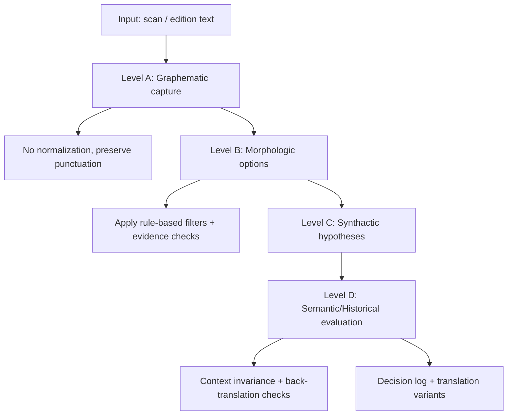

# Ge'ez Linguistic Analysis (A-D)

This repo supports a four-level linguistic pass designed for philological workflows:

- Level A (graphematic): capture the physical text state without normalization.
- Level B (morphologic): enumerate all morphological options per token.
- Level C (synthactic): enumerate all valid parses without disambiguation.
- Level D (semantic/historical): evaluate readings with attestation and explicit uncertainty.

Artifacts
- Schema: `data/schemas/gez_morphology.schema.json`
- POS tagset + function words: `engine/analysis/tagsets/gez_pos_1.json`
- Filter script: `engine/workers/geez_morphology_filter.py`
- Rule engine: `engine/analysis/rules/rule_engine.py`
- Pipeline runner: `engine/run_pipeline.py` (usage in `README_pipeline.md`)

Filter CLI (examples)
```bash
python engine/workers/geez_morphology_filter.py --input input.json --output filtered.json --report filter_report.json
python engine/workers/geez_morphology_filter.py --input input.json --output filtered.json --drop-ruled-out
```

Pipeline Diagram

